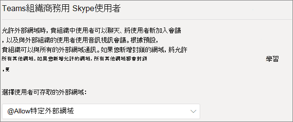
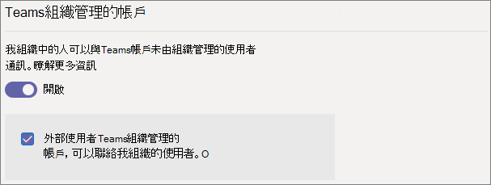
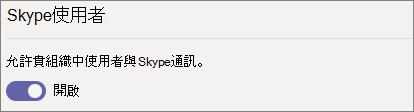

# <a name="manage-external-meetings-and-chat-in-microsoft-teams"></a>在 Microsoft Teams 中管理外部會議和聊天

您可以使用 *外部存取* 功能，設定在 Teams 中的外部會議和聊天。 外部存取是一種讓組織外部的 Teams 使用者在 Teams 中尋找、通話、聊天及設定會議的方式。 您也可以使用外部存取，與來自其他組織、仍在使用商務用 Skype (線上或內部部署) 及 Skype 的人員通訊。

如果您希望其他組織的人能夠存取您的小組和頻道，請改為使用來賓存取。 如需外部存取和來賓存取之間差異的詳細資訊，請參閱[比較外部和來賓存取](communicate-with-users-from-other-organizations.md#compare-external-and-guest-access)。 

使用外部存取的時機：
  
- You have users in external domains who need to chat. For example, Rob@contoso.com and Ann@northwindtraders.com are working on a project together along with some others in the contoso.com and northwindtraders.com domains.

- 您希望組織中的人員能夠使用 Teams 與組織外部特定公司的人員連絡。

- 您希望全球的任何其他 Teams 使用者能夠利用您的電子郵件地址找到您並與您連絡。 

## <a name="plan-for-external-meetings-and-chat"></a>外部會議和聊天的計畫

外部存取原則包括組織與使用者層級中的控制項。 在組織層級關閉原則會對所有使用者關閉，無論其使用者層級設為何。 預設會啟用所有外部存取設定。

Teams 系統管理中心會控制組織層級的外部存取權。 大部分選項 (網域限制除外) 可在使用者層級使用 PowerShell。 請參閱下方的 [使用 PowerShell](#using-powershell) 以瞭解更多資訊。

> [!NOTE]
> Microsoft 365 和 Office 365 政府版) 等不同雲端環境 (之間的外部存取需要 Teams 的外部 DNS 記錄。 如需詳細資訊，請參閱 [Teams 所需的外部 DNS 記錄](/microsoft-365/enterprise/external-domain-name-system-records#external-dns-records-required-for-teams)。

> [!NOTE]
> If you turn off external access in your organization, people outside your organization can still join meetings through anonymous join. To learn more, see [Manage meeting settings in Teams](meeting-settings-in-teams.md).

> [!NOTE]
> Teams 使用者可以在主持會議或與其他組織人員聊天時新增應用程式。 當他們加入由其他組織主持的會議或聊天時，他們也可以使用由其他組織人員共用的應用程式。 將會套用託管使用者組織的資料原則，以及該使用者組織共用的任何協力廠商應用程式的資料共用做法。

## <a name="specify-trusted-organizations"></a>指定信任的組織

您可以允許或封鎖特定網域，以定義貴組織對於外部會議和聊天所信任的組織。  (請注意，其他組織也必須允許貴組織的網域。) 

如果您新增封鎖網域，將允許所有其他網域；如果您新增允許網域，所有其他網域都會遭到封鎖。 此規則的例外為是否在會議中允許匿名參與者。 在 Teams 系統管理中心設定外部存取有四種案例 (**使用者** > **外部存取**):

- **允許所有外部網域**：這是 Teams 中的預設設定，可讓貴組織人員尋找、通話、聊天，以及設定與貴組織外部人員在任何網域中的會議。

    在這種情況下，只要其他租用戶也支援外部通訊，您的使用者就可以與 Teams 或商務用 Skype 的所有外部網域通訊。
    
- **只允許特定外部網域**：將網域新增至 **允許** 清單中，可限制外部存取只能存取允許的網域。 一旦您設定了允許網域的清單，所有其他網域都會遭到封鎖。 

- **封鎖特定網域** - 透過將網域新增至 [封鎖] 清單，您可以與封鎖網域「以外」的所有外部網域通訊。  一旦您設定了封鎖網域的清單，就會允許所有其他網域。

- **封鎖所有外部網域** - 防止貴組織內部人員在任何網域中尋找、通話、聊天及設定與組織外部人員的會議。

> [!NOTE]
> 如果允許匿名存取，來自封鎖網域的人員仍可匿名加入會議。



**使用 Microsoft Teams 系統管理中心**

允許特定網域

1. 在 Teams 系統管理中心中，前往 **[使用者]** > **[外部存取]**。

2. 在 **[選擇您的使用者可以存取的網域]** 下，選擇 **[僅允許特定的外部網域]**。

3. 選取 **[允許網域]**。

4. 在 **[網域]** 方塊中，輸入您想要允許的網域，然後按一下 **[完成]**。

5. 如果您想要允許另一個網域，請按一下 **[加入網域]**。

6. 按一下 [儲存]。

封鎖特定網域

1. 在 Teams 系統管理中心中，前往 **[使用者]** > **[外部存取]**。

2. 在 **[選擇您的使用者可以存取的網域]** 下，選擇 **[只封鎖特定外部網域]**。

3. 選取 **[封鎖網域]**。

4. 在 **[網域]** 方塊中，輸入您想要允許的網域，然後按一下 **[完成]**。

5. 如果您想要封鎖另一個網域，請按一下 **[加入網域]**。

6. 按一下 [儲存]。

若要與其他租用戶通訊，他們必須啟用 **[允許所有外部網域]**，或按照上述相同的步驟，將啟用新增到允許的網域清單中。  

## <a name="manage-contact-with-external-teams-users-not-managed-by-an-organization"></a>管理與未由組織管理的外部 Teams 使用者的連繫

> [!NOTE]
> 此文章討論的 Teams 和 Skype 互通功能不適用於 GCC、GCC High 或 DOD 部署，或在私人雲端環境中。

系統管理員可以選擇啟用或停用與未受組織管理 (「未受管理」) 的外部 Teams 使用者的通訊。 如果已啟用，他們也可以進一步控制具有未由組織管理的 Teams 帳戶人員是否能主動聯繫 (請參閱下列影像)。 如果 **未由組織管理的 Teams 帳戶的外部使用者可以與組織中的使用者聯繫** 已關閉，則未受管理的 Teams 使用者將無法搜尋完整的電子郵件地址，以尋找組織連絡人，且與未受管理的 Teams 使用者進行的所有通訊必須由組織使用者發起。

在 Teams 系統管理中心中，前往 **[使用者]** > **[外部存取]**。



若要禁止貴組織的 Teams 使用者與未由組織管理帳戶的外部 Teams 使用者通訊:

1. 關閉 **組織中人員可以與帳戶未由組織管理的 Teams 使用者通訊** 的設定。
2. 清除 **未由組織管理之 Teams 帳戶的外部使用者可以與組織中的使用者聯繫** 核取方塊。

若要讓貴組織中 Teams 的使用者與未由組織管理的外部 Teams 使用者通訊，如果您的 Teams 使用者已啟動連繫:

1. 開啟 **組織中人員可以與未由組織管理的 Teams 使用者通訊** 設定。
2. 清除 **未由組織管理之 Teams 帳戶的外部使用者可以與組織中的使用者聯繫** 核取方塊。

若要讓您的組織的 Teams 使用者與帳戶未受組織管理的外部 Teams 使用者通訊，並收到與這些外部 Teams 使用者通訊的要求：

1. 開啟 **組織中人員可以與未由組織管理的 Teams 使用者通訊** 設定。
2. 選取 **具有未由組織管理的 Teams 帳戶的外部使用者可以與組織中的使用者聯繫** 核取方塊。

## <a name="communicate-with-skype-users"></a>與 Skype 使用者通訊

請按照這些步驟，讓貴組織的 Teams 使用者可以和 Skype 使用者聊天和通話。 Teams 使用者便可以搜尋 Skype 使用者，並開始一對一的純文字交談或進行音訊/視訊通話，反之亦然。



### <a name="using-the-microsoft-teams-admin-center"></a>使用 Microsoft Teams 系統管理中心

1. 在左側導覽中，移至 **[使用者]** > **[外部存取]**.

2. 開啟 **[允許組織中的使用者與 Skype 使用者通訊]** 設定。

若要深入瞭解 Teams 使用者和 Skype 使用者的通訊方式 (包括通訊的限制)，請參閱 [Teams 和 Skype 的互通性](teams-skype-interop.md)。

### <a name="using-powershell"></a>使用 PowerShell

組織層級設定可以使用 [Set-CSTenantFederationConfiguration](/powershell/module/skype/set-cstenantfederationconfiguration) 設定，而使用者層級設定可以使用 [Set-CsExternalAccessPolicy](/powershell/module/skype/set-csexternalaccesspolicy) 設定。

下表顯示用來設定同盟的 Cmdlet 參數。

|設定|組織層級 (Set-CSTenantFederationConfiguration)|使用者層級 (Set-CsExternalAccessPolicy)|
|:-------|:--------|:------------------|
|啟用/停用與其他 Teams 組織及商務用 Skype 的同盟|`-AllowFederatedUsers`|`-EnableFederationAccess`|
|啟用與特定網域的同盟|`-AllowedDomains`|無法使用|
|停用與特定網域的同盟|`-BlockedDomains`|無法使用|
|啟用/停用未由組織管理的 Teams 使用者的同盟|`-AllowTeamsConsumer`|`-EnableTeamsConsumerAccess`|
|啟用/停用未由組織管理的 Teams 使用者啟動交談|`-AllowTeamsConsumerInbound`|`-EnableTeamsConsumerInbound`|
|啟用/停用與 Skype 的同盟|`-AllowPublicUsers`|`-EnablePublicCloudAccess`|

請務必注意，停用從租用戶到使用者的「滾落」原則。 例如：

```PowerShell
Set-CsTenantFederationConfiguration -AllowFederatedUsers $false
Set-CsExternalAccessPolicy -EnableFederationAccess $true
```

在此範例中，雖然已啟用使用者層級原則，但使用者無法與受管理的 Teams 使用者或 商務用 Skype 使用者通訊，因為組織層級已關閉這類同盟。 因此，如果您想要為部分使用者啟用這些控制項，您必須在組織層級開啟控制項，並建立兩個群組原則 - 一個適用於應該關閉控制項的使用者，另一個適用於應該開啟控制項的使用者。

## <a name="limit-external-access-to-specific-people"></a>將外部存取限制為特定人員

如果您已啟用組織層級的任何外部存取控制，您可以使用 PowerShell 將外部存取許可權限制於特定使用者。

您可以使用下列範例指令碼，將 *控制項* 改成要變更的控制項、針對要提供該原則的名稱使用 *PolicyName*，以及針對要啟用/停用外部存取的每個使用者使用 *UserName*。

執行指令碼之前，請確定已安裝 [Microsoft Teams PowerShell 模組](/microsoftteams/teams-powershell-install)。

```PowerShell
Connect-MicrosoftTeams

# Disable external access globally
Set-CsExternalAccessPolicy -<Control> $false

# Create a new external access policy
New-CsExternalAccessPolicy -Identity <PolicyName> -<Control> $true

# Assign users to the policy
$users_ids = @("<UserName1>", "<UserName2>")
New-CsBatchPolicyAssignmentOperation -PolicyType ExternalAccessPolicy -PolicyName "<PolicyName>" -Identity $users_ids

```

例如，啟用與未由組織管理的外部 Teams 使用者的通訊:

```PowerShell
Connect-MicrosoftTeams

Set-CsExternalAccessPolicy -EnableTeamsConsumerAccess $false

New-CsExternalAccessPolicy -Identity ContosoExternalAccess -EnableTeamsConsumerAccess $true

$users_ids = @("MeganB@contoso.com", "AlexW@contoso.com")
New-CsBatchPolicyAssignmentOperation -PolicyType ExternalAccessPolicy -PolicyName "ContosoExternalAccess" -Identity $users_ids

```

如需如何編譯使用者清單的其他範例，請參閱 [New-CsBatchPolicyAssignmentOperation](/powershell/module/teams/new-csbatchpolicyassignmentoperation)。

您可以執行 `Get-CsExternalAccessPolicy` 來查看新原則。

另請參閱 [New-CsExternalAccessPolicy](/powershell/module/skype/new-csexternalaccesspolicy) 和 [Set-CsExternalAccessPolicy](/powershell/module/skype/set-csexternalaccesspolicy)。

## <a name="common-external-access-scenarios"></a>常見的外部存取案例

下列各節說明如何針對常見的外部存取案例啟用同盟，以及 TeamsUpgradePolicy 如何決定傳入聊天和通話的傳遞。

### <a name="enable-federation-between-users-in-your-organization-and-other-organizations"></a>在您的組織中的使用者與其他組織使用者之間啟用同盟

若要讓組織的使用者與另一個組織的使用者通訊，這兩個組織都必須啟用同盟。 為指定組織啟用同盟的步驟取決於組織是純線上、混合式或純內部部署。

| 如果您的組織為 | 如下所示啟用同盟 |
|:---------|:-----------------------|
|線上，沒有商務用 Skype 內部部署。 這包括具有 TeamsOnly 使用者和/或商務用 Skype Online 使用者的組織。| 如果使用 Teams 系統管理中心： <br>- 確定您要與其通訊的網域允許外部存取。<br><br>如果使用 PowerShell：<br>- 確保租用戶已啟用同盟：`Get-CsTenantFederationConfiguration` 必須顯示 `AllowFederatedUsers=true`。 <br>- 確保使用者的有效值 `CsExternalAccessPolicy` 具有 `EnableFederationAccess=true`。<br>- 如果您未使用開放式同盟，請確定目標網域已列在 `CsTenantFederationConfiguration` 的 `AllowedDomains` 中。 |
|僅限內部部署| 在內部部署工具中： <br>- 確保已在 `CsAccessEdgeConfiguration` 中啟用同盟。<br>- 確保已透過 `ExternalAccessPolicy` 啟用使用者的同盟 (透過全域原則、網站原則或使用者指派的原則)。 <br> - 如果您未使用開放式同盟，請確定目標網域已列在 `AllowedDomains`。|
|混合式，部分使用者在線上 (在商務用 Skype 或 Teams 中) 和部分使用者在內部部署。 | 針對線上和內部部署組織遵循上述步驟。 |

### <a name="delivery-of-incoming-chats-and-calls"></a>傳入聊天和通話的傳遞 

根據收件者使用者在 TeamsUpgradePolicy 中的模式，來自同盟組織的傳入聊天和通話會抵達使用者的 Teams 或商務用 Skype 用戶端。

| 如果您想要 | 執行此動作： |
|:---------|:-----------------------|
|確保傳入的同盟聊天和通話抵達使用者的 Teams 用戶端:|將使用者設定為 TeamsOnly。
|確保傳入的同盟聊天和通話抵達使用者的商務用 Skype 用戶端|將使用者設定為 TeamsOnly 外的任何模式。|

### <a name="enable-federation-between-users-in-your-organization-and-unmanaged-teams-users"></a>啟用貴組織中使用者與未受管理 Teams 使用者之間的同盟

若要在您的組織中的使用者與未受管理的 Teams 使用者之間啟用同盟:

| 如果您的組織為 | 如下所示啟用同盟 |
|:---------|:-----------------------|
|線上，沒有商務用 Skype 內部部署。 這包括具有僅限 Teams 使用者和/或商務用 Skype Online 使用者的組織。| 如果使用 Teams 系統管理中心:<br>-確定 **我的組織中的人員可以與帳戶未由組織管理的 Teams 使用者通訊** 已在 **[外部存取]** 中啟用。<br>-如果您希望由未受管理的 Teams 帳戶啟動聊天，請勾選 **未由組織管理之 Teams 帳戶的外部使用者可以與我的組織的使用者聯繫** 核取方塊。<br><br>如果使用 PowerShell：<br>- 確保租用戶已啟用同盟：`Get-CsTenantFederationConfiguration` 必須顯示 `AllowTeamsConsumer=true`。<br>-確保使用者的有效值 `CsExternalAccessPolicy` 具有 `EnableTeamsConsumerAccess=true`。<br>-確保已啟用租用戶，讓未受管理的使用者啟動聊天: `Get-CsTenantFederationConfiguration` 必須顯示 `AllowTeamsConsumerInbound=true`。<br>-確保使用者的有效值 `CsExternalAccessPolicy` 具有 `EnableTeamsConsumerInbound=true`。|
|僅限內部部署| 僅限內部部署的組織不支援與未受管理的 Teams 使用者聊天。|
|混合式，部分使用者在線上 (在商務用 Skype 或 Teams 中) 和部分使用者在內部部署。 | 請遵循先前所述的線上組織步驟。 請注意，內部部署使用者不支援與未受管理的 Teams 使用者聊天。|

> [!IMPORTANT]
> You don't have to add any **Teams domains** as allowed domains in order to enable Teams users to communicate with unmanaged Teams users outside your organization. All **unamanged Teams domains** are allowed.

### <a name="enable-federation-between-users-in-your-organization-and-consumer-users-of-skype"></a>在您的組織中的使用者與 Skype 消費者使用者之間啟用同盟

若要在您的組織中的使用者與 Skype 消費者使用者之間啟用同盟：

| 如果您的組織為 | 如下所示啟用消費者同盟 |
|:---------|:-----------------------|
|僅限線上，沒有商務用 Skype 內部部署。 這包括具有 TeamsOnly 使用者和/或商務用 Skype Online 使用者的組織。 | 如果使用 Teams 系統管理中心： <br>-確定 **[允許我組織的使用者與 Skype 使用者通訊]** 在外部存取中啟用。<br><br>如果使用 PowerShell： <br>- 確保租用戶已啟用同盟：`Get-CsTenantFederationConfiguration` 必須顯示 `AllowPublicUsers=true`。 <br> - 確保使用者的有效值 `CsExternalAccessPolicy` 具有 `EnablePublicCloudAccess=true`。 |
|僅限內部部署| 在內部部署工具中： <br> - 確保 Skype 已啟用為同盟合作夥伴。 <br> - 確保使用者的 `EnablePublicCloudAccess=true` 透過 `ExternalAccessPolicy` (透過全域原則、網站原則或使用者指派的原則)。|
| 混合式，部分使用者在線上 (在商務用 Skype 或 Teams 中) 和部分使用者在內部部署。| 針對線上和內部部署組織遵循上述步驟。

> [!IMPORTANT]
> You don't have to add any **Skype domains** as allowed domains in order to enable Teams or Skype for Business Online users to communicate with Skype users inside or outside your organization. All **Skype domains** are allowed.

## <a name="federation-diagnostic-tool"></a>同盟診斷工具

如果您是系統管理員，可以使用下列診斷工具驗證可與同盟 Teams 使用者進行通訊的 Teams 使用者：

1. 選取 [執行測試]**** 以在 Microsoft 365 系統管理中心填入診斷。 

   > [!div class="nextstepaction"]
   > [執行測試: Teams 同盟](https://aka.ms/TeamsFederationDiag)

2. 在執行診斷窗格中，輸入 **工作階段初始化通訊協定 (SIP) 位址** 和 **同盟租用戶的網域名稱**，然後選取 [執行測試 **]**。

3. 測試會傳回解決任何防止與同盟使用者通訊之租用戶或原則設定的最佳下一個步驟。

## <a name="user-level-controls"></a>使用者層級控制項

當使用者收到來自組織外部人員的一對一聊天時，他們會獲得全螢幕體驗，讓他們可以選擇 **預覽** 訊息、 **接受** 聊天或 **封鎖** 傳送聊天的人員。

您可以在 Teams 內的多個位置封鎖外部人員，包括聊天清單上) 的 ( ...) 功能表，以及人員卡片上 (的 **...) 功能表**。 使用者也可以透過聊天清單上的 (**...) 功能表**、人員卡片上 (的 **...) 功能表**，或流覽 [**設定**  >  **封鎖的連絡人****編輯封鎖的連絡人**  >  ] 來解除封鎖外部人員。 郵件傳送之前或之後，都可以使用封鎖功能。

封鎖外部人員可防止他們在一對一聊天中傳送訊息、將使用者新增至新的群組聊天，以及檢視他們的目前狀態。 當封鎖群組聊天邀請時，封鎖的使用者可以和封鎖這些邀請的使用者在同一個聊天中，因為該聊天是在封鎖之前啟動，或是群組聊天邀請是由其他成員傳送。

> [!NOTE]
> 沒有 Teams 系統管理員設定或原則可控制使用者封鎖與外部人員聊天的能力。

## <a name="related-topics"></a>相關主題

[外部 (同盟) 使用者的原生聊天體驗](native-chat-for-external-users.md)
