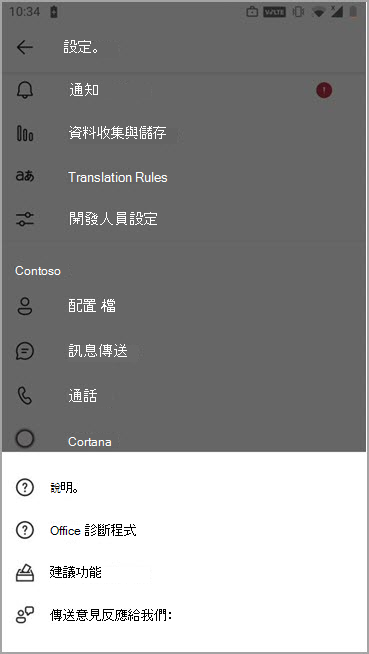

# <a name="manage-feedback-policies-in-microsoft-teams"></a>在 Microsoft Teams 中管理意見反應原則

貴組織中的使用者可以傳送有關 Microsoft Teams 的意見反應，讓我們知道我們如何直接從 Teams 桌上型電腦、Web 用戶端和行動裝置中進行。 我們持續改善 Teams 體驗，並使用此意見反應讓 Teams 變得更好。

> [!NOTE]
> 意見反應原則不適用於 GCC、GCC High 或 DOD 部署。

****提供意見反應** 功能**

使用者可以 **移至**  >  [**在 Teams** 電腦版和網頁版中提供意見反應] 來傳送 Teams 的相關意見與建議給我們。


使用 [**設定**  >  說明] 存取行動裝置上的意見 **反應&意見**  >  **反應傳送意見反應**。



 根據您的 Microsoft 365 或Office 365合約，透過 **提供意見** 反應和 **傳送意見** 反應傳送的資料會被視為「支援資料」，包括其他會被視為「客戶資料」或「個人資料」的資訊。


**調查**

使用者也可以為 Teams 體驗評分，並傳送評分的詳細資料給我們。 這個彈出式問卷會在 Teams 中不時向使用者顯示。 當使用者在通知中選取 **[提供意見** 反應] 時，系統會顯示問卷以供他們完成。


## <a name="set-whether-users-can-send-feedback-about-teams-to-microsoft"></a>設定使用者是否可以傳送 Teams 相關意見反應給 Microsoft

身為系統管理員，您可以控制組織中的使用者是否可以將 Teams 相關的意見反應傳送給 Microsoft，以及他們是否收到問卷。 根據預設，貴組織中的所有使用者都會自動獲派全組織 (預設) 原則，並在原則中啟用意見反應功能和問卷調查。 Teams 教育版例外，其中的功能會為教師啟用，並為學生停用。

您可以編輯全域原則，或建立及指派自訂原則。 編輯全域原則或指派自訂原則之後，可能需要幾個小時，變更才會生效。

例如，假設您想要允許組織中的所有使用者傳送意見反應並接收問卷，但訓練中的新進人員除外。 在此案例中，您可以建立自訂原則來關閉這兩項功能，並將它指派給新進人員。 貴組織中的所有其他使用者都會取得已開啟功能的全域原則。  

您可以使用 PowerShell 管理意見反應原則。 使用 [ **New-CsTeamsFeedbackPolicy** Cmdlet](/office365/enterprise/powershell/manage-skype-for-business-online-with-office-365-powershell)建立自訂原則。 使用 **Grant-CsTeamsFeedbackPolicy** Cmdlet 將它指派給一或多個使用者或使用者群組，例如安全性群組或通訊群組。 使用 **Set-CsTeamsFeedbackPolicy** 來設定特定標幟。

若要關閉並開啟功能，請設定下列參數：

 - **提供意見反應**：將 **userInitiatedMode** 參數 **設定為啟用** ，以允許獲派原則的使用者提供意見反應。 將參數設定為 **停** 用會關閉功能，而獲指派原則的使用者則沒有提供意見反應的選項。

 - **問卷**：將 **ReceiveSurveysMode** 參數 **設定為啟用** ，以允許獲派原則的使用者接收問卷。 若要讓使用者收到問卷並允許他們退出宣告，請將參數設定為 **enabledUserOverride**。 在 Teams 中，使用者可以接著移至 **[設定**  >  **隱私權**]，並選擇是否要參與問卷調查。 將參數設定為 **停** 用會關閉此功能，而獲指派原則的使用者將不會收到問卷調查。

 - **電子郵件**：使用 **AllowEmailCollection** 標幟來新增電子郵件欄位。
 - **記錄收集**：使用 **AllowLogCollection** 標幟為使用者新增記錄集合加入宣告。 記錄收集功能目前僅在行動裝置上啟用。 如需有關透過記錄共用哪些資料的詳細資料，請 [深入瞭解](https://go.microsoft.com/fwlink/?linkid=2168178)。

## <a name="create-a-custom-feedback-policy"></a>建立自訂意見反應原則

在此範例中，我們建立了稱為「新進員工意見反應原則」的意見反應原則，並透過提供意見 **反應和問卷** 調查來關閉提供意見反應的能力。

```PowerShell
New-CsTeamsFeedbackPolicy -identity "New Hire Feedback Policy" -userInitiatedMode disabled -receiveSurveysMode disabled
```

## <a name="assign-a-custom-feedback-policy-to-users"></a>指派自訂意見反應原則給使用者

[!INCLUDE [assign-policy](includes/assign-policy.md)]

在此範例中，我們指派名為 New Hire Feedback Policy 的自訂原則給名為 user1 的使用者。

```PowerShell
Grant-CsTeamsFeedbackPolicy -Identity user1@contoso.com -PolicyName "New Hire Feedback Policy"
```

## <a name="related-topics"></a>相關主題

- [Teams PowerShell 概觀](teams-powershell-overview.md)
- [將原則指派給 Teams 中的使用者](policy-assignment-overview.md)
