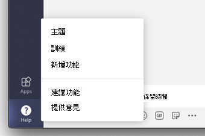

# <a name="manage-feedback-policies-in-microsoft-teams"></a>管理意見Microsoft Teams

[!INCLUDE [preview-feature](includes/preview-feature.md)]

貴組織的使用者可以直接在桌面Teams用戶端內傳送有關您帳戶的意見Teams Microsoft 告訴我們我們目前的工作。 我們會持續改善Teams體驗，並使用此意見Teams改善。

> [!NOTE]
> 意見回饋政策不適用於 GCC 高GCC或 DOD 部署。

**提供意見回饋功能**

使用者可以在 Teams 中協助提供意見  >  **** Teams。 透過提供 **意見** 回饋所送出的資料，Microsoft 365或Office 365視為「支援資料」，包括否則會視為「客戶資料」或「個人資料」的資訊。



**調查**

使用者也可以評等他們Teams，並傳送他們給予評等的詳細資訊給我們。 此快顯視窗問卷會以即時方式顯示在 Teams。 當使用者在 **通知中選取** 提供意見回饋時，系統會顯示問卷供他們完成。


## <a name="set-whether-users-can-send-feedback-about-teams-to-microsoft"></a>設定使用者是否可以傳送關於Teams的意見

做為系統管理員，您可以控制貴組織的使用者是否可透過提供意見Teams意見，以及使用者是否收到問卷，將有關資料的意見回饋傳送給 Microsoft。 根據預設，貴組織中的所有使用者都會自動指派全域 (全組織的預設) 政策，且系統會在該政策中啟用提供意見回饋功能與問卷。 例外是Teams 教育版，其中功能為教師啟用，學生則停用。

您可以編輯全域原則，或建立及指派自訂策略。 編輯全域原則或指派自訂策略之後，可能需要幾個小時，變更才能生效。

例如，假設您想要允許貴組織的所有使用者透過提供意見回饋傳送意見，並接收問卷，但訓練中的新員工除外。 在此情境中，您建立自訂政策以關閉這兩項功能，並將它指派給新員工。 貴組織的所有其他使用者會開啟功能，以取得全域原則。  

您可以使用 PowerShell 管理意見回饋政策。 使用 **New-CsTeamsFeedbackPolicy** Cmdlet *[](https://docs.microsoft.com/office365/enterprise/powershell/manage-skype-for-business-online-with-office-365-powershell)*，您可以在這裡找到它，以建立自訂策略。 使用 **Grant-CsTeamsFeedbackPolicy** Cmdlet 將其指派給一或多個使用者或使用者群組，例如安全性群組或通訊群組。 使用 **Set-CsTeamsFeedbackPolicy** 來設定特定標標。

若要關閉並開啟功能，請設定下列參數：

 - **提供意見回饋**：將 **UserInitiatedMode 參數** 設定為 **啟用** ，以允許指派策略的使用者提供意見回饋。 將 **參數設定為** 停用會關閉功能，而指派該策略的使用者沒有提供意見回饋的選項。
 - **問卷**：將 **receiveSurveysMode 參數** 設定為 **啟用** ，以允許獲派策略的使用者接收問卷。 若要讓使用者收到問卷並允許他們退出宣告，請設定參數以 **啟用UserOverride**。 在 Teams中，使用者可以前往  >  **設定，** 並選擇是否要參與問卷。 將參數設定為 **停用** 會關閉功能，而獲派該策略的使用者將不會收到問卷。
 - **電子郵件**：使用 **AllowEmailCollection 標** 號來新增電子郵件欄位。

## <a name="create-a-custom-feedback-policy"></a>建立自訂的意見回饋政策

在此範例中，我們建立稱為新進員工意見回饋政策的意見回饋政策，並關閉透過提供意見和問卷 **提供** 意見回饋的能力。

```PowerShell
New-CsTeamsFeedbackPolicy -identity "New Hire Feedback Policy" -userInitiatedMode disabled -receiveSurveysMode disabled
```

## <a name="assign-a-custom-feedback-policy-to-users"></a>指派自訂意見回饋政策給使用者

[!INCLUDE [assign-policy](includes/assign-policy.md)]

在此範例中，我們將名為新進員工的意見回饋政策指派給名為 user1 的使用者。

```PowerShell
Grant-CsTeamsFeedbackPolicy -Identity user1@contoso.com -PolicyName "New Hire Feedback Policy"
```

## <a name="related-topics"></a>相關主題

- [TeamsPowerShell 概觀](teams-powershell-overview.md)
- [在 Teams 中將原則指派給使用者](assign-policies.md)
