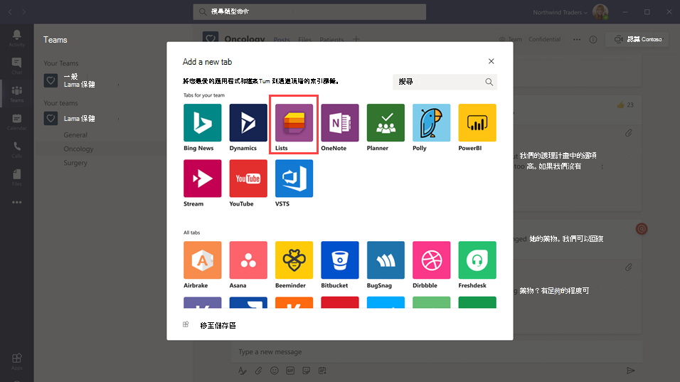
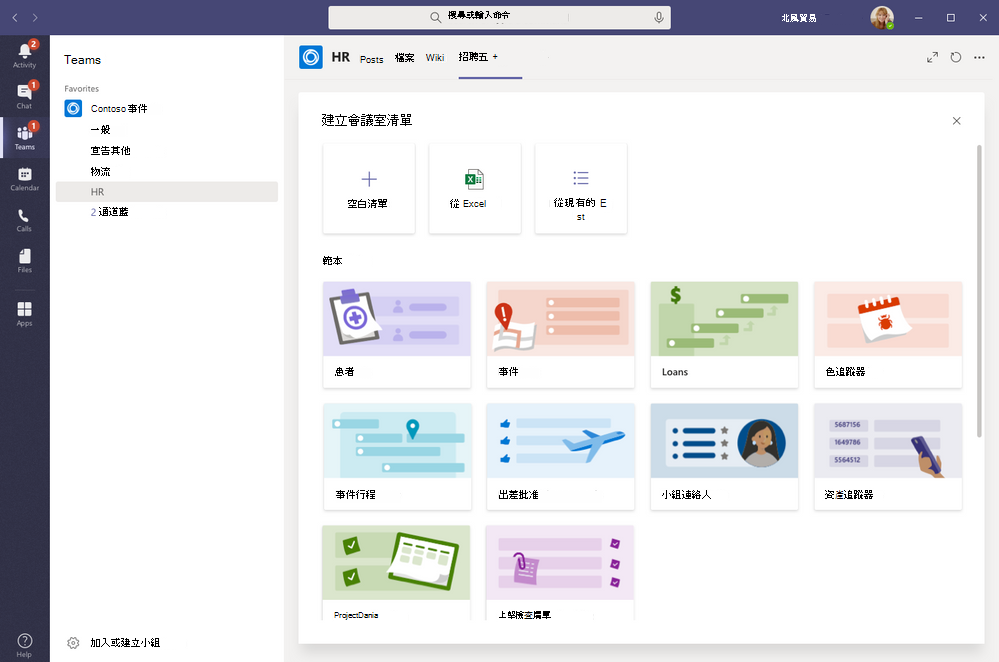

# 在 Microsoft Teams 中管理貴組織的 [清單] 應用程式

## [清單] 概觀

Microsoft Teams 中的 [清單] 應用程式可協助您的組織中的使用者追蹤資訊、整理工作及管理工作流程。 使用 [清單]，使用者可以使用可自訂的視圖、規則和警示來追蹤相關資料，例如問題、資產、例行會議、連絡人、庫存、事件、貸款、病人等，以保持團隊中的每個人同步。

在 Teams 中，使用者將 [清單] 視為頻道中的索引標籤加以存取。 選取 **+** 以開啟索引標籤庫，並將新的 [清單] 應用程式索引標籤實例新增至頻道以開始使用。

使用者可以建立新清單，或從同一小組內或他們有存取權的不同 SharePoint 網站釘選現有清單。 可根據現有清單的結構，或從 Excel 活頁簿匯入資料，以從頭、從內建範本來建立新清單。 [清單] 應用程式可在 Teams 的桌上型電腦、Web 和行動用戶端使用。

## 範本

[清單] 中的範本是針對使用者的常見資訊追蹤案例而量身打造的。 每個範本都有一組預先定義的清單結構、表單版面配置和格式設定選項 (清單視圖和詳細資料視圖層級)，可協助使用者快速開始使用。 選取範本之後，使用者會看到清單外觀的預覽，以及一些範例資料。 下列範例說明貴組織中的小組可如何使用 [清單] 中預先定義的範本：

- 使用 [問題追蹤器] 範本來追蹤問題並直到解決問題。
- 使用 [活動時間表] 範本來整理您所有的活動詳細資料。
- 您可以使用病人範本來記錄患者的需求和狀態，以便讓醫療保健組織中的健康小組監視和協調照護。
- 使用貸款範本來追蹤貸款申請的狀態。

## 範例案例

本地郵局負責在其地區中排序和傳送郵件。 每天早上，郵局都會有小組聚會來檢閱每日目標、分享公告，並討論已知的事件。

聚會之後，郵件運送人就會撿拾自己的郵件並啟動其遞送路線。 在遞送路線中可能會發生事件，例如車輛事故、狗相關的問題或社會動亂的抗議。 當郵件運送人遇到事件時，他們會利用其行動裝置上的 Teams 來記錄事件詳細資料，並透過小組頻道的清單追蹤。 小組中的每個人 (包括在外面的郵件運送人) 都能看到這項資訊並取得最新訊息。

在移至Teams之前，郵件電信業者必須返回郵局以完成硬複製表單以報告事件，該表單隨後已在Excel試算表中輸入。 Teams 先提供郵件運送人一個行動裝置，讓他們體會可以在何處使用 [清單] 來報告實地發生的事件、與小組成員分享事件詳細資料、在頻道中進行討論以及取得問題的解決方法。

## 必須知道的有關 [清單] 的事情

### 在每個小組和頻道中都可取得 [清單]

所有 Teams 使用者都會有預先安裝的 [清單]，且可直接在每個小組和頻道的索引標籤庫中取得。 這表示使用者不需要移至 Teams 應用程式市集就能安裝。

### [清單] 和 SharePoint

[清單] 資料會儲存在 SharePoint Online 小組網站中。 如需 SharePoint Online 與 Teams 如何互動的詳細資訊，請參閱 [Sharepoint Online 和商務用 OneDrive 如何與 Teams 互動](SharePoint-OneDrive-interact.md)。

在 SharePoint 中設定的權限會套用至 [清單] 應用程式中建立的清單。 根據預設，清單會繼承其所屬網站的權限。 這些權限會掌控使用者可以執行的動作類型，例如是否可建立或編輯清單。 若要深入瞭解，請參閱 [SharePoint 的權限等級](/sharepoint/understanding-permission-levels)以及 [SharePoint Server 中的使用者權限和權限等級](/sharepoint/sites/user-permissions-and-permission-levels)。

在某些情況下，您可能會想要限制使用者可以在清單中執行的動作。 例如，小組中的某人編輯清單視圖，使得所有小組成員的視圖都跟著改變，而您只想讓小組擁有者或特定小組成員可以編輯清單視圖。 若要深入瞭解，請參閱[自訂 SharePoint 清單或文件庫的權限](https://support.microsoft.com/office/customize-permissions-for-a-sharepoint-list-or-library-02d770f3-59eb-4910-a608-5f84cc297782#ID0EAACAAA=Online,_2019,_2016,_2013)。

> [!NOTE]
> 此時，小組中的擁有者和成員的權限不會以任何方式連結到小組網站中掌控清單行為或 [清單] 應用程式的權限。 不過，根據客戶的意見反應和使用狀況，我們會在產品的未來反覆項目中將此考慮在內。  

### 限制

使用者可使用 [清單] 獲得桌上型電腦、Web 和行動裝置的體驗。 請務必瞭解，使用者無法使用 Teams 行動用戶端的 [清單] 建立新清單，或釘選現有清單。 若要在 Teams 行動用戶端查看或編輯清單，必須先使用 Teams 桌面版或 Web 用戶端上的清單建立或新增清單。

訪客無法建立或刪除清單。他們可以將清單項目新增至現有清單、開始新的清單項目交談，以及回覆有關清單項目的現有交談。

### [清單] 和 SharePoint 應用程式

如果您的組織中的使用者使用 SharePoint 應用程式建立清單，這些清單將會自動移至清單應用程式，而不需要使用者執行任何動作。 若要在 Teams 中取得最豐富的清單整合體驗，請使用 [清單] 應用程式並釘選現有清單。

## 設定 [清單]

### 啟用或停用組織中的 [清單]

您的組織中的所有 Teams 使用者預設會啟用 [清單]。 您可以在 Microsoft Teams 系統管理中心的[管理應用程式](manage-apps.md)頁面上關閉或開啟組織層級的應用程式。

1. 在Microsoft Teams系統管理中心的左窗格中，移至 **Teams應用程式**  >  **管理應用程式。**
2. 執行下列其中一項：

    - 若要關閉貴組織的清單，請搜尋清單應用程式，選取它，然後選取 **[封鎖]**。
    - 若要開啟組織的清單，請搜尋清單應用程式，選取它，然後選取 [ **允許]**。

### 啟用或停用組織中特定使用者的 [清單]

若要允許或封鎖貴組織中的特定使用者使用 [清單]，請確定您的組織在[管理應用程式](manage-apps.md)頁面上已開啟 [清單]，然後建立自訂應用程式權限原則，並將其指派給這些使用者。 若要深入了解，請參閱[管理 Teams 中的應用程式權限原則](teams-app-permission-policies.md)。

## 搜尋清單活動的稽核記錄檔

清單會啟用企業層級稽核，讓您可以在安全性&合規性中心的稽核記錄中搜尋清單和清單專案事件。 若要深入了解，請參閱[搜尋安全性與合規性中心的稽核記錄檔](/microsoft-365/compliance/search-the-audit-log-in-security-and-compliance)。

如需和 Teams 中 [清單] 應用程式相關的稽核活動清單，請參閱 [SharePoint 清單活動](/microsoft-365/compliance/search-the-audit-log-in-security-and-compliance#sharepoint-list-activities)。

在您可以搜尋稽核記錄檔之前，您必須先在[安全性與合規性中心](https://protection.office.com)中開啟稽核。 請記住，只有當您開啟稽核時，才能使用稽核資料。

## Power Automate、Power Apps 和圖形 API

[清單] 支援工作流程的 [Power Automate](/power-automate/flow-types)以及清單表單 [Power Apps](/powerapps/maker/canvas-apps/customize-list-form) 。 開發人員可利用[清單 API](/sharepoint/dev/sp-add-ins/working-with-lists-and-list-items-with-rest) ，透過 Microsoft Graph 將清單資料連線為來源。

## 提供意見反應或回報問題
  
若要傳送意見反應給我們或回報問題 **，請選** 取Teams左窗格底部附近的 [說明]，然後選取 [**回報問題]**。 選取 **清單**，然後輸入您的意見反應或您所遇到問題的詳細資料。

## 相關文章

- [[清單] 說明文件](https://support.microsoft.com/office/apps-and-services-cc1fba57-9900-4634-8306-2360a40c665b#PickTab=Lists)
