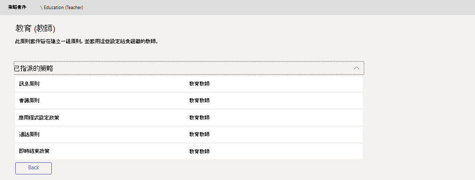

# 在中管理Microsoft Teams

Microsoft Teams 中的 原則套件 是預先定義的原則和原則設定的集合，您可以將之指派給組織中具有類似角色的使用者。 我們已建立策略套件，以簡化、簡化及協助在管理貴組織使用者群組之策略時提供一致性。  

您可以使用包含在其中[的政策套件Teams](#policy-packages-included-in-teams)[或建立您自己的自訂策略套件](#custom-policy-packages)。

:::image type="content" source="media/policy-packages-admin-center.png" alt-text="系統管理中心中策略套件頁面的螢幕擷取畫面":::

您可以自訂策略套件中之策略的設定，以適合您的使用者需求。 當您變更套件中之策略的設定時，指派給該套件的所有使用者會取得更新的設定。 您可以使用系統管理中心或 PowerShell 管理Microsoft Teams套件。

> [!NOTE]
> 每位使用者都需要 [進階通訊] 附加元件，才能接收自訂原則套件指派。 如需詳細資訊，請參閱 [Microsoft Teams 的進階通訊附加元件](/microsoftteams/teams-add-on-licensing/advanced-communications) (部分機器翻譯)。

## 什麼是策略套件？

策略套件可Teams貴組織特定人員集合所允許或限制的功能。 每個策略套件Teams使用者角色所設計，並包含預先定義的策略和策略設定，可支援該角色常見的共同合作與通訊活動。

策略套件支援下列Teams類型：

- 訊息原則
- 會議原則
- 應用程式設定政策
- 通話原則
- 即時活動原則

## 包含在 Teams

Teams目前包含下列策略套件。

| 套件名稱 | 描述 |
|---------|---------|
|教育 (高教學生)     |建立套用至高教學生的一組原則與原則設定。|
|教育 (中學生)    |建立套用至主要學生的一組原則與原則設定。|
|教育 (中學生)     |建立套用至中學生的一組原則與原則設定。         |
|教育 (教師)     |建立套用至教師的一組原則與原則設定。      |
|使用 (遠端學習工具的小學教師)     |建立適用於小學教師的一組原則，以便在使用遠端學習時將學生安全性和共同作業最大化。      |
|使用 (遠端學習的中學生)     |建立適用於學生的一組原則，以便在使用遠端學習時將學生安全性和共同作業最大化。      |
|前線管理員 |建立一組原則，並套用這些設定給貴組織的前線管理員。 |
|前線工作人員 |建立一組原則，並套用這些設定給貴組織的前線員工。 |
|醫療保健臨床工作者  |建立一組原則與原則設定，讓臨床工作者 (例如註冊的護士、護士長、醫生和社會工作者) 能完整存取聊天、通話、班次管理和會議。 |
|醫療保健資訊工作者  |建立一組原則與原則設定，讓資訊工作者 (例如 IT 人員、資訊人員、財務人員及法規人員) 能夠完整存取聊天、通話和會議。|
|醫療保健病房  |建立一組原則與原則設定，適用於貴醫療保健組織的病房。|
|中小企業使用者 (商務語音)  |建立包含商務語音體驗應用程式的應用程式設定策略。|
|中小企業使用者無需商務 (語音)  |建立與中小型企業相關的應用程式設定Teams使用者 (商務語音體驗) 。
|公共安全專員   |建立一組套套用至貴組織的公安人員之原則與原則設定。|

> [!NOTE]
> 我們會在未來發行新版中新增更多Teams套件，因此請回來查看最新資訊。  

每個個別原則都會被賦予原則套件的名稱，以便輕鬆識別連結至原則套件的原則。
例如，當您將教育 (教師) 政策套件指派給學校中的教師時，會針對套件中每個策略建立名為 Education_Teacher 的策略。

## 自訂策略套件

**系統尚未提供自訂政府社群雲端 (GCC)**

自訂策略套件讓您針對組織中具有類似角色的使用者，將您自己的一群組原則組合在一起。 新增您所需的策略類型與策略，以建立您自己的策略套件。

若要建立新的自訂策略套件：

1. 在系統管理中心的左側導Microsoft Teams，選取 [政策 **套件**，然後按一下 [**新增**。

    :::image type="content" source="media/policy-packages-add.png" alt-text="系統管理中心之策略套件頁面上的新增按鈕螢幕擷取畫面":::

2. 輸入套件的名稱和描述。

    :::image type="content" source="media/policy-packages-add-custom.png" alt-text="新增自訂策略套件的螢幕擷取畫面":::

3. 選取要納入套件中的策略類型和策略名稱。

4. 按一下 [儲存]。

## 如何使用策略套件

以下概述如何在貴組織中使用策略套件。

- **[查看](#view-the-settings-of-a-policy-in-a-policy-package)**：在策略套件中查看策略。 接著，在指派套件之前，先查看套件中每個策略的設定。 請確定您瞭解每個設定。 決定預先定義的值是否適合貴組織，或您是否需要根據貴組織的需求，將它們變更為較嚴格或寬鬆。

    如果刪除一個策略，您仍然可以查看設定，但無法變更任何設定。 當您指派策略套件時，會使用預先定義的設定重新建立已刪除的策略。

- **[自訂](#customize-policies-in-a-policy-package)**：自訂策略套件中的策略設定，以配合貴組織的需求。

- **[指派](#assign-a-policy-package)**：將策略套件指派給使用者。  

> [!NOTE]
> 您也可以在指派套件之後，變更策略套件中的策略設定。 您對原則設定所做的任何變更都會自動套用到已指派套件的使用者。

以下是如何在系統管理中心中查看、指派及自訂Microsoft Teams套件的步驟。

### 在策略套件中查看策略設定

1. 在系統管理中心的左側導Microsoft Teams，選取策略套件，然後按一下套件名稱左側以選取策略套件。

2. 按一下您想要查看的政策。

### 自訂策略套件中的策略

您可以透過策略套件頁面或直接到系統管理中心中的Microsoft Teams設定。

1. 在系統管理中心的左側導Microsoft Teams，執行下列其中一項操作：
    - 按一下 **[策略套件**，然後按一下套件名稱左側以選取該策略套件。
    - 按一下策略類型。  例如，按一下 **[訊息策略**> 。

2. 選取您想要編輯的政策。 連結至策略套件的策略與策略套件的名稱相同。

3. 進行您想要的變更，然後按一下 [ **儲存**。

### 指派策略套件

您可以將策略套件指派給個別使用者、群組或一批使用者。 若要瞭解如何指派策略套件，請參閱指派策略套件[給使用者和群組。](assign-policy-packages.md)

## 相關主題

- [指派策略套件](assign-policy-packages.md)
- [Teams EDU 系統管理員使用的政策套件](policy-packages-edu.md)
- [適用於醫療保健的 Teams 原則套件](policy-packages-healthcare.md)
- [Teams政府政策套件](policy-packages-gov.md)
