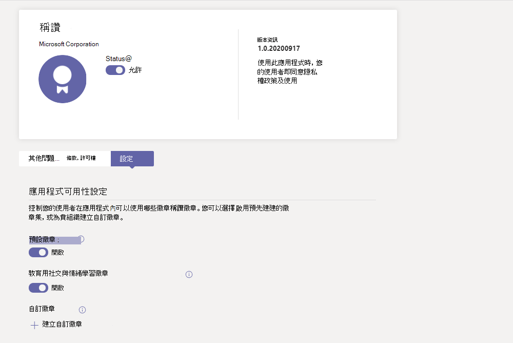
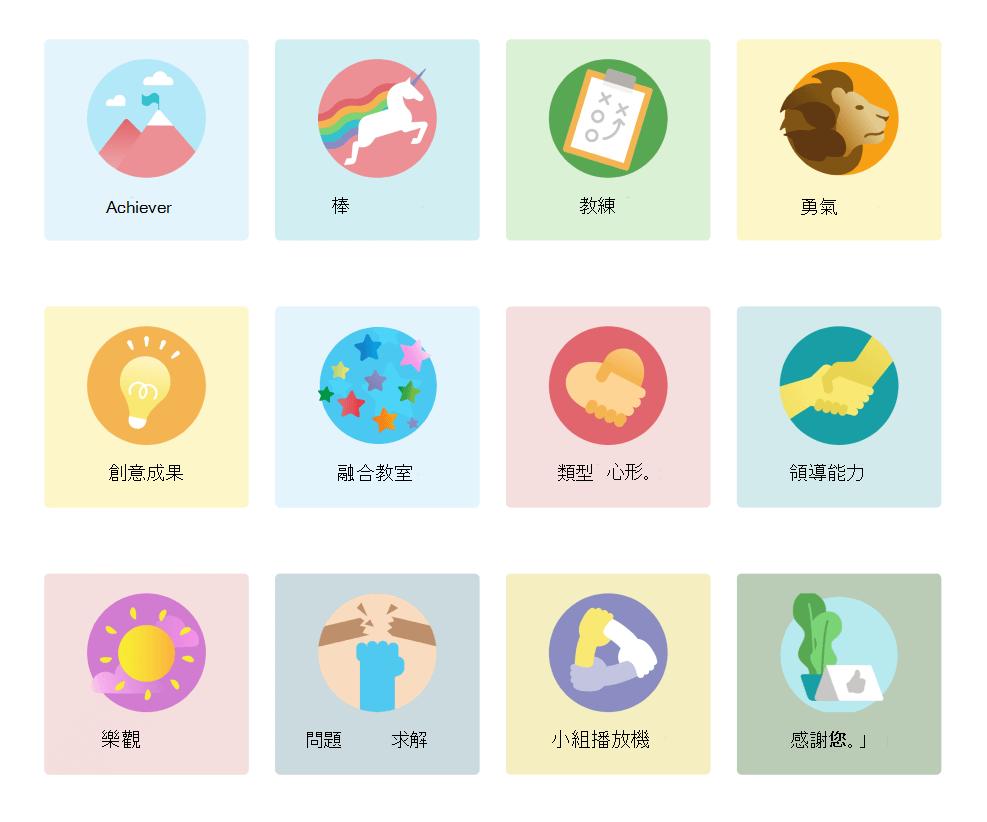
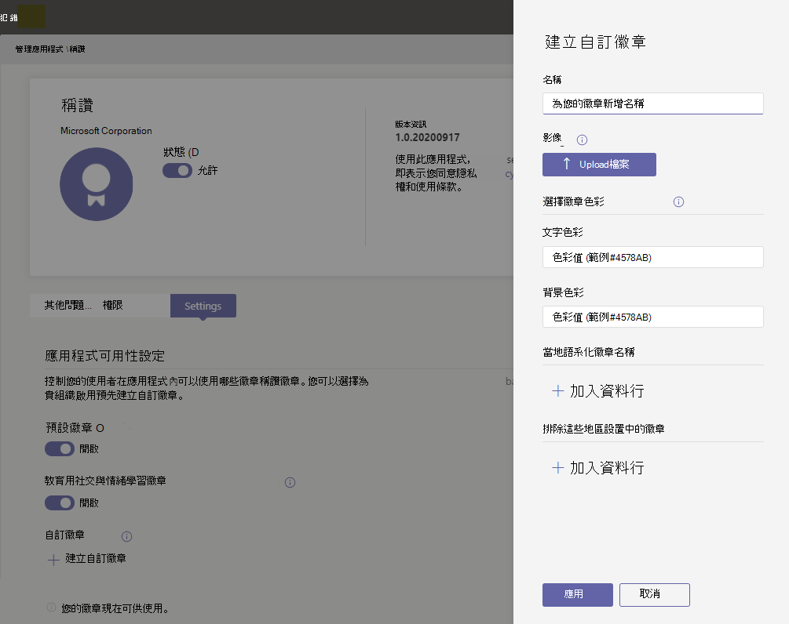
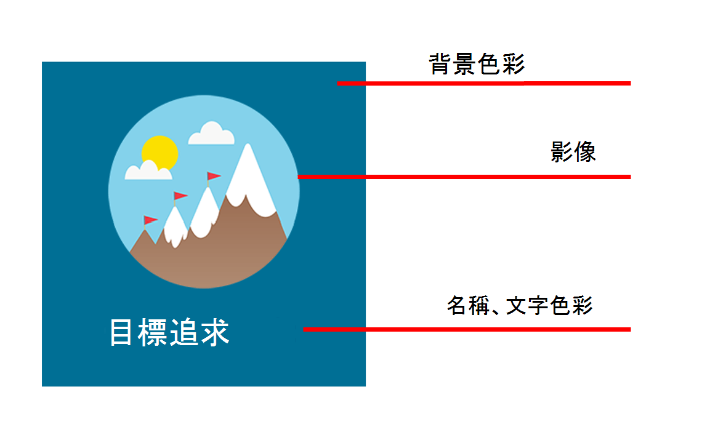

# 管理 稱讚 系統管理中心Microsoft Teams應用程式

> [!NOTE]
> 系統管理員必須擁有Teams才能存取此功能。 如果您嘗試在沒有授權的情況下存取Teams，就會收到錯誤訊息。

稱讚應用程式Microsoft Teams可協助使用者向組織或教室的成員表示感謝。 稱讚 提供一系列徽章供您選擇，以及建立您自己的徽章選項，可協助識別使用者從教育者到前線工作人員等Teams工作範圍。 若要深入瞭解，請查看傳送稱讚[給人員](https://support.microsoft.com/office/send-praise-to-people-50f26b47-565f-40fe-8642-5ca2a5ed261e)。

管理員可以從系統管理中心控制其組織Microsoft Teams徽章。 在左側流覽中，前往 **管理Teams應用程式>應用程式**。 在應用程式清單中 **，按一下**[稱讚，然後選取 **[設定。**  您可以在這裡選擇啟用預設和內建徽章集，以及建立自訂徽章。

> [!NOTE]
> 稱讚應用程式適用于雲端GCC，但不適用於高GCC DoD。

## 使用內建徽章集

內建套件是 Microsoft 針對應用程式所設計的徽章稱讚集合。 系統管理員無法編輯這些集。 預設徽章集已啟用，且可在 稱讚 App 中使用。 若要變更預設集或任何徽章集的可用性，請切換至開啟或關閉對應開關。 

<a name="default-badges"> </a>

### 預設徽章

預設徽章集是專為協助Teams使用者識別其同儕在工作之外所完成的工作。

<a name="sel-edu-badges"> </a>

### 教育用社交與情緒學習徽章

教育者可以在 SEL 中識別個別學生 (情緒學習) 徽章來說明這些概念的成果和行為。

<a name="create-your-own-badges"> </a>

## 建立您自己的徽章

選取 **建立自訂徽章**。 您可以從這裡在側邊面板中設計自訂徽章。 您最多可以建立 25 個自訂徽章。 

1. 輸入徽章名稱。 這是當使用者傳送稱讚時，徽章上會出現的名稱。

2. 設定徽章色彩。 若要設定徽章的文字和背景色彩，您必須輸入十六進位 (十六) 值。

   > [!TIP]
   > 如果您是十六進位值的新增者，本文包含一個快速簡介，以瞭解如何使用它們。

3. Upload徽章圖像。 已接受的檔案類型.PNG。 影像檔案必須小於 40 KB，最大尺寸為 216 X 216 圖元。

4. 將徽章名稱當地語系化：在當地語系化徽章 **名稱下****，選取** 新增 。 從下拉式清單中選取所需的地區設置。 然後以指定的語言輸入徽章名稱。

5. 將徽章排除在特定的地區設置中：在排除這些地區設置中的徽章 **下，選取****新增**。 從下拉式清單中選取要排除的地區設置。

6. 選取 **Apply**。 您的新徽章現在會出現在自訂徽章表格中。

> [!NOTE]
> 如果略過步驟 4 和 5，徽章會以所有地區設置的預設語言顯示。
>
> 完成徽章選取範圍變更之後，請務必選取 **提交**。 貴組織可能需要幾個小時的時間才能使用這些變更。

<a name="hex-colors-intro"> </a>

## 使用十六進位值指定色彩

十六進位色彩值是六個十六進位位數的字串，代表以 00 到 FF 為刻度的紅色 (RR) 、綠色 (GG) 和藍色 (BB) 。 當您將三種色彩的值放在一起時，您得到一個十六進位值：#RRGGBB

例如，紅色色彩的十六進位值為 #FF0000因為紅色設定為可能的最高值，因此 FF，而綠色和藍色則分別設定在最低可能值 00。

若要探索不同的色彩及其十六進位值，請查看Bing[選擇器](https://www.bing.com/search?q=color+picker)。

以下是可開始使用的範例色彩清單：

|顏色  |十六進位值|
|-------|---------|
||  #FF6666   |
||  #7FFFD4   |
||  #FF75F0   |
||  #00BFFF   |
||  #800080   |
||  #000000   |

<a name="best-practices"> </a>

## 建立自訂徽章的最佳作法

**一次提交所有徽章。** 由於處理新徽章需要一段時間，因此在提交徽章之前，最好先新增所有自訂徽章至表格。

**選擇色彩時，請記住協助工具。** 有些色彩比其他色彩更一致。  在文字和背景色彩之間建立對比，讓徽章名稱易於閱讀。 例如，如果您選擇深色背景色彩，請選擇淺色文字色彩。

**選取影像時，請記住徽章尺寸。** 為了獲得最佳品質，建議您上傳 216 x 216 圖元的影像檔案 (這是最大) 。 避免伸展或扭曲影像，以配合這些維度。

**如果您的徽章影像不是矩形，請讓影像透明。** 您必須先執行此操作，再將影像檔案上傳至稱讚。

## 徽章集資產

內建徽章組無法修改，因此當啟用內建集時，該集合中所有的徽章會新稱讚應用程式。 如果您想要從內建集新增特定徽章，並排除其他徽章，請重新建立您想要做為自訂徽章的徽章。 您可以下載徽章影像，然後從下表的內建集尋找徽章的文字和背景色彩。

### 預設徽章資產

 

|徽章名稱     |影像檔案  |文字色彩 | 背景色彩 |
|---------------|------------|---------- |--------|
|成就者       |[成就者 PNG](https://github.com/MicrosoftDocs/OfficeDocs-SkypeForBusiness/raw/live/Teams/downloads/praise-app/default-set/achiever-badge.png)|#D36E70    |#E3F4FC|
|棒        |[令人讚歎的 PNG](https://github.com/MicrosoftDocs/OfficeDocs-SkypeForBusiness/raw/live/Teams/downloads/praise-app/default-set/awesome-badge.png)</a>|#8283B2    |#D1EFF2|
|教練          |[Coach PNG](https://github.com/MicrosoftDocs/OfficeDocs-SkypeForBusiness/raw/live/Teams/downloads/praise-app/default-set/coach-badge.png)</a>|#6AA55A    |#DBF1D6|
|勇氣        |[有氣派 PNG](https://github.com/MicrosoftDocs/OfficeDocs-SkypeForBusiness/raw/live/Teams/downloads/praise-app/default-set/courage-badge.png)</a>|#DC5041    |#FCF6C8|
|創造性       |[Creative PNG](https://github.com/MicrosoftDocs/OfficeDocs-SkypeForBusiness/raw/live/Teams/downloads/praise-app/default-set/creative-badge.png) |#CF9D50    |#FCF6C8|
|包容      |[包含 PNG](https://github.com/MicrosoftDocs/OfficeDocs-SkypeForBusiness/raw/live/Teams/downloads/praise-app/default-set/inclusive-badge.png)</a>|#3C77BB    |#E2F4FC|
|善心     |[Kind Heart PNG](https://github.com/MicrosoftDocs/OfficeDocs-SkypeForBusiness/raw/live/Teams/downloads/praise-app/default-set/kind-heart-badge.png)</a>|#D36D6E    |#F4DEDE|
|領導     |[領導 PNG](https://github.com/MicrosoftDocs/OfficeDocs-SkypeForBusiness/raw/live/Teams/downloads/praise-app/default-set/leadership-badge.png)|#419098    |#D2EAEC|
|樂觀       |[樂觀派 PNG](https://github.com/MicrosoftDocs/OfficeDocs-SkypeForBusiness/raw/live/Teams/downloads/praise-app/default-set/optimism-badge.png)</a>|#D8338C    |#F4DDDE|
|問題規劃求解 |[問題規劃求解 PNG](https://github.com/MicrosoftDocs/OfficeDocs-SkypeForBusiness/raw/live/Teams/downloads/praise-app/default-set/problem-solver-badge.png)|#B8916E    |#CBDADF|
|團隊參與者    |[團隊玩家 PNG](https://github.com/MicrosoftDocs/OfficeDocs-SkypeForBusiness/raw/live/Teams/downloads/praise-app/default-set/team-player-badge.png)|#8B8DC0    |#F4EEC0|
|謝謝      |[感謝您 PNG](https://github.com/MicrosoftDocs/OfficeDocs-SkypeForBusiness/raw/live/Teams/downloads/praise-app/default-set/thank-you-badge.png)|#469CA4    |#BACCB6|

 

### 教育資產的社交與情緒學習徽章

 

|徽章名稱        |影像檔案  |文字色彩 | 背景色彩 |
|------------------|------------|---------- |--------|
|通信     |[Communication PNG](https://github.com/MicrosoftDocs/OfficeDocs-SkypeForBusiness/raw/live/Teams/downloads/praise-app/sel-edu-set/communication-badge.png)|#FFFFFF    |#173B65|
|批判性思考 |[批判性思考 PNG](https://github.com/MicrosoftDocs/OfficeDocs-SkypeForBusiness/raw/live/Teams/downloads/praise-app/sel-edu-set/critical-thinking-badge.png)|#FFFFFF    |#084D26|
|好奇心         |[好奇 PNG](https://github.com/MicrosoftDocs/OfficeDocs-SkypeForBusiness/raw/live/Teams/downloads/praise-app/sel-edu-set/curiosity-badge.png)|#FFFFFF    |#008078|
|移情           |[同理心 PNG](https://github.com/MicrosoftDocs/OfficeDocs-SkypeForBusiness/raw/live/Teams/downloads/praise-app/sel-edu-set/empathy-badge.png)|#FFFFFF    |#650B35|
|目標追求      |[目標追求 PNG](https://github.com/MicrosoftDocs/OfficeDocs-SkypeForBusiness/raw/live/Teams/downloads/praise-app/sel-edu-set/goal-pursuit-badge.png)|#FFFFFF    |#006F95|
|動機        |[動力 PNG](https://github.com/MicrosoftDocs/OfficeDocs-SkypeForBusiness/raw/live/Teams/downloads/praise-app/sel-edu-set/motivation-badge.png)|#FFFFFF    |#C52127|
|堅持       |[持續性 PNG](https://github.com/MicrosoftDocs/OfficeDocs-SkypeForBusiness/raw/live/Teams/downloads/praise-app/sel-edu-set/persistence-badge.png)|#FFFFFF    |#167D3E|
|尊重           |[尊重 PNG](https://github.com/MicrosoftDocs/OfficeDocs-SkypeForBusiness/raw/live/Teams/downloads/praise-app/sel-edu-set/respect-badge.png)|#FFFFFF    |#8251A0|
|責任    |[責任 PNG](https://github.com/MicrosoftDocs/OfficeDocs-SkypeForBusiness/raw/live/Teams/downloads/praise-app/sel-edu-set/responsibility-badge.png)|#FFFFFF    |#B05DA3|
|自我認知    |[自我認知 PNG](https://github.com/MicrosoftDocs/OfficeDocs-SkypeForBusiness/raw/live/Teams/downloads/praise-app/sel-edu-set/self-awareness-badge.png)|#FFFFFF    |#1680E5|
|自我管理   |[自我管理 PNG](https://github.com/MicrosoftDocs/OfficeDocs-SkypeForBusiness/raw/live/Teams/downloads/praise-app/sel-edu-set/self-management-badge.png)|#FFFFFF    |#4C144D|
|體貼    |[周到 PNG](https://github.com/MicrosoftDocs/OfficeDocs-SkypeForBusiness/raw/live/Teams/downloads/praise-app/sel-edu-set/thoughtfulness-badge.png)|#FFFFFF    |#EE4086|

## 即將進行的變更

從 2022 年 1 月開始，徽章目前可用的功能將會變更。 不再提供教育的社交和情緒學習徽章，包括自我認知和自我管理。

從2022 年 1 月開始，也不再提供建立自訂徽章   選項。

此外，允許或封鎖 稱讚 的 Teams 系統管理中心中的狀態切換開關會影響 稱讚 App 和 稱讚 應用程式中的 稱讚 功能Insights應用程式Teams。