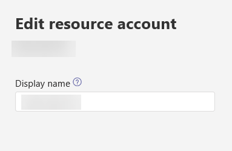

# <a name="manage-resource-accounts-in-microsoft-teams"></a><span data-ttu-id="b7249-103">管理 Microsoft 團隊中的資源帳戶</span><span class="sxs-lookup"><span data-stu-id="b7249-103">Manage resource accounts in Microsoft Teams</span></span>

<span data-ttu-id="b7249-104"><a name="bk">phonenumber</a></span><span class="sxs-lookup"><span data-stu-id="b7249-104"><a name="bk">phonenumber</a></span></span>

<span data-ttu-id="b7249-105">資源帳戶也稱為 Azure AD 中*已停用的使用者物件*，而且可以用來代表一般的資源。</span><span class="sxs-lookup"><span data-stu-id="b7249-105">A resource account is also known as a *disabled user object* in Azure AD, and can be used to represent resources in general.</span></span> <span data-ttu-id="b7249-106">例如，在 Exchange 中可能會用來代表會議室，並允許他們擁有電話號碼。</span><span class="sxs-lookup"><span data-stu-id="b7249-106">In Exchange it might be used to represent conference rooms, for example, and allow them to have a phone number.</span></span> <span data-ttu-id="b7249-107">您可以使用商務用 Skype Server 2019，在 Microsoft 365 或內部部署中託管資源帳戶。</span><span class="sxs-lookup"><span data-stu-id="b7249-107">A resource account can be homed in Microsoft 365 or on premises using Skype for Business Server 2019.</span></span>

<span data-ttu-id="b7249-108">在 Microsoft 團隊或商務用 Skype Online 中，每個電話系統通話佇列或自動語音應答都必須有關聯的資源帳戶。</span><span class="sxs-lookup"><span data-stu-id="b7249-108">In Microsoft Teams or Skype for Business Online, each Phone System call queue or auto attendant is required to have an associated resource account.</span></span> <span data-ttu-id="b7249-109">資源帳戶是否需要指派的電話號碼，取決於相關通話佇列或自動語音應答的用途，如下列圖表所示。</span><span class="sxs-lookup"><span data-stu-id="b7249-109">Whether a resource account needs an assigned phone number will depend on the intended use of the associated call queue or auto attendant, as shown in the following diagram.</span></span> <span data-ttu-id="b7249-110">在將電話號碼指派給資源帳戶之前，您也可以參閱在本文底部連結的通話佇列和自動語音應答。</span><span class="sxs-lookup"><span data-stu-id="b7249-110">You can also refer to the articles on call queues and auto attendants linked at the bottom of this article before assigning a phone number to a resource account.</span></span>

> [!IMPORTANT]
> <span data-ttu-id="b7249-111">電話號碼不會直接指派給自動語音應答或通話佇列，而是與自動語音應答或通話佇列相關聯的資源帳戶。</span><span class="sxs-lookup"><span data-stu-id="b7249-111">A phone number is not assigned directly to the auto attendant or call queue, but rather to the resource account associated to the auto attendant or call queue.</span></span>


> [!NOTE]
> <span data-ttu-id="b7249-113">本文適用于 Microsoft 團隊和商務用 Skype Online。</span><span class="sxs-lookup"><span data-stu-id="b7249-113">This article applies to both Microsoft Teams and Skype for Business Online.</span></span> <span data-ttu-id="b7249-114">針對駐留在商務用 Skype Server 2019 的資源帳戶，請參閱[設定資源帳戶](/SkypeForBusiness/hybrid/configure-onprem-ra)。</span><span class="sxs-lookup"><span data-stu-id="b7249-114">For resource accounts homed on Skype for Business Server 2019, see [Configure resource accounts](/SkypeForBusiness/hybrid/configure-onprem-ra).</span></span>


## <a name="overview"></a><span data-ttu-id="b7249-115">概觀</span><span class="sxs-lookup"><span data-stu-id="b7249-115">Overview</span></span>

<span data-ttu-id="b7249-116">如果您的組織已經在使用至少一個電話系統授權，請將電話號碼指派給電話系統通話佇列或自動語音應答流程如下：</span><span class="sxs-lookup"><span data-stu-id="b7249-116">If your organization is already using at least one Phone System license, to assign a phone number to a Phone System call queue or auto attendant the process is:</span></span>

1. <span data-ttu-id="b7249-117">取得服務號碼。</span><span class="sxs-lookup"><span data-stu-id="b7249-117">Obtain a service number.</span></span>
2. <span data-ttu-id="b7249-118">取得免費的電話系統-[虛擬使用者授權](teams-add-on-licensing/virtual-user.md)或付費電話系統授權，以與資源帳戶或電話系統授權搭配使用。</span><span class="sxs-lookup"><span data-stu-id="b7249-118">Obtain a free Phone System - [Virtual User license](teams-add-on-licensing/virtual-user.md) or a paid Phone System license to use with the resource account or a Phone System license.</span></span>
3. <span data-ttu-id="b7249-119">建立資源帳戶。</span><span class="sxs-lookup"><span data-stu-id="b7249-119">Create the resource account.</span></span> <span data-ttu-id="b7249-120">需要自動語音應答或通話佇列，才能擁有關聯的資源帳戶。</span><span class="sxs-lookup"><span data-stu-id="b7249-120">An auto attendant or call queue is required to have an associated resource account.</span></span>
4. <span data-ttu-id="b7249-121">將電話系統或電話系統-虛擬使用者授權指派給資源帳戶。</span><span class="sxs-lookup"><span data-stu-id="b7249-121">Assign the Phone System or a Phone System - Virtual user license to the resource account.</span></span>
5. <span data-ttu-id="b7249-122">將服務電話號碼指派給您剛指派授權給之資源帳戶。</span><span class="sxs-lookup"><span data-stu-id="b7249-122">Assign a service phone number to the resource account you just assigned licenses to.</span></span> 
6. <span data-ttu-id="b7249-123">建立電話系統通話佇列或自動語音應答</span><span class="sxs-lookup"><span data-stu-id="b7249-123">Create a Phone System call queue or auto attendant</span></span>
7. <span data-ttu-id="b7249-124">連結資源帳戶與通話佇列或自動語音應答。</span><span class="sxs-lookup"><span data-stu-id="b7249-124">Link the resource account with a call queue or auto attendant.</span></span>

<span data-ttu-id="b7249-125">如果自動語音應答或呼叫佇列是嵌套在頂層自動語音應答底下，只要您想要將多個進入點輸入到自動語音應答及呼叫佇列的結構中，相關聯的資源帳戶就只需要電話號碼。</span><span class="sxs-lookup"><span data-stu-id="b7249-125">If the auto attendant or call queue is nested under a top level auto attendant, the associated resource account only needs a phone number if you want multiple points of entry into the structure of auto attendants and call queues.</span></span>

<span data-ttu-id="b7249-126">若要將來電重新導向至組織中的目前線上人員，他們必須具備**電話系統**授權，且可供企業語音使用或擁有 Office 365 通話方案。</span><span class="sxs-lookup"><span data-stu-id="b7249-126">To redirect calls to people in your organization who are homed Online, they must have a **Phone System** license and be enabled for Enterprise Voice or have Office 365 Calling Plans.</span></span> <span data-ttu-id="b7249-127">請參閱[指派 Microsoft 團隊授權](assign-teams-licenses.md)。</span><span class="sxs-lookup"><span data-stu-id="b7249-127">See [Assign Microsoft Teams licenses](assign-teams-licenses.md).</span></span> <span data-ttu-id="b7249-128">若要啟用企業語音，您可以使用 Windows PowerShell。</span><span class="sxs-lookup"><span data-stu-id="b7249-128">To enable them for Enterprise Voice, you can use Windows PowerShell.</span></span> <span data-ttu-id="b7249-129">例如，執行：`Set-CsUser -identity "Amos Marble" -EnterpriseVoiceEnabled $true`</span><span class="sxs-lookup"><span data-stu-id="b7249-129">For example run: `Set-CsUser -identity "Amos Marble" -EnterpriseVoiceEnabled $true`</span></span>

> [!WARNING]
> <span data-ttu-id="b7249-130">為了避免發生資源帳戶的問題，請依照下列步驟進行。</span><span class="sxs-lookup"><span data-stu-id="b7249-130">In order to avoid problems with the resource account, follow these steps in this order.</span></span>

<span data-ttu-id="b7249-131">如果您正在建立的電話系統通話佇列或自動語音應答將會嵌套，而且不需要電話號碼，程式如下：</span><span class="sxs-lookup"><span data-stu-id="b7249-131">If the Phone System call queue or auto attendant you're creating will be nested and won't need a phone number, the process is:</span></span>

1. <span data-ttu-id="b7249-132">建立資源帳戶</span><span class="sxs-lookup"><span data-stu-id="b7249-132">Create the resource account</span></span> 
2. <span data-ttu-id="b7249-133">建立電話系統通話佇列或自動語音應答</span><span class="sxs-lookup"><span data-stu-id="b7249-133">Create a Phone System call queue or auto attendant</span></span>
3. <span data-ttu-id="b7249-134">將資源帳戶與電話系統通話佇列或自動語音關聯</span><span class="sxs-lookup"><span data-stu-id="b7249-134">Associate the resource account with a Phone System call queue or auto attendant</span></span>

### <a name="create-a-resource-account-with-a-phone-number"></a><span data-ttu-id="b7249-135">使用電話號碼建立資源帳戶</span><span class="sxs-lookup"><span data-stu-id="b7249-135">Create a resource account with a phone number</span></span>

<span data-ttu-id="b7249-136">最上層的自動語音應答或通話佇列，必須將電話號碼連結至它的自動語音應答。</span><span class="sxs-lookup"><span data-stu-id="b7249-136">A top-level auto attendant or call queue will require a phone number be linked to its auto attendant.</span></span> <span data-ttu-id="b7249-137">若要建立使用電話號碼的資源帳戶，程式為：</span><span class="sxs-lookup"><span data-stu-id="b7249-137">To create a resource account that uses a phone number, the process is:</span></span>

1. <span data-ttu-id="b7249-138">移植或取得付費或免付費服務號碼。</span><span class="sxs-lookup"><span data-stu-id="b7249-138">Port or get a toll or toll-free service number.</span></span> <span data-ttu-id="b7249-139">該號碼不能指派給任何其他語音服務或資源帳戶。</span><span class="sxs-lookup"><span data-stu-id="b7249-139">The number can't be assigned to any other voice services or resource accounts.</span></span>

   <span data-ttu-id="b7249-140">在您將電話號碼指派給資源帳戶之前，您必須先取得或移植現有的付費或免付費服務號碼。</span><span class="sxs-lookup"><span data-stu-id="b7249-140">Before you assign a phone number to a resource account, you need to get or port your existing toll or toll-free service numbers.</span></span> <span data-ttu-id="b7249-141">當您收到付費或免付費服務電話號碼之後，就會顯示在**Microsoft 團隊系統管理中心** > 的**語音** > **電話號碼**中，而**數位類型**則會列為 [**服務-免付費**電話]。</span><span class="sxs-lookup"><span data-stu-id="b7249-141">After you get the toll or toll-free service phone numbers, they show up in **Microsoft Teams admin center** > **Voice** > **Phone numbers**, and the **Number type**  will be listed as **Service - Toll-Free**.</span></span> <span data-ttu-id="b7249-142">若要取得您的服務號碼，請參閱[取得服務電話號碼](getting-service-phone-numbers.md)，或者如果您想要轉移現有的服務號碼，請參閱[將電話號碼轉移至 Office 365](transfer-phone-numbers-to-office-365.md)。</span><span class="sxs-lookup"><span data-stu-id="b7249-142">To get your service numbers, see [Getting service phone numbers](getting-service-phone-numbers.md) or if you want to transfer an existing service number, see [Transfer phone numbers to Office 365](transfer-phone-numbers-to-office-365.md).</span></span>

   <span data-ttu-id="b7249-143">如果您要將電話號碼指派給資源帳戶，您現在可以使用 [免付費電話系統虛擬使用者授權]。</span><span class="sxs-lookup"><span data-stu-id="b7249-143">If you are assigning a phone number to a resource account you can now use the cost-free Phone System Virtual User license.</span></span> <span data-ttu-id="b7249-144">這會提供手機系統功能給組織階層的電話號碼，並可讓您建立自動語音應答及呼叫佇列功能。</span><span class="sxs-lookup"><span data-stu-id="b7249-144">This provides Phone System capabilities to phone numbers at the organizational level, and allows you to create auto attendant and call queue capabilities.</span></span>

2. <span data-ttu-id="b7249-145">取得電話系統虛擬使用者授權或一般的電話系統授權。</span><span class="sxs-lookup"><span data-stu-id="b7249-145">Obtain a Phone System Virtual User license or a regular Phone System license.</span></span> 

   <span data-ttu-id="b7249-146">若要取得虛擬使用者授權（從 Microsoft 365 系統管理中心開始），請移至**帳單** > **購買服務** > **附加元件訂閱**，然後滾動至結尾，您會看到「電話系統-虛擬使用者」授權。</span><span class="sxs-lookup"><span data-stu-id="b7249-146">To get the Virtual User license, starting from the Microsoft 365 admin center, go to **Billing** > **Purchase services** > **Add-on subscriptions** and scroll to the end - you will see "Phone System - Virtual User" license.</span></span> <span data-ttu-id="b7249-147">選取 [**立即購買**]。</span><span class="sxs-lookup"><span data-stu-id="b7249-147">Select **Buy now**.</span></span> <span data-ttu-id="b7249-148">有零成本，但您仍需遵循這些步驟來取得授權。</span><span class="sxs-lookup"><span data-stu-id="b7249-148">There is a zero cost, but you still need to follow these steps to acquire the license.</span></span>
3. <span data-ttu-id="b7249-149">建立新的資源帳戶。</span><span class="sxs-lookup"><span data-stu-id="b7249-149">Create a new resource account.</span></span> <span data-ttu-id="b7249-150">請參閱[在 Microsoft 團隊系統管理中心建立資源帳戶](#create-a-resource-account-in-microsoft-teams-admin-center)或[在 Powershell 中建立資源帳戶](#create-a-resource-account-in-powershell)</span><span class="sxs-lookup"><span data-stu-id="b7249-150">See [Create a resource account in Microsoft Teams admin center](#create-a-resource-account-in-microsoft-teams-admin-center) or [Create a resource account in Powershell](#create-a-resource-account-in-powershell)</span></span>
4. <span data-ttu-id="b7249-151">將電話系統-[虛擬使用者授權](teams-add-on-licensing/virtual-user.md)或電話系統授權指派給資源帳戶。</span><span class="sxs-lookup"><span data-stu-id="b7249-151">Assign a Phone System - [Virtual User license](teams-add-on-licensing/virtual-user.md) or Phone System License to the resource account.</span></span> <span data-ttu-id="b7249-152">請參閱[指派 Microsoft 團隊授權](assign-teams-licenses.md)及[指派授權給一個使用者](https://docs.microsoft.com/office365/admin/subscriptions-and-billing/assign-licenses-to-users?redirectSourcePath=%252farticle%252f997596b5-4173-4627-b915-36abac6786dc&view=o365-worldwide#assign-licenses-to-one-user)。</span><span class="sxs-lookup"><span data-stu-id="b7249-152">See [Assign Microsoft Teams licenses](assign-teams-licenses.md) and [Assign licenses to one user](https://docs.microsoft.com/office365/admin/subscriptions-and-billing/assign-licenses-to-users?redirectSourcePath=%252farticle%252f997596b5-4173-4627-b915-36abac6786dc&view=o365-worldwide#assign-licenses-to-one-user).</span></span>
5. <span data-ttu-id="b7249-153">將服務號碼指派給資源帳戶。</span><span class="sxs-lookup"><span data-stu-id="b7249-153">Assign the service number to the resource account.</span></span> <span data-ttu-id="b7249-154">請參閱[指派/取消指派電話號碼和服務](#assignunassign-phone-numbers-and-services)。</span><span class="sxs-lookup"><span data-stu-id="b7249-154">See [Assign/Unassign phone numbers and services](#assignunassign-phone-numbers-and-services).</span></span>
6. <span data-ttu-id="b7249-155">設定下列其中一項：</span><span class="sxs-lookup"><span data-stu-id="b7249-155">Set up one of the following:</span></span>
   - [<span data-ttu-id="b7249-156">雲端自動語音應答</span><span class="sxs-lookup"><span data-stu-id="b7249-156">Cloud auto attendant</span></span>](create-a-phone-system-auto-attendant.md)
   - [<span data-ttu-id="b7249-157">雲端通話佇列</span><span class="sxs-lookup"><span data-stu-id="b7249-157">Cloud call queue</span></span>](create-a-phone-system-call-queue.md)
7. <span data-ttu-id="b7249-158">將資源帳戶連結到自動語音應答或通話佇列。</span><span class="sxs-lookup"><span data-stu-id="b7249-158">Link the resource account to the auto attendant or call queue.</span></span> <span data-ttu-id="b7249-159">請參閱[指派/取消指派電話號碼和服務](#assignunassign-phone-numbers-and-services)</span><span class="sxs-lookup"><span data-stu-id="b7249-159">See [Assign/Unassign phone numbers and services](#assignunassign-phone-numbers-and-services)</span></span>

### <a name="create-a-resource-account-without-a-phone-number"></a><span data-ttu-id="b7249-160">建立不含電話號碼的資源帳戶</span><span class="sxs-lookup"><span data-stu-id="b7249-160">Create a resource account without a phone number</span></span>

<span data-ttu-id="b7249-161">嵌套的自動語音應答或呼叫佇列將需要資源帳戶，但在許多情況下，對應的資源帳戶不需要電話號碼和支援電話號碼所需的授權。</span><span class="sxs-lookup"><span data-stu-id="b7249-161">A nested auto attendant or call queue will require a resource account, but in many cases the corresponding resource account will not need a phone number and the licensing required to support a phone number.</span></span> <span data-ttu-id="b7249-162">若要建立不需要電話號碼的資源帳戶，必須以下列循序執行下列工作：</span><span class="sxs-lookup"><span data-stu-id="b7249-162">Creating a resource account that does not need a phone number would require performing the following tasks in the following order:</span></span>

1. <span data-ttu-id="b7249-163">建立新的資源帳戶。</span><span class="sxs-lookup"><span data-stu-id="b7249-163">Create a new resource account.</span></span> <span data-ttu-id="b7249-164">請參閱[在 Microsoft 團隊系統管理中心建立資源帳戶](#create-a-resource-account-in-microsoft-teams-admin-center)或[在 Powershell 中建立資源帳戶](#create-a-resource-account-in-powershell)</span><span class="sxs-lookup"><span data-stu-id="b7249-164">See [Create a resource account in Microsoft Teams admin center](#create-a-resource-account-in-microsoft-teams-admin-center) or [Create a resource account in Powershell](#create-a-resource-account-in-powershell)</span></span>
2. <span data-ttu-id="b7249-165">設定下列其中一項：</span><span class="sxs-lookup"><span data-stu-id="b7249-165">Set up one of the following:</span></span>
   - [<span data-ttu-id="b7249-166">雲端自動語音應答</span><span class="sxs-lookup"><span data-stu-id="b7249-166">Cloud auto attendant</span></span>](create-a-phone-system-auto-attendant.md)
   - [<span data-ttu-id="b7249-167">雲端通話佇列</span><span class="sxs-lookup"><span data-stu-id="b7249-167">Cloud call queue</span></span>](create-a-phone-system-call-queue.md)
3. <span data-ttu-id="b7249-168">將資源帳戶指派給通話佇列或自動語音應答。</span><span class="sxs-lookup"><span data-stu-id="b7249-168">Assign the resource account to the call queue or auto attendant.</span></span> <span data-ttu-id="b7249-169">請參閱[指派/取消指派電話號碼和服務](#assignunassign-phone-numbers-and-services)</span><span class="sxs-lookup"><span data-stu-id="b7249-169">See [Assign/Unassign phone numbers and services](#assignunassign-phone-numbers-and-services)</span></span>


## <a name="create-a-resource-account-in-microsoft-teams-admin-center"></a><span data-ttu-id="b7249-170">在 Microsoft 團隊系統管理中心中建立資源帳戶</span><span class="sxs-lookup"><span data-stu-id="b7249-170">Create a resource account in Microsoft Teams admin center</span></span>

<span data-ttu-id="b7249-171">在您購買電話系統授權之後，使用 Microsoft 團隊管理中心流覽至**組織範圍的設定** > **資源帳戶**。</span><span class="sxs-lookup"><span data-stu-id="b7249-171">After you've bought a Phone System license, using Microsoft Teams admin center navigate to **Org-wide settings** > **Resource accounts**.</span></span>

![[資源帳戶] 頁面的螢幕擷取畫面](media/r-a-master.png)


<span data-ttu-id="b7249-174">若要建立新的資源帳戶，請按一下 [ **+ 新增帳戶**]。</span><span class="sxs-lookup"><span data-stu-id="b7249-174">To create a new resource account click **+ New account**.</span></span> <span data-ttu-id="b7249-175">在快顯視窗中，填寫資源帳戶的顯示名稱和使用者名稱（功能變數名稱必須自動填入），然後按一下 [**儲存**]。</span><span class="sxs-lookup"><span data-stu-id="b7249-175">In the pop-up, fill out the display name and user name for the resource account (the domain name should populate automatically) then click **Save**.</span></span>

![[新增資源帳戶] 選項的螢幕擷取畫面](media/res-acct.png)

<span data-ttu-id="b7249-177">接下來，將授權套用至 O365 系統管理中心的資源帳戶，如在[商務用 Office 365 中指派授權給使用者](https://docs.microsoft.com/office365/admin/subscriptions-and-billing/assign-licenses-to-users?view=o365-worldwide)的說明。</span><span class="sxs-lookup"><span data-stu-id="b7249-177">Next, apply a license to the resource account in the O365 Admin center, as described in [Assign licenses to users in Office 365 for business](https://docs.microsoft.com/office365/admin/subscriptions-and-billing/assign-licenses-to-users?view=o365-worldwide)</span></span>

### <a name="edit-resource-account-name"></a><span data-ttu-id="b7249-178">編輯資源帳戶名稱</span><span class="sxs-lookup"><span data-stu-id="b7249-178">Edit resource account name</span></span>

<span data-ttu-id="b7249-179">中的標注，您可以使用 [**編輯**] 選項編輯資源帳戶顯示名稱。</span><span class="sxs-lookup"><span data-stu-id="b7249-179"> You can edit the resource account display name using the **Edit** option.</span></span> <span data-ttu-id="b7249-180">完成後，按一下 [**儲存**]。</span><span class="sxs-lookup"><span data-stu-id="b7249-180">Click **Save** when you are done.</span></span>
<span data-ttu-id="b7249-181">![[編輯資源帳戶] 選項的螢幕擷取畫面](media/r-a-edit.png)</span><span class="sxs-lookup"><span data-stu-id="b7249-181"></span></span>

### <a name="assignunassign-phone-numbers-and-services"></a><span data-ttu-id="b7249-182">指派/取消指派電話號碼和服務</span><span class="sxs-lookup"><span data-stu-id="b7249-182">Assign/Unassign phone numbers and services</span></span>

<span data-ttu-id="b7249-183">之後，在前一個螢幕擷取畫面中參照標注，您可以按一下 [**指派/取消指派**]，將服務號碼指派給資源帳戶，或指派資源帳戶移到已存在的自動語音應答或通話佇列。</span><span class="sxs-lookup"><span data-stu-id="b7249-183"> Once you've created the resource account and assigned the license, you can click on **Assign/Unassign** to assign a service number to the resource account, or assign the resource account to an auto attendant or call queue that already exists.</span></span> <span data-ttu-id="b7249-184">指派直接路由號碼只能使用 Cmdlet 完成。</span><span class="sxs-lookup"><span data-stu-id="b7249-184">Assigning a direct routing number can be done using Cmdlets only.</span></span> <span data-ttu-id="b7249-185">如果您仍需建立通話佇列或自動語音應答，您可以在建立資源帳戶時連結該帳戶。</span><span class="sxs-lookup"><span data-stu-id="b7249-185">If your call queue or auto attendant still needs to be created, you can link the resource account while you create it.</span></span> <span data-ttu-id="b7249-186">完成後，按一下 [**儲存**]。</span><span class="sxs-lookup"><span data-stu-id="b7249-186">Click **Save** when you are done.</span></span>

<span data-ttu-id="b7249-187">若要將直接路由或混合式編號指派給資源帳戶，您將需要使用 PowerShell，請參閱下一節。</span><span class="sxs-lookup"><span data-stu-id="b7249-187">To assign a direct routing or hybrid number to a resource account you will need to use PowerShell, see the following section.</span></span>

> [!IMPORTANT]
> <span data-ttu-id="b7249-188">如果您的資源帳戶沒有有效的授權，當您嘗試將電話號碼指派給資源帳戶時，可能會發生內部檢查失敗。</span><span class="sxs-lookup"><span data-stu-id="b7249-188">If your resource account doesn't have a valid license, an internal check will cause a failure when you try to assign the phone number to the resource account.</span></span> <span data-ttu-id="b7249-189">您無法指派號碼或將資源帳戶與通話佇列或自動語音助理建立關聯。</span><span class="sxs-lookup"><span data-stu-id="b7249-189">You won't be able to assign the number or associate the resource account with a call queue or auto attendant.</span></span>

![[指派/取消指派] 選項的螢幕擷取畫面](media/r-a-assign.png)

## <a name="change-an-existing-resource-account-to-use-a-virtual-user-license"></a><span data-ttu-id="b7249-191">變更現有的資源帳戶以使用虛擬使用者授權</span><span class="sxs-lookup"><span data-stu-id="b7249-191">Change an existing resource account to use a Virtual User license</span></span>

<span data-ttu-id="b7249-192">如果您決定將現有資源帳戶的授權從電話系統授權切換至虛擬使用者授權，您必須取得免費的虛擬使用者授權，然後依照 Microsoft 365 系統管理中心的連結步驟，[將使用者移至不同的訂閱](https://docs.microsoft.com/en-us/office365/admin/subscriptions-and-billing/assign-licenses-to-users?redirectSourcePath=%252farticle%252f997596b5-4173-4627-b915-36abac6786dc&view=o365-worldwide#move-users-to-a-different-subscription)。</span><span class="sxs-lookup"><span data-stu-id="b7249-192">If you decide to switch the licenses on your existing resource account from a Phone system license to a Virtual User license, you'll need to acquire the free Virtual User license, then follow the linked steps in the Microsoft 365 Admin center to [Move users to a different subscription](https://docs.microsoft.com/en-us/office365/admin/subscriptions-and-billing/assign-licenses-to-users?redirectSourcePath=%252farticle%252f997596b5-4173-4627-b915-36abac6786dc&view=o365-worldwide#move-users-to-a-different-subscription).</span></span> 

> [!WARNING]
> <span data-ttu-id="b7249-193">永遠移除完整的電話系統授權，並在相同的授權活動中指派虛擬使用者授權。</span><span class="sxs-lookup"><span data-stu-id="b7249-193">Always remove a full Phone System License and assign the Virtual User license in the same license activity.</span></span> <span data-ttu-id="b7249-194">如果您移除舊的授權，請儲存帳戶變更、新增授權，然後再次儲存帳戶設定，資源帳戶可能無法如期運作。</span><span class="sxs-lookup"><span data-stu-id="b7249-194">If you remove the old license, save the account changes, add the new license, and then save the account settings again, the resource account may no longer function as expected.</span></span> <span data-ttu-id="b7249-195">如果發生這種情況，我們建議您為虛擬使用者授權建立新的資源帳戶，並移除中斷的資源帳戶。</span><span class="sxs-lookup"><span data-stu-id="b7249-195">If this happens, we recommend you create a new resource account for the Virtual User license and remove the broken resource account.</span></span> 

## <a name="create-a-resource-account-in-powershell"></a><span data-ttu-id="b7249-196">在 Powershell 中建立資源帳戶</span><span class="sxs-lookup"><span data-stu-id="b7249-196">Create a resource account in Powershell</span></span>

<span data-ttu-id="b7249-197">根據您的資源帳戶是位於線上或內部部署，您必須以系統管理員許可權連線到適當的 Powershell 提示。</span><span class="sxs-lookup"><span data-stu-id="b7249-197">Depending on whether your resource account is located online or on premises, you would need to connect to the appropriate Powershell prompt with Admin privileges.</span></span>

- <span data-ttu-id="b7249-198">下列 Powershell Cmdlet 範例顯示如何使用[新的 CsOnlineApplicationInstance](https://docs.microsoft.com/powershell/module/skype/new-CsOnlineApplicationInstance?view=skype-ps)建立以線上為宿主的資源帳戶。</span><span class="sxs-lookup"><span data-stu-id="b7249-198">The following Powershell cmdlet examples show creating a resource account homed online using [New-CsOnlineApplicationInstance](https://docs.microsoft.com/powershell/module/skype/new-CsOnlineApplicationInstance?view=skype-ps).</span></span> 

- <span data-ttu-id="b7249-199">如果資源帳戶是駐留在內部部署的商務用 Skype Server 2019，且可與雲端通話佇列和雲端自動語音應答搭配使用，請參閱[設定雲端通話佇列](/skypeforbusiness/hybrid/configure-call-queue.md)或[設定雲端自動](/skypeforbusiness/hybrid/configure-cloud-auto-attendant.md)語音應答。</span><span class="sxs-lookup"><span data-stu-id="b7249-199">For resource accounts homed on-premises in Skype For Business Server 2019 that can be used with Cloud Call Queues and Cloud Auto Attendants, see [Configure Cloud Call Queues](/skypeforbusiness/hybrid/configure-call-queue.md) or [Configure Cloud Auto Attendants](/skypeforbusiness/hybrid/configure-cloud-auto-attendant.md).</span></span> <span data-ttu-id="b7249-200">混合式實現（在直接路由中的數位）將會使用[新的 CsHybridApplicationEndpoint](https://docs.microsoft.com/powershell/module/skype/new-cshybridapplicationendpoint?view=skype-ps)。</span><span class="sxs-lookup"><span data-stu-id="b7249-200">Hybrid implementations (numbers homed on Direct Routing) will use [New-CsHybridApplicationEndpoint](https://docs.microsoft.com/powershell/module/skype/new-cshybridapplicationendpoint?view=skype-ps).</span></span>

<span data-ttu-id="b7249-201">您在建立應用程式實例時所需使用的應用程式識別碼為：</span><span class="sxs-lookup"><span data-stu-id="b7249-201">The application ID's that you need to use while creating the application instances are:</span></span>

- <span data-ttu-id="b7249-202">**自動**語音應答： ce933385-9390-45d1-9512-c8d228074e07</span><span class="sxs-lookup"><span data-stu-id="b7249-202">**Auto Attendant:** ce933385-9390-45d1-9512-c8d228074e07</span></span>
- <span data-ttu-id="b7249-203">**通話佇列：** 11cd3e2e-fccb-42ad-ad00-878b93575e07</span><span class="sxs-lookup"><span data-stu-id="b7249-203">**Call Queue:** 11cd3e2e-fccb-42ad-ad00-878b93575e07</span></span>

> [!NOTE]
> <span data-ttu-id="b7249-204">如果您想要讓通話佇列或自動語音應答能由內部部署使用者來搜尋，您應該在內部部署中建立資源帳戶，因為線上資源帳戶不會同步處理到 Active Directory。</span><span class="sxs-lookup"><span data-stu-id="b7249-204">If you want the call queue or auto attendant to be searchable by on-premises users, you should create your resource accounts on-premise, since online resource accounts are not synced down to Active Directory.</span></span>

1. <span data-ttu-id="b7249-205">若要在線上建立與自動語音助理搭配使用的資源帳戶，請使用下列命令：</span><span class="sxs-lookup"><span data-stu-id="b7249-205">To create a resource account online for use with an auto attendant, use the following command:</span></span>

``` Powershell
New-CsOnlineApplicationInstance -UserPrincipalName testra1@contoso.com -ApplicationId “ce933385-9390-45d1-9512-c8d228074e07” -DisplayName "Resource account 1"
```

2. <span data-ttu-id="b7249-206">您必須先將授權套用至該資源帳戶，才能使用該帳戶。</span><span class="sxs-lookup"><span data-stu-id="b7249-206">You will not be able to use the resource account until you apply a license to it.</span></span> <span data-ttu-id="b7249-207">如需如何將授權套用至 O365 系統管理中心中的帳戶，請參閱[在商務用 Office 365 中指派授權給使用者](https://docs.microsoft.com/office365/admin/subscriptions-and-billing/assign-licenses-to-users?view=o365-worldwide#assign-licenses-to-one-user)，以及[指派商務用 Skype 授權](https://docs.microsoft.com/skypeforbusiness/skype-for-business-and-microsoft-teams-add-on-licensing/assign-skype-for-business-and-microsoft-teams-licenses)。</span><span class="sxs-lookup"><span data-stu-id="b7249-207">For how to apply a license to an account in the O365 admin center, see [Assign licenses to users in Office 365 for business](https://docs.microsoft.com/office365/admin/subscriptions-and-billing/assign-licenses-to-users?view=o365-worldwide#assign-licenses-to-one-user) as well as [Assign Skype for Business licenses](https://docs.microsoft.com/skypeforbusiness/skype-for-business-and-microsoft-teams-add-on-licensing/assign-skype-for-business-and-microsoft-teams-licenses).</span></span>

3. <span data-ttu-id="b7249-208">可選一旦將正確的授權套用至資源帳戶之後，您就可以將電話號碼指派給資源帳戶，如下所示。</span><span class="sxs-lookup"><span data-stu-id="b7249-208">(Optional) Once the correct license is applied to the resource account you can assign a phone number to the resource account as shown below.</span></span> <span data-ttu-id="b7249-209">並非所有資源帳戶都需要電話號碼。</span><span class="sxs-lookup"><span data-stu-id="b7249-209">Not all resource accounts will require a phone number.</span></span> <span data-ttu-id="b7249-210">如果您未將授權套用至資源帳戶，電話號碼指派將會失敗。</span><span class="sxs-lookup"><span data-stu-id="b7249-210">If you did not apply a license to the resource account, the phone number assignment will fail.</span></span>

   ``` Powershell
   Set-CsOnlineVoiceApplicationInstance -Identity testra1@contoso.com -TelephoneNumber +14255550100
   Get-CsOnlineTelephoneNumber -TelephoneNumber +14255550100
   ```

   <span data-ttu-id="b7249-211">如需此命令的詳細資料，請參閱[設定 CsOnlineVoiceApplicationInstance](https://docs.microsoft.com/powershell/module/skype/set-csonlinevoiceapplicationinstance?view=skype-ps) 。</span><span class="sxs-lookup"><span data-stu-id="b7249-211">See [Set-CsOnlineVoiceApplicationInstance](https://docs.microsoft.com/powershell/module/skype/set-csonlinevoiceapplicationinstance?view=skype-ps) for more details on this command.</span></span>

   > [!NOTE]
   > <span data-ttu-id="b7249-212">您最簡單的做法是使用 Microsoft 團隊系統管理中心來設定線上電話號碼，如先前所述。</span><span class="sxs-lookup"><span data-stu-id="b7249-212">It's easiest to set the online phone number using the Microsoft Teams admin center, as described previously.</span></span>

   <span data-ttu-id="b7249-213">若要將直接傳送電話號碼指派給資源帳戶（在線上或內部部署），請針對商務用 Skype Online Powershell 使用下列 Cmdlet：</span><span class="sxs-lookup"><span data-stu-id="b7249-213">To assign a direct routing phone number to a resource account (homed either online or on-premises), use the following cmdlet for Skype for Business Online Powershell:</span></span>

   ``` Powershell
   Set-CsOnlineApplicationInstance -Identity appinstance01@contoso.com -OnpremPhoneNumber +14250000000
   ```

## <a name="manage-resource-account-settings-in-microsoft-teams-admin-center"></a><span data-ttu-id="b7249-214">管理 Microsoft 團隊系統管理中心的資源帳戶設定</span><span class="sxs-lookup"><span data-stu-id="b7249-214">Manage Resource account settings in Microsoft Teams admin center</span></span>

<span data-ttu-id="b7249-215">若要在 Microsoft 團隊系統管理中心中管理 [資源帳戶設定]，請流覽至 [**整個組織的設定** > **資源帳戶**]，選取您需要變更其設定的資源帳戶，然後按一下 [**編輯**] 按鈕。</span><span class="sxs-lookup"><span data-stu-id="b7249-215">To manage Resource account settings in Microsoft Teams admin center, navigate to **Org-wide settings** > **Resource accounts**, select the resource account you need to change settings for, and then click on the **Edit** button.</span></span> <span data-ttu-id="b7249-216">在 [**編輯資源帳戶**] 畫面中，您將能夠變更這些設定：</span><span class="sxs-lookup"><span data-stu-id="b7249-216">in the **Edit resource account** screen, you will be able to change these settings:</span></span>

- <span data-ttu-id="b7249-217">帳戶的**顯示名稱**</span><span class="sxs-lookup"><span data-stu-id="b7249-217">**Display name** for the account</span></span>
- <span data-ttu-id="b7249-218">使用帳戶的通話佇列或自動語音應答</span><span class="sxs-lookup"><span data-stu-id="b7249-218">Call queue or auto attendant that uses the account</span></span>
- <span data-ttu-id="b7249-219">指派給帳戶的電話號碼</span><span class="sxs-lookup"><span data-stu-id="b7249-219">Phone number assigned to the account</span></span>

<span data-ttu-id="b7249-220">完成後，請按一下 [**儲存**]。</span><span class="sxs-lookup"><span data-stu-id="b7249-220">When finished, click on **Save**.</span></span>

## <a name="delete-a-resource-account"></a><span data-ttu-id="b7249-221">刪除資源帳戶</span><span class="sxs-lookup"><span data-stu-id="b7249-221">Delete a resource account</span></span>

<span data-ttu-id="b7249-222">在刪除前，請確定您已將電話號碼與資源帳戶取消關聯，以免讓您的服務號碼停滯在擱置模式中。</span><span class="sxs-lookup"><span data-stu-id="b7249-222">Make sure you dissociate the telephone number from the resource account before deleting it, to avoid getting your service number stuck in pending mode.</span></span> <span data-ttu-id="b7249-223">您可以使用下列 commandlet 來執行此動作：</span><span class="sxs-lookup"><span data-stu-id="b7249-223">You can do that using the following commandlet:</span></span>

``` Powershell
Set-csonlinevoiceapplicationinstance -identity <Resource Account oid> -TelephoneNumber $null
```

<span data-ttu-id="b7249-224">完成之後，您就可以從 O365 系統管理入口網站刪除資源帳戶（位於 [使用者] 索引標籤底下）。</span><span class="sxs-lookup"><span data-stu-id="b7249-224">Once you do that, you can delete the resource account from the O365 admin portal, under Users tab.</span></span>

<span data-ttu-id="b7249-225">若要解除直接路由電話號碼與資源帳戶的關聯，請使用下列 Cmdlet：</span><span class="sxs-lookup"><span data-stu-id="b7249-225">To disassociate a direct routing telephone number from the resource account, use the following cmdlet:</span></span>

``` Powershell
Set-CsOnlineApplicationInstance -Identity  <Resource Account oid> -OnpremPhoneNumber ""
```

## <a name="troubleshooting"></a><span data-ttu-id="b7249-226">疑難排解</span><span class="sxs-lookup"><span data-stu-id="b7249-226">Troubleshooting</span></span>

<span data-ttu-id="b7249-227">如果您在 [團隊系統管理中心] 中沒有看到指派給資源帳戶的電話號碼，而且您無法指派該號碼，請檢查下列專案：</span><span class="sxs-lookup"><span data-stu-id="b7249-227">In case you do not see the phone number assigned to the resource account on the Teams Admin Center and you are unable to assign the number from there, please check the following:</span></span>

``` Powershell
Get-MsolUser -UserPrincipalName "username@contoso.com"| fl objectID,department
```

<span data-ttu-id="b7249-228">如果 [部門] 屬性顯示商務用 Skype 應用程式端點，請執行下列 Cmdlet：</span><span class="sxs-lookup"><span data-stu-id="b7249-228">If the department attribute displays Skype for Business Application Endpoint please run the cmdlet below :</span></span>

``` Powershell
Set-MsolUser -ObjectId -Department "Microsoft Communication Application Instance"
```

> [!NOTE]
> <span data-ttu-id="b7249-229">在執行 cmldet 之後重新整理團隊管理中心網頁，您應該能夠正確指派號碼。</span><span class="sxs-lookup"><span data-stu-id="b7249-229">Refresh the Teams Admin center webpage after running the cmldet, and you should be able to assign the number correctly.</span></span>

## <a name="related-information"></a><span data-ttu-id="b7249-230">相關資訊</span><span class="sxs-lookup"><span data-stu-id="b7249-230">Related Information</span></span>

<span data-ttu-id="b7249-231">針對與商務用 Skype Server 混合使用的實現：</span><span class="sxs-lookup"><span data-stu-id="b7249-231">For implementations that are hybrid with Skype for Business Server:</span></span>

   [<span data-ttu-id="b7249-232">規劃雲端自動語音應答</span><span class="sxs-lookup"><span data-stu-id="b7249-232">Plan Cloud auto attendants</span></span>](/SkypeForBusiness/hybrid/plan-cloud-auto-attendant)
  
   [<span data-ttu-id="b7249-233">規劃雲端通話佇列</span><span class="sxs-lookup"><span data-stu-id="b7249-233">Plan Cloud call queues</span></span>](/SkypeforBusiness/hybrid/plan-call-queue)
   
   [<span data-ttu-id="b7249-234">設定內部部署的資源帳戶</span><span class="sxs-lookup"><span data-stu-id="b7249-234">Configure on-prem resource accounts</span></span>](/SkypeForBusiness/hybrid/configure-onprem-ra)


<span data-ttu-id="b7249-235">針對團隊或商務用 Skype Online 中的 [實現]：</span><span class="sxs-lookup"><span data-stu-id="b7249-235">For implementations in Teams or Skype for Business Online:</span></span>

   [<span data-ttu-id="b7249-236">什麼是雲端自動語音應答？</span><span class="sxs-lookup"><span data-stu-id="b7249-236">What are Cloud auto attendants?</span></span>](what-are-phone-system-auto-attendants.md)

   [<span data-ttu-id="b7249-237">設定雲端自動語音應答</span><span class="sxs-lookup"><span data-stu-id="b7249-237">Set up a Cloud auto attendant</span></span>](/microsoftteams/create-a-phone-system-auto-attendant)

   [<span data-ttu-id="b7249-238">小型企業範例-設定自動助手</span><span class="sxs-lookup"><span data-stu-id="b7249-238">Small business example - Set up an auto attendant</span></span>](/microsoftteams/tutorial-org-aa)

   [<span data-ttu-id="b7249-239">建立雲端通話佇列</span><span class="sxs-lookup"><span data-stu-id="b7249-239">Create a Cloud call queue</span></span>](/SkypeForBusiness/what-is-phone-system-in-office-365/create-a-phone-system-call-queue)

[<span data-ttu-id="b7249-240">新-CsHybridApplicationEndpoint</span><span class="sxs-lookup"><span data-stu-id="b7249-240">New-CsHybridApplicationEndpoint</span></span>](https://docs.microsoft.com/powershell/module/skype/new-cshybridapplicationendpoint?view=skype-ps)

[<span data-ttu-id="b7249-241">新-CsOnlineApplicationInstance</span><span class="sxs-lookup"><span data-stu-id="b7249-241">New-CsOnlineApplicationInstance</span></span>](https://docs.microsoft.com/powershell/module/skype/new-csonlineapplicationinstance?view=skype-ps)

[<span data-ttu-id="b7249-242">電話系統-虛擬使用者授權</span><span class="sxs-lookup"><span data-stu-id="b7249-242">Phone System - Virtual User license</span></span>](teams-add-on-licensing/virtual-user.md)
