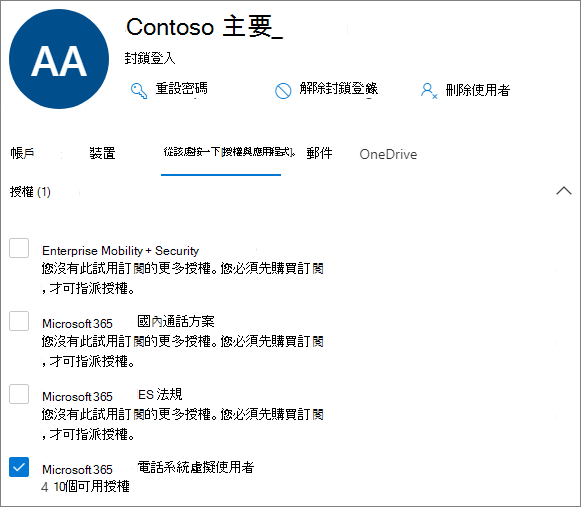

# <a name="manage-resource-accounts-in-microsoft-teams"></a>在 Microsoft Teams 中管理資源帳戶

資源帳戶是 Azure AD 中已停用的使用者物件，而且可以用來代表資源（一般）。 例如，您可以在 Exchange 中使用資源帳戶來代表會議室，並允許他們擁有電話號碼和行事曆。 您可以使用商務用 Skype Server 2019，在 Microsoft 365 或內部部署中託管資源帳戶。

在 Microsoft 團隊中，每個自動語音應答或通話佇列都需要有一個資源帳戶。 您也可以將資源帳戶指派給服務電話號碼。 這是您將電話號碼指派給自動語音應答及呼叫佇列的方式，允許來自外部團隊的呼叫者到達自動回應或通話佇列。

本文說明如何建立資源帳戶並準備好將其用於自動語音應答及呼叫佇列。

在您開始本文中的程式之前，請先確定您已完成下列作業：

- [取得虛擬使用者授權](#obtain-virtual-user-licenses)
- [取得服務號碼](#obtain-service-numbers)

### <a name="obtain-virtual-user-licenses"></a>取得虛擬使用者授權

每個資源帳戶都需要授權，才能使用自動語音應答及呼叫佇列。 您可以使用免費的 *Microsoft 365 Phone System-虛擬使用者* 授權。 若要取得這些授權，請參閱 [虛擬使用者授權](teams-add-on-licensing/virtual-user.md)。

我們將在本文稍後的內容中，說明如何將授權指派給資源帳戶。

若要取得虛擬使用者授權，請在 Microsoft 365 系統管理中心中，移至 **帳單**  >  **購買服務**  >  **附加元件訂閱** ，然後滾動到最後，您將會看到 [ *電話系統-虛擬使用者* 授權]。 選取 [ **立即購買** ]。 有零成本，但您仍需遵循這些步驟來取得授權。

### <a name="obtain-service-numbers"></a>取得服務號碼

[服務號碼] 是自動語音應答及呼叫佇列的選用，不過您至少需要一個服務編號，呼叫者才能到達您的自動語音應答及呼叫佇列設定。 針對您想要直接透過服務號碼直接取得的任何自動語音應答或通話佇列，您必須有具有相關聯服務號碼的資源帳戶。

資源帳戶可以使用付費或免付費服務號碼。 您可以要求新的號碼或從其他運營商取得現有號碼。

若要取得新的服務號碼，請參閱 [取得服務電話號碼](getting-service-phone-numbers.md)。

若要從另一個電信公司撥打電話給其他運輸公司，請參閱將 [電話號碼轉移給小組](phone-number-calling-plans/transfer-phone-numbers-to-teams.md)。

## <a name="create-a-resource-account"></a>建立資源帳戶

您可以在 [團隊管理中心] 中建立資源帳戶。

![[新增資源帳戶] 使用者介面的螢幕擷取畫面](media/resource-account-add.png)

1. 在 [團隊管理中心] 中，展開 [ **整個組織的設定** ]，然後按一下 [ **資源帳戶** ]。

2. 按一下 [ **新增** ]。

3. 在 [ **新增資源帳戶** ] 窗格中，填寫 [ **顯示名稱** **]、[** 使用者名稱] 和 [ **資源帳戶類型** ]。 資源帳戶類型可以是 **自動** 應答或 **呼叫佇列** ，視您想要使用此資源帳戶的方式而定。

4. 按一下 [儲存]。


## <a name="assign-a-license"></a>指派授權

針對每個資源帳戶，您必須指派 *Microsoft 365 電話系統-虛擬使用者* 授權或 *電話系統* 授權。



1. 在 Microsoft 365 系統管理中心，按一下您要指派授權的資源帳戶。

2. 在 [ **授權及應用程式** ] 索引標籤的 [ **授權** ] 底下，選取 [ **Microsoft 365 電話系統-虛擬使用者** ]。

3. 按一下 [ **儲存變更** ]。

## <a name="assign-a-service-number"></a>指派服務號碼

如果您打算將資源帳戶與需要服務號碼的自動語音應答或通話佇列搭配使用，請將號碼指派給資源帳戶。


1. 在團隊系統管理中心的 [ **資源帳戶** ] 頁面上，選取您要指派服務號碼的資源帳戶，然後按一下 [ **指派/取消指派** ]。

2. 在 [ **電話號碼類型** ] 下拉式清單中，選擇您要使用的號碼類型。

3. 在 [ **已指派的電話號碼** ] 方塊中，搜尋您要使用的號碼，然後按一下 [ **新增** ]。

4. 按一下 [儲存]。


若要將直接路由或混合式編號指派給資源帳戶，您需要使用 PowerShell：

`Set-CsOnlineApplicationInstance -Identity aa-contoso_main@contoso64.net -OnpremPhoneNumber +19295550150`

## <a name="next-steps"></a>後續步驟

完成資源帳戶設定並根據需要指派服務號碼之後，您就可以開始使用 [自動語音應答] 或 [通話佇列] 的資源帳戶。

請參閱下列參考資料：

 - [雲端自動語音應答](create-a-phone-system-auto-attendant.md)

 - [雲端通話佇列](create-a-phone-system-call-queue.md)

您可以使用 [ **編輯** ] 選項來編輯資源帳戶的 [ **顯示名稱** ] 和 [ **資源] 帳戶** 類型。 完成後，按一下 [ **儲存** ]。

## <a name="change-an-existing-resource-account-to-use-a-virtual-user-license"></a>變更現有的資源帳戶以使用虛擬使用者授權

如果您決定將現有資源帳戶的授權從 **電話系統** 授權切換至虛擬使用者授權，您必須取得免費的虛擬使用者授權，然後依照 Microsoft 365 系統管理中心的步驟， [將使用者移至不同的訂閱](https://docs.microsoft.com/microsoft-365/admin/manage/assign-licenses-to-users#move-users-to-a-different-subscription)。

> [!WARNING]
> 永遠移除完整的電話系統授權，並在相同的授權活動中指派虛擬使用者授權。 如果您移除舊的授權，請儲存帳戶變更、新增授權，然後再次儲存帳戶設定，資源帳戶可能無法如期運作。 如果發生這種情況，我們建議您為虛擬使用者授權建立新的資源帳戶，並移除中斷的資源帳戶。

## <a name="skype-for-business-server-2019"></a>商務用 Skype Server 2019

針對駐留在商務用 Skype Server 2019 的資源帳戶（可搭配雲端通話佇列和雲端自動語音應答），請參閱 [規劃雲端通話佇列](/SkypeforBusiness/hybrid/plan-call-queue) 或 [規劃雲端自動](/SkypeForBusiness/hybrid/plan-cloud-auto-attendant)語音應答。 混合式實現 (以直接路由) 為宿主的號碼是使用 [CsHybridApplicationEndpoint](https://docs.microsoft.com/powershell/module/skype/new-cshybridapplicationendpoint) Cmdlet （在內部部署商務用 Skype server 2019 伺服器上）進行設定。

建立應用程式實例時所需使用的應用程式識別碼為：

- **自動** 語音應答： ce933385-9390-45d1-9512-c8d228074e07
- **通話佇列：** 11cd3e2e-fccb-42ad-ad00-878b93575e07

> [!NOTE]
> 如果您想讓通話佇列或自動語音應答能透過商務用 Skype Server 2019 使用者進行搜尋，您應該在商務用 Skype Server 2019 上建立您的資源帳戶，因為線上資源帳戶不會同步處理到 Active Directory。 當 sipfederationtls 的 DNS SRV 記錄解析到商務用 Skype Server 2019 時， **必須** 使用 SfB 管理命令介面，並同步處理到 Azure AD，在商務用 skype server 2019 上建立資源帳戶。

針對與商務用 Skype Server 混合使用的實現：

   [規劃雲端自動語音應答](/SkypeForBusiness/hybrid/plan-cloud-auto-attendant)
  
   [規劃雲端通話佇列](/SkypeforBusiness/hybrid/plan-call-queue)
   
   [設定內部部署的資源帳戶](/SkypeForBusiness/hybrid/configure-onprem-ra)


## <a name="delete-a-resource-account"></a>刪除資源帳戶

在刪除前，請確定您已將電話號碼與資源帳戶取消關聯，以免讓您的服務號碼停滯在擱置模式中。

完成之後，您可以在 Microsoft 365 系統管理中心的 [使用者] 索引標籤底下刪除資源帳戶。

若要解除直接路由電話號碼與資源帳戶的關聯，請使用下列 Cmdlet：

```powershell
Set-CsOnlineApplicationInstance -Identity  <Resource Account oid> -OnpremPhoneNumber ""
```
