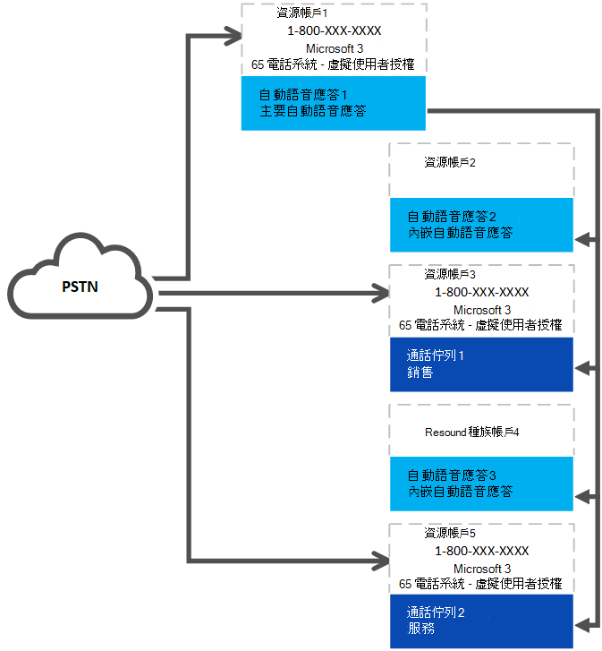

# <a name="manage-resource-accounts-in-microsoft-teams"></a>在 Microsoft Teams 中管理資源帳戶

資源帳戶也稱為 Azure AD 中*已停用的使用者物件*，而且可以用來代表一般的資源。 例如，在 Exchange 中可能會用來代表會議室，並允許他們擁有電話號碼。 您可以使用商務用 Skype Server 2019，在 Microsoft 365 或內部部署中託管資源帳戶。

在 Microsoft 團隊或商務用 Skype Online 中，每個電話系統通話佇列或自動語音應答都必須至少有一個相關聯的資源帳戶。 資源帳戶是否需要指派的電話號碼，取決於相關通話佇列或自動語音應答的用途，如下列圖表所示。 在將電話號碼指派給資源帳戶之前，您也可以參閱在本文底部連結的通話佇列和自動語音應答。



> [!NOTE]
> 本文適用于 Microsoft 團隊和商務用 Skype Online。 針對駐留在商務用 Skype Server 2019 的資源帳戶，請參閱[設定資源帳戶](/SkypeForBusiness/hybrid/configure-onprem-ra)。

## <a name="assign-a-phone-number-to-a-phone-system-call-queue"></a>將電話號碼指派給電話系統通話佇列

如果您的組織已經使用至少一個電話系統授權，請將電話號碼指派給電話系統呼叫佇列，處理常式為：

1. 取得服務號碼。
2. 取得免費的電話系統-[虛擬使用者授權](teams-add-on-licensing/virtual-user.md)或付費電話系統授權，以與資源帳戶或電話系統授權搭配使用。
3. 建立資源帳戶。 需要自動語音應答或通話佇列，才能擁有關聯的資源帳戶。
4. 將電話系統或電話系統-虛擬使用者授權指派給資源帳戶。
5. 將服務電話號碼指派給您剛指派授權給之資源帳戶。
6. 建立電話系統通話佇列或自動語音應答
7. 連結資源帳戶與通話佇列或自動語音應答。

<!-- Auto attendants created after November 1st, 2019 also create a new resource account that is associated with the auto attendant. If a phone number is applied to the auto attendant's resource account,  a Phone System - Virtual user license is applied to the resource account if one is available. -->

如果自動語音應答或呼叫佇列是嵌套在頂層自動語音應答底下，只要您想要將多個進入點輸入到自動語音應答及呼叫佇列的結構中，相關聯的資源帳戶就只需要電話號碼。

若要將來電重新導向至組織中的目前線上人員，他們必須具備**電話系統**授權，且可供企業語音使用或擁有 Office 365 通話方案。 請參閱[指派 Microsoft 團隊附加元件授權](teams-add-on-licensing/assign-teams-add-on-licenses.md)。 若要啟用企業語音，您可以使用 Windows PowerShell。 例如，執行：`Set-CsUser -identity "Amos Marble" -EnterpriseVoiceEnabled $true`

> [!WARNING]
> 為了避免發生資源帳戶的問題，請依照下列步驟進行。

如果您正在建立的電話系統通話佇列或自動語音應答將會嵌套，而且不需要電話號碼，程式如下：

1. 建立資源帳戶
2. 建立電話系統通話佇列或自動語音應答
3. 將資源帳戶與電話系統通話佇列或自動語音關聯

### <a name="create-a-resource-account-with-a-phone-number"></a>使用電話號碼建立資源帳戶

<a name="phonenumber"> </a>

> [!IMPORTANT]
> 電話號碼不會直接指派給自動語音應答或通話佇列，而是與自動語音應答或通話佇列相關聯的資源帳戶。

最上層的自動語音應答或通話佇列，必須將電話號碼連結至它的自動語音應答。 若要建立使用電話號碼的資源帳戶，程式為：

1. 移植或取得付費或免付費服務號碼。 該號碼不能指派給任何其他語音服務或資源帳戶。

   在您將電話號碼指派給資源帳戶之前，您必須先取得或移植現有的付費或免付費服務號碼。 當您收到付費或免付費服務電話號碼之後，就會顯示在**Microsoft 團隊系統管理中心**的  >  **語音**  >  **電話號碼**中，而**數位類型**則會列為 [**服務-免付費**電話]。 若要取得您的服務號碼，請參閱[取得服務電話號碼](getting-service-phone-numbers.md)，或者如果您想要轉移現有的服務號碼，請參閱[將電話號碼轉移至團隊](phone-number-calling-plans/transfer-phone-numbers-to-teams.md)。

   如果您要將電話號碼指派給資源帳戶，您現在可以使用 [免付費電話系統虛擬使用者授權]。 這會提供手機系統功能給組織階層的電話號碼，並可讓您建立自動語音應答及呼叫佇列功能。

2. 取得電話系統虛擬使用者授權或一般的電話系統授權。

   若要取得虛擬使用者授權（從 Microsoft 365 系統管理中心開始），請移至**帳單**  >  **購買服務**  >  **附加元件訂閱**，然後滾動至結尾，您會看到「電話系統-虛擬使用者」授權。 選取 [**立即購買**]。 有零成本，但您仍需遵循這些步驟來取得授權。
3. 建立新的資源帳戶。 請參閱[在 Microsoft 團隊系統管理中心建立資源帳戶](#create-a-resource-account-in-microsoft-teams-admin-center)或[在 Powershell 中建立資源帳戶](#create-a-resource-account-in-powershell)。
4. 將電話系統-[虛擬使用者授權](teams-add-on-licensing/virtual-user.md)或電話系統授權指派給資源帳戶。 請參閱[指派 Microsoft 團隊附加元件授權](teams-add-on-licensing/assign-teams-add-on-licenses.md)和[指派授權給一個使用者](https://docs.microsoft.com/office365/admin/subscriptions-and-billing/assign-licenses-to-users?redirectSourcePath=%252farticle%252f997596b5-4173-4627-b915-36abac6786dc&view=o365-worldwide#assign-licenses-to-one-user)。
5. 將服務號碼指派給資源帳戶。 請參閱[指派/取消指派電話號碼和服務](#assignunassign-phone-numbers-and-services)。
6. 設定下列其中一項：
   - [雲端自動語音應答](create-a-phone-system-auto-attendant.md)
   - [雲端通話佇列](create-a-phone-system-call-queue.md)
7. 將資源帳戶連結到自動語音應答或通話佇列。 請參閱[指派/取消指派電話號碼和服務](#assignunassign-phone-numbers-and-services)

建立自動語音應答時，當您建立資源帳戶時，系統會自動套用授權。

### <a name="create-a-resource-account-without-a-phone-number"></a>建立不含電話號碼的資源帳戶

嵌套的自動語音應答或呼叫佇列將需要資源帳戶，但在許多情況下，對應的資源帳戶不需要電話號碼和支援電話號碼所需的授權。 若要建立不需要電話號碼的資源帳戶，必須以下列循序執行下列工作：

1. 建立新的資源帳戶。 請參閱[在 Microsoft 團隊系統管理中心建立資源帳戶](#create-a-resource-account-in-microsoft-teams-admin-center)或[在 Powershell 中建立資源帳戶](#create-a-resource-account-in-powershell)。
2. 設定下列其中一項：
   - [雲端自動語音應答](create-a-phone-system-auto-attendant.md)
   - [雲端通話佇列](create-a-phone-system-call-queue.md)
3. 將資源帳戶指派給通話佇列或自動語音應答。 請參閱[指派/取消指派電話號碼和服務](#assignunassign-phone-numbers-and-services)。


## <a name="create-a-resource-account-in-microsoft-teams-admin-center"></a>在 Microsoft 團隊系統管理中心中建立資源帳戶

在您購買電話系統授權之後，使用 Microsoft 團隊管理中心流覽至**組織範圍的設定**  >  **資源帳戶**。

![[資源帳戶] 頁面的螢幕擷取畫面](media/r-a-master.png)


若要建立新的資源帳戶，請按一下 [ **+ 新增**]。 在快顯視窗**中，填寫**[**顯示名稱**]、[使用者名稱] （功能變數名稱必須自動填入），以及資源帳戶的**資源帳戶類型**。 根據您想要與資源帳戶建立關聯的 app，資源帳戶類型可以是**自動**語音應答或**呼叫佇列**。 當您準備好時，請按一下 [**儲存**]。

![[新增資源帳戶] 選項的螢幕擷取畫面](media/res-acct.png)

接下來，將授權套用至 O365 系統管理中心的資源帳戶，如在[商務用 Office 365 中指派授權給使用者](https://docs.microsoft.com/office365/admin/subscriptions-and-billing/assign-licenses-to-users?view=o365-worldwide)所述。

### <a name="edit-resource-account"></a>編輯資源帳戶 

 您可以使用 [**編輯**] 選項編輯資源帳戶**顯示名稱**和**資源帳戶**類型。 完成後，按一下 [**儲存**]。

![[編輯資源帳戶] 選項的螢幕擷取畫面](media/r-a-edit.png)

<a name="phonenumber"> </a>

### <a name="assignunassign-phone-numbers-and-services"></a>指派/取消指派電話號碼和服務

 您可以按一下 [**指派/取消指派**]，將服務號碼指派給資源帳戶、設定電話號碼類型，或將資源帳戶指派給已經存在的特定自動語音應答或通話佇列。 指派直接路由號碼只能使用 Cmdlet 完成。 如果您尚未建立要與資源帳戶相關聯的通話佇列或自動語音應答，請將該欄位留白。 您可以在建立資源帳戶時將它連結。 完成後，按一下 [**儲存**]。

**電話號碼類型**的選項如下：

- 無
- Online
- 免付費電話
- 內部部署

![[指派/取消指派] 選項的螢幕擷取畫面](media/r-a-assign.png)

若要將直接路由或混合式編號指派給資源帳戶，您將需要使用 PowerShell，請參閱下一節。

> [!IMPORTANT]
> 如果您的資源帳戶沒有有效的授權，當您嘗試將電話號碼指派給資源帳戶時，可能會發生內部檢查失敗。 您無法指派號碼或將資源帳戶與通話佇列或自動語音助理建立關聯。

> [!IMPORTANT]
> 電話號碼不會直接指派給自動語音應答或通話佇列，而是與自動語音應答或通話佇列相關聯的資源帳戶。


## <a name="change-an-existing-resource-account-to-use-a-virtual-user-license"></a>變更現有的資源帳戶以使用虛擬使用者授權

如果您決定將現有資源帳戶的授權從電話系統授權切換至虛擬使用者授權，您必須取得免費的虛擬使用者授權，然後依照 Microsoft 365 系統管理中心的連結步驟，[將使用者移至不同的訂閱](https://docs.microsoft.com/office365/admin/subscriptions-and-billing/assign-licenses-to-users?redirectSourcePath=%252farticle%252f997596b5-4173-4627-b915-36abac6786dc&view=o365-worldwide#move-users-to-a-different-subscription)。 

> [!WARNING]
> 永遠移除完整的電話系統授權，並在相同的授權活動中指派虛擬使用者授權。 如果您移除舊的授權，請儲存帳戶變更、新增授權，然後再次儲存帳戶設定，資源帳戶可能無法如期運作。 如果發生這種情況，我們建議您為虛擬使用者授權建立新的資源帳戶，並移除中斷的資源帳戶。 

## <a name="create-a-resource-account-in-powershell"></a>在 Powershell 中建立資源帳戶

根據您的資源帳戶是位於線上或商務用 Skype Server 2019，您必須使用系統管理員許可權連線至適當的 Powershell 提示。

- 下列 Powershell Cmdlet 範例顯示如何使用[新的 CsOnlineApplicationInstance](https://docs.microsoft.com/powershell/module/skype/new-CsOnlineApplicationInstance?view=skype-ps)建立以線上為宿主的資源帳戶。 

- 針對駐留在商務用 Skype Server 2019 的資源帳戶（可搭配雲端通話佇列和雲端自動語音應答），請參閱[規劃雲端通話佇列](/SkypeforBusiness/hybrid/plan-call-queue)或[規劃雲端自動](/SkypeForBusiness/hybrid/plan-cloud-auto-attendant)語音應答。 混合式實現（駐留在直接路由上的號碼）是使用[CsHybridApplicationEndpoint](https://docs.microsoft.com/powershell/module/skype/new-cshybridapplicationendpoint?view=skype-ps) Cmdlet （在內部部署商務用 Skype server 2019 伺服器上）進行設定。

您在建立應用程式實例時所需使用的應用程式識別碼為：

- **自動**語音應答： ce933385-9390-45d1-9512-c8d228074e07
- **通話佇列：** 11cd3e2e-fccb-42ad-ad00-878b93575e07

> [!NOTE]
> 如果您想讓通話佇列或自動語音應答能透過商務用 Skype Server 2019 使用者進行搜尋，您應該在商務用 Skype Server 2019 上建立您的資源帳戶，因為線上資源帳戶不會同步處理到 Active Directory。 當 sipfederationtls 的 DNS SRV 記錄解析到商務用 Skype Server 2019 時，**必須**使用 SfB 管理命令介面，並同步處理至 ONLINE Azure AD，在商務用 skype server 2019 上建立資源帳戶。

 

1. 若要在線上建立與自動語音助理搭配使用的資源帳戶，請使用下列命令：

    ``` Powershell
    New-CsOnlineApplicationInstance -UserPrincipalName testra1@contoso.com -ApplicationId "ce933385-9390-45d1-9512-c8d228074e07" -DisplayName "Resource account 1"
    ```

2. 您必須先將授權套用至該資源帳戶，才能使用該帳戶。 如需如何將授權套用至 O365 系統管理中心中的帳戶，請參閱[在商務用 Office 365 中指派授權給使用者](https://docs.microsoft.com/office365/admin/subscriptions-and-billing/assign-licenses-to-users?view=o365-worldwide#assign-licenses-to-one-user)，以及[指派商務用 Skype 授權](https://docs.microsoft.com/skypeforbusiness/skype-for-business-and-microsoft-teams-add-on-licensing/assign-skype-for-business-and-microsoft-teams-licenses)。

3. 可選一旦將正確的授權套用至資源帳戶之後，您就可以將電話號碼指派給資源帳戶，如下所示。 並非所有資源帳戶都需要電話號碼。 如果您未將授權套用至資源帳戶，電話號碼指派將會失敗。

   ``` Powershell
   Set-CsOnlineVoiceApplicationInstance -Identity testra1@contoso.com -TelephoneNumber +14255550100
   Get-CsOnlineTelephoneNumber -TelephoneNumber +14255550100
   ```

   如需此命令的詳細資料，請參閱[設定 CsOnlineVoiceApplicationInstance](https://docs.microsoft.com/powershell/module/skype/set-csonlinevoiceapplicationinstance?view=skype-ps) 。

   > [!NOTE]
   > 您最簡單的做法是使用 Microsoft 團隊系統管理中心來設定線上電話號碼，如先前所述。

   若要將直接傳送電話號碼指派給資源帳戶（無論是在 Microsoft 團隊或商務用 Skype Server 2019 中），請針對商務用 Skype Online Powershell 使用下列 Cmdlet：

   ``` Powershell
   Set-CsOnlineApplicationInstance -Identity appinstance01@contoso.com -OnpremPhoneNumber +14250000000
   ```

## <a name="manage-resource-account-settings-in-microsoft-teams-admin-center"></a>管理 Microsoft 團隊系統管理中心的資源帳戶設定

若要在 Microsoft 團隊系統管理中心中管理 [資源帳戶設定]，請流覽至 [**整個組織的設定**  >  **資源帳戶**]，選取您需要變更其設定的資源帳戶，然後按一下 [**編輯**] 按鈕。 在 [**編輯資源帳戶**] 畫面中，您將能夠變更這些設定：

- 帳戶的**顯示名稱**
- 使用帳戶的通話佇列或自動語音應答
- 指派給帳戶的電話號碼

完成後，請按一下 [**儲存**]。

## <a name="delete-a-resource-account"></a>刪除資源帳戶

在刪除前，請確定您已將電話號碼與資源帳戶取消關聯，以免讓您的服務號碼停滯在擱置模式中。 您可以使用下列 commandlet 來執行此動作：

``` Powershell
Set-CsOnlineVoiceApplicationInstance -Identity <Resource Account oid> -TelephoneNumber $null
```

完成之後，您就可以從 O365 系統管理入口網站刪除資源帳戶（位於 [使用者] 索引標籤底下）。

若要解除直接路由電話號碼與資源帳戶的關聯，請使用下列 Cmdlet：

``` Powershell
Set-CsOnlineApplicationInstance -Identity  <Resource Account oid> -OnpremPhoneNumber ""
```

## <a name="troubleshooting"></a>疑難排解

如果您在 [團隊系統管理中心] 中沒有看到指派給資源帳戶的電話號碼，而且您無法指派該號碼，請檢查下列專案：

``` Powershell
Get-MsolUser -UserPrincipalName "username@contoso.com"| fl objectID,department
```

如果 [部門] 屬性顯示商務用 Skype 應用程式端點，請執行下列 Cmdlet：

``` Powershell
Set-MsolUser -ObjectId -Department "Microsoft Communication Application Instance"
```

> [!NOTE]
> 在執行 cmldet 之後重新整理團隊管理中心網頁，您應該能夠正確指派號碼。

## <a name="related-information"></a>相關資訊

針對與商務用 Skype Server 混合使用的實現：

   [規劃雲端自動語音應答](/SkypeForBusiness/hybrid/plan-cloud-auto-attendant)
  
   [規劃雲端通話佇列](/SkypeforBusiness/hybrid/plan-call-queue)
   
   [設定內部部署的資源帳戶](/SkypeForBusiness/hybrid/configure-onprem-ra)


針對團隊或商務用 Skype Online 中的 [實現]：

   [什麼是雲端自動語音應答？](what-are-phone-system-auto-attendants.md)

   [設定雲端自動語音應答](/microsoftteams/create-a-phone-system-auto-attendant)

   [小型企業範例 - 設定自動語音應答](/microsoftteams/tutorial-org-aa)

   [建立雲端通話佇列](/SkypeForBusiness/what-is-phone-system-in-office-365/create-a-phone-system-call-queue)

[新-CsHybridApplicationEndpoint](https://docs.microsoft.com/powershell/module/skype/new-cshybridapplicationendpoint?view=skype-ps)

[新-CsOnlineApplicationInstance](https://docs.microsoft.com/powershell/module/skype/new-csonlineapplicationinstance?view=skype-ps)

[新-CsOnlineApplicationInstanceAssociation](https://docs.microsoft.com/powershell/module/skype/new-csonlineapplicationinstanceassociation?view=skype-ps)

[電話系統-虛擬使用者授權](teams-add-on-licensing/virtual-user.md)
