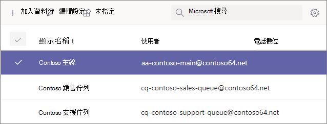

# <a name="manage-resource-accounts-in-microsoft-teams"></a><span data-ttu-id="2681e-103">在 Microsoft Teams 中管理資源帳戶</span><span class="sxs-lookup"><span data-stu-id="2681e-103">Manage resource accounts in Microsoft Teams</span></span>

<span data-ttu-id="2681e-104">資源帳戶是 Azure AD 中的停用使用者物件，一般可用來表示資源。</span><span class="sxs-lookup"><span data-stu-id="2681e-104">A resource account is a disabled user object in Azure AD, and can be used to represent resources in general.</span></span> <span data-ttu-id="2681e-105">例如，資源帳戶可用於Exchange會議室，並允許會議室擁有電話號碼和日曆。</span><span class="sxs-lookup"><span data-stu-id="2681e-105">For example, a resource account may be used in Exchange to represent conference rooms and allow them to have a phone number and calendar.</span></span> <span data-ttu-id="2681e-106">資源帳戶可以使用 2019 Microsoft 365或內部部署商務用 Skype Server中。</span><span class="sxs-lookup"><span data-stu-id="2681e-106">A resource account can be homed in Microsoft 365 or on premises using Skype for Business Server 2019.</span></span>

<span data-ttu-id="2681e-107">在 Microsoft Teams中，每個自動電話機或通話佇列都需要資源帳戶。</span><span class="sxs-lookup"><span data-stu-id="2681e-107">In Microsoft Teams, a resource account is required for each auto attendant or call queue.</span></span> <span data-ttu-id="2681e-108">資源帳戶也可能被指派服務電話號碼。</span><span class="sxs-lookup"><span data-stu-id="2681e-108">Resource accounts may also be assigned service telephone numbers.</span></span> <span data-ttu-id="2681e-109">這是您將電話號碼指派給自動語音機和通話佇列，讓來自Teams的來電者能夠到達自動語音機或通話佇列。</span><span class="sxs-lookup"><span data-stu-id="2681e-109">This is how you assign phone numbers to auto attendants and call queues allowing callers from outside Teams to reach the auto attendant or call queue.</span></span>

<span data-ttu-id="2681e-110">本文涵蓋如何建立資源帳戶，並準備好與自動通話和通話佇列一起使用。</span><span class="sxs-lookup"><span data-stu-id="2681e-110">This article covers how to create resource accounts and ready them for use with auto attendants and call queues.</span></span>

<span data-ttu-id="2681e-111">在啟動本文中的程式之前，請確保您已完成下列操作：</span><span class="sxs-lookup"><span data-stu-id="2681e-111">Before you start the procedures in this article, ensure you've done the following:</span></span>

- [<span data-ttu-id="2681e-112">取得虛擬使用者授權</span><span class="sxs-lookup"><span data-stu-id="2681e-112">Obtain virtual user licenses</span></span>](#obtain-virtual-user-licenses)
- [<span data-ttu-id="2681e-113">取得服務編號</span><span class="sxs-lookup"><span data-stu-id="2681e-113">Obtain service numbers</span></span>](#obtain-service-numbers)

### <a name="obtain-virtual-user-licenses"></a><span data-ttu-id="2681e-114">取得虛擬使用者授權</span><span class="sxs-lookup"><span data-stu-id="2681e-114">Obtain virtual user licenses</span></span>

<span data-ttu-id="2681e-115">每個資源帳戶都需要授權才能使用自動電話機和通話佇列。</span><span class="sxs-lookup"><span data-stu-id="2681e-115">Each resource account requires a license in order to work with auto attendants and call queues.</span></span> <span data-ttu-id="2681e-116">您可以使用免費的虛擬使用者 *Microsoft 365 電話系統虛擬使用者* 授權。</span><span class="sxs-lookup"><span data-stu-id="2681e-116">You can use a free *Microsoft 365 Phone System - Virtual User* license.</span></span> <span data-ttu-id="2681e-117">若要取得這些授權，請參閱 [虛擬使用者授權](teams-add-on-licensing/virtual-user.md)。</span><span class="sxs-lookup"><span data-stu-id="2681e-117">To obtain these licenses, see [Virtual User license](teams-add-on-licensing/virtual-user.md).</span></span>

<span data-ttu-id="2681e-118">本文稍後將說明如何將授權指派給資源帳戶。</span><span class="sxs-lookup"><span data-stu-id="2681e-118">We cover how to assign the license to a resource account later in this article.</span></span>

<span data-ttu-id="2681e-119">若要取得虛擬使用者授權，請前往 Microsoft 365 系統管理中心，前往帳單購買服務附加元件訂閱，並卷起到最後  >    >  \*\*\*\*-電話系統 *-* 虛擬使用者授權。</span><span class="sxs-lookup"><span data-stu-id="2681e-119">To get the Virtual User license, in the Microsoft 365 admin center, go to **Billing** > **Purchase services** > **Add-on subscriptions** and scroll to the end - you will see *Phone System - Virtual User* license.</span></span> <span data-ttu-id="2681e-120">選取 **立即購買**。</span><span class="sxs-lookup"><span data-stu-id="2681e-120">Select **Buy now**.</span></span> <span data-ttu-id="2681e-121">零成本，但您仍然需要遵循這些步驟取得授權。</span><span class="sxs-lookup"><span data-stu-id="2681e-121">There is a zero cost, but you still need to follow these steps to acquire the license.</span></span>

### <a name="obtain-service-numbers"></a><span data-ttu-id="2681e-122">取得服務編號</span><span class="sxs-lookup"><span data-stu-id="2681e-122">Obtain service numbers</span></span>

<span data-ttu-id="2681e-123">自動語音機和通話佇列的服務號碼是選擇性的，不過您至少需要一個服務號碼，來電者才能撥打您的自動語音通話和通話佇列組。</span><span class="sxs-lookup"><span data-stu-id="2681e-123">Service numbers are optional for auto attendants and call queues, however you will need at least one service number in order for callers to reach your auto attendant and call queue configuration.</span></span> <span data-ttu-id="2681e-124">若要讓服務號碼直接聯繫到任何自動話務員或通話佇列，您必須有具有關聯服務號碼的資源帳戶。</span><span class="sxs-lookup"><span data-stu-id="2681e-124">For any auto attendant or call queue that you want to be reachable directly by a service number, you must have a resource account with an associated service number.</span></span>

<span data-ttu-id="2681e-125">資源帳戶可以使用付費或免付費服務號碼。</span><span class="sxs-lookup"><span data-stu-id="2681e-125">Resource accounts can use either toll or toll-free service numbers.</span></span> <span data-ttu-id="2681e-126">您可以要求新的號碼，或從另一個電信公司埠現有的號碼。</span><span class="sxs-lookup"><span data-stu-id="2681e-126">You can request new numbers or port existing numbers from another carrier.</span></span>

<span data-ttu-id="2681e-127">若要取得新的服務號碼，請參閱取得 [服務電話號碼](getting-service-phone-numbers.md)。</span><span class="sxs-lookup"><span data-stu-id="2681e-127">To get new service numbers, see [Getting service phone numbers](getting-service-phone-numbers.md).</span></span>

<span data-ttu-id="2681e-128">若要從另一個電信公司移轉號碼，請參閱[將電話號碼移](phone-number-calling-plans/transfer-phone-numbers-to-teams.md)Teams。</span><span class="sxs-lookup"><span data-stu-id="2681e-128">To port a number from another carrier, see [Transfer phone numbers to Teams](phone-number-calling-plans/transfer-phone-numbers-to-teams.md).</span></span>

## <a name="create-a-resource-account"></a><span data-ttu-id="2681e-129">建立資源帳戶</span><span class="sxs-lookup"><span data-stu-id="2681e-129">Create a resource account</span></span>

<span data-ttu-id="2681e-130">您可以在系統管理中心建立Teams帳戶。</span><span class="sxs-lookup"><span data-stu-id="2681e-130">You can create a resource account in the Teams admin center.</span></span>


1. <span data-ttu-id="2681e-132">在 Teams系統管理中心中，展開 **整個組織設定**，然後按一下 [**資源帳戶**。</span><span class="sxs-lookup"><span data-stu-id="2681e-132">In the Teams admin center, expand **Org-wide settings**, and then click **Resource accounts**.</span></span>

2. <span data-ttu-id="2681e-133">按一下 [新增 **]**。</span><span class="sxs-lookup"><span data-stu-id="2681e-133">Click **Add**.</span></span>

3. <span data-ttu-id="2681e-134">在新增 **資源帳戶窗格中**，填寫 **顯示名稱**、**使用者名稱和\*\*\*\*資源帳戶類型**。</span><span class="sxs-lookup"><span data-stu-id="2681e-134">In the **Add resource account** pane, fill out **Display name**, **Username**, and the **Resource account type**.</span></span> <span data-ttu-id="2681e-135">資源帳戶類型可以是自動電話 **機** 或通話 **佇列**，取決於您打算使用此資源帳戶。</span><span class="sxs-lookup"><span data-stu-id="2681e-135">The resource account type can be either **Auto attendant** or **Call queue**, depending how you intend to use this resource account.</span></span>

4. <span data-ttu-id="2681e-136">按一下 [儲存]。</span><span class="sxs-lookup"><span data-stu-id="2681e-136">Click **Save**.</span></span>



## <a name="assign-a-license"></a><span data-ttu-id="2681e-138">指派授權</span><span class="sxs-lookup"><span data-stu-id="2681e-138">Assign a license</span></span>

<span data-ttu-id="2681e-139">針對每個資源帳戶，您必須指派一個 *Microsoft 365 電話系統 - 虛擬使用者\*\*授權或* 電話系統授權。</span><span class="sxs-lookup"><span data-stu-id="2681e-139">For each resource account, you must assign a *Microsoft 365 Phone System - Virtual User* license or *Phone System* license.</span></span>


1. <span data-ttu-id="2681e-141">在 Microsoft 365系統管理中心中，按一下要指派授權的資源帳戶。</span><span class="sxs-lookup"><span data-stu-id="2681e-141">In the Microsoft 365 admin center, click the resource account to which you want to assign a license.</span></span>

2. <span data-ttu-id="2681e-142">在 "**授權與應用程式"** 選項卡的 **"授權**" 下，選取 Microsoft 365 電話系統 -**虛擬使用者**。</span><span class="sxs-lookup"><span data-stu-id="2681e-142">On the **Licenses and Apps** tab, under **Licenses**, select **Microsoft 365 Phone System - Virtual User**.</span></span>

3. <span data-ttu-id="2681e-143">按一下 **[儲存變更**。</span><span class="sxs-lookup"><span data-stu-id="2681e-143">Click **Save changes**.</span></span>

## <a name="assign-a-service-number"></a><span data-ttu-id="2681e-144">指派服務號碼</span><span class="sxs-lookup"><span data-stu-id="2681e-144">Assign a service number</span></span>

<span data-ttu-id="2681e-145">如果您打算將資源帳戶與需要服務號碼的自動電話機或通話佇列一起使用，請指派號碼給資源帳戶。</span><span class="sxs-lookup"><span data-stu-id="2681e-145">If you're planning to use the resource account with an auto attendant or call queue that requires a service number, assign a number to the resource account.</span></span>


1. <span data-ttu-id="2681e-147">在 Teams系統管理中心，在 [資源帳戶> 頁面上，選取要指派服務號碼的資源帳戶，然後按一下 [**指派/取消指派**> 。</span><span class="sxs-lookup"><span data-stu-id="2681e-147">In the Teams admin center, on the **Resource accounts** page, select the resource account to which you want to assign a service number, and then click **Assign/unassign**.</span></span>

2. <span data-ttu-id="2681e-148">在 電話 **數位** 類型下拉式選項中，選擇您想要使用的電話號碼類型。</span><span class="sxs-lookup"><span data-stu-id="2681e-148">In the **Phone number type** dropdown, choose the type of number that you want to use.</span></span>

3. <span data-ttu-id="2681e-149">在 **[已指派的電話號碼** > 方塊中，搜尋您想要使用的號碼，然後按一下 [ **新增**。</span><span class="sxs-lookup"><span data-stu-id="2681e-149">In the **Assigned phone number** box, search for the number you want to use and click **Add**.</span></span>

4. <span data-ttu-id="2681e-150">按一下 [儲存]。</span><span class="sxs-lookup"><span data-stu-id="2681e-150">Click **Save**.</span></span>


<span data-ttu-id="2681e-151">若要將直接路由或混合式號碼指派給資源帳戶，您需要使用 PowerShell：</span><span class="sxs-lookup"><span data-stu-id="2681e-151">To assign a direct routing or hybrid number to a resource account you need to use PowerShell:</span></span>

`Set-CsOnlineApplicationInstance -Identity aa-contoso_main@contoso64.net -OnpremPhoneNumber +19295550150`

## <a name="next-steps"></a><span data-ttu-id="2681e-152">後續步驟</span><span class="sxs-lookup"><span data-stu-id="2681e-152">Next steps</span></span>

<span data-ttu-id="2681e-153">完成資源帳戶設定並指派服務號碼之後，就可以在自動電話機或通話佇列使用資源帳戶了。</span><span class="sxs-lookup"><span data-stu-id="2681e-153">Once you've completed the resource account setup and assigning a service number if needed, you're ready to use the resource account with an auto attendant or call queue.</span></span>

<span data-ttu-id="2681e-154">請參閱下列參照：</span><span class="sxs-lookup"><span data-stu-id="2681e-154">See the following references:</span></span>

 - [<span data-ttu-id="2681e-155">雲端自動傳話機</span><span class="sxs-lookup"><span data-stu-id="2681e-155">Cloud auto attendant</span></span>](create-a-phone-system-auto-attendant.md)

 - [<span data-ttu-id="2681e-156">雲端通話佇列</span><span class="sxs-lookup"><span data-stu-id="2681e-156">Cloud call queue</span></span>](create-a-phone-system-call-queue.md)

<span data-ttu-id="2681e-157">您可以使用編輯選項編輯資源帳戶 **顯示** 名稱和資源 **帳戶** 類型。</span><span class="sxs-lookup"><span data-stu-id="2681e-157">You can edit the resource account **Display name** and **Resource account** type using the **Edit** option.</span></span> <span data-ttu-id="2681e-158">完成 **時** ，按一下 [儲存。</span><span class="sxs-lookup"><span data-stu-id="2681e-158">Click **Save** when you are done.</span></span>

## <a name="change-an-existing-resource-account-to-use-a-virtual-user-license"></a><span data-ttu-id="2681e-159">將現有的資源帳戶變更為使用虛擬使用者授權</span><span class="sxs-lookup"><span data-stu-id="2681e-159">Change an existing resource account to use a Virtual User license</span></span>

<span data-ttu-id="2681e-160">如果您決定將現有資源帳戶上的授權從 **電話系統** 授權切換為虛擬使用者授權，您必須取得免費的虛擬使用者授權，然後按照 Microsoft 365 系統管理中心中的步驟將使用者移至不同的 [訂閱。](/microsoft-365/admin/manage/assign-licenses-to-users#move-users-to-a-different-subscription)</span><span class="sxs-lookup"><span data-stu-id="2681e-160">If you decide to switch the licenses on your existing resource account from a **Phone System** license to a Virtual User license, you'll need to acquire the free Virtual User license, and then follow the steps in the Microsoft 365 admin center to [Move users to a different subscription](/microsoft-365/admin/manage/assign-licenses-to-users#move-users-to-a-different-subscription).</span></span>

> [!WARNING]
> <span data-ttu-id="2681e-161">永遠移除完整的授權電話系統，並在同一個授權活動中指派虛擬使用者授權。</span><span class="sxs-lookup"><span data-stu-id="2681e-161">Always remove a full Phone System License and assign the Virtual User license in the same license activity.</span></span> <span data-ttu-id="2681e-162">如果您移除舊授權、儲存帳戶變更、新增授權，然後再次儲存帳戶設定，資源帳戶可能不再如預期運作。</span><span class="sxs-lookup"><span data-stu-id="2681e-162">If you remove the old license, save the account changes, add the new license, and then save the account settings again, the resource account may no longer function as expected.</span></span> <span data-ttu-id="2681e-163">如果發生這種情況，建議您為虛擬使用者授權建立新資源帳戶，並移除中斷的資源帳戶。</span><span class="sxs-lookup"><span data-stu-id="2681e-163">If this happens, we recommend you create a new resource account for the Virtual User license and remove the broken resource account.</span></span>

## <a name="skype-for-business-server-2019"></a><span data-ttu-id="2681e-164">Skype商務用伺服器 2019</span><span class="sxs-lookup"><span data-stu-id="2681e-164">Skype For Business Server 2019</span></span>

<span data-ttu-id="2681e-165">如果資源帳戶位於 Skype 商務用伺服器 2019，可用於雲端通話佇列和雲端自動話務員，請參閱規劃雲端通話佇列[](/SkypeforBusiness/hybrid/plan-call-queue)或[規劃雲端自動](/SkypeForBusiness/hybrid/plan-cloud-auto-attendant)話務員。</span><span class="sxs-lookup"><span data-stu-id="2681e-165">For resource accounts homed on Skype For Business Server 2019 that can be used with cloud call queues and cloud auto attendants, see [Plan Cloud call queues](/SkypeforBusiness/hybrid/plan-call-queue) or [Plan Cloud auto attendants](/SkypeForBusiness/hybrid/plan-cloud-auto-attendant).</span></span> <span data-ttu-id="2681e-166">混合式 (直接路由) 上的數位是使用內部部署 商務用 Skype Server 2019 伺服器上[New-CsHybridApplicationEndpoint](/powershell/module/skype/new-cshybridapplicationendpoint) Cmdlet 設定。</span><span class="sxs-lookup"><span data-stu-id="2681e-166">Hybrid implementations (numbers homed on Direct Routing) are configured using the [New-CsHybridApplicationEndpoint](/powershell/module/skype/new-cshybridapplicationendpoint) cmdlet on an on-premises Skype for Business Server 2019 server.</span></span>

<span data-ttu-id="2681e-167">建立應用程式實例時，您需使用的應用程式 ID 為：</span><span class="sxs-lookup"><span data-stu-id="2681e-167">The application IDs that you need to use while creating the application instances are:</span></span>

- <span data-ttu-id="2681e-168">**自動助理** ：ce933385-9390-45d1-9512-c8d228074e07</span><span class="sxs-lookup"><span data-stu-id="2681e-168">**Auto Attendant:** ce933385-9390-45d1-9512-c8d228074e07</span></span>
- <span data-ttu-id="2681e-169">**通話佇列** ：11cd3e2e-fcb-42ad-ad00-878b93575e07</span><span class="sxs-lookup"><span data-stu-id="2681e-169">**Call Queue:** 11cd3e2e-fccb-42ad-ad00-878b93575e07</span></span>

> [!NOTE]
> <span data-ttu-id="2681e-170">如果您希望 Skype For Business Server 2019 使用者可以搜尋通話佇列或自動話務員，您應該在 Skype For Business Server 2019 上建立資源帳戶，因為線上資源帳戶不會同步處理至 Active Directory。</span><span class="sxs-lookup"><span data-stu-id="2681e-170">If you want the call queue or auto attendant to be searchable by Skype For Business Server 2019 users, you should create your resource accounts on Skype For Business Server 2019, since online resource accounts are not synced down to Active Directory.</span></span> <span data-ttu-id="2681e-171">當 sipfederationtls 的 DNS SRV 記錄解析為 商務用 Skype Server 2019 時，必須在 Skype for Business Server 2019 使用 SfB Management shell 建立資源帳戶，並同步處理至 Azure AD。 </span><span class="sxs-lookup"><span data-stu-id="2681e-171">When DNS SRV records for sipfederationtls resolve to Skype for Business Server 2019, then resource accounts **must** be created on Skype For Business Server 2019 using SfB Management shell and synchronized to Azure AD.</span></span>

<span data-ttu-id="2681e-172">針對與專案混合的商務用 Skype Server：</span><span class="sxs-lookup"><span data-stu-id="2681e-172">For implementations that are hybrid with Skype for Business Server:</span></span>

   [<span data-ttu-id="2681e-173">規劃雲端自動語音應答</span><span class="sxs-lookup"><span data-stu-id="2681e-173">Plan Cloud auto attendants</span></span>](/SkypeForBusiness/hybrid/plan-cloud-auto-attendant)
  
   [<span data-ttu-id="2681e-174">規劃雲端通話佇列</span><span class="sxs-lookup"><span data-stu-id="2681e-174">Plan Cloud call queues</span></span>](/SkypeforBusiness/hybrid/plan-call-queue)
   
   [<span data-ttu-id="2681e-175">設定 on-prem 資源帳戶</span><span class="sxs-lookup"><span data-stu-id="2681e-175">Configure on-prem resource accounts</span></span>](/SkypeForBusiness/hybrid/configure-onprem-ra)


## <a name="delete-a-resource-account"></a><span data-ttu-id="2681e-176">刪除資源帳戶</span><span class="sxs-lookup"><span data-stu-id="2681e-176">Delete a resource account</span></span>

<span data-ttu-id="2681e-177">在刪除電話號碼之前，請務必先將電話號碼與資源帳戶解除關聯，以避免您的服務號碼卡在擱置模式。</span><span class="sxs-lookup"><span data-stu-id="2681e-177">Make sure you dissociate the telephone number from the resource account before deleting it, to avoid getting your service number stuck in pending mode.</span></span>

<span data-ttu-id="2681e-178">完成之後，您可以刪除系統管理Microsoft 365中的資源帳戶，位於使用者選項卡下。</span><span class="sxs-lookup"><span data-stu-id="2681e-178">After you do that, you can delete the resource account in the Microsoft 365 admin center, under the Users tab.</span></span>

<span data-ttu-id="2681e-179">若要從資源帳戶取消關聯直接路由電話號碼，請使用下列 Cmdlet：</span><span class="sxs-lookup"><span data-stu-id="2681e-179">To disassociate a direct routing telephone number from the resource account, use the following cmdlet:</span></span>

```powershell
Set-CsOnlineApplicationInstance -Identity  <Resource Account oid> -OnpremPhoneNumber ""
```