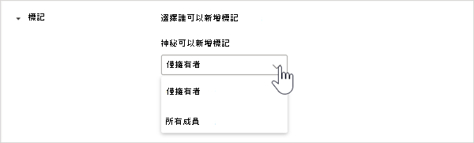
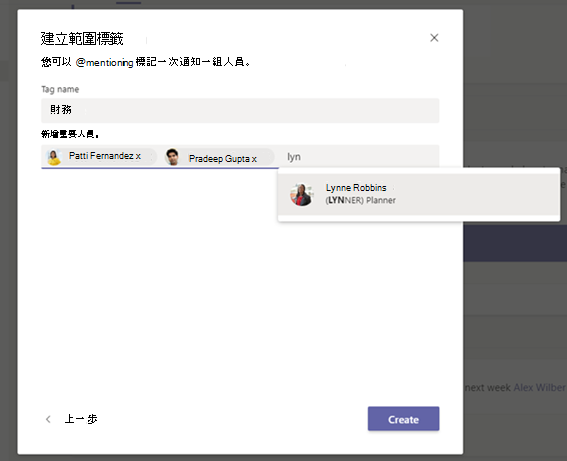

# 在 Microsoft TeamsManage tags in Microsoft Teams

## 概觀Overview

其中Microsoft Teams標記可讓使用者快速且輕鬆地與團隊中的一部分人員聯繫。Tags in Microsoft Teams let users quickly and easily connect with a subset of people on a team. 您可以建立並指派自訂標記，根據角色、專案、技能或位置等屬性來將人員分類。You can create and assign custom tags to categorize people based on attributes, such as role, project, skill, or location. 或者，您可以根據人員在 Shifts 應用程式中的排程和班次資訊，自動將標記 [指派給人員](https://support.microsoft.com/office/apps-and-services-cc1fba57-9900-4634-8306-2360a40c665b?#PickTab=Shifts)。Or, tags can be automatically assigned to people based on their schedule and shift information in the [Shifts app](https://support.microsoft.com/office/apps-and-services-cc1fba57-9900-4634-8306-2360a40c665b?#PickTab=Shifts). 將標記新加入一或多個小組成員之後，頻道文章中的小組@mentions就可以在 @mentions 中使用標記，或只與指派該標記的人開始交談。After a tag is added to one or multiple team members, it can be used in @mentions by anyone on the team in a channel post or to start a conversation with only those people who are assigned that tag.

如先前所述，在 Teams 中有兩種Teams。As mentioned earlier, there are two kinds of tags in Teams.

- **自訂標記**：團隊擁有者和小組成員 (啟用此功能時，) 手動建立並指派標記給人員。**Custom tags**: Team owners and team members (if the feature is enabled for them) can manually create and assign tags to people. 例如，「設計工具」或「放射科醫生」標記會抵達團隊中的這些人員集合，而不需要輸入他們的名稱。For example, a "Designer" or "Radiologist" tag will reach those sets of people on a team without having to type their names.
- **以班次標記**：使用這項功能，系統會自動在 Teams 的 [Shifts](https://support.microsoft.com/office/get-started-in-shifts-5f3e30d8-1821-4904-be26-c3cd25a497d6#bkmk_openshiftsappdesktop)應用程式中指派符合其排程和班組名的Teams。**Tagging by shift**: With this feature, people are automatically assigned tags that match their schedule and shift group name in the [Shifts app](https://support.microsoft.com/office/get-started-in-shifts-5f3e30d8-1821-4904-be26-c3cd25a497d6#bkmk_openshiftsappdesktop) in Teams. 例如，在聊天或頻道貼文使用標記時，「EngineerOnCall」標記會到達所有排程在 Shifts 中工作的工程師。For example, the "EngineerOnCall" tag reaches all engineers who are scheduled in Shifts to work at the time the tag is used in a chat or channel post. 使用輪班標記Teams，當使用者需要快速轉遞資訊時，不需要猜測輪班員工的名稱。With tagging by shift, Teams takes the guesswork out of knowing the name of on-shift staff when users need to quickly relay information. 以班次標記也可以由 JDA、Kronos 和 AMiON 等主要員工管理系統做為後盾，將它們與公司中的班次Teams。Tagging by shift can also be backed by major workforce management systems like JDA, Kronos, and AMiON by integrating them with Shifts in Teams. 若要深入瞭解如何設定此功能，請參閱設定班次 [標記](#set-up-tagging-by-shift)。To learn more about how to set up this feature, see [Set up tagging by shift](#set-up-tagging-by-shift).

> [!NOTE]
> 私人頻道尚不支援標記。Tags are not yet supported in private channels. 標記不適用於高GCC或美國國防部 (DoD) 組織。Tags are not available in GCC High, or Department of Defense (DoD) organizations. 

## 標記如何工作How tags work

您可以手動新增或自動將標記指派給特定團隊中的人員。A tag can be manually added or automatically assigned to a person on a specific team. 然後可用於聊天@mentions的至行或小組任何標準頻道的貼文。It can then be used in @mentions on the **To** line in a chat or in a post on any standard channel of the team. 以下範例說明標記在Teams：Here's some examples of how tags can be used in Teams:

- 商店管理員會張貼公告至頻道，以通知所有出納。A store manager posts an announcement to a channel to notify all cashiers.
- 醫院系統管理員會傳送訊息給頻道中所有的放射科醫師。A hospital administrator sends a message to all radiologists in a channel.
- 行銷經理會開始與所有設計師進行群組聊天。A marketing manager starts a group chat with all designers.
- 一名護士會傳送訊息給所有的通話中卡片專家。A nurse sends a message to all on-call cardiologists.  (即將推出) (coming soon)
- 系統工程師會張貼公告至頻道，以通知所有輪班的現場工程師。A system engineer posts an announcement to a channel to notify all on-shift field engineers.  (即將推出) (coming soon)

當頻道交談@mentioned標記時，與標記相關聯的小組成員會收到通知，就像任何其他@mention。When a tag is @mentioned in a channel conversation, team members associated with the tag will get notified, just like any other @mention.

## 管理貴組織的自訂標記Manage custom tags for your organization

做為系統管理員，您可以在系統管理中心控制整個組織Microsoft Teams標記。As an admin, you can control how tags are used across your organization in the Microsoft Teams admin center. 目前，您無法使用 PowerShell 來管理標記。Currently, you can't use PowerShell to manage tags.

團隊最多可以有 100 個標記，最多 100 個小組成員可以指派給標記，最多 25 個標記可以指派給單一使用者。A team can have up to 100 tags, up to 100 team members can be assigned to a tag, and up to 25 tags can be assigned to a single user. 

### 設定誰可以新增自訂標記Set who can add custom tags

根據預設，團隊擁有者可以新增自訂標記。By default, team owners can add custom tags. 您可以變更此設定，讓團隊擁有者和小組成員建立、編輯、刪除和管理標記，也可以關閉貴組織的標記。You can change this setting to allow team owners and team members to create, edit, delete, and manage tags or you can turn off tags for your organization.

1. 在系統管理中心的左側導Microsoft Teams，按一下 [全 **組織** 設定Teams  >  **設定**。In the left navigation of the Microsoft Teams admin center, click **Org-wide settings** > **Teams settings**.
2. 在 **標記下\*\*\*\*，選取下列** 其中一個選項，以管理標記旁的標記：Under **Tagging**, next to **Tags are managed by**, select one of the following options:

    - **團隊擁有者和成員**：允許團隊擁有者和成員管理標記。**Team owners and members**: Allow team owners and members to manage tags.
    - **團隊擁有者**：允許團隊擁有者管理標記。**Team owners**: Allow team owners to manage tags.
    - **已停用**：關閉標記。**Disabled**: Turn off tags.

### 設定自訂標記設定Configure custom tags settings

您可以設定下列標記設定，以控制自訂標記在整個組織的使用方式。You can configure the following tags settings to control how custom tags are used across your organization.

1. 在系統管理中心的左側導Microsoft Teams，按一下 [全 **組織** 設定Teams  >  **設定**。In the left navigation of the Microsoft Teams admin center, click **Org-wide settings** > **Teams settings**.
2. 在 **標記下**，根據貴組織的需求設定下列專案。Under **Tagging**, set the following, depending on the needs of your organization.

    - 讓團隊擁有者取代誰可以管理標記：當您開啟此設定時，團隊擁有者可以設定小組成員是否可以在團隊中建立和管理標記，而標記值是由設定來管理，是每個團隊的預設值。**Let team owners override who can manage tags**: When you turn on this setting, team owners can set whether team members can create and manage tags within a team and the value of the **Tags are managed by** setting is the default value for each team. 如果您關閉此設定，則無法變更每個團隊的標記管理方式設定。If you turn off this setting, the **Tags are managed by** setting can't be changed per team.
    - **建議的預設標記**：使用此標記可新增一組預設標記。**Suggested default tags**: Use this to add a set of default tags. 您可以新增最多 25 個標記，每個標記最多可以包含 25 個字元。You can add up to 25 tags, and each tag can contain a maximum of 25 characters. 如果已啟用 (團隊擁有者和成員) 可以使用這些建議、新增到他們，或建立一組新的標記。Team owners and members (if the feature is enabled for them) can use these suggestions, add to them, or create a new set of tags.
    - **建立自訂標記：** 開啟此設定，讓其他人新增您設定之建議的預設標記外的其他標記。**Let custom tags be created**: Turn on this setting to let people add tags other than the suggested default tags that you set. 如果關閉此功能，使用者只能使用建議的預設標記。If this is turned off, people can only use the suggested default tags. 如果您關閉此功能，請確定您新增一或多個預設標記。If you turn this off, make sure that you add one or more default tags.

## 管理小組的自訂標記設定Manage custom tags settings for a team

如果您開啟了讓團隊擁有者在系統管理中心中Microsoft Teams誰可以管理標記設定，團隊擁有者可以設定成員是否可以在小組層級新增標記。If you turned on the **Let team owners override who can manage tags** setting in the Microsoft Teams admin center, team owners can set whether members can add tags at the team level. 若要這麼做，在小組設定上，前往標記，然後選擇誰可以新增標記。 To do this, on the **Settings** tab for a team, go to **Tags**, and then choose who can add tags.

## 使用標記Use tags

以下是如何新增自訂標記，以及如何在 (中使用 Shifts 應用程式來設定Teams) 。Here's how to add custom tags and how to set up tagging by shift (if you're using the Shifts app in Teams). 若要深入瞭解，請查看 在 Teams 中[使用Teams。](https://support.office.com/article/using-tags-in-teams-667bd56f-32b8-4118-9a0b-56807c96d91e)To learn more, check out [Using tags in Teams](https://support.office.com/article/using-tags-in-teams-667bd56f-32b8-4118-9a0b-56807c96d91e).

### 建立及指派自訂標記Create and assign custom tags

若要建立及指派自訂標記，Teams **應用程式左側** 的自訂標記，然後在清單中尋找您的小組。To create and assign custom tags, select **Teams** on the left side of the app, and then find your team in the list. 選取 **11 個其他選項**，然後選擇管理 **標記**。Select **˙˙˙ More options**, and then choose **Manage tags**. 您可以在這裡建立標記，並將標記指派給小組中的人員。Here, you can create tags and assign them to people on your team.

若要刪除標記，請選取 **標記旁的 10** 個其他選項，然後選取 **刪除標記**。To delete a tag, select **˙˙˙ More options** next to the tag, and then select **Delete tag**.

### 設定班次標記Set up tagging by shift

以班次標記可讓您的使用者即時與輪班人員聯繫。Tagging by shift allows your users to reach the people on-shift in real-time. Teams自動指派具有符合其排程的標記的使用者，然後從 Shifts App 移轉群組名稱，以啟用動態角色型傳訊。Teams automatically assigns users with tags matching their schedule and shift group name from the Shifts app, enabling dynamic role-based messaging. 通知只會在使用標記開始聊天或頻道貼文時，只發給輪班人員。Notifications are sent only to those people who are on shift at the time a tag is used to start a chat or in a channel post. 

1. 在 Teams，請前往[Shifts 應用程式](https://support.microsoft.com/office/get-started-in-shifts-5f3e30d8-1821-4904-be26-c3cd25a497d6#bkmk_openshiftsappdesktop)。In Teams, go to the [Shifts app](https://support.microsoft.com/office/get-started-in-shifts-5f3e30d8-1821-4904-be26-c3cd25a497d6#bkmk_openshiftsappdesktop).
2. 建立 [班次群組，](https://support.microsoft.com/office/fill-out-a-schedule-in-shifts-2d58df9b-1c6c-4c84-b0c3-835de7ad13ea#bkmk_organizeshiftsbygroup) 以角色等屬性命名。Create [shift groups](https://support.microsoft.com/office/fill-out-a-schedule-in-shifts-2d58df9b-1c6c-4c84-b0c3-835de7ad13ea#bkmk_organizeshiftsbygroup) and name them after an attribute such as a role. 例如，EngineerOnCall。For example, EngineerOnCall. 班次組名是標記的名稱。The shift group name will be the name of the tag.
3. [將班指派](https://support.microsoft.com/office/fill-out-a-schedule-in-shifts-2d58df9b-1c6c-4c84-b0c3-835de7ad13ea) 給小組成員以填寫排程。[Fill out a schedule](https://support.microsoft.com/office/fill-out-a-schedule-in-shifts-2d58df9b-1c6c-4c84-b0c3-835de7ad13ea) by assigning shifts to members of your teams. 完成後，在 Shifts 應用程式的右上角，選取 與 **小組共用**。When you're finished, in the upper-right corner of the Shifts app, select **Share with team**.
4. 等候 15 分鐘，讓排定的班次填入標記服務。Wait 15 minutes for the scheduled shifts to populate the tagging service.
5. 在任意使用標記的地方使用Teams。Use the tag anywhere you use tags in Teams.

## 相關主題Related topics

[在 TeamsUsing tags in Teams](https://support.office.com/article/using-tags-in-teams-667bd56f-32b8-4118-9a0b-56807c96d91e)

[在 Teams 中管理貴組織的 Shifts 應用程式Manage the Shifts app for your organization in Teams](expand-teams-across-your-org/shifts/manage-the-shifts-app-for-your-organization-in-teams.md)

[Shifts 說明文件Shifts Help documentation](https://support.microsoft.com/office/apps-and-services-cc1fba57-9900-4634-8306-2360a40c665b)
