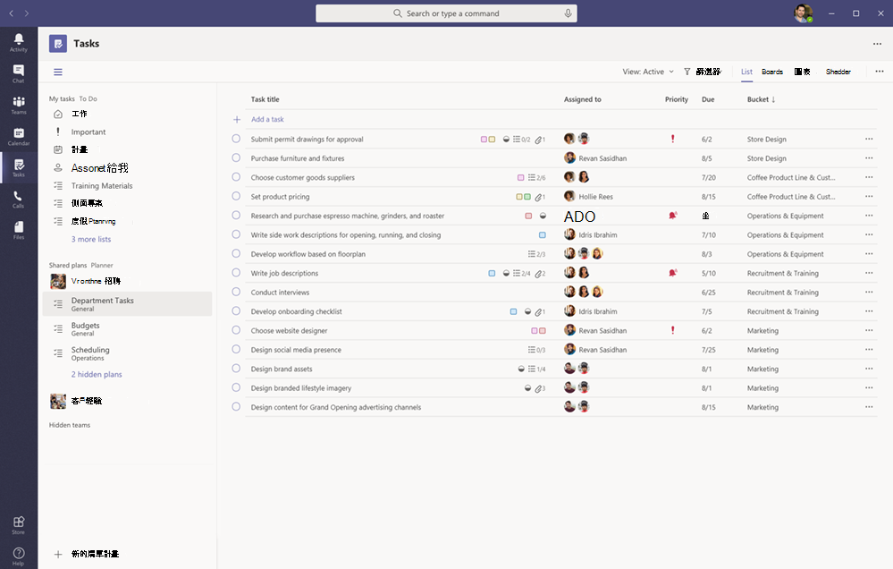
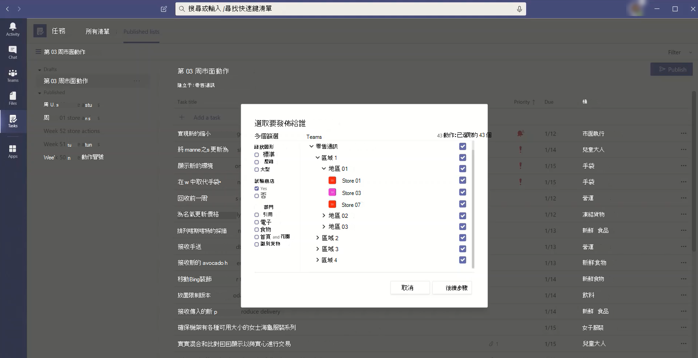
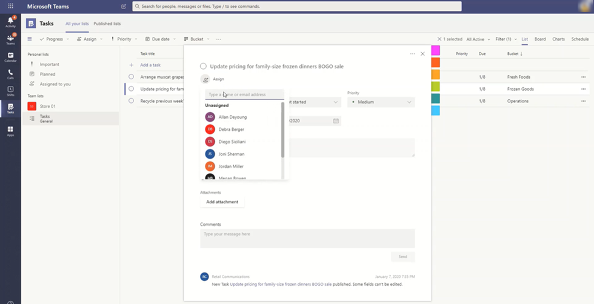

# 在 Microsoft Teams 中管理貴組織的 [工作] 應用程式

## [工作] 概觀

[工作] 應用程式為 Microsoft Teams 帶來了凝聚性的工作管理體驗，將 [Microsoft To Do](https://todo.microsoft.com/tasks/) 所啟動的個別工作以及 Planner 所啟動的小組工作整合在一個地方。 使用者可以在 Teams 左側存取 [工作] 應用程式，以及在個別小組中的頻道以索引標籤的形式存取。 使用 **我的工作和****共用計畫**，使用者可以查看及管理其所有個人和小組工作，並排定工作優先順序。 [工作] 應用程式可在 Teams 的桌面版、Web 和行動用戶端使用。

> [!NOTE]
> 當我們推出 Teams 桌面版用戶端的 [工作] 體驗時，最初向使用者顯示的應用程式名稱為 **Planner**。 然後，會暫時變更為 **Planner 的工作和待辦事項**，之後再將其重新命名為 **工作**。 在 Teams 行動用戶端，使用者將會看到應用程式名稱一直都顯示為 **工作**。 有可用的桌面體驗之後，可能會有短暫的延遲之後才會有行動裝置體驗。

   

對於想要簡化第一線工作者工作管理的組織，[工作] 還包含可讓您在第一線員工間進行大規模鎖定、發佈及追蹤工作的功能。 例如，公司和地區性領導階層可建立並發佈針對相關地點 (例如特定零售商店) 的工作清單，並透過即時報告追蹤進度。 經理人可將工作指派給他們的員工，並指揮在其地點中的活動，而第一線工作者在行動裝置或桌上型電腦中有其指派工作的優先順序清單。 若要啟用 [任務發佈](#task-publishing)，首先為貴組織設定小組目標階層，定義階層中所有團隊彼此關聯性。

## 有關 [工作] 必須知道的事項

[工作] 能以應用程式和頻道中的索引標籤的形式供使用。 應用程式會顯示 To Do 中的個別工作，以及 Planner 中的小組工作。 此選項卡只會顯示小組工作。

使用者可在桌上型電腦、Web 和行動裝置上使用 [工作]。 如果在 Teams 桌面版用戶端安裝 [工作]，使用者也會在其 Teams 的 Web 和行動用戶端上看到。 來賓除外。 請務必瞭解，訪客只能從 Teams 行動用戶端存取 [工作] 應用程式。 訪客將在 Teams 的桌面版和 Web 用戶端上看到 [工作] 索引標籤。

**我的工作** 會顯示使用者的個別工作。 **共用計畫** 會示整個小組正在處理的工作，並包含任何以 [工作] 索引標籤的方式新增至頻道的工作清單。 請注意工作、工作與 Planner 中工作之間的下列關係：

- 使用者在 [工作] 應用程式中建立的工作清單也會顯示在該使用者的待辦事項用戶端。 同樣地，使用者在待辦事項中建立的工作清單將會顯示在該使用者的 [工作] 中的 **我的工作**。 這同樣適用於個別工作。

- 新增至頻道的任何 [工作] 索引標籤也會顯示在 Planner 用戶端中。 使用者在 Planner 中建立計畫時，計畫將不會顯示在 [工作] 或 [Planner] 應用程式中，除非該計畫已新增為頻道的索引標籤。 使用者新增 [工作] 索引標籤時，可以建立新的清單或計畫，或選擇現有的清單或計畫。

## 設定 [工作]

> [!IMPORTANT]
> 您為 Planner 配置的設定和原則也將適用於 [工作]。

### 啟用或停用組織中的 [工作]

您的組織中的所有 Teams 使用者預設會啟用 [工作]。 您可以在 Microsoft Teams 系統管理中心的[管理應用程式](manage-apps.md)頁面上關閉或開啟組織層級的應用程式。

1. 在 Microsoft Teams 系統管理中心的左側瀏覽窗格中，移至 **Teams 應用程式** > **管理應用程式**。
2. 在應用程式清單中，執行下列其中一項動作：

    - 若要關閉貴組織的工作，請搜尋工作應用程式，選取它， **然後選取封鎖**。
    - 若要開啟貴組織的工作，請搜尋工作應用程式，選取它， **然後選取允許**。

> [!NOTE]
> 如果您找不到 [工作] 應用程式，請在本文的第一個記事中搜尋名稱。 此應用程式仍處於重新命名的程序中。

### 啟用或停用組織中特定使用者的 [工作]

若要允許或封鎖貴組織中的特定使用者使用 [工作]，請確定您的組織在[管理應用程式](manage-apps.md)頁面上已開啟 [工作]，然後建立自訂應用程式權限原則，並將其指派給這些使用者。 若要深入了解，請參閱[管理 Teams 中的應用程式權限原則](teams-app-permission-policies.md)。

### 使用應用程式設定原則將工作釘選到 Teams

應用程式設定原則可讓您自訂 Teams，以醒目提示對貴組織中的使用者最重要的應用程式。 在策略中設定的應用程式會釘到應用程式欄 ，即 Teams 桌面用戶端側邊以及 Teams 行動用戶端底部的資料行，使用者可以在這裡快速且輕鬆地存取它們。

若要為您的使用者釘選 [工作] 應用程式，您可以編輯全域 (全組織預設值) 原則，或建立並指定自訂應用程式設定原則。 若要深入了解，請參閱[管理 Teams 中的應用程式設定原則](teams-app-setup-policies.md)。

### 如果使用者已取得 Exchange Online 授權，則會顯示使用者的 [我的工作]

如果您不希望使用者看到 **我的工作**，可將其隱藏。 若要隱藏 **我的工作，**[請移除使用者Exchange Online授權](/microsoft-365/admin/manage/remove-licenses-from-users)。 請務必瞭解，在移除 Exchange Online 授權之後，該使用者將無法再存取其信箱。  信箱資料會保留 30 天，之後資料將被移除且無法復原，除非信箱位於[就地保留或訴訟封存](/exchange/security-and-compliance/in-place-and-litigation-holds)。

我們不建議您移除資訊工作者的 Exchange Online 授權，但在某些情況下，您可以用這種方式隱藏我的工作，例如對於不依賴電子郵件的前線工作人員。****

## 發佈

使用 [工作發佈]，您的組織可以發佈針對組織內部特定地點 (小組) 的工作清單，以定義及共用將在這些地點完成的工作計畫。

- 發佈小組中的人員 (例如公司或地區性領導階層) 可建立工作清單，並將其發佈給特定小組。 
    
- 收件者小組的主管可查看發佈的工作清單，並將個別的工作指派給小組成員。 
    
- 第一線工作者可輕鬆透過行動裝置查看指派給他們的工作。 他們可以附加相片以顯示工作 (如適用)，並將其工作標示為已完成。
- 出版商和管理者可以查看報告，以瞭解每個階層的工作指派和完成狀態，包括依地點 (小組)、工作清單和個別工作。 
    

使用者會在 [工作] 應用程式中的 **發佈清單** 索引標籤上建立、管理及發佈工作清單。 只有在貴組織[設定小組目標階層](#set-up-your-team-targeting-hierarchy)且使用者屬於階層所包含的小組時，才會顯示該索引標籤。 階層會決定使用者是否可以發佈或接收工作清單，以及查看已收到清單的報告。

### 範例案例

以下是工作發佈方式的範例。

Contoso 即將推出新的食物外帶和遞送優惠。 若要維持一致的品牌體驗，他們必須在超過 300 個商店地點協調執行一致性的推出方式。

行銷小組會和零售通訊經理分享促銷的詳細資料以及對應的工作清單。 零售通訊管理員擔任商店的閘道管理員，負責審查資訊。 接著，他們為促銷建立工作清單，並針對受影響的商店需要執行的每一個工作單位建立工作。 當工作清單完成時，他們必須選取必須完成工作的商店。 在此情況下，優惠僅適用於在美國擁有店內餐廳的商店。 在工作中，他們根據店內餐廳屬性篩選商店清單，選取階層中的符合美國位置，然後將工作清單發佈至這些商店。

每個地點的商店經理都會收到一份已發佈工作的複本，並將這些工作指派給小組成員。 經理可以使用 [工作] 體驗來瞭解其商店必須完成的所有工作。 他們也可以使用可用的篩選，專注於一組特定的工作，例如 [今天必須完成的工作] 或 [特定區域的工作]。

每個商店地點的第一線工作者在其行動裝置上的 [工作] 中現在有一份按優先順序排列的工作。 工作完成時，會將工作標示為完成。 他們甚至可以選擇將相片上傳並附加至工作，以顯示其工作。

Contoso 總部和中級經理可以查看報告，以瞭解每個商店和商店之間工作的指派和完成狀態。 他們也可以深入特定工作，以瞭解不同商店內的狀態。 隨著啟動日期逐漸逼近，他們可以發現任何異常狀況，如有需要可與其小組商討。 這種可視性可讓 Contoso 提高推出效率，並提供商店之間更一致性的體驗。

### 設定您的團隊目標階層

若要在貴組織中啟用工作發佈，您必須先以 .CSV 檔設定您的小組目標架構。 架構會定義階層中所有團隊之間的關聯性，並定義可用來篩選和選取團隊的屬性。 建立架構之後，可將其上傳至 Teams，並套用到您的組織。 發佈小組的成員 (例如範例案例中的 [零售通訊經理]) 可依據階層、屬性或兩者的組合來篩選小組，以選取應接收工作清單的相關小組，然後將工作清單發佈給那些小組。

如需有關如何設定您的小組目標階層的步驟，請參閱 [設定您的小組目標階層](set-up-your-team-hierarchy.md)。

## Power Automate 和圖形 API

[工作] 可支援待辦事項的 Power Automate 以及 Planner 的圖形 API。如需深入了解，請參閱：

- [Planner 工作和計畫 API 概觀](/graph/planner-concept-overview)
- [透過 Power Automate 使用 Microsoft To Do](https://support.office.com/article/using-microsoft-to-do-with-power-automate-526e8f75-217b-46e0-9e06-44780b72c295)