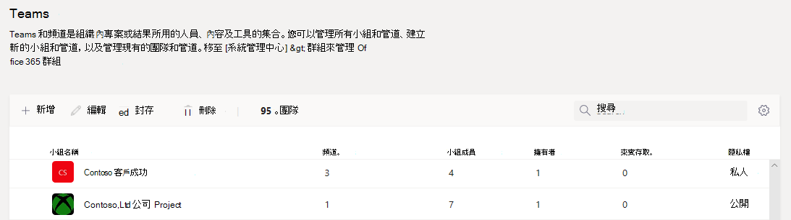
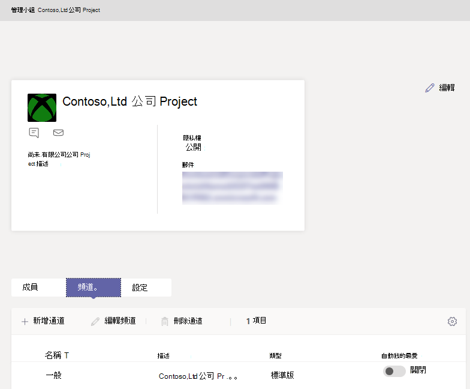

# 在 Microsoft Teams 系統管理中心管理團隊

## 概觀

本文提供 Microsoft Teams 系統管理中心的 Teams 管理工具概觀。

身為系統管理員，您可能需要檢視或更新貴組織為共同作業而設定的團隊，或者您可能需要執行補救動作，例如為無擁有者的團隊指派擁有者。 您可以同時透過 Microsoft Teams PowerShell 模組和 Microsoft Teams 系統管理中心管理貴組織中所使用的團隊。 您可以在 <a href="https://go.microsoft.com/fwlink/p/?linkid=2024339" target="_blank">https://admin.microsoft.com</a> 存取系統管理中心。 如需使用這兩個工具組的完整系統管理功能，您應確認已獲指派下列其中一個角色：

- 全域系統管理員
- Teams 系統管理員

您可以在 [使用 Microsoft Teams 系統管理員角色以管理 Teams](using-admin-roles.md) 中深入瞭解 Microsoft Teams 中的系統管理員角色，而且您可以在 [Microsoft Teams Cmdlet 參考](/powershell/teams/) 中深入了解如何使用 PowerShell Cmdlet 管理團隊。

## Teams 概觀格線

Teams 的管理工具位於 Microsoft Teams 系統管理中心的 **Teams** 節點下方。 (在系統管理中心，選取 **Teams** > **管理 Teams**。) 每個團隊都會受到一個 Microsoft 365 群組支援，而此節點可提供您的組織中由 Microsoft Teams 啟用之群組的檢視。

  

格線顯示出下列內容：

- **小組名稱**
- **頻道** - 團隊中的所有頻道計數，包括預設的 [一般] 頻道。
- **小組成員** - 使用者總數，包括您的租用戶中的擁有者、來賓和成員。
- **擁有者** - 此團隊的擁有者計數。
- **來賓** - 身為此團隊成員的 Azure Active Directory B2B 來賓使用者計數。
- **隱私權** - 支援 Microsoft 365 群組的 Visibility/AccessType。
- **狀態** - 此團隊的已封存或使用中狀態。 深入瞭解在 [封存或還原團隊](https://support.office.com/article/archive-or-restore-a-team-dc161cfd-b328-440f-974b-5da5bd98b5a7) 中的封存 Teams。
- **描述** - 支援 Microsoft 365 群組的描述。
- **分類** - 指派給支援 Microsoft 365 群組的分類 (若用於您的組織)。 深入了解位於 [在貴組織中建立適用於 Office 群組的分類](/office365/enterprise/powershell/manage-office-365-groups-with-powershell#create-classifications-for-office-groups-in-your-organization) 的分類。
- **GroupID** - 支援 Microsoft 365 群組的唯一 GroupID。

> [!NOTE]
> 如果您無法在格線中看到所有屬性，請按一下 **[編輯欄位]** 圖示。 在 **編輯欄位** 窗格中，您可以使用切換開關以開啟或關閉格線中的欄位。 當您完成之後，按一下 **套用**。

### 新增

若要新增小組，請按一下 **[新增]**。 在 **新增小組** 窗格中，為小組命名和描述、設定您是否要將此小組設為私人或公開小組，並設定分類。

> [!NOTE]
> 新建立的團隊可以立即在 Microsoft Teams 系統管理中心內管理，與 Outlook 等其他用戶端的體驗不同。

### 編輯

若要編輯群組和團隊特定的設定，按一下小組名稱左側以選取團隊，然後選取 **編輯**。

### 封存

您可以封存團隊。 將團隊封存可將該團隊放入 Teams 內的唯讀模式。 身為系統管理員，您可以在系統管理中心代表貴組織將小組封存和取消封存。 

### 刪除

刪除團隊是一個對團隊以及對應 Microsoft 365 群組的虛刪除。 若要還原誤刪的團隊，請依照 [還原已刪除的群組](/microsoft-365/admin/create-groups/restore-deleted-group) 中的指示。

### 搜尋

搜尋目前支援字串「開始於」，並搜尋 **團隊名稱** 欄位。

## 團隊設定檔

您可以按一下團隊名稱，從主要團隊概觀格線瀏覽至任何團隊的小組設定檔頁面。 小組設定檔頁面會顯示屬於該團隊的成員、擁有者和來賓 (及其支援的 Microsoft 365 群組)，以及團隊的頻道和設定。 從小組設定檔頁面，您可以：

- 新增或移除成員和擁有者。
- 新增或移除頻道 (請注意，您無法移除 [一般] 頻道)。
- 變更團隊和群組設定。
 

## 對團隊進行變更

在團隊的設定檔頁面面上，您可以變更團隊的下列元素：

- **成員** - 新增或移除成員，以及升階或降階擁有者。
- **頻道** - 新增頻道，和編輯或移除現有的頻道。 請記住，您無法刪除預設的 [一般] 頻道。
- **小組名稱**
- **描述**
- **隱私權** - 將團隊設定為公開或私人。
- **分類** - 這是由您的 Microsoft 365 群組分類所支援。 選擇 **機密**、**高度機密** 或 **一般**。
- **交談設定** - 設定成員是否可以編輯和刪除已寄出的郵件。
- **頻道設定** - 設定成員是否可以建立新頻道和編輯現有的頻道，以及新增、編輯和移除索引標籤、連接器和應用程式。

您對團隊所做的變更會進行紀錄。 如果您要修改群組設定 (變更名稱、描述、相片、隱私權、分類或小組成員)，此變更會透過稽核管道歸屬於您。 如果您要對 Teams 特定設定執行動作，您的變更會遭到追蹤並歸屬至團隊的 [一般] 頻道中。

## 疑難排解

**問題：Team 概觀格線中遺失 Teams**

Teams 概觀格線內的團隊清單中遺失您的部分團隊。

**原因**：當系統不正確 (或尚未) 分析團隊時，會發生此問題，這可能會導致遺失可識別的屬性。

**解決方案：透過 MS Graph 將屬性手動設為正確的值**

使用 **"[Get-UnifiedGroup](/powershell/module/exchange/users-and-groups/get-unifiedgroup)"** Cmdlet 取代查詢中的 **{groupid}**，以取得您透過 Exchange Online PowerShell 取得的有問題之實際 GroupId，並作為 "**ExternalDirectoryObjectId**" 屬性。

1. 存取 [Graph 總管](https://developer.microsoft.com/graph/graph-explorer)。

2. 在左側功能表上，請登入 Graph 總管。

3. 將查詢行變更為：PATCH > v1.0 > https://graph.microsoft.com/v1.0/groups/{groupid}。

4. 在要求主體上新增下列值： {"resourceProvisioningOptions"： ["Team"]}。

5. 在右上方執行查詢。

6. 確認團隊會正確顯示在 Microsoft Teams 系統管理中心 - 團隊概觀。

## 深入了解

- [Teams cmdlet 參考資料](/powershell/teams/)  
- [使用 Teams 系統管理員角色以管理 Teams](using-admin-roles.md)
- [Teams 中的生命週期管理方案](plan-teams-lifecycle.md)
