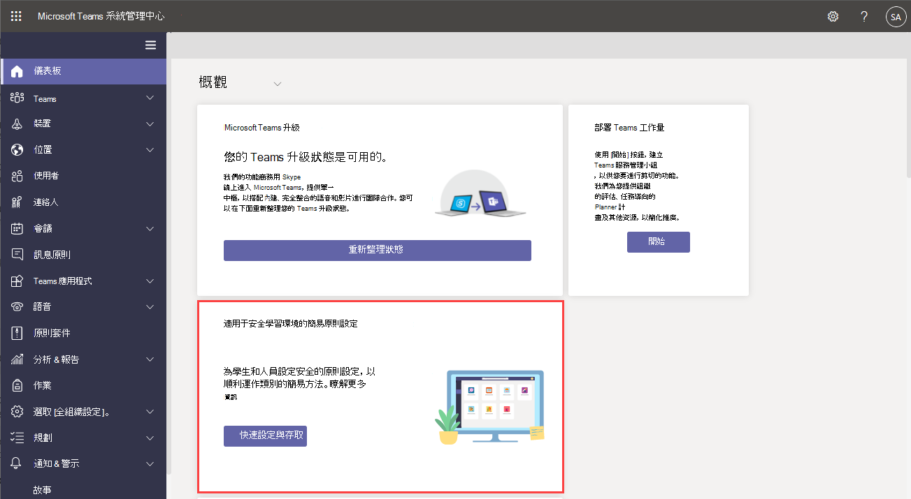

# 使用策略管理 Teams

策略是管理 Teams 的重要一部分。 使用本文流覽如何使用對貴組織有説明的政策。

## 您用於

策略是用來完成貴組織中跨不同領域的許多工作，例如傳訊、會議和應用程式。 您可以執行一些操作，包括允許使用者在 Teams 頻道中排程會議、讓使用者編輯已送出的郵件，以及控制使用者是否可以將應用程式釘到 Teams 應用程式欄。

## 如何指派策略

您可以根據貴組織嘗試完成的工作，以數種不同的方式指派策略。 您可以在 Teams 系統管理中心製作和查看作業。

請在這裡閱讀有關指派策略 [的更多資訊](assign-policies.md)。

## 如何管理政策

使用 Microsoft Teams 系統管理中心或 [PowerShell 管理原則](https://docs.microsoft.com/microsoftteams/teams-powershell-managing-teams#manage-policies-via-powershell)。

例如，應用程式設定政策允許您允許使用者上傳自訂應用程式、代表使用者安裝應用程式，以及將應用程式釘到 Teams 應用程式欄。 這些策略在 Teams 系統管理中心中已進行配置。

此外，會議政策可用來控制 Teams 會議的音訊和視音訊設定，例如文字記錄、雲端錄製和 IP 音訊/視視。

### 適用於教育的 Teams

您也可以使用 Teams [教育政策精靈](easy-policy-setup-edu.md) ，輕鬆設定和管理學習環境的政策。

## 政策類型

您可以使用 Microsoft Teams 管理下列政策。

策略類型 | 說明
------------|------------
[策略套件](manage-policy-packages.md) | Microsoft Teams 中的策略套件是一組預先定義的策略和設定，您可以指派給組織中具有類似角色的使用者。
[會議原則](meeting-policies-in-teams.md) | 會議政策可用來控制組織中使用者排程之會議的會議參與者可以使用的功能。 會議政策包含下列主題。  - 音訊和視音訊政策  - 內容和螢幕畫面分享政策  - 參與者、來賓和存取政策  - 一般政策
[語音和通話政策](voice-and-calling-policies.md)| 語音和通話政策會透過團隊管理這些設定，例如緊急通話、呼叫路由和本機號碼。
[應用程式政策](app-policies.md)| 應用程式策略是用來控制 Microsoft Teams 中的應用程式。 系統管理員可以允許或封鎖使用者可以安裝的應用程式、將應用程式釘到使用者的 Teams 應用程式欄，以及代表您的使用者安裝應用程式。
[訊息原則](messaging-policies-in-teams.md)| 訊息策略可控制聊天和頻道功能的可用性。

## 相關主題

* [在 Microsoft Teams 中管理意見回饋政策](manage-feedback-policies-in-teams.md)
* [在 Microsoft Teams 中管理團隊政策](teams-policies.md)
* [在 Microsoft Teams 中設定即時活動](teams-live-events/set-up-for-teams-live-events.md)
* [Teams 教育政策與政策套件](policy-packages-edu.md)
