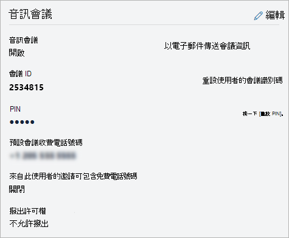

# 在 Microsoft Teams 中管理使用者的音訊會議設定

身為 Microsoft 365 或Office 365系統管理員，您可以編輯貴組織中個別使用者的音訊會議設定，例如提供者、預設付費電話或免付費電話號碼、會議 ID 或 PIN。 如果您想要編輯組織的設定，請參閱 [管理組織的音訊會議設定](manage-the-audio-conferencing-settings-for-my-organization-in-teams.md)。

## 使用 Microsoft Teams 系統管理中心

1. 在左側導覽中，按一下 [ **使用者**]，然後從可用使用者清單中選取使用者。

2. 按一下 **[編輯]**。

3. 在 **[音訊會議**] 底下，修改下列任一項：

|**設定**|**描述**|
|:-----|:-----|
|**音訊會議**|若要開啟或關閉使用者的音訊會議，請按一下 **[音訊會議**] 旁的 **[編輯**]，然後在 [**音訊會議**] 窗格中，將 **音訊會議** 切換為 [開啟] 或 [關閉]。|
|**以電子郵件傳送會議資訊**  |只有在您想要立即傳送含有其會議 ID 和電話號碼的電子郵件給使用者時，才按一下此連結。  (這封電子郵件不包含 PIN.) 請參閱使用 [音訊會議資訊傳送電子郵件給使用者](send-an-email-to-a-user-with-their-dial-in-information-in-teams.md)。  |
|**會議 ID**  |如果您需要重設使用者的會議 ID，請按一下 [ **重設會議 ID** ]。 如需詳細資訊，請參閱 [重設使用者的會議 ID](reset-a-conference-id-for-a-user-in-teams.md)。  |
|**針** |如果您需要重設使用者的 PIN，請按一下 [ **重設 PIN** ]。 如需詳細資訊，請參閱 [重設音訊會議 PIN](reset-the-audio-conferencing-pin-in-teams.md)。 |
|**預設會議付費電話號碼** (必要)  |音訊會議橋接器上設定的數位。 將數位格式化為您希望顯示在 Teams 會議邀請中的方式。 若要變更預設付費電話號碼，請按一下 **[音訊會議**] 旁的 **[編輯**]，然後在 [**音訊會議**] 窗格中，選取 [**付費號碼**] 底下的號碼。 您也可以將電話號碼新增至 TeamsAudioConferencingPolicy，並將原則指派給使用者，藉此設定電話號碼。 新增至原則的電話號碼優先于使用 **預設會議付費電話號碼設定的電話號碼**。 如果未將電話號碼新增至 TeamsAudioConferencingPolicy，則使用 **預設會議付費電話號碼** 設定的電話號碼將會顯示在 Microsoft Teams 會議邀請中。 |
|**此使用者的邀請可以包含免付費電話號碼**|只有使用 TeamsAudioconferecningPolicy 才能變更此設定。 |
|**未經驗證的使用者可以是會議中的第一人**|若要變更此設定，請將 **[未驗證的使用者可以是會議開** 啟] 或 [關閉] 中的第一個人切換。
|**撥出許可權**|若要變更此設定，請按一下 **[音訊會議**] 旁的 [**編輯**]，然後在 [**音訊會議**] 窗格中，選擇 [**從會議撥出**] 底下的選項。|

> [!Note]
> [!INCLUDE [updating-admin-interfaces](includes/updating-admin-interfaces.md)]

## 相關主題

[管理貴組織的音訊會議設定](manage-the-audio-conferencing-settings-for-my-organization-in-teams.md)

[音訊會議的常見問題](audio-conferencing-common-questions.md)
