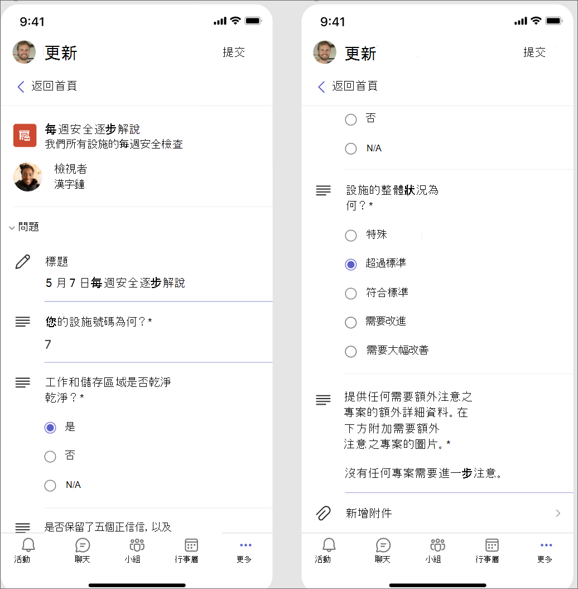
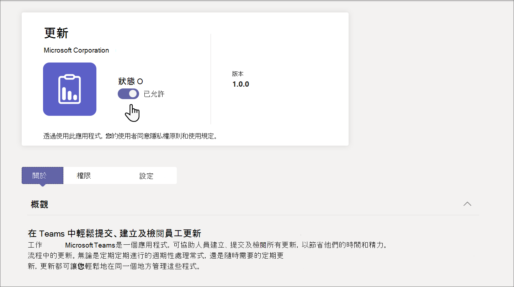

# 在 Microsoft Teams 中管理貴組織的更新應用程式

## 什麼是更新應用程式

Microsoft Teams應用程式中的更新可讓貴組織成員集中建立、檢閱及提交更新。 藉由建立範本，您可以使用更新應用程式來追蹤貴組織所需的任何專案。 更新適用于桌上型電腦和行動裝置。

在 Teams 中，使用者可以從 Teams App Store 取得更新。 他們會在 [提交 **] 頁面上** 看到提交所需的所有更新。

[![桌上出版 Teams 中 [提交] 頁面的影像。](media/updates-submit-small.png)](media/updates-submit.png#lightbox)

使用者可以在 [檢閱 **] 頁面中** 檢視他們指派的更新。

[![桌面Teams中 [校閱] 頁面的影像。](media/updates-home-small.png)](media/updates-home.png#lightbox)

當使用者獲指派更新時，更新會顯示在他們的Teams活動摘要中。 使用者也可以在 Updates 應用程式中檢視所有目前的更新要求和先前的提交。 此外，任何人都可以建立範本並傳送更新要求。

更新同時隨附常見商務案例的現成範本，以及建立您自己的範本選項。 任何人都可以為新類型的更新建立範本。

## 範例案例

服裝店的員工每天負責開啟和關閉商店。 每天早上，班前置字元會填寫Microsoft Store開啟更新，這是 Updates 應用程式中現成的範本。 在此更新中，他們描述前一晚關閉時的任何問題、回答關於商店清潔度的問題，以及報告任何需要補充的供應品。 提交更新可讓他們快速且有效率地傳達對 Microsoft Store 的需求以及任何問題。 每日更新也可讓 Microsoft Store 關聯有機會突顯運作狀況。

在商店的製造設施中，員工使用行動裝置執行更新的安全檢查。

與此同時，一組遠端工作者正在更新 Microsoft Store 的網站。 這些會議會跨時區散佈，因此每日的待命會議並不方便。 相反地，每個小組成員都會將他們進度的每日更新報告提交給小組領導人。

## 必要的權限和授權

您需要下列專案的許可權才能部署更新：

- 建立 Microsoft Dataverse 資料庫的許可權。

- powerautomate.microsoft.com [上的帳戶](https://powerautomate.microsoft.com/)。

- 您目標環境中的系統管理員角色。

- Power Automate、Office 365 或 Dynamics 365 的授權。

- 使用者需要Microsoft Forms授權才能設定新的範本。

## 使用 Microsoft Dataverse 儲存體

一般資料模型 (CDM) 是 Microsoft Dataverse 中商務和分析應用程式所使用的共用資料語言。 它包含一組由 Microsoft 和我們的合作夥伴所發行的標準化、可延伸資料架構，可在應用程式和商務程式之間保持資料的一致性及其意義。 深入瞭解 [一般資料模型](/common-data-model/)。

從範本建立的更新仍會在 Microsoft Dataverse 中儲存資料，例如標題、詳細資料、範本識別碼等。 深入瞭解 [Microsoft Forms 的資料儲存空間](https://support.microsoft.com/office/data-storage-for-microsoft-forms-97a34e2e-98e1-4dc2-b6b4-7a8444cb1dc3#:~:text=Where%20data%20is%20stored%20for%20Microsoft%20Forms.%20Microsoft,European-based%20tenants%20is%20stored%20on%20servers%20in%20Europe)。

>[!Note]
>如果您刪除Microsoft Forms網站上的表單範本，該範本會中斷您的更新範本，且使用者無法提交更新。 使用者嘗試開啟已在 Microsoft Forms 上刪除的範本時，收到「CDB TableNotFound」錯誤。

## 應用程式許可權Teams更新

更新Teams應用程式可讓您存取下列功能：

- 接收您提供的訊息和資料。

- 傳送訊息和通知給您。

- 在沒有 Teams 提供的標頭的情況下，呈現個人應用程式和對話方塊。

- 存取您的設定檔資訊，例如您的姓名、電子郵件地址、公司名稱和偏好的語言。

- 接收小組成員在頻道中提供的訊息和資料。

- 在頻道中傳送訊息和通知。

- 存取小組的資訊：
  - 小組名稱
  - 頻道清單
  - 名單 (小組成員的名稱和電子郵件地址) 

- 使用小組的資訊來連絡他們。

## 停用更新應用程式

[更新] 應用程式預設為可用。 您可以在 Teams 系統管理中心停用該應用程式。

  1. 登入 Teams 系統管理中心。

  2. 前往 **[Teams 應用程式]** >  **[管理應用程式]**。

  3. 搜尋 [更新] 應用程式。

     [![管理員中心導覽畫面，畫面上醒目提示 [Teams應用程式>管理應用程式]。](media/manage-updates-small.png)](media/manage-updates.png#lightbox)

  4. 選 **取 [更新]**。

  5. 選取切換以為組織停用該應用程式。
    

## 將更新釘選到Teams

### 使用量身打造的第一線應用程式體驗來釘選更新和其他應用程式以Teams

在 Teams 中量身打造的第一線應用程式體驗會將最相關的應用程式釘選到 Teams 中，以供[擁有 F 授權](https://www.microsoft.com/microsoft-365/enterprise/frontline#office-SKUChooser-0dbn8nt)的使用者使用。 釘選的應用程式包括更新、核准、無線對講機、工作和班次。 根據預設，此功能為您的第一線工作人員提供專為其需求量身打造的全新體驗。

這些應用程式會釘選到應用程式行，也就是Teams桌面用戶端側邊，以及Teams行動用戶端底部的列，使用者可以在此快速且輕鬆地存取它們。

若要深入瞭解，包括體驗如何與您所設定的應用程式原則搭配運作，請參閱[為前線員工量身打造Teams應用程式](pin-teams-apps-based-on-license.md)。

### 使用應用程式設定原則將更新釘選到Teams

應用程式設定原則可讓您自訂Teams以釘選對使用者中使用者最重要的應用程式。

若要為使用者釘選更新應用程式，您可以編輯全域 (組織的預設) 原則，或建立及指派自訂應用程式設定原則。 若要深入了解，請參閱[管理 Teams 中的應用程式設定原則](teams-app-setup-policies.md)。

## 保留原則

從更新應用程式建立的更新會儲存在預設的 Microsoft Dataverse 環境中，目前不支援備份。 深入了解如何[備份和還原環境 - Power Platform \| Microsoft Docs](/power-platform/admin/backup-restore-environments)。

除非範本建立者從 Microsoft Forms Web App 的 [**已刪除** 的表單] 索引標籤清除該資料，否則不會刪除儲存在 Forms 中的資料。

## 條件式存取原則

目前，Teams 中的更新應用程式不支援針對Microsoft Teams設定的條件式存取原則。

## 資料限制

每個使用者最多可以建立 400 個更新範本，而每個範本可以根據目前在 Microsoft Forms 中的功能，收集最多 50，000 個要求。

## 安全性

從 Teams Updates 應用程式，使用者可以建立新的更新，並檢視他們已傳送和接收的更新。 使用者將無法存取其他人建立的更新，除非他們是要求的查看者。

> [!Note]
> 如果使用者是建立更新報告所在之聊天或頻道的一部分，或是範本建立者手動將他們新增為檢視器，則會獲得要求的檢視器角色。 如果在建立報表時未給予該角色，他們將無法對要求採取動作。
