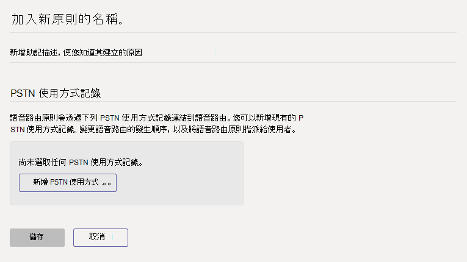

# 在 Microsoft Teams 中管理語音路由策略Manage voice routing policies in Microsoft Teams

如果您已經部署貴組織的電話系統直接路由，您可以使用語音路由策略，允許 Teams 和商務用 Skype Online 使用者使用您的內部部署電話基礎結構接收及撥打公用交換電話網絡 (PSTN) 。If you've deployed [Phone System Direct Routing](direct-routing-landing-page.md) in your organization, you use voice routing policies to allow Teams and Skype for Business Online users to receive and make phone calls to the Public Switched Telephone Network (PSTN) using your on-premises telephony infrastructure.

語音路由策略是 PSTN 使用方式記錄的容器。A voice routing policy is a container for PSTN usage records. 若要建立和管理語音路由策略，請到Microsoft Teams 系統管理中心中的語音語音路由策略，或是  >  使用 Windows PowerShell。You create and manage voice routing policies by going to **Voice** > **Voice routing policies** in the Microsoft Teams admin center or by using Windows PowerShell.

您可以使用全域 (全組織預設值) 原則，或建立並指派自訂原則。You can use the global (Org-wide default) policy or create and assign custom policies. 除非您建立並指派自訂策略，否則使用者會自動取得全域原則。Users will automatically get the global policy unless you create and assign a custom policy. 請記住，您可以編輯全域原則中的設定，但無法重新命名或刪除。Keep in mind that you can edit the settings in the global policy but you can't rename or delete it.

請務必瞭解，指派語音路由策略給使用者無法讓他們在 Teams 中撥打 PSTN 通話。It's important to know that assigning a voice routing policy to a user doesn't enable them to make PSTN calls in Teams. 您也需要啟用電話系統直接路由的使用者，並完成其他組組步驟。You'll also need to enable the user for Phone System Direct Routing and complete other configuration steps. 若要深入瞭解，請參閱 [設定直接路由](direct-routing-configure.md)。To learn more, see [Configure Direct Routing](direct-routing-configure.md).

## 建立自訂語音路由策略Create a custom voice routing policy

### 使用 Microsoft Teams 系統管理中心Using the Microsoft Teams admin center

1. 在 Microsoft Teams 系統管理中心的左側導航中，前往 **[**  >  **語音語音路由規則**，然後按一下 [**新增**> 。In the left navigation of the Microsoft Teams admin center, go to **Voice** > **Voice routing policies**, and then click **Add**. 
     
2. 輸入原則的名稱和描述。Enter a name and description for the policy.
3. 在 **PSTN 使用量記錄下**，按一下 **[新增 PSTN 使用量**，然後選取要新增的記錄。Under **PSTN usage records**, click **Add PSTN usage**, and then select the records that you want to add. 如果您需要建立新的 PSTN 使用記錄，請按一下 [ **新增**。If you need to create a new PSTN usage record, click **Add**.
4. 如果您新增了多個 PSTN 使用記錄，請以您想要的順序排列。If you added multiple PSTN usage records, arrange them in the order that you want.
5. 完成後，請按一下 **[Apply.**When you're done, click **Apply**.
6. 按一下 [儲存]。Click **Save**.

### 使用 PowerShellUsing PowerShell

請參閱 [New-CsOnlineVoiceRoutingPolicy](/powershell/module/skype/new-csonlinevoiceroutingpolicy)。See [New-CsOnlineVoiceRoutingPolicy](/powershell/module/skype/new-csonlinevoiceroutingpolicy).

## 編輯語音路由策略Edit a voice routing policy

### 使用 Microsoft Teams 系統管理中心Using the Microsoft Teams admin center

您可以編輯全域原則或任何您建立的任何自訂策略。You can edit the global policy or any custom policies that you create.

1. 在 Microsoft Teams 系統管理中心的左側流覽中，前往 **語音**  >  **語音路由策略**。In the left navigation of the Microsoft Teams admin center, go to **Voice** > **Voice routing policies**.
2. 按一下原則名稱左側來選取原則，然後按一下 [編輯 **]**。Select the policy by clicking to the left of the policy name, and then click **Edit**.
3. 按一下 **[新增/移除 PSTN 使用** 記錄，進行您想要的變更，然後按一下 [ **儲存**。Click **Add/remove PSTN usage records**, make the changes that you want, and then click **Save**.

### 使用 PowerShellUsing PowerShell

請參閱 [Set-CsOnlineVoiceRoutingPolicy](/powershell/module/skype/set-csonlinevoiceroutingpolicy)。See [Set-CsOnlineVoiceRoutingPolicy](/powershell/module/skype/set-csonlinevoiceroutingpolicy).

## 指派自訂語音路由策略給使用者Assign a custom voice routing policy to users

[!INCLUDE [assign-policy](includes/assign-policy.md)]

另請參閱 [Grant-CsOnlineVoiceRoutingPolicy](/powershell/module/skype/grant-csonlinevoiceroutingpolicy)。See also [Grant-CsOnlineVoiceRoutingPolicy](/powershell/module/skype/grant-csonlinevoiceroutingpolicy).

## 相關主題Related topics

[Teams PowerShell 概觀Teams PowerShell overview](teams-powershell-overview.md)

[設定直接路由的語音路由Configure voice routing for Direct Routing](direct-routing-voice-routing.md)

[啟用直接路由的依位置路由Enable Location-Based Routing for Direct Routing](location-based-routing-enable.md)

[在 Teams 中將原則指派給使用者Assign policies to your users in Teams](assign-policies.md)