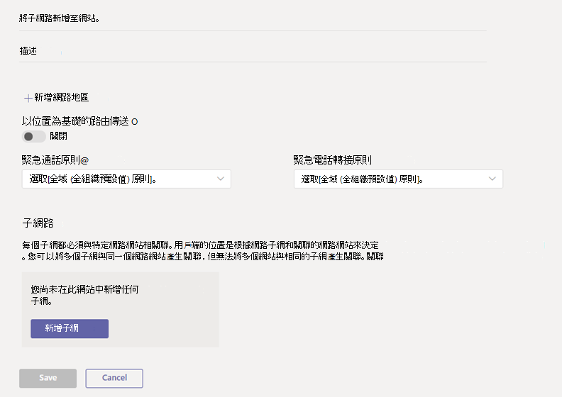
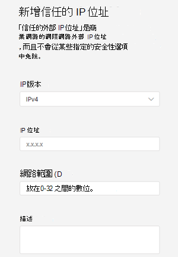

# <a name="manage-your-network-topology-for-cloud-voice-features-in-microsoft-teams"></a>管理雲端語音功能的網路拓撲Microsoft Teams

如果貴組織正在部署直接[](location-based-routing-plan.md)路由或動態緊急電話的以位置[](configure-dynamic-emergency-calling.md)為基礎的路由，您必須設定網路設定，以在 Microsoft Teams 中使用這些雲端語音功能。 網路設定是用來判斷用戶端的位置，Teams網路區域、網路網站、子網和信任的 IP 位址。 根據您部署的雲端語音功能，您可以設定部分或所有設定。 若要深入瞭解這些條款，請參閱雲端 [語音功能的網路設定](cloud-voice-network-settings.md)。

您可以在系統管理中心的網路 **拓撲** 頁面上設定網路Microsoft Teams，或使用 Windows PowerShell。

## <a name="configure-network-settings-in-the-microsoft-teams-admin-center"></a>在系統管理中心Microsoft Teams網路設定

[!INCLUDE [preview-feature](includes/preview-feature.md)]

您可以在網路拓撲頁面的網路網站選項卡上定義網路區域、網路 **網站****和** 子網。 您可以在這裡建立或修改網路網站、將網站與網路區域建立關聯、將子網與網站建立關聯、開啟位置式路由，以及指派緊急策略至網站。 您也可以新增可全域用於所有網站的網路區域。

#### <a name="add-and-configure-a-network-site"></a>新增及設定網路網站

1. 在系統管理中心的左側導Microsoft Teams，請前往 [位置網路拓撲圖》，然後按一下 [  >  ******網路網站> 定位** 點。
2. 按一下 **[新增**」，然後輸入網站的名稱和描述。

    

3. 若要將網站與網路區域建立關聯，請按一下[新增網路區域，選取現有區域或按一下 [新增以新增區域，然後按一下 **[連結**。  
4. 若要啟用Location-Based路由，請開啟 **以位置為基礎的路由**。
5. 若要將緊急服務政策指派給網站，請執行下列其中一項或兩項操作：

    - 如果貴組織使用通話方案或電話系統直接路由，請在緊急通話政策下，選取您想要的策略。
    - 如果貴組織已電話系統直接路由，請在緊急呼叫 **路由策略** 下，選取您想要的策略。

6. 若要將子網與網站關聯，請按一下 [ **子網>** 下的 [ **新增子網**> 。 指定 IP 版本、IP 位址、網路範圍、新增描述，然後按一下 **[Apply.** 每個子網都必須與特定網站相關聯。
7. 按一下 [儲存]。

#### <a name="modify-a-network-site"></a>修改網路網站

1. 在系統管理中心的左側導Microsoft Teams，請前往 [位置網路拓撲圖》，然後按一下 [  >  ******網路網站> 定位** 點。
2. 按一下網站名稱的左側以選取網站，然後按一下 [ **編輯**。
3. 進行您想要的變更，然後按一下 [ **儲存。**

### <a name="manage-external-trusted-ip-addresses"></a>管理外部信任的 IP 位址

您可以在系統管理中心的網路拓撲頁面上，在信任 **的 IP** 選項卡上管理Microsoft Teams IP 位址。 您可以新增無限數量的外部信任 IP 位址。

#### <a name="add-a-trusted-ip-address"></a>新增信任的 IP 位址

1. 在系統管理中心的左側導Microsoft Teams，請前往 [位置網路拓撲圖》，然後按一下 [  >  ******信任的 IP>** 定位點。
2. 按一下 **[新增**。
3. 在 [**新增信任的 IP 位址**> 窗格中，指定 IP 版本、IP 位址、網路範圍、新增描述，然後按一下 **[Apply.**

    

#### <a name="edit-a-trusted-ip-address"></a>編輯信任的 IP 位址

1. 在系統管理中心的左側導Microsoft Teams，請前往 [位置網路拓撲圖》，然後按一下 [  >  ******信任的 IP>** 定位點。
2. 按一下 IP 位址的左側，然後按一下 [編輯>，以 **選取該 IP 位址**。
3. 在 [**編輯信任的 IP 位址**> 窗格中，進行您想要的變更，然後按一下 **[Apply.**

## <a name="configure-network-settings-using-powershell"></a>使用 PowerShell 設定網路設定

若要完成本節中的步驟，您需要熟悉 PowerShell Cmdlet。 若要深入瞭解，請參閱[powerShell Teams概觀](teams-powershell-overview.md)。

### <a name="define-network-regions"></a>定義網路區域

 使用 [New-CsTenantNetworkRegion](/powershell/module/skype/New-CsTenantNetworkRegion) Cmdlet 來定義網路區域。 請注意，RegionID 參數是一個邏輯名稱，代表地區的地理位置，而且沒有相依性或限制，而 CentralSite &lt; 網站識別碼參數 &gt; 是選擇性的。

```PowerShell
New-CsTenantNetworkRegion -NetworkRegionID <region ID>  
```

在此範例中，我們建立名為 India 的網路區域。

```PowerShell
New-CsTenantNetworkRegion -NetworkRegionID "India"  
```

另請參閱 [Set-CsTenantNetworkRegion](/powershell/module/skype/set-cstenantnetworkregion)。

### <a name="define-network-sites"></a>定義網路網站

使用 [New-CsTenantNetworkSite](/powershell/module/skype/new-cstenantnetworksite?view=skype-ps) Cmdlet 來定義網路網站。 每個網路網站都必須與網路區域相關聯。

```PowerShell
New-CsTenantNetworkSite -NetworkSiteID <site ID> -NetworkRegionID <region ID>
```

在此範例中，我們在印度地區建立兩個新的網路網站，即印度地區的印度和海德拉巴。

```PowerShell
New-CsTenantNetworkSite -NetworkSiteID "Delhi" -NetworkRegionID "India"
New-CsTenantNetworkSite -NetworkSiteID "Hyderabad" -NetworkRegionID "India"
```

下表顯示在此範例中定義的網路網站。

||網站 1 |網站 2 |
|---------|---------|---------|
|網站識別碼    |    第 1 (裡)      |  網站 2 (海德拉巴)        |
|地區識別碼  |     印度 (地區 1)     |   印度 (地區 1)       |

另請參閱 [Set-CsTenantNetworkRegion](/powershell/module/skype/set-cstenantnetworksite)。

### <a name="define-network-subnets"></a>定義網路子網

使用 [New-CsTenantNetworkSubnet](/powershell/module/skype/new-cstenantnetworksubnet?view=skype-ps) Cmdlet 定義網路子網，並將其與網路網站建立關聯。 每個網路子網只能與一個網站建立關聯。

```PowerShell
New-CsTenantNetworkSubnet -SubnetID <Subnet IP address> -MaskBits <Subnet bitmask> -NetworkSiteID <site ID>
```

在此範例中，我們建立子網 192.168.0.0 與Deri 網路網站之間的關聯，以及子網 2001：4898：e8：25：844e：926f：85ad：dd8e 和 Hyder廣告網路網站之間的關聯。

```PowerShell
New-CsTenantNetworkSubnet -SubnetID "192.168.0.0" -MaskBits "24" -NetworkSiteID "Delhi"
New-CsTenantNetworkSubnet -SubnetID "2001:4898:e8:25:844e:926f:85ad:dd8e" -MaskBits "120" -NetworkSiteID "Hyderabad"
```

下表顯示此範例中定義的子網。

||網站 1 |網站 2 |
|---------|---------|---------|
|子網識別碼   |    192.168.0.0     |  2001：4898：e8：25：844e：926f：85ad：dd8e     |
|面具  |     24    |   120      |
|網站識別碼  | 在 (裡)  | 網站 2 (海德拉巴)  |

針對多個子網，您可以使用下列腳本來輸入 CSV 檔案。

```PowerShell
Import-CSV C:\subnet.csv | foreach {New-CsTenantNetworkSubnet –SubnetID $_.Identity -MaskBits $_.Mask -NetworkSiteID $_.SiteID}  
```

在此範例中，CSV 檔案看起來像這樣：

```console
Identity, Mask, SiteID
172.11.12.0, 24, Redmond
172.11.13.0, 24, Chicago
172.11.14.0, 25, Vancouver
172.11.15.0, 28, Paris
```


另請參閱 [Set-CsTenantNetworkSubnet](/powershell/module/skype/set-cstenantnetworksubnet)。


### <a name="define-external-subnets-external-trusted-ip-addresses"></a>定義外部子網 (外部信任的 IP 位址) 

使用 [New-CsTenantTrustedIPAddress Cmdlet](/powershell/module/skype/new-cstenanttrustedipaddress?view=skype-ps) 來定義外部子網，並將其指派給租使用者。 您可以為租使用者定義無限數量的外部子網。

```PowerShell
New-CsTenantTrustedIPAddress -IPAddress <External IP address> -MaskBits <Subnet bitmask> -Description <description> 
```

例如：

```PowerShell
New-CsTenantTrustedIPAddress -IPAddress 198.51.100.0 -MaskBits 30 -Description "Contoso address"  
```

另請參閱 [Set-CsTenantTrustedIPAddress](/powershell/module/skype/set-cstenanttrustedipaddress)。

## <a name="related-topics"></a>相關主題

- [雲端語音功能的網路設定Teams](cloud-voice-network-settings.md)
