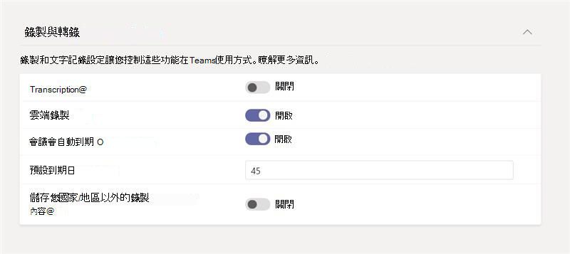

# <a name="meeting-policies-and-meeting-expiration-in-microsoft-teams"></a>Microsoft Teams 中的會議原則和會議到期日

[Microsoft Teams中的會議原則](meeting-policies-overview.md)可用來控制貴組織中的使用者是否可以啟動和排程會議，以及使用者排程之會議參與者可用的功能。 您可以使用全域 (全組織預設值) 原則，或建立並指派自訂原則。 您可以在Microsoft Teams系統管理中心管理會議原則，或使用[Get](/powershell/module/skype/get-csteamsmeetingpolicy)、[New](/powershell/module/skype/new-csteamsmeetingpolicy)、[Set](/powershell/module/skype/set-csteamsmeetingpolicy)、[Remove](/powershell/module/skype/remove-csteamsmeetingpolicy)、[Grant](/powershell/module/skype/grant-csteamsmeetingpolicy) -CsTeamsMeetingPolicy PowerShell Cmdlet。

控制使用者是否可以開始和排程會議，以及控制使用者排程之會議到期的會議原則設定。 當會議的會議加入連結和會議 ID 到期時，沒有人可以加入會議。 下列會議原則設定決定使用者是否可以在 Teams 中開始和排程會議。 我們討論本文中的會議設定。

- [立即在頻道中開會](meeting-policies-in-teams-general.md#meet-now-in-channels)：控制使用者是否可以在頻道中召開臨時會議。
- [頻道會議排程](meeting-policies-in-teams-general.md#channel-meeting-scheduling)：控制使用者是否可以在頻道中排程會議。
- [私人會議排程](meeting-policies-in-teams-general.md#private-meeting-scheduling)：控制使用者是否可以在 Teams 中排程私人會議。 當會議未發佈到小組中的頻道時，會議是私人的。
- [Outlook新增至](meeting-policies-in-teams-general.md#outlook-add-in)：控制使用者是否可以從Outlook排程私人會議。 當會議未發佈到小組中的頻道時，會議是私人的。
- [立即在私人會議中開會](meeting-policies-in-teams-general.md#meet-now-in-private-meetings)：控制使用者是否可以召開臨時私人會議。

根據預設，這些設定為開啟狀態。 關閉任何這些設定時，任何獲指派原則的使用者都無法啟動或排程該類型的新會議。 同時，會議加入會連結及使用者先前啟動或排程之所有現有會議的會議識別碼。

例如，如果使用者獲指派會議原則，將這些會議原則設定 **設為 [** 開啟]，然後您在頻道設定中關閉 [ **立即允許開會** ]，該使用者就無法在頻道中啟動臨時會議，而該使用者先前建立的頻道 [開會] 現在會加入連結已過期。 使用者仍然可以啟動和排程其他會議類型，並加入由其他人召集的會議。

## <a name="what-happens-when-the-meeting-join-link-and-conference-id-expire"></a>當會議加入連結和會議 ID 到期時，會發生什麼情況？

當會議的會議加入連結和會議 ID 到期時，沒有人可以加入會議。 當使用者嘗試透過連結或電話加入會議時，他們會收到一則訊息，指出會議已無法使用。 交談、檔案、白板、錄製、文字記錄，以及與會議相關的其他內容都會保留，使用者仍然可以存取這些內容。

## <a name="what-happens-when-you-turn-on-and-turn-off-a-meeting-policy-setting"></a>當您開啟並關閉會議原則設定時，會發生什麼情況？

### <a name="switch-a-meeting-policy-setting-from-on-to-off"></a>將會議原則設定從開啟切換為關閉

當會議原則設定設為 [開啟] **時，獲** 指派原則的使用者可以開始或排程這類會議，每個人都可以加入。 當您將會議原則設定切換為 **[關閉] 時**，獲指派原則的使用者無法啟動或排程該類型的新會議，且使用者先前排程之現有會議的會議加入連結和會議識別碼已過期。

請記住，使用者仍然可以加入由其他人召集的會議。

### <a name="switch-a-meeting-policy-setting-from-off-to-on"></a>將會議原則設定從關閉切換為開啟

當您將會議原則設定從 **[關閉** ] 切換為 [ **開啟**] 時，獲指派原則的使用者可以啟動或排程這類會議。 如果會議原則設定已關閉，然後再次為使用者開啟，則所有先前排程的 (和到期) 由使用者召集的會議都會變成使用中，而人員可以使用會議加入連結或透過電話加入會議。  

## <a name="meeting-expiration-scenarios"></a>會議到期案例

本文摘要說明會議到期如何在本文討論的每個會議原則設定中運作。

|如果您想要...&nbsp;&nbsp; |執行此動作&nbsp;&nbsp;&nbsp;&nbsp;  |會議加入行為&nbsp;&nbsp;&nbsp;&nbsp;  |
|---------------------------|---------------------|---------|
|到期私人會議現在由使用者開始會議&nbsp;&nbsp;|在 **私人會議中關閉 [立即開會]**。&nbsp;&nbsp;|現在沒有人可以加入使用者啟動的私人 **會議** 。|
|到期使用者排程的私人會議&nbsp;&nbsp;|關閉 **私人會議排程**_，並_ 關閉 **增益集Outlook**。 &nbsp;&nbsp;|沒有人可以加入使用者排程的私人會議。 這可防止人員加入下列會議：<ul><li>過去私人會議。</li><li>已排程于未來且尚未進行的私人會議。</li><li>未來的週期性私人會議實例。</li></ul><br>**私人會議排程** 和 **Outlook載入** 宏都必須關閉，才能讓使用者排程的私人會議過期。 如果其中一個設定已關閉，而另一個設定已開啟，現有會議的會議加入連結和會議識別碼仍會保持作用中，且不會過期。|
|到期通道 **立即開會** 由使用者召開會議&nbsp;&nbsp;|關閉 **[立即在頻道中開會**] _，並_ 關閉 **[頻道會議排程]**。&nbsp;&nbsp;|現在沒有人可以加入頻道 **會議** ，會議是由使用者召開。|
|到期使用者排定的通道會議&nbsp;&nbsp;|關閉 **通道會議排程**。&nbsp;&nbsp;|沒有人可以加入使用者排定的頻道會議。 這可防止人員加入下列會議：<ul><li>過去曾進行過的通道會議。</li><li>針對未來排程且尚未進行的通道會議。</li><li>週期性頻道會議的未來實例。</li></ul>|

如果您希望其他人能夠存取先前由特定使用者排程或開始的會議，您可以：

- 開啟該使用者的會議原則設定。
- 關閉該使用者的會議原則設定，並讓另一個已啟用原則設定的使用者建立新會議來取代已過期的會議。

> [!NOTE]
> 如果會議是由代理人傳送，且代理人獲授與許可權代表另一位人員，例如主管傳送會議邀請，則會議原則設定會套用至授予主管 (許可權) 的人員。

## <a name="changes-to-meeting-expiration"></a>變更會議到期日

所有新建立Teams會議錄製 (TMR) 預設到期日為 120 天。 此設定預設為適用于所有租使用者。 這表示根據預設， *在開啟此功能之後* 建立的所有 TMR 都會在建立日期之後的 120 天內刪除。 系統管理員也可以將會議設為 **永不過期**。 OneDrive和SharePoint系統會監控所有 TMR 上設定的到期日，並會在 TMR 到期日自動將 TMR 移至回收站。

> [!NOTE]
> 會議文字記錄的一份複本會儲存在OneDrive SharePoint中，而第二份複本會儲存在Exchange暫存中。 OSDP 複本會在 TMR 自動到期時過期。

自動會議到期是輕量型的內部管理機制，可減少舊版 TMR 所建立的儲存空間雜亂。 平均而言，在所有客戶中，96% 的 TMR 在 60 天后不會被監視，而 99% 的 TMR 在 110 天后不會被監視。 我們相信，幾乎所有客戶都會移除可能在 60 天后不會再被監視的錄製，藉此從降低租使用者的儲存空間負載獲益。 我們的目標是根據預設為所有客戶提供盡可能簡潔的體驗。

使用會議到期日來限制Teams會議記錄所驅動的雲端儲存空間使用OneDrive或SharePoint。 一般會議錄製會耗用每小時約 400 MB 的錄製。

> [!NOTE]
> A1 使用者的預設到期日上限為 30 天。

### <a name="expiration-date"></a>有效期

- 到期日會計算為 **建立** 日期，加上系統 **管理員在Teams原則中設定的預設天數**。
- 播放不會影響到期日。

### <a name="change-the-default-expiration-date"></a>變更預設到期日

系統管理員可以在 PowerShell 或Teams系統管理中心編輯預設的到期設定。 任何變更只會影響從該點開始 *建立的新* TMR。 這不會影響該日期之前建立的任何錄製。 系統管理員無法變更現有 TMR 的到期日。 這樣做是為了保護擁有 TMR 之使用者的決定。 會議和通話都可以由此設定控制。

您可以將到期日值設定為：

- 最小值： **1 天**
- 最大值： **99，999 天**
- 您也可以將到期日設定為 **-1** ，讓錄製永遠不會過期。

PowerShell 命令範例：

```powershell
Set-CsTeamsMeetingPolicy -Identity Global -NewMeetingRecordingExpirationDays 50
```

您可以在會議原則下Teams系統管理中心設定到期日 **。** 開啟 **[會議] 自動過期後，** 您可以選擇設定錄製到期日。



### <a name="security-and-compliance"></a>安全性與合規性

#### <a name="should-i-rely-on-this-feature-for-strict-security-and-compliance-adherence"></a>我應該仰賴這項功能來嚴格遵守安全性與合規性嗎？

否，您不應該依賴這項資訊來提供法律保護，因為使用者可以修改他們所控制之任何錄製的到期日。

#### <a name="will-a-retention-andor-deletion-policy-ive-set-in-the-security--compliance-center-override-the-teams-meeting-recording-expiration-setting"></a>我在安全性&合規性中心設定的保留和/或刪除原則是否會覆寫Teams會議錄製到期日設定？

是的，您在合規性中心設定的任何原則都會優先。

例如：

- 如果您有原則指出網站中的所有檔案都必須保留 100 天，而Teams會議錄製的到期設定是 30 天，則錄製會保留整整 100 天。
- 如果您的刪除原則指出所有Teams會議錄製都會在五天后刪除，而且您有 30 天Teams會議錄製的到期設定，則錄製會在 5 天后刪除。

### <a name="will-this-feature-enforce-file-retention"></a>啟用此功能會強制執行檔案保留？

否，檔案將不會因為這項功能或其設定而保留。 如果具有刪除許可權的使用者嘗試刪除具有到期設定之 TMR，將會執行該使用者的刪除動作。

### <a name="what-skus-are-required-for-this-feature"></a>這項功能需要哪些 SKUs ?

- 根據預設，所有 SKU 都會有此功能。
- A1 使用者的預設期限上限為 30 天，但可以視需要變更到期日。

### <a name="what-if-i-want-the-admin-to-have-full-control-over-the-lifecycle-of-meeting-recordings-and-dont-want-to-give-end-users-the-ability-to-override-the-expiration-date"></a>如果我想讓系統管理員完全控制會議錄製的生命週期，而不想讓使用者能夠覆寫到期日，該怎麼辦？

我們建議使用安全性與合規性保留和/或刪除原則。 提供該功能的目標是解決複雜的原則與 SLA 導向的管理法律考量。

自動過期功能僅適用于輕量型內部管理機制，以減少舊Teams會議錄製所建立的儲存空間待過濾郵件。

### <a name="will-future-tmrs-migrated-from-classic-stream-after-this-feature-is-released-have-auto-expiration-applied-to-them-too"></a>未來在此功能釋出後, 從傳統資料流移轉來的 TMR 也將套用自動到期？

否，移轉的 TMR 不會有到期設定。 相反地，我們鼓勵系統管理員只遷移他們想要保留的 TMR。 移轉文件將會提供更多詳細資料。

### <a name="how-is-this-feature-different-from-the-expiration-message-i-see-when-a-tmr-upload-to-onedrive-and-sharepoint-fails"></a>這項功能與我在 TMR 上傳至OneDrive時看到的到期訊息有何不同，SharePoint失敗？

當錄製無法上傳至OneDrive或SharePoint時，Teams應用程式會在聊天中顯示一則訊息，讓使用者在聊天中最多有 21 天可以下載 TMR，然後才會從Teams伺服器永久刪除。 由於 TMR 上傳失敗所造成的現有到期體驗與說明文件中討論的OneDrive和SharePoint自動過期功能無關。

### <a name="how-do-i-know-the-distribution-of-tmr-playbacks-so-i-know-what-the-optimal-auto-expiration-default-should-be-for-my-tenant"></a>如何?知道 TMR 播放的發佈，所以我知道最佳的自動到期預設值對我的租使用者有何影響？

1. 在文件庫中尋找影片。
1. 選取 **...**  > **細節**
1. 選取詳細資料窗格頂端的檢視數目。

您會看到顯示的檔案統計資料：

- 唯一檢視者的數目
- 總檢視數
- 檢視者和檢視者在過去 90 天中逐天檢視的趨勢
- 檢視者保留 (檢視或未檢視的哪個部分) 

### <a name="when-will-the-file-be-deleted"></a>何時會刪除檔案？

檔案會在到期日的五天內刪除，但這並不是嚴格保證。 檔案擁有者會在錄製到期時收到電子郵件通知，並會導向至回收站以復原錄製內容。

> [!NOTE]
> 在到期日，錄製會移至回收站，並清除到期日欄位。 如果您從回收站復原錄製內容，此功能將不會再次刪除該錄製，因為已清除到期日。

## <a name="related-topics"></a>相關主題

[變更會議到期日 - 使用者控制項](https://support.microsoft.com/office/record-a-meeting-in-teams-34dfbe7f-b07d-4a27-b4c6-de62f1348c24#bkmk_view_change_expiration_date)

[管理 Teams 中的會議原則](meeting-policies-overview.md)

[將原則指派給 Teams 中的使用者](policy-assignment-overview.md)

[Teams PowerShell 概觀](teams-powershell-overview.md)
