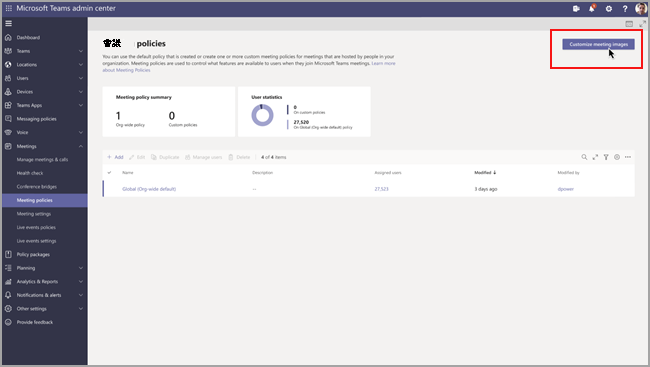

# 音訊和視&設定

本文將說明音訊和視音訊特有的會議策略設定。 這些包括下列專案：

- [允許轉錄](#allow-transcription)
- [允許雲端錄製](#allow-cloud-recording)
- [IP 音訊的模式](#mode-for-ip-audio)
- [IP 視訊的模式](#mode-for-ip-video)
- [允許 IP 視訊](#allow-ip-video)
- [媒體位元速率 (KB)](#media-bit-rate-kbs)
- [視像篩選模式](#video-filters-mode)
- [允許自訂背景設定](#allow-custom-background-settings)

### 允許轉錄

這是每個召集人和每個使用者策略的組合。 此設定可控制在播放會議錄製內容期間是否提供字幕和謄寫功能。 如果您關閉此功能，則 [**錄製**] 和 [**CC**] 選項在播放會議錄製內容期間無法使用。 開始錄製的人員需要開啟此設定，讓錄製也包含謄寫。

請注意，錄製的會議目前僅支援將語言設定為英文Teams以及會議中使用英文時的使用者。

### 允許雲端錄製

這是每個召集人和每個使用者策略的組合。 此設定可控制是否可以錄製此使用者的會議。 如果參與者已開啟該策略設定，且他們是來自同一個組織的已驗證使用者，會議召集人或其他會議參與者可以開始錄製。

組織外部人員 (例如，同盟和匿名使用者) 無法開始錄製。 來賓使用者無法開始或停止錄製。

讓我們看看下列範例。

|使用者 |會議原則  |允許雲端錄製 |
|---------|---------|---------|
|Daniela | 全域   | 關閉 |
|Amanda | Location1MeetingPolicy | 開啟|
|John (外部使用者) | 不適用 | 不適用|

無法錄製由 Daniela 組織的會議，已啟用策略設定的 Amanda 無法錄製由 Daniela 組織的會議。 不過，您可以錄製由 Amanda 組織的會議，但已停用策略設定且 John 是外部使用者的 Daniela 無法錄製由 Amanda 組織的會議。

若要深入了解雲端會議錄製，請參閱 [Teams 雲端會議錄製](cloud-recording.md)。

### IP 音訊的模式

這是每一使用者原則。 此設定可控制是否可以在會議和群組通話中開啟音訊。 以下是此設定的值。

|設定值 |行為  |
|---------|---------|
|**已啟用傳出和傳入音訊**    |會議中允許傳出和傳入音訊。這是預設設定。 |
|**已停用**     |會議中已關閉傳出和傳入音訊。     |

如果使用者設為 **已** 停用，該使用者仍然可以排程和組織會議，但他們無法使用音訊。 若要加入會議，他們必須透過公用交換電話網路 (PSTN) 或透過電話加入會議。 未獲指派任何原則的會議參與者 (例如匿名參與者)，預設會將此設定為 [已啟用傳出和傳入音訊 **]**。 在 Teams 行動用戶端上，如果已停用此設定，使用者必須透過 PSTN 撥入會議。

此設定不適用一對一通話。 若要限制一對一通話，請設定 Teams [通話原則 []](teams-calling-policy.md) 並關閉 [撥打私人通話 **]** 設定。 此設定也不適用會議室裝置，例如 Surface Hub 和 Microsoft Teams 會議室裝置。

此設定尚無法於 Microsoft 365 政府社群雲端 (GCC)、GCC High 或美國國防部 (DoD) 環境中取得。

若要深入了解，請參閱[管理會議參與者的音訊/視訊](#manage-audiovideo-for-meeting-participants)。

### IP 視訊的模式

這是每一使用者原則。 此設定可控制是否可以在會議和群組通話中開啟視訊。 以下是此設定的值。

|設定值 |行為  |
|---------|---------|
|**已啟用傳出和傳入視訊**    | 會議允許外發和傳入視像。 這是預設設定。 |
|**已停用**     | 會議中已關閉傳出和傳入視訊。 在 Teams 行動用戶端上，使用者無法分享會議中的視訊或相片。   請注意，如果 **IP 音訊模式** 已停用， **則 IP 視** 障模式也會維持停用狀態。  |

如果設為 [已停用 **]**，該使用者無法開啟或檢視由其他會議參與者共用的視訊。 未獲指派任何原則的會議參與者 (例如匿名參與者)，預設會將此設定為 [已啟用傳出和傳入視訊 **]**。

此設定不適用會議室裝置，例如 Surface Hub 和 Microsoft Teams 會議室裝置。

此設定尚無法於 Microsoft 365 政府社群雲端 (GCC)、GCC High 或美國國防部 (DoD) 環境中取得。

> [!NOTE]
> 請記住，此設定可同時控制傳出和傳入視訊，而 [允許 IP 視訊 **]** 設定則可控制傳出視訊。 若要深入了解，請參閱[哪個 IP 視訊原則設定優先？](#which-ip-video-policy-setting-takes-precedence)和[管理會議參與者的音訊/視訊](#manage-audiovideo-for-meeting-participants)。

若要深入了解，請參閱[管理會議參與者的音訊/視訊](#manage-audiovideo-for-meeting-participants)。

### 允許 IP 視訊

這是每個召集人和每個使用者策略的組合。 視訊是會議的重要元件。 在某些組織中，系統管理員可能會想要進一步控制哪些使用者的會議有視訊。 此設定可控制是否可以在使用者主持的會議以及在使用者啟動的一對一和群組通話中開啟視訊。 在Teams用戶端上，此設定可控制使用者是否可以在會議中共用相片和影片。

由已啟用此原則設定的使用者所召集的會議，如果參與者也已啟用此原則設定，則會允許由會議參與者在會議中分享視訊。 未獲指派任何原則的會議參與者 (例如匿名和同盟參與者) 會繼承會議召集人的原則。

> [!NOTE]
> 請記住，此設定可控制傳出視訊，而 [IP 視訊的模式 **]** 設定則可同時控制傳出和傳入視訊。 若要深入了解，請參閱[哪個 IP 視訊原則設定優先？](#which-ip-video-policy-setting-takes-precedence)和[管理會議參與者的音訊/視訊](#manage-audiovideo-for-meeting-participants)。

| Teams 桌面和 Web 用戶端 |Teams 行動用戶端  |
|:-------:|:-------:|
|    |          |

讓我們看看下列範例。

|使用者 |會議原則  |允許 IP 視訊 |
|---------|---------|---------|
|Daniela   | 全域   | 開啟       |
|Amanda    | Location1MeetingPolicy        | 關閉      |

由 Daniela 主持的會議允許開啟視訊。 Daniela 可以加入會議並開啟視訊。 Amanda 無法開啟 Daniela 會議中的視像，因為 Amanda 的政策設定為不允許視音訊。 Amanda 可以查看會議中由其他參與者分享的視訊。

在 Amanda 主持的會議中，沒有任何人可以開啟視訊，而無論指派給他們的視訊原則為何。 這表示 Daniela 無法在 Amanda 會議中開啟視訊。  

如果 Daniela 呼叫 Amanda 時有開啟視訊，Amanda 只能用音訊接聽通話。  當通話連接時，Amanda 可以看見 Daniela 的視訊，但無法開啟視訊。 如果 Amanda 呼叫 Daniela，Daniela 可以使用視訊和音訊接聽通話。 當通話連接時，Daniela 可以視需要開啟或關閉其視訊。

若要深入了解，請參閱[管理會議參與者的音訊/視訊](#manage-audiovideo-for-meeting-participants)。

#### 哪一個 IP 視視策略設定優先？

若為使用者，針對視訊最具限制性的原則設定會優先。以下是一些範例。

|允許 IP 視訊|IP 視訊的模式|會議體驗|
|---------|---------|---------|
|召集人：**開啟**  參與者：**開啟** |參與者：**已停用**        |[IP 視訊的模式 **]** 設定優先。 獲指派此原則的參與者無法開啟或檢視由其他人分享的視訊。|
|召集人：**開啟**  參與者：**開啟** |參與者：**已啟用傳出和傳入視訊**          |獲指派此原則的參與者可以開啟或檢視由其他人分享的視訊。         |
|召集人：**開啟**  參與者：**關閉** |參與者：**已啟用傳出和傳入視訊**         |[允許 IP 視訊 **]** 設定優先。 參與者只能看到傳入視訊，而且無法傳送傳出視訊。         |
|召集人：**開啟**  參與者：**關閉** |參與者：**已停用**         |[IP 視訊的模式 **]** 設定優先。 參與者看不到傳入或傳出視訊。|
|召集人：**關閉**    |       |[允許 IP 視訊 **]** 設定優先，因為它已針對召集人關閉。 沒有人可以開啟由獲指派此原則的使用者所召集的會議中的視訊。         |

### 管理會議參與者的音訊/視訊

|如果您想要...  |設定下列原則設定  |
|---------|---------|
|為會議中參與者停用音訊和視訊  |IP 音訊的模式：**已停用**  IP 視訊的模式：**已停用** 允許 IP 視訊：不適用       |
|僅為會議的參與者啟用傳入音訊和視訊  |IP 音訊的模式：**已啟用傳出和傳入音訊**  IP 視訊的模式：**已啟用傳出和傳入視訊** 允許 IP 視訊：**關閉**       |
|為會議中的參與者停用視訊 (參與者僅有音訊)|  IP 音訊的模式：**啟用傳出和傳入音訊**  IP 視訊的模式：**已停用** 允許 IP 視訊：不適用
|為會議中參與者啟用音訊和視訊    |IP 音訊的模式：**已啟用傳出和傳入音訊** (預設值)  IP 視訊的模式：**已啟用傳出和傳入視訊** (預設值) 允許 IP 視訊：**開啟** (預設值)    |

將套用會議召集人的原則與使用者原則之間最具限制性的原則。 例如，如果召集人有一個原則會限制視訊，而使用者的原則不會限制視訊，則會議參與者會繼承會議召集人的原則，且無法存取會議中的視訊。 這表示他們只能使用音訊加入會議。

> [!NOTE]
> 當使用者開始群組通話以使用電話加入時，不會出現 [使用手機的音訊 **]** 畫面。 這是已知問題，我們正在努力解決。 若要解決此問題，請在 [其他加入選項 **]** 下選取 [手機音訊 **]**。  

#### Teams 行動用戶端

對於使用Teams用戶端的使用者，會議期間共用相片和視像的能力也取決於允許 **IP 視** 像或 **IP 視像模式** 設定。 根據設定的優先原則為何，分享視訊和相片的功能均無法使用。 這不會影響螢幕畫面分享，這是您使用個別的 [螢幕畫面分享模式[]](meeting-policies-content-sharing.md#screen-sharing-mode) 設定進行的設定。 此外，您可以設定 [Teams 行動性原則](/powershell/module/skype/new-csteamsmobilitypolicy)，以防止行動裝置使用者透過行動數據連線使用 IP 視訊，這表示他們必須使用 WiFi 連線。

### 媒體位元速率 (KB)

這是每一使用者原則。 此設定會決定使用者在通話和會議中進行音訊、視視和視視應用程式共用傳輸的媒體位元速率。 它會同時套用於通話或會議使用者的上行連結和下行媒體周遊。 此設定會提供您對組織中頻寬管理的細微控制。 根據使用者需要的會議案例而定，我們建議有足夠的頻寬，以便擁有良好的品質體驗。 最小值為 30 Kbps，而最大值取決於會議案例。 若要深入了解 Teams 中高品質會議、通話和即時活動的最低建議頻寬，請參閱[頻寬需求](prepare-network.md#bandwidth-requirements)。

如果會議頻寬不足，參與者會看到一則訊息，指出網路品質不佳。

對於需要最高品質視訊體驗的會議 (例如 CEO 委員會會議和 Teams 即時活動)，建議您將頻寬設定為 10 Mbps。 即使已設定體驗上限，視案例而定，Teams 媒體堆疊會在偵測到特定網路狀況時適應低頻寬情況。

## 視像篩選模式

這是每一使用者原則。此設定可控制使用者是否可以自訂其會議中的視訊背景。

目前，您僅能使用 PowerShell 來設定此原則。 您可以使用 [Set-CsTeamsMeetingPolicy](/powershell/module/skype/set-csteamsmeetingpolicy) Cmdlet 來編輯現有的 Teams 會議原則。 或者，使用 [New-CsTeamsMeetingPolicy](/powershell/module/skype/new-csteamsmeetingpolicy) Cmdlet 來建立新 Teams 會議原則，然後將該原則指派給使用者。

若要指定使用者是否可以自訂會議中的視訊背景，請設定 **VideoFiltersMode** 參數，如下所示：

|在 PowerShell 中設定值 |行為  |
|---------|---------|
|**NoFilters**     |使用者無法自訂其視訊背景。|
|**BlurOnly**     |使用者可以選擇模糊其視音訊背景。 |
|**BlurandDefaultBackgrounds**     |使用者可以選擇模糊其視訊背景，或從預設的影像集中選擇，以用作其背景。 |
|**AllFilters**     |Use 可以選擇模糊其視像背景、選擇預設的影像集，或上傳自訂影像做為背景。 |

> [!NOTE]
> Teams 不會篩選由使用者上傳的影像。 使用 **AllFilters** 設定時，您應該有內部組織原則，以防止使用者上傳冒犯性或不適當的影像，或組織無權用於 Teams 會議背景的影像。

### 允許自訂背景設定

您可以新增自訂背景影像，以用於每個租使用者。 此功能可讓公司將公司商標用於Teams會議。

1. 登入 Teams 系統管理中心。

2. 選取 **會議策略**  >  **自訂會議影像**。

   

3. 從 **組織** 背景 **影像選取 On**。

4. 選取 **+ 新增影像**。

5. 在管理背景面板中，選取 新增 **影像**。

6. 確保影像符合以下需求：
  
   - 最小大小 360 px
   - 最大大小 2048 px
   - PNG、JPG 或 BMP 的檔案類型
   - 最多可上傳 50 張影像

7. 預覽您選取的影像，然後選取 **關閉**。

8. 請檢查影像，並根據需要新增更多內容。

9. 選取 [儲存 **]**。

會議出席者會看到一系列背景影像，可在他們參加會議時使用。

> [!NOTE]
> 變更最多可能需要 24 小時才能生效。

## 相關主題

- [Teams PowerShell 概觀](teams-powershell-overview.md)
- [將原則指派給 Teams 中的使用者](assign-policies.md)
