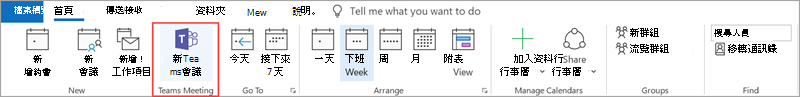

# 會議原則設定 - 一般

本文將說明下列會議的一般Teams設定：

- [允許在頻道中立即開會](#allow-meet-now-in-channels)
- [允許 Outlook 增益集](#allow-the-outlook-add-in)
- [允許頻道會議排程](#allow-channel-meeting-scheduling)
- [允許排程私人會議](#allow-scheduling-private-meetings)
- [允許在私人會議中立即開會](#allow-meet-now-in-private-meetings)
- [指定的簡報者角色模式](#designated-presenter-role-mode)
- [會議出席報告](#meeting-attendance-report)
- [群島模式的會議提供者](#meeting-provider-for-islands-mode)

## 允許在頻道中立即開會

這是每一使用者原則，且會在會議開始之前套用。 此設定可控制使用者是否可以在頻道中啟動Teams會議。 如果您開啟此功能，使用者可以按一下 [開會>按鈕來啟動臨時會議，或在頻道中排程會議。 預設值為 True。

## 允許 Outlook 增益集

這是每一使用者原則，且會在會議開始之前套用。 此設定可控制是否可以從 Outlook (Windows、Mac、Web 及行動裝置) 內排程 Teams 會議。

如果您關閉此功能，當使用者在 Teams 中建立新會議時，就無法排程Outlook。 例如，在 Windows 上的 Outlook 中，[新增 Teams 會議 **]** 選項不會在功能區中顯示。

## 允許頻道會議排程

使用現有的 AllowChannelMeetingScheduling 原則來控制可以在小組頻道行事曆上建立的事件類型。 這是每一使用者原則，且會在會議開始之前套用。 此設定可控制使用者是否可以在 Teams 頻道中排程會議。 此設定預設會開啟。 

如果關閉此政策，使用者將無法建立新頻道會議。 不過，活動召集人可以編輯現有的頻道會議。

將會停用排程會議。

頻道選項已停用。

[顯示選取您想要排程會議之頻道的日曆選項 ](media/meeting-policies-select-a-channel-to-meet-in.png#lightbox)

在頻道文章頁面中，下列專案將會停用：

- 頻道回覆撰寫方塊上的 [排程會議 **]** 按鈕。
  
  
- 頻道標題上的 [排程會議 **]** 按鈕。
  

在頻道行事曆中：

- 頻道行事曆上的 [新增活動 **]** 按鈕將會停用。
  

- 使用者將無法拖曳並選取頻道日曆上的時間區塊，以建立頻道會議。

- 使用者無法使用鍵盤快速鍵在頻道日曆上建立會議。

在系統管理中心：

頻道行事曆應用程式會在應用程式權限原則頁面上的 [Microsoft 應用程式 **]** 區段中顯示。

## 允許排程私人會議

這是每一使用者原則，且會在會議開始之前套用。 此設定可控制使用者是否可以在 Teams 中排程私人會議。 當會議未發佈到小組中的頻道時，會議是私人的。

請注意，如果您 **關閉允許排** 程私人會議和允許頻道會議排程，系統會針對使用者停用新增必要的出席者及新增Teams。  此設定預設會開啟。

## 允許在私人會議中立即開會

這是每一使用者原則，且會在會議開始之前套用。 此設定可控制使用者是否能啟動臨時私人會議。  此設定預設會開啟。

## 指定的簡報者角色模式

這是每一使用者原則。 此設定可讓您變更 Teams 用戶端的 [會議選項 **]** 中 [誰可以簡報?**]** 設定的預設值。 此原則設定會影響所有會議，包括「立即開會」會議。

[誰可以簡報?**]** 設定可讓會議召集人選擇可以成為會議簡報者的人員。 若要深入了解，請參閱[變更 Teams 會議的參與者設定](https://support.microsoft.com/article/change-participant-settings-for-a-teams-meeting-53261366-dbd5-45f9-aae9-a70e6354f88e)和 [Teams 會議中的角色](https://support.microsoft.com/article/roles-in-a-teams-meeting-c16fa7d0-1666-4dde-8686-0a0bfe16e019)。

目前，您僅能使用 PowerShell 來設定此原則設定。 您可以使用 [Set-CsTeamsMeetingPolicy](https://docs.microsoft.com/powershell/module/skype/set-csteamsmeetingpolicy) Cmdlet 來編輯現有的 Teams 會議原則。 或者，使用 [New-CsTeamsMeetingPolicy](https://docs.microsoft.com/powershell/module/skype/new-csteamsmeetingpolicy) Cmdlet 來建立新 Teams 會議原則，並將它指派給使用者。

若要指定 Teams 中 [誰可以簡報?**]** 設定的預設值，請將 **DesignatedPresenterRoleMode** 參數設定為下列其中一項：

- **EveryoneUserOverride**：所有會議參與者都可以是簡報者。 這是預設值。 此參數會與 Teams 中的 [每個人 **]** 設定對應。
- **EveryoneInCompanyUserOverride**：組織中已驗證的使用者 (包括來賓使用者) 可以是簡報者。 此參數會與 Teams 中的 [我組織中的人員 **]** 設定對應。
- **OrganizerOnlyUserOverride**：只有會議召集人可以擔任簡報者，而其他所有會議參與者都會被指定為出席者。 此參數會與 Teams 中的 [只有我 **]** 設定對應。

請記住，在您設定預設值之後，會議召集人仍然可以在 Teams 中變更此設定，並選擇誰可以在其排程的會議中簡報。

## 會議出席報告

這是每一使用者原則。 此設定會控制會議召集人是否可以下載[會議出席報告](teams-analytics-and-reports/meeting-attendance-report.md)。

目前，您僅能使用 PowerShell 來設定此原則設定。 您可以使用 [Set-CsTeamsMeetingPolicy](https://docs.microsoft.com/powershell/module/skype/set-csteamsmeetingpolicy) Cmdlet 來編輯現有的 Teams 會議原則。 或者，使用 [New-CsTeamsMeetingPolicy](https://docs.microsoft.com/powershell/module/skype/new-csteamsmeetingpolicy) Cmdlet 來建立新 Teams 會議原則，並將它指派給使用者。

若要讓會議召集人下載會議出席報告，請設定 **AllowEngagementReport 參數** 為 **啟用**。 啟用時，下載報告的選項會在 [參與者 **]** 窗格中顯示。 根據預設，此設定會啟用。

若要防止會議召集人下載報告，請將參數設定 **Disabled**。

## 群島模式的會議提供者

這是每一使用者原則。 此設定可控制哪個 Outlook 會議附加元件用於 [使用共存模式的使用者 *]*。 您可以指定使用者只能使用 [Teams 會議] 增益集，或是可同時使用 [Teams 會議] 和 [商務用 Skype 會議] 增益集在 Outlook 中排程會議。

您只能將此原則套用到處於離島模式的使用者，並在其 Teams 會議原則中將 **AllowOutlookAddIn** 參數設定為 **True**。

目前，您僅能使用 PowerShell 來設定此原則。 您可以使用 [Set-CsTeamsMeetingPolicy](https://docs.microsoft.com/powershell/module/skype/set-csteamsmeetingpolicy) Cmdlet 來編輯現有的 Teams 會議原則。 或者，使用 [New-CsTeamsMeetingPolicy](https://docs.microsoft.com/powershell/module/skype/new-csteamsmeetingpolicy) Cmdlet 來建立新 Teams 會議原則，並將它指派給使用者。

若要指定您想要讓使用者使用的會議附加元件，請設定 **PreferredMeetingProviderForIslandsMode** 參數，如下所示：

- 將參數設定為 **TeamsAndSfB**，以在 Outlook 中同時啟用 Teams 會議附加元件和商務用 Skype 附加元件。 這是預設值。
- 將參數設定為 **Teams** 以僅在 Outlook 中啟用 Teams 會議附加元件。 此原則設定可確保所有未來的會議都有 Teams 會議加入連結。 它不會將現有的商務用 Skype 會議加入連結移轉至 Teams。 此原則設定不會影響商務用 Skype 中的目前狀態、聊天、PSTN 通話或其他任何功能，這表示使用者將繼續對這些功能使用商務用 Skype。

  如果您將參數設定為 **Teams**，然後切換回 **TeamsAndSfB**，則會同時啟用這兩個會議附加元件。 不過，請注意，Teams會議加入連結不會移至商務用 Skype。 只有變更後排程的商務用 Skype 會議會擁有商務用 Skype 會議加入連結。

## 會議反應

AllowMeetingReactions 設定只能使用 PowerShell 來套用。 沒有選項可從 Teams 系統管理中心開啟或關閉 AllowMeetingReactions。

會議反應預設為關閉。 關閉使用者的反應並不表示使用者無法在他們排程的會議中使用反應。 無論預設設定如何，會議召集人仍可從會議選項頁面開啟回應。

## 相關主題

- [Teams PowerShell 概觀](teams-powershell-overview.md)
- [將原則指派給 Teams 中的使用者](assign-policies.md)
- [從使用者移除 RestrictedAnonymousAccess Teams 會議原則](meeting-policies-restricted-anonymous-access.md)
