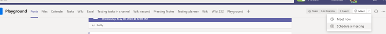

# 會議原則設定 - 一般

本文將說明 Teams 會議的下列一般原則設定：

- [在頻道中立即開會](#meet-now-in-channels)
- [Outlook 增益集](#outlook-add-in)
- [頻道會議排程](#channel-meeting-scheduling)
- [私人會議排程](#private-meeting-scheduling)
- [互動報告](#engagement-report)
- [會議註冊](#meeting-registration)
- [網路研討會](#webinars)
- [群島模式的會議提供者](#meeting-provider-for-islands-mode)
- [會議圖釋](#meeting-reactions)
- [喇叭教練](#speaker-coach)

## 在頻道中立即開會

這是每一使用者原則，且會在會議開始之前套用。 此設定可控制使用者是否可以在 Teams 頻道中開始非計畫的會議。 如果您開啟此設定，使用者可以按一下 [ **開會]** 按鈕來啟動非計畫會議或在頻道中排程會議。 此設定預設為開啟。

[![訊息下方顯示 [立即開會] 圖示的螢幕擷取畫面。](media/meeting-policies-meet-now.png)](media/meeting-policies-meet-now.png#lightbox)

## Outlook 增益集

這是每一使用者原則，且會在會議開始之前套用。 此設定可控制是否可以從 Outlook (Windows、Mac、Web 及行動裝置) 內排程 Teams 會議。

如果您關閉此設定，使用者在 Outlook 中建立新會議時，將無法排程 Teams 會議。 例如，在 Windows 上的 Outlook 中，[新增 Teams 會議 **]** 選項不會在功能區中顯示。

## 頻道會議排程

使用現有的 AllowChannelMeetingScheduling 原則來控制可以在小組頻道行事曆上建立的事件類型。 這是每一使用者原則，且會在會議開始之前套用。 此設定可控制使用者是否可以在 Teams 頻道中排程會議。 此設定預設會開啟。

如果關閉此原則，使用者將無法建立新的頻道會議。 不過，活動召集人可以編輯現有的頻道會議。

將會停用排程會議。

![顯示 Teams 中 [排程會議] 選項的螢幕擷取畫面。](media/schedule-meeting-option.png)

頻道選項已停用。

在頻道文章頁面中，將會停用下列功能：

- 頻道回覆撰寫方塊上的 [排程會議 **]** 按鈕。
  
  
- 頻道標頭上的 **[排程會議]** 按鈕。
  

在頻道行事曆中：

- 頻道行事曆上的 [新增活動 **]** 按鈕將會停用。
  

- 使用者將無法拖曳並選取頻道行事曆上的時間區塊來建立頻道會議。

- 使用者無法以鍵盤快速鍵在頻道行事曆上建立會議。

在系統管理中心：

頻道行事曆應用程式會在應用程式權限原則頁面上的 [Microsoft 應用程式 **]** 區段中顯示。

## 私人會議排程

這是每一使用者原則，且會在會議開始之前套用。 此設定可控制使用者是否可以在 Teams 中排程私人會議。 當會議未發佈到小組中的頻道時，會議是私人的。 **私人會議排程** 預設為開啟。

如果您同時關閉 **[私人會議排程** ] 和 [ **頻道會議排程** ] 設定，Teams 中的使用者會停用 [ **新增必要出席者** ] 和 [ **新增頻道** ] 選項。

## 互動報告

這是每一使用者原則。 此設定會控制會議召集人是否可以下載 [會議參與報告](teams-analytics-and-reports/meeting-attendance-report.md)。

此原則預設為開啟，可讓您的召集人查看誰註冊並參與他們所設定的會議和網路研討會。 若要在 Teams 系統管理中心將其關閉，請移至 **[會議**  >  **會議原則**]，並將 [**預訂報告**] 設定設為 **[關閉]**。

您也可以使用 [Set-CsTeamsMeetingPolicy](/powershell/module/skype/set-csteamsmeetingpolicy) Cmdlet 來編輯現有的 Teams 會議原則。 或者，使用 [New-CsTeamsMeetingPolicy](/powershell/module/skype/new-csteamsmeetingpolicy) Cmdlet 來建立新 Teams 會議原則，並將它指派給使用者。

根據預設， **AllowEngagementReport** 參數在 PowerShell 中設定為 **[啟用** ]。 若要防止會議召集人下載會議預訂報告，請將 **AllowEngagementReport** 參數設為 **[停用]**。

啟用此原則時，下載會議預訂報告的選項會顯示在 [ **參與者** ] 窗格中。

> [!NOTE]
> 身為系統管理員，您無法檢視未組織之會議的出席報告。 不過，您可以在會議後 24 小時內檢視指定會議的參與者詳細資料。 在 Teams 系統管理中心，移至 **[使用者**  >  **管理使用者]**。 選擇會議召集人的顯示名稱。 選取 [ **會議&通話** ] 索引標籤，然後選擇適當的會議 ID 或通話識別碼。 然後，選 **取 [參與者詳細資料]**。

如需詳細資訊，包括參與報告的限制，請參閱 [在 Teams 中檢視和下載會議出席報告](https://support.microsoft.com/office/ae7cf170-530c-47d3-84c1-3aedac74d310)。

## 會議註冊

這是每一使用者原則。 如果您開啟此設定，貴組織中的使用者可以將註冊新增至會議。 此原則預設為啟用。

若要深入瞭解會議註冊，請參閱 [設定會議註冊](set-up-webinars.md#configure-meeting-registration)。

## 網路研討會

這是每一使用者原則。 如果您啟用網路研討會，貴組織中的使用者可以建立網路研討會，其中包含強大的註冊管理、可自訂的事件和註冊網站，以及以事件為導向的預設會議選項。 此原則預設為啟用。

在 [[設定網路研討會](set-up-webinars.md)] 中深入瞭解網路研討會。

如需會議、網路研討會和即時事件之間差異的詳細資訊，請參閱 [會議、網路研討會和即時活動](quick-start-meetings-live-events.md)。

## 群島模式的會議提供者

這是每一使用者原則。 此設定可控制哪個 Outlook 會議附加元件用於 [使用共存模式的使用者 *]*。 您可以指定使用者只能使用 [Teams 會議] 增益集，或是可同時使用 [Teams 會議] 和 [商務用 Skype 會議] 增益集在 Outlook 中排程會議。

您只能將此原則套用到處於離島模式的使用者，並在其 Teams 會議原則中將 **AllowOutlookAddIn** 參數設定為 **True**。

目前，您僅能使用 PowerShell 來設定此原則。 您可以使用 [Set-CsTeamsMeetingPolicy](/powershell/module/skype/set-csteamsmeetingpolicy) Cmdlet 來編輯現有的 Teams 會議原則。 或者，使用 [New-CsTeamsMeetingPolicy](/powershell/module/skype/new-csteamsmeetingpolicy) Cmdlet 來建立新 Teams 會議原則，並將它指派給使用者。

若要指定您想要讓使用者使用的會議附加元件，請設定 **PreferredMeetingProviderForIslandsMode** 參數，如下所示：

- 將參數設定為 **TeamsAndSfB**，以在 Outlook 中同時啟用 Teams 會議附加元件和商務用 Skype 附加元件。 **TeamsAndSfB** 是預設值。
- 將參數設定為 **Teams** 以僅在 Outlook 中啟用 Teams 會議附加元件。 此原則設定可確保所有未來的會議都有 Teams 會議加入連結。 它不會將現有的商務用 Skype 會議加入連結移轉至 Teams。 此原則設定不會影響商務用 Skype 中的目前狀態、聊天、PSTN 通話或其他任何功能，這表示使用者將繼續對這些功能使用商務用 Skype。

  如果您將參數設定為 **Teams**，然後切換回 **TeamsAndSfB**，則會同時啟用這兩個會議附加元件。 不過，請注意，現有的 Teams 會議加入連結不會移轉到商務用 Skype。 只有變更後排程的商務用 Skype 會議會擁有商務用 Skype 會議加入連結。

## 會議圖釋

會議圖釋的可用性可透過 Teams 系統管理中心介面或使用 PowerShell 來設定。 會議圖釋預設為啟用。

在 Teams 系統管理中心，會議原則的 [**參與者&來賓**] 區段下的 [**會議**  >  **會議**] 原則可以啟用或停用會議圖釋。

若要在 PowerShell 中設定設定，請使用 [Set-CsTeamsMeetingPolicy](/powershell/module/skype/set-csteamsmeetingpolicy) Cmdlet。 若要將它關閉，請將 **AllowMeetingReactions** 設為 **False**。

關閉使用者的圖釋並不表示使用者無法在排程的會議中使用圖釋。 無論預設設定如何，會議召集人仍可從會議選項頁面開啟回應。

## 喇叭教練

此設定可讓使用者在 Teams 會議期間開啟 [喇叭教練]。 演講者教練會在使用者進行簡報時聆聽使用者的音訊，並提供私人即時意見反應和建議以改善。 使用者也會在會議後取得意見反應的摘要報告。

> [!NOTE]
> 在會議期間開啟 [喇叭教練] 的使用者是唯一可以看到意見反應摘要報告的使用者。 系統管理員將無法存取任何此資料。

目前，您只能在 PowerShell 中設定和編輯此原則。 使用 [Set-CsTeamsMeetingPolicy](/powershell/module/skype/set-csteamsmeetingpolicy) Cmdlet。 或者，使用 [New-CsTeamsMeetingPolicy](/powershell/module/skype/new-csteamsmeetingpolicy) Cmdlet 來建立新 Teams 會議原則，並將它指派給使用者。

此設定預設為啟用。 若要將它關閉，請將 **AllowMeetingCoach** 設為 **False**。

## 相關主題

- [Teams PowerShell 概觀](teams-powershell-overview.md)
- [在 Teams 中指派原則](policy-assignment-overview.md)
- [從使用者移除 RestrictedAnonymousAccess Teams 會議原則](meeting-policies-restricted-anonymous-access.md)
