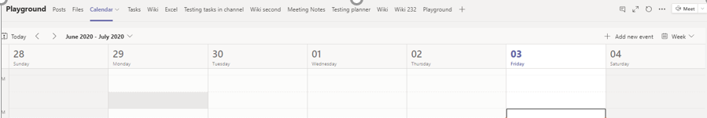

# 會議策略設定 - 一般

本文將說明 Teams 會議的下列一般政策設定：

- [允許現在在頻道中開會](#allow-meet-now-in-channels)
- [允許 Outlook 附加元件](#allow-the-outlook-add-in)
- [允許頻道會議排程](#allow-channel-meeting-scheduling)
- [允許排程私人會議](#allow-scheduling-private-meetings)
- [允許現在在私人會議中開會](#allow-meet-now-in-private-meetings)
- [指定的簡報者角色模式](#designated-presenter-role-mode)
- [會議出席報告](#meeting-attendance-report)
- [群島模式的會議提供者](#meeting-provider-for-islands-mode)

## 允許現在在頻道中開會

這是每個使用者原則，在會議開始之前適用。 此設定可控制使用者是否可以在 Teams 頻道中啟動臨時會議。 如果您開啟此功能，使用者可以按一下 [開會>按鈕，開始臨時會議或在頻道中排程會議。 預設值為 True。

## 允許 Outlook 附加元件

這是每個使用者原則，在會議開始之前適用。 此設定可控制 Teams 會議是否可以從 Outlook (Windows、Mac、Web 和行動) 。

如果您關閉此功能，當使用者在 Outlook 中建立新會議時，就無法排程 Teams 會議。 例如，在 Windows 上的 Outlook 中，功能區中不會顯示新增 **Teams** 會議選項。

## 允許頻道會議排程

使用現有的 AllowChannelMeeting 排程策略，控制可在小組頻道日曆上建立的事件種類。 這是每個使用者原則，在會議開始之前適用。 此設定可控制使用者是否可以在 Teams 頻道中排程會議。 根據預設，此設定會開啟。 

如果關閉此政策，使用者將無法建立新頻道會議。 不過，活動召集人可以編輯現有的頻道會議。

排程會議將會停用。

頻道選取範圍已停用。

[顯示選取您想要排程會議之頻道的日曆選項 ](media/meeting-policies-select-a-channel-to-meet-in.png#lightbox)

在頻道文章頁面中，下列專案將會停用：

- **頻道回復撰寫** 方塊上的排程會議按鈕。
  
  
- **在頻道標題** 上排程會議按鈕。
  

在頻道日曆中：

- **頻道日曆標題** 上的新增活動按鈕將會停用。
  

- 使用者將無法拖曳並選取頻道日曆上的時間區塊，以建立頻道會議。

- 使用者無法使用鍵盤快速鍵在頻道日曆上建立會議。

在系統管理中心：

頻道日曆應用程式會顯示在應用程式許可權政策頁面上 **的 Microsoft App** 區段。

## 允許排程私人會議

這是每個使用者原則，在會議開始之前適用。 此設定可控制使用者是否可以在 Teams 中排程私人會議。 當會議未發佈到團隊中的頻道時，會議是私人的。

請注意，如果您 **關閉允許排** 程私人會議和允許頻道會議排程，Teams 中的使用者會停用新增必要的出席者及新增頻道選項。  根據預設，此設定會開啟。

## 允許現在在私人會議中開會

這是每個使用者原則，在會議開始之前適用。 此設定可控制使用者是否可以啟動臨時私人會議。  根據預設，此設定會開啟。

## 指定的簡報者角色模式

這是每個使用者的策略。 此設定可讓您在 Teams 用戶端的會議選項中變更誰可以出席 **？** 設定預設值。 此策略設定會影響所有會議，包括 Now 會議。

" **誰可以出席？」** 設定可讓會議召集人選擇誰可以在會議中做簡報者。 若要深入瞭解，請參閱 [變更 Teams](https://support.microsoft.com/article/change-participant-settings-for-a-teams-meeting-53261366-dbd5-45f9-aae9-a70e6354f88e) 會議的參與者設定和 [Teams 會議中的角色](https://support.microsoft.com/article/roles-in-a-teams-meeting-c16fa7d0-1666-4dde-8686-0a0bfe16e019)。

目前，您只能使用 PowerShell 來設定此策略設定。 您可以使用 [Set-CsTeamsMeetingPolicy](https://docs.microsoft.com/powershell/module/skype/set-csteamsmeetingpolicy) Cmdlet 編輯現有的 Teams 會議政策。 或者，使用 [New-CsTeamsMeetingPolicy](https://docs.microsoft.com/powershell/module/skype/new-csteamsmeetingpolicy) Cmdlet 來建立新的 Teams 會議策略，並將其指派給使用者。

若要在 Teams 中指定誰可以展示 **？** 設定預設值，請設定 **SpecifyedPresenterRoleMode** 參數至下列其中一項：

- **EveryoneUserOverride：** 所有會議參與者都可以是簡報者。 此為預設值。 此參數會對應至 Teams **中的** 每個人都設定。
- **EveryoneInCompanyUserOverride：** 組織中經過驗證的使用者 ，包括來賓使用者，可以是簡報者。 此參數會對應到 Teams **中的** 組織人員設定。
- **召集人OnlyUserOverride：** 只有會議召集人可以擔任簡報者，所有會議參與者都指定為出席者。 此參數會對應到 Teams **中的只有** 我設定。

請記住，在您設定預設值之後，會議召集人仍可在 Teams 中變更此設定，並選擇誰可以在他們排定的會議中進行展示。

## 會議出席報告

這是每個使用者的策略。 此設定可控制會議召集人是否可以下載 [會議出席報告](teams-analytics-and-reports/meeting-attendance-report.md)。

目前，您只能使用 PowerShell 來設定此策略設定。 您可以使用 [Set-CsTeamsMeetingPolicy](https://docs.microsoft.com/powershell/module/skype/set-csteamsmeetingpolicy) Cmdlet 編輯現有的 Teams 會議政策。 或者，使用 [New-CsTeamsMeetingPolicy](https://docs.microsoft.com/powershell/module/skype/new-csteamsmeetingpolicy) Cmdlet 來建立新的 Teams 會議策略，並將其指派給使用者。

若要讓會議召集人下載會議出席報告，請設定 **AllowEngagementReport 參數** 為 **啟用**。 啟用時，下載報表的選項會顯示在參與者 **窗格中** 。

若要防止會議召集人下載報表，請設定參數為 **已停用**。 根據預設，此設定會停用，而且無法下載報表的選項。

## 群島模式的會議提供者

這是每個使用者的策略。 此設定會控制哪些 Outlook 會議附加元件適用于位於 *群島模式的使用者*。 您可以指定使用者只能使用 [Teams 會議] 增益集，或是可同時使用 [Teams 會議] 和 [商務用 Skype 會議] 增益集在 Outlook 中排程會議。

您只能將此原則套用到處於離島模式的使用者，並在其 Teams 會議原則中將 **AllowOutlookAddIn** 參數設定為 **True**。

目前，您只能使用 PowerShell 來設定此策略。 您可以使用 [Set-CsTeamsMeetingPolicy](https://docs.microsoft.com/powershell/module/skype/set-csteamsmeetingpolicy) Cmdlet 編輯現有的 Teams 會議政策。 或者，使用 [New-CsTeamsMeetingPolicy](https://docs.microsoft.com/powershell/module/skype/new-csteamsmeetingpolicy) Cmdlet 來建立新的 Teams 會議策略，並將其指派給使用者。

若要指定您想要讓使用者使用的會議附加元件，請設定 **PreferredMeetingProviderForIslandsMode** 參數，如下所示：

- 將參數設定為 **TeamsAndSfB，** 以在 Outlook 中同時啟用 Teams 會議附加元件和商務用 Skype 附加元件。 此為預設值。
- 將參數設定為 **Teams，** 只在 Outlook 中啟用 Teams 會議附加元件。 此策略設定可確保所有未來的會議都有 Teams 會議加入連結。 它不會將現有的商務用 Skype 會議加入連結遷移到 Teams。 此策略設定不會影響目前狀態、聊天、PSTN 通話，或商務用 Skype 中任何其他功能，這表示使用者會繼續使用商務用 Skype 執行這些功能。

  如果您將參數設定為 **Teams**，然後切換回 **TeamsAndSfB，** 兩個會議附加元件都已啟用。 不過請注意，現有的 Teams 會議加入連結不會移入商務用 Skype。 只有變更之後排定的商務用 Skype 會議會擁有商務用 Skype 會議加入連結。

## 會議反應

AllowMeetingReactions 設定只能使用 PowerShell 來使用。 無法從 Teams 系統管理中心開啟或關閉 AllowMeetingReactions。

會議反應預設為關閉。 關閉使用者的反應並不代表使用者在排程的會議中無法使用反應。 無論預設設定如何，會議召集人仍可從會議選項頁面開啟回應。

## 相關主題

- [Teams PowerShell 概觀](teams-powershell-overview.md)
- [將原則指派給 Teams 中的使用者](assign-policies.md)
- [從使用者移除 RestrictedAnonymousAccess Teams 會議政策](meeting-policies-restricted-anonymous-access.md)
