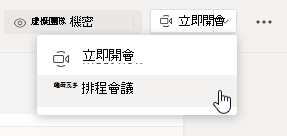

# 會議策略設定 - 一般Meeting policy settings - General

本文將說明 Teams 會議的下列一般政策設定：This article describes the following general policy settings for Teams meetings:

- [允許現在在頻道中開會Allow Meet now in channels](#allow-meet-now-in-channels)
- [允許 Outlook 附加元件Allow the Outlook add-in](#allow-the-outlook-add-in)
- [允許頻道會議排程Allow channel meeting scheduling](#allow-channel-meeting-scheduling)
- [允許排程私人會議Allow scheduling private meetings](#allow-scheduling-private-meetings)
- [允許現在在私人會議中開會Allow Meet now in private meetings](#allow-meet-now-in-private-meetings)
- [指定的簡報者角色模式Designated presenter role mode](#designated-presenter-role-mode)
- [會議出席報告Meeting attendance report](#meeting-attendance-report)
- [群島模式的會議提供者Meeting provider for Islands mode](#meeting-provider-for-islands-mode)

## 允許現在在頻道中開會Allow Meet now in channels

這是每個使用者原則，在會議開始之前適用。This is a per-user policy and applies before a meeting starts. 此設定可控制使用者是否可以在 Teams 頻道中啟動臨時會議。This setting controls whether a user can start an ad hoc meeting in a Teams channel. 如果您開啟此功能，使用者可以按一下 [開會>按鈕，開始臨時會議或在頻道中排程會議。If you turn this on, users can click the **Meet** button to start an ad hoc meeting or schedule a meeting in the channel. 預設值為 True。The default value is True.

## 允許 Outlook 附加元件Allow the Outlook add-in

這是每個使用者原則，在會議開始之前適用。This is a per-user policy and applies before a meeting starts. 此設定可控制 Teams 會議是否可以從 Outlook (Windows、Mac、Web 和行動) 。This setting controls whether Teams meetings can be scheduled from within Outlook (Windows, Mac, web, and mobile).

如果您關閉此功能，當使用者在 Outlook 中建立新會議時，就無法排程 Teams 會議。If you turn this off, users are unable to schedule Teams meetings when they create a new meeting in Outlook. 例如，在 Windows 上的 Outlook 中，功能區中不會顯示新增 **Teams** 會議選項。For example, in Outlook on Windows, the **New Teams Meeting** option won't show up in the ribbon.

## 允許頻道會議排程Allow channel meeting scheduling

使用現有的 AllowChannelMeeting 排程策略，控制可在小組頻道日曆上建立的事件種類。Use the existing AllowChannelMeetingScheduling policy to control the types of events that can be created on the team channel calendars. 這是每個使用者原則，在會議開始之前適用。This is a per-user policy and applies before a meeting starts. 此設定可控制使用者是否可以在 Teams 頻道中排程會議。This setting controls whether users can schedule a meeting in a Teams channel. 根據預設，此設定會開啟。By default, this setting is turned on. 

如果關閉此政策，使用者將無法建立新頻道會議。If this policy is turned off, users will not be able to create new channel meetings. 不過，活動召集人可以編輯現有的頻道會議。However, existing channel meetings can be edited by the organizer of the event.

排程會議將會停用。Schedule a meeting will be disabled.

頻道選取範圍已停用。Channel selection is disabled.

[顯示選取您想要排程會議之頻道的日曆選項 ](media/meeting-policies-select-a-channel-to-meet-in.png#lightbox)

在頻道文章頁面中，下列專案將會停用：In the channel posts page, the following will be disabled:

- **頻道回復撰寫** 方塊上的排程會議按鈕。**Schedule a meeting** button on the channel reply compose box.
  
  
- **在頻道標題** 上排程會議按鈕。**Schedule a meeting** button on the channel header.
  

在頻道日曆中：In the channel calendar:

- **頻道日曆標題** 上的新增活動按鈕將會停用。**Add new event** button on channel calendar header will be disabled.
  

- 使用者將無法拖曳並選取頻道日曆上的時間區塊，以建立頻道會議。Users will not be able to drag and select a time block on the channel calendar to create a channel meeting.

- 使用者無法使用鍵盤快速鍵在頻道日曆上建立會議。Users cannot use Keyboard shortcuts to create a meeting on the channel calendar.

在系統管理中心：In the admin center:

頻道日曆應用程式會顯示在應用程式許可權政策頁面上 **的 Microsoft App** 區段。The channel calendar app will show up in the **Microsoft apps** section on the app permission policies page.

## 允許排程私人會議Allow scheduling private meetings

這是每個使用者原則，在會議開始之前適用。This is a per-user policy and applies before a meeting starts. 此設定可控制使用者是否可以在 Teams 中排程私人會議。This setting controls whether users can schedule private meetings in Teams. 當會議未發佈到團隊中的頻道時，會議是私人的。A meeting is private when it's not published to a channel in a team.

請注意，如果您 **關閉允許排** 程私人會議和允許頻道會議排程，Teams 中的使用者會停用新增必要的出席者及新增頻道選項。 Note that if you turn off **Allow scheduling private meetings** and **Allow channel meeting scheduling**,  the **Add required attendees** and **Add channel** options are disabled for users in Teams. 根據預設，此設定會開啟。By default, this setting is turned on.

## 允許現在在私人會議中開會Allow Meet now in private meetings

這是每個使用者原則，在會議開始之前適用。This is a per-user policy and applies before a meeting starts. 此設定可控制使用者是否可以啟動臨時私人會議。This setting controls whether a user can start an ad hoc private meeting.  根據預設，此設定會開啟。By default, this setting is turned on.

## 指定的簡報者角色模式Designated presenter role mode

這是每個使用者的策略。This is a per-user policy. 此設定可讓您在 Teams 用戶端的會議選項中變更誰可以出席 **？** 設定預設值。This setting lets you change the default value of the **Who can present?** setting in **Meeting options** in the Teams client. 此策略設定會影響所有會議，包括 Now 會議。This policy setting affects all meetings, including Meet Now meetings.

" **誰可以出席？」** 設定可讓會議召集人選擇誰可以在會議中做簡報者。The **Who can present?** setting lets meeting organizers choose who can be presenters in a meeting. 若要深入瞭解，請參閱 [變更 Teams](https://support.microsoft.com/article/change-participant-settings-for-a-teams-meeting-53261366-dbd5-45f9-aae9-a70e6354f88e) 會議的參與者設定和 [Teams 會議中的角色](https://support.microsoft.com/article/roles-in-a-teams-meeting-c16fa7d0-1666-4dde-8686-0a0bfe16e019)。To learn more, see [Change participant settings for a Teams meeting](https://support.microsoft.com/article/change-participant-settings-for-a-teams-meeting-53261366-dbd5-45f9-aae9-a70e6354f88e) and [Roles in a Teams meeting](https://support.microsoft.com/article/roles-in-a-teams-meeting-c16fa7d0-1666-4dde-8686-0a0bfe16e019).

目前，您只能使用 PowerShell 來設定此策略設定。Currently, you can only use PowerShell to configure this policy setting. 您可以使用 [Set-CsTeamsMeetingPolicy](https://docs.microsoft.com/powershell/module/skype/set-csteamsmeetingpolicy) Cmdlet 編輯現有的 Teams 會議政策。You can edit an existing Teams meeting policy by using the [Set-CsTeamsMeetingPolicy](https://docs.microsoft.com/powershell/module/skype/set-csteamsmeetingpolicy) cmdlet. 或者，使用 [New-CsTeamsMeetingPolicy](https://docs.microsoft.com/powershell/module/skype/new-csteamsmeetingpolicy) Cmdlet 來建立新的 Teams 會議策略，並將其指派給使用者。Or, create a new Teams meeting policy by using the [New-CsTeamsMeetingPolicy](https://docs.microsoft.com/powershell/module/skype/new-csteamsmeetingpolicy) cmdlet and assign it to users.

若要在 Teams 中指定誰可以展示 **？** 設定預設值，請設定 **SpecifyedPresenterRoleMode** 參數至下列其中一項：To specify the default value of the **Who can present?** setting in Teams, set the **DesignatedPresenterRoleMode** parameter to one of the following:

- **EveryoneUserOverride：** 所有會議參與者都可以是簡報者。**EveryoneUserOverride**:  All meeting participants can be presenters. 此為預設值。This is the default value. 此參數會對應至 Teams **中的** 每個人都設定。This parameter corresponds to the **Everyone** setting in Teams.
- **EveryoneInCompanyUserOverride：** 組織中經過驗證的使用者 ，包括來賓使用者，可以是簡報者。**EveryoneInCompanyUserOverride**: Authenticated users in the organization, including guest users, can be presenters. 此參數會對應到 Teams **中的** 組織人員設定。This parameter corresponds to the **People in my organization** setting in Teams.
- **召集人OnlyUserOverride：** 只有會議召集人可以擔任簡報者，所有會議參與者都指定為出席者。**OrganizerOnlyUserOverride**: Only the meeting organizer can be a presenter and all meeting participants are designated as attendees. 此參數會對應到 Teams **中的只有** 我設定。This parameter corresponds to the **Only me** setting in Teams.

請記住，在您設定預設值之後，會議召集人仍可在 Teams 中變更此設定，並選擇誰可以在他們排定的會議中進行展示。Keep in mind that after you set the default value, meeting organizers can still change this setting in Teams and choose who can present in the meetings that they schedule.

## 會議出席報告Meeting attendance report

這是每個使用者的策略。This is a per-user policy. 此設定可控制會議召集人是否可以下載 [會議出席報告](teams-analytics-and-reports/meeting-attendance-report.md)。This setting controls whether meeting organizers can download the [meeting attendance report](teams-analytics-and-reports/meeting-attendance-report.md).

目前，您只能使用 PowerShell 來設定此策略設定。Currently, you can only use PowerShell to configure this policy setting. 您可以使用 [Set-CsTeamsMeetingPolicy](https://docs.microsoft.com/powershell/module/skype/set-csteamsmeetingpolicy) Cmdlet 編輯現有的 Teams 會議政策。You can edit an existing Teams meeting policy by using the [Set-CsTeamsMeetingPolicy](https://docs.microsoft.com/powershell/module/skype/set-csteamsmeetingpolicy) cmdlet. 或者，使用 [New-CsTeamsMeetingPolicy](https://docs.microsoft.com/powershell/module/skype/new-csteamsmeetingpolicy) Cmdlet 來建立新的 Teams 會議策略，並將其指派給使用者。Or, create a new Teams meeting policy by using the [New-CsTeamsMeetingPolicy](https://docs.microsoft.com/powershell/module/skype/new-csteamsmeetingpolicy) cmdlet and assign it to users.

若要讓會議召集人下載會議出席報告，請設定 **AllowEngagementReport 參數** 為 **啟用**。To enable a meeting organizer to download the meeting attendance report, set the **AllowEngagementReport** parameter  to **Enabled**. 啟用時，下載報表的選項會顯示在參與者 **窗格中** 。When enabled, the option to download the report is displayed in the **Participants** pane.

若要防止會議召集人下載報表，請設定參數為 **已停用**。To prevent a meeting organizer from downloading the report, set the parameter to **Disabled**. 根據預設，此設定會停用，而且無法下載報表的選項。By default, this setting is disabled and the option to download the report isn't available.

## 群島模式的會議提供者Meeting provider for Islands mode

這是每個使用者的策略。This is a per-user policy. 此設定會控制哪些 Outlook 會議附加元件適用于位於 *群島模式的使用者*。This setting controls which Outlook meeting add-in is used for *users who are in Islands mode*. 您可以指定使用者只能使用 [Teams 會議] 增益集，或是可同時使用 [Teams 會議] 和 [商務用 Skype 會議] 增益集在 Outlook 中排程會議。You can specify whether users can only use the Teams Meeting add-in or both the Teams Meeting and Skype for Business Meeting add-ins to schedule meetings in Outlook.

您只能將此原則套用到處於離島模式的使用者，並在其 Teams 會議原則中將 **AllowOutlookAddIn** 參數設定為 **True**。You can only apply this policy to users who are in Islands mode and have the **AllowOutlookAddIn** parameter set to **True** in their Teams meeting policy.

目前，您只能使用 PowerShell 來設定此策略。Currently, you can only use PowerShell to set this policy. 您可以使用 [Set-CsTeamsMeetingPolicy](https://docs.microsoft.com/powershell/module/skype/set-csteamsmeetingpolicy) Cmdlet 編輯現有的 Teams 會議政策。You can edit an existing Teams meeting policy by using the [Set-CsTeamsMeetingPolicy](https://docs.microsoft.com/powershell/module/skype/set-csteamsmeetingpolicy) cmdlet. 或者，使用 [New-CsTeamsMeetingPolicy](https://docs.microsoft.com/powershell/module/skype/new-csteamsmeetingpolicy) Cmdlet 來建立新的 Teams 會議策略，並將其指派給使用者。Or, create a new Teams meeting policy by using the [New-CsTeamsMeetingPolicy](https://docs.microsoft.com/powershell/module/skype/new-csteamsmeetingpolicy) cmdlet and assign it to users.

若要指定您想要讓使用者使用的會議附加元件，請設定 **PreferredMeetingProviderForIslandsMode** 參數，如下所示：To specify which meeting add-in you want to be available to users, set the **PreferredMeetingProviderForIslandsMode** parameter as follows:

- 將參數設定為 **TeamsAndSfB，** 以在 Outlook 中同時啟用 Teams 會議附加元件和商務用 Skype 附加元件。Set the parameter to **TeamsAndSfB** to enable both the Teams Meeting add-in and Skype for Business add-in in Outlook. 此為預設值。This is the default value.
- 將參數設定為 **Teams，** 只在 Outlook 中啟用 Teams 會議附加元件。Set the parameter to **Teams** to enable only the Teams Meeting add-in in Outlook. 此策略設定可確保所有未來的會議都有 Teams 會議加入連結。This policy setting ensures that all future meetings have a Teams meeting join link. 它不會將現有的商務用 Skype 會議加入連結遷移到 Teams。It doesn't migrate existing Skype for Business meeting join links to Teams. 此策略設定不會影響目前狀態、聊天、PSTN 通話，或商務用 Skype 中任何其他功能，這表示使用者會繼續使用商務用 Skype 執行這些功能。This policy setting doesn't affect presence, chat, PSTN calling, or any other capabilities in Skype for Business, which means that users will continue to use Skype for Business for these capabilities.

  如果您將參數設定為 **Teams**，然後切換回 **TeamsAndSfB，** 兩個會議附加元件都已啟用。If you set the parameter to **Teams**, and then switch back to **TeamsAndSfB**, both meeting add-ins are enabled. 不過請注意，現有的 Teams 會議加入連結不會移入商務用 Skype。However, note that existing Teams meeting join links won't be migrated to Skype for Business. 只有變更之後排定的商務用 Skype 會議會擁有商務用 Skype 會議加入連結。Only Skype for Business meetings scheduled after the change will have a Skype for Business meeting join link.

## 會議反應Meeting reactions

AllowMeetingReactions 設定只能使用 PowerShell 來使用。The AllowMeetingReactions setting can only be applied using PowerShell. 無法從 Teams 系統管理中心開啟或關閉 AllowMeetingReactions。There is no option to toggle AllowMeetingReactions on or off from the Teams admin center.

會議反應預設為關閉。Meeting reactions are Off by default. 關閉使用者的反應並不代表使用者在排程的會議中無法使用反應。Turning off reactions for a user doesn't mean that a user can't use reactions in meetings they schedule. 無論預設設定如何，會議召集人仍可從會議選項頁面開啟回應。The meeting organizer can still turn on reactions from the meeting option page, regardless of the default setting.

## 相關主題Related topics

- [Teams PowerShell 概觀Teams PowerShell overview](teams-powershell-overview.md)
- [將原則指派給 Teams 中的使用者Assign policies to your users in Teams](assign-policies.md)
- [從使用者移除 RestrictedAnonymousAccess Teams 會議政策Remove the RestrictedAnonymousAccess Teams meeting policy from users](meeting-policies-restricted-anonymous-access.md)
