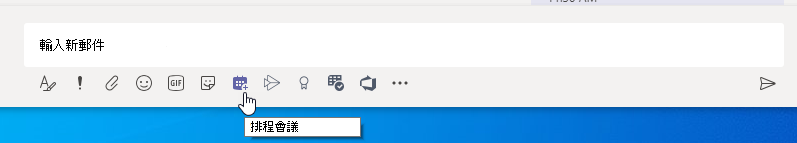
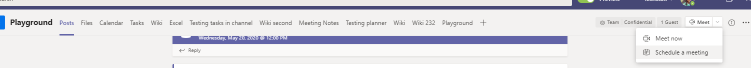

# 在團隊中管理會議原則Manage meeting policies in Teams

::: zone target="docs"
會議原則是針對由您組織中的使用者所排程的會議，控制會議參與者可用於會議的功能。Meeting policies are used to control the features that are available to meeting participants for meetings that are scheduled by users in your organization. 您可以使用全域 (組織範圍的預設) 原則，此原則會自動建立或建立並指派自訂原則。You can use the global (Org-wide default) policy that's automatically created or create and assign custom policies. 您可以在 Microsoft 團隊系統管理中心或使用 [PowerShell](teams-powershell-overview.md)管理會議原則。You manage meeting policies in the Microsoft Teams admin center or by using [PowerShell](teams-powershell-overview.md).

> [!NOTE]
> 如需使用角色來管理會議簡報者與出席者權限的相關資訊，請參閱 [小組會議中的角色](https://support.microsoft.com/office/roles-in-a-teams-meeting-c16fa7d0-1666-4dde-8686-0a0bfe16e019?ui=en-us&rs=en-us&ad=us)。For information about using roles to manage the permissions of meeting presenters and attendees, see [Roles in a Teams meeting](https://support.microsoft.com/office/roles-in-a-teams-meeting-c16fa7d0-1666-4dde-8686-0a0bfe16e019?ui=en-us&rs=en-us&ad=us).

您可以透過下列方式來實施原則，這會影響使用者在會議開始之前、會議期間或會議之後的會議體驗。You can implement policies in the following ways, which affect the meeting experience for users before a meeting starts, during a meeting, or after a meeting.

|實現類型Implementation type  |描述Description  |
|---------|---------|
|每個召集人Per-organizer    |當您實施每個召集人原則時，所有會議參與者都會繼承召集人的原則。When you implement a per-organizer policy, all meeting participants inherit the policy of the organizer. 例如， **自動承認人員** 是每個召集人原則，並控制使用者是否要直接加入會議，或在會議廳中等待指派原則的使用者所排程的會議。For example, **Automatically admit people** is a per-organizer policy and controls whether users join the meeting directly or wait in the lobby for meetings scheduled by the user who is assigned the policy.          |
|每位使用者Per-user    |當您執行每個使用者的原則時，只會套用每個使用者的原則，以限制召集人和/或會議參與者的特定功能。When you implement a per-user policy, only the per-user policy applies to restrict certain features for the organizer and/or meeting participants. 例如，[ **允許在頻道中立即開會** ] 是每個使用者的原則。For example, **Allow Meet now in channels** is a per-user policy.     |
|每個召集人和每位使用者Per-organizer and per-user     |當您實現每個召集人與每個使用者的原則組合時，某些功能會根據其原則和召集人原則，限制會議參與者。When you implement a combination of a per-organizer and per-user policy, certain features are restricted for meeting participants based on their policy and the organizer's policy. 例如，[ **允許雲端錄製** ] 是每個召集人和每個使用者的原則。For example, **Allow cloud recording** is a per-organizer and per-user policy. 開啟此設定可讓會議召集人與參與者開始並停止錄製。Turn on this setting to allow the meeting organizer and participants to start and stop a recording.

您可以編輯全域原則中的設定，或是建立並指派一或多個自訂原則。You can edit the settings in the global policy or create and assign one or more custom policies. 除非您建立並指派自訂原則，否則使用者會取得全域原則。Users will get the global policy unless you create and assign a custom policy.

> [!NOTE]
> 如果使用者已啟用音訊會議授權，或使用者允許音訊會議，則 [會議詳細資料] 按鈕就會提供，會議詳細資料將無法使用。Meeting details button will be available if a user has the audio conference licenses enabled or the user is allow for audio conferencing, if not, the meeting details will not be available.

## 建立自訂會議原則Create a custom meeting policy

1. 在 Microsoft 團隊系統管理中心的左導覽中，前往 [**會議**  >  **會議原則**]。In the left navigation of the Microsoft Teams admin center, go to **Meetings** > **Meeting policies**.
2. 按一下 [ **新增**]。Click **Add**.
3. 輸入原則的名稱和描述。Enter a name and description for the policy. 名稱不能包含特殊字元，且長度不可超過 64 個字元。The name can't contain special characters or be longer than 64 characters.
4. 選擇您想要的設定。Choose the settings that you want.
5. 按一下 [儲存]\*\*\*\*。Click **Save**.

例如，假設您有多位使用者，並且想要限制其會議所需的頻寬量。For example, say you have a bunch of users and you want to limit the amount of bandwidth that their meeting would require. 您可以建立名為「有限頻寬」的新自訂原則，並停用下列設定：You would create a new custom policy named "Limited bandwidth" and disable the following settings:

在 [音訊與視訊]\*\*\*\* 下：Under **Audio & video**:

- 關閉 [允許雲端錄製]。Turn off Allow cloud recording.
- 關閉 [允許 IP 視訊]。Turn off Allow IP video.

在 [內容共用]\*\*\*\* 下：Under **Content sharing**:

- 停用 [螢幕畫面分享模式]。Disable screen sharing mode.
- 關閉 [允許白板]。Turn off Allow whiteboard.
- 關閉 [允許共用記事]。Turn off Allow shared notes.

然後，將原則指派給使用者。Then assign the policy to the users.

## 編輯會議原則Edit a meeting policy

您可以編輯全域原則和您建立的任何自訂原則。You can edit the global policy and any custom policies that you create.

1. 在 Microsoft 團隊系統管理中心的左導覽中，前往 [**會議**  >  **會議原則**]。In the left navigation of the Microsoft Teams admin center, go to **Meetings** > **Meeting policies**.
2. 按一下原則名稱左邊的，然後按一下 [ **編輯**]，選取原則。Select the policy by clicking to the left of the policy name, and then click **Edit**.
3. 您可以從這裡進行所要的變更。From here, make the changes that you want.
4. 按一下 [儲存]\*\*\*\*。Click **Save**.

> [!NOTE]
> 一次只能為使用者指派一個會議原則。A user can be assigned only one meeting policy at a time.

## 將會議原則指派給使用者Assign a meeting policy to users

[!INCLUDE [assign-policy](includes/assign-policy.md)]

> [!NOTE]
> 如果使用者已獲指派，您就無法刪除原則。You can't delete a policy if users are assigned to it. 您必須先將其他原則指派給所有受影響的使用者，然後才能刪除原始原則。You must first assign a different policy to all affected users, and then you can delete the original policy.

## 會議原則設定Meeting policy settings

當您在 [ **會議原則** ] 頁面上選取現有的原則，或選取 [ **新增** ] 以新增原則時，您可以設定下列各項的設定。When you select an existing policy on the **Meeting policies** page or select **Add** to add a new policy, you can configure settings for the following.

- [一般General](#meeting-policy-settings---general)
- [音訊 & 影片Audio & video](#meeting-policy-settings---audio--video)
- [內容共用Content sharing](#meeting-policy-settings---content-sharing)
- [參與者 & 來賓Participants & guests](#meeting-policy-settings---participants--guests)

::: zone-end

## 會議原則設定-一般Meeting policy settings - General

- [允許頻道中的 [立即開會]](#allow-meet-now-in-channels)[Allow Meet now in channels](#allow-meet-now-in-channels)
- [允許 Outlook 增益集Allow the Outlook add-in](#allow-the-outlook-add-in)
- [允許頻道會議排程Allow channel meeting scheduling](#allow-channel-meeting-scheduling)
- [允許排程私人會議Allow scheduling private meetings](#allow-scheduling-private-meetings)
- [在私人會議中允許立即開會Allow Meet now in private meetings](#allow-meet-now-in-private-meetings)

### 允許頻道中的 [立即開會]Allow Meet now in channels

這是針對每個使用者的原則，在會議開始之前就會套用。This is a per-user policy and applies before a meeting starts. 此設定控制使用者是否可在團隊頻道中啟動零星會議。This setting controls whether a user can start an ad hoc meeting in a Teams channel. 如果您開啟此選項，當使用者在團隊頻道中張貼訊息時，使用者可以按一下撰寫方塊下的 [ **立即開會** ]，以在頻道中啟動零星會議。If you turn this on, when a user posts a message in a Teams channel, the user can click **Meet now** under the compose box to start an ad hoc meeting in the channel. 預設值為 True。The default value is True.

[ 下方 [立即開會] 圖示的螢幕擷取畫面](media/meeting-policies-meet-now.png#lightbox)

### 允許 Outlook 增益集Allow the Outlook add-in

這是針對每個使用者的原則，在會議開始之前就會套用。This is a per-user policy and applies before a meeting starts. 此設定可控制團隊會議是否可以在 Outlook (Windows、Mac、web 及行動裝置) 中排程。This setting controls whether Teams meetings can be scheduled from within Outlook (Windows, Mac, web, and mobile).

如果您關閉此功能，使用者在 Outlook 中建立新會議時，將無法排程團隊會議。If you turn this off, users are unable to schedule Teams meetings when they create a new meeting in Outlook. 例如，在 Windows 版 Outlook 中，新的 [ **小組會議** ] 選項不會顯示在功能區中。For example, in Outlook on Windows, the **New Teams Meeting** option won't show up in the ribbon.

### 允許頻道會議排程Allow channel meeting scheduling

使用現有的 AllowChannelMeetingScheduling 原則來控制可在小組頻道行事曆上建立的事件種類。Use the existing AllowChannelMeetingScheduling policy to control the types of events that can be created on the team channel calendars. 這是針對每個使用者的原則，在會議開始之前就會套用。This is a per-user policy and applies before a meeting starts. 此設定控制使用者是否可在團隊頻道中排程會議。This setting controls whether users can schedule a meeting in a Teams channel. 預設值為 True。The default value is True.

如果關閉此原則，使用者將無法建立新的頻道會議。If this policy is OFF, users will not be able to create new channel meetings. 不過，您可以透過事件的召集人來編輯現有的頻道會議。However, existing channel meetings can be edited by the organizer of the event.

[排程會議] 將停用。Schedule a meeting will be disabled.

![顯示團隊中的 [排程會議] 選項的螢幕擷取畫面](media/schedule-meeting-option.png)

頻道選取已停用。Channel selection is disabled.

[![螢幕擷取畫面顯示您要在其中排程會議的頻道的 [行事曆] 選項。 ](media/meeting-policies-select-a-channel-to-meet-in.png)](media/meeting-policies-select-a-channel-to-meet-in.png#lightbox)

在 [頻道貼上] 頁面中，下列將會停用：In the channel posts page, the following will be disabled:

- [頻道回復撰寫] 方塊上的 [**排程會議**] 按鈕。**Schedule a meeting** button on the channel reply compose box.
  ![螢幕擷取畫面顯示您要在其中排程會議的頻道的 [行事曆] 選項。](media/schedule-meeting-disabled-in-chat2.png)
  
- 頻道標題上的 [**排程會議**] 按鈕。**Schedule a meeting** button on the channel header.
  ![螢幕擷取畫面顯示您要在其中排程會議的頻道的 [行事曆] 選項。](media/schedule-now-in-header.png)

在頻道行事曆中：In the channel calendar:

- 頻道行事曆標頭上的 [**新增活動**] 按鈕將會停用。**Add new event** button on channel calendar header will be disabled.
  ![螢幕擷取畫面顯示您要在其中排程會議的頻道的 [行事曆] 選項。](media/add-new-event-disabled.png)

- 使用者將無法在頻道行事曆中拖曳並選取時間區塊來建立頻道會議。Users will not be able to drag and select a time block on the channel calendar to create a channel meeting.

- 使用者無法使用鍵盤快速鍵在頻道行事曆上建立會議。Users cannot use Keyboard shortcuts to create a meeting on the channel calendar.

在系統管理中心：In the Admin Center:

[頻道行事曆] app 會顯示在 [管理員] 面板中的 [ **Microsoft app** ] 區段底下，以取得許可權原則。The channel calendar app will show up under the **Microsoft apps** section in the admin panel for permission policies.

![螢幕擷取畫面顯示 [團隊管理] 主控台中的 Microsoft app 原則。](media/manage-microsoft-apps-policy.png)

### 允許排程私人會議Allow scheduling private meetings

這是針對每個使用者的原則，在會議開始之前就會套用。This is a per-user policy and applies before a meeting starts. 此設定可控制使用者是否可以在小組中排程私人會議。This setting controls whether users can schedule private meetings in Teams. 如果會議不是發佈至小組中的頻道，就是私人的。A meeting is private when it's not published to a channel in a team.

請注意，如果您關閉 [ **允許排程私人會議** ] 和 [ **允許頻道會議排程**]，就會針對小組中的使用者停用 [ **新增必要的出席** 者] 和 [ **新增頻道** ] 選項。Note that if you turn off **Allow scheduling private meetings** and **Allow channel meeting scheduling**,  the **Add required attendees** and **Add channel** options are disabled for users in Teams. 預設值為 True。The default value is True.

### 在私人會議中允許立即開會Allow Meet now in private meetings

這是針對每個使用者的原則，在會議開始之前就會套用。This is a per-user policy and applies before a meeting starts. 此設定可控制使用者是否能開始即席私人會議。This setting controls whether a user can start an ad hoc private meeting.  預設值為 True。The default value is True.

## 會議原則設定-音訊 & 影片Meeting policy settings - Audio & video

- [允許進行文字Allow transcription](#allow-transcription)
- [允許雲端錄製Allow cloud recording](#allow-cloud-recording)
- [允許 IP 視訊Allow IP video](#allow-ip-video)
- [媒體位元速率 (Kbs) Media bit rate (Kbs)](#media-bit-rate-kbs)

### 允許進行文字Allow transcription

這是每個組織單位和每個使用者原則的組合。This is a combination of a per-organizer and per-user policy. 此設定控制在播放會議錄製期間是否可使用 [標題] 和 [操作模式] 功能。This setting controls whether captions and transcription features are available during playback of meeting recordings. 如果您關閉此功能，則在播放會議錄製期間將無法使用 [ **搜尋** ] 和 [ **抄送** ] 選項。If you turn this off, the **Search** and **CC** options won't be available during playback of a meeting recording. 開始錄製需要已開啟此設定的人員，才能讓錄製也包含操作。The person who started the recording needs this setting turned on so that the recording also includes transcription.

請注意，目前只有將團隊中的語言設定為英文，且在會議中朗讀英文的使用者，才支援會議記錄會議。Note that transcription for recorded meetings is currently only supported for users who have the language in Teams set to English and when English is spoken in the meeting.

![螢幕擷取畫面顯示會議中的 [會議] 選項](media/meeting-policies-transcription.png)

### 允許雲端錄製Allow cloud recording

這是每個組織單位和每個使用者原則的組合。This is a combination of a per-organizer and per-user policy. 此設定控制是否可以錄製此使用者的會議。This setting controls whether this user's meetings can be recorded. 如果參與者已開啟該原則設定，且是來自同一個組織的經過驗證的使用者，則錄製可以由會議召集人或其他會議參與者啟動。The recording can be started by the meeting organizer or by another meeting participant if the policy setting is turned on for the participant and if they're an authenticated user from the same organization.

貴組織外部人員（例如同盟與匿名使用者）無法啟動錄製。People outside your organization, such as federated and anonymous users, can't start the recording. 來賓使用者無法啟動或停止錄製。Guest users can't start or stop the recording.

我們來看看下列範例。Let's look at the following example.

|使用者User |會議原則Meeting policy  |允許雲端錄製Allow cloud recording |
|---------|---------|---------|
|DanielaDaniela | 全域Global   | 虛假False |
|AmandaAmanda | Location1MeetingPolicyLocation1MeetingPolicy | 滿足True|
|John (外部使用者) John (external user) | 不適用Not applicable | 不適用Not applicable|

依 Daniela 組織的會議無法錄製，且 Amanda 已啟用原則設定的使用者，無法錄製由 Daniela 組織的會議。Meetings organized by Daniela can't be recorded and Amanda, who has the policy setting enabled, can't record meetings organized by Daniela. 您可以錄製由 Amanda 組織的會議，但 Daniela，誰已停用原則設定，而誰是外部使用者，就無法錄製由 Amanda 組織的會議。Meetings organized by Amanda can be recorded, however,  Daniela, who has the policy setting disabled and John who is an external user, can't record meetings organized by Amanda.

若要深入瞭解雲端會議錄製，請參閱 [小組雲端會議錄製](cloud-recording.md)。To learn more about cloud meeting recording, see [Teams cloud meeting recording](cloud-recording.md).

### 允許 IP 視訊Allow IP video

這是每個組織單位和每個使用者原則的組合。This is a combination of a per-organizer and per-user policy. 影片是會議的關鍵元件。Video is a key component to meetings. 在某些組織中，系統管理員可能會想要進一步控制哪些使用者的會議擁有影片。In some organizations, admins might want more control over which users' meetings have video. 此設定控制是否能在使用者託管的會議中以及使用者開始的1:1 通話和群組通話中開啟影片。This setting controls whether video can be turned on in meetings hosted by a user and in 1:1 calls and group calls started by a user. 在已啟用此原則的使用者組織的會議中，如果會議參與者也已啟用原則，則允許會議參與者在會議中進行影片共用。Meetings organized by a user who has this policy enabled, allow video sharing in the meeting by the meeting participants, if the meeting participants also have the policy enabled. 沒有指派任何原則的會議參與者 (例如，匿名和聯盟參與者) 繼承會議召集人的原則。Meeting participants who don't have any policies assigned (for example, anonymous and federated participants) inherit the policy of the meeting organizer.

我們來看看下列範例。Let's look at the following example.

|使用者User |會議原則Meeting policy  |允許 IP 影片Allow IP Video |
|---------|---------|---------|
|DanielaDaniela   | 全域Global   | 滿足True        |
|AmandaAmanda    | Location1MeetingPolicyLocation1MeetingPolicy        | 虛假False      |

由 Daniela 託管的會議允許開啟影片。Meetings hosted by Daniela allow video to be turned on. Daniela 可以加入會議，然後開啟 [影片]。Daniela can join the meeting and turn on video. Amanda 無法在 Daniela 的會議中開啟影片，因為 Amanda 的原則設定為 [不允許視頻]。Amanda can't turn on video in Daniela's meeting because Amanda's policy is set to not allow video. Amanda 可以查看會議中其他參與者所共用的影片。Amanda can see videos shared by other participants in the meeting.

在由 Amanda 託管的會議中，任何人都無法開啟影片，不論指派的是何種影片原則。In meetings hosted by Amanda, no one can turn on video, regardless of the video policy assigned to them. 這表示 Daniela 無法在 Amanda 的會議中開啟影片。This means Daniela can't turn on video in Amanda's meetings.  

如果 Daniela 呼叫 Amanda 的 [影片]，Amanda 只能以音訊接聽通話。If Daniela calls Amanda with video on, Amanda can answer the call with audio only.  通話連線時，Amanda 可以看到 Daniela 的影片，但無法開啟影片。When the call is connected, Amanda can see Daniela's video, but can't turn on video. 如果 Amanda 呼叫 Daniela，Daniela 可以使用影片和音訊接聽通話。If Amanda calls Daniela, Daniela can answer the call with video and audio. 當通話連線時，Daniela 可以視需要開啟或關閉她的影片。When the call is connected, Daniela can turn on or turn off her video, as needed.

### 媒體位元速率 (Kbs) Media bit rate (Kbs)

這是每個使用者的原則。This is a per-user policy. 此設定會針對使用者的通話和會議中的音訊、影片及影片式應用程式共用傳輸，決定媒體位元速率。This setting determines the media bit rate for audio, video, and video-based app sharing transmissions in calls and meetings for the user. 它適用于通話或會議中的使用者的上行與下行媒體遍歷。It's applied to both the uplink and downlink media traversal for users in the call or meeting. 此設定可讓您精細控制貴組織中的頻寬管理。This setting gives you granular control over managing bandwidth in your organization. 根據使用者所需的會議案例，我們建議您有足夠的頻寬來提供良好的品質體驗。Depending on the meetings scenarios required by users, we recommend having enough bandwidth in place for a good quality experience. 最小值為 30 Kbps，而最大值則視會議案例而定。The minimum value is 30 Kbps and the maximum value depends on the meeting scenario. 若要深入瞭解在小組中提供優質會議、通話及即時事件的最小建議頻寬，請參閱 [頻寬需求](prepare-network.md#bandwidth-requirements)。To learn more about the minimum recommended bandwidth for good quality meetings, calls, and live events in Teams, see [Bandwidth requirements](prepare-network.md#bandwidth-requirements).

如果沒有足夠的頻寬可供會議使用，參與者會看到指出網路品質不佳的訊息。If there isn't enough bandwidth for a meeting, participants see a message that indicates poor network quality.

如果會議需要最高品質的影片體驗（例如 CEO 董事會會議和小組即時事件），建議您將頻寬設定為 10 Mbps。For meetings that need the highest-quality video experience, such as CEO board meetings and Teams live events, we recommend you set the bandwidth to 10 Mbps. 即使已設定最高的體驗，小組的媒體堆疊也會在偵測到某些網路條件時適應低頻寬情況（視情況而定）。Even when the maximum experience is set, the Teams media stack adapts to low-bandwidth conditions when certain network conditions are detected, depending on the scenario.

## 會議原則設定-內容共用Meeting policy settings - Content sharing

- [螢幕畫面分享模式Screen sharing mode](#screen-sharing-mode)
- [允許參與者授與要求控制Allow a participant to give or request control](#allow-a-participant-to-give-or-request-control)
- [允許外部參與者授與或要求控制Allow an external participant to give or request control](#allow-an-external-participant-to-give-or-request-control)
- [允許 PowerPoint 共用Allow PowerPoint sharing](#allow-powerpoint-sharing)
- [允許白板Allow whiteboard](#allow-whiteboard)
- [允許共用筆記Allow shared notes](#allow-shared-notes)

### 螢幕畫面分享模式Screen sharing mode

這是每個組織單位和每個使用者原則的組合。This is a combination of a per-organizer and per-user policy. 此設定控制使用者的會議是否允許桌面和/或視窗共用。This setting controls whether desktop and/or window sharing is allowed in the user's meeting. 沒有任何 (指派任何原則的會議參與者（例如匿名、來賓、B2B 及同盟參與者）) 會繼承會議召集人的原則。Meeting participants who don't have any policies assigned (for example, anonymous, guest, B2B, and federated participants) inherit the policy of the meeting organizer.

|設定值Setting value |行為Behavior  |
|---------|---------|
|**整個畫面****Entire screen**    | 在會議中允許進行完整的桌面共用和應用程式共用Full desktop sharing and application sharing are allowed in the meeting |
|**單一應用程式****Single application**   | 允許在會議中共用應用程式Application sharing is allowed in the meeting        |
|**禁止****Disabled**     |在會議中關閉螢幕共用和應用程式共用。Screen sharing and application sharing turned off in the meeting.       |

我們來看看下列範例。Let's look at the following example.

|使用者User |會議原則Meeting policy |螢幕畫面分享模式Screen sharing mode |
|---------|---------|---------|
|DanielaDaniela  | 全域Global   | 整個畫面Entire screen |
|AmandaAmanda   | Location1MeetingPolicyLocation1MeetingPolicy  | 禁止Disabled |

Daniela 託管的會議可讓會議參與者共用整個螢幕或特定的應用程式。Meetings hosted by Daniela allow meeting participants to share their entire screen or a specific application. 如果 Amanda 加入 Daniela 的會議，Amanda 無法共用她的螢幕或特定的應用程式，因為她的原則設定已停用。If Amanda joins Daniela's meeting, Amanda can't share her screen or a specific application as her policy setting is disabled. 在由 Amanda 託管的會議中，不論指派給他們的螢幕共用模式原則為何，都不允許任何人共用其螢幕或單一應用程式。In meetings hosted by Amanda, no one is allowed to share their screen or a single application, regardless of the screen sharing mode policy assigned to them. 這表示 Daniela 無法在 Amanda 的會議中共用她的螢幕或單一應用程式。This means that Daniela can't share her screen or a single application in Amanda's meetings.  

目前，如果使用者使用的是 Google Chrome，就無法在團隊會議中播放影片或共用其螢幕。Currently, users can't play video or share their screen in a Teams meeting if they're using Google Chrome.

### 允許參與者授與要求控制Allow a participant to give or request control

這是每個使用者的原則。This is a per-user policy. 此設定可控制使用者是否可以將共用桌面或視窗控制權授與其他會議參與者。This setting controls whether the user can give control of the shared desktop or window to other meeting participants. 若要授與控制權，請將游標暫留在畫面頂端。To give control, hover over the top of the screen.

如果使用者已開啟此設定，則 [取得 **控制權** ] 選項會顯示在共用會話的上方列中。If this setting is turned on for the user, the **Give Control** option is displayed in the top bar in a sharing session.

![顯示 [授與控制權] 選項的螢幕擷取畫面](media/meeting-policies-give-control.png)

如果使用者的設定已關閉，則無法使用 [ **提供控制權** ] 選項。If the settings is turned off for the user, the **Give Control** option isn't available.

![螢幕擷取畫面顯示 [提供控制] 選項無法使用](media/meeting-policies-give-control-not-available.png)

我們來看看下列範例。Let's look at the following example.

|使用者User |會議原則Meeting policy  |允許參與者授與要求控制Allow participant to give or request control |
|---------|---------|---------|
|DanielaDaniela   | 全域Global   | 滿足True       |
|BabekBabek    | Location1MeetingPolicyLocation1MeetingPolicy        | 虛假False   |

Daniela 可以將共用桌面或視窗控制權提供給依 Babek 組織的會議中的其他參與者，但 Babek 無法將控制權授與其他參與者。Daniela can give control of the shared desktop or window to other participants in a meeting organized by Babek whereas Babek can't give control to other participants.

若要使用 PowerShell 來控制誰可以授與控制權或接受控制要求，請使用 AllowParticipantGiveRequestControl Cmdlet。To use PowerShell to control who can give control or accept requests for control, use the AllowParticipantGiveRequestControl cmdlet.

> [!NOTE]
> 若要在共用期間提供並控制共用的內容，雙方都必須使用小組桌面用戶端。To give and take control of shared content during sharing, both parties must be using the Teams desktop client. 當任一方執行瀏覽器中的 Teams 時，則不支援控制。Control isn't supported when either party is running Teams in a browser. 這是我們正計畫修正的技術限制所造成。This is due to a technical limitation that we're planning to fix.

### 允許外部參與者授與或要求控制Allow an external participant to give or request control

這是每個使用者的原則。This is a per-user policy. 組織是否有此組使用者無論會議召集人已設定的內容，都不會控制外部參與者所能執行的動作。Whether an organization has this set for a user doesn't control what external participants can do, regardless of what the meeting organizer has set. 這個參數會控制外部參與者是否可以受到控制或要求對共用者的螢幕進行控制，這要視共用資源在組織的會議原則中所設定的內容而定。This parameter controls whether external participants can be given control or request control of the sharer's screen, depending on what the sharer has set within their organization's meeting policies. 團隊會議中的外部參與者可以分類如下：External participants in Teams meetings can be categorized as follows:  

- 匿名使用者Anonymous user
- 來賓使用者Guest users  
- B2B 使用者B2B user
- 聯盟使用者Federated user  

聯盟使用者是否可在共用時授與外部使用者控制權，由允許外部參與者在其組織中 **提供或要求控制** 設定。Whether federated users can give control to external users while sharing is controlled by the **Allow an external participant to give or request control** setting in their organization.

若要使用 PowerShell 來控制外部參與者是否可以授與控制權或接受控制權要求，請使用 AllowExternalParticipantGiveRequestControl Cmdlet。To use PowerShell to control whether external participants can give control or accept requests for control, use the AllowExternalParticipantGiveRequestControl cmdlet.

### 允許 PowerPoint 共用Allow PowerPoint sharing

這是每個使用者的原則。This is a per-user policy. 此設定可控制使用者是否可以在會議中共用 PowerPoint 投影片投影片。This setting controls whether the user can share PowerPoint slide decks in a meeting. 外部使用者（包括匿名、來賓及同盟使用者）繼承會議召集人的原則。External users, including anonymous, guest, and federated users, inherit the policy of the meeting organizer.

我們來看看下列範例。Let's look at the following example.

|使用者User |會議原則Meeting policy  |允許 PowerPoint 共用Allow PowerPoint sharing |
|---------|---------|---------|
|DanielaDaniela   | 全域Global   | 滿足True       |
|AmandaAmanda   | Location1MeetingPolicyLocation1MeetingPolicy        | 虛假False   |

Amanda 無法在會議中共用 PowerPoint 投影片卡座，即使她是會議召集人也一樣。Amanda can't share PowerPoint slide decks in meetings even if she's the meeting organizer. Daniela 可以共用 PowerPoint 投影片卡座，即使會議是透過 Amanda 來組織。Daniela can share PowerPoint slide decks even if the meeting is organized by Amanda. Amanda 可以在會議中查看其他人所共用的 PowerPoint 投影片，即使她無法共用 PowerPoint 投影片投影片也一樣。Amanda can view the PowerPoint slide decks shared by others in the meeting, even though she can't share PowerPoint slide decks.

### 允許白板Allow whiteboard

這是每個使用者的原則。This is a per-user policy. 此設定可控制使用者是否可以在會議中共用白板。This setting controls whether a user can share the whiteboard in a meeting. 外部使用者（包括匿名、B2B 及同盟使用者）繼承會議召集人的原則。External users, including anonymous, B2B, and federated users, inherit the policy of the meeting organizer.

我們來看看下列範例。Let's look at the following example.

|使用者User |會議原則Meeting policy  |允許白板Allow whiteboard|
|---------|---------|---------|
|DanielaDaniela   | 全域Global   | 滿足True       |
|AmandaAmanda   | Location1MeetingPolicyLocation1MeetingPolicy        | 虛假False   |

Amanda 無法在會議中共用白板，即使她是會議召集人也一樣。Amanda can't share the whiteboard in a meeting even if she's the meeting organizer. Daniela 可以共用白板，即使會議是由 Amanda 來組織。Daniela can share the whiteboard even if a meeting is organized by Amanda.  

### 允許共用筆記Allow shared notes

這是每個使用者的原則。This is a per-user policy. 此設定可控制使用者是否可以在會議中建立和共用筆記。This setting controls whether a user can create and share notes in a meeting. 外部使用者（包括匿名、B2B 及同盟使用者）繼承會議召集人的原則。External users, including anonymous, B2B, and federated users, inherit the policy of the meeting organizer. 目前僅支援超過20名參與者的會議中的 [ **會議記事** ] 索引標籤。The **Meeting Notes** tab is currently only supported in meetings that have fewer than 20 participants.

我們來看看下列範例。Let's look at the following example.

|使用者User |會議原則Meeting policy  |允許共用筆記Allow shared notes |
|---------|---------|---------|
|DanielaDaniela   | 全域Global   | 滿足True       |
|AmandaAmanda   | Location1MeetingPolicyLocation1MeetingPolicy | 虛假False |

Daniela 可以在 Amanda 的會議中記錄筆記，而 Amanda 無法在任何會議中記錄筆記。Daniela can take notes in Amanda's meetings and Amanda can't take notes in any meetings.

## 會議原則設定-參與者 & 來賓Meeting policy settings - Participants & guests

這些設定會控制哪些會議參與者會在會議廳中等待，並在會議遭到准許前進行會議，以及在會議中允許的參與程度。These settings control which meeting participants wait in the lobby before they are admitted to the meeting and the level of participation they are allowed in a meeting.

- [讓匿名人員開始會議Let anonymous people start a meeting](#let-anonymous-people-start-a-meeting)
- [自動承認人員Automatically admit people](#automatically-admit-people)
- [允許撥入使用者略過大廳Allow dial-in users to bypass the lobby](#allow-dial-in-users-to-bypass-the-lobby)
- [啟用即時標題Enable live captions](#enable-live-captions)
- [允許在會議中聊天Allow chat in meetings](#allow-chat-in-meetings)

> [!NOTE]
>加入會議的選項會根據每個團隊群組的設定和連接方法而有所不同。Options to join a meeting will vary, depending on the settings for each Teams group, and the connection method. 如果您的群組有音訊會議，且使用它來連接，請參閱 [音訊會議](https://docs.microsoft.com/microsoftteams/audio-conferencing-in-office-365)。If your group has audio conferencing, and uses it to connect, see [Audio Conferencing](https://docs.microsoft.com/microsoftteams/audio-conferencing-in-office-365). 如果您的 [小組] 群組沒有音訊會議，請參閱 [在小組中加入會議](https://support.office.com/article/join-a-meeting-in-teams-1613bb53-f3fa-431e-85a9-d6a91e3468c9)。If your Teams group does not have audio conferencing, refer to [Join a meeting in Teams](https://support.office.com/article/join-a-meeting-in-teams-1613bb53-f3fa-431e-85a9-d6a91e3468c9).

### 讓匿名人員開始會議Let anonymous people start a meeting

這是允許 leaderless 電話撥入式會議會議的每個召集人原則。This is a per-organizer policy that allows for leaderless dial-in conferencing meetings. 此設定會控制撥入使用者是否無需經過驗證的使用者，就能從出席中的組織加入會議。This setting controls whether dial-in users can join the meeting without an authenticated user from the organization in attendance. 預設值為 False，表示撥入使用者會在大廳等候，直到組織中的已驗證使用者加入會議為止。The default value is False which means dial-in users will wait in the lobby until an authenticated user from the organization joins the meeting.

> [!NOTE]
> 如果是 False，且撥入使用者會先加入會議，且位於大廳，組織使用者必須加入會議與團隊用戶端，才能從大廳承認使用者。If False and a dial-in user joins the meeting first and is placed in the lobby, an organization user must join the meeting with a Teams client to admit the user from the lobby. 沒有可撥打給使用者的大廳控制項。There are no lobby controls available for dialed in users.

### 自動承認人員Automatically admit people

這是每個召集人原則。This is a per-organizer policy. 此設定控制使用者是否直接加入會議，或在大廳等候，直到經過驗證的使用者准許。This setting controls whether people join a meeting directly or wait in the lobby until they are admitted by an authenticated user. 此設定不會套用至撥入使用者。This setting does not apply to dial-in users.

 會議召集人可以按一下會議邀請中的 [ **會議選項** ]，針對每個會議所排程的會議變更此設定。Meeting organizers can click **Meeting Options** in the meeting invitation to change this setting for each meeting they schedule.

> [!NOTE]
> 在會議選項中，設定會標示為「誰可以略過大廳」。In the meeting options the setting is labeled "Who can bypass the lobby". 如果您變更任何使用者的預設設定，就會套用至該使用者所組織的所有新會議，以及使用者未修改會議選項的任何先前會議。If you change the default setting for any user, it will apply to all new meetings organized by that user and any prior meetings where the user didn't modify Meeting options.
  
|設定值Setting value  |加入行為Join behavior |
|---------|---------|
|**任何人****Everyone**   |所有會議參與者都能直接加入會議，不需要在大廳等候。All meeting participants join the meeting directly without waiting in the lobby. 這包括經過驗證的使用者、信任組織中的外部使用者 (聯盟) 、來賓及匿名使用者。This includes authenticated users, external users from trusted organizations (federated), guests, and anonymous users.     |
|**貴組織和聯盟組織中的每個人****Everyone in your organization and federated organizations**     |組織內經過驗證的使用者，包括來賓使用者以及受信任組織的使用者，直接加入會議，不需在大廳等候。Authenticated users within the organization, including guest users and the users from trusted organizations, join the meeting directly without waiting in the lobby.  匿名使用者在大廳等候。Anonymous users wait in the lobby.   |
|**貴組織中的每個人****Everyone in your organization**    |從組織內的經過驗證的使用者（包括來賓使用者），直接加入會議，不需在大廳等候。Authenticated users from within the organization, including guest users, join the meeting directly without waiting in the lobby.  受信任的組織中的使用者和匿名使用者在大廳等候。Users from trusted organizations and anonymous users wait in the lobby. 這是預設設定。This is the default setting.           |
|**僅限召集人****Organizer only**    |只有會議召集人可以直接加入會議，不需要在大廳等候。Only meeting organizers can join the meeting directly without waiting in the lobby. 其他人，包括組織中的經過驗證的使用者、來賓使用者、受信任組織的使用者以及匿名使用者都必須在大廳等候。Everyone else, including authenticated users within the organization, guest users, users from trusted organizations and anonymous users must wait in the lobby.           |

### 允許撥入使用者略過大廳Allow dial-in users to bypass the lobby

這是每個召集人原則。This is a per-organizer policy. 此設定控制由手機撥入的人員是否直接加入會議，或無論是否已 **自動准許 [人員** ] 設定，也會在大廳中等待。This setting controls whether people who dial in by phone join the meeting directly or wait in the lobby regardless of the **Automatically admit people** setting. 預設值為 False。The default value is False. 當為 False 時，撥入使用者會在大廳等候，直到組織使用者與團隊用戶端加入會議，然後允許他們。When False, dial-in users will wait in the lobby until a organization user joins the meeting with a Teams client and admits them. 當 True 時，當組織使用者加入會議時，撥入使用者會自動加入會議。When True, dial-in users will automatically join the meeting when an organization user joins the meeting.

> [!NOTE]
> 如果撥入使用者在組織使用者加入會議之前加入會議，則會將它們放在大廳中，直到組織使用者使用團隊用戶端加入會議並允許會議為止。If a dial-in user joins a meeting before an organization user joins the meeting, they will be placed in the lobby until an organization user joins the meeting using a Teams client and admits them. 如果您變更任何使用者的預設設定，就會套用至該使用者所組織的所有新會議，以及使用者未修改會議選項的任何先前會議。If you change the default setting for any user, it will apply to all new meetings organized by that user and any prior meetings where the user didn't modify Meeting options.

### 啟用即時標題Enable live captions

這是針對每個使用者的原則，且適用于會議期間。This is a per-user policy and applies during a meeting. 此設定會控制是否可使用 [ **開啟即時標題** ] 選項來開啟和關閉使用者出席會議中的即時輔助字幕。This setting controls whether the **Turn on live captions** option is available for the user to turn on and turn off live captions in meetings that the user attends.  

![顯示 [開啟即時標題] 選項的螢幕擷取畫面](media/meeting-policies-live-captions.png)

|設定值Setting value |行為Behavior  |
|---------|---------|
|**已停用，但使用者可以覆寫****Disabled but the user can override**     | 在會議期間，使用者不會自動開啟 [即時] 標題。Live captions aren't automatically turned on for the user during a meeting. 使用者可以在 [溢出 () **...** ] 功能表中看到 [**開啟即時標題**] 選項，將其開啟。The user sees the **Turn on live captions** option in the overflow (**...**) menu to turn them on. 這是預設設定。This is the default setting. |
|**禁止****Disabled**     | 使用者在會議期間停用 [即時] 標題。Live captions are disabled for the user during a meeting. 使用者沒有選項可將其開啟。The user doesn't have the option to turn them on.          |

### 允許在會議中聊天Allow chat in meetings

這是每個召集人原則。This is a per-organizer policy. 此設定控制是否允許在使用者的會議中使用會議聊天。This setting controls whether meeting chat is allowed in the user's meeting.

## 會議原則設定-指定的簡報者角色模式Meeting policy settings - Designated presenter role mode

這是每個使用者的原則。This is a per-user policy. 這項設定可讓您變更小組用戶端的 [**會議選項**] 中的 [**可以出示的人員**] 設定的預設值。This setting lets you change the default value of the **Who can present?** setting in **Meeting options** in the Teams client. 此原則設定會影響所有會議，包括 [立即開會] 會議。This policy setting affects all meetings, including Meet Now meetings.

[ **可以出席的人員** ] 設定可讓會議召集人選擇要在會議中成為簡報者的人員。The **Who can present?** setting lets meeting organizers choose who can be presenters in a meeting. 若要深入瞭解，請參閱[在團隊會議中](https://support.microsoft.com/article/roles-in-a-teams-meeting-c16fa7d0-1666-4dde-8686-0a0bfe16e019)[變更團隊會議](https://support.microsoft.com/article/change-participant-settings-for-a-teams-meeting-53261366-dbd5-45f9-aae9-a70e6354f88e)與角色的參與者設定。To learn more, see [Change participant settings for a Teams meeting](https://support.microsoft.com/article/change-participant-settings-for-a-teams-meeting-53261366-dbd5-45f9-aae9-a70e6354f88e) and [Roles in a Teams meeting](https://support.microsoft.com/article/roles-in-a-teams-meeting-c16fa7d0-1666-4dde-8686-0a0bfe16e019).

目前您只能使用 PowerShell 來設定此原則設定。Currently, you can only use PowerShell to configure this policy setting. 您可以使用 [CsTeamsMeetingPolicy](https://docs.microsoft.com/powershell/module/skype/set-csteamsmeetingpolicy) Cmdlet 來編輯現有的團隊會議原則。You can edit an existing Teams meeting policy by using the [Set-CsTeamsMeetingPolicy](https://docs.microsoft.com/powershell/module/skype/set-csteamsmeetingpolicy) cmdlet. 或者，您可以使用 [新的 CsTeamsMeetingPolicy](https://docs.microsoft.com/powershell/module/skype/new-csteamsmeetingpolicy) Cmdlet 來建立新的團隊會議原則，並將它指派給使用者。Or, create a new Teams meeting policy by using the [New-CsTeamsMeetingPolicy](https://docs.microsoft.com/powershell/module/skype/new-csteamsmeetingpolicy) cmdlet and assign it to users.

若要指定 [ **可以提出的人員** ] 的預設值，請將 **DesignatedPresenterRoleMode** 參數設定為下列其中一項：To specify the default value of the **Who can present?** setting in Teams, set the **DesignatedPresenterRoleMode** parameter to one of the following:

- **EveryoneUserOverride**：所有會議參與者都可以是簡報者。**EveryoneUserOverride**:  All meeting participants can be presenters. 此為預設值。This is the default value. 這個參數會對應到 [小組] 中的 [ **所有人** ] 設定。This parameter corresponds to the **Everyone** setting in Teams.
- **EveryoneInCompanyUserOverride**：組織中經過驗證的使用者，包括來賓使用者，都可以是簡報者。**EveryoneInCompanyUserOverride**: Authenticated users in the organization, including guest users, can be presenters. 這個參數會對應到 [ **我的組織** 中的人員] 設定。This parameter corresponds to the **People in my organization** setting in Teams.
- **OrganizerOnlyUserOverride**：只有會議召集人可以成為簡報者，且所有會議參與者都指定為出席者。**OrganizerOnlyUserOverride**: Only the meeting organizer can be a presenter and all meeting participants are designated as attendees. 這個參數會對應到 [團隊] 中的 [ **僅自己** ] 設定。This parameter corresponds to the **Only me** setting in Teams.

請記住，在您設定預設值之後，會議召集人仍可在團隊中變更此設定，並選擇誰可以在排程的會議中出席。Keep in mind that after you set the default value, meeting organizers can still change this setting in Teams and choose who can present in the meetings that they schedule.

## 會議原則設定-會議出席情況報告Meeting policy settings - Meeting attendance report

這是每個使用者的原則。This is a per-user policy. 此設定控制會議召集人是否可以下載 [會議出席情況報告](teams-analytics-and-reports/meeting-attendance-report.md)。This setting controls whether meeting organizers can download the [meeting attendance report](teams-analytics-and-reports/meeting-attendance-report.md).

目前您只能使用 PowerShell 來設定此原則設定。Currently, you can only use PowerShell to configure this policy setting. 您可以使用 [CsTeamsMeetingPolicy](https://docs.microsoft.com/powershell/module/skype/set-csteamsmeetingpolicy) Cmdlet 來編輯現有的團隊會議原則。You can edit an existing Teams meeting policy by using the [Set-CsTeamsMeetingPolicy](https://docs.microsoft.com/powershell/module/skype/set-csteamsmeetingpolicy) cmdlet. 或者，您可以使用 [新的 CsTeamsMeetingPolicy](https://docs.microsoft.com/powershell/module/skype/new-csteamsmeetingpolicy) Cmdlet 來建立新的團隊會議原則，並將它指派給使用者。Or, create a new Teams meeting policy by using the [New-CsTeamsMeetingPolicy](https://docs.microsoft.com/powershell/module/skype/new-csteamsmeetingpolicy) cmdlet and assign it to users.

若要讓會議召集人下載會議出席情況報告，請將 **AllowEngagementReport** 參數設定為 [ **已啟用**]。To enable a meeting organizer to download the meeting attendance report, set the **AllowEngagementReport** parameter  to **Enabled**. 啟用時，會在 **參與者** 窗格中顯示下載報告的選項。When enabled, the option to download the report is displayed in the **Participants** pane.

若要避免會議召集人下載報表，請將參數設定為 [ **已停用**]。To prevent a meeting organizer from downloading the report, set the parameter to **Disabled**. 根據預設，此設定會停用，而且無法使用下載報表的選項。By default, this setting is disabled and the option to download the report isn't available.

## 會議原則設定-適用于孤島模式的會議提供者Meeting policy settings - Meeting provider for Islands mode

這是每個使用者的原則。This is a per-user policy. 這個設定控制哪一個 Outlook 會議增益集會用於使用 *孤島模式的使用者*。This setting controls which Outlook meeting add-in is used for *users who are in Islands mode*. 您可以指定使用者是否只能使用 [團隊會議] 增益集，或是同時使用 [團隊會議] 和 [商務用 Skype 會議] 增益集，在 Outlook 中排程會議。You can specify whether users can only use the Teams Meeting add-in or both the Teams Meeting and Skype for Business Meeting add-ins to schedule meetings in Outlook.

您只能將此原則套用到使用孤島模式的使用者，並在其團隊會議原則中，將 **AllowOutlookAddIn** 參數設定為 **True** 。You can only apply this policy to users who are in Islands mode and have the **AllowOutlookAddIn** parameter set to **True** in their Teams meeting policy.

目前您只能使用 PowerShell 來設定此原則。Currently, you can only use PowerShell to set this policy. 您可以使用 [CsTeamsMeetingPolicy](https://docs.microsoft.com/powershell/module/skype/set-csteamsmeetingpolicy) Cmdlet 來編輯現有的團隊會議原則。You can edit an existing Teams meeting policy by using the [Set-CsTeamsMeetingPolicy](https://docs.microsoft.com/powershell/module/skype/set-csteamsmeetingpolicy) cmdlet. 或者，您可以使用 [新的 CsTeamsMeetingPolicy](https://docs.microsoft.com/powershell/module/skype/new-csteamsmeetingpolicy) Cmdlet 來建立新的團隊會議原則，並將它指派給使用者。Or, create a new Teams meeting policy by using the [New-CsTeamsMeetingPolicy](https://docs.microsoft.com/powershell/module/skype/new-csteamsmeetingpolicy) cmdlet and assign it to users.

若要指定使用者可以使用的會議增益集，請設定 **PreferredMeetingProviderForIslandsMode** 參數，如下所示：To specify which meeting add-in you want to be available to users, set the **PreferredMeetingProviderForIslandsMode** parameter as follows:

- 將參數設定為 **TeamsAndSfB** ，以在 Outlook 中同時啟用 [團隊會議增益集] 和 [商務用 Skype] 增益集。Set the parameter to **TeamsAndSfB** to enable both the Teams Meeting add-in and Skype for Business add-in in Outlook. 此為預設值。This is the default value.
- 將參數設定為 [ **團隊** ]，只會在 Outlook 中啟用 [團隊會議] 增益集。Set the parameter to **Teams** to enable only the Teams Meeting add-in in Outlook. 此原則設定可確保所有未來的會議都有小組會議加入連結。This policy setting ensures that all future meetings have a Teams meeting join link. 它不會將現有的商務用 Skype 會議加入連結遷移至團隊。It doesn't migrate existing Skype for Business meeting join links to Teams. 此原則設定不會影響商務用 Skype 中的目前狀態、聊天、PSTN 通話或任何其他功能，這表示使用者將繼續使用商務用 Skype 來取得這些功能。This policy setting doesn't affect presence, chat, PSTN calling, or any other capabilities in Skype for Business, which means that users will continue to use Skype for Business for these capabilities.

  如果您將參數設定為 [ **團隊**]，然後切換回 **TeamsAndSfB**，則會啟用兩個會議增益集。If you set the parameter to **Teams**, and then switch back to **TeamsAndSfB**, both meeting add-ins are enabled. 不過，請注意，現有的團隊會議加入連結不會遷移到商務用 Skype。However, note that existing Teams meeting join links won't be migrated to Skype for Business. 只有在變更之後所排程的商務用 Skype 會議，才會有商務用 Skype 會議加入連結。Only Skype for Business meetings scheduled after the change will have a Skype for Business meeting join link.

## 會議原則設定-影片篩選模式Meeting policy settings - Video filters mode

這是每個使用者的原則。This is a per-user policy. 此設定可控制使用者是否可以在會議中自訂其影片背景。This setting controls whether users can customize their video background in a meeting.

目前您只能使用 PowerShell 來設定此原則。Currently, you can only use PowerShell to set this policy. 您可以使用 [CsTeamsMeetingPolicy](https://docs.microsoft.com/powershell/module/skype/set-csteamsmeetingpolicy) Cmdlet 來編輯現有的團隊會議原則。You can edit an existing Teams meeting policy by using the [Set-CsTeamsMeetingPolicy](https://docs.microsoft.com/powershell/module/skype/set-csteamsmeetingpolicy) cmdlet. 或者，使用 [新的 CsTeamsMeetingPolicy](https://docs.microsoft.com/powershell/module/skype/new-csteamsmeetingpolicy) Cmdlet 來建立新的團隊會議原則，然後將原則指派給使用者。Or, create a new Teams meeting policy by using the [New-CsTeamsMeetingPolicy](https://docs.microsoft.com/powershell/module/skype/new-csteamsmeetingpolicy) cmdlet, and then assign the policy to users.

若要指定使用者是否可以在會議中自訂其影片背景，請設定 **VideoFiltersMode** 參數，如下所示：To specify whether users can customize their video background in a meeting, set the **VideoFiltersMode** parameter as follows:

|在 PowerShell 中設定值Setting value in PowerShell |行為Behavior  |
|---------|---------|
|**NoFilters****NoFilters**     |使用者無法自訂其影片背景。User can't customize their video background.|
|**BlurOnly****BlurOnly**     |使用者可以選擇將影片背景模糊。User has the option to blur their video background. |
|**BlurandDefaultBackgrounds****BlurandDefaultBackgrounds**     |使用者可以選擇將影片背景模糊，或從預設的影像集合中選擇，以做為其背景。User has the option to blur their video background or choose from the default set of images to use as their background. |
|**AllFilters****AllFilters**     |使用選項可讓影片背景變模糊、選擇預設的影像，或上傳自訂圖像來作為其背景。Use has the option to blur their video background, choose from the default set of images, or upload custom images to use as their background. |

> [!NOTE]
> 使用者上傳的影像不會受到小組的篩選。Images uploaded by users aren't screened by Teams. 當您使用 [ **AllFilters** ] 設定時，您應該擁有內部組織原則，以防止使用者上傳冒犯性或不適當的影像，或貴組織沒有許可權可供團隊會議背景使用。When you use the **AllFilters** setting, you should have internal organization policies to prevent users from uploading offensive or inappropriate images, or images your organization don't have rights to use for Teams meeting backgrounds.

## 相關主題Related topics

- [Teams PowerShell 概觀Teams PowerShell overview](teams-powershell-overview.md)
- [指派策略給小組中的使用者Assign policies to your users in Teams](assign-policies.md)
- [從使用者移除 RestrictedAnonymousAccess 團隊會議原則Remove the RestrictedAnonymousAccess Teams meeting policy from users](meeting-policies-restricted-anonymous-access.md)
