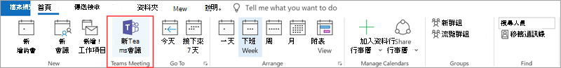
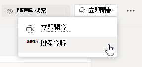
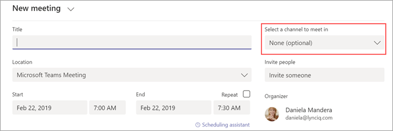
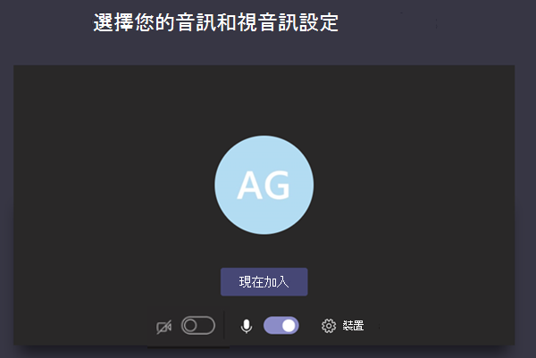
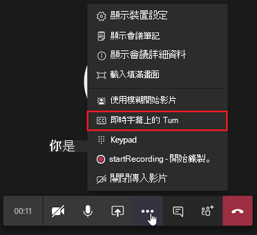
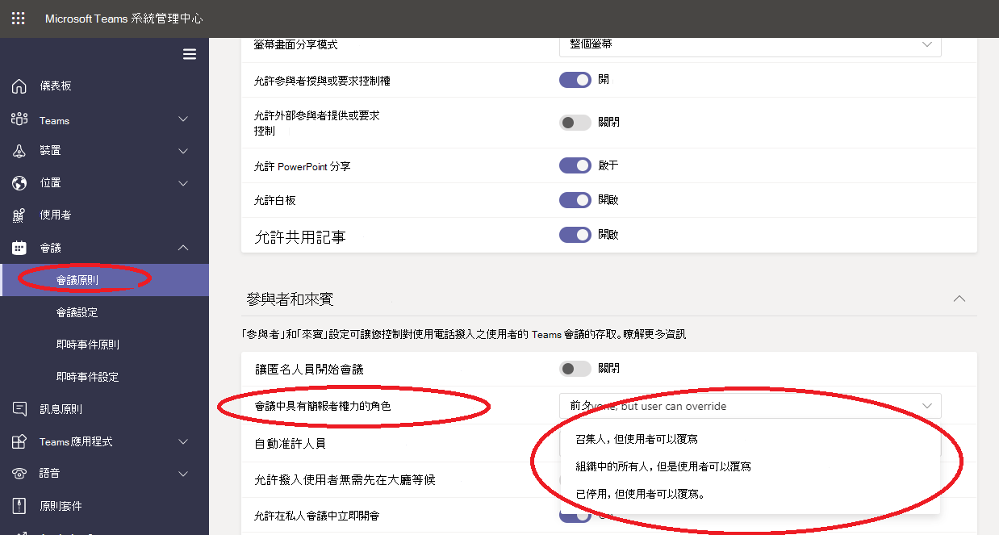

# 在 Teams 中管理會議原則

::: zone target="docs"
使用會議原則控制組織中使用者規劃的會議之會議參與者可用的功能。 您可以使用自動建立的全域 (全組織預設值) 原則，或建立並指派自訂原則。 您可以在 Microsoft Teams 系統管理中心或使用 [PowerShell](teams-powershell-overview.md) 來管理會議原則。

> [!NOTE]
> 如需使用角色來管理會議簡報者和出席者權限的詳細資訊，請參閱 [Teams 會議中的角色](https://support.microsoft.com/office/roles-in-a-teams-meeting-c16fa7d0-1666-4dde-8686-0a0bfe16e019?ui=en-us&rs=en-us&ad=us)。

您可以以下列方式來實作原則，這會影響使用者在會議開始、會議期間或會議後的會議體驗。

|實作類型  |描述  |
|---------|---------|
|每一召集人    |當您實作每一召集人原則時，所有會議參與者都會繼承召集人的原則。 例如，[自動准許人員 **]** 是每一召集人的原則。 可控制使用者是否能直接加入會議，還是在大廳等候獲派該原則的使用者排定的會議。          |
|每一使用者    |當您實作每一使用者原則時，僅會套用每一使用者原則，以限制召集人和/或會議參與者的某些功能。 例如，[允許在頻道中立即開會 **]** 是每一使用者原則。     |
|每一召集人和每一使用者     |當您實作每一召集人和每一使用者的原則組合時，系統會根據參與者的原則和召集人的原則，限制會議參與者的某些功能。 例如，**允許雲端錄製** 是每一召集人和每一使用者原則。 開啟此設定以允許使用者開始和停止錄製。

您可以編輯全域原則中的設定，或建立並指派一或多個自訂原則。 除非您建立並指派自訂原則，否則使用者將會取得全域原則。

> [!NOTE]
> 如果使用者已啟用音訊會議授權，或使用者已獲允許進行音訊會議，則 [會議詳細資料] 按鈕將可供使用，否則會議詳細資料將無法使用。

## 建立自訂會議原則

1. 在 Microsoft Teams 系統管理中心的左側瀏覽窗格中，移至 [會議 **]**  >  [會議原則 **]**。
2. 選取 [新增 **]**。
3. 輸入原則的名稱和描述。 名稱不能包含特殊字元，且長度不可超過 64 個字元。
4. 選擇您想要的設定。
5. 選取 [儲存 **]**。

例如，假設您有多位使用者，並且想要限制其會議所需的頻寬量。 您可以建立名為「有限頻寬」的新自訂原則，並停用下列設定：

在 [音訊與視訊] 下：

- 關閉 [允許雲端錄製]。
- 關閉 [允許 IP 視訊]。

在 [內容共用] 下：

- 停用 [螢幕畫面分享模式]。
- 關閉 [允許白板]。
- 關閉 [允許共用記事]。

然後，將原則指派給使用者。

## 編輯會議原則

您可以編輯全域原則和您建立的任何自訂原則。

1. 在 Microsoft Teams 系統管理中心的左側瀏覽窗格中，移至 [會議 **]**  >  [會議原則 **]**。
2. 按一下原則名稱左側來選取原則，然後選取 [編輯 **]**。
3. 從此處，進行您需要的變更。
4. 選取 [儲存 **]**。

> [!NOTE]
> 一次只能為使用者指派一個會議原則。

## 將會議原則指派給使用者

[!INCLUDE [assign-policy](includes/assign-policy.md)]

> [!NOTE]
> 如果已將原則指派給使用者，就無法刪除該原則。 您必須先為所有受影響的使用者指派不同的原則，之後才可以刪除原始原則。

## 會議原則設定

在 [會議原則 **]** 頁面上選取現有的原則，或選取 [新增 **]** 以新增新原則。 設定下列項目的設定。

- [一般](#meeting-policy-settings---general)
- [音訊與視訊](#meeting-policy-settings---audio--video)
- [內容共用](#meeting-policy-settings---content-sharing)
- [參與者與來賓](#meeting-policy-settings---participants--guests)

::: zone-end

## 會議原則設定 - 一般

- [允許在頻道中立即開會](#allow-meet-now-in-channels)
- [允許 Outlook 增益集](#allow-the-outlook-add-in)
- [允許頻道會議排程](#allow-channel-meeting-scheduling)
- [允許排程私人會議](#allow-scheduling-private-meetings)
- [允許在私人會議中立即開會](#allow-meet-now-in-private-meetings)

### 允許在頻道中立即開會

允許 [立即開會 **]** 是每一使用者原則，且會在會議開始之前套用。 此設定可控制使用者是否可以在 Teams 頻道中開始非計畫的會議。 如果您開啟此設定，使用者可以選取 [會議 **]** 按鈕以開始非計畫的會議，或在頻道中排程會議。 預設值為 True。

![訊息下方顯示 [立即開會] 圖示的螢幕擷取畫面](media/meeting-policies-meet-now.png)

### 允許 Outlook 增益集

允許 Outlook 增益集是每一使用者原則，且會在會議開始之前套用。 此設定可控制是否可以從 Outlook (Windows、Mac、Web 及行動裝置) 內排程 Teams 會議。

如果您關閉此功能，使用者將無法排程。 使用者在 Outlook 中建立新會議時的 Teams 會議。 例如，在 Windows 上的 Outlook 中，[新增 Teams 會議 **]** 選項不會在功能區中顯示。

### 允許頻道會議排程

使用現有的 AllowChannelMeetingScheduling 原則來控制可以在小組頻道行事曆上建立的事件類型。 這是每一使用者原則，且會在會議開始之前套用。 此設定可控制使用者是否可以在 Teams 頻道中排程會議。 此設定預設會開啟。

如果關閉此原則，使用者無法建立新的頻道會議。 不過，活動召集人可以編輯現有的頻道會議。

將會停用排程會議。

 

頻道選項已停用。

在頻道文章頁面中，將會停用下列功能：

- 頻道回覆撰寫方塊上的 [排程會議 **]** 按鈕。
  回覆撰寫方塊上的 [排程會議![]](media/schedule-meeting-disabled-in-chat2.png) 按鈕
  
- 頻道標題上的 [排程會議 **]** 按鈕。
  頻道標題中的 [排程會議![]](media/schedule-now-in-header.png) 按鈕

在頻道行事曆中：

- 頻道行事曆上的 [新增活動 **]** 按鈕將會停用。
  

- 使用者無法拖曳並選取頻道行事曆上的時間區塊，以建立頻道會議。

- 使用者無法以鍵盤快速鍵在頻道行事曆上建立會議。

在系統管理中心：

頻道行事曆應用程式會在應用程式權限原則頁面上的 [Microsoft 應用程式 **]** 區段中顯示。

 

### 允許排程私人會議

排程私人會議是每一使用者原則，且會在會議開始之前套用。 此設定可控制使用者是否可以在 Teams 中排程私人會議。 當會議未發佈到小組中的頻道時，會議是私人的。

如果您關閉 [允許排程私人會議 **]** 和 [允許頻道會議排程 **]**，則會為 Teams 中的使用者停用 [新增出席者 **]** 和 [新增頻道 **]** 選項。 此設定預設會開啟。

### 允許在私人會議中立即開會

這是每一使用者原則，且會在會議開始之前套用。 此設定可控制使用者是否可以開始非計畫的私人會議。 此設定預設會開啟。

## 會議原則設定 - 音訊與視訊

- [允許轉錄](#allow-transcription)
- [允許雲端錄製](#allow-cloud-recording)
- [IP 音訊的模式](#mode-for-ip-audio)
- [IP 視訊的模式](#mode-for-ip-video)
- [允許 IP 視訊](#allow-ip-video)
- [媒體位元速率 (KB)](#media-bit-rate-kbs)

### 允許轉錄

此原則會開啟即時轉錄。 允許轉錄是每一使用者原則。 此設定可控制是否可以轉錄此特定小組的會議。

即時轉錄會以近乎即時的方式在 Teams 會議期間顯示口語內容的語音轉換文字。 文字會隨著視訊會議顯示，包括演講者名稱和時間戳記。 若要深入了解，請參閱[在 Teams 會議中檢視即時轉錄](https://support.microsoft.com/office/view-live-transcription-in-a-teams-meeting-dc1a8f23-2e20-4684-885e-2152e06a4a8b)。

目前 Teams 桌面用戶端上支援即時轉錄。 轉錄支援美國英文口語。 轉錄內容可在 Teams 桌面或 Web 上的會議之後使用。

以下說明 [允許轉錄 **]** 和 [允許雲端錄製 **]** 原則設定如何共同搭配。 下表說明這些設定的值和會議行為。

|允許轉錄|允許雲端錄製|行為|
|---------|---------|---------|
|**開啟**|**開啟**|[開始轉錄 **]** 選項可在 Teams 會議中使用。 會議召集人或會議參與者可以開始和停止轉錄。 [開始錄製 **]** 選項可在 Teams 會議中使用。 會議召集人或會議參與者可以開始和停止錄製。 |
|**開啟**|**關閉**|[開始轉錄 **]** 選項可在 Teams 會議中使用。 [開始錄製 **]** 選項無法在 Teams 會議中使用。 |
|**關閉**|**開啟**|[開始錄製 **]** 選項可在 Teams 會議中使用。 [開始轉錄 **]** 選項無法在 Teams 會議中使用。|
|**關閉**|**關閉**|Teams 會議中無法使用錄製和轉錄。  |

### 允許雲端錄製

允許雲端錄製是由每一使用者原則控制。 此設定可控制使用者是否可以錄製。 如果會議召集人或另一個會議參與者的特定原則設定已開啟，而且他們是來自與會議召集人相同組織的已驗證使用者，則他們可開始錄製。

組織外部人員 (例如，同盟和匿名使用者) 無法開始錄製。 來賓使用者無法開始或停止錄製。

若要深入了解雲端會議錄製，請參閱 [Teams 雲端會議錄製](cloud-recording.md)。

### IP 音訊的模式

IP 音訊的模式是每一使用者原則。 此設定可控制是否可以在會議和群組通話中開啟音訊。 以下是此設定的值。

|設定值 |行為  |
|---------|---------|
|**已啟用傳出和傳入音訊**    |會議中允許傳出和傳入音訊。這是預設設定。 |
|**已停用**     |會議中已關閉傳出和傳入音訊。     |

如果針對使用者設為 [己停用 **]**，該使用者仍可以排程及發起會議，但無法使用音訊。 若要加入會議，使用者必須透過公用交換電話網路 (PSTN) 撥入，或讓會議通話透過電話加入使用者。 未獲指派任何原則的會議參與者 (例如匿名參與者)，預設會將此設定為 [已啟用傳出和傳入音訊 **]**。 在 Teams 行動用戶端上，如果已停用此設定，使用者必須透過 PSTN 撥入會議。

此設定不適用一對一通話。 若要限制一對一通話，請設定 Teams [通話原則 []](teams-calling-policy.md) 並關閉 [撥打私人通話 **]** 設定。 此設定也不適用會議室裝置，例如 Surface Hub 和 Microsoft Teams 會議室裝置。

此設定尚無法於 Microsoft 365 政府社群雲端 (GCC)、GCC High 或美國國防部 (DoD) 環境中取得。

若要深入了解，請參閱[管理會議參與者的音訊/視訊](#manage-audiovideo-for-meeting-participants)。

### IP 視訊的模式

IP 視訊的模式是每一使用者原則。 此設定可控制是否可以在會議和群組通話中開啟視訊。 以下是此設定的值。

|設定值 |行為  |
|---------|---------|
|**已啟用傳出和傳入視訊**    | 在會議中允許傳出和傳入視訊為預設設定。 |
|**已停用**     | 會議中已關閉傳出和傳入視訊。 在 Teams 行動用戶端上，使用者無法分享會議中的視訊或相片。   如果 [IP 音訊的模式 **]** 已停用，則 [IP 視訊的模式 **]** 也將維持停用。  |

如果設為 [已停用 **]**，該使用者無法開啟或檢視由其他會議參與者共用的視訊。 未獲指派任何原則的會議參與者 (例如匿名參與者)，預設會將此設定為 [已啟用傳出和傳入視訊 **]**。

此設定不適用會議室裝置，例如 Surface Hub 和 Microsoft Teams 會議室裝置。

此設定尚無法於 Microsoft 365 政府社群雲端 (GCC)、GCC High 或美國國防部 (DoD) 環境中取得。

> [!NOTE]
> 請記住，此設定可同時控制傳出和傳入視訊，而 [允許 IP 視訊 **]** 設定則可控制傳出視訊。 若要深入了解，請參閱[哪個 IP 視訊原則設定優先？](#which-ip-video-policy-setting-takes-precedence)和[管理會議參與者的音訊/視訊](#manage-audiovideo-for-meeting-participants)。

若要深入了解，請參閱[管理會議參與者的音訊/視訊](#manage-audiovideo-for-meeting-participants)。

### 允許 IP 視訊

[允許 IP 視訊] 是每一召集人和每一使用者原則的組合。 視訊是會議的重要元件。 在某些組織中，系統管理員可能會想要進一步控制哪些使用者的會議有視訊。 此設定可控制是否可以在使用者主持的會議以及在使用者啟動的一對一和群組通話中開啟視訊。 在 Teams 行動用戶端上，此設定可控制使用者是否可以在會議中分享相片和視訊。

由已啟用此原則設定的使用者所召集的會議，如果參與者也已啟用此原則設定，則會允許由會議參與者在會議中分享視訊。 未獲指派任何原則的會議參與者 (例如匿名和同盟參與者) 會繼承會議召集人的原則。

> [!NOTE]
> 請記住，此設定可控制傳出視訊，而 [IP 視訊的模式 **]** 設定則可同時控制傳出和傳入視訊。 若要深入了解，請參閱[哪個 IP 視訊原則設定優先？](#which-ip-video-policy-setting-takes-precedence)和[管理會議參與者的音訊/視訊](#manage-audiovideo-for-meeting-participants)。

| Teams 桌面和 Web 用戶端 |Teams 行動用戶端  |
|:-------:|:-------:|
|    |          |

讓我們看看下列範例。

|使用者 |會議原則  |允許 IP 視訊 |
|---------|---------|---------|
|Daniela   | 全域   | 開啟       |
|Amanda    | Location1MeetingPolicy        | 關閉      |

由 Daniela 主持的會議允許開啟視訊。 Daniela 可以加入會議並開啟視訊。 Amanda 無法開啟在 Daniela 的會議中開啟視訊，因為 Amanda 的原則已設定為不允許視訊。 Amanda 可以查看會議中由其他參與者分享的視訊。

在 Amanda 主持的會議中，沒有任何人可以開啟視訊，而無論指派給他們的視訊原則為何。 這表示 Daniela 無法在 Amanda 會議中開啟視訊。  

如果 Daniela 呼叫 Amanda 時有開啟視訊，Amanda 只能用音訊接聽通話。 當通話連接時，Amanda 可以看見 Daniela 的視訊，但無法開啟視訊。 如果 Amanda 呼叫 Daniela，Daniela 可以使用視訊和音訊接聽通話。 當通話連接時，Daniela 可以視需要開啟或關閉其視訊。

若要深入了解，請參閱[管理會議參與者的音訊/視訊](#manage-audiovideo-for-meeting-participants)。

#### 哪個 IP 視訊原則設定優先

若為使用者，針對視訊最具限制性的原則設定會優先。以下是一些範例。

|允許 IP 視訊|IP 視訊的模式|會議體驗|
|---------|---------|---------|
|召集人：**開啟**  參與者：**開啟** |參與者：**已停用**        |[IP 視訊的模式 **]** 設定優先。 獲指派此原則的參與者無法開啟或檢視由其他人分享的視訊。|
|召集人：**開啟**  參與者：**開啟** |參與者：**已啟用傳出和傳入視訊**          |獲指派此原則的參與者可以開啟或檢視由其他人分享的視訊。         |
|召集人：**開啟**  參與者：**關閉** |參與者：**已啟用傳出和傳入視訊**         |[允許 IP 視訊 **]** 設定優先。 參與者只能看到傳入視訊，而且無法傳送傳出視訊。         |
|召集人：**開啟**  參與者：**關閉** |參與者：**已停用**         |[IP 視訊的模式 **]** 設定優先。 參與者看不到傳入或傳出視訊。|
|召集人：**關閉**    |       |[允許 IP 視訊 **]** 設定優先，因為它已針對召集人關閉。 沒有人可以開啟由獲指派此原則的使用者所召集的會議中的視訊。         |

### 管理會議參與者的音訊/視訊

|如果您想要...  |設定下列原則設定  |
|---------|---------|
|為會議中參與者停用音訊和視訊  |IP 音訊的模式：**已停用**  IP 視訊的模式：**已停用** 允許 IP 視訊：不適用       |
|僅為會議的參與者啟用傳入音訊和視訊  |IP 音訊的模式：**已啟用傳出和傳入音訊**  IP 視訊的模式：**已啟用傳出和傳入視訊** 允許 IP 視訊：**關閉**       |
|為會議中的參與者停用視訊 (參與者僅有音訊)|  IP 音訊的模式：**啟用傳出和傳入音訊**  IP 視訊的模式：**已停用** 允許 IP 視訊：不適用
|為會議中參與者啟用音訊和視訊    |IP 音訊的模式：**已啟用傳出和傳入音訊** (預設值)  IP 視訊的模式：**已啟用傳出和傳入視訊** (預設值) 允許 IP 視訊：**開啟** (預設值)    |

將套用會議召集人的原則與使用者原則之間最具限制性的原則。 例如，如果召集人有一個原則會限制視訊，而使用者的原則不會限制視訊，則會議參與者會繼承會議召集人的原則，且無法存取會議中的視訊。 這表示他們只能使用音訊加入會議。

> [!NOTE]
> 當使用者開始群組通話以使用電話加入時，不會出現 [使用手機的音訊 **]** 畫面。 這是已知問題，我們正在努力解決。 若要解決此問題，請在 [其他加入選項 **]** 下選取 [手機音訊 **]**。  

#### Teams 行動用戶端

對於 Teams 行動用戶端上的使用者，在會議期間分享相片和視訊的能力取決於 [允許 IP 視訊 **]** 或 [IP 視訊的模式 **]** 設定。 根據設定的優先原則為何，分享視訊和相片的功能均無法使用。 這不會影響螢幕畫面分享，這是您使用個別的 [螢幕畫面分享模式[]](#screen-sharing-mode) 設定進行的設定。 此外，您可以設定 [Teams 行動性原則](/powershell/module/skype/new-csteamsmobilitypolicy)，以防止行動裝置使用者透過行動數據連線使用 IP 視訊，這表示他們必須使用 WiFi 連線。

### 媒體位元速率 (KB)

這是每一使用者原則。 此設定會決定使用者通話和會議中的音訊、視訊及視訊應用程式共用傳輸的平均媒體位元速率總計。 它會同時套用於通話或會議使用者的上行連結和下行媒體周遊。 此設定會提供您對組織中頻寬管理的細微控制。 根據使用者需要的會議案例而定，我們建議有足夠的頻寬，以便擁有良好的品質體驗。 最小值為 30 Kbps，而最大值取決於會議案例。 若要深入了解 Teams 中高品質會議、通話和即時活動的最低建議頻寬，請參閱[頻寬需求](prepare-network.md#bandwidth-requirements)。

如果會議頻寬不足，參與者會看到一則訊息，指出網路品質不佳。

對於需要最高品質視訊體驗的會議 (例如 CEO 委員會會議和 Teams 即時活動)，建議您將頻寬設定為 10 Mbps。 即使已設定體驗上限，視案例而定，Teams 媒體堆疊會在偵測到特定網路狀況時適應低頻寬情況。

## 會議原則設定 - 內容共用

- [螢幕畫面分享模式](#screen-sharing-mode)
- [允許參與者授與或要求控制權](#allow-a-participant-to-give-or-request-control)
- [允許外部參與者授與或要求控制權](#allow-an-external-participant-to-give-or-request-control)
- [允許 PowerPoint 分享](#allow-powerpoint-sharing)
- [允許白板](#allow-whiteboard)
- [允許共用記事](#allow-shared-notes)

### 螢幕畫面分享模式

> [!NOTE]
> 此功能仍在開發中。螢幕畫面分享是每一參與者的原則，不過，它可能會受到召集人的螢幕畫面分享設定影響，如本節所述。

此設定可控制使用者會議中是否會允許桌面和/或視窗分享。 未獲指派任何原則的會議參與者 (例如匿名、來賓、B2B 和同盟參與者) 會繼承會議召集人的原則。

|設定值 |行為  |
|---------|---------|
|**整個螢幕**    | 會議中允許完整桌面共用和應用程式共用 |
|**單一應用程式**   | 會議中允許應用程式共用        |
|**已停用**     |會議中已關閉螢幕畫面分享和應用程式共用。       |

讓我們看看下列範例。

|使用者 |會議原則 |螢幕畫面分享模式 |
|---------|---------|---------|
|Daniela  | 全域   | 整個螢幕 |
|Amanda   | Location1MeetingPolicy  | 已停用 |

由 Daniela 主持的會議會允許會議參與者共用其整個螢幕或特定應用程式。 如果 Amanda 加入 Daniela 的會議，Amanda 會無法分享她的螢幕畫面或特定應用程式，因為她的原則設定已停用。 在 Amanda 主持的會議中，任何人都不被允許共用其螢幕畫面或單一應用程式，而無論指派給他們的螢幕畫面分享模式原則為何。 這表示 Daniela 無法在 Amanda 會議中分享其螢幕畫面或單一應用程式。  

目前，如果使用者使用 Google Chrome，他們無法在 Teams 會議中播放視訊或分享其螢幕畫面。

### 允許參與者授與或要求控制權

這是每一使用者原則。 此設定可控制使用者是否可以將共用桌面或視窗的控制權授與其他會議參與者。 若要授與控制權，請將游標停留在畫面上方。

如果已為使用者開啟此設定，則共用工作階段上方列中會顯示 [授與控制權 **]** 選項。

![顯示 [授與控制權] 選項的螢幕擷取畫面](media/meeting-policies-give-control.png)

如果已為使用者的關閉該設定，則 [授與控制權 **]** 選項無法使用。

![顯示 [授與控制權] 選項無法使用的螢幕擷取畫面](media/meeting-policies-give-control-not-available.png)

讓我們看看下列範例。

|使用者 |會議原則  |允許參與者授與或要求控制權 |
|---------|---------|---------|
|Daniela   | 全域   | 開啟       |
|Babek    | Location1MeetingPolicy        | 關閉   |

Daniela 可以在由 Babek 召集的會議中，將共用桌面或視窗的控制授與其他參與者，但 Babek 無法將控制授與其他參與者。

若要使用 PowerShell 來控制誰可以授與控制權或接受控制的要求，請使用 AllowParticipantGiveRequestControl Cmdlet。

> [!NOTE]
> 若要在共用期間提供和控制共用內容，雙方都必須使用 Teams 電腦版用戶端。 當任一方執行瀏覽器中的 Teams 時，則不支援控制。 這是我們正計畫修正的技術限制所造成。

### 允許外部參與者授與或要求控制權

這是每一使用者原則。 不論會議召集人的設定為何，無論組織是否為使用者設定此選項，都無法控制外部參與者可以執行的動作。 此參數會根據分享者在其組織的會議原則中所設定的內容，是否可以授與外部參與者控制或要求控制分享者的螢幕畫面。 Teams 會議的外部參與者可依如下分類：  

- 匿名使用者
- 來賓使用者  
- B2B 使用者
- 同盟使用者  

同盟使用者是否可以在分享時將控制授與外部使用者是由其組織中的 [允許外部參與者授與或要求控制權 **]** 設定控制。

若要使用 PowerShell 來控制外部參與者是否可以授與控制權或接受控制的要求，請使用 AllowExternalParticipantGiveRequestControl Cmdlet。

### 允許 PowerPoint 分享

這是每一使用者原則。 此設定可控制使用者是否可以在會議中分享 PowerPoint 投影片組。 外部使用者 (包括匿名、來賓和同盟使用者) 會繼承會議召集人的原則。

讓我們看看下列範例。

|使用者 |會議原則  |允許 PowerPoint 分享 |
|---------|---------|---------|
|Daniela   | 全域   | 開啟       |
|Amanda   | Location1MeetingPolicy        | 關閉   |

即使 Amanda 是會議召集人，也無法在會議中分享 PowerPoint 投影片組。 即使會議是由 Amanda 召集，Daniela 也可以分享 PowerPoint 投影片組。 Amanda 可以檢視其他人在會議中分享的 PowerPoint 投影片組，不過她無法分享 PowerPoint 投影片組。

### 允許白板

這是每一使用者原則。 此設定可控制使用者是否可以在會議中分享白板。 外部使用者 (包括匿名、B2B 和同盟使用者) 會繼承會議召集人的原則。

讓我們看看下列範例。

|使用者 |會議原則  |允許白板|
|---------|---------|---------|
|Daniela   | 全域   | 開啟       |
|Amanda   | Location1MeetingPolicy        | 關閉   |

即使 Amanda 是會議召集人，也無法分享會議中的白板。 即使會議是由 Amanda 召集，Daniela 也可以分享白板。  

### 允許共用記事

這是每一使用者原則。 此設定可控制使用者是否可以在會議中建立和共用記事。 外部使用者 (包括匿名、B2B 和同盟使用者) 會繼承會議召集人的原則。 在有最多 100 個參與者的會議中，支援 [會議記錄 **]** 索引標籤。

讓我們看看下列範例。

|使用者 |會議原則  |允許共用記事 |
|---------|---------|---------|
|Daniela   | 全域   | 開啟       |
|Amanda   | Location1MeetingPolicy | 關閉 |

Daniela 可以在 Amanda 的會議中記錄筆記，而 Amanda 無法在任何會議中記錄任何筆記。

<!-- Bookmark used by Context Sensitive Help (CSH). Do not delete. -->

<!-- Do not remove the bookmark link above. -->

## 會議原則設定 - 參與者與來賓

這些設定可控制哪些會議參與者在獲准加入會議之前在大廳等候，以及允許他們在會議中允許的參與層級。

- [讓匿名人員開始會議](#let-anonymous-people-start-a-meeting)
- [自動准許人員](#automatically-admit-people)
- [允許撥入使用者無需先在大廳等候](#allow-dial-in-users-to-bypass-the-lobby)
- [允許小組成員無需在大廳等候](#allow-team-members-to-bypass-the-lobby)
- [啟用即時輔助字幕](#enable-live-captions)
- [允許在會議中聊天](#allow-chat-in-meetings)

> [!NOTE]
>加入會議的選項會因每個 Teams 群組的設定和連線方法而有所不同。 如果您的群組有音訊會議，並且使用它來連線，請參閱[音訊會議](./audio-conferencing-in-office-365.md)。 如果您的 Teams 群組沒有音訊會議，請參閱[在 Teams 中加入會議](https://support.office.com/article/join-a-meeting-in-teams-1613bb53-f3fa-431e-85a9-d6a91e3468c9)。

### 讓匿名人員開始會議

這是允許無領導者召集會議的每一召集人原則。 此設定可控制匿名使用者是否可以加入會議，而不需要來自組織的已驗證使用者出席。 此設定預設是關閉的，這表示匿名使用者將在大廳等候，直到來自組織的已驗證使用者加入會議為止。

> [!NOTE]
> 如果關閉此設定，且匿名使用者先加入會議並停留於大廳，則組織使用者必須使用 Teams 用戶端加入會議，才能准許該使用者從大廳進入。撥入的使用者沒有可用的大廳控制項。

### 自動准許人員

這是每一召集人原則。 此設定可控制人員是直接加入會議，還是在大廳中等候，直到由已驗證的使用者准許其加入會議為止。 此設定不適用撥入使用者。

 會議召集人可以在會議邀請中選取 [會議選項 **]**，以針對其排程的每個會議變更此設定。

> [!NOTE]
> 在會議選項中，設定會標示為「誰無需先在大廳等候」。如果您變更任何使用者的預設設定，它將會套用至該使用者召集的所有新會議，以及使用者未修改會議選項的任何先前會議。
  
|設定值  |加入行為 |
|---------|---------|
|**每個人**   |所有會議參與者會直接加入會議，而不需在大廳等候。 這包括已驗證的使用者、來自信任組織 (同盟) 的外部使用者、來賓和匿名使用者。     |
|**組織中的人員、信任的組織和來賓**     |組織內已驗證的使用者 (包括來賓使用者和來自信任組織的使用者) 可直接加入會議，而不需在大廳等候。匿名使用者在大廳中等候。   |
|**組織中的人員和來賓**    |組織內已驗證的使用者 (包括來賓使用者) 可直接加入會議，而不需在大廳等候。來自信任組織的使用者和匿名使用者需在大廳中等候。這是預設設定。           |
|**僅限召集人**    |只有會議召集人可直接加入會議，而不需在大廳等候。 其他每個人 (包括組織內已驗證的使用者、來賓使用者、來自信任組織的使用者和匿名使用者) 都必須在大廳等候。           |
|**組織中的人員**  |來自組織內已驗證的使用者 (排除來賓使用者) 會直接加入會議，而不需在大廳等候。來自信任組織的來賓和使用者與匿名使用者會在大廳等候。|

### 允許撥入使用者無需先在大廳等候

這是每一召集人原則。 此設定可控制透過電話撥入的人員是否直接加入會議，或是在大廳中等候，而不論 [自動准許人員 **]** 的設定為何。 此設定預設會關閉。 關閉此設定時，撥入使用者將在大廳中等候，直到組織使用者使用 Teams 用戶端加入會議並准許他們加入為止。 開啟此設定時，撥入使用者將自動加入會議。

> [!NOTE]
> 如果您變更任何使用者的預設設定，它將會套用至該使用者召集的所有新會議，以及使用者未修改會議選項的任何先前會議。

### 允許小組成員無需在大廳等候

會議原則有一個設定，可讓小組成員無需在大廳等候。 我們為組織內部人員新增了 EveryoneInCompanyExcludingGuests 選項，使其不需在大廳等候，但讓來賓使用者必須在大廳等候。

### 啟用即時輔助字幕

這是每一使用者原則，且會於會議期間套用。 此設定可控制使用者是否可使用 [開啟即時輔助字幕 **]** 選項，以在使用者出席的會議中開啟和關閉即時輔助字幕。  

|設定值 |行為  |
|---------|---------|
|**已停用，但使用者可以覆寫**     | 在會議期間不會自動為使用者開啟即時輔助字幕。 使用者會在溢位 **(...)** 功能表中看到 [開啟即時輔助字幕 **]** 選項，以將其開啟。 這是預設設定。 |
|**已停用**     | 在會議期間會為使用者停用即時輔助字幕。 使用者沒有開啟它們的選項。          |

### 允許在會議中聊天

這是每一參與者的設定。此設定可控制是否在使用者的會議中允許會議聊天。

## 會議原則設定 - 指定的簡報者角色模式

這是每一使用者原則。 此設定可讓您變更 Teams 用戶端的 [會議選項 **]** 中 [誰可以簡報?**]** 設定的預設值。 此原則設定會影響所有會議，包括「立即開會」會議。

[誰可以簡報?**]** 設定可讓會議召集人選擇可以成為會議簡報者的人員。 若要深入了解，請參閱[變更 Teams 會議的參與者設定](https://support.microsoft.com/article/change-participant-settings-for-a-teams-meeting-53261366-dbd5-45f9-aae9-a70e6354f88e)和 [Teams 會議中的角色](https://support.microsoft.com/article/roles-in-a-teams-meeting-c16fa7d0-1666-4dde-8686-0a0bfe16e019)。

您可以使用 [Set-CsTeamsMeetingPolicy](/powershell/module/skype/set-csteamsmeetingpolicy) Cmdlet 來編輯現有的 Teams 會議原則。 或者，使用 [New-CsTeamsMeetingPolicy](/powershell/module/skype/new-csteamsmeetingpolicy) Cmdlet 來建立新 Teams 會議原則，並將它指派給使用者。

若要指定 Teams 中 [誰可以簡報?**]** 設定的預設值，請將 **DesignatedPresenterRoleMode** 參數設定為下列設定的其中一項：

- **EveryoneUserOverride**：所有會議參與者都可以是簡報者。 這是預設值。 此參數會與 Teams 中的 [每個人 **]** 設定對應。
- **EveryoneInCompanyUserOverride**：組織中已驗證的使用者 (包括來賓使用者) 可以是簡報者。 此參數會與 Teams 中的 [我組織中的人員 **]** 設定對應。
- **OrganizerOnlyUserOverride**：只有會議召集人可以擔任簡報者，而其他所有會議參與者都會被指定為出席者。 此參數會與 Teams 中的 [只有我 **]** 設定對應。

此外，您可以在 Teams 系統管理中心編輯此原則。

請記住，在您設定預設值之後，會議召集人仍然可以在 Teams 中變更此設定，並選擇誰可以在其排程的會議中簡報。

## 會議原則設定 - 會議出席報告

這是每一使用者原則。 此設定會控制會議召集人是否可以下載[會議出席報告](teams-analytics-and-reports/meeting-attendance-report.md)。

目前，您僅能使用 PowerShell 來設定此原則設定。 您可以使用 [Set-CsTeamsMeetingPolicy](/powershell/module/skype/set-csteamsmeetingpolicy) Cmdlet 來編輯現有的 Teams 會議原則。 或者，使用 [New-CsTeamsMeetingPolicy](/powershell/module/skype/new-csteamsmeetingpolicy) Cmdlet 來建立新 Teams 會議原則，並將它指派給使用者。

若要讓會議召集人下載會議出席報告，請將 **AllowEngagementReport** 參數設定為 **Enabled**。 啟用時，下載報告的選項會在 [參與者 **]** 窗格中顯示。

若要防止會議召集人下載報告，請將參數設定 **Disabled**。 預設會停用此設定，且下載報告的選項無法使用。

## 會議原則設定 - 共存模式的會議提供者

這是每一使用者原則。 此設定可控制哪個 Outlook 會議附加元件用於 [使用共存模式的使用者 *]*。 您可以指定使用者只能使用 [Teams 會議] 增益集，或是可同時使用 [Teams 會議] 和 [商務用 Skype 會議] 增益集在 Outlook 中排程會議。

您只能將此原則套用到處於離島模式的使用者，並在其 Teams 會議原則中將 **AllowOutlookAddIn** 參數設定為 **True**。

目前，您僅能使用 PowerShell 來設定此原則。 您可以使用 [Set-CsTeamsMeetingPolicy](/powershell/module/skype/set-csteamsmeetingpolicy) Cmdlet 來編輯現有的 Teams 會議原則。 或者，使用 [New-CsTeamsMeetingPolicy](/powershell/module/skype/new-csteamsmeetingpolicy) Cmdlet 來建立新 Teams 會議原則，並將它指派給使用者。

若要指定您想要讓使用者使用的會議附加元件，請設定 **PreferredMeetingProviderForIslandsMode** 參數，如下所示：

- 將參數設定為 **TeamsAndSfB**，以在 Outlook 中同時啟用 Teams 會議附加元件和商務用 Skype 附加元件。 這是預設值。
- 將參數設定為 **Teams** 以僅在 Outlook 中啟用 Teams 會議附加元件。 此原則設定可確保所有未來的會議都有 Teams 會議加入連結。 它不會將現有的商務用 Skype 會議加入連結移轉至 Teams。 此原則設定不會影響商務用 Skype 中的目前狀態、聊天、PSTN 通話或其他任何功能，這表示使用者將繼續對這些功能使用商務用 Skype。

  如果您將參數設定為 **Teams**，然後切換回 **TeamsAndSfB**，則會同時啟用這兩個會議附加元件。 現有的 Teams 會議加入連結 **無法** 移轉至商務用 Skype。 只有變更後排程的商務用 Skype 會議會擁有商務用 Skype 會議加入連結。

## 會議原則設定 - 視訊篩選模式

這是每一使用者原則。此設定可控制使用者是否可以自訂其會議中的視訊背景。

目前，您僅能使用 PowerShell 來設定此原則。 您可以使用 [Set-CsTeamsMeetingPolicy](/powershell/module/skype/set-csteamsmeetingpolicy) Cmdlet 來編輯現有的 Teams 會議原則。 或者，使用 [New-CsTeamsMeetingPolicy](/powershell/module/skype/new-csteamsmeetingpolicy) Cmdlet 來建立新 Teams 會議原則，然後將該原則指派給使用者。

若要指定使用者是否可以自訂會議中的視訊背景，請設定 **VideoFiltersMode** 參數，如下所示：

|在 PowerShell 中設定值 |行為  |
|---------|---------|
|**NoFilters**     |使用者無法自訂其視訊背景。|
|**BlurOnly**     |使用者可以模糊其視訊背景。 |
|**BlurandDefaultBackgrounds**     |使用者可以選擇模糊其視訊背景，或從預設的影像集中選擇，以用作其背景。 |
|**AllFilters**     |使用者可以選擇模糊其視訊背景，從預設的影像集中選擇，或上傳自訂影像以用作其背景。 |

> [!IMPORTANT]
> Teams 不會篩選由使用者上傳的影像。 使用 **AllFilters** 設定時，您應該有內部組織原則，以防止使用者上傳冒犯性或不適當的影像，或組織無權用於 Teams 會議背景的影像。

> [!NOTE]
> 並非所有 Teams 用戶端都提供這些功能。 如需詳細資訊，請參閱 _會議與即時活動_ 中的 [視訊和背景](https://support.microsoft.com/office/meetings-and-live-events-5c3e0646-dc37-45ad-84a4-1666fac62d4e)主題。

## 會議原則設定 - 會議反應

AllowMeetingReactions 設定只能使用 PowerShell 來套用。 沒有選項可從 Teams 系統管理中心開啟或關閉 AllowMeetingReactions。

會議反應預設為關閉。 關閉使用者的反應並不表示使用者無法在他們排程的會議中使用反應。 無論預設設定如何，會議召集人仍可從會議選項頁面開啟回應。

## 相關主題

- [Teams PowerShell 概觀](teams-powershell-overview.md)
- [將原則指派給 Teams 中的使用者](assign-policies.md)
- [從使用者移除 RestrictedAnonymousAccess Teams 會議原則](meeting-policies-restricted-anonymous-access.md)
