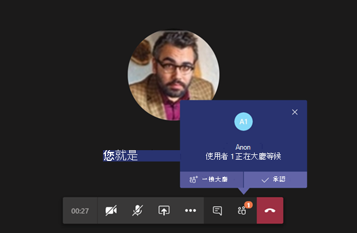

# 會議原則設定 - 參與者與來賓Meeting policy settings - Participants & guests

這些設定可控制哪些會議參與者在獲准加入會議之前在大廳等候，以及允許他們在會議中允許的參與層級。These settings control which meeting participants wait in the lobby before they are admitted to the meeting and the level of participation they are allowed in a meeting.

- [讓匿名人員開始會議Let anonymous people start a meeting](#let-anonymous-people-start-a-meeting)
- [自動准許人員Automatically admit people](#automatically-admit-people)
- [允許撥入使用者無需先在大廳等候Allow dial-in users to bypass the lobby](#allow-dial-in-users-to-bypass-the-lobby)
- [啟用即時輔助字幕Enable live captions](#enable-live-captions)
- [允許在會議中聊天Allow chat in meetings](#allow-chat-in-meetings)

> [!NOTE]
>加入會議的選項會因每個 Teams 群組的設定和連線方法而有所不同。Options to join a meeting will vary, depending on the settings for each Teams group, and the connection method. 如果您的群組有音訊會議，並且使用它來連線，請參閱[音訊會議](https://docs.microsoft.com/microsoftteams/audio-conferencing-in-office-365)。If your group has audio conferencing, and uses it to connect, see [Audio Conferencing](https://docs.microsoft.com/microsoftteams/audio-conferencing-in-office-365). 如果您的 Teams 群組沒有音訊會議，請參閱[在 Teams 中加入會議](https://support.office.com/article/join-a-meeting-in-teams-1613bb53-f3fa-431e-85a9-d6a91e3468c9)。If your Teams group doesn't have audio conferencing, refer to [Join a meeting in Teams](https://support.office.com/article/join-a-meeting-in-teams-1613bb53-f3fa-431e-85a9-d6a91e3468c9).

## 讓匿名人員開始會議Let anonymous people start a meeting

此設定是每個召集人的策略，可讓無主席電話撥入式會議。This setting is a per-organizer policy that allows for leaderless dial-in conferencing meetings. 此設定可控制撥入使用者是否可以加入會議，而組織沒有經過驗證的使用者出席。This setting controls whether dial-in users can join the meeting without an authenticated user from the organization in attendance. 根據預設，此設定會關閉，這表示撥入使用者會等候在大廳中，直到組織經過驗證的使用者加入會議。By default, this setting is turned off, which means dial-in users will wait in the lobby until an authenticated user from the organization joins the meeting.

> [!NOTE]
> 如果這項設定已關閉，且撥入使用者會先加入會議，並置於大廳中，組織使用者必須使用 Teams 用戶端加入會議，以從大廳准許使用者加入會議。If this setting is turned off and a dial-in user joins the meeting first and is placed in the lobby, an organization user must join the meeting with a Teams client to admit the user from the lobby. 撥入的使用者沒有可用的大廳控制項。There are no lobby controls available for dialed in users.

## 自動准許人員Automatically admit people

這是每一召集人原則。This is a per-organizer policy. 此設定可控制人員是直接加入會議，還是在大廳中等候，直到由已驗證的使用者准許其加入會議為止。This setting controls whether people join a meeting directly or wait in the lobby until they are admitted by an authenticated user. 此設定不適用撥入使用者。This setting does not apply to dial-in users.

 會議召集人可以按一下 **會議** 邀請中的 [會議選項>，針對他們排定的每一個會議變更此設定。Meeting organizers can click **Meeting Options** in the meeting invitation to change this setting for each meeting they schedule.

> [!NOTE]
> 在會議選項中，設定會標示為「誰無需先在大廳等候」。如果您變更任何使用者的預設設定，它將會套用至該使用者召集的所有新會議，以及使用者未修改會議選項的任何先前會議。In the meeting options the setting is labeled "Who can bypass the lobby". If you change the default setting for any user, it will apply to all new meetings organized by that user and any prior meetings where the user didn't modify Meeting options.
  
|設定值Setting value  |加入行為Join behavior |
|---------|---------|
|**每個人****Everyone**   |所有會議參與者會直接加入會議，而不需在大廳等候。All meeting participants join the meeting directly without waiting in the lobby. 這包括已驗證的使用者、來自信任組織 (同盟) 的外部使用者、來賓和匿名使用者。This includes authenticated users, external users from trusted organizations (federated), guests, and anonymous users.     |
|**組織中的人員和來賓****People in my organization and guests**     |組織中經過驗證的使用者 ，包括來賓使用者，可以直接加入會議，而不需要在大廳等候。Authenticated users within the organization, including guest users, join the meeting directly without waiting in the lobby.  匿名使用者在大廳中等候。Anonymous users wait in the lobby.   |
|**組織中的人員、信任的組織和來賓****People in my organization, trusted organizations, and guests**     |組織內已驗證的使用者 (包括來賓使用者和來自信任組織的使用者) 可直接加入會議，而不需在大廳等候。Authenticated users within the organization, including guest users and the users from trusted organizations, join the meeting directly without waiting in the lobby.  匿名使用者在大廳中等候。Anonymous users wait in the lobby.   |
|**我組織中所有人****Everyone in my organization**    |來自組織內已驗證的使用者 (包括來賓使用者) 會直接加入會議，而不需在大廳等候。Authenticated users from within the organization, including guest users, join the meeting directly without waiting in the lobby.  來自信任組織的使用者和匿名使用者會在大廳等候。Users from trusted organizations and anonymous users wait in the lobby. 這是預設設定。This is the default setting.           |
|**僅限召集人****Organizer only**    |只有會議召集人可直接加入會議，而不需在大廳等候。Only meeting organizers can join the meeting directly without waiting in the lobby. 其他人，包括組織中經過驗證的使用者、來賓使用者、信任組織的使用者，以及匿名使用者，都必須在大廳等候。Everyone else, including authenticated users within the organization, guest users, users from trusted organizations, and anonymous users must wait in the lobby.           |
|**僅受邀使用者****Invited users only**    |只有受邀的使用者和會議召集人可以直接加入會議，而不必在大廳等候。Only invited users and meeting organizers can join the meeting directly without waiting in the lobby. 其他人，包括組織中經過驗證的使用者、來賓使用者、信任組織的使用者，以及匿名使用者，都必須在大廳等候。Everyone else, including authenticated users within the organization, guest users, users from trusted organizations, and anonymous users must wait in the lobby.           |

## 允許撥入使用者無需先在大廳等候Allow dial-in users to bypass the lobby

這是每一召集人原則。This is a per-organizer policy. 此設定可控制透過電話撥入的人員是否直接加入會議，或是在大廳中等候，而不論 [自動准許人員 **]** 的設定為何。This setting controls whether people who dial in by phone join the meeting directly or wait in the lobby regardless of the **Automatically admit people** setting. 此設定預設會關閉。By default, this setting is turned off. 關閉此設定時，撥入使用者將在大廳中等候，直到組織使用者使用 Teams 用戶端加入會議並准許他們加入為止。When this setting is turned off, dial-in users will wait in the lobby until an organization user joins the meeting with a Teams client and admits them. 開啟此設定時，撥入使用者會在組織使用者加入會議時自動加入會議。When this setting is turned on, dial-in users will automatically join the meeting when an organization user joins the meeting.

> [!NOTE]
> 如果撥入使用者在組織使用者加入會議之前加入會議，他們將會停留在大廳，直到組織使用者使用 Teams 用戶端加入會議並准許他們加入會議為止。If a dial-in user joins a meeting before an organization user joins the meeting, they will be placed in the lobby until an organization user joins the meeting using a Teams client and admits them. 如果您變更任何使用者的預設設定，它將會套用至該使用者召集的所有新會議，以及使用者未修改會議選項的任何先前會議。If you change the default setting for any user, it will apply to all new meetings organized by that user and any prior meetings where the user didn't modify Meeting options.

## 啟用即時輔助字幕Enable live captions

此設定是每個使用者原則，並適用于會議期間。This setting is a per-user policy and applies during a meeting. 此設定可控制使用者是否可使用 [開啟即時輔助字幕 **]** 選項，以在使用者出席的會議中開啟和關閉即時輔助字幕。This setting controls whether the **Turn on live captions** option is available for the user to turn on and turn off live captions in meetings that the user attends.  

|設定值Setting value |行為Behavior  |
|---------|---------|
|**已停用，但使用者可以覆寫****Disabled but the user can override**     | 在會議期間不會自動為使用者開啟即時輔助字幕。Live captions aren't automatically turned on for the user during a meeting. 使用者會在溢位 **(...)** 功能表中看到 [開啟即時輔助字幕 **]** 選項，以將其開啟。The user sees the **Turn on live captions** option in the overflow (**...**) menu to turn them on. 這是預設設定。This is the default setting. |
|**已停用****Disabled**     | 在會議期間會為使用者停用即時輔助字幕。Live captions are disabled for the user during a meeting. 使用者沒有開啟它們的選項。The user doesn't have the option to turn them on.          |

## 允許在會議中聊天Allow chat in meetings

此設定是每個參與者的設定。This setting is a per-participant setting. 此設定可控制是否在使用者的會議中允許會議聊天。This setting controls whether meeting chat is allowed in the user's meeting.

## 相關主題Related topics

- [Teams PowerShell 概觀Teams PowerShell overview](teams-powershell-overview.md)
- [將原則指派給 Teams 中的使用者Assign policies to your users in Teams](assign-policies.md)
- [從使用者移除 RestrictedAnonymousAccess Teams 會議原則Remove the RestrictedAnonymousAccess Teams meeting policy from users](meeting-policies-restricted-anonymous-access.md)
