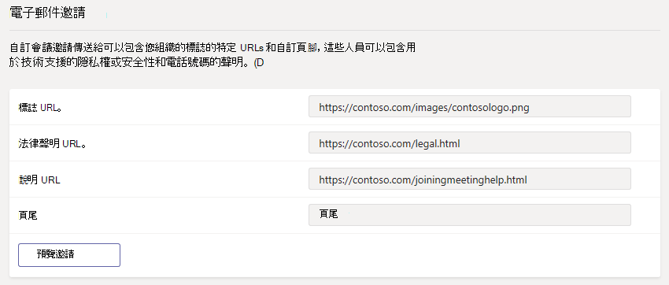

# 在 Microsoft 團隊中管理會議設定

在管理員中，您可以使用 [團隊會議] 設定來控制匿名使用者是否可以加入團隊會議、自訂會議邀請，以及如果您想要啟用服務品質（QoS），請設定即時流量的埠範圍。 這些設定適用于使用者在貴組織中排程的所有小組會議。 您可以在 Microsoft 團隊系統管理中心中管理**會議** > **會議設定**中的這些設定。

## 允許匿名使用者加入會議

透過匿名加入，任何人都可以按一下會議邀請中的連結，以匿名使用者身分加入會議。

 **使用 microsoft [團隊管理中心**] 顯示 Microsoft 團隊標誌的圖示

1. 在左側導覽中，移至 [**會議** > **會議設定**]。
2. 開啟 [**參與者**] 底下的 [**匿名使用者可以加入會議**]。

    

如果您不希望匿名使用者加入您組織中的使用者排程的會議，請關閉此設定。

## 自訂會議邀請

您可以自訂小組會議邀請，以符合貴組織的需求。 您可以新增貴組織的標誌，並包含有用的資訊，例如支援網站的連結和法律免責聲明，以及純文字的頁尾。

### 建立會議邀請標誌的秘訣  

1. 建立寬度188不超過30圖元的影像（相當小）。
2. 將影像儲存為 JPG 或 PNG 格式。
3. 將影像儲存在您組織中的每個人都可以存取的中央位置，例如網路共用。

    現在，您可以將它新增到會議邀請。 請參閱後續步驟。

### 自訂會議邀請

 **使用 microsoft [團隊管理中心**] 顯示 Microsoft 團隊標誌的圖示

1. 在左側導覽中，移至 [**會議** > **會議設定**]。
2. 在 [**電子郵件邀請**] 底下，執行下列動作：

    

    - **標誌 URL**輸入您的標誌儲存位置的 URL。
    - **合法 URL**如果您的組織有您希望其他人出於任何法律考慮的法律網站，請在這裡輸入 URL。
    - 說明**URL**如果您的組織有您希望其他人在遇到問題時要移至的支援網站，請在這裡輸入 URL。
    - **** 頁尾輸入要納入頁尾的文字。
3. 等候一小時或如此，以傳播所做的變更。 然後排程小組會議，看看會議邀請看起來的樣子。  

## 設定您想要處理團隊會議即時媒體流量的方式

如果您使用的是服務品質[（QoS）](qos-in-teams.md)來設定網路流量的優先順序，您可以啟用 QoS 標記，而且您可以為每種媒體流量設定埠範圍。 設定不同流量類型的埠範圍只是處理即時媒體的一個步驟;如需更多詳細資訊，請參閱[小組中的服務品質（QoS）](qos-in-teams.md) 。

> [!IMPORTANT]
> 如果您在 microsoft 團隊服務的 Microsoft 團隊系統管理中心啟用 [QoS] 或 [變更設定]，您也必須將 [相符的設定] 套用[至所有的使用者裝置](QoS-in-Teams-clients.md)和所有內部網路裝置，才能完全實現團隊中的 QoS 變更。

  **使用 microsoft [團隊管理中心**] 顯示 Microsoft 團隊標誌的圖示

1. 在左側導覽中，移至 [**會議** > **會議設定**]。
2. 在 [**網路**] 底下，執行下列動作：

    

    - 若要允許將 DSCP 標記用於 QoS，請開啟**即時媒體流量的 [插入服務品質（QoS）] 標記**。 您只能選擇是否要使用標記;您無法針對每種流量類型設定自訂標記。 如需 DSCP 標記的詳細資訊，請參閱[選取 QoS 實現方法](QoS-in-Teams.md#select-a-qos-implementation-method)。
    > [!NOTE] 
    > 開啟**即時媒體流量的 [插入服務品質（QoS）] 標記**，也可讓您使用 UDP 埠3479（音訊）、3480（影片）和3481（共用）與傳輸中繼進行通訊。
    - 若要指定埠範圍，請在 [**選取即時媒體流量的每個類型的埠範圍**] 旁，選取 [**指定埠範圍**]，然後輸入音訊、影片和螢幕共用的起始和結束埠。 需要選取此選項才能實現 QoS。
    > [!IMPORTANT]
    > 如果您選取 [**自動使用任何可用的埠**]，則會使用1024和65535之間的可用埠。 只有在未實現 QoS 時才使用這個選項。
    >
    > 選取太窄的埠範圍，將會導致呼叫中斷和通話品質不佳。 下列建議最小。

如果您不確定要在您的環境中使用的埠範圍，下列設定就是良好的起點。 若要深入瞭解，請參閱[在 Microsoft 團隊中實施服務品質（QoS）](QoS-in-Teams.md)。 這些是所需的 DSCP 標記，以及團隊和 ExpressRoute 所使用的建議對應媒體埠範圍。

_埠範圍和 DSCP 標記_

媒體流量類型| 用戶端來源埠範圍\* |通訊協定|DSCP 值|DSCP 類別|
|:---             |:---                         |:---    |:---      |:---      |
|音訊            | 50000–50019               |TCP/UDP |46        |加急轉移（EF）|
|顯示器            | 50,020–50,039               |TCP/UDP |34        |有保證的轉寄（AF41）|
|應用程式/螢幕共用| 50,040–50,059      |TCP/UDP |滿        |有保證的轉寄（AF21）|
| | | | |

\*您指定的埠範圍不能重疊，且必須彼此相鄰。

當 QoS 已用於一段時間之後，您就會在每個這三個工作負載的需求上取得使用量資訊，而且您可以根據自己的特定需求，選擇要進行的變更。 [通話品質儀表板](turning-on-and-using-call-quality-dashboard.md)將會對您有所説明。
