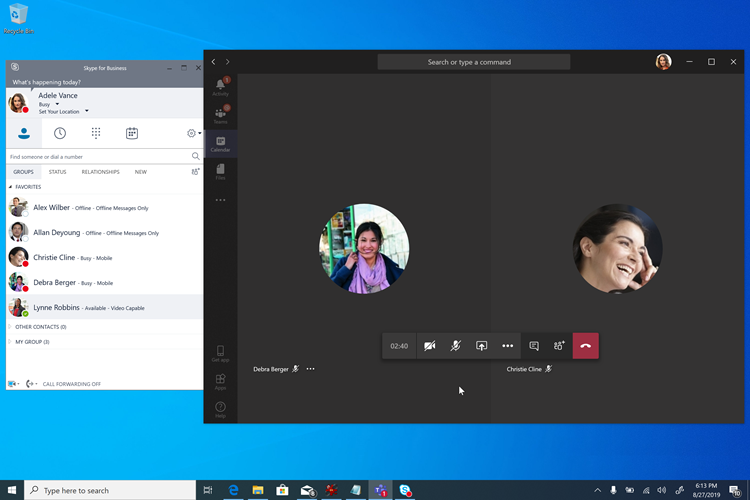
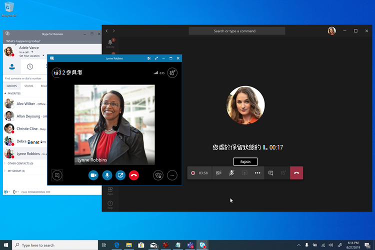

# 會議優先

「會議第一」是針對內部商務用 Skype Server組織企業語音，並針對想要儘快開始使用Teams會議的組織而優化。 對於這類組織，會議優先是使用 **島嶼** 模式的替代方式，可優先Teams會議體驗。

## 什麼是會議第一個？

會議第一個是以 **SfBWithTeamsCollabAndMeetings** 共存模式為基礎。 會議第一步不是產品或功能，而是使用 Teams 和 商務用 Skype 功能來提供獨一無二的共存體驗的組組。

在會議第一個中，使用者Teams會議，商務用 Skype聊天、通話和目前狀態。 兩者之間的模式沒有重迭Teams商務用 Skype。 聊天、通話和目前狀態在 商務用 Skype 中會Teams。 這可在 商務用 Skype 和 Teams 之間啟用獨特的「共同Teams案例，以增強使用者在共存期間的體驗，以及僅與 Teams 使用者的互通性 **案例**。

> [!Important]
> 會議第一個比對沒有或幾個作用中聊天使用者Teams相符。 使用Teams聊天使用者不應切換到會議第一模式，因為他們會失去在 Teams 聊天和存取其聊天記錄的能力。 這些使用者應該改為以 **群島** 模式進行，而會議第一次只授予尚未在群島中聊天Teams。

## 神秘先考慮會議嗎？

會議第一次是專為想要加速移至 Teams 會議的 商務用 Skype Server 組織所設計企業語音，尤其是想要使用受管理、決定式升級路徑Teams。

對於複雜或大型組織，語音移移通常是以網站為基礎進行，而且可能需要很長的時間，可能花上數年的時間，導致延長共存案例。 如果該共存是在 **群島** 模式中，使用者一定會選擇兩種會議解決方案， (商務用 Skype Teams) ，這可能會導致混淆或不最佳的情況。 與語音移移不同的是，會議移移一般可以在很短的時間內完成整個公司。 想要儘快完全切換到會議Teams且不需要等待語音移轉完成 (組織應考慮先) 會議。

會議第一步對於沒有使用者或企業語音很有用。 只有這些組織能夠採用Teams，才能升級至 Teams會議。 他們應該考慮先略過會議。

此外，「會議第一」對於其範圍為純播放會議解決方案的組織而言，例如發行「僅會議」RFP 時，會很有用。

## 會議第一個功能

會議第一次將下列功能彙集在一起：

- [在內部商務用 Skype Server (內部部署) 音訊會議](./tutorial-audio-conferencing.yml?tutorial-step=3)Teams[使用者](tutorial-audio-conferencing.yml)。
- [會議移轉服務](/skypeforbusiness/audio-conferencing-in-office-365/setting-up-the-meeting-migration-service-mms)：使用者組織的會議會移轉至雲端，並轉換成 Teams 會議，因為使用者升級為會議第一 (需要Exchange Online) 。
- 精簡的 Teams，以 Teams 會議、團隊和頻道為中心 (可以選擇使用應用程式權限原則來隱藏) ; [Teams聊天](teams-client-experience-and-conformance-to-coexistence-modes.md)、通話和自我目前狀態不會在會議第一次中公開，因此部署和採用工作可以完全專注于會議。
- 出色的[Teams會議體驗](tutorial-meetings-in-teams.yml)。
- 兩者之間的「共同Teams 商務用 Skype」：： 
  - 自動保留：在 Teams中開會時，商務用 Skype來電會Teams保留會議，反之亦然。 這可防止使用者被會議參與者聽到他們的私人通話。
    
  - 目前狀態對帳：Teams中的活動會反映在使用者的目前狀態中，商務用 Skype聊天和通話是在商務用 Skype。 具體來說，當會議第一位使用者Teams會議時，其目前狀態將會更新以反映這一點。 當他們展示畫面時，其目前狀態將會更新， (畫面中的設定顯示請勿打擾商務用 Skype) 。
  - USB 裝置 HID 控制項對帳 (Mac) ：在 Teams 會議中，以及所有其他情況下，TEAMS 會商務用 Skype HID 控制項。
  - 除非另有提及，否則更好的共同功能目前Windows桌面用戶端。

## 會議第一個先決條件

會議第一次的唯一硬性需求與使用內部部署 Active Directory Teams內部部署商務用 Skype需求相同：

- [一般Teams](upgrade-plan-journey-prerequisites.md)先決條件，包括
- [中的身分識別與Teams](identify-models-authentication.md)
- [設定 Azure Active Directory 和 Teams 商務用 Skype。](/skypeforbusiness/hybrid/configure-azure-ad-connect)

不需要[商務用 Skype](/skypeforbusiness/hybrid/configure-federation-with-skype-for-business-online)混合式拓撲，但建議使用。 某些功能 ，例如會議移移服務和互通性，仰賴該拓撲。

會議第一版支援任何版本商務用 Skype Server (已知可與不再支援的 Lync Server) 。 它支援任何支援的用戶端商務用 Skype，不過更好的共同功能需要最近的用戶端。

一旦符合這些 (而非) ，使用者就可以獲得授權，Microsoft 365或[Office 365 Teams。](/office365/enterprise/assign-licenses-to-user-accounts)

為了獲得最佳會議第一次體驗，使用者應啟用[Exchange Online、SharePoint](exchange-teams-interact.md) [Online 和](sharepoint-onedrive-interact.md)商務用 OneDrive，Microsoft 365群組建立。 對於信箱位於內部部署Exchange，或沒有 SharePoint Online 或 OneDrive 商務用，或群組Microsoft 365支援會議。 不過，他們的體驗會不太完整。 特別是，對於使用 Exchange Server 內部部署的組織， (視 Exchange Server) 版本不同，從 Teams 用戶端建立和檢視會議，以及合規性功能可能有一些限制。

使用者至少必須獲得[授權，Teams。](/microsoft-365/admin/manage/assign-licenses-to-users) 此外，如有必要，他們可以獲得音訊 [會議](set-up-audio-conferencing-in-teams.md)授權。

我們建議您在授權使用者時，將 [**SfBOnly** 或 **SfBWithTeamsCollab**](/powershell/module/skype/grant-csteamsupgradepolicy?view=skype-ps)模式作為租使用者預設模式。 這可確保在準備好啟動會議Teams，使用者不會在預設 **群島** 模式中自行開始使用會議。

會議第一個支援在完整桌面用戶端 (Windows Mac) 瀏覽器用戶端上，以及行動用戶端上。 它也與 Microsoft Teams 會議室[相容](/microsoftteams/room-systems/)。 "共同改善」需要完整的桌面用戶端。

## 在會議Teams中準備會議

若要讓使用者在會議中獲得最佳Teams，您應該：

- 請特別按照會議[與會議](deploy-meetings-microsoft-teams-landing-page.md)中的Microsoft Teams進行。
- [評估您的環境](3-envision-evaluate-my-environment.md)。
- [準備貴組織的網路以Microsoft Teams。](prepare-network.md)
- 使用Teams會議室裝置和解決方案升級您的會議室，或使用[Microsoft Teams](cloud-video-interop.md)版雲端視像交互操作功能，讓現有的協力廠商會議室和裝置Teams會議。
- 為您的使用者配備 [經過認證的 USB 音訊和視音訊裝置](/skypeforbusiness/certification/devices-usb-devices?bc=%2fmicrosoftteams%2fbreadcrumb%2ftoc.json&toc=%2fMicrosoftTeams%2ftoc.json)。
- 準備[提高會議Teams採用。](adopt-microsoft-teams-landing-page.md)
- [規劃您的服務管理](4-envision-plan-my-service-management.md)。
- 熟悉豐富的通話分析報告，以 [疑難排解通話品質不佳的問題](use-call-analytics-to-troubleshoot-poor-call-quality.md)。

您可以在此階段考慮進行適量量生產準備試驗。

## 先設定會議使用者

一旦授權使用者並準備好組織Teams，現在該是讓使用者先開會的時間。 我們已輕鬆操作：單一設定可以全部執行！

會議第一中的所有功能和使用者體驗 ，包括 Teams 用戶端組組和使用者體驗的自動一致性、會議移移服務，以及更好的一起功能，都是以在[Microsoft Teams](manage-teams-in-modern-portal.md)系統管理中心或[PowerShell](/powershell/module/skype/grant-csteamsupgradepolicy?view=skype-ps)中授予使用者 (或租使用者預設) 來加以配置。

或者，若要將 Teams 和 Channels 應用程式從使用者 Teams 用戶端的左側流覽中隱藏，以進一步將經驗專注在會議上，可以使用應用程式設定策略來達成此[目的](teams-app-setup-policies.md)。

## 報告和通話分析

會議第一Teams中的報表和通話分析與其他模式不同。

## 相關連結

在閱讀本文之後，您可能會想要參閱選擇升級歷程、移移和互通性指南，以及與 商務用 Skype共存以進[一](coexistence-chat-calls-presence.md)步詳細資料。
