# Microsoft 團隊通話流程Microsoft Teams call flows

> [!Tip]
> 請觀看下列會話，瞭解團隊如何利用您的網路，以及如何規劃最佳的網路連線：[團隊網路規劃](https://aka.ms/teams-networking)Watch the following session to learn how Teams leverages your network and how to plan for optimal network connectivity: [Teams Network Planning](https://aka.ms/teams-networking)

## 概觀Overview
本文將說明團隊如何在各種不同拓撲中使用 Office 365 通話流程。This article describes how Teams uses Office 365 call flows in various topologies. 此外，它還描述用於對等媒體通訊的獨特團隊流程。In addition, it describes unique Teams flows that are used for peer-to-peer media communication. 檔會說明這些流程、其用途，以及其在網路上的來源和終止。The document describes these flows, their purpose, and their origin and termination on the network. 針對本文的用途，請假設下列事項：For purposes of this article, assume the following:

- 內部部署的 Office 365 用戶端會使用流程 X 與雲端中的 Office 365 服務進行通訊。Flow X is used by the on-premises Office 365 client to communicate with the Office 365 service in the cloud. 它是從客戶網路產生，並終止為 Office 365 中的端點。It originates from the customer network, and it terminates as an endpoint in Office 365.

- 內部部署 Office 365 用戶端使用流程 Y 來與 Office 365 所依賴的網際網路上的服務進行通訊。Flow Y is used by the on-premises Office 365 client to communicate with a service on the Internet that Office 365 has a dependency on. 它源于客戶網路，並終止為網際網路上的端點。It originates from the customer network, and it terminates as an endpoint on the Internet.

本文包含下列各節：The article contains the following sections:

- **背景**-提供背景資訊，例如 Office 365 流程可能流經的網路、流量類型、從客戶網路到 Office 365 服務端點的連線指示、與協力廠商元件的互通性，以及團隊用來選取媒體流程的原則。**Background** - Provides background information, such as networks that Office 365 flows may traverse, type of traffic, connectivity guidance from the customer network to Office 365 service endpoints, interoperability with third-party components, and principles that are used by Teams to select media flows.

- **不同拓撲中的通話流程**-說明各種拓撲中通話流程的使用方式。**Call flows in various topologies** - Illustrates the use of call flows in various topologies. 針對每個拓朴，此區段會列舉所有受支援的資料流程，並說明如何透過幾種使用案例使用這些流程。For each topology, the section enumerates all supported flows and illustrates how these flows are used via several use cases. 針對每個使用案例，它會透過流程圖來描述資料流程的順序與選取。For each use case, it describes the sequence and selection of flows via a flow diagram. 

- **具有快速路由優化的小組**-說明在部署快速路由以進行優化時，這些流程的使用方式，以簡單拓撲說明。**Teams with Express Route optimization** - Describes how these flows are used when Express Route is deployed for optimization, illustrated via a simple topology.

## 背景Background
### 網段Network segments
**客戶網路**：這是您控制和管理的網路區段。**Customer network**: This is the network segment that you control and manage. 這包括客戶辦公室內的所有客戶連線（無論是有線或無線）、office 建築物之間、內部部署資料中心，以及您連線至網際網路供應商、快速路由或任何其他私人對等。This includes all customer connections within customer offices, whether wired or wireless, between office buildings, to on-premises datacenters, and your connections to Internet providers, Express Route, or any other private peering. 

通常，客戶網路有數個網路週邊，且有多個防火牆和/或 proxy 伺服器，會強制執行您組織的安全性原則，而且只允許您已設定和設定的特定網路流量。Typically, a customer network has several network perimeters with firewalls and/or proxy servers, which enforce your organization's security policies, and that only allow certain network traffic that you have set up and configured. 因為您要管理此網路，所以您可以直接控制網路的效能，而且強烈建議您完成網路評量，以驗證您網路中的網站與 Office 365 網路中的網站的效能。Because you manage this network, you have direct control over the performance of the network, and it is highly recommended that you complete network assessments to validate performance both within sites in your network and from your network to the Office 365 network. 

**網際網路**：這是整個網路的一部分，該網路區段將由從客戶網路外部連線至 Office 365 的使用者所使用。**Internet**: This is the network segment that is part of your overall network that will be used by users who are connecting to Office 365 from outside of the customer network. 從客戶網路到 Office 365 的某些流量也會使用它。It is also used by some traffic from the customer network to Office 365. 

已**訪問/來賓私人網路**：這是客戶網路外部的網路區段，但不在公用網際網路中，您的使用者和/或其客人可能會造訪。**Visited/Guest private network**: This is the network segment outside your customer network, but not in the public Internet, that your users and/or their guests may visit. 例如，「家用私人網路」或「企業私人網路」，它不會部署小組，您的使用者和/或其客戶與團隊服務可以駐留在其中。For example, home private network or an Enterprise private network, that does not deploy Teams, where your users and/or their customers that interact with Teams services may reside.

>**注意**：與 Office 365 的連線也適用于這些網路。**Note**: Connectivity to Office 365 is also applicable to these networks.

**Office 365**：這是支援 Office 365 服務的網路區段。**Office 365**: This is the network segment that supports Office 365 services. 它在全球各地分佈，且最接近客戶網路在大部分位置的邊緣。It is distributed worldwide with edges in proximity to the customer network in most locations. 本檔中提到的函數包括傳輸中繼、會議服務器和媒體處理器。Functions mentioned in this document include Transport Relay, conferencing server, and Media Processor. 

**快速路線（選用）**：這是整個網路的一部分，可為您提供 Office 365 網路的專用專用連線。**Express Route (optional)**: This is the network segment that is part of your overall network that will give you a dedicated, private connection to the Office 365 network.

### 流量類型Types of traffic

**即時媒體**：在 RTP （即時傳輸通訊協定）中封裝的資料，支援音訊、影片和螢幕共用工作負載。**Real-time media**: Data encapsulated within RTP (Real-time Transport Protocol) that supports audio, video and screen sharing workloads. 一般來說，媒體流量會有很高的延遲，因此您可能會希望此流量盡可能地採用最直接路徑，並將 UDP 與 TCP 做為傳輸層通訊協定，這是從品質觀點開始互動即時媒體的最佳傳輸.In general, media traffic is highly latency sensitive, so you would want this traffic to take the most direct path possible, and to use UDP versus TCP as the transport layer protocol, which is the best transport for interactive real time media from a quality perspective. （注意：作為最後一個手段，媒體可以在 HTTP 通訊協定中使用 TCP/IP，也可在 HTTP 通訊協定內進行隧道作業，但由於不良品質的影響，不建議您這麼做。）RTP 流程是透過 SRTP 加以保護，其中只有負載是經過加密的。(Note: As a last resort, media can use TCP/IP and also be tunneled within the HTTP protocol, but it is not recommended due to bad quality implications.) RTP flow is secured via SRTP, in which only the payload is encrypted.

[**通知**]：用戶端與伺服器之間的通訊連結，或用來控制活動的其他用戶端（例如，啟動通話時），並傳送立即訊息。**Signaling**: The communication link between the client and server, or other clients that are used to control activities (for example, when a call is initiated), and deliver instant messages. 大多數的信號流量都使用 HTTPS 式的 REST 介面，但在某些情況下（例如，Office 365 與會話邊界控制器之間的連線），它會使用 SIP 通訊協定。Most signaling traffic uses the HTTPS-based REST interfaces, though in some scenarios (for example, connection between Office 365 and a Session Border Controller) it uses SIP protocol. 請務必瞭解，這項流量對延遲而言不太敏感，但如果端點之間的延遲時間超過數秒，可能會導致服務中斷或呼叫超時。It's important to understand that this traffic is much less sensitive to latency but may cause service outages or call timeouts if latency between the endpoints exceeds several seconds. 

### Office 365 的連線能力Connectivity to Office 365

小組需要[連線至網際網路](https://support.office.com/article/connectivity-to-the-internet-64b420ef-0218-48f6-8a34-74bb27633b10)。Teams requires [connectivity to the Internet](https://support.office.com/article/connectivity-to-the-internet-64b420ef-0218-48f6-8a34-74bb27633b10). 團隊端點 Url 和 IP 位址範圍會列在[Office 365 url 和 ip 位址範圍](https://docs.microsoft.com/office365/enterprise/urls-and-ip-address-ranges)中。Teams endpoint URLs and IP address ranges are listed in [Office 365 URLs and IP address ranges](https://docs.microsoft.com/office365/enterprise/urls-and-ip-address-ranges). （注意：請開啟與 TCP 埠80和443的連線，並需要 UDP 埠3478到3481。）此外，小組也會對商務用 Skype Online 產生相依性的相依性，這也必須連線到網際網路。(Note: Open connectivity to TCP ports 80 and 443, and to UDP ports 3478 through 3481 is required.) Furthermore, Teams has a dependency on Skype for Business Online, which must also be connected to the Internet.

團隊媒體流程連線是透過標準的 IETF ICE （互動式連接建立）程式來實現。Teams media flows connectivity is implemented via standard IETF ICE (Interactive Connectivity Establishment) procedures.

### 互通性限制Interoperability restrictions
**協力廠商媒體繼電器**：團隊媒體流程（也就是，其中一個媒體端點是團隊）可能只會遍歷團隊或商務用 Skype 原生媒體轉送器。**Third party media relays**: A Teams media flow (that is, one of the media endpoints is Teams) may traverse only Teams or Skype for Business native media relays. 不支援與協力廠商媒體轉接的互通性。Interoperability with a third party media relay is not supported. （注意： PSTN 上的協力廠商 SBC 必須結束 RTP/RTCP 串流，並透過 SRTP 加以保護，而不會將其轉接至下一個躍點）。(Note: A third party SBC on the boundary with PSTN must terminate RTP/RTCP stream, secured via SRTP, and not relay it to the next hop.)

**協力廠商 SIP proxy 伺服器**：具有協力廠商 SBC 和/或閘道的 [使用 SIP 通知 SIP] 對話方塊，可能會遍歷小組或商務用 Skype 原生 SIP proxy。**Third party SIP proxy servers**: A Teams signaling SIP dialog with a third party SBC and/or gateway may traverse Teams or Skype for Business native SIP proxies. 不支援與協力廠商 SIP proxy 的互通性。Interoperability with a third party SIP proxy is not supported.

**協力廠商 B2BUA （也就是 SBC）**：來自/到 PSTN 的團隊媒體流程是由協力廠商 SBC 終止。**Third party B2BUA (that is, SBC)**: A Teams media flow from/to the PSTN is terminated by a third party SBC. 不過，不支援在小組網路中與協力廠商 SBC （也就是協力廠商 SBC 調節兩個小組/商務用 Skype 端點）的互通性。However, interoperability with a third party SBC within the Teams network (that is, a third party SBC mediates two Teams/Skype for Business endpoints) is not supported.

### Microsoft 團隊不建議的技術Technologies that are not recommended with Microsoft Teams

**VPN 網路**：不建議媒體流量（即，流程2」）。**VPN network**: It is not recommended for media traffic (that is, flow 2'). VPN 用戶端應該使用分割式 VPN，並路由媒體流量，就像在中指定的https://blogs.technet.microsoft.com/nexthop/2011/11/14/enabling-lync-media-to-bypass-a-vpn-tunnel/任何外部非 VPN 使用者。The VPN client should use split VPN and route media traffic like any external non-VPN user, as specified in https://blogs.technet.microsoft.com/nexthop/2011/11/14/enabling-lync-media-to-bypass-a-vpn-tunnel/.

>**注意**：雖然標題是 Lync，但也適用于團隊。**Note**: Although the title is Lync, it is applicable to Teams as well.

[**資料包 shapers**]：不建議任何類型的資料包 snippers、資料包檢查或資料包整形服務裝置，可能會顯著降低品質。**Packet shapers**: Any kind of packet snippers, packet inspection, or packet shaper devices are not recommended and may degrade quality significantly. 

### 理念Principles
有四個一般原則可協助您瞭解 Microsoft 團隊的通話流程：There are four general principles that help you understand call flows for Microsoft Teams:
 
1.  Microsoft 團隊會議是由 Office 365 託管于第一個參與者加入的同一個區域中。A Microsoft Teams conference is hosted by Office 365 in the same region where the first participant joined. （注意：如果這項規則在某些拓撲中會有例外狀況，則會在這份檔中說明，並以適當的通話流程來說明。）(Note: If there will be exceptions to this rule in some topologies, then they will be described in this document, and illustrated by an appropriate call flow.)

2.  Office 365 中的團隊媒體端點是根據媒體處理需求使用，而不是以通話類型為基礎。A Teams media endpoint in Office 365 is used based on media processing needs and not based on call type. （例如，點對點通話可能會使用雲端中的媒體端點來處理操作媒體及/或錄製，而有兩個參與者的會議可能不會使用雲端中的任何媒體端點）。不過，大部分的會議將會使用媒體端點來進行混合和路由用途，並在託管會議的位置進行分派。(For example, a point-to-point call may use a media endpoint in the cloud to process media for transcription and/or recording, while a conference with two participants may not use any media endpoint in the cloud.) However, most conferences will use a media endpoint for mixing and routing purposes, allocated where the conference is hosted. 從用戶端傳送至媒體端點的媒體流量可能會直接路由，或在 Office 365 中使用傳輸中繼（如果由於客戶網路防火牆限制而需要）。The media traffic sent from a client to the media endpoint may be routed directly or use a Transport Relay in Office 365 if required due to customer network firewall restrictions. 

3.  對等通話的媒體流量會佔用最直接的路線，假設該通話不會要求雲端中的媒體端點（請參閱上述 #2）。Media traffic for peer-to-peer calls take the most direct route that is available, assuming that the call doesn't mandate a media endpoint in the cloud (see #2 above). 首選路由會直接連到遠端對等（用戶端），但如果該路由無法使用，則一或多個傳輸中繼將會中繼流量。The preferred route is direct to the remote peer (client), but if that route isn't available, then one or more Transport Relays will relay traffic. 建議媒體流量不應該橫向伺服器（例如資料包 shapers、VPN 伺服器等），因為這會影響媒體質量。It is recommended that media traffic shall not transverse servers such as packet shapers, VPN servers, and so on, since this will impact the media quality.

4.  信號流量永遠會移至最接近使用者的伺服器。Signaling traffic always goes to the closest server to the user. 

若要深入瞭解所選媒體路徑的詳細資訊，請參閱https://www.youtube.com/watch?v=1tmHMIlAQdo。To learn more about the details on the media path that is chosen, see https://www.youtube.com/watch?v=1tmHMIlAQdo.

## 不同拓撲中的通話流程Call flows in various topologies
### 團隊拓朴Teams topology
此拓朴是由客戶使用來自雲端的團隊服務，而不需要任何內部部署（例如商務用 Skype Server 或電話系統直式路由）。This topology is used by customers that leverage Teams services from the cloud without any on-premises deployment, such as Skype for Business Server or Phone System Direct Routing. 此外，Office 365 的介面是透過沒有 Azure Express 路由的網際網路完成。In addition, the interface to Office 365 is done via the Internet without Azure Express Route. 

[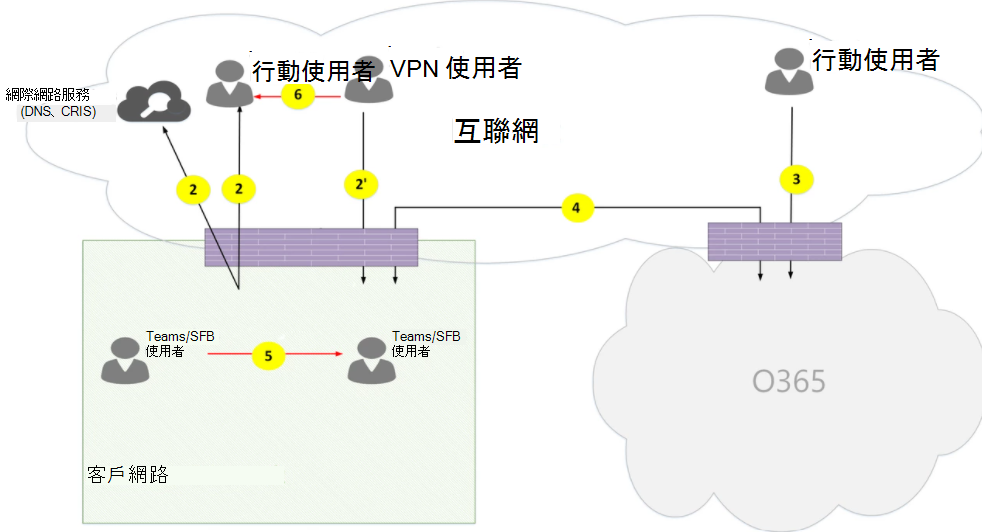](media/microsoft-teams-online-call-flows-figure01.png)

*圖 1-團隊拓朴**Figure 1 - Teams topology*

請注意：Note that:

- 上方圖表上的箭號方向反映了對企業週邊的連線所產生的溝通的起始方向。The direction of the arrows on the diagram above reflect the initiation direction of the communication that affects connectivity at the enterprise perimeters. 在 UDP 的 [媒體] 中，第一個資料包可能會以相反的方向流向，但在其他方向的資料包都可能會遭到封鎖，直到其他方向的資料包流動為止。In the case of UDP for media, the first packet(s) may flow in the reverse direction, but these packets may be blocked until packets in the other direction will flow.
- 團隊會與商務用 Skype Online 一起進行並排部署，因此用戶端會顯示為「團隊/SFB 使用者」。Teams is deployed side by side with Skype for Business Online, hence clients are displayed as "Teams/SFB user".

您可以在以下文章中找到有關下列選用拓撲的詳細資訊：You can find more information on the following optional topologies later in the article:

- 商務用 Skype 內部部署在**團隊混合式拓撲**中有說明。Skype for Business on-premises deployment is described in **Teams  hybrid topology**.
- [電話系統 Direct 路由（適用于 PSTN 連線）] 會在**具有直接路由拓撲的小組**中描述。Phone System Direct Routing (for PSTN connectivity) is described in **Teams with Direct Routing topology**.
- 在**具有快速路線優化的小組**中，會說明快速路線。Express Route is described in  **Teams with Express Route optimization**.

**流程描述**：**Flow descriptions**:
- [**流程 2** ]：代表使用者在使用者的小組體驗中，由客戶網路上的使用者在網際網路上所啟動的流程。**Flow 2** – Represents a flow initiated by a user on the customer network to the Internet as a part of the user's Teams experience. 這些流程的範例是 DNS 和對等媒體。Examples of these flows are DNS and peer-to-peer media.
- [**流程 2 "** –代表由遠端行動小組使用者所啟動的流程，其中包含 VPN 至客戶網路。**Flow 2'** – Represents a flow initiated by a remote mobile Teams user, with VPN to the customer network. 
- **流程 3** –代表由遠端行動小組使用者發起給 Office 365/團隊端點的流程。**Flow 3** – Represents a flow initiated by a remote mobile Teams user to Office 365/Teams endpoints. 
- [**流程 4** ]-代表使用者在客戶網路上由 Office 365/小組端點啟動的流程。**Flow 4** – Represents a flow initiated by a user on the customer network to Office 365/Teams endpoints.
- **流程 5** –代表團隊使用者與客戶網路中的其他小組或商務用 Skype 使用者之間的對等媒體流程。**Flow 5** – Represents a peer-to-peer media flow between a Teams user and another Teams or Skype for Business user within the customer network.
- **流程 6** –代表遠端行動小組使用者與其他遠端行動小組或網際網路上的商務用 Skype 使用者之間的對等媒體流程。**Flow 6** – Represents a peer-to-peer media flow between a remote mobile Teams user and another remote mobile Teams or Skype for Business user over the Internet.

#### 使用案例：一對一Use case: One-to-one
一對一通話使用常見的模型，在此模式中，呼叫者會透過 IP 位址/埠來取得一組候選人，包括本機、中繼及反身（用戶端的公用 IP 位址（由中繼）候選人來查看）。One-to-one calls use a common model in which the caller will obtain a set of candidates consisting of IP addresses/ports--including local, relay, and reflexive (public IP address of client as seen by the relay) candidates. 來電者會將這些候選人傳送給被叫方;呼叫的參與方也會獲得類似的候選人集合，並將其傳送給來電者。The caller sends these candidates to the called party; the called party also obtains a similar set of candidates and sends them to the caller. STUN 連線檢查訊息是用來找出哪些來電者/叫方媒體路徑正常運作，且選取了最佳的工作路徑。STUN connectivity check messages are used to find which caller/called party media paths work, and the best working path is selected. 然後使用選取的候選對，傳送媒體（也就是透過 SRTP 保護的 RTP/RTCP 資料包）。Media (that is, RTP/RTCP packets secured via SRTP) are then sent using the selected candidate pair. 傳輸中繼是作為 Office 365 的一部分來部署。The Transport relay is deployed as part of Office 365.

如果本機 IP 位址/埠候選或反身候選人都有連通性，則會選取用戶端（或透過 NAT）之間的直接路徑來供媒體使用。If the local IP address/port candidates or the reflexive candidates have connectivity, then the direct path between the clients (or via a NAT) will be selected for media. 如果用戶端都在客戶網路上，則應選取直接路徑。If the clients are both on the customer network, then the direct path should be selected. 這需要在客戶網路中直接進行 UDP 連線。This requires direct UDP connectivity within the customer network. 如果用戶端都是 nomadic 雲端使用者，則視 NAT/防火牆而定，媒體可能會使用直接連通性。If the clients are both nomadic cloud users, then depending on the NAT/firewall, media may use direct connectivity.

如果客戶網路上有一個用戶端，且有一個用戶端是外部用戶端（例如，行動雲端使用者），則無法直接連線到本機或反身候選作業。If one client is internal on the customer network and one client is external (for example, a mobile cloud user), then it is unlikely that direct connectivity between the local or reflexive candidates is working. 在此情況下，選項是使用其中一個用戶端的傳輸中繼站候選人（例如，內部用戶端從 Office 365 中的傳輸中繼取得中繼候選人）; 外部用戶端必須能夠傳送 STUN/RTP/RTCP 資料包至傳輸轉接）。In this case, an option is to use one of the Transport Relay candidates from either client (for example, the internal client obtained a relay candidate from the Transport relay in Office 365; the external client needs to be able to send STUN/RTP/RTCP packets to the transport relay). 另一個選項是內部用戶端傳送至行動雲端用戶端取得的中繼候選人。Another option is the internal client sends to the relay candidate obtained by the mobile cloud client. 請注意，雖然強烈建議媒體的 UDP 連線，但支援 TCP。Note that, although UDP connectivity for media is highly recommended, TCP is supported.

**高層次步驟**：**High-level steps**:
1. 團隊使用者 A 透過 flow2 解析 URL 網功能變數名稱稱（DNS）Teams User A resolves URL domain name (DNS) via flow2
2. 小組使用者 A 透過流程4在團隊傳輸中繼上分配媒體轉送埠Teams User A allocates a media Relay port on Teams Transport Relay via flow 4
3. 團隊使用者 A 透過流程4至 Office 365，透過 ICE 候選人傳送「邀請」Teams User A sends "invite" with ICE candidates via flow 4 to Office 365
4. Office 365 透過流程4將通知傳送給團隊使用者 BOffice 365 sends notification to Teams User B via flow 4
5. 團隊使用者 B 透過流程4在團隊傳輸中繼上分配媒體轉送埠Teams User B allocates a media Relay port on Teams Transport Relay via flow 4
6. 團隊使用者 B 透過流程4傳送由 ICE 候選人提供的「回答」，並透過流程4轉寄回小組使用者 ATeams User B sends "answer" with ICE candidates via flow 4, which is forwarded back to Teams User A via Flow 4
7. 小組使用者 A 與團隊使用者 B 呼叫 ICE 連線測試，並選取最佳可用媒體路徑（請參閱下圖以查看各種使用方式）Teams User A and Teams User B invoke ICE connectivity tests and the best available media path is selected (see diagrams below for various use cases)
8. 團隊使用者透過流程4傳送遙測至 Office 365Teams Users send telemetry to Office 365 via flow 4

**在客戶網路中：****Within customer network:**

[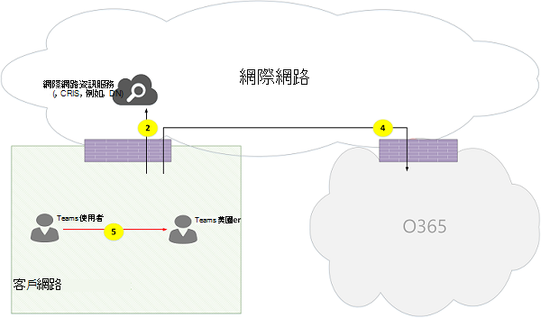](media/microsoft-teams-online-call-flows-figure02.png)

*圖 2-客戶網路內**Figure 2 - Within customer network*
 
在步驟7中，選取了對等媒體流程5。In step 7, peer-to-peer media flow 5 is selected.
 
媒體是雙向的。Media is bidirectional. [流程 5] 的方向代表 [一側] 會從連線的角度啟動通訊，且與本檔中的所有流程一致。The direction of flow 5 indicates that one side initiates the communication from a connectivity perspective, consistent with all the flows in this document. 在這種情況下，因為兩個端點都在客戶網路內，所以使用哪個方向是不重要的。In this case, it doesn't matter which direction is used because both endpoints are within the customer network.

**外部使用者的客戶網路（依小組傳輸轉接的媒體轉送）：****Customer network to external user (media relayed by Teams Transport Relay):**

*圖 3-外部使用者的客戶網路（依小組傳輸轉接的媒體轉送）**Figure 3 - Customer network to external user (media relayed by Teams Transport Relay)*
 
在步驟7、流程4中，從客戶網路到 Office 365，以及流程3（從遠端行動小組使用者到 Office 365）已選取。In step 7, flow 4, from customer network to Office 365, and flow 3, from remote mobile Teams user to Office 365, are selected. 這些流程是透過 Office 365 內的小組傳輸中繼進行中繼。These flows are relayed by Teams Transport Relay within Office 365.

媒體是雙向的，其中的方向表示哪個端從連線性角度啟動通訊。Media is bidirectional, where direction indicates which side initiates the communication from a connectivity perspective. 在這種情況下，這些流程是透過不同的傳輸通訊協定和位址，用於傳送信號和媒體。In this case, these flows are used for signaling and media, via different transport protocols and addresses.

**外部使用者的客戶網路（直接媒體）：****Customer network to external user (direct media):**

[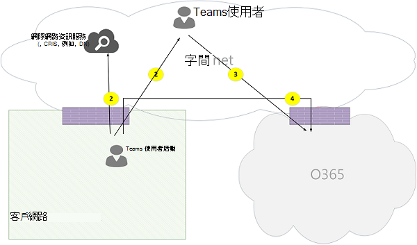](media/microsoft-teams-online-call-flows-figure04.png)

*圖 4-外部使用者的客戶網路（直接媒體）**Figure 4 - Customer network to external user (direct media)*
 
在步驟7中，選取了 [從客戶網路到網際網路（用戶端對等）] 的 [流程 2]。In step 7, flow 2, from customer network to Internet (client's peer), is selected.
- 使用遠端行動使用者（也就是不透過 Office 365 中繼）的直接媒體是選擇性的。Direct media with remote mobile user (that is, not relayed through Office 365) is optional. 換句話說，客戶可能會封鎖此路徑，透過 Office 365 中的傳輸中繼來強制執行媒體路徑。In other words, customer may block this path to enforce a media path through Transport Relay in Office 365.

- 媒體是雙向的。Media is bidirectional. [流程 2] 到 [遠端行動使用者] 的方向表示一個端從連線的觀點啟動通訊。The direction of flow 2 to remote mobile user indicates that one side initiates the communication from a connectivity perspective. 

**VPN 使用者至內部使用者（依小組傳輸轉接的媒體轉送）****VPN user to internal user (media relayed by Teams Transport Relay)**

[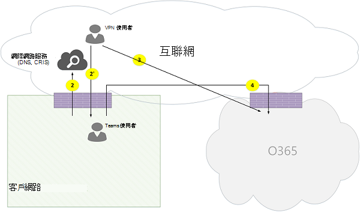](media/microsoft-teams-online-call-flows-figure05.png)

*圖 5-VPN 使用者至內部使用者（依小組傳輸轉接的媒體轉送）**Figure 5 - VPN user to internal user (media relayed by Teams Transport Relay)*
 
從 VPN 到客戶網路之間的信號，是透過流程2」。Signaling between the VPN to the customer network is via flow 2'. 客戶網路與 Office 365 之間的信號是透過流程4。Signaling between the customer network and Office 365 is via flow 4. 不過，媒體會繞過 VPN，而且是透過 Office 365 中的 [流程 3] 和 [4] 到 [小組媒體轉送] 進行路由。However, media bypasses the VPN and is routed via flows 3 and 4 through Teams media relay in Office 365.

**VPN 使用者至內部使用者（直接媒體）****VPN user to internal user (direct media)**

*圖 6-VPN 使用者至內部使用者（直接媒體）**Figure 6 - VPN user to internal user (direct media)*

從 VPN 到客戶網路之間的信號，是透過流程2」。Signaling between the VPN to the customer network is via flow 2'. 客戶網路與 Office 365 之間的信號是透過流程4。Signaling between the customer network and Office 365 is via flow 4. 不過，媒體會繞過 VPN，且是透過流程2從客戶網路傳送到網際網路。However, media bypasses the VPN and is routed via flow 2 from the customer network to the Internet.

媒體是雙向的。Media is bidirectional. 流向遠端行動使用者的流程2的方向，表示一側會從連接的觀點啟動通訊。The direction of flow 2 to the remote mobile user indicates that one side initiates the communication from a connectivity perspective.

**VPN 使用者至外部使用者（直接媒體）****VPN user to external user (direct media)**

[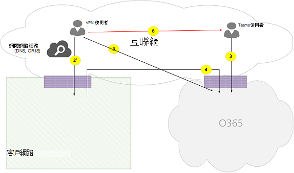](media/microsoft-teams-online-call-flows-figure07.png)

*圖 7-VPN 使用者與外部使用者（直接媒體）**Figure 7 - VPN user to external user (direct media)*

VPN 使用者與客戶網路之間的信號，是透過流程2」，並透過流程4傳送到 Office 365。Signaling between the VPN user to the customer network is via flow 2' and via flow 4 to Office 365. 不過，媒體會繞過 VPN，且是透過流程6路由。However, media bypasses VPN and is routed via flow 6.

媒體是雙向的。Media is bidirectional. [流量 6] 到 [遠端行動使用者] 的方向代表，一個端會從連接的角度啟動通訊。The direction of flow 6 to the remote mobile user indicates that one side initiates the communication from a connectivity perspective.

#### 使用案例：透過 Office 365 幹線的團隊至 PSTNUse Case: Teams to PSTN through Office 365 Trunk
Office 365 有一個手機系統，可讓您撥打及接聽公用交換電話網絡（PSTN）撥打電話。Office 365 has a Phone System that allows placing and receiving calls from the Public Switched Telephone Network (PSTN). 如果 PSTN 幹線是透過電話系統通話方案連線，則此使用案例沒有特殊的連接需求。If the PSTN trunk is connected via the Phone System Calling Plan, then there are no special connectivity requirements for this use case. （如果您想要將自己的內部部署 PSTN 幹線連接至 Office 365，您可以使用 [電話系統直式路由]。）(If you want to connect your own on-premises PSTN trunk to Office 365, you can use Phone System Direct Routing.)

[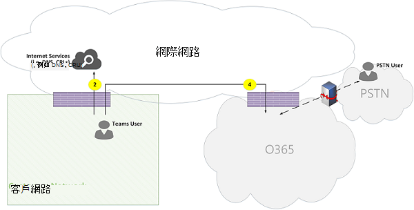](media/microsoft-teams-online-call-flows-figure08.png)

*圖 8-透過 Office 365 幹線的團隊至 PSTN**Figure 8 - Teams to PSTN through Office 365 Trunk*

#### 使用案例：團隊會議Use Case: Teams Meeting

音訊/視頻/螢幕共用（VBSS）會議服務器是 Office 365 的一部分。The audio/video/screen sharing (VBSS) conferencing server is part of Office 365. 它的公用 IP 位址必須可從客戶網路取得，而且必須是從 Nomadic 雲端用戶端取得的。It has a public IP address that must be reachable from the customer network and must be reachable from a Nomadic Cloud client. 每個用戶端/端點都需要能夠連接到會議服務器。Each client/endpoint needs to be able to connect to the conferencing server.

內部用戶端會以與一對一通話描述的相同方式來取得本機、身式和中繼候選人。Internal clients will obtain local, reflexive, and relay candidates in the same manner as described for one-to-one calls. 用戶端會將這些候選人傳送給邀請中的會議服務器。The clients will send these candidates to the conferencing server in an invite. 會議服務器不會使用中繼，因為它有可公開取得的 IP 位址，因此它會以其當地 IP 位址候選的方式回復。The conferencing server does not use a relay since it has a publicly reachable IP address, so it responds with its local IP address candidate. 用戶端與會議服務器會以與一對一通話描述的相同方式檢查連線性。The client and conferencing server will check connectivity in the same manner described for one-to-one calls. 

請注意：Note that:

- 團隊用戶端無法加入商務用 Skype 會議，且商務用 Skype 用戶端無法加入團隊會議。Teams clients cannot join Skype for Business meetings, and Skype for Business clients cannot join Teams meetings.

- PSTN 使用者可以選擇 [撥入] 或 [撥出]，視會議的召集人 PSTN 通話和/或會議提供而定。A PSTN user optionally "Dials IN" or "Dialed OUT", depending on the meeting's organizer PSTN Calling and/or conferencing provisioning. 

- 來賓使用者或客戶使用者可以從來賓私人網路絡加入，而這是透過 FW/NAT 與嚴格規則來保護。A guest user or a customer user may join from a guest private network, which is protected via FW/NAT with strict rules.

[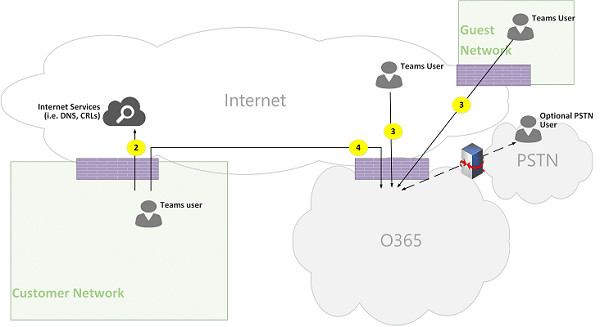](media/microsoft-teams-online-call-flows-figure09.png)

*圖 9-團隊會議**Figure 9 - Teams Meeting*

#### 使用案例：與商務用 Skype 內部部署的同盟Use Case: Federation with Skype for Business on premises

**媒體會依團隊在 Office 365 中傳輸的方式進行中繼****Media relayed by Teams Transport Relay in Office 365**

*圖 10-在 Office 365 中，依團隊傳輸中繼的方式傳送媒體**Figure 10 - Media relayed by Teams Transport Relay in Office 365*

請注意：Note that:

- 同盟是依定義，在兩個租使用者之間的通訊。Federation is, by definition, a communication between two tenants. 在此案例中，使用團隊的租使用者 federates 使用商務用 Skype 內部部署。In this case, tenant A, which uses Teams, federates with tenant B, which uses Skype for Business on premises. 如果承租人 B 也是使用 Office 365，則商務用 Skype 用戶端將使用流程3與 Office 365 連線。If tenant B is also using Office 365, then the Skype for Business client would have used flow 3 to connect with Office 365.

- 從同盟商務用 Skype 用戶端到內部部署商務用 skype 伺服器的信號和媒體不在本檔的範圍內。Signaling and media from the federated Skype for Business client to on-premises Skype for Business Server is out of scope of this document. 不過，這裡有清楚的說明。However, it is illustrated here for clarity.

- 在團隊與商務用 Skype 之間的通知是由 Office 365 中的閘道橋接。Signaling between Teams and Skype for Business is bridged by a gateway in Office 365.

- 在這種情況下，媒體會透過 Office 365 中的小組傳輸中繼來轉接至客戶網路，以及透過流程4進行遠端 Skype 用戶端。Media in this case is relayed by Teams Transport Relay in Office 365 to the customer network and remote Skype for Business client via flow 4.

**受同盟租使用者的商務用 Skype 媒體轉送所進行的媒體轉送****Media relayed by Skype for Business Media Relay in federated tenant**

[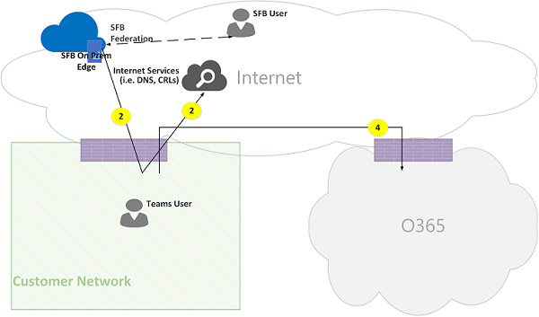](media/microsoft-teams-online-call-flows-figure11.png)

*圖 11-受同盟租使用者的商務用 Skype 媒體轉送所進行的媒體轉送**Figure 11 - Media relayed by Skype for Business Media Relay in federated tenant*

請注意：Note that:

- 從同盟商務用 Skype 用戶端到內部部署商務用 skype 伺服器的信號和媒體不在本檔的範圍內。Signaling and media from the federated Skype for Business client to an on-premises Skype for Business Server is out of scope of this document. 不過，這裡有清楚的說明。However, it is illustrated here for clarity.

- 在團隊與商務用 Skype 之間的通知是由 Office 365 中的閘道橋接。Signaling between Teams and Skype for Business is bridged by a Gateway in Office 365.

- 在此案例中，媒體是透過商務用 Skype 在內部部署媒體轉送轉接至客戶網路（透過流程2）。Media in this case is relayed by Skype for Business on-premises Media Relay to the customer network via flow 2. （請注意，媒體轉送會先將來自團隊使用者的流量傳送給聯盟客戶網路中的遠端媒體轉送，直到相反方向的流量開始流動為止。(Note that traffic from Teams user to the remote Media Relay in the federated customer network will be initially blocked by the Media Relay until traffic in the reverse direction starts to flow. 不過，雙向流程會以兩個方向開啟連線。However, the bidirectional flow will open connectivity in both directions.)

**Direct （對等）****Direct (peer-to-peer)**

[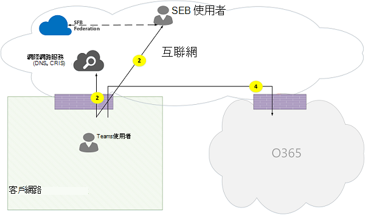](media/microsoft-teams-online-call-flows-figure12.png)

*圖 12-Direct （對等）**Figure 12 - Direct (peer-to-peer)*

### 小組混合式拓朴Teams hybrid topology
此拓朴包括擁有商務用 Skype 內部部署的小組。This topology includes Teams with a Skype for Business on-premises deployment.

[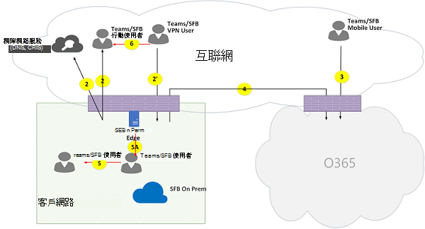](media/microsoft-teams-online-call-flows-figure13.png)

*圖 13-小組混合式拓撲**Figure 13 - Teams hybrid topology*
 
- 上方圖表上的箭號方向反映了對企業週邊的連線所產生的溝通的起始方向。The direction of the arrows on the diagram above reflect the initiation direction of the communication that affects connectivity at the enterprise perimeters. 在 UDP 的 [媒體] 中，第一個資料包可能會以相反的方向流向，但在其他方向的資料包都可能會遭到封鎖，直到其他方向的資料包流動為止。In the case of UDP for media, the first packet(s) may flow in the reverse direction, but these packets may be blocked until packets in the other direction will flow.

- 團隊會與商務用 Skype Online 一起進行並排部署，因此用戶端會顯示為「團隊/SFB 使用者」。Teams is deployed side by side with Skype for Business Online, hence clients are displayed as "Teams/SFB user".

其他流程（在小組拓撲之上）：Additional flows (on top of Teams topology):
- [**流程 5a** ] –代表客戶網路中的小組使用者與客戶網路邊緣的商務用 Skype 內部網路媒體中繼之間的對等媒體流程。**Flow 5A** – Represents a peer-to-peer media flow between a Teams user within the customer network and a Skype for Business on-premises media relay at the customer network edge.

#### 使用案例：團隊到商務用 Skype 一對一Use Case: Teams to Skype for Business one-to-one
**在客戶網路中混合式****Hybrid within the customer network**

[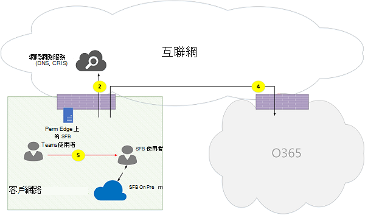](media/microsoft-teams-online-call-flows-figure14.png)

*圖 14-在客戶網路中混合式**Figure 14 - Hybrid within customer network*
 
在團隊與商務用 Skype 之間的通知是由 Office 365 中的閘道橋接。Signaling between Teams and Skype for Business is bridged by a gateway in Office 365. 不過，媒體是透過流程5在客戶網路內以直接對等方式傳送。However, media is routed directly peer-to-peer within the customer network via flow 5.

**含外部商務用 Skype 使用者的混合式客戶網路（由 Office 365 中繼）****Hybrid customer network with external Skype for Business user – relayed by Office 365**

[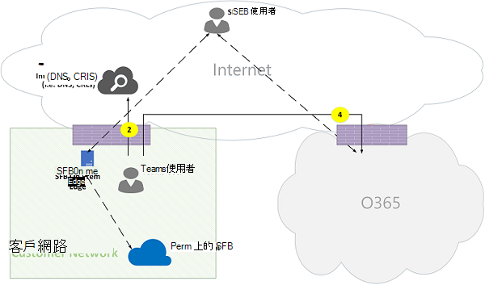](media/microsoft-teams-online-call-flows-figure15.png)

*圖 15-使用外部商務用 Skype 使用者的混合式客戶網路-由 Office 365 中繼**Figure 15 - Hybrid customer network with external Skype for Business user - relayed by Office 365*

請注意：Note that:

- 從商務用 Skype 用戶端到內部部署商務用 Skype 伺服器的信號和媒體不在本檔的範圍內。Signaling and media from the Skype for Business client to an on-premises Skype for Business Server is out of scope of this document. 不過，這裡有清楚的說明。However, it is illustrated here for clarity.

- 在團隊與商務用 Skype 之間的通知是由 Office 365 中的閘道橋接。Signaling between Teams and Skype for Business is bridged by a gateway in Office 365.

- 媒體是透過整個流程4傳送到客戶網路，在 Office 365 中，透過團隊傳輸繼電器進行中繼。Media is relayed through Teams Transport Relay in Office 365 to the customer network through flow 4.

**含外部商務用 Skype 使用者的混合式客戶網路–由內部部署邊緣進行中繼****Hybrid customer network with external Skype for Business user – relayed by on-premises Edge**

[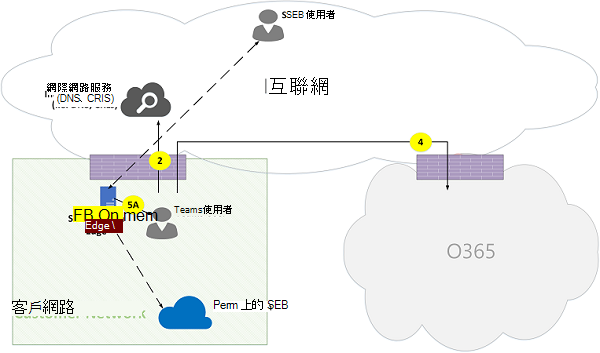](media/microsoft-teams-online-call-flows-figure16.png)

*圖 16-含外部商務用 Skype 使用者的混合式客戶網路-透過內部部署邊緣進行中繼**Figure 16 - Hybrid customer network with external Skype for Business user - relayed by on-premises Edge*
 
請注意：Note that:

- 從商務用 Skype 用戶端到內部部署商務用 Skype 伺服器的信號及媒體不在本檔的範圍內。Signaling and media from Skype for Business client to an on-premises Skype for Business Server is out of scope of this document. 不過，這裡有清楚的說明。However, it is illustrated here for clarity.

- 在 Office 365 中，發網關會將信號橋接。Signaling is bridged by a gateway in Office 365.

- 在商務用 Skype 內部部署邊緣，透過媒體流程5A 在客戶網路內，透過商務用 Skype 媒體轉送來中繼媒體。Media is relayed by Skype for Business Media Relay within Skype for Business on-premises Edge to Teams user within the customer network via media flow 5A.

### 使用電話系統直通路由拓朴的小組Teams with Phone System Direct Routing topology
此拓朴包括具有手機系統直接路由的小組。This topology includes Teams with Phone System Direct Routing. 

[直接路由] 可讓您使用協力廠商公用的電話網絡（PSTN）服務提供者，方法是將支援的內部部署客戶擁有的會話邊界控制器（SBC）硬體裝置與 Office 365 進行配對，然後將電話幹線連接到該裝置。Direct Routing enables you to use a third-party Public Switched Telephone Network (PSTN) service provider by pairing a supported on-premises customer-owned Session Border Controller (SBC) hardware device to Office 365, and then connecting the telephony trunk to that device. 

為了支援此案例，客戶必須部署一個認證的 SBC，以便直接從 Microsoft 認證合作夥伴中傳送。To support this scenario, the customer must deploy a certified SBC for Direct Routing from one of Microsoft's certified partners. SBC 必須根據供應商的建議進行設定，並可透過 Office 365 路由以進行直接的 UDP 流量。The SBC must be configured as recommended by the vendor, and be routable from Office 365 for direct UDP traffic. 媒體可能直接從團隊和/或商務用 Skype 用戶端傳送至 SBC （繞過團隊閘道）或遍歷團隊閘道。The media may flow directly from Teams and/or the Skype for Business client to the SBC (bypassing the Teams gateway) or traverse through the Teams gateway. 當主幹設定為略過團隊閘道時，與 sbc 的連線是依據 ICE，而 SBC 支援 ICE，而商務用 Skype 媒體端點支援全冰。The connectivity with the SBC, when the trunk is configured to bypass the Teams gateway, is based on ICE, where SBC supports ICE-Lite, while the Teams/Skype for Business media endpoint supports ICE Full. 

[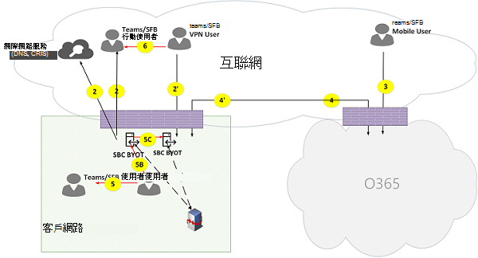](media/microsoft-teams-online-call-flows-figure17.png)

\* 圖 17-使用電話系統直通路由拓撲的團隊\*Figure 17 - Teams with Phone System Direct Routing topology

請注意：Note that:

- 上方圖表上的箭號方向反映了對企業週邊的連線所產生的溝通的起始方向。The direction of the arrows on the diagram above reflect the initiation direction of the communication that affects connectivity at the enterprise perimeters. 在 UDP 的 [媒體] 中，第一個資料包可能會以相反的方向流向，但在其他方向的資料包都可能會遭到封鎖，直到其他方向的資料包流動為止。In the case of UDP for media, the first packet(s) may flow in the reverse direction, but these packets may be blocked until packets in the other direction will flow.

- 團隊會與商務用 Skype Online 一起進行並排部署，因此用戶端會顯示為「團隊/SFB 使用者」。Teams is deployed side by side with Skype for Business Online, hence clients are displayed as "Teams/SFB user".

其他流程（在團隊線上拓朴之上）：Additional flows (on top of Teams online topology):
- [**流程 4** ]-代表從 Office 365 到客戶網路的流程，用來在雲端的小組媒體伺服器與 SBC 內部部署之間建立連線。**Flow 4'** - Represents a flow from Office 365 to the customer network, used to establish a connection between the Teams media server in the cloud with the SBC on premises.
- **流程 5b** –代表客戶網路中的小組使用者之間的媒體流程，並以旁路模式直接傳送 SBC。**Flow 5B** – Represents a media flow between the Teams user within the customer network with the Direct Routing SBC in bypass mode.
- **流程 5c** -代表在 PSTN hairpin 通話旁路模式中，直接路由 sbc 與另一個直接路由 sbc 之間的媒體流程。**Flow 5C** – Represents a media flow between the Direct Routing SBC to another Direct Routing SBC in a PSTN hairpin call bypass mode.

**具有直接路由的內部使用者（依團隊在 Office 365 中傳輸中繼的方式進行媒體轉送）****Internal user with Direct Routing (media relayed by Teams Transport Relay in Office 365)**

[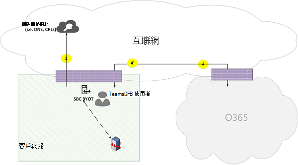](media/microsoft-teams-online-call-flows-figure18.png)

*圖 18-在 Office 365 中使用直接路由的內部使用者（依小組傳輸的媒體轉接）**Figure 18 - Internal user with Direct Routing (media relayed by Teams Transport Relay in Office 365)*

請注意：Note that:
 
- SBC 必須有可從 Office 365 路由的公用 IP 位址。The SBC must have a public IP address that is routable from Office 365.

- 從 SBC 到 Office 365 的信號和媒體，反之亦然，請使用流程4和/或流程4。Signaling and media from the SBC to Office 365 and vice versa use flow 4 and/or flow 4'.

- 從客戶網路中用戶端到 Office 365 的傳送信號及媒體使用流程4。Signaling and media from the client within the customer network to Office 365 use flow 4.

**含直接路由的遠端使用者（透過 Office 365 中的媒體伺服器（MP）路由媒體）****Remote user with Direct Routing (media is routed through a media server (MP) in Office 365)**

[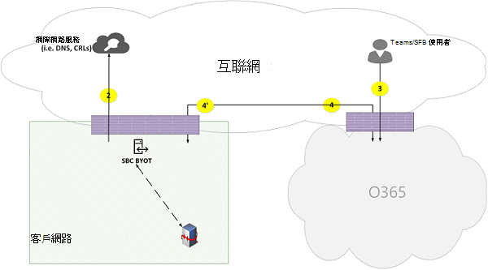](media/microsoft-teams-online-call-flows-figure19.png)

*圖 19-有直接路由的遠端使用者（媒體是透過 Office 365 中的媒體伺服器（MP）路由）**Figure 19 - Remote user with Direct Routing (media is routed through a media server (MP) in Office 365)*
 
請注意：Note that:

- SBC 必須有可從 Office 365 路由的公用 IP 位址。The SBC must have a public IP address that is routable from Office 365.

- 從 SBC 到 Office 365 的信號和媒體，反之亦然，請使用流程4和/或流程4。Signaling and media from the SBC to Office 365 and vice versa use flow 4 and/or flow 4'.

- 從網際網路上的用戶端傳送信號和媒體至 Office 365 使用流程3。Signaling and media from the client on the Internet to Office 365 use flow 3.

**內部使用者直接路由（媒體旁路）****Internal user Direct Routing (media bypass)**

[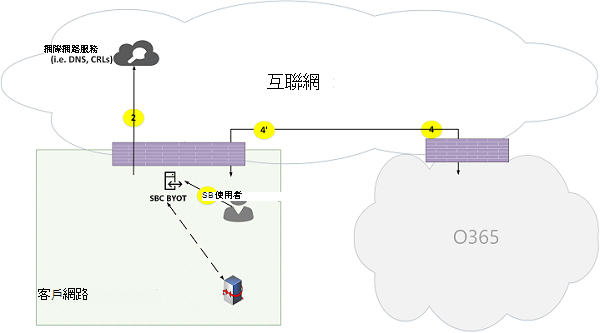](media/microsoft-teams-online-call-flows-figure20.png)

*圖 20-內部使用者直接路由（媒體旁路）**Figure 20 - Internal user Direct Routing (media bypass)*
 
請注意：Note that:

- SBC 必須有可從 Office 365 路由的公用 IP 位址。The SBC must have a public IP address that is routable from Office 365.

- 從 SBC 到 Office 365 的信號，反之亦然，使用流程4和/或流程4。Signaling from SBC to Office 365 and vice versa use flow 4 and/or flow 4'.

- 從客戶網路中的用戶端傳送給 Office 365 使用流程4。Signaling from client within the customer network to Office 365 use flow 4.

- 從客戶網路中的用戶端傳送到客戶網路中的 SBC 的媒體使用流程5B。Media from client within the customer network to SBC within the customer network use flow 5B.

**具有直接路由的遠端使用者（由 Office 365 中的小組傳輸繼電器的媒體旁路中繼）****Remote user with Direct Routing (media bypass relayed by Teams Transport Relay in Office 365)**

[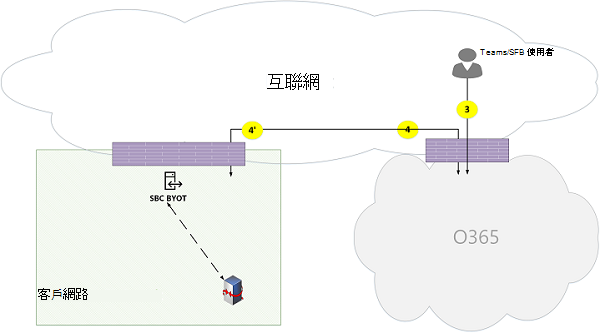](media/microsoft-teams-online-call-flows-figure21.png)

*圖21：使用直接路由的遠端使用者（在 Office 365 中，由小組傳輸中繼的媒體旁路中繼）**Figure 21 - Remote user with Direct Routing (media bypass relayed by Teams Transport Relay in Office 365)*

請注意：Note that:

- SBC 必須有可從 Office 365 和網際網路路由的公用 IP 位址。The SBC must have a public IP address that is routable from Office 365 and Internet.

- 從 SBC 到 Office 365 的信號，反之亦然，使用流程4和/或流程4。Signaling from the SBC to Office 365 and vice versa uses flow 4 and/or flow 4'.

- 從網際網路上的用戶端傳送到 Office 365 的信號是使用流程3。Signaling from the client on the Internet to Office 365 uses flow 3.

- 從網際網路上的用戶端到客戶網路中的 SBC 使用流程3和4，由 Office 365 中的小組傳輸繼電器來中繼。Media from the client on the Internet to the SBC within the customer network uses flows 3 and 4, relayed by Teams Transport Relay in Office 365. 

**遠端使用者直接路由（媒體旁路直接）****Remote user Direct Routing (media bypass direct)**

[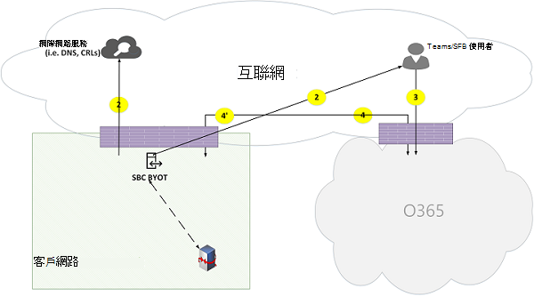](media/microsoft-teams-online-call-flows-figure22.png)

*圖 22-遠端使用者直接路由（媒體旁路直接）**Figure 22 - Remote user Direct Routing (media bypass direct)*
 
請注意：Note that:

- SBC 必須有可透過 Office 365 和網際網路路由的公用 IP 位址。The SBC must have a public IP address that is routable from Office 365 and the Internet.

- 從 SBC 到 Office 365 的信號，反之亦然，使用流程4和/或流程4。Signaling from the SBC to Office 365 and vice versa uses flow 4 and/or flow 4'.

- 從網際網路上的用戶端傳送到 Office 365 的信號是使用流程3。Signaling from the client on the Internet to Office 365 uses flow 3.

- 從網際網路上的用戶端媒體到客戶網路中的 SBC 使用流程2。Media from the client on the Internet to the SBC within the customer network uses flow 2.

**直接路由（媒體旁路）-PSTN hairpin 通話（由於呼叫轉寄/轉接）****Direct Routing (media bypass) – PSTN hairpin call (due to call forward/transfer)**

[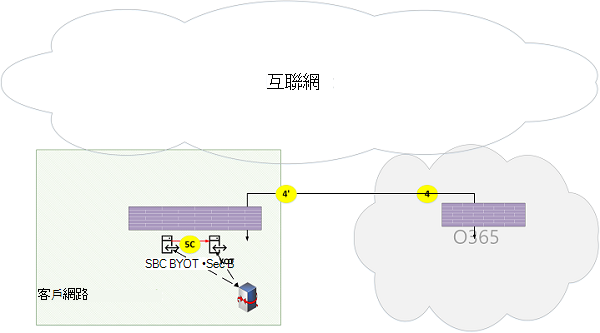](media/microsoft-teams-online-call-flows-figure23.png)

*圖 23-直接路由（媒體旁路）-PSTN hairpin 通話（由於呼叫轉寄/轉接）**Figure 23 - Direct Routing (media bypass) - PSTN hairpin call (due to call forward/transfer)*
 
請注意：Note that:

- SBC 必須有可從 Office 365 路由的公用 IP 位址。The SBC must have a public IP address that is routable from Office 365.

- 從 SBC 到 Office 365 的信號，反之亦然，使用流程4和/或流程4。Signaling from the SBC to Office 365 and vice versa uses flow 4 and/or flow 4'.

- 從 PSTN 到 PSTN hairpinned 通話之後，用戶端就不在信號和媒體循環。The client is out of the signaling and media loop after the call is hairpinned from PSTN to PSTN.

- 從客戶網路內部的 SBC 實例 A 到客戶網路內的 sbc 實例 B （其中 A 和 B 可以是相同實例）的媒體則使用流程5C。Media from SBC instance A within the customer network to SBC instance B within the customer network (where, A and B can be the same instance) uses flow 5C.

**直接路由（透過 Office 365 的媒體）-跨兩個租使用者的 PSTN hairpin 通話****Direct Routing (media through Office 365) – PSTN hairpin call across two tenants**

[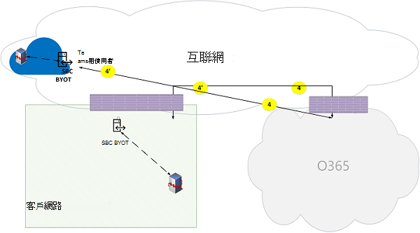](media/microsoft-teams-online-call-flows-figure24.png)

*圖 24-直接路由（透過 Office 365 的媒體）-跨兩個租使用者的 PSTN hairpin 通話**Figure 24 - Direct Routing (media through Office 365) – PSTN hairpin call across two tenants*
 
請注意：Note that:

- SBC 必須有可從 Office 365 路由的公用 IP 位址。The SBC must have a public IP address that is routable from Office 365.

- 從 SBC 到 Office 365 的信號，反之亦然，使用流程4和/或流程4。Signaling from the SBC to Office 365 and vice versa uses flow 4 and/or flow 4'.

- 從 PSTN 到 PSTN hairpinned 通話之後，用戶端就不在信號和媒體循環。The client is out of the signaling and media loop after the call is hairpinned from PSTN to PSTN.

- 從位於客戶網路 X 至 SBC 實例 B 之 SBC 實例 A 的媒體，必須透過 Office 365 媒體伺服器中繼，且無法使用旁路模式。Media from SBC instance A within the customer network X to SBC instance B must be relayed through the Office 365 Media Server and can't use bypass mode.

## 具有快速路線優化的小組Teams with Express Route optimization

[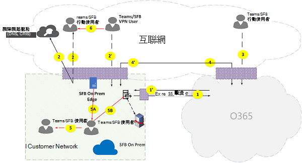](media/microsoft-teams-online-call-flows-figure25.png)

*圖 25-具有快速路線優化的小組**Figure 25 - Teams with Express Route optimization*
 
在直通路線已左右對齊和部署的情況下，小組流程可能會從流程4重新路由至流程1，並從流程4」重新路由至 [流程 1]。In the case that Express Route is justified and deployed, then Teams flows could be re-routed from flow 4 to flow 1 and from flow 4' to flow 1'. 不過，小組應用程式會透過資料流程4和4，在網際網路上對其他 Office 365 流程產生硬性依賴性;因此，不一定會封鎖這些流程。However, Teams Application has a hard dependency on other Office 365 flows over the internet via flows 4 and 4'; hence these flows must not be blocked. 

請注意，商務用 Skype 混合式邊緣流量會路由到網際網路，而不是表示與外部使用者通訊，並與其他租使用者聯盟的路線。Note that Skype for Business hybrid Edge traffic is routed to the Internet and not to Express Route to communicate with external users and federate with other tenants. 

若要避免非對稱資料流程，必須在兩個方向之間進行重新路由。To prevent asymmetrical flows, re-routing must be in both directions. 換句話說，在客戶網路中的位址是透過 [網際網路] 或 [快速路由] 進行路由，而不是透過優化，而是在這兩者中都可以。In other words, an address within the customer network is routable either through Internet or Express Route, based on optimization, but not through both.

例如：For example:

**外部使用者的客戶網路（依小組傳輸轉接的媒體轉送）：****Customer network to external user (media relayed by Teams Transport Relay):**

*圖 26-外部使用者的客戶網路（依小組傳輸轉接的媒體轉送）**Figure 26 - Customer network to external user (media relayed by Teams Transport Relay)*
 
**高層次步驟：****High Level Steps:**
1. 客戶網路中的小組使用者可透過 flow2 解析 URL 功能變數名稱（DNS）Teams User within customer network resolves URL domain name (DNS) via flow2
2. 客戶網路中的小組使用者會透過流程1在小組傳輸中繼上分配媒體轉送埠Teams User within customer network allocates a media Relay port on Teams Transport Relay via flow 1
3. 在客戶網路中的小組使用者透過流程1到 Office 365 傳送「邀請」給 ICE 候選人Teams User within customer network sends "invite" with ICE candidates via flow 1 to Office 365
4. OFFICE 365 透過流程3將通知傳送給外部團隊使用者OFFICE 365 sends notification to external Teams user via flow 3
5. 團隊外部使用者透過流程3在團隊傳輸中繼上分配媒體轉送埠Teams external user allocates a media Relay port on Teams Transport Relay via flow 3
6. 團隊外部使用者透過流程3傳送「回答」與 ICE 候選人，然後透過流程3轉寄傳回給小組使用者 ATeams external user sends "answer" with ICE candidates via flow 3, which is forwarded back to Teams user A via Flow 1
7. 小組使用者 A 與團隊使用者 B 呼叫 ICE 連線測試，並選取 [流程 1] 和 [3]，這些是由 Office 365 中的小組傳輸繼電器來中繼Teams User A and Teams User B invoke ICE connectivity tests and selects flows 1 and 3, which are relayed by Teams Transport Relay in Office 365
8. 團隊使用者透過流程1和3，將遙測傳送至 Office 365Teams Users send telemetry to Office 365 via flows 1 and 3

>**注意**：必須啟用流程4，才能支援在要求流程4的其他微服務上使用小組應用程式的相依性。**Note**: Flow 4 must be enabled to support dependencies of Teams application on other micro-services that mandates flow 4.
