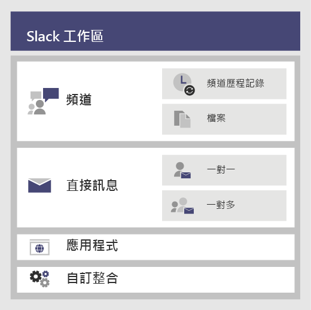
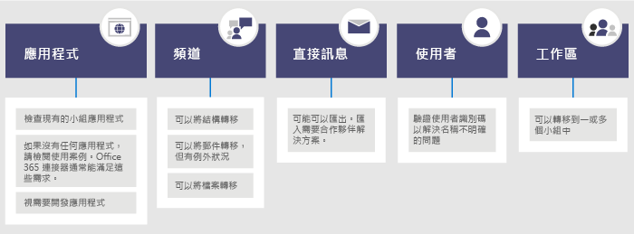

# <a name="migrate-from-slack-to-microsoft-teams"></a>從 Slack 移轉到 Microsoft Teams

本文將逐步引導您從 Slack 移轉到 Microsoft Teams 的過程。

為組織規劃從 Slack 移轉到 Teams 時，您必須先決定要保留的項目 (如果有)。 我們一開始先說明可以轉移的資料類型，然後逐步引導您如何評估需求、規劃移轉，然後執行移轉。

下列圖表顯示了高等級 Slack 架構。



## <a name="plan-your-migration-from-slack"></a>規劃從 Slack 的移轉
### <a name="what-you-can-and-cant-migrate"></a>可以或不可移轉的項目
您的 Slack 服務方案將決定您可以或無法移轉的項目。例如，某些 Slack 服務方案只允許您匯出公用頻道的歷程記錄和檔案，而其他則需要 DocuSign 要求，才能包含私人頻道和直接訊息。 

若要決定您的 Slack 工作區服務等級，請登入 Slack 並記下在 **[關於此工作區]** 頁面上的的方案類型。

若要深入了解 Slack 的匯出選項，請移至 Slack 網站：https://get.slack.help/hc/articles/204897248-Guide-to-Slack-import-and-export-tools 

下列圖表提供了在本文中我們將涵蓋之 Slack 移轉狀況的高等級看法。 



完成本章節後，您應能了解：
- Slack 工作區的服務等級
- 可以或無法匯出的項目
- 匯出的一般方法

### <a name="assess-your-slack-workspaces"></a>評估您的 Slack 工作區
在可規劃組織的移轉方案之前，您必須先集結一些與 Slack 工作區相關的資訊。 了解您 Slack 工作區的使用方式將幫助您決定移轉的範圍。 例如，要移轉多少工作區？ 是由某個特定部門、許多部門，還是由整個組織使用？

如果您屬於打算移轉之 Slack 工作區的成員之一，您可以前往 *\<your Slack workspace\>.slack.com/stats* 來自行分析使用方式。查看 [頻道] 和 [成員] 索引標籤以尋找使用模式。決定要移轉何種工作區 (以及要留下哪些工作區)。 

> [!NOTE]
> 如果您沒有統計資料頁面的存取權，您就不是系統管理員或擁有者。 

### <a name="export-channels"></a>匯出頻道

在 Slack 中，使用者會加入屬於 Slack 工作區的頻道，然而 Teams 使用者則是加入頻道集合的團隊。 我們建議您使用 Slack 分析，查看每個頻道發生活動的次數，以幫助您決定要移轉的頻道。 您將使用結果清單找出如何將 Slack 頻道分組至 Teams 中的團隊，以及每個團隊應具有的成員。

如果您有付費的 Slack 服務方案 (除了免費以外)，您可以使用 Slack 分析 (\<your Slack workspace\>.slack.com/admin/stats#channels) 來查看頻道的使用程度、上次使用時間和成員人數。 這可協助您決定是否要移轉頻道。 根據預設，可以匯出公用頻道內容(訊息與檔案)。 根據您的 Slack 服務方案，以及您是否已從 Slack 要求私人頻道和從直接訊息，這些都可以匯出。

若要深入了解 Slack 的匯出選項，請移至 Slack 網站：https://get.slack.help/hc/articles/204897248-Guide-to-Slack-import-and-export-tools 

> [!IMPORTANT]
> 檢查組織對頻道資料的隱私權與合規性需求。除了遵守使用者可識別內容 (EUII) 的生命週期外，您的組織還可能對處理、儲存和處理此資料方面有合規性要求。

### <a name="export-direct-messages"></a>匯出直接訊息
直接訊息與 Teams 中的聊天相同，也就是1:1 或一對多非頻道交談。 匯出能力取決於您的 Slack 服務方案，以及您是否已要求將直接訊息包含在 [Slack 匯出] 中。 Teams 目前不支援匯入直接訊息。 請諮詢 Microsoft 合作夥伴，以了解可探索之將直接訊息內容匯入 Teams 的協力廠商相關解決方案。

若要匯出直接訊息，請查看 Slack 應用程式市集中的工具 (例如 [匯出])。

### <a name="apps-and-custom-integrations"></a>應用程式和自訂整合

Slack 中的應用程式就如同 Teams 中的應用程式。當您在工作區中擁有應用程式及其設定清單後，您可以在 Teams 應用程式市集中搜尋，以查看它們是否可於 Teams 中使用*。 

前往 \<your Slack workspace\>.slack.com/apps/manage 以取得應用程式和自訂整合清單。 此頁面也會顯示每個應用程式使用中的設定數量。 自訂整合按照「移轉能力」而有所不同。 如果是 Web Hook，您通常可以將其傳送到 Microsoft 365 或 Office 365 連接器，以將工作流程轉換至 Teams。 視情況評估 Bot 和其他應用程式，以規劃將其移至 Teams。

\* 如果您的系統管理員已限制應用程式使用，您可能不會看到可用應用程式的完整清單。

### <a name="users"></a>使用者
您在 Slack 中使用的身分識別模式，可能不會直接對應到 Microsoft 365 或 Office 365。 例如，您的 Slack 使用者電子郵件地址可能不會對應到 Microsoft 365 或 Office 365 的公司或學校帳戶。 開始規劃 Teams 推出前，您應先建立使用者識別碼對應。

如果您使用付費的 Slack 服務方案，您可以移至 *\<your Slack workspace\>.slack.com/admin/stats#members* 以取得成員詳細資料，例如每位使用者的電子郵件地址和帳戶類型 (如單一與多頻道來賓)。

以下是您可以用來比較來自 Slack 匯出和 Azure AD 電子郵件地址的指令碼，以協助解決名稱模稜兩可的情形。 如果啟用 Teams 時也會報告。 如果您需要 PowerShell 的說明，請參閱[開始使用 Azure PowerShell](/powershell/azure/get-started-azureps)。

```azurepowershell
Connect-AzureAD
Function Get-TimeStamp {
    return "[{0:MM/dd/yy} {0:HH:mm:ss}]" -f (Get-Date)
}

class User {
    [ValidateNotNullOrEmpty()] $ID
    [ValidateNotNullOrEmpty()] $FullName
    [string] $Email
    [string] $UPN
    [ValidateNotNullOrEmpty()][bool] $ExistsAzureAD
    [ValidateNotNullOrEmpty()][bool] $TeamsEnabled
}

$output = New-Object -type System.Collections.ObjectModel.Collection["User"]

$users = Get-Content -Raw -Path .\slackHistory\users.json | ConvertFrom-Json

Write-Host -ForegroundColor Green "$(Get-Timestamp) User Count: " $users.Count

$i=1
Write-Host "$(Get-Timestamp) Attempting direct email match.. `n"
foreach ($slackUser in $users) {
    $user = New-Object User
    $user.id = $slackUser.id
    $user.FullName = $slackUser.name
    try {
        if ($null -ne $slackUser.profile.email) {
            $user.email = $slackUser.profile.email
            $emailSplit = $slackUser.profile.email.Split('@')
            $mailNickName = $emailSplit[0]
            $result = Get-AzureADUser -Filter "MailNickName eq '$($mailNickName)' or UserPrincipalName eq '$($slackUser.profile.email)' or proxyAddresses/any(c:c eq 'smtp:$($slackUser.profile.email)')"
            if ($null -ne $result) {
                $user.ExistsAzureAD = $true
                $user.UPN = $result.UserPrincipalName
                $assignedPlans = $result.assignedPlans
                foreach ($plan in $assignedPlans) {
                    if ($plan.ServicePlanId -eq "57ff2da0-773e-42df-b2af-ffb7a2317929") {
                        if ($plan.CapabilityStatus -eq "Enabled") {
                            $user.TeamsEnabled = $true
                        }
                        else {
                            $user.TeamsEnabled = $false
                        }
                    }
                }
                Write-Host -ForegroundColor Green "$(Get-Timestamp) Current User $($i) - AzureAD object found:" $result.MailNickName
                Write-Host -ForegroundColor Green "$(Get-Timestamp) Current User $($i) - Teams Enabled:" $user.TeamsEnabled
            }
            else {
                $user.ExistsAzureAD = $false
                Write-Host -ForegroundColor Yellow "$(Get-Timestamp) Current User $($i) - AzureAD object not found: " $slackUser.profile.email
            }
        }
        $i++
    }   
    catch
    {
        $user.ExistsAzureAD = $false
        Write-Host -ForegroundColor Yellow "$(Get-Timestamp) Current User $($i) - AzureAD object not found: $($i)" $user.profile.email
        $i++
    }
    $output.Add($user)
}

$output | Export-Csv -Path .\SlackToAzureADIdentityMapping.csv -NoTypeInformation
Write-Host "`n $(Get-Timestamp) Generated SlackToAzureADIdentityMapping.csv. Exiting..."
```

完成本章節後，您應已具有：
- 含有使用方式統計資料之每個工作區的頻道清單。
- 具有每個頻道設定的 Slack 應用程式清單。
- 已決定您要匯出 Slack 訊息歷程記錄的類型 (如果有)。
- Slack 帳戶對應至 Microsoft 工作或學校帳戶的使用者清單，以及其擁有的 Teams 授權。

## <a name="plan-your-teams-deployment"></a>規劃 Teams 部署
您已由 Slack 匯出所需的項目 (並留下不需要的任何項目)。 現在可以規劃推出 Teams 的方式並匯入您的 Slack 資料。 這是一個根據使用方式評估何者適合團隊的好機會，並將這些元素包含至您的 Teams 部署方案。 在本章節的結尾，您將具有您的 Teams 使用者、頻道和應用程式的藍圖。 

下列圖表將提供在 Teams 部署中您將解決事項的高等級大綱。

:::image type="content" source="media/migrate-slack-to-teams-image3.png" alt-text="從 Slack 規劃 Teams 部署的高等級大綱。":::

### <a name="team-and-channel-structure"></a>Team 和頻道結構

Slack 工作區可以代表單一團隊、多個團隊或整個組織。 當您決定結構時，了解工作區的範圍至關重要。 與 Slack 中 Teams 團隊最接近的關係是工作區，而其中包含頻道集合。 下列圖表證明 3 種不同的 Slack 到 Teams 的對應，以及為每個工作區挑選正確對應的指引。


|Slack 到 Teams 的對應 | 描述 |
|---------|---------|
|1 個 Slack 工作區：箭號_右側：1 個團隊   | 針對需要少於 200 個頻道的較小型 Slack 工作區<br>包含成長和私人頻道規劃的緩衝區  |
|1 個 Slack 工作區：箭號_右側：多個團隊     | 使用您的 Slack 工作區分析資料來建立邏輯頻道群組，其會成為成為您團隊的基礎。        |
|2 個以上 Slack 工作區：箭號_右側：多個團隊     | 使用您的 Slack 工作區分析資料來建立邏輯團隊和頻道群組，其會成為成為您團隊的基礎。        |

協力廠商解決方案具有使用統計資料，可協助您評估頻道作用狀況和貼文的數量。 通常經常使用的頻道會成為包含於團隊規劃中的候選頻道。

> [!TIP]
> 僅保留方法中所必須的項目，以決定要在 Teams 中重新建立哪些頻道。 若要深入了解，請參閱[團隊和頻道概觀](teams-channels-overview.md)。 

#### <a name="team-planning"></a>團隊規劃
使用您在上述 [規劃] 章節中所編譯的 [頻道庫存]，與您的 Slack 擁有者和系統管理員合作，以找出哪些頻道應成為團隊，以及哪些頻道應成為團隊中的頻道。 使用 Excel 或 Power BI 來協助本次分析 - 兩種都可以提供額外的深入資訊，以幫助推動有關保留哪些頻道的討論。

> [!TIP]
> Teams 目前有每個團隊 200 個頻道的限制。如果您的頻道清單正接近該限制，請找出將其分割成兩個個別團隊的方法。

### <a name="channel-history"></a>頻道歷程記錄

根據組織保留公用和私人通道歷程記錄的需求，您同時可使用 GitHub 上的免費解決方案和付費方案。此外，您也可將其編寫為 Teams 中的指令碼。

一旦在 Teams 中設定好新的團隊和頻道結構，您可以將匯出的檔案複製到 Teams 頻道中適當的文件庫。

若要自動匯入您的內容，有幾種可以考慮的方法。 GitHub 上的免費解決方案 ([ChannelSurf](https://github.com/tamhinsf/ChannelSurf) 或 [Slack Export Viewer](https://github.com/hfaran/slack-export-viewer)) 和合作夥伴解決方案。 根據您組織的需求選擇解決方案。 

### <a name="channel-files"></a>頻道檔案

大部分解決方案都可匯出檔案。然而它們通常會以頻道歷程記錄中連結的方式提供，需要 API 金鑰才能以程式設計方式擷取。

針對儲存在 Slack 中的檔案，一旦您設定好 Teams 中的團隊和頻道，可以以程式設計的方式由 Slack 將其複製到目標的 Teams 頻道。

以下指令碼從 Slack 擷取檔案。 它會在您的電腦上搜尋特定的 Slack 匯出，在每個目標頻道中建立資料夾，並將所有檔案下載到該位置。 現有協力廠商解決方案可以解壓縮資料。 如果您需要 PowerShell 的說明，請參閱[開始使用 Azure PowerShell](/powershell/azure/get-started-azureps)。


```azurepowershell
$ExportPath = ".\slackHistory"
$ExportContents = Get-ChildItem -path $ExportPath -Recurse
Function Get-TimeStamp {
    return "[{0:MM/dd/yy} {0:HH:mm:ss}]" -f (Get-Date)
}

class File {
    [string] $Name
    [string] $Title
    [string] $Channel
    [string] $DownloadURL
    [string] $MimeType
    [double] $Size
    [string] $ParentPath
    [string] $Time
}

$channelList = Get-Content -Raw -Path .\slackHistory\channels.json | ConvertFrom-Json
$Files = New-Object -TypeName System.Collections.ObjectModel.Collection["File"]

Write-Host -ForegroundColor Green "$(Get-TimeStamp) Starting Step 1 (processing channel export for files) of 2. Total Channel Count: $($channelList.Count)"
#Iterate through each Channel listed in the Archive
foreach ($channel in $channelList) {
    #Iterate through Channel folders from the Export
    foreach ($folder in $ExportContents)
    {
        #If Channel Name matches..
        if ($channel.name -eq $folder){
            $channelJsons = Get-ChildItem -Path $folder.FullName -File
            Write-Host -ForegroundColor White "$(Get-TimeStamp) Info: Starting to process $($channelJsons.Count) days of content for #$($channel.name)."
            #Start processing the daily JSON for files
            foreach ($json in $channelJsons){
                $currentJson = Get-Content -Raw -Path $json.FullName | ConvertFrom-Json
                #Write-Host -ForegroundColor Yellow "$(Get-TimeStamp) Info: Processing $($json.Name) in #$($channel.name).."
                #Iterate through every action
                foreach ($entry in $currentJson){
                    #If the action contained file(s)..
                    if($null -ne $entry.files){
                        #Iterate through each file and add it to the List of Files to download
                        foreach ($item in $entry.Files) {
                        $file = New-Object -TypeName File
                            if ($null -ne $item.url_private_download){
                                $file.Name = $item.name
                                $file.Title = $item.Title
                                $file.Channel = $channel.name
                                $file.DownloadURL = $item.url_private_download
                                $file.MimeType = $item.mimetype
                                $file.Size = $item.size
                                $file.ParentPath = $folder.FullName
                                $file.Time = $item.created
                                $files.Add($file)
                            }
                        }
                    }
                }
            }
        }
    }
}
Write-Host -ForegroundColor Green "$(Get-TimeStamp) Step 1 of 2 complete. `n"

Write-Host -ForegroundColor Green "$(Get-TimeStamp) Starting step 2 (creating folders and downloading files) of 2."
#Determine which Files folders need to be created
$FoldersToMake = New-Object System.Collections.ObjectModel.Collection["string"]
foreach ($file in $files){
    if ($FoldersToMake -notcontains $file.Channel){
        $FoldersToMake.Add($file.Channel)
    }
}

#Create Folders
foreach ($folder in $FoldersToMake){
    #$fullFolderPath = $file.ParentPath + "\Files"
    $fullFolderPath = $ExportPath +"\$($folder)"
    $fullFilesPath = $ExportPath +"\$($folder)\Files"
    if (-not (Test-Path $fullFilesPath)){
        New-Item -Path $fullFolderPath  -Name "Files" -ItemType "directory"
    }
}

#Downloading Files
foreach ($file in $files)
{
    Write-Host -ForegroundColor Yellow "$(Get-TimeStamp) Downloading $($file.Name)."
    $fullFilePath = $file.ParentPath + "\Files\" + $file.Name
        if (-not (Test-Path $fullFilePath)){
            try{
                $request = (New-Object System.Net.WebClient).DownloadFile($file.DownloadURL, $fullFilePath)
            }
            catch [System.Net.WebException]{
                Write-Host -ForegroundColor Red "$(Get-TimeStamp) Error: Unable to download $($file.Name) to $($fullFilePath)"
            }   
        }
        else {
            try{
                $extensionPosition = $file.name.LastIndexOf('.')
                $splitFileName = $file.name.Substring(0,$extensionPosition)
                $splitFileExtention = $file.name.Substring($extensionPosition)
                $newFileName = $splitFileName + $file.Time + $splitFileExtention
                $fullFilePath = $file.ParentPath + "\Files\" + $newFileName
                $request = (New-Object System.Net.WebClient).DownloadFile($file.DownloadURL, $fullFilePath)
            }
            catch [System.Net.WebException]{
                Write-Host -ForegroundColor Red "$(Get-TimeStamp) Error: Unable to download $($file.Name) to $($fullFilePath)"
            }   
        }
}
Write-Host -ForegroundColor Green "$(Get-TimeStamp) Step 2 of 2 complete. `n"
Write-Host -ForegroundColor Green "$(Get-TimeStamp) Exiting.."
```


### <a name="apps-and-custom-integrations"></a>應用程式和自訂整合
檢視您的 Slack 應用程式和自訂整合清單 (含設定)，並決定要將哪些移至 Teams。 檢查 Teams Marketplace 以查看是否有可用的應用程式。 如果沒有，可能會有替代方案。 

若要判斷要新增至 Teams 的應用程式，請務必了解應用程式的使用方式。 透過詢問「應用程式提供給此頻道的功能為何？」，將會了解該應用程式所傳遞的成果。 

在許多情況下，應用程式主要由外部服務接收事件驅動的資料 (如監視系統)，並將訊息推入 Slack。 您可以使用 Microsoft 365 連接器來取得相同的結果，同樣可以根據根據事件將訊息推入 Slack。

以下是 Teams 中使用 Microsoft 365 連接器整合的 Slack 解決方案範例。
- Ansible
  - 可透過 [Ansible webhook](https://docs.ansible.com/ansible-tower/latest/html/userguide/notifications.html#webhook) 將警示傳送到 Teams
- New Relic
  - 查看[傳送 New Relic 警示到 Teams](https://discuss.newrelic.com/t/new-relic-alerts-not-working-with-microsoft-teams/48609/3) 的使用者解決方案
- Nagios
  - 警示現在可透過連接器整合。https://github.com/isaac-galvan/nagios-teams-notify
- Zendesk
  - 可在 Teams Store 找到應用程式
- Jenkins
  - 可使用 [Jenkins’s Office 365 連接器](https://plugins.jenkins.io/Office-365-Connector)傳送警示到 Teams


### <a name="user-readiness-and-adoption-plan"></a>使用者整備和採用方案
任何成功的軟體部署基石，取決於使用者為變更所做的準備。 貴組織中使用 Slack 的使用者可輕鬆了解 Teams 概念，但仍需要訓練以協助他們平順的轉換。 如需全方位的 Teams 採用資源集合，請移至 [Teams 採用adoption 中心](adopt-microsoft-teams-landing-page.md)。

例如，兩者都是產品功能頻道，但在每個產品中都以不同方式使用。 例如，Slack 頻道通常像在 Teams 中的聊天一樣，用於短期的交易式交談。 其他明顯的差異則在於往來/非往來談，和調整通知設定。

查看我們豐富的[使用者 Teams 視訊訓練](https://support.office.com/article/microsoft-teams-video-training-4f108e54-240b-4351-8084-b1089f0d21d7)文件庫。 

## <a name="move-to-teams"></a>移轉至 Teams 
既然已定義好您的轉換計畫，您可以開始建立 Teams 中的團隊和頻道。 

一旦建立好團隊和頻道之後，開始將檔案從 Slack 頻道複製到 Teams，並設定您的應用程式。 如果您使用解決方案來保留歷程記錄，也可以立即設定。 然後您可以開始授權使用者 (如果他們尚未取得授權)，並將他們新增至適當的團隊。 若要減少額外匯出和檔案複製的需求，請考慮在每個使用者加入團隊同時的商定日期移除 Slack 存取權。 這樣就可避免檔案和歷程記錄上之重新匯出和匯入的差異變更。

按照下列圖表中的步驟在貴組織中推出 Teams。 如需詳細資訊，請參閱[如何推出 Teams](./deploy-overview.md)。


:::image type="content" source="media/migrate-slack-to-teams-image4.png" alt-text="圖表列出了從 Slack 移至 Teams 的步驟。":::