# 流覽Microsoft Teams

現在，您清楚瞭解貴組織的獨特路徑和需求，現在該開始與貴組織進行強大Microsoft Teams。 請使用下列一節來瞭解如何流覽 Kaziala 在 Teams 中稱讚的功能。

| 從 Kaizala | 若要Teams |
|---------|-----------------------|
| 快速入門 - 登錄和設定檔設定| [開始使用Teams](#getting-started) |
| 啟動新聊天、1：1 音訊和視訊通話 | [在 Teams、音訊和視Teams聊天](#starting-new-chats-11-audio-and-video-calls) |
| 您的Kaizala群組| [將群組Kaizala到Teams](#moving-your-kaizala-groups-to-microsoft-teams) |
| 模仿消費者應用程式訊息體驗| [模仿消費者應用程式訊息體驗](#mimic-the-consumer-app-messaging-experience) |
| 開箱動作卡片 |  [在 Teams](#getting-work-done-in-teams) |
| 投票、問卷、檢查清單| [在問卷中進行投票、問卷、檢查Teams](#polls-surveys-and-checklists-in-teams) |
| 會議 - 動作卡片| [開會 - 會議Teams](#getting-work-done-in-teams) |
| 公告 - 動作卡片| [在 Teams](#announcements-in-teams) |
| 相片簽入動作卡片| [相片在 Teams](#photo-check-ins)
| 測驗 - 動作卡片| [測驗Teams](#quiz-in-teams)
| 訓練 - 動作卡片| [在 Teams](#training-in-teams) |
| 您的自訂動作卡片 | [自訂解決方案Teams](#moving-kaizala-custom-solutions-to-microsoft-teams) |
| Kaizala管理入口網站| [適用于 IT 專業人員](#it-professionals) |
| | [針對使用者](#end-user-guidance) |
| Kaizala群組解除| [Kaizala群組解除](#kaizala-group-dissolution) |
| Kaizala租使用者資料匯出| [匯出Kaizala租使用者資料](#export-kaizala-tenant-data)  |
| 與外部使用者 (廠商/供應商/合作夥伴) | [使用Teams和Teams的互通性](#collaborating-with-external-usersvendorssupplierspartners) |

## 開始

使用我們的入門指南，Kaizala開始Teams您輕鬆上手。 若要深入瞭解如何開始您的Microsoft Teams，請參閱[開始使用Teams](https://support.microsoft.com/office/start-and-pin-chats-a864b052-5e4b-4ccf-b046-2e26f40e21b5?wt.mc_id=otc_microsoft_teams&ui=en-us&rs=en-us&ad=us)。

## 開始新的聊天、1：1 音訊和視訊通話

建立 1：1 或群組聊天，以與較小的群組共同合作，或在 Teams。 您可以釘上聊天並儲存訊息以快速存取。 若要開始與我們豐富的文字格式、表情符號和 gif 聊天，請參閱在 Teams 中[聊天](https://support.microsoft.com/office/start-and-pin-chats-a864b052-5e4b-4ccf-b046-2e26f40e21b5?wt.mc_id=otc_microsoft_teams&ui=en-us&rs=en-us&ad=us)。

開始 1：1 或與貴組織中任何人進行群組通話，以有效率地溝通。 有了Teams，您能夠同時撥打音訊和視音訊通話。  若要開始使用，請參閱 [撥打電話](https://www.microsoft.com/videoplayer/embed/RE4rxv0?pid=ocpVideo0-innerdiv-oneplayer&postJsllMsg=true&maskLevel=20&market=en-us)。

您可以透過在 Kaizala 中建立Microsoft Teams、頻道Teams群組聊天，從群組移至Teams。

Teams是圍繞組織內部不同專案和結果之人員、內容和工具的集合。

Teams由頻道所建立，頻道是您與團隊成員進行的主題特定交談。 每個頻道都專門用於特定主題、部門或專案。 使用應用程式延伸時，通道最有價值。 若要深入瞭解，請參閱 [在頻道中工作](https://support.microsoft.com/office/teams-and-channels-df38ae23-8f85-46d3-b071-cb11b9de5499?ui=en-us&rs=en-us&ad=us#ID0EAABAAA=Work_in_channels)。

**群組聊天** 讓您能收集同事快速流覽立即訊息。

### 聊天與Teams頻道中的交談

|聊天中的交談 | 小組頻道中的交談 |
|---------|---------|
|針對輕量交談，您可以直接傳送郵件給收件者。   | 針對在開放空間中討論多個主題的互動。  |
|只有聊天中的使用者才能看到私人聊天     | 團隊中的每個人都可以看到        |
|一個連續、未讀取的交談     | 結構化、多執行緒交談        |
|最多 250 人     | 最多 25，000 人        |
|選擇是否要與新的聊天參與者共用聊天記錄     | 所有新的小組成員共用歷程記錄        |
|新的聊天收件者必須由已經在聊天中的人員新增     | 使用者可以搜尋團隊來加入團隊。 在私人Teams，Teams系統管理員核准新成員。 頻道成員可以產生程式碼，讓新成員直接加入，而不需要系統管理員核准。        |
|在即點畫面分享，以及音訊和視音訊通話。 輕鬆排程Teams所有聊天參與者的會議     | 現場和已排程的音訊和視音訊通話        |
|一些應用程式的可擴充性     | 應用程式的完整擴充性和自訂        |

如要概觀Teams頻道和群組聊天，請參閱團隊和[頻道](teams-channels-overview.md)Microsoft Teams。

## 將群組Kaizala到Microsoft Teams

在 Kaizala中，群組是一組人員。 在群組中，有三種類型的群組結構Kaizala平面群組、階層群組和廣播群組。 當您轉換至Microsoft Teams，您可以使用Teams頻道和群組聊天，為貴組織建立類似的通訊結構。

請遵循以下指示，以從群組切換到群組Teams頻道和群組聊天。

有兩種方法可移動您的Kaizala群組至Teams：

- 選項 1：從平面群組Kaizala切換到群組聊天Teams

- 選項 2：從平面Kaizala切換到Teams群組

**選項 1：從Kaizala群組切換到群組Teams**

您可以建立一個Teams群組聊天，以便與最多 250 位參與者進行快速聊天和暫時性交談。 群組聊天可以讓貴組織的人有一個可以加入聊天的開啟交談中央位置。

1. 開始群組聊天並命名。

    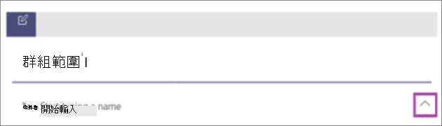

    擁有群組聊天存取權的每一個人都可以 [傳送訊息](https://support.microsoft.com/office/send-and-read-messages-in-teams-b29e60ec-76af-4d97-8c3c-a4e36f2b64aa?ui=en-us&rs=en-us&ad=us)。

2. 新增人員至交談。

    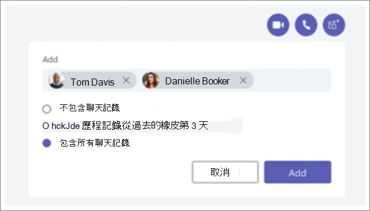
    
   將某人新增到群組聊天 (一對一) 時，您可以包含您想要分享的聊天記錄與歷程記錄持續時間。**** 

3. 管理群組聊天。
  
    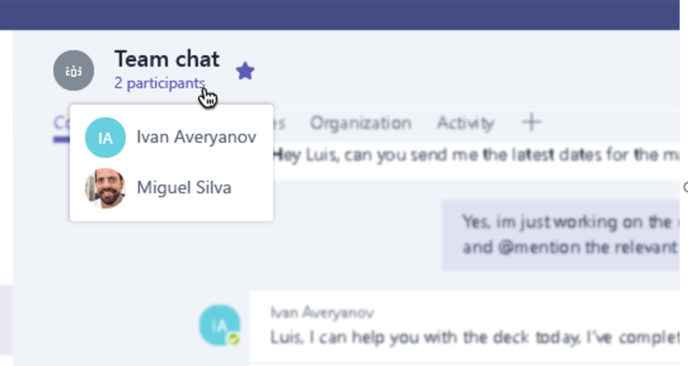
    
   若要查看群組聊天中的人員，請將游標停留在聊天標題中的參與者人數上，以顯示每個人的名稱清單。

**選項 2：從平面Kaizala切換到Teams團隊**
   
針對目標大型群組通訊，您可以為平面群組建立小組。 您最多可以新增 25，000 個成員，以使用對話對話進行結構化通訊。 這種類型的通訊可讓管理角色進行管理，以確保事情順利進行。

1. 建立團隊：若要在團隊中Teams，您應該建立團隊、新增人員，以及新增頻道。 若要深入瞭解，請參閱 [您的第一個團隊](get-started-with-teams-create-your-first-teams-and-channels.md)。
2. 請閱閱團隊擁有者指南：

做 [為團隊](https://support.microsoft.com/office/go-to-guide-for-team-owners-92d238e6-0ae2-447e-af90-40b1052c4547?ui=en-us&rs=en-us&ad=us)擁有者，您可以新增成員和來賓、將成員變更為擁有者、管理頻道和設定，以及存檔不再使用中的團隊。

3. 新增大量成員至團隊：

    如果您是團隊擁有者，請前往團隊清單中的團隊名稱，然後選取新增成員>選項 **按鈕**。****

    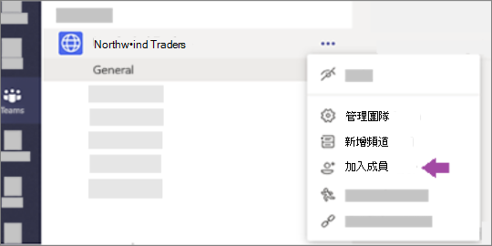

    您可以開始輸入通訊群組清單、安全性群組或Microsoft 365群組來新增到您的團隊。 若要深入瞭解，請參閱在團隊中[新增](https://support.microsoft.com/office/add-members-to-a-team-in-teams-aff2249d-b456-4bc3-81e7-52327b6b38e9?ui=en-us&rs=en-us&ad=us)成員Teams。

### 模仿消費者應用程式訊息體驗

如果您想要為使用者提供簡化的體驗，您可以選擇設定貴組織的 Teams體驗，以模仿使用者已經使用的消費者工具。

我們建議您開始您的Teams，Kaizala聊天中顯示我的最愛頻道，以簡化通訊和班次 (選擇) 。

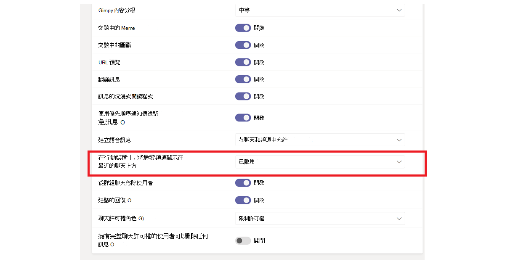

以下是小組與 **Shifts 介面的範例**：

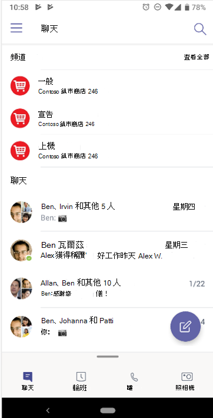

以下是沒有 Shifts 的小組 **介面範例**：

 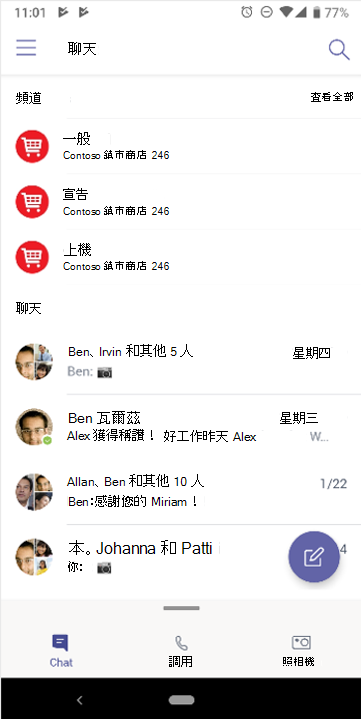

> [!NOTE]
> 您可以移除對 Teams 按鈕的存取權，為前線員工建立簡化的介面，且只會在聊天上方顯示強調的頻道。 若要深入瞭解，請參閱[在 Teams 中管理Teams](messaging-policies-in-teams.md)。

### 使用Teams頻道建立階層式群組結構

在 Kaizala中，階層式群組可允許貴組織根據成員之間的通訊類型，在不同群組結構中互動。  在 Teams中，您可以建立Teams和頻道，以符合組織結構，並設定階層式通訊。 您可以在內部使用階層式結構Teams提醒成員所需的動作、重要消息和更新。

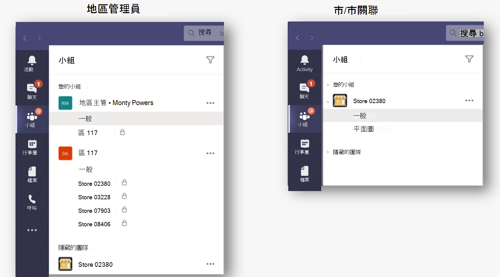

若要深入瞭解，請參閱在 Microsoft Teams 中[組織團隊的最佳Microsoft Teams](best-practices-organizing.md)。

### 使用Teams頻道廣播重要消息

在廣播Kaizala中，系統管理員可以將訊息和動作傳送給目標群組。 同樣地，您可以跨多個頻道張貼文章，以在 Teams 中廣播Teams。 若要將注意力直接吸引到重要訊息，請建立公告文章。

通道管理可讓您控制誰可以張貼和回復郵件。 您可以跨團隊選擇頻道，讓廣播者能夠接觸更多觀眾。 您可以限制公告上的互動，只允許選取具備回復能力的系統管理員和仲裁者。 請遵循下列步驟，在頻道內建立Teams模式。

**步驟 1**：設定通道模式。

- 選取廣播頻道

- 選取 **頻道設定** 以設定模式

- 流覽至「神秘仲裁者是誰？ 手動選取頻道的仲裁者

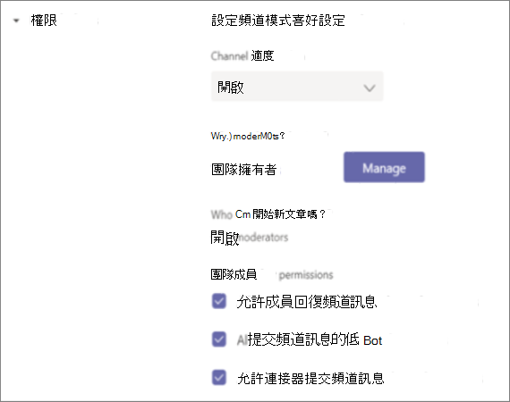

**步驟 2**：格式化郵件。
建立公告以通知小組成員重要新聞或動作。

   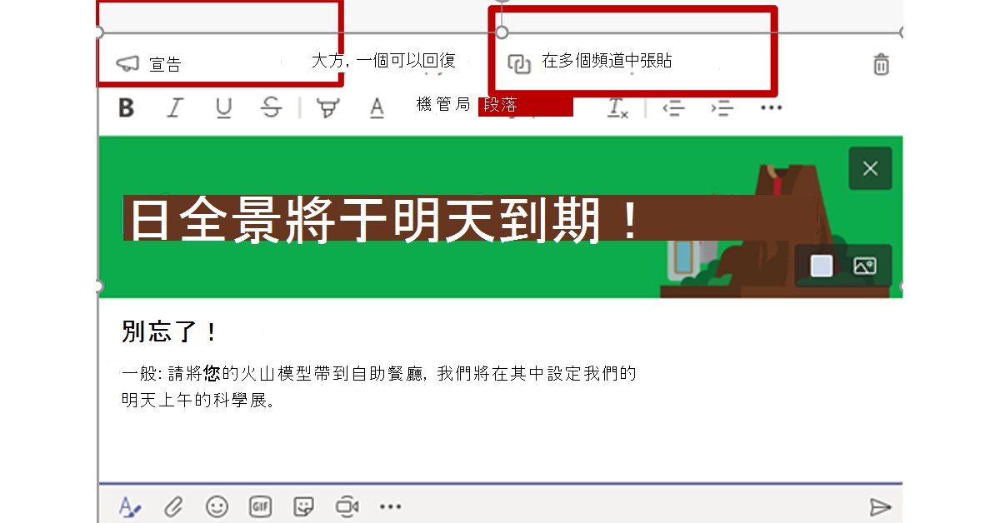

- 在頻道中，選取您輸入訊息的方塊下的格式。

- 在出現的方塊頂端，選取新交談旁的箭>公告。

- 輸入標題、變更其背景色彩，或新增標題區域的背景影像。

- 在新增子標題區域中輸入公告的主題，然後輸入郵件的內文，然後選取傳送按鈕。
    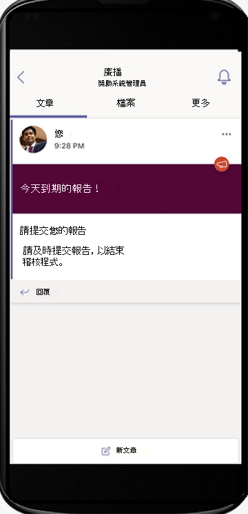

**步驟 3**：選取訊息廣播的頻道。

當您有重要公告Teams需要接觸大量人員的資訊時，您可以跨多個頻道和頻道進行交叉張貼。

  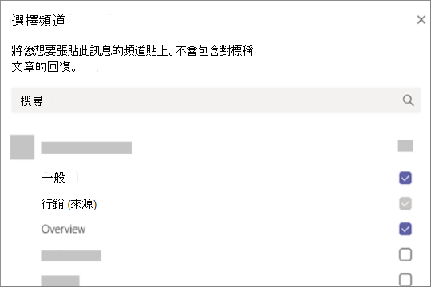

若要深入瞭解，請參閱在 Teams[中交叉張貼Teams](https://support.microsoft.com/office/cross-post-a-channel-conversation-in-teams-9c1252a3-67ef-498e-a7c1-dd7147b3d295?ui=en-us&rs=en-us&ad=us)。

## 在 Teams

當要完成工作時，正確的工具可以提高效率。 在 Kaizala中，您可以使用開箱即用[OOB](/kaizala/partnerdocs/kaizalaactioncards) (動作) ，讓日常工作管理更容易且更有效率。
Microsoft Teams提供數種功能與解決方案，以在 Kaizala 中提供開箱即用動作卡片。

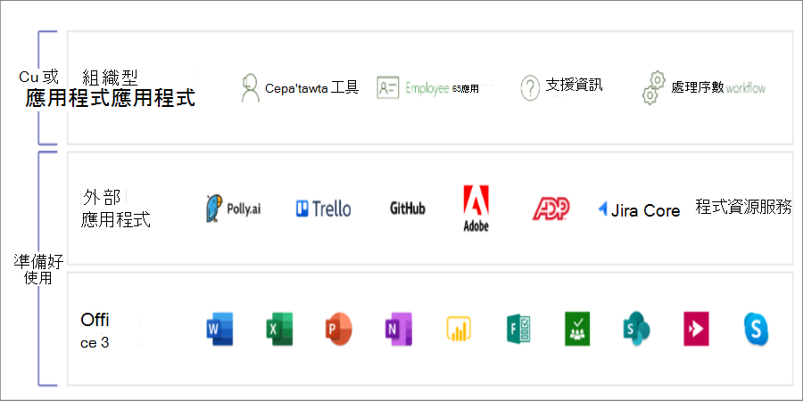

這個Teams平臺可讓您透過整合至 Microsoft Teams 應用程式和協力廠商應用程式Microsoft 365，使用現有的組織工具。 現在超過 300 個外部應用程式可在 Microsoft Teams。

### 投票、問卷和檢查清單Teams

[投票](https://github.com/OfficeDev/microsoft-teams-apps-poll/wiki)、[問卷](https://github.com/OfficeDev/microsoft-teams-apps-survey)和[檢查清單](https://github.com/OfficeDev/microsoft-teams-app-checklist)動作卡片現在可在 Teams[郵件](/microsoftteams/platform/messaging-extensions/what-are-messaging-extensions)擴充應用程式範本中GitHub。

**投票** 可讓使用者在聊天或頻道中快速建立和傳送投票，以知道他們的團隊意見。 所有平臺都支援投票應用程式 ，Teams、瀏覽器、iOS 和 Android 用戶端。 它已準備好做為您現有訂閱的一Microsoft 365部署

**問卷** 可讓使用者在聊天或頻道中建立問卷，以詢問一系列問題，並取得可採取動作的深入見解。 使用問卷 ： 註冊、註冊、意見回饋、見證、潛在客戶捕獲、報告、抱怨及評估。 所有平臺都支援問卷應用程式，Teams、瀏覽器、iOS 和 Android 用戶端。 它已準備好作為您現有訂閱的一Microsoft 365部署。

**檢查** 清單可讓您在聊天或頻道中建立共用檢查清單，以與您的小組共同合作。 所有平臺都支援檢查清單應用程式 ，Teams、瀏覽器、iOS 和 Android 用戶端。 它已準備好作為您現有訂閱的一Microsoft 365部署。

您也可以使用現有的協力廠商應用程式，立即將快速投票、問卷和檢查清單傳送Microsoft 365小組。

[Microsoft Forms](https://techcommunity.microsoft.com/t5/microsoft-forms-blog/microsoft-forms-works-great-with-microsoft-teams/ba-p/109915) 可讓您收集資訊，並快速做出決策。 將 Forms 整合Teams，您可以輕鬆地設定表單選項卡、為表單建立通知，以及進行快速投票。 若要瞭解操作方式，請參閱在表單中建立[、編輯及Microsoft Teams](https://support.microsoft.com/office/work-with-colleagues-to-create-edit-and-review-forms-in-microsoft-teams-333b97a3-41d9-48bc-a1cb-84a96bd44e14#:~:text=1%20In%20Teams%2C%20go%20to%20the%20channel%20you,name%20for%20your%20new%20form.%20More%20items...%20)。

協力廠商應用程式 ，例如 Polly 和 SurveyMonkey，讓您進一步使用您的Teams。

- **Polly**  可讓您透過完整的儀表板視圖，取得即時投票深入見解，以做出更好的商務決策，並測量整個投票中的團隊參與度。

- **SurveyMonkey** 將問卷帶到您目前業務Microsoft Teams，輕鬆新增問卷至您的日常工作流程。 從內部撰寫並傳送一個問題Microsoft Teams，然後觀看團隊成員提供的結果。

### 公司中的Teams

使用 **[Microsoft Planner](https://support.microsoft.com/office/organize-your-team-s-tasks-in-microsoft-planner-c931a8a8-0cbb-4410-b66e-ae13233135fb?ui=en-us&rs=en-us&ad=us)** 在 Teams。 您可以與小組在專案上共同作業、查看進度報告，以及追蹤個別作業。

當您使用Microsoft Teams時，您可以新增一或多個 Planner 定位停駐點至小組頻道，以整理工作。 然後，您可以在 Teams 內或 Planner 網頁中處理您的計畫、移除或刪除您的計畫，然後在 Teams 中在 Planner 中指派工作時收到通知。

### 在 Teams

與公司 [Communicator](/microsoftteams/platform/samples/app-templates#company-communicator) App 聊天，建立及傳送適用于多個團隊或大量員工的郵件。 其簡易介面可讓指定使用者以目標方式建立、預覽、共同合作及傳送郵件。 建立自訂的有目標通訊功能，例如自訂個人資料，瞭解有多少使用者認可或與訊息互動，並直接與管理決策相關的深入資訊。

### 相片簽入

使用智慧Teams相機來捕獲並共用有批註的影像與小組。 輕鬆精准分享您的位置，讓您的小組隨時瞭解。 需要擁有詳細資訊，以傳達Kaizala功能如何Teams。 在檔上，我們一定會有來自幻燈片組的資訊。

[使用員工簽入](/microsoftteams/platform/samples/app-templates#staff-check-ins)應用程式範本，讓前線員工能直接從公司直接在排定或臨時的基礎上，輕鬆提供時間關鍵型資訊和狀態Teams。 應用程式支援即時位置、相片、筆記、提醒通知和自動化工作流程。

### 測驗Teams

測驗是一[種](/microsoftteams/platform/messaging-extensions/what-are-messaging-extensions)Teams訊息擴充功能，可讓您在聊天或頻道中建立測驗，以取得知識檢查和立即結果。 您可以使用測驗進行測驗、進行班級和離線考試、在小組內進行知識檢查，以及進行小組內的有趣測驗。 測驗應用程式支援多個平臺，例如Teams、瀏覽器、iOS 和 Android 用戶端。 此 App 已準備就緒，可供您作為現有訂閱的一Microsoft 365部署。

[在 GitHub](https://github.com/OfficeDev/microsoft-teams-apps-quiz)

  

### 在 Teams

[使用教職員檢查應用程式](/microsoftteams/platform/samples/app-templates#staff-check-ins)範本，讓前線員工直接從公司直接在排定或臨時的基礎上，輕鬆提供時間關鍵型資訊和狀態Teams。 應用程式支援即時位置、相片、筆記、提醒通知和自動化工作流程。

使用 Teams，讓貴組織輕鬆進行訓練。 訓練是[一Teams訊息](/microsoftteams/platform/what-are-messaging-extensions)延伸應用程式，讓使用者在聊天或頻道中發佈訓練，以便進行離線知識共用和技能更新。 該應用程式支援跨多個Teams用戶端，例如桌面、瀏覽器、iOS 和 Android。 此應用程式已準備就緒，可供部署，做為您訂閱Microsoft 365的一部分。

[在 GitHub](https://github.com/OfficeDev/microsoft-teams-apps-training)

您可以提供上下文資訊存取權，以簡化上一步。  讓員工指南、訓練等更容易使用並更新，以透過技能提升貴組織的能力。 若要深入瞭解訓練案例，請參閱 [加入新員工](https://support.microsoft.com/office/effectively-onboard-new-employees-691faccd-1d1a-4f47-99ac-b6c82973f5ee)。

## 將Kaizala自訂解決方案移Microsoft Teams

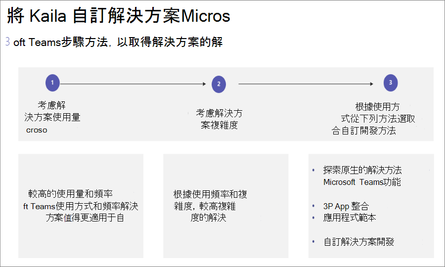

請遵循以下三個步驟的方法，以取得您的Microsoft Teams：

1. 考慮解決方案使用方式和頻率。

    解決方案的高使用量和頻率值得更有力的自訂開發案例。

2. 考慮解決方案複雜度。

    複雜度較高的解決方案可能需要更有力的自訂開發案例。

3. 探索下列每個使用頻率和複雜度的方法。

    - 使用原生應用程式[功能探索Microsoft Teams措施](/microsoftteams/platform/concepts/capabilities-overview)

    - 使用 [3P App 整合](deploy-apps-microsoft-teams-landing-page.md)

    - 探索 [應用程式範本](/microsoftteams/platform/samples/app-templates)

    - 建立 [自訂解決方案開發](/microsoftteams/platform/overview)

## 管理Microsoft Teams

### IT 專業人員

從系統管理入口網站Kaizala系統管理中心Microsoft Teams系統管理。 系統Teams管理中心主要供系統管理員角色使用。

系統管理員可以管理整個Teams工作量，或者他們可以委派許可權來疑難排解通話品質問題或管理貴組織的電話需求。

若要流覽系統管理中心，請流覽[Microsoft Teams系統管理中心](https://admin.teams.microsoft.com/)。

您可以使用合規性中心和安全性中心Microsoft 365監控[Microsoft 365的安全性](/microsoft-365/compliance/microsoft-365-compliance-center)[與合規性](/microsoft-365/security/defender/overview-security-center)。

在系統管理中心保護您的企業並Azure Active Directory使用者[，](https://aad.portal.azure.com/#@microsoft.onmicrosoft.com/dashboard/private/c7736064-7b28-4f3d-b366-2740a8d48020)您可以在此查看群組、身分識別、授權，以及跨 Microsoft 365。

## Kaizala 管理入口網站系統Teams管理中心

### 使用者指南

使用下表從管理入口網站流覽 Microsoft Teams中的Kaizala功能。

| Kaizala 管理入口網站 | Microsoft Teams應用程式|
|---------|-----------------------|
| 建立已 (組織群組)  | **透過桌面** 或行動應用程式建立團隊 |
| 大量新增使用者 | 若要將大量使用者新增到小組 ， 請考慮透過 O365 群組、O365 DLs 或安全性群組建立團隊 |
| 目錄 | 透過團隊中的搜尋欄 **搜尋您組織中** 任何人。 搜尋結果也會返回檔案、訊息和文章 |
| 分析 (動作卡片)  | **包含** 可 **下載資料** 的報告內建的投票、問卷和Checklistshave **。您也可以在** Tasksin planner的協助下指派 **工作。其他協力廠商應用程式 ，** 例如Trello **、** Wrike** 也可以輕鬆在 Microsoft Teams |
| 擴充功能 – 連接器 | 針對 **任何** 需要連接器的 (...) 功能表中的連接器選項。 |
| 使用方式 (使用方式) 採用報告、使用方式報告、活動報告 | 團隊擁有者可以從功能表流覽以存取其團隊的報告， (...) **管理團隊**  >  **分析**。 |

> [!NOTE]
> Teams使用者可以在桌面Teams或行動版上使用網路管理其個別團隊和頻道，而且不需要存取系統管理Teams中心。

## Kaizala群組解除

當您轉換至Teams和聊天時，您可能會考慮Kaizala群組解除關係，以確保貴組織有一個集中的通訊位置。 刪除群組Kaizala群組會從聊天清單中移除群組。 如果您是群組中的唯一系統管理員，您必須將系統管理員角色指派給群組中的至少一個人，才能刪除。

### 若要將群組Kaizala到Teams

 1. 與群組Teams共用Kaizala員

 2. 設定Teams網站

 3. 將使用者新Teams

 4. 宣佈切換到所有群組Kaizala成員

 5. 在設定中 [，將Kaizala群組切換](#to-switch-to-kaizala-group-to-read-only)為 **唯讀**

 6. 與群組成員分享Teams選擇的原因Kaizala選項

 7. 共用指導方針，例如，從何時Teams，以及如何使用Teams

 8. 啟動參與競賽

 9. 設定領導參與

 10. 向成員尋求意見

 11. 追蹤內容日曆

 12. [刪除Kaizala群組](#to-delete-a-group)

### 若要切換到 Kaizala群組為 **唯讀**

1. 請Kaizala管理入口網站。

2. 選取 **左側** 流覽面板上的群組定位點，選取要設為唯讀 **的群組**。

    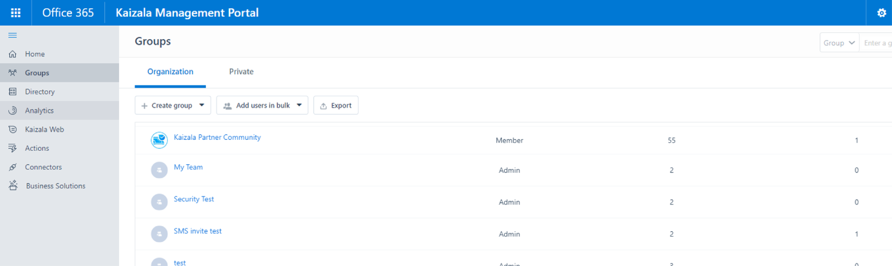

3. 從下拉式清單中，選取編輯 **策略**。
  
    

4. 在 **群組原則** 視窗中，取消勾選下列選項：

     - 允許新參與者查看聊天記錄。 他們將會看到從現在開始所送出的郵件。

     - 允許成員傳送郵件和附件。

       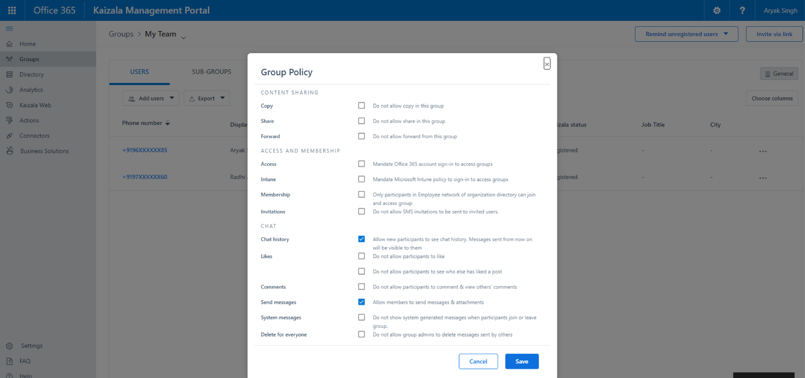

     > [!NOTE]
     > 系統管理員仍然可以在群組中張貼文章。

### 刪除群組

1. 從聊天清單中，按住群組交談。

2. 點一下刪除群組。

## 匯出Kaizala租使用者資料

做為Kaizala系統管理員/全域系統管理員，您可以從 Kaizala 管理入口網站匯出Kaizala租使用者資料。 使用 Teams，您仍然可以在 Kaizala 中維持公司資料的Kaizala。 詳細資訊，請參閱 [從管理入口網站匯出租使用者資料](/office365/kaizala/export-or-delete-your-data)。

### 匯出資料

 1. 選取 **左側流覽** 面板上的分析定位點，選擇匯出 **租使用者資料**。
  
    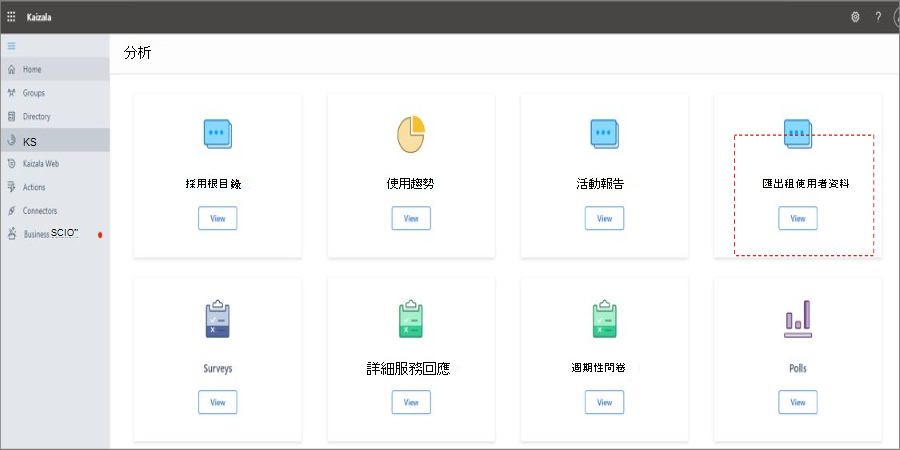

 2. 選取 **匯出**。

    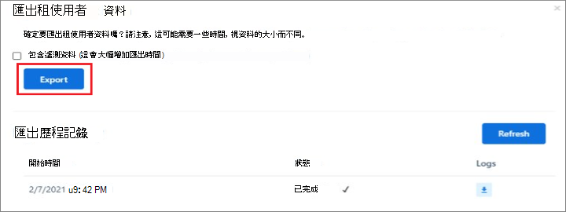

 3. 使用租使用者訊息檔案 - 使用群組名稱/時間戳記上的篩選來存取群組層級聊天資料。

    

## 刪除群組Kaizala群組

刪除群組Kaizala群組會從聊天清單中移除群組。 如果您是群組中的唯一系統管理員，您必須將系統管理員角色指派給群組中的至少一個人，才能刪除。

若要刪除群組：

- 從聊天清單中，按住群組交談。

- 點一下刪除群組。

## Kaizala租使用者資料匯出

使用 Teams，您仍然可以在 Kaizala 中維持公司資料的Kaizala。 詳細資訊，請參閱 [從管理入口網站匯出租使用者資料](/office365/kaizala/export-or-delete-your-data)。

## 與外部使用者 (廠商/供應商/合作夥伴) 

在公司中，與廠商、供應商、合作夥伴及其他外部使用者共同Microsoft Teams。 有了Teams，使用者能夠新增具有電話號碼的外部使用者。 此功能由 Microsoft Teams 連線 支援。 組織內的使用者可以使用工作與Teams通訊，Teams個人帳戶互通性。 您也可以使用Teams或正式電子郵件，在來賓存取中完成外部使用者共同合作。 支援跨團隊和頻道的公告跨Teams。 例如：您的供應商和廠商可以在頻道或團隊之間Teams公告。 請[流覽傳送公告至頻道](https://support.microsoft.com/office/send-an-announcement-to-a-channel-8f244ea6-235a-4dcc-9143-9c5b801b4992)，進一Teams。

## 什麼是外部存取Teams？

外部存取是一種讓整個外部網域的 Teams 使用者可以在 Teams 中尋找、通話、聊天以及與您進行會議的方式。 若要深入瞭解管理外部存取，請流覽 [管理外部存取](/microsoftteams/manage-external-access)。

## 什麼是來賓存取Teams？

使用 [來賓存取](/MicrosoftTeams/guest-access)，您可以為組織外部人員提供團隊、頻道中的檔、資源、聊天和應用程式存取權，同時維持公司資料的控制權。 在來賓中新增來賓不需要Teams。

## 神秘中的來賓Teams？

來賓不是員工或貴組織的成員。 他們沒有貴組織的工作帳戶。 例如，來賓可能包括有合作夥伴、廠商、供應商或顧問。
任何不是貴組織成員的人，都可以在[Teams。](/MicrosoftTeams/guest-access#how-a-guest-becomes-a-member-of-a-team) 這表示任何擁有商務帳戶 (即 Azure Active Directory 帳戶) 或消費者電子郵件帳戶 (例如 outlook.com、gmail.com 等) 的人都可以以來賓的存取團隊和頻道體驗參與 Teams。

## 後續步驟

[Microsoft Teams前線員工使用](/MicrosoftTeams/drive-adoption-optimize-kaizala)
