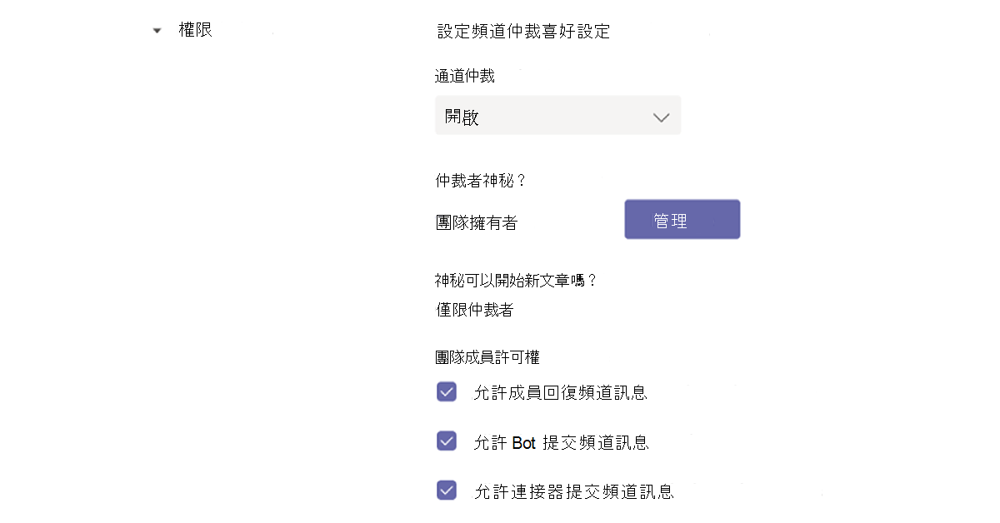
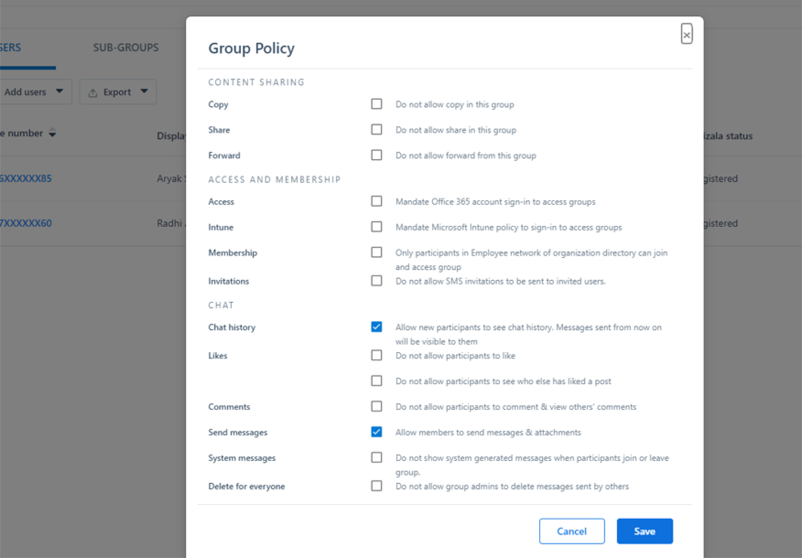

# 流覽Microsoft Teams

現在，您已清楚瞭解貴組織的獨特路徑和需求，就可以開始與Microsoft Teams進行強大的共同作業。 請使用下節來瞭解如何在Teams中流覽Kaizala功能。

| 從 Kaizala | 若要Teams |
|---------|-----------------------|
| 快速入門 – 登入和設定檔設定| [開始使用 Teams](#getting-started) |
| 啟動新聊天、1：1 音訊和視訊通話 | [在Teams、音訊和視訊通話中聊天](#starting-new-chats-11-audio-and-video-calls) |
| 您的Kaizala群組| [將Kaizala群組移至Teams](#moving-your-kaizala-groups-to-microsoft-teams) |
| 模仿消費者應用程式訊息體驗| [模仿消費者應用程式訊息體驗](#mimic-the-consumer-app-messaging-experience) |
| [開箱動作] 卡片 |  [在 Teams 中完成工作](#getting-work-done-in-teams) |
| 投票、問卷、檢查清單| [在 Teams 中執行投票、問卷、檢查清單](#polls-surveys-and-checklists-in-teams) |
| 會議 - 動作卡片| [讓我們開會 – Teams 中的會議](#getting-work-done-in-teams) |
| 公告 - 動作卡片| [Teams 中的公告](#announcements-in-teams) |
| 相片簽入動作卡片| [Teams 中的相片簽入](#photo-check-ins)
| 測驗 - 動作卡片| [Teams 中的測驗](#quiz-in-teams)
| 訓練 - 動作卡片| [Teams中的訓練](#training-in-teams) |
| 您的自訂動作卡片 | [Teams 中的自訂解決方案](#moving-kaizala-custom-solutions-to-microsoft-teams) |
| Kaizala管理入口網站| [適用于 IT 專業人員](#it-professionals) |
| | [適用于使用者](#end-user-guidance) |
| Kaizala群組作業| [Kaizala群組作業](#kaizala-group-dissolution) |
| Kaizala租使用者資料匯出]| [匯出Kaizala租使用者資料](#export-kaizala-tenant-data)  |
| 與外部使用者共同作業 (廠商/供應商/合作夥伴) | [新增或邀請Teams組織外部的人員加入聊天](#collaborating-with-external-usersvendorssupplierspartners) |

## 消費者入門

透過我們的快速入門手冊，開始從Kaizala移至Teams比以往更簡單。 若要深入瞭解如何開始您的Microsoft Teams之旅，請參閱[開始使用Teams](https://support.microsoft.com/office/start-and-pin-chats-a864b052-5e4b-4ccf-b046-2e26f40e21b5?wt.mc_id=otc_microsoft_teams&ui=en-us&rs=en-us&ad=us)。

## 開始新的聊天、1 對 1 音訊和視訊通話

建立一對一或群組聊天，以與較小的群組共同作業，或在Teams內私下交談。 您可以釘選聊天並儲存訊息以快速存取。 若要開始與我們的 RTF 文字格式設定、Emoji 和 gif 聊天，請參閱[在 Teams 中聊天](https://support.microsoft.com/office/start-and-pin-chats-a864b052-5e4b-4ccf-b046-2e26f40e21b5?wt.mc_id=otc_microsoft_teams&ui=en-us&rs=en-us&ad=us)。

與貴組織中的任何人進行一對一或群組通話，有效率地進行溝通。 透過Teams，您可以彈性地進行音訊和視訊通話。  若要開始使用，請參閱 [撥打電話](https://www.microsoft.com/videoplayer/embed/RE4rxv0?pid=ocpVideo0-innerdiv-oneplayer&postJsllMsg=true&maskLevel=20&market=en-us)。

您可以透過在 Teams 中建立Teams、頻道和群組聊天，從Kaizala群組移至Microsoft Teams。

Teams是組織中圍繞不同專案和結果的人員、內容和工具集合。

Teams由 **頻道** 組成，頻道是您與小組成員所進行的主題特定交談。 每個頻道都專屬於特定主題、部門或專案。 當使用應用程式延伸時，通道最有價值。 若要深入瞭解，請參閱 [在頻道中工作](https://support.microsoft.com/office/teams-and-channels-df38ae23-8f85-46d3-b071-cb11b9de5499?ui=en-us&rs=en-us&ad=us#ID0EAABAAA=Work_in_channels)。

**群組聊天** 可讓您收集同事快速擠在立即訊息上。

### Teams聊天與團隊頻道中的交談

|聊天中的交談 | 團隊頻道中的交談 |
|---------|---------|
|針對輕量型交談，您可以直接傳送訊息給收件者。   | 針對在開放空間中討論多個主題的互動。  |
|只有聊天中的人員才能看到私人聊天     | 團隊中的每個人都看得見        |
|一個連續、未讀取的交談     | 結構化的多個對話串交談        |
|最多 250 人     | 最多 25，000 人        |
|選擇您是否要與新的聊天參與者共用聊天記錄     | 歷程記錄會與所有新的小組成員共用        |
|新的聊天收件者必須由已加入聊天的人員新增     | 使用者可以搜尋團隊來加入團隊。 在私人Teams中，系統管理員Teams核准新成員。 頻道成員可以產生程式碼，讓新成員直接加入而不需系統管理員核准。        |
|在特別畫面上共用，以及音訊和視訊通話。 輕鬆排程與所有聊天參與者Teams會議     | 現場和排定的音訊和視訊通話        |
|應用程式的一些擴增性     | 應用程式的完整擴充性和自訂功能        |

如需Teams、頻道和群組聊天的概觀，請參閱[Microsoft Teams中的團隊和頻道](teams-channels-overview.md)。

## 將Kaizala群組移至Microsoft Teams

在Kaizala中，群組是人員的集合。 Kaizala中有三種類型的群組結構：平面群組、階層群組和廣播群組。 當您轉換到Microsoft Teams時，您可以使用Teams、頻道和群組聊天來為組織建立類似的通訊結構。

使用以下指導方針，取得從群組切換到Teams、頻道和群組聊天的指示。

有兩種方式可以將Kaizala平面群組移到Teams：

- 選項 1：在 Teams 中從Kaizala平坦的群組切換到群組聊天

- 選項 2：從Kaizala平坦的群組切換到Teams團隊

**選項 1：在 Teams 中從Kaizala平坦的群組切換到群組聊天**

您可以建立Teams群組聊天，與最多 250 個參與者進行快速的交會和暫時性交談。 群組聊天可讓貴組織中的人員有一個開放式交談的中心位置，讓任何人都可以加入聊天。

1. 開始並命名群組聊天。

    

    可以存取群組聊天的每個人都可以 [傳送訊息](https://support.microsoft.com/office/send-and-read-messages-in-teams-b29e60ec-76af-4d97-8c3c-a4e36f2b64aa?ui=en-us&rs=en-us&ad=us)。

2. 將人員新增至交談。

    
    
   將某人新增至群組聊天 (不是一對一) 時，您可以包含 **聊天記錄** 和您要與他們共用 **的歷程記錄持續時間** 。

3. 管理群組聊天。
  
    
    
   若要查看群組聊天中的人員，請將游標暫留在聊天標題中的參與者數目上，以顯示每個人的姓名清單。

**選項 2：從Kaizala平坦的群組切換到Teams團隊**
   
針對目標大型群組通訊，您可以為單一群組建立小組。 您最多可以新增 25，000 個成員，以對話串交談進行結構化溝通。 這種類型的通訊可讓仲裁與系統管理角色確保運作順暢。

1. 建立團隊：若要在Teams中啟動並執行，您應該建立團隊、新增人員，以及新增頻道。 若要深入瞭解，請參閱 [您的第一個團隊](get-started-with-teams-create-your-first-teams-and-channels.md)。
2. 檢閱團隊擁有者指南：

身為 [團隊擁有者](https://support.microsoft.com/office/go-to-guide-for-team-owners-92d238e6-0ae2-447e-af90-40b1052c4547?ui=en-us&rs=en-us&ad=us)，您可以新增成員和來賓、將成員變更為擁有者、管理頻道和設定，以及封存不再使用的團隊。

3. 將大量成員新增至團隊：

    如果您是團隊擁有者，請移至團隊清單中的團隊名稱，然後選取 [ **其他選項]** 按鈕>然後選取 **[新增成員]**。

    

    您可以開始輸入通訊群組清單、安全性群組或Microsoft 365組以新增至您的小組。 若要深入瞭解，請參閱[在 Teams 中新增成員至團隊](https://support.microsoft.com/office/add-members-to-a-team-in-teams-aff2249d-b456-4bc3-81e7-52327b6b38e9?ui=en-us&rs=en-us&ad=us)。

### 模仿消費者應用程式訊息體驗

如果您偏好為使用者提供簡化的體驗，可以選擇設定貴組織的Teams體驗，以模擬使用者已經在使用的消費者工具。

我們建議您為Kaizala使用者開始Teams之旅，在 **聊天中顯示最愛的頻道** 可簡化通訊，而 Shifts (選擇性) 。

以下是小組與 **Shifts** 介面的範例：

以下是 **不含 Shifts** 的 Teams 介面範例：

 

> [!NOTE]
> 您可以移除 [Teams] 按鈕的存取權，為 [前線] 工作人員建立簡化的介面，只有醒目提示的頻道會顯示在聊天上方。 若要深入瞭解，請參閱[管理Teams中的訊息原則](messaging-policies-in-teams.md)。

### 使用Teams和頻道建立階層式群組結構

在Kaizala中，階層式群組可讓貴組織根據成員之間的通訊類型，在不同的群組結構中互動。  在Teams中，您可以建立Teams和頻道來比對組織結構，並設定階層式通訊。 您可以在Teams內使用階層結構來提醒成員所需的動作、重要消息和更新。

若要深入瞭解，請參閱[我們在 Microsoft Teams 中組織團隊的最佳做法](best-practices-organizing.md)。

### 使用Teams和頻道廣播重要新聞

在Kaizala廣播群組中，系統管理員可以傳送訊息和動作給目標群組。 同樣地，您可以跨多個頻道張貼，以在Teams中廣播訊息。 若要直接留意重要訊息，請建立公告貼文。

頻道仲裁可讓您控制誰可以張貼及回復訊息。 您可以跨團隊選擇頻道，讓廣播人員接觸更多觀眾。 您可以限制公告上的互動，只允許選取管理員和仲裁者能夠回復。 請依照下列步驟在Teams頻道中建立頻道仲裁。

**步驟 1**：設定通道仲裁。

- 選取要廣播的頻道

- 選取 **[頻道設定]** 以設定仲裁

- 流覽至「仲裁者神秘？」 手動選取頻道的仲裁者

**步驟 2**：設定郵件格式。
建立公告以通知小組成員重要新聞或動作。

   

- 在頻道中，在您輸入訊息的方塊底下選取 [格式]。

- 在出現的方塊頂端，選取 [新交談] 旁的箭號>宣告]。

- 輸入標題、變更其背景色彩，或為標題區域新增背景影像。

- 在 [新增子標題] 區域中輸入公告的主旨，然後輸入郵件內文，然後選取 [傳送] 按鈕。

    

**步驟 3**：選取訊息廣播的頻道。

當您有需要與大量人員聯繫的重要公告和資訊時，您可以跨多個Teams和頻道交互張貼。

  

若要深入瞭解，請參閱[在 Teams 中交互張貼頻道交談](https://support.microsoft.com/office/cross-post-a-channel-conversation-in-teams-9c1252a3-67ef-498e-a7c1-dd7147b3d295?ui=en-us&rs=en-us&ad=us)。

## 在 Teams 中完成工作

完成工作時，適當的工具可以提高效率。 在 Kaizala 中，您可以使用全[新 (OOB) 動作卡片](/kaizala/partnerdocs/kaizalaactioncards)，讓日常工作管理更輕鬆且有效率。
Microsoft Teams在 Kaizala 中提供多種「隨選即用」動作卡片的功能和解決方案。

Teams平臺可讓您透過整合至Microsoft Teams，以及現成的Microsoft 365應用程式和協力廠商應用程式，來使用現有的組織工具。 Microsoft Teams現在有超過 800 個外部應用程式可供使用。

### Teams中的投票、問卷和檢查清單

[投票](https://github.com/OfficeDev/microsoft-teams-apps-poll/wiki)、[問卷](https://github.com/OfficeDev/microsoft-teams-apps-survey)和[檢查清單](https://github.com/OfficeDev/microsoft-teams-app-checklist)動作卡現在已可在 GitHub 上安裝[Teams訊息擴充](/microsoftteams/platform/messaging-extensions/what-are-messaging-extensions)功能應用程式範本。

**投票** 可讓使用者在聊天或頻道中快速建立及傳送投票，以瞭解其小組的意見。 投票應用程式支援所有平臺，Teams桌面、瀏覽器、iOS和Android用戶端。 它已準備好做為現有Microsoft 365訂閱的一部分進行部署

**問卷** 可讓使用者在聊天或頻道中建立問卷，以詢問一系列問題並取得可採取動作的深入解析。 使用問卷調查：註冊、註冊、意見反應、見證、潛在客戶擷取、報告、抱怨和評估。 問卷應用程式支援所有平臺，包括桌面Teams、瀏覽器、iOS和Android用戶端。 它已準備好做為現有Microsoft 365訂閱的一部分進行部署。

**檢查清單** 可讓您透過在聊天或頻道中建立共用檢查清單，與您的小組共同作業。 所有平臺都支援檢查清單應用程式，Teams桌面、瀏覽器、iOS和Android用戶端。 它已準備好做為現有Microsoft 365訂閱的一部分進行部署。

您也可以使用現有的Microsoft 365和協力廠商應用程式，立即傳送快速投票、問卷和檢查清單給您的小組。

[Microsoft Forms](https://techcommunity.microsoft.com/t5/microsoft-forms-blog/microsoft-forms-works-great-with-microsoft-teams/ba-p/109915)可讓您收集資訊並快速做出決策。 透過整合至Teams的表單，您可以輕鬆設定 [表單] 索引標籤、建立表單的通知，以及進行快速投票。 若要瞭解作法，請參閱[在 Microsoft Teams 中建立、編輯和檢閱表單](https://support.microsoft.com/office/work-with-colleagues-to-create-edit-and-review-forms-in-microsoft-teams-333b97a3-41d9-48bc-a1cb-84a96bd44e14#:~:text=1%20In%20Teams%2C%20go%20to%20the%20channel%20you,name%20for%20your%20new%20form.%20More%20items...%20)。

投票和 SurveyMonkey 等協力廠商應用程式可讓您使用Teams進一步進行投票和問卷。

- **投票**  可讓您取得即時投票深入解析，以透過完整的儀表板檢視來做出更佳的商務決策，並測量跨投票的小組參與度。

- **SurveyMonkey** 會將問卷帶入您在Microsoft Teams中已經在執行業務的地方，讓您輕鬆地將問卷新增至您的日常工作流程。 從Microsoft Teams內撰寫並傳送快速的單一問題投票，然後觀看小組成員提供的結果。

### Teams中的工作

使用 **[Microsoft Planner 在 Teams](https://support.microsoft.com/office/organize-your-team-s-tasks-in-microsoft-planner-c931a8a8-0cbb-4410-b66e-ae13233135fb?ui=en-us&rs=en-us&ad=us)** 中執行工作。 您可以與小組在專案上共同作業、查看進度報告，以及追蹤個別工作分派。

使用Microsoft Teams時，您可以新增一或多個 Planner 索引標籤至團隊頻道來整理工作。 然後，您可以從Teams或 Planner 網頁版中處理您的計畫、移除或刪除您的計畫，並在Teams在 Planner 中指派工作給您時收到通知。

### Teams 中的公告

透過與 [公司 Communicator](/microsoftteams/platform/samples/app-templates#company-communicator) 應用程式聊天，建立和傳送適用于多個小組或大量員工的訊息。 其簡易介面可讓指定的使用者以目標化的方式建立、預覽、共同作業及傳送郵件。 建立自訂目標通訊功能，例如針對有多少使用者認可訊息或與訊息互動時的自訂個人資料，以及直接與管理決策相關的深入解析。

### 相片簽入

使用Teams智慧相機來擷取並與您的小組共用注釋影像。 精確地輕鬆分享您的位置，讓您的小組掌握最新資訊。 需要有更多資訊，以傳達Kaizala功能如何對應至Teams。 絕對會有投影片組中盡可能多的資訊到檔中。

[使用 [教職員簽](/microsoftteams/platform/samples/app-templates#staff-check-ins)到] 應用程式範本，讓前線員工直接從Teams，以排程或臨機操作的方式輕鬆提供時間關鍵資訊和狀態更新。 應用程式支援即時位置、相片、筆記、提醒通知和自動化工作流程。

### Teams 中的測驗

測驗是自訂[Teams訊息擴充功能](/microsoftteams/platform/messaging-extensions/what-are-messaging-extensions)，可讓您在聊天或頻道中建立測驗，以進行知識檢查和即時結果。 您可以使用測驗進行課程和離線測驗、小組內的知識檢查，以及團隊內有趣的測驗。 測驗應用程式支援跨多個平臺，例如Teams桌面、瀏覽器、iOS和Android用戶端。 此應用程式已準備好做為現有Microsoft 365訂閱的一部分來部署。

[在 GitHub 上取得](https://github.com/OfficeDev/microsoft-teams-apps-quiz)

  

### Teams中的訓練

[使用 [教職員檢查](/microsoftteams/platform/samples/app-templates#staff-check-ins)] 應用程式範本，讓前線員工能夠直接從Teams直接在排程或臨機操作中輕鬆提供時間關鍵資訊和狀態更新。 應用程式支援即時位置、相片、筆記、提醒通知和自動化工作流程。

使用Teams讓貴組織輕鬆進行訓練。 訓練是自訂[Teams訊息延伸](/microsoftteams/platform/what-are-messaging-extensions)應用程式，可讓使用者在聊天或頻道中發佈訓練，以便離線知識分享和更新。 應用程式支援跨多個Teams平臺用戶端，例如桌上型電腦、瀏覽器、iOS和Android。 此應用程式已準備好做為您Microsoft 365訂閱的一部分來部署。

[在 GitHub 上取得](https://github.com/OfficeDev/microsoft-teams-apps-training)

您可以提供內容相關資訊的存取權，以簡化上執行緒序。  讓員工指南、訓練，以及更輕鬆且更最新地使用，以透過技能提升貴組織的能力。 若要深入瞭解訓練案例，請參閱 [入職新員工](https://support.microsoft.com/office/effectively-onboard-new-employees-691faccd-1d1a-4f47-99ac-b6c82973f5ee)。

## 將Kaizala自訂解決方案移至Microsoft Teams

請按照以下三個步驟的方法來取得Microsoft Teams的解決方案：

1. 考慮解決方案使用方式和頻率。

    高使用量和解決方案頻率對於自訂開發而言是較強的優點。

2. 考慮解決方案複雜度。

    複雜度較高的解決方案可能更適合用於自訂開發。

3. 根據使用頻率和複雜度，探索下列方法。

    - 運用原生Microsoft Teams功能

    - 使用 [協力廠商應用程式整合和探索 App Store](deploy-apps-microsoft-teams-landing-page.md)

    - 探索 [應用程式範本](/microsoftteams/platform/samples/app-templates)

    - [使用 Teams 平臺建立自訂應用程式](/microsoftteams/platform/overview)

## Microsoft Teams中的管理

### IT 專業人員

從Kaizala管理入口網站進行系統管理轉換到Microsoft Teams 管理員中心。 Teams系統管理中心主要僅供系統管理員角色使用。

系統管理員可以管理整個Teams工作負載，也可以擁有針對通話品質問題進行疑難排解或管理貴組織電話語音需求的委派許可權。

若要流覽系統管理中心，請[流覽Microsoft Teams 管理員中心。](https://admin.teams.microsoft.com/)

您可以透過Microsoft Purview 合規性入口網站和[Microsoft 資訊安全中心](/microsoft-365/security/defender/overview-security-center)監控貴組織在Microsoft 365的安全[性與合規](/microsoft-365/compliance/microsoft-365-compliance-center)性。

您可以在[Azure Active Directory系統管理中心](https://aad.portal.azure.com/#@microsoft.onmicrosoft.com/dashboard/private/c7736064-7b28-4f3d-b366-2740a8d48020)檢閱群組、身分識別、授權和跨Microsoft 365存取權，以保護您的業務並增強使用者的能力。

## Kaizala 管理入口網站Teams 管理員中心

### 使用者指引

使用下表，從Kaizala管理入口網站流覽Microsoft Teams中的對應功能。

| Kaizala 管理入口網站 | Microsoft Teams應用程式|
|---------|-----------------------|
| 建立 (連線到組織的群組)  | 透過傳統型或行動應用程式 **建立團隊** |
| 大量新增使用者 | 若要將大量使用者新增至團隊，請考慮透過 O365 群組、O365 DLS 或安全性群組建立團隊 |
| 目錄 | 透過團隊中的 **搜尋列搜尋** 組織中的任何人。 搜尋結果也會傳回檔案、訊息和文章 |
| 分析 (動作卡片)  | **投票**、 **問卷** 和 **檢查清單** 已內建含有可下載資料的報告。 您也可以在Teams中的工作應用程式的協助下指派工作，供使用者使用。 如需更多案例，您也可以探索 **Trello**、**Asana** 等協力廠商應用程式，以供Teams使用。 |
| 擴充功能 – 連接器 | 針對任何需要連接器的頻道，請使用功能表 (...) 的 [ **連接器** ] 選項。 |
| [分析 (使用方式) 採用報告](teams-analytics-and-reports/view-analytics.md)、 [使用方式報告](teams-analytics-and-reports/teams-usage-report.md)、 [活動報告](teams-analytics-and-reports/user-activity-report.md) | 團隊擁有者可以流覽功能表 (...) 來 **管理團隊**  >  **分析**，以存取團隊的報告。 |

> [!NOTE]
> Teams使用者可以在桌上型電腦或行動裝置上使用Teams來管理個別團隊和頻道，而且不需要存取Teams 管理員中心。

## Kaizala群組作業

當您轉換到Teams頻道和聊天時，您可以考慮Kaizala群組註冊，以確保貴組織有一個集中通訊位置。 刪除Kaizala群組會從 [聊天] 清單中移除該群組。 如果您是群組中的唯一系統管理員，您必須先將系統管理員角色指派給群組中的至少一個人，才能刪除。

### 若要將Kaizala群組移至Teams

 1. 與Kaizala群組成員分享Teams挑逗

 2. 設定Teams網站

 3. 將使用者新增至Teams

 4. 宣告切換到所有Kaizala群組成員

 5. 在設定中，[將Kaizala組切換](#to-switch-to-kaizala-group-to-read-only)為 **唯讀**

 6. 與Kaizala群組成員分享Teams是更好選項的原因

 7. 請分享指導方針，例如，從何時可以使用Teams，以及如何使用Teams

 8. 啟動參與競賽

 9. 設定領導參與

 10. 向成員尋求意見反應

 11. 追蹤內容行事曆

 12. [刪除Kaizala組](#to-delete-a-group)

### 將 [Kaizala] 群組切換為 **[唯讀]**

1. 登入Kaizala管理入口網站。

2. 選取左側流覽面板上的 [ **群組** ] 索引標籤，選取您要設為 [ **唯讀] 的** 群組。

    

3. 從下拉式清單中，選取 **[編輯原則]**。
  
    

4. 在 **群組原則** 視窗中，取消核取下列選項：

     - 允許新參與者查看聊天記錄。 從現在開始傳送的郵件將會顯示出來。

     - 允許成員傳送郵件和附件。

       

     > [!NOTE]
     > 系統管理員仍然可以在群組中張貼文章。

### 刪除群組

1. 從 [聊天] 清單中，長按群組交談。

2. 點選 [刪除群組]。

## 匯出Kaizala租使用者資料

身為Kaizala租使用者系統管理員/全域系統管理員，您可以從Kaizala管理入口網站匯出Kaizala租使用者資料。 使用Teams時，您仍然可以在 Kaizala 中維持對公司資料的控制權。 如需詳細資訊，請參閱 [從管理入口網站匯出租使用者資料](/office365/kaizala/export-or-delete-your-data)。

### 若要匯出資料

 1. 選取左側流覽面板上的 [ **分析]** 索引標籤，選擇 [ **匯出租使用者資料]**。
  
    

 2. 選取 [ **匯出]**。

    

 3. 使用租使用者訊息檔案：使用群組名稱/時間戳記上的篩選來存取群組層級聊天資料。

    

## 刪除Kaizala群組

刪除Kaizala群組會從 [聊天] 清單中移除該群組。 如果您是群組中的唯一系統管理員，您必須先將系統管理員角色指派給群組中的至少一個人，才能刪除。

若要刪除群組：

- 從 [聊天] 清單中，長按群組交談。

- 點選 [刪除群組]。

## Kaizala租使用者資料匯出]

使用Teams時，您仍然可以在 Kaizala 中維持對公司資料的控制權。 如需詳細資訊，請參閱 [從管理入口網站匯出租使用者資料](/office365/kaizala/export-or-delete-your-data)。

## 與外部使用者共同作業 (廠商/供應商/合作夥伴) 

Microsoft Teams提供與外部方共同作業的安全解決方案，而透過Microsoft Teams Connect，我們更輕鬆地與組織外部的任何人合作。 Teams能讓商業使用者與外部商業使用者聊天，也就是其他組織中的商業使用者。 以此許可權為基礎，我們可讓您與組織外部的小組成員聊天，即使他們使用Teams個人帳戶。 這些帳戶經常由 SMB 使用，因此這項新功能可協助您加強與外部合作夥伴的關係。

如[前所述](https://techcommunity.microsoft.com/t5/microsoft-teams-blog/microsoft-ignite-fall-2021-innovations-coming-to-microsoft-teams/ba-p/2824127)，您可以輸入您要連絡的完整電子郵件地址或電話號碼，邀請任何Teams使用者聊天，並與擁有 Microsoft 個人帳戶的任何人開始一對一或群組聊天，而不需要切換租使用者。

不需要切換租使用者即可與外部使用者交談，可讓您更快取得所需的結果。 讓我們仔細瞭解它的運作方式。

根據貴組織的系統管理設定以及Teams個人帳戶使用者，您可以開始與外部Teams個人帳戶使用者進行交談，而外部Teams個人帳戶使用者可以開始與工作使用者Teams交談。

Teams由組織管理的使用者可以輸入完整的電子郵件地址或電話號碼，邀請Teams要與其聊天的個人帳戶使用者。 Teams個人使用者可以輸入他們要連絡之使用者的確切組織電子郵件地址，並嘗試開始聊天。

如果您要聊天的人員尚未Teams使用者，他們會收到一封電子郵件或簡訊，邀請他們使用個人帳戶加入交談。 當他們註冊並登入其Teams個人帳戶時，就可以加入聊天。

一旦您邀請的人員接受邀請，您就可以開始新的一對一或群組聊天，或甚至將他們新增到現有的外部群組聊天。 此聊天討論串會與其他聊天一起顯示，而不需要切換以檢視聊天的租使用者。

做為聊天的一部分，您可以傳送和接收豐富的訊息、GIF 和媒體來表達自己。

您可以選擇只保留在您想要加入的交談中。 您可以封鎖來自外部使用者的訊息，或離開群組聊天。

Teams由組織管理的使用者以及Teams個人帳戶使用者可以選擇拒絕外部邀請。 一個使用者最多可以在接受前傳送 10 次訊息給外部使用者，但如果 10 封郵件之後無法接受，您將無法傳送其他訊息給此使用者。

檢視[支援頁面](https://support.microsoft.com/en-us/office/add-or-invite-people-outside-your-teams-org-to-a-chat-6897ab47-9f60-4db6-8b95-18599714fe57)並閱讀[部落](https://techcommunity.microsoft.com/t5/microsoft-teams-blog/microsoft-teams-users-can-now-chat-with-any-teams-user-outside/ba-p/3070832)格，以深入瞭解Teams如何讓您在受信任Teams工作區的安全性與安全性範圍內，與外部客戶和合作夥伴順暢地共同作業。

## 後續步驟

[第Microsoft Teams線工作人員的Microsoft Teams](/MicrosoftTeams/drive-adoption-optimize-kaizala)
