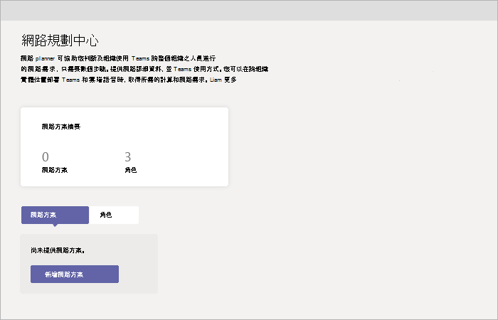

# 使用 Microsoft 團隊的網路 planner

網路 Planner 是團隊系統管理中心提供的新工具。 您可以前往 **規劃**  >  **網路 planner** 找到它。 網路 Planner 只需要幾個步驟，就能協助您決定並組織在整個組織中連線 Microsoft 團隊使用者的網路需求。 當您提供您的網路詳細資料和團隊使用量時，網路 Planner 會計算您的網路需求，以便在整個組織的物理位置部署團隊和雲端語音。

網路 planner 可讓您：

- 使用網站和 Microsoft 建議角色，為您的組織建立代表， (office 工人、遠端工作者及團隊聊天室系統) 。

    > [!NOTE]
    > 根據來自團隊最佳使用案例的資料，以及一般使用模式所開發的建議角色。 不過，除了三個建議的角色之外，您還可以建立最多三個自訂角色。

- 產生報告並計算團隊使用量的頻寬需求。

若要使用網路 planner，您必須是全域系統管理員、團隊服務系統管理員或團隊通訊系統管理員。

## 建立自訂角色

請依照下列步驟來建立自訂角色：

1. 移至 Microsoft 團隊系統管理中心的 [網路 planner]。

2. 在 [ **角色** ] 索引標籤上，按一下 [ **+ 自訂角色**]。 

3. 在 [ **新增自訂角色** ] 窗格中，為新的角色新增名稱和描述。

4. 選取此角色將在組織中使用的許可權。

5. 按一下 [儲存]。

## 建立您的計畫

請依照下列步驟開始建立您的網路方案：

1. 移至 Microsoft 團隊系統管理中心的 [網路 planner]。

2. 在 [ **網路方案** ] 索引標籤上，按一下 [ **新增網路方案**]。

3. 輸入您的網路方案的名稱和描述。 網路方案會出現在可用方案清單中。

4. 按一下方案名稱以選取新方案。

5. 新增網站以建立貴組織網路設定的表示。

    視貴組織的網路而定，您可能會想要使用網站來代表組建、辦公室位置或其他內容。 網站可能是由 WAN 連線來允許共用網際網路和/或 PSTN 連線。 為了獲得最佳結果，請先建立擁有本機連線的網站，然後再建立可遠端連線至網際網路或 PSTN 的網站。

    若要建立網站：

    1. 為您的網站新增名稱和描述。

    2. 在 [ **網路設定**] 底下，將該網站的網路使用者數量加上 (必要) 。

    3. 新增網路詳細資料： WAN 啟用、WAN 容量、網際網路出口 (**本機** 或 **遠端**) ，以及 PSTN 出口 (無、本機或遠端) 。

      > [!NOTE]
      > 您必須新增 WAN 和網際網路容量數位，才能查看您產生報告時的特定頻寬建議。

    4. 按一下 [儲存]。

## 建立報表

新增所有網站之後，您可以建立報表，如下所示。

1. 在 [ **報表** ] 索引標籤上，按一下 [ **啟動報表**]。

2. 針對您建立的每個網站，散佈各個可用角色的使用者數目。 如果您使用 Microsoft 建議的角色，該數位會自動散佈 (80% office worker 和20% 的遠端工作) 。

3. 完成發佈之後，按一下 [ **產生報表**]。

    產生的報告將會顯示幾個不同視圖的頻寬需求，讓您可以清楚地瞭解輸出：
    - 含個別計算的表格將會顯示每個允許活動的頻寬需求。
    - [其他] 視圖會以建議顯示整體頻寬需求。

4. 按一下 [儲存]。 您可以在報表清單中使用您的報表，以供日後查看。

## 範例案例

如需如何使用網路 planner 設定網路方案並使用這些步驟產生報告的範例，請下載 [網路 planner How-To PowerPoint](https://github.com/MicrosoftDocs/OfficeDocs-SkypeForBusiness/blob/live/Teams/downloads/network-planner-how-to.pptx?raw=true) 投影片組 (英文版]) 。
