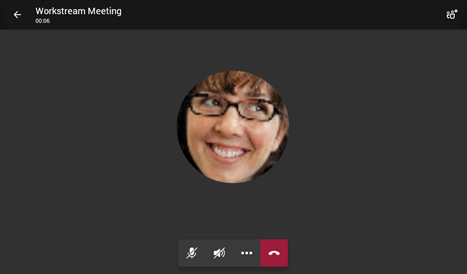
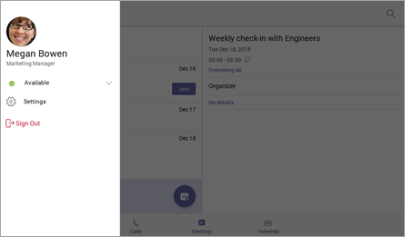
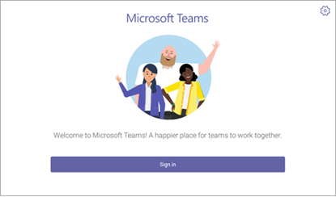

# Microsoft 團隊的電話Phones for Microsoft Teams

Microsoft 團隊可為需要傳統電話體驗的使用者支援一套手機。Microsoft Teams supports a portfolio of desk phones for users who require a traditional phone experience. 本文涵蓋針對 Microsoft 團隊認證的手機清單，以及手機認證中 Microsoft 團隊支援的功能。This article covers the list of phones that are certified for Microsoft Teams and the features supported in the phones certified for Microsoft Teams. 若要取得小組認證裝置的最新及最新資訊，請移至 [[小組 Marketplace](https://office.com/teamsdevices)]。To get the latest and up-to-date information on Teams certified devices, go to [Teams Marketplace](https://office.com/teamsdevices).

## 小組認證的 IP 電話Teams certified IP phones

若要在手機上提供高品質且可靠的 Microsoft 團隊體驗，我們將與 Yealink、Crestron、Polycom 和 Audiocodes 共同合作，以開發及認證大量的手機和會議室音訊裝置。To deliver a high-quality and reliable Microsoft Teams experience on phones, we are partnering and actively working with Yealink, Crestron, Polycom, and Audiocodes to develop and certify a wide portfolio of desk phones and conference room audio devices. 請參閱[目前已認證的 IP 手機](teams-ip-phones.md#currently-certified-ip-phones)（適用于目前支援的裝置）。See [Currently certified IP Phones](teams-ip-phones.md#currently-certified-ip-phones) for current supported devices.

## Microsoft 團隊手機功能集Microsoft Teams phones feature set

下表提供「團隊認證的 IP 手機」支援的高層級功能。A high-level set of features supported in Teams certified IP phones is available in the following table.

|功能Features |Phone （個人模式）Desk Phone (Personal Mode) |會議室電話（共用模式）Conference Room Phone (Shared Mode)|
|---------|---------|---------|
|**驗證****Authentication** | |  |
|使用使用者認證登入Sign in with user credentials |  是Yes | 是Yes|
|使用 PC/智慧型手機登入Sign in using PC/Smartphone  | 是Yes |是Yes|
|新式驗證Modern Authentication | 是Yes |是Yes |
|電話鎖定/解除鎖定Phone lock/unlock | 是Yes |否No |
|**通話****Calling** |  |  |
|傳入/傳出 P2P 通話Incoming/Outgoing P2P calls | 是Yes  |是Yes |
|透過 UI 進行通話控制（[靜音]、[保留/繼續]、[轉接]、[結束通話]）In-call controls via UI (Mute, hold/resume, transfer, end call)| 是Yes  |是Yes |
|PSTN 通話PSTN calls| 是Yes  |是Yes |
|視覺語音信箱Visual Voicemail | 是Yes | 否No |
|911支援911 support  | 是Yes  |是Yes |
|**行事曆和目前狀態****Calendar and Presence**|   | |
|行事曆存取與會議詳細資料Calendar Access and Meeting Details|是Yes |是Yes|
|目前狀態整合Presence Integration |是Yes|是Yes|
|Exchange 行事曆整合Exchange Calendar Integration |是Yes|是Yes|
|連絡人圖片整合Contact Picture Integration  |是Yes|是Yes|
|公司目錄存取Corporate Directory Access | 是Yes|是Yes|
|**會議****Meetings**|   ||
|按一下 [加入會議]One-click Join for Meetings  | 是Yes  |是Yes |
|加入商務用 Skype 會議Join Skype for Business meetings | 是Yes  | 是Yes|
|會議通話控制（靜音/取消靜音、保留/繼續、掛斷、新增/移除參與者）Meeting Call controls (Mute/unmute, hold/resume, hang up, add/remove participant)|是Yes|是Yes|
|會議詳細資料Meeting Details|是Yes|否No|

我們正在努力持續新增功能，以協助使用者增強其在手機上的團隊體驗。We are working to continuously add features to help our users enhance their Teams experience on phones. 下面的螢幕擷取畫面說明我們目前支援的一些體驗。The screen shots below illustrate some of the experiences we support today.

## 登入體驗Sign-in experience

當使用者按一下團隊中的登入按鈕時，就會透過公司入口網站開始登入。When a user clicks the sign-in button in Teams, sign-in is started via the Company Portal. 使用者可以在手機上輸入使用者認證，或選擇從另一個裝置登入，以選擇登入。The user has the option to sign in by entering user credentials on the phone or by choosing to sign in from another device. 如果使用者選擇從另一個裝置登入，則使用者可以從電腦或智慧型手機完成驗證。If the user chooses to sign in from another device, the user can complete authentication from their PC or smartphone.

**使用者使用認證登入****User sign-in with credentials**

**使用者從電腦/智慧手機登入****User sign-in via PC/smartphone**

## 個人/共用模式Personal/shared mode

成功登入之後，使用者就可以選擇要在個人用或在共用會議室中使用裝置。After successful sign-in, the user can choose whether the device will be used for personal use or in a shared conference room.

![[個人] 或 [共用帳戶] 選項的螢幕擷取畫面](media/personal-vs-shared-mode.jpg)

[團隊電話經驗] 是根據使用者的選取進行優化。The Teams phone experience is optimized based on the user's selection.

**個人模式****Personal mode**

**共用模式****Shared mode**

## 通話體驗Calling experience

Microsoft 團隊使用者可以抬起話筒，或按下喇叭按鈕來啟動通話畫面上的撥號鍵台。The Microsoft Teams user can lift the handset or press the speaker button to launch the dial pad on the calling screen. 或者，使用者可以使用硬體按鈕（如果有的話）傳出號碼。Alternatively, the user can use the hardware buttons (if available) to dial out a number.

**螢幕上的撥號鍵台****On-screen dial pad**

**通話畫面****Calling screen**

![[通話] 畫面的螢幕擷取畫面](media/calling-screen.png)

## 會議體驗Meeting experience

Microsoft 團隊使用者可以流覽至 [會議] 索引標籤來查看其會議，並使用 [**加入**] 按鈕來加入其小組會議。The Microsoft Teams user can navigate to the meetings tab to view their meetings and use the **Join** button to join their Teams meetings.

**行事曆檢視****Calendar view**

![[行事曆] 視圖中會議的螢幕擷取畫面](media/calendar-view.png)

**會議加入視圖****Meeting join view**

## 語音信箱Voicemail

Microsoft 團隊使用者在流覽至 [**語音信箱**] 索引標籤時，可以存取其語音信箱。The Microsoft Teams user can access their voicemail when they navigate to the **Voicemail** tab.

![[語音信箱] 索引標籤的螢幕擷取畫面](media/voicemail-tab.png)

## 使用者登出User sign-out

團隊電話使用者可以從左上方功能表中選取 [**登出**] 選項，選擇 [登出]。The Teams phone user can choose to sign out by selecting the **Sign Out** option from the top left menu.

## 在行動裝置上尋找固件版本Finding the Firmware version on a mobile device

您可以在 [團隊登入] 頁面上，選擇右上角的 [**設定**] 圖示，然後按一下 [**關於**] 來檢查最低固件版本。The minimum firmware version can be checked on the Teams sign-in page by choosing the **Settings** icon in the top-right corner and then clicking **About**.

**團隊登入頁面****Teams sign-in page**

**[設定] 頁面****Settings page**

![[團隊設定] 頁面的螢幕擷取畫面](media/teams-settings-page.jpg)

## 所需授權Required Licenses

Microsoft 團隊授權可以在[microsoft 365 和 Office 365 訂閱](https://docs.microsoft.com/office365/servicedescriptions/teams-service-description)中購買。Microsoft Teams licenses can be purchased as part of their [Microsoft 365 and Office 365 subscriptions](https://docs.microsoft.com/office365/servicedescriptions/teams-service-description). 若要深入瞭解在手機上使用 Microsoft 團隊所需的授權，請參閱可用的[電話系統授權](https://products.office.com/microsoft-teams/voice-calling)。To learn more about the required licenses for using Microsoft Teams on phones, see available [phone system licenses](https://products.office.com/microsoft-teams/voice-calling).

如需取得團隊的詳細資訊，請參閱[如何取得 Microsoft 團隊的存取權？](https://support.office.com/article/fc7f1634-abd3-4f26-a597-9df16e4ca65b)For more information about getting Teams, check out [How do I get access to Microsoft Teams?](https://support.office.com/article/fc7f1634-abd3-4f26-a597-9df16e4ca65b)

## 另請參閱See also

[團隊 MarketplaceTeams Marketplace](https://office.com/teamsdevices)

[Microsoft 團隊的 IP 手機認證IP Phones certified for Microsoft Teams](teams-ip-phones.md)
