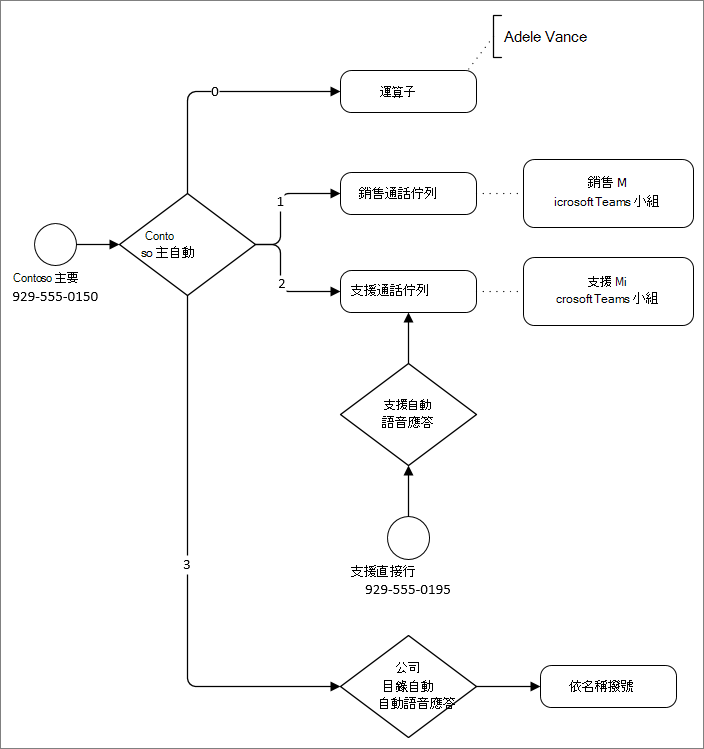

# 規劃自動Teams和通話佇列

自動語音機允許您設定功能表選項，以根據來電者輸入路由通話。 功能表選項 ，例如「針對銷售，按 1。  針對服務按 2"，針對自動語音機，讓組織提供一系列選項，引導來電者快速前往目的地，而不需要依賴人力運算子來處理來電。

通話佇列正在等待來電者的區域。 如果來電者需要連至具有特定專長的人 ，例如銷售或服務，而非特定人員，您可以使用通話佇列將來電者連接到可協助他們的代理人群組。 來電者會保留，直到指派給佇列的代理人可以撥打來電。

自動語音回應和通話佇列一起使用，可以輕鬆地將來電者路由至貴組織中適當的人員或部門。

## 自動語音應答

自動語音機的主要目的是根據來電者對所提供的功能表選項的輸入，將來電者引導至適當的人員或部門。 來電者可以導向至貴組織的特定人員、在等候與下一個可用代理人通話的地方撥打佇列，或撥打語音信箱。 您可以針對上班時間、休假時間及假日指定不同的通話路由選項。

功能表提示可建立使用文字到語音 (系統產生的提示) 或上傳錄製的音訊檔案。 語音辨識接受免手流覽的語音命令，但來電者也可以使用電話鍵台流覽功能表。

每個自動翻譯都有特定的語言和時區。 如果您以多種語言或世界多個地區進行商務，您可以建立許多不同的自動語音機，以滿足來電者需求。

您可以針對每個自動話務員設定運算子。 雖然您可以設定可前往各種目的地的接線員通話，但接線員功能的設計是允許來電者與組織中可協助他們的特定人員交談。

您可以根據名稱或分機號碼，將自動語音機配置為允許來電者搜尋貴組織的目錄。 在自動助理中，您可以選擇要包含或排除的使用者群組，以指定哪些人可進行目錄搜尋。  (這稱為撥號 *範圍*.) 

來電者可以直接撥打自動語音機 ，如果已進行配置，也可以從另一個自動語音機或通話佇列重新導向。

## 通話佇列

通話佇列與實體建築物中的等候室類似。 來電者會等候等候，而來電會路由至佇列中的代理人。 通話佇列通常用於銷售和服務功能。 不過，通話佇列可用於通話數量超過內部容量的任何情況，例如忙碌設施中的接待員。

當佇列中的來電總數或等待時間超過您指定的限制時，通話佇列會允許特定的通話路由。 通話可以路由至特定人員、語音信箱、其他通話佇列或自動語音留言。

與自動話務員一樣，通話佇列每一個都有語言設定。 如果您以多種語言進行商務，可以使用不同的通話佇列。 代理程式可以是多個佇列的成員，如果他們是多語言的。

針對每一個通話佇列，您可以指定佇列中的代理人是否可以退出宣告接聽來電，以及通話是否應該根據他們目前狀態在Teams。

您可以將電話號碼指派給通話佇列，不過通話佇列不會為休假和假日提供個別的通話路由。 除非您的通話佇列有 24/7 的教職員，否則建議您將電話號碼指派給在上班時間內重新導向至通話佇列的自動電話機。

## 必要條件

若要設定自動電話機和通話佇列，您需要下列資源：

- 每個自動電話機和每個通話佇列的資源帳戶
- 免費電話系統 - 每個資源帳戶的虛擬使用者授權
- 每個您想要 [直接撥號](getting-service-phone-numbers.md)的資源帳戶，至少一個 Microsoft 服務號碼、直接路由號碼或混合式號碼
 - 服務號碼可能是付費或免付費號碼

從通話佇列接聽來電的代理人必須企業語音線上或內部部署使用者。 此外，如果通話佇列使用直接路由號碼，需要電話會議或轉接通話的代理人也需要：

- 如果通話佇列使用轉接模式，則指派的線上語音路由策略
- 如果通話佇列使用會議模式，則指派的音訊會議授權或線上語音路由策略

如果您的代理人使用 Microsoft Teams應用程式進行通話佇列通話，他們必須採用 TeamsOnly 模式。

將通話轉接至外部電話號碼時，執行轉接 (即與自動話務員或通話佇列關聯的) 的資源帳戶必須擁有 Microsoft 365 電話系統 虛擬使用者授權，並指派下列其中一項：

- 已 [指派通話方案](calling-plans-for-office-365.md) 授權和電話號碼
- 使用 [直接路由 (](manage-voice-routing-policies.md) 時，線上語音路由) 

> [!NOTE]
> 只有使用者和通話代理程式支援自動Microsoft Teams和通話佇列的直接路由服務號碼。 
> 不支援在通話方案主幹和直接路由主幹之間傳輸。 
> 在混合式情況下，必須在內部部署建立資源帳戶。 詳細資訊，請參閱規劃 [雲端通話佇列](/skypeforbusiness/hybrid/plan-call-queue)。

## 商務決策

在設定自動電話機和通話佇列之前，您應該先決定如何在企業中使用這些功能。 這些決策會決定您設定自動電話機和通話佇列時所選取的設定。

記錄這些問題的解答，並提供資訊給執行配置的系統管理員。

- 您需要哪些語言？ 這些語言需要在哪裡 -哪個部門或群組？
- 您想要允許來電者的語音輸入，還是只允許撥號輸入？
- 您是否需要針對休假時間或假日個別進行通話路由？ 什麼是時數和假日？
- 您想要允許通話佇列中的代理人退出宣告通話嗎？
- 您希望通話佇列中的代理人或您的接線員在撥出時擁有特定的本機號碼？
- 您想要在 [貴組織中啟用](call-park-and-retrieve.md) 電話停駐和取回功能，以協助人員或部門之間呼叫的交流嗎？
- 針對語音提示，您想要錄製自己的語音或使用系統產生的語音嗎？  (系統產生的語音很容易更新。) 

## 技術決策

使用自動語音機和通話佇列將來電者連接到貴組織人員時，在開始進行組組之前，有一些技術決策需要做出。

您可以用下列方式將代理人新增到通話佇列：

- 個別使用者
- 通訊群組清單
- 安全性群組，包括已啟用郵件的安全性群組
- Microsoft 365群組或Teams

如果需要，您可以針對每個佇列使用這些選項的組合。 具有電子郵件地址的群組可用於語音信箱。 使用 Teams 有許多優點，包括共用檔案儲存空間和代理人之間的聊天、可接收語音信箱的一般信箱，以及可包含與商務應用程式或 Power Apps 整合的可擴展平臺。

建議您在開始進行組組之前，選擇將呼叫代理程式新排入佇列的策略。

如果您有現有的自動電話機和通話佇列基礎結構，而且要移轉至 Teams，您需要一個方案，將現有的電話號碼轉移到新的自動電話機和通話佇列。 您可能需要建立移轉訂單 [，](phone-number-calling-plans/port-order-overview.md) 才能將號碼從其他提供者移動。 我們建議您先暫時取得一或多個新電話號碼，並測試自動電話機和通話佇列流程，然後再切換至您目前使用中的號碼。

*會議模式* 是通話佇列中的一個選項，可大幅縮短將 VOIP 通話Teams PSTN 通話連接到代理人的時間。 若要讓會議模式運作，通話佇列中的代理人必須使用下列其中一個用戶端：

- 最新版桌面Microsoft Teams Android App 或 iOS 應用程式
  - Microsoft Teams 1449/1.0.94.2020051601 或更新版本
  
將代理程式Teams設為Teams模式。 不符合要求的代理人不會包含在通話路由清單中。

如果您的代理人都使用相容的用戶端，我們建議您為通話佇列啟用會議模式。

## 規劃您的通話路由流程

在規劃程式過程中，建議您在圖表中為貴組織規劃通話路由。 此圖表可協助判斷來電至貴組織之人員最有效率的路由。 您也可以使用圖表來判斷您需要建立自動電話機和通話佇列，以及服務號碼、授權和資源帳戶等相關需求。

讓我們來看看自動電話機和通話佇列如何路由通話。

自動電話機會以下列其中一種方式路由所有通話：

- **立即重新** 導向 - 通話可以重新導向至下列其中一個 (通話路由目的地) 接聽或初次問候之後。
- **根據撥號選項重新** 導向 - 可指示來電者選擇指派給電話鍵台 0-9 號碼的選項。 每個撥號鍵都可以指派呼叫路由目的地。
- **以名稱或** 分機撥打人員 - 來電者可以撥打他們嘗試在貴組織目錄中聯繫的人的分機號碼，或拼字檢查人員的名稱。
- **中斷** 連接 - 自動電話機可以掛斷通話。

> [!NOTE]
> 單一自動電話機只能支援單一的「撥號方式」方法。  若要允許來電者按名稱和號碼撥號，您必須建立一個自動語音機，該自動語音機具有按名稱撥號的選項，另一個則具有分機撥號的選項。  這些選項會路由到針對這些「撥號方式」案例所配置的個別自動助理。

當自動電話機或通話佇列重新導向通話時，您可以從下列通話路由目的地選擇：

- **組織中可以接聽** 語音通話的人。 這可以是線上使用者，或是使用內部部署託管商務用 Skype Server。
- **語音應用程式** - 另一個自動語音留言機或通話佇列。 選擇與目的地相關聯的資源帳戶。
- **外部電話號碼** - 任何電話號碼。  (請參閱[外部移轉技術詳細資料) 。](create-a-phone-system-auto-attendant.md#external-phone-number-transfers---technical-details)
- **語音** 信箱 - 與您指定的Microsoft 365群組相關聯的語音信箱。 您可以選擇是否要語音信箱字幕和「請在語音信箱後留言」。 系統提示。
- **運算子** (自動) ，即為自動話務員定義的運算子。 定義運算子是選擇性的。 運算子可以是此清單的其他目的地。

自動電話機針對在上班時間外和假日內接聽的通話，提供個別的通話路由選項。 非工作時間通話路由允許上述所有選項，而假日通話路由只允許重新導向或中斷通話，但無撥號鍵選項。

通話佇列會保留來電者，直到指派給佇列的代理人能夠進行通話。 有兩種情況可能會將來電者導向佇列：

- **通話溢出** - 如果佇列中的通話數超過您設定的限制，則新的來電者會重新導向到佇列中。
- **通話超時** - 如果來電者在佇列中的時間超過設定超時設定的時間，他們會被重新導向到佇列外。

從佇列重新導向的通話可以傳送至上述任何通話路由目的地，但運算子除外。  (通話佇列沒有運算子，但您可以將來電者重新導向至您為自動語音機所配置的運算子相同的目的地。) 

下列範例顯示使用自動電話機和通話佇列進行通話路由的範例。

在上例中：

- 0 (0) 會將來電者重新導向至運算子。 該自動話務員的運算子已配置為組織中 **的人**。
- 使用 1 (鍵) 來電者重新導向至銷售通話佇列。 此通話佇列會連接到包含指派給該佇列的銷售團隊的團隊。
- 這兩 (2) 鍵會將來電者重新導向到支援通話佇列。 此通話佇列會連接到包含指派給團隊的支援小組的團隊。
- 支援通話佇列有一個透過中間自動電話機直接撥打的電話號碼。 有自動回應應答，支援行允許個別的休假時間與假日通話路由。
- 3 (3) 會將使用者重新導向至公司目錄的另一個自動總機。 公司目錄自動語音機可讓來電者撥打其名稱或分機來撥打組織中個人的電話。

我們建議您建立一或多個類似上述圖表的圖表，以繪製您的通話路由。 請務必在圖表或隨附檔中包含下列專案：

- 哪些自動電話機會透過電話號碼直接存取？
- 每個自動乘務員的休假和假日路由需求是什麼？
- 每個通話佇列的成員資格。  (您可以個別新增使用者，或將佇列與不同類型的群組進行比對。 將佇列與小組進行比對，可提供最多樣化的體驗。) 

以下是一些通話路由最佳做法：

- 查看您現有的通話系統，並分析來電的類型和頻率。 使用這項資訊可協助通知您的自動電話機和通話佇列結構。
- 將最常見的選項最早放在功能表中，以儘快路由通話。
- 除非佇列 24/7 可用，否則請避免將服務號碼直接連接到通話佇列。 通話佇列不允許在休假時間或假日期間個別處理通話。 如果您想要有一個具有直接號碼的佇列，請指派號碼給自動總機，在上班時間內自動重新導向到佇列。
- 如果您接到許多要求公司基本資訊的電話，例如上班時間、位置或網址，請考慮建立自動回應，以錄製的郵件回答這些問題。
- 將功能表項目清單保持在五個或五個以下。 來電者可能難以記住五個選項以上。 如果需要更多選項來正確路由通話，請使用巢式自動通話。
- 首先描述服務，接著按 (選項：針對 Sales 按 1) ，而不是按其他方式 (例如。 按 1 表示銷售) 。
- 您的來電者會瞭解的使用者術語，而不是您可能會在內部使用哪些術語。
- 避免經常更新通話路由。 如果您日後變更自動語音機的功能表選項，請于前 30 天內在語音提示中撥打。

## 快速入門

完成本文中的規劃工作之後，請遵循下列步驟來設定自動電話機和通話佇列：

1. 從組織外部直接撥號，取得自動電話機和通話佇列所需的服務號碼。 這可能包括 [從另一個提供者移轉號碼](phone-number-calling-plans/transfer-phone-numbers-to-teams.md) 或 [要求新的服務號碼](getting-service-phone-numbers.md)。

2. 取得[電話系統建立](teams-add-on-licensing/virtual-user.md)之每個資源帳戶的虛擬使用者授權。 這些授權是免費的，因此我們建議您額外取得一些授權，以防您決定日後變更資源帳戶。

3. [為您想要建立](manage-resource-accounts.md) 的每個自動電話機和通話佇列建立資源帳戶。 為每個帳戶指派一個電話系統 - 虛擬使用者授權，也可以指派服務號碼。

4. [建立您想要](set-up-holidays-in-teams.md) 在自動電話機中分別進行通話路由的假日。

5. 如果您想要使用 [這項功能](call-park-and-retrieve.md) 協助來電轉接，也可以設定通話駐車和取回。

6. 建立您想要用於包含通話佇列之通話代理的群組。

7. 如果您打算允許分機撥號，請確保您已將使用者的分機號碼新Azure Active Directory設定檔。

完成上述步驟後，就可以建立自動電話機和通話佇列了。 由於自動話務員和通話佇列可以彼此重新導向通話，請參閱您建立工作流程圖表，以決定應該先建立哪一個自動電話機或通話佇列。 在上圖中的範例中，在建立 Contoso 主自動語音機之前，先建立銷售和支援通話佇列，因為主自動語音機需要將來電者引導至銷售和支援通話佇列。

請參閱下列文章，以瞭解如何建立自動電話機和通話佇列：

- [設定自動話務員](create-a-phone-system-auto-attendant.md)
- [建立通話佇列](create-a-phone-system-call-queue.md)

如果您需要更廣泛的功能 ，例如與工作流程、bot 和 簡訊整合，請考慮[使用 Azure Communication Services](/azure/communication-services/overview)。

## 相關主題

[規劃直接路由](direct-routing-plan.md)

[音訊會議與通話方案的適用國家/地區](country-and-region-availability-for-audio-conferencing-and-calling-plans/country-and-region-availability-for-audio-conferencing-and-calling-plans.md)

[建立通話佇列 - 小型企業教學課程](business-voice/create-a-phone-system-call-queue-smb.md)

[設定自動助理 - 小型企業教學課程](business-voice/create-a-phone-system-auto-attendant-smb.md)
