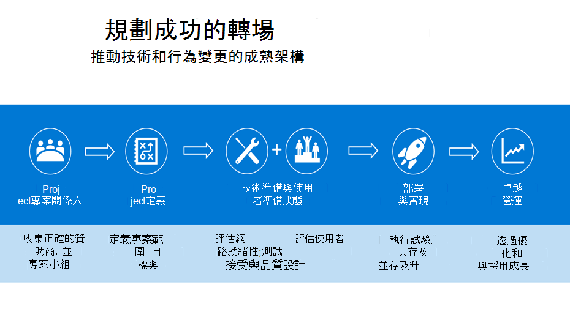
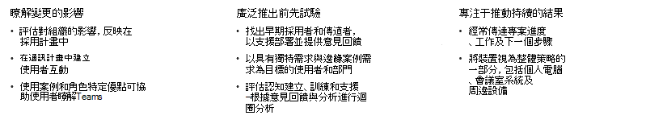

# 規劃成功從Kaizala轉換Microsoft Teams

當您從新Kaizala開始Microsoft Teams，您必須花時間規劃成功的轉場。 實心轉場計畫提供您移動的結構，並確保所有專案關係人都朝共同目標努力。 使用經過驗證的框架實做變更，可協助您開始進行今天轉場。

## 轉場架構

我們在下面概述成功轉場的建議方法，並鼓勵您按照階段順序進行，因為架構中的每個步驟都建立在先前的步驟上。

- 為貴組織構想團隊合作

- 識別支援者與重要專案關係人

- 定義專案範圍

- 試驗Microsoft Teams

在開始使用之前，請確定：

- [Teams，](/microsoftteams/get-clients)[且授權會指派到](/office365/servicedescriptions/teams-service-description)您的環境中。 至少應指派最低授權給核心小組，並指派給將參與此初始專案階段之早期採用者。

- 您下載了桌面和行動應用程式。

### 為貴組織構想團隊合作

健康的技術環境、持續採用使用者，以及達成您的商業目標，都是從適當的規劃開始。 可靠的計畫會提供升級專案架構，並確保所有專案關係人都朝相同的目標努力。 請花一些時間列出目前使用Kaizala案例。 接下來，在現代化工作場所中，以Microsoft Teams。 若要開始定義使用案例[，請參閱定義](/microsoftteams/teams-adoption-define-usage-scenarios)Microsoft Teams。

### 識別支援者與重要專案關係人

首先，將正確的專案關係人彙集在一起，並定義您的升級計畫。 適當的計畫應包含您的範圍、目標，以及明確的轉場時程表。 在已達成一致計畫後，請確認您的技術環境和使用者已準備好Teams。 找出對新技術有興趣的人，並協助其他人。 建立一 [個宣傳計畫](/microsoftteams/teams-adoption-create-champions-program) ，在轉場期間促進興奮、認知及採用。 我們已建立一個冠軍計劃指南，以在貴組織中啟動此計畫，若要深入瞭解，請參閱建立 [冠軍計畫](https://view.officeapps.live.com/op/view.aspx?src=https://fto365dev.blob.core.windows.net:443/media/Default/DocResources/Adoption/Build_Champions_Program_Guide.pptx)。

### 定義專案範圍

當您規劃移至Microsoft Teams時，定義業務的成功外觀至關重要。  專案範圍會定義專案此時的焦點，並讓您的專案小組專注于目前的工作，以便您實現您的長期願景。

若要深入瞭解我們定義結果和成功的建議策略，請參閱定義採用結果和成功[Microsoft Teams](/microsoftteams/teams-adoption-define-outcomes)。

### 試驗Microsoft Teams

一旦定義專案範圍和願景之後，就該開始試驗Microsoft Teams。 找出早期採用者[的使用者群組](/microsoftteams/teams-adoption-onboard-early-adopters)，以參與與Teams。 進行試驗包括與使用者通訊、監控您的網路和使用狀況，以確保您的網路績效和通話品質維持健康、收集參與者的意見，以及檢閱技術支援中心票證，Teams。

## 準備您的組織

遵循規劃成功從 Kaizala 轉換的建議架構之後，請為貴組織成功轉換Microsoft Teams。

### 準備好

 1. 請確保每個人都Teams授權。 請查看 [Teams 方案](/microsoft-teams/compare-microsoft-teams-options?rtc=1) 以及 [Microsoft Teams 服務描述](/office365/servicedescriptions/teams-service-description)。

 2. 使用[Microsoft Teams採用](https://adoption.microsoft.com/microsoft-teams/#get-started)指南，以在Teams推出新計畫。

 3. 讓系統管理員、領獎人及貴組織做好準備，透過技能及採用資源Teams與組織進行通訊。  

 4. 使用這些訓練資源，協助貴組織的使用者瞭解並充分利用Teams：

    - 有關 IT 系統管理員準備狀態，請參閱 [系統管理訓練資源](/microsoftteams/itadmin-readiness)。

    - 有關講師引導的訓練，請參閱講師[指導的 Microsoft Teams](/microsoftteams/instructor-led-training-teams-landing-page)。
  
    - 有關訓練影片，請參閱[Microsoft Teams影片訓練](https://support.microsoft.com/office/microsoft-teams-video-training-4f108e54-240b-4351-8084-b1089f0d21d7?ui=en-us&rs=en-us&ad=us)。

## 支援Microsoft Teams採用

通過[推動採用Microsoft Teams](/microsoftteams/teams-adoption-get-started)，您可以提供絕佳的使用者體驗，並提升公司內部的商業價值。

在整個Teams推出期間，請務必利用這些資源，提供推動採用Teams指南。

透過對系統管理員和Teams的訓練，強化您有關組織使用和推動使用方式的知識。 有關訓練資源，請參閱Microsoft Teams[訓練](/microsoftteams/training-microsoft-teams-landing-page)。

如果貴組織想要自訂體驗，以配合您的使用和採用計畫，[請參閱](https://adoption.microsoft.com/microsoft-365-learning-pathways/)這裡以深入瞭解Microsoft 365學習路徑的點播訓練解決方案。

若要隨時瞭解 Teams 以及貴組織中所有其他 Microsoft 365 或 Office 365 產品與服務的資訊，請務必查看訊息中心及 Teams[藍圖。](https://www.microsoft.com/microsoft-365/roadmap?rtc=2&filters=Microsoft%20Teams)  您會收到有關新功能和更新功能、計劃的變更和問題的公告，以協助您了解並做好準備。

## 其他資源

讓所有人聚在一起、讓交談有效進行、與員工聯繫，以及使用Microsoft Teams。 Teams能輕鬆與前線員工、成員、客戶和轉銷商聯繫及協調。

針對其他資源，我們已針對系統管理員和 IT 專業人員Microsoft Teams文件庫。 使用檔確保貴組織在從公司到Kaizala Microsoft Teams。

## 後續步驟

[從 Microsoft Teams 流覽Kaizala](/MicrosoftTeams/navigate-teams)
