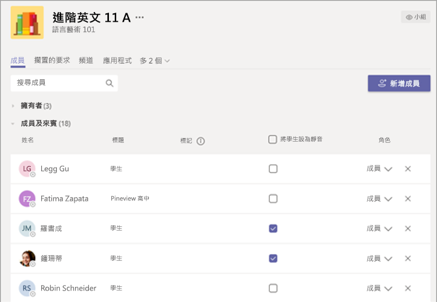

# 適用於教育界的 Teams 原則和原則套件Teams Policies and Policy Packages for Education

> [!NOTE]
> 如需更多有關 Microsoft Teams 中原則的案例，請參閱[在 Microsoft Teams 中將原則指派給您的使用者](assign-policies.md)。For the larger story on policies in Microsoft Teams, please review [Assign policies to your users in Microsoft Teams](assign-policies.md).

請務必注意，本文將涵蓋多種將原則指派給 Teams 使用者的方式。It's important to note this article will cover multiple ways to assign policies to users in Teams.

- 手動指派給個別使用者。Manual assign to individual users.
- 透過 PowerShell 大量指派給多個使用者。Bulk assigning via PowerShell to multiple users.
- 將原則套件指派給個別或多個使用者。Assigning policy packages to individual or multiple users.

這些方法的優點與缺點追根究柢在於機構的個別需求。The advantages and disadvantages of these approaches come down to the institution's individual needs.

## 系統管理員：開始使用 Microsoft Teams 原則管理Admins: Getting started with Microsoft Teams policy management

Microsoft Teams 的核心是關於使用者能夠做一些事情，例如參與會議或即時活動、交談、進行通話及使用應用程式。Microsoft Teams, at its core, is about users being able to do things like go to meetings or live events, chat, make calls, and use apps. 若要為 Teams 中的學生打造安全的學習環境，設定合適的 Microsoft Teams 原則是關鍵性步驟。And setting the right Microsoft Teams admin policies is a critical step in creating a safe learning environment for students within Teams. 身為系統管理員，您可使用原則來控制教育機構使用者可使用的 Teams 功能。As an admin, you can use policies to control the Teams features that are available to users in your educational institute.

以下是您可在 Microsoft Teams 中找到的原則區域清單：Here's a list of the policy areas you will find in Microsoft Teams:

- 會議Meetings
- 即時活動Live events
- 通話Calling
- 訊息Messaging
- TeamsTeams
- 應用程式權限App permissions

:::image type="content" source="media/edu-admin-center-users.png" alt-text="已套用原則的使用者螢幕擷取畫面。":::

只要使用系統管理員認證登入，即可在 [Microsoft Teams 系統管理中心](https://admin.teams.microsoft.com)輕鬆管理所有 Teams 原則。You can easily manage all Teams policies in the [Microsoft Teams admin center](https://admin.teams.microsoft.com) by signing in with your admin credentials.

### 哪裡可找到 Microsoft Teams 原則Where to find Microsoft Teams policies

登入 Teams 系統管理中心後，只要按一下 Teams 系統管理中心左側導覽區中的原則選項，即可移至任何需要管理的 Teams 區域原則設定。Once you've logged into the Teams admin center, you'll be able to go to the policy settings for any area of Teams you need to manage, by clicking on the policy option in the left hand navigation of the Teams admin center. 我們已納入訊息原則位置的螢幕擷取畫面。We've included a screenshot of the location of the messaging policies.

:::image type="content" source="media/edu-messaging-policies.png" alt-text="Teams 系統管理中心的訊息原則位置。":::

### 如何建立及更新原則定義How to create and update a policy definition

將原則指派給使用者之前，您必須先新增並建立 Teams 中每個功能區域的原則定義。Before you assign policies to your users, you need to first add and create your policy definitions for each capability area with Teams.

> [!NOTE]
> 建議您為學生和教師設定不同的原則定義。We recommend that you set different policy definitions for your students and educators.

根據預設，每個新使用者 (學生或教師) 都會被指派全域 (全組織預設值) 原則定義。By default, every new user (student or educator) will be assigned the Global (Org-wide default) policy definition for each capability area. 建議您遵循下列步驟操作：We recommend you follow these steps:

1. 您可針對每個 Teams 功能區域建立自訂原則定義，然後將其指派給教師 (若未這麼做，您對全域原則所做的變更都會限制教師，直到其擁有自己的原則為止)。Create a custom policy definition for each Teams capability area that can then be assigned to your educators (without this, any changes you make to the Global policy will restrict educators until they have their own policy).

1. 將教師指派至這個新原則定義。Assign your educators to this new policy definition.

1. 更新全域 (全組織預設值) 原則定義，然後將其指派給學生。Update the Global (Org-wide default) policy definition, then assign it to your students.

若要建立或編輯原則定義，請移至您要使用的原則功能區域 (例如，訊息原則)。To create or edit policy definitions, go to the policy capability area you want to work in (for example, Messaging policies). 如果您想建立新的自訂原則定義，請選取 **[新增]** (您將針對為教師建立的自訂原則定義執行此動作)。Select **Add** if you want to create a new custom policy definition (which you'll do for the custom policy definition you create for educators). 否則，若要變更現有原則定義，請選取 **[編輯]** (如果您選擇為學生更新全域原則，您就會這麼做)。Otherwise, to change an existing policy definition, then select **Edit** (which will be what you do if you choose to update the Global policy for students).

:::image type="content" source="media/edu-messaging-policies-add-closeup.png" alt-text="具有 [新增] 按鈕檢視的 [訊息原則] 區段特寫。":::

無論選擇新增或編輯原則定義，您都會移至一個檢視，其中列出所有與此原則區域相關的原則選項。Whether you choose to add or edit a policy definition, you're brought to a view that lists all the policy options related to this policy area. 使用此清單來選取您要在原則定義中設定的值。Use this list to select what values you want set in your policy definition.

> [!IMPORTANT]
> 離開頁面之前，請不要忘記選取 **[儲存]**。Don’t forget to select **Save** before you leave the page.

### 如何將原則定義指派給使用者How to assign a policy definition to a user

> [!NOTE]
> 指派原則定義時，可能需要一段時間才會散佈給所有使用者和用戶端。Assigning a policy definition may take a while to propagate out to all the users and clients. 您可能想要在 Azure/M365 中第一次建立使用者帳戶時，以及在新學生加入教育機構時執行此動作。You might want to do this when the user accounts are first created in Azure/M365, and whenever a new student joins the educational institute.

建立或更新原則定義後，您即可在原則頁面中選取 **[管理使用者]**，搜尋所需的使用者，然後套用原則。Once your policy definition is created or updated, you can assign it to a user by selecting **Manage users** in policy page, searching for the desired user then applying the policy.

![右側的 [管理使用者] 面板 (在 [訊息原則] 頁面之上)。](media/edu-manage-users-pane.png)

您也可導覽至 [使用者]，選取您要更新原則的使用者、選取 [原則]，然後選取 [編輯]，進而將原則指派給使用者。You can also assign a policy to a user by navigating to Users, selecting the user you wish to update policies for, selecting Policies, then Edit. 您可以在此選取您要指派給每個功能區域使用者的原則定義。From there, you can select the policy definition you’d like to use assign to the user for each capability area.

> [!IMPORTANT]
> 如果您屬於大型教育機構，則透過 Microsoft Teams 系統管理入口網站體驗來為每位使用者設定原則可能有所困難。If you're part of a large educational institute, using the Microsoft Teams admin portal experience to set policies for each user may be difficult. 透過 PowerShell 分批指派原則是比較好的做法。It'll be better for you to assign policies in batches via PowerShell. 我們有一些教育界專屬資訊，說明如何[在您的教育機構中將原則指派給大量使用者集合](batch-group-policy-assignment-edu.md) (如果您有需要)，而您也可查看以下關於原則套件的章節，這是另一種為大量使用者群組管理原則和設定的絕佳方式。We have some EDU-specific information on how to [Assign policies to large sets of users in your educational institute](batch-group-policy-assignment-edu.md) if you need it, and you can also check out the section below on policy packages, which are another great way to manage policies and settings for large groups of users.

![[編輯使用者原則] 窗格 (位於 [指派的原則] 頁面的右側)。](media/edu-edit-user-policies-pane.png)

### Microsoft Teams 中的原則套件Policy packages in Microsoft Teams

Teams 中的原則套件會收集您在上述內容中了解的預先定義原則和原則設定，並將其指派給機構中具有類似角色的使用者。A policy package in Teams collects predefined policies and policy settings that you learned about outlined above, and assigns them to users with similar roles in your institution. 原則套件可簡化原則管理，並有助於達到一致性。Policy packages simplify, streamline, and help provide consistency when managing policies. 在一般做法中，您會為每個使用者指派一個原則套件，並視需要重新定義每個套件中的原則，以符合該使用者群組的需求。In normal practice, you assign each of your users a policy package, and  redefine the policies in each package as needed to suit the needs of that user group. 當您更新套件中的設定時，指派至該套件的所有使用者都會變更為大量更新。When you update settings in a package, all users assigned to that package are changed as a bulk update.

一般來說，教育機構有許多具有獨特需求的使用者，在一定程度上是取決於學生的年齡和成熟度。Educational institutions in general have many users with unique needs, depending partly on the age and maturity of the students. 例如，您可以為教職員授與 Microsoft Teams 的完整權限，但又想要為學生限制 Microsoft Teams 功能，以促進安全且專注的學習環境。For example, you may want to grant educators and staff full access to Microsoft Teams, but want to limit Microsoft Teams capabilities for students to encourage a safe and focused learning environment. 您可以使用原則套件，根據您的教育機構社群中不同族群的需求來量身打造設定。You can use policy packages to tailor settings based on the needs of different cohorts in your educational institute community.

> [!NOTE]
> 如需詳細資訊，請參閱[在 Microsoft Teams 中 管理原則套件](manage-policy-packages.md)，了解將一個套件指派給單一使用者、將大量套件指派給多達 5000 個使用者，以及管理和更新每個套件所連結原則的逐步指引。For more reading, you can check out [Manage policy packages in Microsoft Teams](manage-policy-packages.md) for step by step guidance on assigning single users a package, assigning packages in bulk to up to 5000 users, and managing and updating the policies linked to each package.

就如同本文先前所述的原則清單，原則套件會為下列各預先定義套件：Just like the policy list earlier in this article, policy packages predefine policies for:

- 會議Meetings
- 即時活動Live events
- 通話Calling
- 訊息Messaging
- TeamsTeams
- 應用程式權限App permissions

Microsoft Teams 目前包含下列原則套件：Microsoft Teams currently includes the following policy packages:

|Microsoft Teams 系統管理中心所列的套件名稱Package name listed in Microsoft Teams Admin center |最適合用於Best used for  |描述Description |
|:--- |:--- |:--- |
|**Education_Teacher****Education_Teacher**| 教職員Educators and staff| 您可使用這組原則和原則設定，透過 Microsoft Teams 為貴組織的教職員授與交談、通話和會議的完整權限。Use this set of policies and policy settings to grant educators and staff within your organization full access to chat, calling and meetings through Microsoft Teams. |
|**Education_PrimaryStudent****Education_PrimaryStudent**| 小學熟齡學生Primary school aged students  | 您機構內較年輕的小學熟齡學生可能需要更多的 Microsoft Teams 限制。Younger, primary school aged students within your institution may need more limits within Microsoft Teams. 使用這組原則和原則設定來限制會議建立和管理、交談管理和私人通話等功能。Use this set of policies and policy settings to limit capabilities like meetings creation and management,  chat management, and private calling. |
|**Education_SecondaryStudent****Education_SecondaryStudent**| 中學熟齡學生Secondary school aged students | 您機構內的中學熟齡學生可能需要更多的 Microsoft Teams 限制。Secondary school aged students within your institution may need more limits within Microsoft Teams. 使用這組原則和原則設定來限制會議建立和管理、交談管理和私人通話等功能。Use this set of policies and policy settings to limit capabilities like meetings creation and management,  chat management, and private calling. |
|**Education_HigherEducationStudent****Education_HigherEducationStudent**| 高等教育學生Higher education students | 相較於較年輕的學生，您機構內的高等教育學生需要的限制較少，但建議採取一些限制。Higher education students within your intuition may need fewer limits than younger students, but some limitations may be recommended. 您可使用這組原則和原則設定來提供組織內部交談、通話和會議的權限，但限制學生與外部參與者使用 Microsoft Teams 的方式。You can use this set of policies and policy settings to give access to chat, calling, and meetings within your  organization, but limit how your students use Microsoft Teams with external participants. |
|**Education_PrimaryTeacher_RemoteLearning****Education_PrimaryTeacher_RemoteLearning**| 教職員Educators and staff | 建立適用於小學教師的一組原則，以便在使用遠端學習時將學生安全性和共同作業最大化。Creates a set of policies that apply to primary teachers to maximize student safety and collaboration when using remote learning. |
|**Education_PrimaryStudent_RemoteLearning****Education_PrimaryStudent_RemoteLearning**| 小學熟齡學生Primary school aged students| 建立適用於學生的一組原則，以便在使用遠端學習時將學生安全性和共同作業最大化。Creates a set of policies that apply to primary students to maximize student safety and collaboration when using remote learning.
|||

:::image type="content" source="media/edu-policy-packages-list.png" alt-text="[原則套件] 頁面，其中包含可供選擇的原則套件清單。":::

每個個別原則都會被賦予原則套件的名稱，以便輕鬆識別連結至原則套件的原則。Each individual policy is given the name of the policy package so you can easily identify policies linked to a policy package. 例如，當您將 Education_Teacher 原則套件指派給您教育機構中的教師時，系統就會為套件中的每個原則建立名為 Education_Teacher 的原則。For example, when you assign the Education_Teacher policy package to educators in your educational institution, a policy named Education_Teacher is created for each policy in the package.

> [!NOTE]
> 如果您決定教師和行政支援職員需要不同的原則，則可重新設定現有套件的用途：找出您目前未使用的套件，並將設定變更為適合該群組。If you decide that educators and administrative support staff need different policies, you can repurpose an existing package: identify a package you aren't currently using and change the settings to be appropriate for that group. 您可能需要自行記下哪個群組有哪個套件，但這是重新設定套件用途的唯一障礙。You might have to make a note to yourself which group has which package, but that's the only impediment to repurposing a package.

## 為了學生安全所應指派的原則Policies that should be assigned for student safety

### 會議原則Meeting policies

#### 關閉建立及開始會議的功能Turn off the ability to create and start meetings

> [!NOTE]
> 您可能不會在您的租用戶中立即發現這項功能。You may not notice this functionality in your tenant right now. 這是因為這項功能目前正在推出，並會在推出給所有租用戶後，提供給所有使用者使用。That's because this feature is currently being rolled out, and will be available to all users once it's been rolled out to all tenants. 如需相關資訊，請參閱 [Teams 藍圖](https://www.microsoft.com/microsoft-365/roadmap?filters=&searchterms=63355)。Please see the [Teams Roadmap](https://www.microsoft.com/microsoft-365/roadmap?filters=&searchterms=63355) for more information.

若要確保學生無法安排不需出席的會議，請在會議原則中透過下列 [一般] 設定將會議建立功能設為 **[關閉]**：To ensure that students can’t schedule a meeting to communicate unattended, in meeting policies set to **Off** meeting creation capabilities through these General settings:

- **允許在頻道中立即開會**：關閉**Allow Meet now in channels**: Off

- **允許 Outlook 增益集**：關閉**Allow the Outlook add-in**: Off

- **允許頻道會議排程**：關閉**Allow channel meeting scheduling**: Off

- **允許排程私人會議**：關閉**Allow scheduling private meetings**: Off

  ![[遠端學習的教育機構學生] 頁面，其中顯示的 [一般] 區段已關閉所有選項。](media/edu-policy-list-a.png)

- 而在相同頁面上的會議 [參與者與來賓] 區段中:And on the same page, in the Participants and Guests in meeting section:

  - **允許在私人會議中立即開會**: 關閉**Allow Meet now in private meetings**: Off
  - **允許在會議中交談**: 已停用**Allow chat in meetings**: Disabled

  ![[參與者與來賓] 區段，其中的 [允許在私人會議中立即開會] 選項設為 [關閉]。](media/edu-participants-and-guests.png)

關閉 **在通道中立即開會**、**允許管通道會議排程**、**允許排程私人會議**，以及 **在私人會議中立即開會** 給學生們使用的功能，而且還透過封鎖會議成為召集人，他們也提供下列教育版安全措施：Turning off **Allow Meet now in channels**, **Allow channel meeting scheduling**, **Allow scheduling private meetings**, and **Meet now in private meetings** for students not only blocks students from scheduling a meeting as the organizer, they also provide the following safety measures for education:

- 如果學生嘗試在授課者之前加入會議，他們將無法在最新版本的 Teams 應用程式加入會議。If students attempt to join the meeting before the educator, they won't be able to join the meeting in the latest version of the Teams app.

- 雖然會議建立適用于任何使用者和任何授權，但是上述所述會議聯結區塊的安全性措施只適用于基於使用者授權類型的 Teams 中的教育客戶。Although meeting creation applies to any users and any licenses, the safety measures on meeting join block described above apply only to education customers in Teams based on the users’ license type.

下表描述用於每個會議建立原則的邏輯：Here is a table to describe the logic for each meeting creation policy:

| 會議建立原則Meeting creation policy | 建立會議Create a meeting | 自動開始會議Start a meeting unattended | 加入時略過大廳Bypass lobby when joining | 結束會議End the meeting |
| --- | --- | --- | --- | --- |
| **開啟 (例如授課者)****On (e.g. educator)** | 是Yes | 是Yes | 由[會議選項](https://go.microsoft.com/fwlink/?linkid=2093366)決定Determined by [meeting options](https://go.microsoft.com/fwlink/?linkid=2093366) | 是，以召集人身分Yes, as organizer
| **關閉 (例如學生)****Off (e.g. student)** | 否No | 否\*\*No\*\* | 由[會議選項](https://go.microsoft.com/fwlink/?linkid=2093366)決定Determined by [meeting options](https://go.microsoft.com/fwlink/?linkid=2093366) | 否No

> [!NOTE]
> \*\* 這僅適用於具有 EDU 授權的使用者，並適用會議、頻道會議、即時會議及即時頻道會議。\*\* This applies to EDU licensed users only and applies to meetings, channel meetings, instant meetings, and instant channel meetings.

當您將 **允許在會議中交談** 原則設定為停用，並封鎖學生在上方排程會議的時間，並將此原則用於教師（如果會議沒有從頻道排定，或在頻道中立即開會），學生將無法在教師加入會議之前和會議結束之前交談。When you change the **Allow chat in meetings** policy to disabled and block students from scheduling meetings from above while and keep this policy on for educators (for the meetings that are not scheduled from a channel or meet now in a channel), students won't be able to chat before the educator joins the meeting, nor after the meeting. 在會議前後，他們仍能看到聊天記錄。They will still be able to see the chat history before, during, and after the meeting. 例如，他們可以看到來自教師的郵件或會議記錄連結（如果會議已錄製）。As an example, they'll be able to see messages from the teacher, or the meeting recording link, if the meeting was recorded.

如果學生和授課者都將 **允許在會議中交談** 原則關閉，就無法在會議交談視窗中交談。If both students and educators have the **Allow chat in meetings** policy turned off, no one will be able to chat in the meeting chat window. 以上所述會議交談限制中的安全措施只適用于根據使用者授權類型列出的 Teams 中的教育客戶。The safety measure on meeting chat restriction described above only applies to education customers in Teams based on users’ license type.

下表描述用於在會議中允許聊天的邏輯：Here is a table to describe the logic for allow chat in meetings:

| 「允許在會議中聊天」原則‘Allow chat in meetings’ policy | 隨時查看聊天記錄See chat history anytime | 在會議期間張貼訊息Post messages during the meeting | 在會議前或後張貼訊息Post messages before or after the meeting |
| --- | --- | --- | --- | 
| **全部開啟****On for all** | 是Yes | 是Yes | 是Yes |
| **全部關閉****Off for all** | 不適用N/A | N/AN/A | 不適用N/A |
| **對授課者開啟和對學生關閉****On for educators and Off for students** | 授課者：是Educator: Yes 學生：是Student Yes | 授課者：是Educator: Yes 學生：是Student Yes | 授課者：是Educator: Yes 學生：否\*\*Student No\*\* | 

> [!NOTE]
> \*\* 這僅適用於具有 EDU 授權的使用者，並適用會議和即時會議。\*\* This applies to EDU licensed users only and applies to meetings and instant meetings. 它不適用於任何頻道會議，也不適用於即時頻道會議。It does not apply to any channel meetings nor instant channel meetings.

#### 控制學生是否可以在通話和會議期間共用其視訊Control whether or not students can share their videos during calls and meetings

在 [會議原則] 區段中，確保您為學生設定的音效和視覺效果值符合您的教學機構指導方針，以及學生、教師及家長和監護人的要求 (**[允許雲端錄製]** 例外，我們建議將其設為 **[關閉]**)。In the meeting policies section, ensure that the Audio and visual values you set for your students aligns to your educational institution’s guidelines, as well as the desires of students, educators, and parents and guardians (With the exception of **Allow cloud recording**, which we recommend be set to **Off**).

選項如下：The options here:

- **允許抄寫**：關閉/開啟**Allow transcription**: Off/On
- **允許雲端錄製**：**關閉****Allow cloud recording**: **Off**
- **允許 IP 視訊**：關閉/開啟**Allow IP Video**: Off/On

:::image type="content" source="media/edu-policy-list-b.png" alt-text="其中顯示視訊選項的 [遠端學習的教育機構學生] 頁面。":::

### 即時活動原則Live events policies

#### 關閉建立及開始即時活動的功能Turn off the ability to create and start live events

若要確保學生無法安排不需出席的即時活動，請將學生的 **[允許排程]** 原則設為 **[關閉]**，藉此停用該原則。To ensure that students can’t schedule a live events to communicate unattended, disable the **Allow scheduling** policy for students by setting it to **Off**.

:::image type="content" source="media/edu-allow-scheduling-off.png" alt-text="已關閉 [允許排程] 選項的 [遠端學習的教育機構學生] 頁面。":::

### 通話原則Calling policies

#### 關閉進行私人通話的功能Turn off the ability to make private calls

若要確保學生無法與其他學生或教師進行私人通話，請將學生的 **[進行私人通話]** 原則設為 **[關閉]**，藉此停用該原則。To ensure that students can’t make private calls with other students or educators, disable the **Make private calls** policy for students by setting it to **Off**.

:::image type="content" source="media/edu-private-calls-off.png" alt-text="[進行私人通話] 設為 [關閉] 的 [遠端學習的教育機構學生] 頁面。":::

### 訊息原則Messaging policies

#### 關閉刪除或編輯已傳送的訊息功能Turn off the ability to delete or edit sent messages

- 針對學生：若要確保學生所傳送的訊息不會遭到刪除或更改，學生應將這些設定 **[關閉]**：For students: To make sure the messages that students send aren’t deleted or altered, students should have these settings turned **Off**:

  - **刪除已傳送的訊息****Delete sent messages**
  - **編輯已傳送的訊息****Edit sent messages**
  
- 針對教師：若要確保教師可以節制或刪除學生所傳送的不當訊息，教師應將這些設定 **[開啟]**：For educators: To make sure that educators can moderate or delete inappropriate messages students sent, educators should have these settings turned **On**:

  - **擁有者可刪除已傳送的訊息** (此設定允許教師刪除不當的學生訊息)**Owners can delete sent messages** (This setting allows educators to delete inappropriate student messages)
  - **刪除已傳送的訊息****Delete sent messages**
  - **編輯已傳送的訊息****Edit sent messages**

  ![[遠端學習的教育機構學生] 頁面，學生和教師對於已傳送訊息的設定。](media/edu-delete-edit-sent.png)

> [!NOTE]
> 如需本主題的詳細資訊，請參閱[在課程小組中將學生意見設為靜音](https://support.office.com/article/Mute-student-comments-in-a-class-team-a378de16-ffc0-420c-b08d-e17ec08e7c17)。For more information on this topic, check out [Mute student comments in a class team](https://support.office.com/article/Mute-student-comments-in-a-class-team-a378de16-ffc0-420c-b08d-e17ec08e7c17).

#### 控制學生是否可以私下交談Control whether students can chat privately

確保您為學生設定的 **[開啟/關閉交談]** 值符合您的教學機構指導方針，以及學生和教師的要求。Ensure that the **Chat On/Off** value you set for students aligns to your educational institution’s guidelines as well as the desires of students and educators. 此控制項可開啟或關閉使用者在 Teams 中私下進行一對一交談或群組交談的功能。This control turns on or off the ability for a user to communicate privately in 1:1 chat or group chat in Teams.

![[遠端學習的教育機構學生] 頁面，其中的 [交談] 選項已關閉。](media/edu-chat-private.png)

#### 控制學生是否可以將其訊息個人化Control whether students can personalize their messages

確保您為學生設定的值符合您的教學機構指導方針，以及學生、教師、父母和監護人的要求。Ensure that the value you set for students aligns to your educational institution’s guidelines as well as the desires of students, educators, parents, and guardians. 我們建議將 **[學生的 Giphy]** 設為 **[關閉]**，而讓 **[Meme 和貼圖]** 保持 **[開啟]**。Our recommendation is to set **Giphy for students** to **Off**, and keep **Memes and Stickers** turned **On**.

![[遠端學習的教育機構學生] 頁面，其中顯示 Giphy 選項及 Meme 和貼圖選項。](media/edu-personalize-messages.png)

#### 控制學生是否可以傳送語音訊息Control whether students can send voice messages

確保您為學生設定的 **[建立語音訊息]** 值符合您的教學機構指導方針，以及學生和教師的要求。Ensure that the value you set for **Create voice messages** for students aligns to your educational institution’s guidelines as well as the desires of students and educators.

![[遠端學習的教育機構學生] 頁面，其中顯示 [建立語音訊息] 選項。](media/edu-create-send-voice-mess.png)

#### 針對學生關閉從聊天中移除使用者的功能Turn off the ability to remove users from chat for students

學生不應該具備將所納入的其他使用者從任何交談中移除的能力。Students should not have the ability to remove other users from any chats they're included in. **[從群組交談中移除使用者]** 的設定應設為 **[關閉]**。The setting for **Remove users from group chats** should be set to **Off**.

![[遠端學習的教育機構學生] 頁面，其中的 [從群組交談中移除使用者] 選項設為 [關閉]。](media/edu-remove-users-from-chat-for-students.png)

### Teams 原則Teams policies

#### 關閉探索及建立私人頻道的功能Turn off the ability to discover and create private channels

若要確保學生無法將私人頻道建立為在不受監督的個人通訊空間，請將學生的 **[建立私人頻道]** 原則設為 **[關閉]**。To ensure that students can’t create a private channel as personal space to communicate without supervision, set the **Create private channels** policy for students to **Off**.

![右側覆疊 [新 Teams 原則] 的 [Teams 原則] 頁面，而該面板上的 [建立私人頻道] 設定為 [關閉]。](media/edu-private-channels.png)

> [!IMPORTANT]
> 您可能也想要確保學生無法在 Microsoft Teams 中建立新的小組。Likely you will also want to ensure students don't have the ability to create new teams in Microsoft Teams. 實際上這是 M365 群組的設定，而您可以在[管理能建立 Microsoft 365 群組的使用者](https://docs.microsoft.com/microsoft-365/admin/create-groups/manage-creation-of-groups)中了解詳細資訊。This is actually an M365 groups setting, and you can read more about it in [Manage who can create Microsoft 365 Groups](https://docs.microsoft.com/microsoft-365/admin/create-groups/manage-creation-of-groups).

### 應用程式權限原則App permission policies

#### 控制學生是否可以在 Teams 中新增應用程式Control whether students can add apps within Teams

確保您為學生設定的值符合您的教育機構指導方針。Ensure the values you set for students align to your educational institution’s guidelines. 例如，如果您要讓學生接觸您核准的應用程式，則可選取：For example, if you’d like the students to be exposed to the apps you approve, you can select:

- **Microsoft 應用程式**：**允許所有應用程式****Microsoft apps**: **Allow all apps**
- **若為第三方應用程式**：**允許特定應用程式並封鎖所有其他應用程式****For Third-party apps**: **Allow specific apps and block all others**
- **若為租用戶應用程式**：**允許特定應用程式並封鎖其他應用程式****For Tenant apps**: **Allow specific apps and block all others**

:::image type="content" source="media/edu-policies-apps.png" alt-text="已設定應用程式原則選項的 [遠端學習的教育機構學生] 頁面。":::

> [!NOTE]
> 這是一個範例，如上所述，您應該依照您的教育機構指導方針來設定這些原則。This is an example, and as stated above, you should set these policies in accordance to your educational institution's guidelines.

## 應針對教師指派的原則Policies that should be assigned for educators

以下是可供系統管理員為教師套用的建議原則設定，以便他們為學生提供安全的課程體驗。These are recommended policy settings for admins to apply for educators, so they can have a safe class experience for their students.

> [!NOTE]
> 相較於您會在底下看到的教師章節，學生的原則建議中包含更多資訊。The policy recommendations for students contains more information than the educators' sections you'll see below. 雖然您可遵循您教育機構的自有原則和程序來進行原則設定，但此處提供的建議與學生的安全及安全性息息相關。While you may set policy settings in-line with your educational institute's own policies and procedures, the recommendations provided here are strictly relevant when it comes to the safety and security of students.

### 會議原則Meeting policies

這些設定可讓教師控制其會議的存取權。These settings will allow educators to control access to their meetings.

- **讓匿名人員開始會議**：**關閉****Let anonymous people start a meeting**: **Off**
- **自動准許人員**：**貴組織中的每個人****Automatically admit people**: **Everyone in your organization**
- **允許撥入使用者無需先在大廳等候**：**關閉****Allow dial-in users to bypass the lobby**: **Off**
- 1**DesignatedPresenterRoleMode**: **OrganizerOnlyUserOverride**1**DesignatedPresenterRoleMode**: **OrganizerOnlyUserOverride**

1 此設定不在 Microsoft Teams 系統管理中心中，因此需要透過 PowerShell 使用 [Set-CsTeamsMeetingPolicy](https://docs.microsoft.com/powershell/module/skype/set-csteamsmeetingpolicy) 或 [New-CsTeamsMeetingPolicy](https://docs.microsoft.com/powershell/module/skype/new-csteamsmeetingpolicy) cmdlet 設定 **DesignatedPresenterRoleMode** 參數。1 This setting isn't in the Microsoft Teams admin center, so you'll need to use PowerShell to set the **DesignatedPresenterRoleMode** parameter using the [Set-CsTeamsMeetingPolicy](https://docs.microsoft.com/powershell/module/skype/set-csteamsmeetingpolicy) or [New-CsTeamsMeetingPolicy](https://docs.microsoft.com/powershell/module/skype/new-csteamsmeetingpolicy) cmdlet. 這將 Teams **會議選項** 中 **誰可以進行簡報？** 的預設值設定為 **只有我**。This sets the default value of the **Who can present?** setting in **Meeting options** in Teams to **Only me**. 使用此設定時，只有會議召集人可以擔任簡報者，而其他所有會議參與者都會被指定為出席者。With this setting, only the meeting organizer can be a presenter and all other meeting participants are designated as attendees. 若要深入了解，請參閱[會議原則設定 - 指定簡報者角色模式](meeting-policies-in-teams.md#meeting-policy-settings---designated-presenter-role-mode)。To learn more, see [Meeting policy settings - Designated presenter role mode](meeting-policies-in-teams.md#meeting-policy-settings---designated-presenter-role-mode).

> [!NOTE]
> 對於非授課者的人員，建議您將參數設定為 **EveryoneUserOverride** (對應 Teams 中的 **每個人** 設定) 或 **EveryoneInCompanyUserOverride** (相當於 Teams 中的 **組織中的人員** 設定)。For staff who aren't educators, you may want to set the parameter to **EveryoneUserOverride** (which corresponds to the **Everyone** setting in Teams) or **EveryoneInCompanyUserOverride** (which corresponds to the **People in my organization** setting in Teams.)

### 訊息原則Messaging policies

將 **[擁有者可刪除已傳送的訊息]** 設為 **[開啟]**，可讓教師監視交談工作階段並移除頻道會議中不當的訊息。Setting **Owners can delete sent messages** to **On** will allow educators to monitor chat sessions and remove inappropriate messages in channel meetings.

> [!NOTE]
> 如果會議建立於頻道內，還可讓教師移除課程交談中不當的訊息，或移除頻道內本身的訊息。This allows educators to remove inappropriate messages in class chats when the meeting is created within the channel, or to remove messages within the channel itself.

## 教師可執行哪些動作來保護學生What educators can do to protect students

當然，設定原則是讓系統管理員在 Teams 設定中主動保護學生的絕佳方式，然而教師是定期與學生互動的人，他們在確保學生安全方面也扮演著很重要的角色。Of course, while setting policies is a great way for Admins to proactively protect students in a Teams setting, educators are the people who are interacting with the students on a regular basis, and they also have a vital role to play to keep students safe. 系統管理員可以與一起共事的教師討論下列資訊。Admins may want to discuss the following information with the educators they work with.

### 透過會議選項設定會議角色Set meeting roles through your Meeting options

會議選項可讓您控制會議參與者是以出席者或主持人的身分加入會議。Meeting options allow you to control if meeting participants join your meetings as attendees or presenters. 您的選擇包括︰Your options are:

- 移至 **[行事曆]** 並導覽至您要更新的會議。Go to your **Calendar**  and navigate to the meeting you'd like to update. 按一下或點選加入會議連結附近的 **[會議選項]**，以開啟您的 **[會議選項]**。Click or tap **Meeting options** near the meeting join link to open your **Meeting options**.

![[加入 Microsoft Teams 會議] 邀請，[會議選項] 位於該邀請連結底下的最右邊。](media/edu-join-meeting-options.png)

- 控制哪些人可以透過 **[誰無需先在大廳等候]** 選項直接加入會議。Control who can enter the meeting directly with the **Who can bypass the lobby** selection. 將其設為 **[我組織中的人員]**，讓外部使用者沒辦法直接加入，並將 **[一律讓通話者無需先在大廳等候]** 設為 **[關閉]**，讓參與者等候准許加入會議，而不是立即加入。Set it to **People in my organization** to keep external users from having the option to enter, and turn **Always let callers bypass the lobby** to **Off** to have participants wait to be admitted to the meeting instead of joining immediately. 您也可以選擇 **[在通話者加入或離開時宣告]**，而這個選項應設為 **[開啟]**，您就能隨時留意參與會議的人員。You also have the option to **Announce when callers join or leave**, and this should be set to **On** so you're always aware of who's in the meeting.

- 控制以主持人或出席者身分加入會議的人員。Control who joins the meeting as a presenter or attendee. 您可以選取 **[只有我]**，將其他所有參與者指定為出席者。You can select **Only Me** to designate all other participants as attendees. 對於在教室設定中舉行的會議，這是最安全的設定。This is the safest set-up for meetings held in a classroom setting.

  - 如果預計會議中有多位主持人，請選取 **[特定人員]** 並挑選其他應該以主持人身分加入的參與者。If you expect to have more than one presenter in your meeting, select **Specific people** and pick the other participants who should join as presenters. 如果您希望所有參與者都是以主持人的身分加入會議，請選取 **[每個人]**。Select **Everyone** if you want all participants to join the meeting as a presenter.

:::image type="content" source="media/edu-meeting-options.png" alt-text="已選取 [我組織中的人員] 的 [誰無需先在大廳等候] 下拉式清單，以及已選取 [只有我] 的 [誰可以主持] 下拉式清單":::

### 線上會議中的角色Roles in an online meeting

會議中的每個參與者都會被指派主持人或出席者角色。Every participant in a meeting is assigned a role as a presenter or attendee. 參與者的角色會控制他們可在會議中執行的動作。A participant's role controls what they can do in a meeting. 請參閱下表。Please see the table below.

|功能Capabilities  |召集人/主持人Organizer/Presenter  |出席者Attendee  |
|---------|---------|---------|
|發言和共用視訊Speak and share video     |     YY     |     YY     |
|參加會議聊天Participate in meeting chat     |     YY     |     YY     |
|私下檢視其他人所共用的 PowerPoint 檔案Privately view a PowerPoint file shared by someone else     |     YY     |     YY     |
|共用內容Share content     |     YY     |     NN     |
|將其他參與者設為靜音Mute other participants|     YY     |     NN     |
|移除參與者Remove participants      |     YY     |     NN     |
|准許參與者從大廳加入Admit participants from the lobby|     YY     |     NN     |
|變更其他參與者的角色Change the roles of other participants     |     YY     |     NN     |
|開始或停止錄製Start or stop recording     |     YY     |     NN     |

### 在會議期間變更角色Change roles during a meeting

會議中的每個參與者都會被指派主持人或出席者角色。Every participant in a meeting is assigned a role as presenter or attendee. 參與者的角色會控制他們可在會議中執行的動作。A participant's role controls what they can do while in a meeting.

- 若要變更參與者的角色，請按一下或點選通話控制項中的 **[顯示參與者]**。To change a participant's role, click or tap to **Show participants** in your call controls. 以滑鼠右鍵按一下角色需要變更的參與者，然後選取 **[成為出席者]** 或 **[成為主持人]**。Right-click on the participant whose role needs to be changed, and then select **Make an attendee** or **Make a presenter**.

  ![顯示功能表選項的 [人員] 列，而 [成為出席者] 是功能表上的第四個選項。](media/edu-make-attendee-menu.png)

- 若要快速存取您的 [會議選項]，並針對目前的參與者和未來加入會議的人員變更其會議角色設定，請按一下或點選通話控制項中的 **[更多動作]**，然後按一下 **[顯示會議詳細資料]**。To quickly access your Meeting options and change the meeting role settings for both current participants and anyone joining your meeting in the future, click or tap **More actions** in your call controls, and then **Show meeting details**. 您可以在會議的加入連結附近找到 **[會議選項]** 的連結。You can find the link to your **Meeting options** near the join link for the meeting.

  :::image type="content" source="media/edu-meeting-details.png" alt-text="右側顯示 [會議詳細資料] 窗格的會議視窗。":::

### 將學生意見設為靜音Mute student comments

會議結束後，如果您排定了頻道會議，則可封鎖學生，使其無法進一步發表意見。After the meeting, you can block students from commenting further if you scheduled a channel meeting.

#### 針對特定會議For a specific meeting

當您在頻道中安排會議時，會議本身就是一則頻道貼文，而會議交談則是貼文的複本。When you schedule a meeting in a channel, the meeting itself is a channel post, and the meeting chats are replicas of the post. 如果您是小組擁有者，則可對該貼文按一下或點選 **[更多動作]**，再按一下 **[編輯]**。As the team owner, you can click or tap **More actions** for that post, click **Edit**.

:::image type="content" source="media/edu-meeting-edit.png" alt-text="在頻道貼文上選擇 [更多選項] 並看見 [編輯] 功能表選項 (快顯功能表上的第二個選項)。":::

編輯窗格上有一個下拉式選項，您可在其中將該選項設定為 **[您和仲裁者可以回覆]**。On the edit pane, you have a dropdown option, where you can set that option to be **You and moderators can reply**.

![[編輯] 功能表上顯示 [每個人都可以回覆] 選項，以及 [您和仲裁者可以回覆] 選項旁有核取記號。](media/edu-you-and-mods-reply.png)

### 針對小組的所有會議和貼文For all meetings and posts of a team

您可以控制學生何時能在課程小組和會議交談中貼文及回覆。You can control when students can post and reply in the class team and meeting chats. 按一下或點選小組的 **[更多動作]**，按一下 **[管理小組]**，移至 **[成員]**，然後選取要設為靜音的個人或 **[將所有學生設為靜音]**。Click or tap **More actions** of the team, click **Manage Team**, go to **Members**, and either select individuals to mute or **Mute all students**.

## 深入閱讀Further reading

如需保護學生的詳細資訊，請參閱[確保學生在 Teams 中使用會議進行遠距學習時的安全](https://support.office.com/article/keeping-students-safe-while-using-meetings-in-teams-for-distance-learning-f00fa399-0473-4d31-ab72-644c137e11c8)。For more information on protecting students, review [Keeping students safe while using meetings in Teams for distance learning](https://support.office.com/article/keeping-students-safe-while-using-meetings-in-teams-for-distance-learning-f00fa399-0473-4d31-ab72-644c137e11c8).
