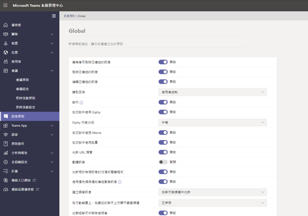
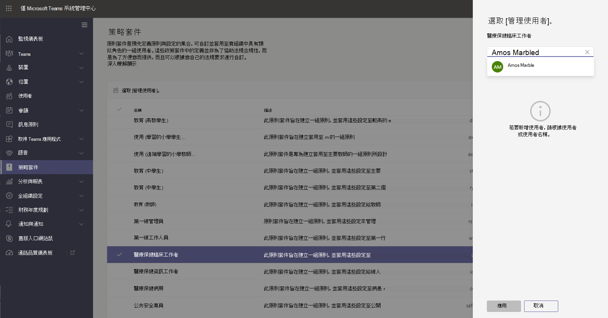

# 適用於教育界的 Teams 原則和原則套件

[!INCLUDE [policy-wizard-edu](includes/policy-wizard-edu.md)]

> [!NOTE]
> 如需更多有關 Microsoft Teams 中原則的案例，請參閱[在 Microsoft Teams 中將原則指派給您的使用者](policy-assignment-overview.md)。

## 系統管理員：開始使用 Microsoft Teams 原則管理

Microsoft Teams 讓使用者能夠參與線上會議或即時活動、聊天、進行通話及使用應用程式。 若要為 Teams 中的學生打造安全的學習環境，設定合適的 Microsoft Teams 原則是關鍵性的步驟。 身為系統管理員，您可使用原則來控制教育機構使用者可使用的 Teams 功能。 在大多數的情況下，您必須針對學生和教師調整原則，以確保環境的安全。  

以下是您可在 Microsoft Teams 中找到的主要原則區域清單。 若要深入瞭解每個區域中的原則及其控制的功能，請使用下列連結：

- [會議](meeting-policies-overview.md)
- [即時活動](teams-live-events/configure-teams-live-events.md)
- [通話](teams-calling-policy.md) 
- [訊息](messaging-policies-in-teams.md)
- [Teams](teams-policies.md)
- [應用程式權限](teams-app-permission-policies.md)

:::image type="content" source="media/edu-admin-center-users.png" alt-text="已套用原則的使用者螢幕擷取畫面。":::

只要使用系統管理員認證登入，即可在 [Microsoft Teams 系統管理中心](https://admin.teams.microsoft.com)輕鬆管理所有 Teams 原則。

### 哪裡可找到 Microsoft Teams 原則

登入 Teams 系統管理中心後，只要按一下 Teams 系統管理中心左側導覽區中的原則選項，即可移至任何需要管理的 Teams 區域原則設定。我們已經提供訊息原則位置的螢幕擷取畫面。

:::image type="content" source="media/edu-messaging-policies.png" alt-text="Teams 系統管理中心的訊息原則位置。":::

### 如何建立及更新原則定義

將原則指派給使用者之前，您必須先新增並建立 Teams 中每個功能區域的原則定義。

> [!NOTE]
> 建議您為學生和教師設定不同的原則定義。

根據預設，每個新使用者 (學生或教師) 都會被指派全域 (全組織預設值) 原則定義。 我們建議您使用全域 (全組織預設值) 作爲您最嚴格的原則定義。 在大部分的情況下，學生比較適合使用一組較嚴格的原則。 透過這種方式使用全域 (全組織預設值) 原則定義，可確保新使用者在加入您的租用戶時可受到最嚴厲的限制。 若要遵守本指導方針，建議您按照下列步驟操作：

1. 針對每個 Teams 的功能區域建立自訂原則定義，其中包含符合教師需求的原則值（如不進行此動作，教師的存取權會與全域 (全組織預設值) 原則定義中的學生存取權一樣受到限制）。

1. 將這些新的自訂原則定義指派給教師。

1. 使用適合學生的值來編輯每個功能區域的全域 (全組織預設值) 原則定義。

1. 只要沒有指派其他原則定義，全域 (全組織預設值) 原則定義就會套用在學生身上。

若要建立或編輯原則定義，請移至您要使用的原則功能區域 (例如，訊息原則)。 選取 **[新增]** 以建立新的自訂原則定義。 若要變更現有的原則定義，選取 **[編輯]**。

:::image type="content" source="media/edu-messaging-policies-add-closeup.png" alt-text="具有 [新增] 按鈕檢視的 [訊息原則] 區段特寫。":::

無論選擇新增或編輯原則定義，您都會移至一個檢視，其中列出所有與此原則區域相關的原則選項。 使用此清單來選取您要在原則定義中設定的值。

> [!IMPORTANT]
> 離開頁面之前，請不要忘記選取 **[儲存]**。

### 指派原則定義 
您可以使用多種方法指派原則定義給使用者。 每種方式都有其各自的優點和缺點，並將因您機構的獨特需求而有所不同。  

在大多數的情況下，我們建議您使用群組原則指派來指派原則給使用者。 這種方式可讓您更快速且更順利地套用原則。  當使用者新增到已指派原則定義的群組時，新的使用者會自動繼承該群組的原則。  當環境中需要新增及移除大量使用者，例如學期開始和結束的時候，這可讓您更輕鬆地管理原則。  

我們也建議您分批次指派大型組織的原則，在您需要將原則指派給大型使用者的情況下，這會非常合適。 若要深入瞭解這些套用原則的方式，請參閱 [[將原則指派給學校中的大型使用者]](batch-group-policy-assignment-edu.md)。

如果您的機構比較小，或需要更新個別學生或教師的原則設定，請依照下列指示進行。  

> [!IMPORTANT]
> 個別使用者等級的原則指派會取代指派給該使用者的任何群組原則。 請確認您只有在想取代群組原則設定時，才使用個別原則指派。 

#### 如何將原則定義指派給使用者

> [!NOTE]
> 指派原則定義時，可能需要一段時間才會散佈給所有使用者和用戶端。 您可能想要在 Azure/M365 中第一次建立使用者帳戶時，以及在新學生加入教育機構時執行此動作。

建立或更新原則定義後，如要將原則指派給使用者，您可在原則頁面中選取 **[管理使用者]**，搜尋所需的使用者，然後套用原則。

![[管理使用者] 面板在右側的 [訊息原則] 頁面上方。](media/edu-manage-users-pane.png)

您也可導覽至 **[使用者]**，選取您要更新原則的使用者、選取 **[原則]**，然後選取 **[編輯]**，進而將原則指派給使用者。 您可以在此選取您要指派給每個功能區域使用者的原則定義。

![[編輯使用者原則] 窗格 (位於 [指派的原則] 頁面的右側)。](media/edu-edit-user-policies-pane.png)

### Microsoft Teams 中的原則套件
> [!NOTE]
> 如需詳細資訊，請參閱[在 Microsoft Teams 中 管理原則套件](manage-policy-packages.md)，了解將一個套件指派給單一使用者、將大量套件指派給多達 5000 個使用者，以及管理和更新每個套件所連結原則的逐步指引。

Teams 中的原則套件會收集您在上述內容中了解的預先定義原則和原則設定，並將其指派給機構中具有類似角色的使用者。 原則套件可簡化原則管理，並有助於達到一致性。 在一般做法中，您會為每個使用者指派一個原則套件，並視需要重新定義每個套件中的原則，以符合該使用者群組的需求。 當您更新套件中的設定時，指派至該套件的所有使用者都會變更為大量更新。

一般來說，教育機構有許多具有獨特需求的使用者，在一定程度上是取決於學生的年齡和成熟度。 例如，您可以為教職員授與 Microsoft Teams 的完整權限，但又想要為學生限制 Microsoft Teams 功能，以促進安全且專注的學習環境。 您可以使用原則套件，根據您的教育機構社群中不同族群的需求來量身打造設定。

> [!IMPORTANT]
> 我們主要推薦您在學生身上套用全域 (全組織預設值) 原則定義，而不是原則套件。 這可確保貴組織的新使用者永遠都套用適合學生的一組嚴格原則。 如果這個建議不符合您機構的需求，以下其中一個 [學生原則] 套件可能是不錯的替代方案。 

就如同本文先前所述的原則清單，原則套件會為下列各預先定義套件：

- 會議
- 即時活動
- 通話
- 訊息中心
- 應用程式權限

Microsoft Teams 目前包含下列原則套件：

|Microsoft Teams 系統管理中心所列的套件名稱 |最適合用於  |描述 |
|:--- |:--- |:--- |
|**Education_Teacher**| 教職員| 您可使用這組原則和原則設定，透過 Microsoft Teams 為貴組織的教職員授與交談、通話和會議的完整權限。 |
|**Education_PrimaryStudent**| 小學熟齡學生  | 您機構內較年輕的小學熟齡學生可能需要更多的 Microsoft Teams 限制。 使用這組原則和原則設定來限制會議建立和管理、交談管理和私人通話等功能。 |
|**Education_SecondaryStudent**| 中學熟齡學生 | 您機構內的中學熟齡學生可能需要更多的 Microsoft Teams 限制。 使用這組原則和原則設定來限制會議建立和管理、交談管理和私人通話等功能。 |
|**Education_HigherEducationStudent**| 高等教育學生 | 相較於較年輕的學生，您機構內的高等教育學生需要的限制較少，但建議採取一些限制。 您可使用這組原則和原則設定來提供組織內部交談、通話和會議的權限，但限制學生與外部參與者使用 Microsoft Teams 的方式。 |
|**Education_PrimaryTeacher_RemoteLearning**| 教職員 | 建立適用於小學教師的一組原則，以便在使用遠端學習時將學生安全性和共同作業最大化。 |
|**Education_PrimaryStudent_RemoteLearning**| 小學熟齡學生| 建立適用於學生的一組原則，以便在使用遠端學習時將學生安全性和共同作業最大化。
|||

:::image type="content" source="media/edu-policy-packages-list.png" alt-text="[原則套件] 頁面，其中包含可供選擇的原則套件清單。":::

每個個別原則都會被賦予原則套件的名稱，以便輕鬆識別連結至原則套件的原則。 例如，當您將 Education_Teacher 原則套件指派給您教育機構中的教師時，系統就會為套件中的每個原則建立名為 Education_Teacher 的原則。

> [!NOTE]
> 如果您決定教師和行政支援職員需要不同的原則，則可重新設定現有套件的用途：找出您目前未使用的套件，並將設定變更為適合該群組。 您可能需要自行記下哪個群組有哪個套件，但這是重新設定套件用途的唯一障礙。

## 管理原則套件

### 檢視

在指派套件之前，請查看原則套件中每個原則的設定。 在 Microsoft Teams 系統管理中心的左側流覽中，選取 **[原則套件]**，選取套件名稱，然後選取原則名稱。

决定預先定義的值是否適合貴組織，或者您是否需要根據組織的需求將它們自訂為更嚴格或更寬鬆的值。

### 自訂

視需要自訂原則套件中的原則設定，以符合貴組織的需求。 您對原則設定所做的任何變更都會自動套用到已指派套件的使用者。 要編輯原則套件中原則的設定，請在 Microsoft Teams 系統管理中心，選取該原則套件，選取要編輯的原則名稱，然後選取 **[編輯]**。

請記住，您可以在指派原則套件之後變更套件中的原則設定。 若要深入了解，請參閱 [自訂原則套件中的原則](manage-policy-packages.md#customize-policies-in-a-policy-package)。 

### 指派

將原則套件指派給使用者。如果使用者已獲指派原則，後來您指派不同的原則，則會優先處理最新的指派。

> [!NOTE]
> 每位使用者都需要 [進階通訊] 附加元件，才能接收自訂原則套件指派。 如需詳細資訊，請參閱 [Microsoft Teams 的進階通訊附加元件](/microsoftteams/teams-add-on-licensing/advanced-communications) (部分機器翻譯)。

#### 將原則套件指派給一或多個使用者

若要將原則套件指派給一或多個使用者，請在 Microsoft Teams 系統管理中心的左側流覽窗格中，移至 **原則套件**，然後選取 **管理使用者**。  

若要深入了解，請參閱 [指派原則套件](assign-policy-packages.md)。

如果使用者已獲指派原則，後來您指派不同的原則，則會優先處理最新的指派。

#### 將原則套件指派給群組

**這項功能在私人預覽中**

透過向群組指派原則套件，可以將多個原則指派給一組使用者，例如安全性群組或通訊群組。 原則指派將根據優先順序規則傳播到群組成員。 在群組中新增或移除成員時，系統會相應地更新其繼承的原則指派。 此方法推薦用於最多 50000 個使用者的群組，但也適用於較大的群組。

若要深入了解，請參閱 [將原則套件指派到群組](assign-policy-packages.md#assign-a-policy-package-to-a-group)。

#### 為一大組 (批) 使用者指派原則套件

使用批次原則套件指派，將原則套件一次性指派給大組使用者組。 您可以使用 [CsBatchPolicyPackageAssignmentOperation](/powershell/module/teams/new-csbatchpolicypackageassignmentoperation) Cmdlet 來提交一批使用者和您要指派的原則套件。 系統會將工作處理為背景作業，並為每個批次產生作業識別碼。

批次最多可包含 5000 個使用者。 您可以使用使用者的物件識別碼、UPN、SIP 位址或電子郵件地址來指定使用者。 若要深入了解，請參閱 [將原則套件指派到一批使用者](assign-policy-packages.md#assign-a-policy-package-to-a-batch-of-users)。

## 為了學生安全所應指派的原則

如需進一步瞭解保護您環境中的學生所需採取的步驟，請仔細檢查 [在使用 Teams 進行遠距教學時確保學生安全](https://support.office.com/article/keeping-students-safe-while-using-meetings-in-teams-for-distance-learning-f00fa399-0473-4d31-ab72-644c137e11c8)。
