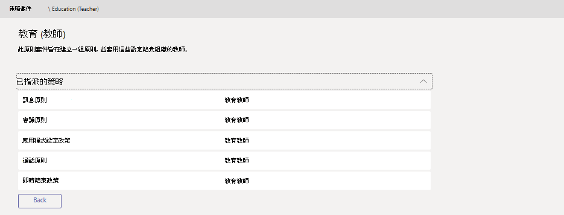

# 適用於教育界的 Teams 原則和原則套件

> [!NOTE]
> 如需更多有關 Microsoft Teams 中原則的案例，請參閱[在 Microsoft Teams 中將原則指派給您的使用者](assign-policies.md)。

請務必注意，本文將涵蓋多種將原則指派給 Teams 使用者的方式。

- 手動指派給個別使用者。
- 透過 PowerShell 大量指派給多個使用者。
- 將原則套件指派給個別或多個使用者。

這些方法的優點與缺點追根究柢在於機構的個別需求。

## 系統管理員：開始使用 Microsoft Teams 原則管理

Microsoft Teams 的核心是關於使用者能夠做一些事情，例如參與會議或即時活動、交談、進行通話及使用應用程式。 若要為 Teams 中的學生打造安全的學習環境，設定合適的 Microsoft Teams 原則是關鍵性步驟。 身為系統管理員，您可使用原則來控制教育機構使用者可使用的 Teams 功能。

以下是您可在 Microsoft Teams 中找到的原則區域清單：

- 會議
- 即時活動
- 通話
- 傳訊
- Teams
- 應用程式權限

:::image type="content" source="media/edu-admin-center-users.png" alt-text="已套用原則的使用者螢幕擷取畫面。":::

只要使用系統管理員認證登入，即可在 [Microsoft Teams 系統管理中心](https://admin.teams.microsoft.com)輕鬆管理所有 Teams 原則。

### 哪裡可找到 Microsoft Teams 原則

登入 Teams 系統管理中心後，只要按一下 Teams 系統管理中心左側導覽區中的原則選項，即可移至任何需要管理的 Teams 區域原則設定。 我們已納入傳訊原則位置的螢幕擷取畫面。

:::image type="content" source="media/edu-messaging-policies.png" alt-text="Teams 系統管理中心的訊息原則位置。":::

### 如何建立及更新原則定義

將原則指派給使用者之前，您必須先新增並建立 Teams 中每個功能區域的原則定義。

> [!NOTE]
> 建議您為學生和教師設定不同的原則定義。

根據預設，每個新使用者 (學生或教師) 都會被指派全域 (全組織預設值) 原則定義。 建議您遵循下列步驟操作：

1. 您可針對每個 Teams 功能區域建立自訂原則定義，然後將其指派給教師 (若未這麼做，您對全域原則所做的變更都會限制教師，直到其擁有自己的原則為止)。
1. 將教師指派至這個新原則定義。
1. 更新全域 (全組織預設值) 原則定義，然後將其指派給學生。

若要建立或編輯原則定義，請移至您要使用的原則功能區域 (例如，傳訊原則)。 如果您想建立新的自訂原則定義，請選取 **[新增]** (您將針對為教師建立的自訂原則定義執行此動作)。 否則，若要變更現有原則定義，請選取 **[編輯]** (如果您選擇為學生更新全域原則，您就會這麼做)。

:::image type="content" source="media/edu-messaging-policies-add-closeup.png" alt-text="具有 [新增] 按鈕檢視的 [傳訊原則] 區段特寫。":::

無論選擇新增或編輯原則定義，您都會移至一個檢視，其中列出所有與此原則區域相關的原則選項。 使用此清單來選取您要在原則定義中設定的值。

> [!IMPORTANT]
> 離開頁面之前，請不要忘記選取 **[儲存]**。

### 如何將原則定義指派給使用者

> [!NOTE]
> 指派原則定義時，可能需要一段時間才會散佈給所有使用者和用戶端。 您可能想要在 Azure/M365 中第一次建立使用者帳戶時，以及在新學生加入教育機構時執行此動作。

建立或更新原則定義後，您即可在原則頁面中選取 **[管理使用者]**，搜尋所需的使用者，然後套用原則。

![右側的 [管理使用者] 面板 (在 [傳訊原則] 頁面之上)。](media/edu-manage-users-pane.png)

您也可導覽至 [使用者]，選取您要更新原則的使用者、選取 [原則]，然後選取 [編輯]，進而將原則指派給使用者。 您可以在此選取您要指派給每個功能區域使用者的原則定義。

> [!IMPORTANT]
> 如果您屬於大型教育機構，則透過 Microsoft Teams 系統管理入口網站體驗來為每位使用者設定原則可能有所困難。 透過 PowerShell 分批指派原則是比較好的做法。 我們有一些教育界專屬資訊，說明如何[在您的教育機構中將原則指派給大量使用者集合](batch-policy-assignment-edu.md) (如果您有需要)，而您也可查看以下關於原則套件的章節，這是另一種為大量使用者群組管理原則和設定的絕佳方式。

![[編輯使用者原則] 窗格 (位於 [指派的原則] 頁面的右側)。](media/edu-edit-user-policies-pane.png)

### Microsoft Teams 中的原則套件

Teams 中的原則套件會收集您在上述內容中了解的預先定義原則和原則設定，並將其指派給機構中具有類似角色的使用者。 原則套件可簡化原則管理，並有助於達到一致性。 在一般做法中，您會為每個使用者指派一個原則套件，並視需要重新定義每個套件中的原則，以符合該使用者群組的需求。 當您更新套件中的設定時，指派至該套件的所有使用者都會變更為大量更新。

一般來說，教育機構有許多具有獨特需求的使用者，在一定程度上是取決於學生的年齡和成熟度。 例如，您可以為教職員授與 Microsoft Teams 的完整權限，但又想要為學生限制 Microsoft Teams 功能，以促進安全且專注的學習環境。 您可以使用原則套件，根據您的教育機構社群中不同族群的需求來量身打造設定。

> [!NOTE]
> 如需詳細資訊，請參閱[在 Microsoft Teams 中 管理原則套件](manage-policy-packages.md)，了解將一個套件指派給單一使用者、將大量套件指派給多達 5000 個使用者，以及管理和更新每個套件所連結原則的逐步指引。

就如同本文先前所述的原則清單，原則套件會為下列各預先定義套件：

- 會議
- 即時活動
- 通話
- 傳訊
- Teams
- 應用程式權限

Microsoft Teams 目前包含下列原則套件：

|Microsoft Teams 系統管理中心所列的套件名稱 |最適合用於  |描述 |
|:--- |:--- |:--- |
|**Education_Teacher**| 教職員| 您可使用這組原則和原則設定，透過 Microsoft Teams 為貴組織的教職員授與交談、通話和會議的完整權限。 |
|**Education_PrimaryStudent**| 小學熟齡學生  | 您機構內較年輕的小學熟齡學生可能需要更多的 Microsoft Teams 限制。 使用這組原則和原則設定來限制會議建立和管理、交談管理和私人通話等功能。 |
|**Education_SecondaryStudent**| 中學熟齡學生 | 您機構內的中學熟齡學生可能需要更多的 Microsoft Teams 限制。 使用這組原則和原則設定來限制會議建立和管理、交談管理和私人通話等功能。 |
|**Education_HigherEducationStudent**| 高等教育學生 | 相較於較年輕的學生，您機構內的高等教育學生需要的限制較少，但建議採取一些限制。 您可使用這組原則和原則設定來提供組織內部交談、通話和會議的權限，但限制學生與外部參與者使用 Microsoft Teams 的方式。 |
|**Education_PrimaryTeacher_RemoteLearning**| 教職員 | 建立適用於小學教師的一組原則，以便在使用遠端學習時將學生安全性和共同作業最大化。 |
|**Education_PrimaryStudent_RemoteLearning**| 小學熟齡學生| 建立適用於學生的一組原則，以便在使用遠端學習時將學生安全性和共同作業最大化。
|||

:::image type="content" source="media/edu-policy-packages-list.png" alt-text="[原則套件] 頁面，其中包含可供選擇的原則套件清單。":::

每個個別原則都會被賦予原則套件的名稱，以便輕鬆識別連結至原則套件的原則。 例如，當您將 Education_Teacher 原則套件指派給您教育機構中的教師時，系統就會為套件中的每個原則建立名為 Education_Teacher 的原則。

> [!NOTE]
> 如果您決定教師和行政支援職員需要不同的原則，則可重新設定現有套件的用途：找出您目前未使用的套件，並將設定變更為適合該群組。 您可能需要自行記下哪個群組有哪個套件，但這是重新設定套件用途的唯一障礙。

## 為了學生安全所應指派的原則

### 會議原則

#### 關閉建立及開始會議的功能

> [!NOTE]
> 您可能不會在您的租用戶中立即發現這項功能。 這是因為這項功能目前正在推出，並會在推出給所有租用戶後，提供給所有使用者使用。 如需相關資訊，請參閱 [Teams 藍圖](https://www.microsoft.com/microsoft-365/roadmap?filters=&searchterms=63355)。

若要確保學生無法安排不需出席的會議，請在會議原則中透過下列 [一般] 設定將會議建立功能設為 **[關閉]**：

- **允許在頻道中立即開會**：關閉
- **允許 Outlook 增益集**：關閉
- **允許頻道會議排程**：關閉
- **允許排程私人會議**：關閉

![[遠端學習的教育機構學生] 頁面，其中顯示的 [一般] 區段已關閉所有選項。](media/edu-policy-list-a.png)

- 而在相同頁面上的會議 [參與者與來賓] 區段中:
  - **允許在私人會議中立即開會**: 關閉
  - **允許在會議中交談**: 已停用

![[參與者與來賓] 區段，其中的 [允許在私人會議中立即開會] 選項設為 [關閉]。](media/edu-participants-and-guests.png)

關閉 **在通道中立即開會**、**允許管通道會議排程**、**允許排程私人會議**，以及 **在私人會議中立即開會** 給學生們使用的功能，而且還透過封鎖會議成為召集人，他們也提供下列教育版安全措施：

- 如果學生嘗試在授課者之前加入會議，他們將無法在最新版本的 Teams 應用程式加入會議。
- 雖然會議建立適用于任何使用者和任何授權，但是上述所述會議聯結區塊的安全性措施只適用于基於使用者授權類型的 Teams 中的教育客戶。

當您將 **允許在會議中交談** 原則設定為停用，並封鎖學生在上方排程會議的時間，並將此原則用於教師（如果會議沒有從頻道排定，或在頻道中立即開會），學生將無法在教師加入會議之前和會議結束之前交談。 在會議前後，他們仍能看到聊天記錄。 例如，他們可以看到來自教師的郵件或會議記錄連結（如果會議已錄製）。

如果學生和授課者都將 **允許在會議中交談** 原則關閉，就無法在會議交談視窗中交談。 以上所述會議交談限制中的安全措施只適用于根據使用者授權類型列出的 Teams 中的教育客戶。

#### 控制學生是否可以在通話和會議期間共用其視訊

在 [會議原則] 區段中，確保您為學生設定的音效和視覺效果值符合您的教學機構指導方針，以及學生、教師及家長和監護人的要求 (**[允許雲端錄製]** 例外，我們建議將其設為 **[關閉]**)。

選項如下：

- **允許抄寫**：關閉/開啟
- **允許雲端錄製**：**關閉**
- **允許 IP 視訊**：關閉/開啟

:::image type="content" source="media/edu-policy-list-b.png" alt-text="其中顯示視訊選項的 [遠端學習的教育機構學生] 頁面。":::

### 即時活動原則

#### 關閉建立及開始即時活動的功能

若要確保學生無法安排不需出席的即時活動，請將學生的 **[允許排程]** 原則設為 **[關閉]**，藉此停用該原則。

:::image type="content" source="media/edu-allow-scheduling-off.png" alt-text="已關閉 [允許排程] 選項的 [遠端學習的教育機構學生] 頁面。":::

### 通話原則

#### 關閉進行私人通話的功能

若要確保學生無法與其他學生或教師進行私人通話，請將學生的 **[進行私人通話]** 原則設為 **[關閉]**，藉此停用該原則。

:::image type="content" source="media/edu-private-calls-off.png" alt-text="[進行私人通話] 設為 [關閉] 的 [遠端學習的教育機構學生] 頁面。":::

### 傳訊原則

#### 關閉刪除或編輯已傳送的訊息功能

- 針對學生：若要確保學生所傳送的訊息不會遭到刪除或更改，學生應將這些設定 **[關閉]**：
  - **刪除已傳送的訊息**
  - **編輯已傳送的訊息**
- 針對教師：若要確保教師可以節制或刪除學生所傳送的不當訊息，教師應將這些設定 **[開啟]**：
  - **擁有者可刪除已傳送的訊息** (此設定允許教師刪除不當的學生訊息)
  - **刪除已傳送的訊息**
  - **編輯已傳送的訊息**

![[遠端學習的教育機構學生] 頁面，學生和教師對於已傳送訊息的設定。](media/edu-delete-edit-sent.png)

> [!NOTE]
> 如需本主題的詳細資訊，請參閱[在可成小組中將學生意見設為靜音](https://support.office.com/article/Mute-student-comments-in-a-class-team-a378de16-ffc0-420c-b08d-e17ec08e7c17)。

#### 控制學生是否可以私下交談

確保您為學生設定的 **[開啟/關閉交談]** 值符合您的教學機構指導方針，以及學生和教師的要求。 此控制項可開啟或關閉使用者在 Teams 中私下進行一對一交談或群組交談的功能。

![[遠端學習的教育機構學生] 頁面，其中的 [交談] 選項已關閉。](media/edu-chat-private.png)

#### 控制學生是否可以將其訊息個人化

確保您為學生設定的值符合您的教學機構指導方針，以及學生、教師、父母和監護人的要求。 我們建議將 **[學生的 Giphy]** 設為 **[關閉]**，而讓 **[Meme 和貼圖]** 保持 **[開啟]**。

![[遠端學習的教育機構學生] 頁面，其中顯示 Giphy 選項及 Meme 和貼圖選項。](media/edu-personalize-messages.png)

#### 控制學生是否可以傳送語音訊息

確保您為學生設定的 **[建立語音訊息]** 值符合您的教學機構指導方針，以及學生和教師的要求。

![[遠端學習的教育機構學生] 頁面，其中顯示 [建立語音訊息] 選項。](media/edu-create-send-voice-mess.png)

#### 針對學生關閉從聊天中移除使用者的功能

學生不應該具備將所納入的其他使用者從任何交談中移除的能力。 **[從群組交談中移除使用者]** 的設定應設為 **[關閉]**。

![[遠端學習的教育機構學生] 頁面，其中的 [從群組交談中移除使用者] 選項設為 [關閉]。](media/edu-remove-users-from-chat-for-students.png)

### Teams 原則

#### 關閉探索及建立私人頻道的功能

若要確保學生無法將私人頻道建立為在不受監督的個人通訊空間，請將學生的 **[建立私人頻道]** 原則設為 **[關閉]**。

![右側覆疊 [新 Teams 原則] 的 [Teams 原則] 頁面，而該面板上的 [建立私人頻道] 設定為 [關閉]。](media/edu-private-channels.png)

> [!IMPORTANT]
> 您可能也想要確保學生無法在 Microsoft Teams 中建立新的小組。 實際上這是 M365 群組的設定，您可以在[這裡](https://docs.microsoft.com/microsoft-365/admin/create-groups/manage-creation-of-groups)了解詳細資訊。

### 應用程式權限原則

#### 控制學生是否可以在 Teams 中新增應用程式

確保您為學生設定的值符合您的教育機構指導方針。 例如，如果您要讓學生接觸您核准的應用程式，則可選取：

- **Microsoft 應用程式**：**允許所有應用程式**
- **若為第三方應用程式**：**允許特定應用程式並封鎖所有其他應用程式**
- **若為租用戶應用程式**：**允許特定應用程式並封鎖其他應用程式**

:::image type="content" source="media/edu-policies-apps.png" alt-text="已設定應用程式原則選項的 [遠端學習的教育機構學生] 頁面。":::

> [!NOTE]
> 這是一個範例，如上所述，您應該依照您的教育機構指導方針來設定這些原則。

## 應針對教師指派的原則

以下是可供系統管理員為教師套用的建議原則設定，以便他們為學生提供安全的課程體驗。

> [!NOTE]
> 相較於您會在底下看到的教師章節，學生的原則建議中包含更多資訊。 雖然您可遵循您教育機構的自有原則和程序來進行原則設定，但此處提供的建議與學生的安全及安全性息息相關。

### 會議原則

這些設定可讓教師控制其會議的存取權。

- **讓匿名人員開始會議**：**關閉**
- **自動准許人員**：**貴組織中的每個人**
- **允許撥入使用者無需先在大廳等候**：**關閉**
- 1**DesignatedPresenterRoleMode**: **OrganizerOnlyUserOverride**

1 此設定不在 Microsoft Teams 系統管理中心中，因此需要透過 PowerShell 使用 [Set-CsTeamsMeetingPolicy](https://docs.microsoft.com/powershell/module/skype/set-csteamsmeetingpolicy) 或 [New-CsTeamsMeetingPolicy](https://docs.microsoft.com/powershell/module/skype/new-csteamsmeetingpolicy) cmdlet 設定 **DesignatedPresenterRoleMode** 參數。 這將 Teams **會議選項** 中 **誰可以進行簡報？** 的預設值設定為 **只有我**。 使用此設定時，只有會議召集人可以擔任簡報者，而其他所有會議參與者都會被指定為出席者。 若要深入了解，請參閱[會議原則設定 - 指定簡報者角色模式](meeting-policies-in-teams.md#meeting-policy-settings---designated-presenter-role-mode)。

> [!NOTE]
> 對於非授課者的人員，建議您將參數設定為 **EveryoneUserOverride** (對應 Teams 中的 **每個人** 設定) 或 **EveryoneInCompanyUserOverride** (相當於 Teams 中的 **組織中的人員** 設定)。

### 訊息原則

將 **[擁有者可刪除已傳送的訊息]** 設為 **[開啟]**，可讓教師監視交談工作階段並移除頻道會議中不當的訊息。

> [!NOTE]
> 如果會議建立於頻道內，還可讓教師移除課程交談中不當的訊息，或移除頻道內本身的訊息。

## 教師可執行哪些動作來保護學生

當然，設定原則是讓系統管理員在 Teams 設定中主動保護學生的絕佳方式，然而教師是定期與學生互動的人，他們在確保學生安全方面也扮演著很重要的角色。 系統管理員可以與一起共事的教師討論下列資訊。

### 透過會議選項設定會議角色

會議選項可讓您控制會議參與者是以出席者或主持人的身分加入會議。 您的選擇包括︰

- 移至 **[行事曆]** 並導覽至您要更新的會議。 按一下或點選加入會議連結附近的 **[會議選項]**，以開啟您的 **[會議選項]**。

![[加入 Microsoft Teams 會議] 邀請，[會議選項] 位於該邀請連結底下的最右邊。](media/edu-join-meeting-options.png)

- 控制哪些人可以透過 **[誰無需先在大廳等候]** 選項直接加入會議。 將其設為 **[我組織中的人員]**，讓外部使用者沒辦法直接加入，並將 **[一律讓通話者無需先在大廳等候]** 設為 **[關閉]**，讓參與者等候准許加入會議，而不是立即加入。 您也可以選擇 **[在通話者加入或離開時宣告]**，而這個選項應設為 **[開啟]**，您就能隨時留意參與會議的人員。
- 控制以主持人或出席者身分加入會議的人員。 您可以選取 **[只有我]**，將其他所有參與者指定為出席者。 對於在教室設定中舉行的會議，這是最安全的設定。
  - 如果預計會議中有多位主持人，請選取 **[特定人員]** 並挑選其他應該以主持人身分加入的參與者。 如果您希望所有參與者都是以主持人的身分加入會議，請選取 **[每個人]**。

:::image type="content" source="media/edu-meeting-options.png" alt-text="已選取 [我組織中的人員] 的 [誰無需先在大廳等候] 下拉式清單，以及已選取 [只有我] 的 [誰可以主持] 下拉式清單":::

### 線上會議中的角色

會議中的每個參與者都會被指派主持人或出席者角色。 參與者的角色會控制他們可在會議中執行的動作。 請參閱下表。

|功能  |召集人/主持人  |出席者  |
|---------|---------|---------|
|發言和共用視訊     |     Y     |     Y     |
|參加會議聊天     |     Y     |     Y     |
|私下檢視其他人所共用的 PowerPoint 檔案     |     Y     |     Y     |
|共用內容     |     Y     |     N     |
|將其他參與者設為靜音|     Y     |     N     |
|移除參與者      |     Y     |     N     |
|准許參與者從大廳加入|     Y     |     N     |
|變更其他參與者的角色     |     Y     |     N     |
|開始或停止錄製     |     Y     |     N     |

### 在會議期間變更角色

會議中的每個參與者都會被指派主持人或出席者角色。 參與者的角色會控制他們可在會議中執行的動作。

- 若要變更參與者的角色，請按一下或點選通話控制項中的 **[顯示參與者]**。 以滑鼠右鍵按一下角色需要變更的參與者，然後選取 **[成為出席者]** 或 **[成為主持人]**。

![顯示功能表選項的 [人員] 列，而 [成為出席者] 是功能表上的第四個選項。](media/edu-make-attendee-menu.png)

- 若要快速存取您的 [會議選項]，並針對目前的參與者和未來加入會議的人員變更其會議角色設定，請按一下或點選通話控制項中的 **[更多動作]**，然後按一下 **[顯示會議詳細資料]**。 您可以在會議的加入連結附近找到 **[會議選項]** 的連結。

:::image type="content" source="media/edu-meeting-details.png" alt-text="右側顯示 [會議詳細資料] 窗格的會議視窗。":::

### 將學生意見設為靜音

會議結束後，如果您排定了頻道會議，則可封鎖學生，使其無法進一步發表意見。

#### 針對特定會議

當您在頻道中安排會議時，會議本身就是一則頻道貼文，而會議交談則是貼文的複本。 如果您是小組擁有者，則可對該貼文按一下或點選 **[更多動作]**，再按一下 **[編輯]**。

:::image type="content" source="media/edu-meeting-edit.png" alt-text="在頻道貼文上選擇 [更多選項] 並看見 [編輯] 功能表選項 (快顯功能表上的第二個選項)。":::

編輯窗格上有一個下拉式選項，您可在其中將該選項設定為 **[您和仲裁者可以回覆]**。

![[編輯] 功能表上顯示 [每個人都可以回覆] 選項，以及 [您和仲裁者可以回覆] 選項旁有核取記號。](media/edu-you-and-mods-reply.png)

### 針對小組的所有會議和貼文

您可以控制學生何時能在課程小組和會議交談中貼文及回覆。 按一下或點選小組的 **[更多動作]**，按一下 **[管理小組]**，移至 **[成員]**，然後選取要設為靜音的個人或 **[將所有學生設為靜音]**。

## 深入閱讀

如需保護學生的詳細資訊，請參閱[使用 Teams 中的會議進行遠距教學時確保學生安全](https://support.office.com/article/keeping-students-safe-while-using-meetings-in-teams-for-distance-learning-f00fa399-0473-4d31-ab72-644c137e11c8)。
