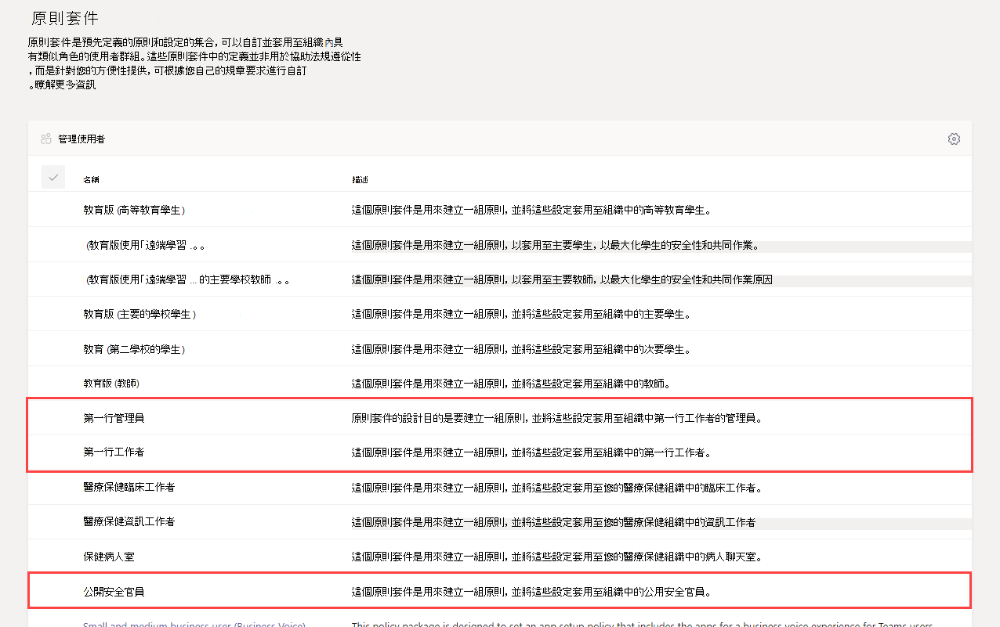
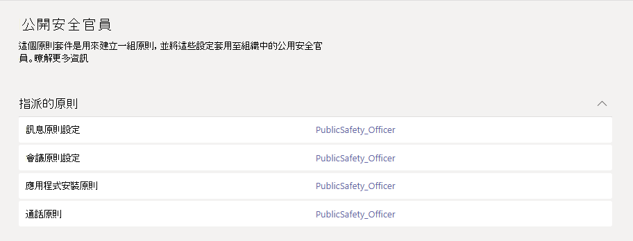

# 政府團隊原則套件Teams policy packages for government

> [!NOTE]
> 原則套件目前無法在 Microsoft 365 政府版 GCC 或 DoD 部署中使用。Policy packages are currently not available in Microsoft 365 Government GCC High or DoD deployments.

## 概觀Overview

Microsoft 團隊中的 [原則套件](manage-policy-packages.md) 是預先定義的原則與原則設定的集合，您可以指派給在組織中擁有相似角色的使用者。A [policy package](manage-policy-packages.md) in Microsoft Teams is a collection of predefined policies and policy settings that you can assign to users who have similar roles in your organization. 原則套件可簡化原則管理，並有助於達到一致性。Policy packages simplify, streamline, and help provide consistency when managing policies. 您可以自訂套件中原則的設定，以符合您的使用者需求。You can customize the settings of the policies in the package to suit the needs of your users. 當您變更原則套件中的原則設定時，指派給該套件的所有使用者都會取得更新的設定。When you change the settings of policies in a policy package, all users who are assigned to that package get the updated settings. 您可以使用 Microsoft [團隊系統管理中心] 或 [PowerShell] 管理 [原則套件]。You can manage policy packages by using the Microsoft Teams admin center or PowerShell.

原則套件根據套件預先定義下列各項原則：Policy packages pre-define policies for the following, depending on the package:

- 訊息傳送Messaging
- 會議Meetings
- 通話Calling
- App 設定App setup
- 即時事件Live events

團隊目前包含適用于政府的下列原則套件。Teams currently includes the following policy packages for government.

|Microsoft 團隊系統管理中心中的套件名稱Package name in the Microsoft Teams admin center|最適合用於Best used for|描述Description |
|---------|---------|---------|
|公開安全官員Public safety officer  |政府組織中的公用安全官員Public safety officers in your government organization  |建立一組原則與原則設定，適用于貴組織中的公用安全主管。Creates a set of policies and policy settings that apply to public safety officers in your organization. |
|第一線管理員Frontline manager  |第一線政府組織中的經理Frontline Managers in your government organization |建立一組原則，並將這些設定套用到貴組織中的第一線管理員。Creates a set of policies and applies those settings to Frontline Managers in your organization.|
|第一線 workerFrontline worker  |在您的政府組織中第一線工人Frontline Workers in your government organization |建立一組原則，並將這些設定套用到貴組織中的第一線工作人員。Creates a set of policies and applies those settings to Frontline Workers in your organization.|

系統會為每個個別原則指定原則套件的名稱，以便您輕鬆識別連結到原則套件的原則。Each individual policy is given the name of the policy package so you can easily identify the policies that are linked to a policy package. 例如，當您將公用安全專員原則套件指派給貴組織中的使用者時，會針對套件中的每個原則，建立一個名為 PublicSafety_Officer 的原則。For example, when you assign the Public safety officer policy package to users in your organization, a policy named PublicSafety_Officer is created for each policy in the package.

## 管理原則套件Manage policy packages

### 檢視View

在指派套件之前，請查看原則套件中每個原則的設定。View the settings of each policy in a policy package before you assign a package. 在 Microsoft Teams 系統管理中心的左側流覽中，選取 **[原則套件]**，選取套件名稱，然後選取原則名稱。In the left navigation of the Microsoft Teams admin center, select **Policy packages**, select the package name, and then select the policy name.

决定預先定義的值是否適合貴組織，或者您是否需要根據組織的需求將它們自訂為更嚴格或更寬鬆的值。Decide whether the predefined values are appropriate for your organization or whether you need to customize them to be more restrictive or lenient based on your organization's needs.

### 自訂Customize

視需要自訂原則套件中的原則設定，以符合貴組織的需求。Customize the settings of policies in the policy package, as needed, to fit the needs of your organization. 您對原則設定所做的任何變更都會自動套用到已指派套件的使用者。Any changes you make to policy settings are automatically applied to users who are assigned the package. 要編輯原則套件中原則的設定，請在 Microsoft Teams 系統管理中心，選取該原則套件，選取要編輯的原則名稱，然後選取 **[編輯]**。To edit the settings of a policy in a policy package, in the Microsoft Teams admin center, select the policy package, select the name of the policy you want to edit, and then select **Edit**.

請記住，您可以在指派原則套件之後變更套件中的原則設定。Keep in mind that you can also change the settings of policies in a package after you assign the policy package. 若要深入了解，請參閱 [自訂原則套件中的原則](manage-policy-packages.md#customize-policies-in-a-policy-package)。To learn more, see [Customize policies in a policy package](manage-policy-packages.md#customize-policies-in-a-policy-package). 

### 指派Assign

將原則套件指派給使用者。Assign the policy package to users. 如果使用者已獲指派原則，後來您指派不同的原則，則會優先處理最新的指派。If a user has a policy assigned, and then later you assign a different policy, the most recent assignment will take priority.

#### 將原則套件指派給一或多個使用者Assign a policy package to one or several users

若要將原則套件指派給一或多個使用者，請在 Microsoft Teams 系統管理中心的左側流覽窗格中，移至 **原則套件**，然後選取 **管理使用者**。To assign a policy package to one or multiple users, in the left navigation of the Microsoft Teams admin center, go to **Policy packages**, and then select **Manage users**.  

若要深入了解，請參閱 [指派原則套件](manage-policy-packages.md#assign-a-policy-package)。To learn more, see [Assign a policy package](manage-policy-packages.md#assign-a-policy-package).

如果使用者已獲指派原則，後來您指派不同的原則，則會優先處理最新的指派。If a user has a policy assigned, and then later you assign a different policy, the most recent assignment will take priority.

#### 將原則套件指派給群組Assign a policy package to a group

**這項功能在私人預覽中****This feature is in private preview**

透過向群組指派原則套件，可以將多個原則指派給一組使用者，例如安全性群組或通訊群組。Policy package assignment to groups let you assign multiple policies to a group of users, such as a security group or distribution list. 原則指派將根據優先順序規則傳播到群組成員。The policy assignment is propagated to members of the group according to precedence rules. 在群組中新增或移除成員時，系統會相應地更新其繼承的原則指派。As members are added to or removed from a group, their inherited policy assignments are updated accordingly. 此方法推薦用於最多 50000 個使用者的群組，但也適用於較大的群組。This method is recommended for groups of up to 50,000 users but will also work with larger groups.

若要深入了解，請參閱 [將原則套件指派到群組](assign-policies.md#assign-a-policy-package-to-a-group)。To learn more, see [Assign a policy package to a group](assign-policies.md#assign-a-policy-package-to-a-group).

#### 為一大組 (批) 使用者指派原則套件Assign a policy package to a large set (batch) of users

使用批次原則套件指派，將原則套件一次性指派給大組使用者組。Use batch policy package assignment to assign a policy package to large sets of users at a time. 您可以使用 [CsBatchPolicyPackageAssignmentOperation](https://docs.microsoft.com/powershell/module/teams/new-csbatchpolicypackageassignmentoperation) Cmdlet 來提交一批使用者和您要指派的原則套件。You use the [New-CsBatchPolicyPackageAssignmentOperation](https://docs.microsoft.com/powershell/module/teams/new-csbatchpolicypackageassignmentoperation) cmdlet to submit a batch of users and the policy package that you want to assign. 系統會將工作處理為背景作業，並為每個批次產生作業識別碼。The assignments are processed as a background operation and an operation ID is generated for each batch.

批次最多可包含 5000 個使用者。A batch can contain up to 5,000 users. 您可以使用使用者的物件識別碼、UPN、SIP 位址或電子郵件地址來指定使用者。You can specify users by their object Id, UPN, SIP address, or email address. 若要深入了解，請參閱 [將原則套件指派到一批使用者](assign-policies.md#assign-a-policy-package-to-a-batch-of-users)。To learn more, see [Assign a policy package to a batch of users](assign-policies.md#assign-a-policy-package-to-a-batch-of-users).

## 相關主題Related topics

[在 Teams 中管理原則套件Manage policy packages in Teams](manage-policy-packages.md)

[指派策略給小組中的使用者Assign policies to your users in Teams](assign-policies.md) 
