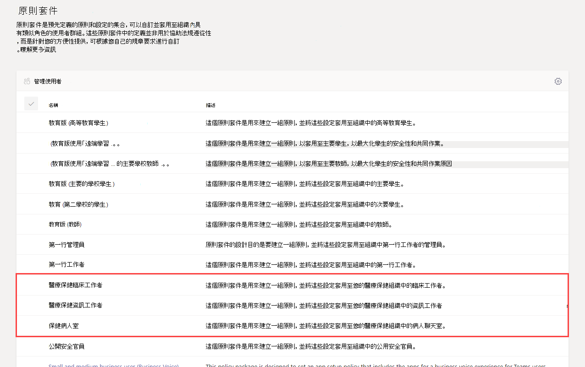
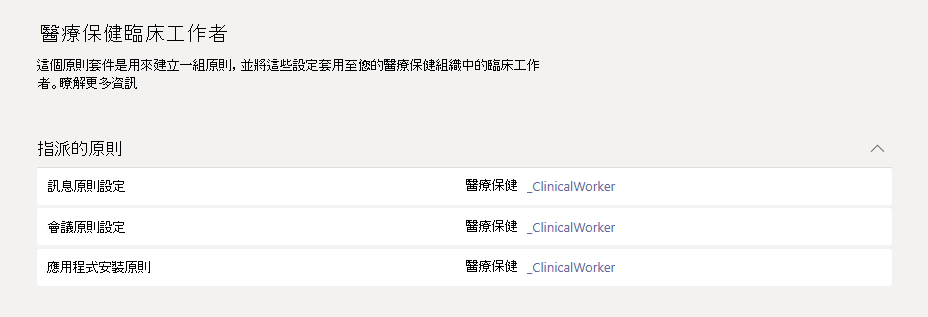

# 適用於醫療保健的 Teams 原則套件Teams policy packages for healthcare

## 概觀Overview

Microsoft Teams 中的 [原則套件](manage-policy-packages.md) 是預先定義的原則和原則設定的集合，您可以將之指派給組織中具有類似角色的使用者。A [policy package](manage-policy-packages.md) in Microsoft Teams is a collection of predefined policies and policy settings that you can assign to users who have similar roles in your organization. 原則套件可簡化原則管理，並有助於達到一致性。Policy packages simplify, streamline, and help provide consistency when managing policies. 您可以自訂套件中的原則之設定，以符合使用者的需求。You can customize the settings of the policies in the package to suit the needs of your users. 當您變更原則套件中的原則設定時，指派給該套件的所有使用者會取得更新的設定。When you change the settings of policies in a policy package, all users who are assigned to that package get the updated settings. 您可以使用 Microsoft Teams 系統管理中心或 PowerShell 來管理原則套件。You can manage policy packages by using the Microsoft Teams admin center or PowerShell.

> [!VIDEO https://www.microsoft.com/videoplayer/embed/RE4Ht2o]

以下項目的預先定義原則之原則套件，依套件而訂：Policy packages pre-define policies for the following, depending on the package:

- 訊息傳送Messaging
- 會議Meetings
- 通話Calling
- 應用程式設定App setup
- 即時活動Live events

Teams 目前包含下列醫療保健原則套件。Teams currently includes the following healthcare policy packages.

|Microsoft Teams 系統管理中心所列的套件名稱Package name in the Microsoft Teams admin center|最適合用於Best used for|描述Description |
|---------|---------|---------|
|醫療保健臨床工作者Healthcare clinical worker  |貴醫療保健組織的臨床工作者Clinical workers in your healthcare organization  |建立一組原則與原則設定，讓臨床工作者 (例如註冊的護士、護士長、醫生和社會工作者) 能完整存取聊天、通話、班次管理和會議。Creates a set of policies and policy settings that give clinical workers such as registered nurses, charge nurses, physicians, and social workers full access to chat, calling, shift management, and meetings. |
|醫療保健資訊工作者Healthcare information worker  |貴醫療保健組織的資訊工作者Information workers in your healthcare organization |建立一組原則與原則設定，讓資訊工作者 (例如 IT 人員、資訊人員、財務人員及法規人員) 能夠完整存取聊天、通話和會議。Creates a set of policies and policy settings that give information workers such as IT personnel, informatics staff, finance personnel, and compliance officers, full access to chat, calling, and meetings.|
|醫療保健病房Healthcare patient room  |病房裝置Patient room devices|建立一組原則與原則設定，適用於貴醫療保健組織的病房。Creates a set of policies and policy settings that apply to patient rooms in your healthcare organization.|

每個個別原則都會被賦予原則套件的名稱，以便輕鬆識別連結至原則套件的原則。Each individual policy is given the name of the policy package so you can easily identify the policies that are linked to a policy package. 例如，當您將醫療保健臨床工作者原則套件指派給貴組織的臨床醫生時，便會為套件中的每個原則建立名為 Healthcare_ClinicalWorker 的原則。For example, when you assign the Healthcare clinical worker policy package to clinicians in your organization, a policy named Healthcare_ClinicalWorker is created for each policy in the package.

## 開始使用原則套件Get started with policy packages

若要開始使用醫療保健原則套件，請在 Microsoft Admin Center 上線中心選取 **醫療保健**，然後選取 **根據角色指派原則設定**。To get you started with Healthcare policy packages, on the Microsoft Admin Center onboarding hub, select **Healthcare**, and then select **Assign policy settings by role**. 當您準備好開始後，請決定要指派給組織中的個人哪些原則套件。Once you’re ready to get started, decide which policy packages you'd like to assign individuals in your organization to.

選取 **檢視原則詳細資料** 以深入瞭解套件中的特定原則及其相應的設定。Select **View policy details** to learn more about the specific policies in a package and their respective settings. 指派後，您可以在 Teams 系統管理中心 [自訂](manage-policy-packages.md#customize-policies-in-a-policy-package) 這些設定。These [can be customized](manage-policy-packages.md#customize-policies-in-a-policy-package) after assignment in the Teams Admin Center.

選擇要指派的一或多個套件，然後按一下 **[下一步]**。Choose one or multiple packages to assign and then click **Next**. 您可以搜尋人員，並新增人員至最適合其角色的套件。You can search for and add people to the policy package best suited for their role. 無法一次將一個人員指派給多個原則套件。An individual can't be assigned to more than one policy package at one time.

一旦將人員新增到正確的原則套件，請點選 **完成** 以完成您的選取項目。Once you’ve added people to the right policy package, **Finish** finalizes your selections. 您可以繼續在 Microsoft Teams 系統管理中心自訂和管理原則套件。You can continue to customize and manage policy packages in the Microsoft Teams admin center.

## 管理原則套件Manage policy packages

### 檢視View

在指派套件之前，請查看原則套件中每個原則的設定。View the settings of each policy in a policy package before you assign a package. 在 Microsoft Teams 系統管理中心的左側瀏覽中，請移至 **[原則套件]**，選取套件名稱，然後選取原則名稱。In the left navigation of the Microsoft Teams admin center, go to **Policy packages**, select the package name, and then select the policy name.

决定預先定義的值是否適合貴組織，或者您是否需要根據組織的需求將它們自訂為更嚴格或更寬鬆的值。Decide whether the predefined values are appropriate for your organization or whether you need to customize them to be more restrictive or lenient based on your organization's needs.

### 自訂Customize

視需要自訂原則套件中的原則設定，以符合貴組織的需求。Customize the settings of policies in the policy package, as needed, to fit the needs of your organization. 您對原則設定所做的任何變更都會自動套用到已指派套件的使用者。Any changes you make to policy settings are automatically applied to users who are assigned the package. 要編輯原則套件中原則的設定，請在 Microsoft Teams 系統管理中心的左側瀏覽中，移至 **原則套件**，選取原則套件，選取要編輯的原則名稱，然後選取 **[編輯]**。To edit the settings of a policy in a policy package, in the left navigation of the Microsoft Teams admin center, go to **Policy packages**, select the policy package, select the name of the policy you want to edit, and then select **Edit**.

請記住，您可以在指派原則套件之後變更套件中的原則設定。Keep in mind that you can also change the settings of policies in a package after you assign the policy package. 若要深入了解，請參閱 [自訂原則套件中的原則](manage-policy-packages.md#customize-policies-in-a-policy-package)。To learn more, see [Customize policies in a policy package](manage-policy-packages.md#customize-policies-in-a-policy-package).

### 指派Assign

將原則套件指派給使用者。如果使用者已獲指派原則，後來您指派不同的原則，則會優先處理最新的指派。Assign the policy package to users. If a user has a policy assigned, and then later you assign a different policy, the most recent assignment will take priority.

#### 將原則套件指派給一或多個使用者Assign a policy package to one or several users

若要將原則套件指派給一或多個使用者，請在 Microsoft Teams 系統管理中心的左側流覽窗格中，移至 **原則套件**，然後選取 **管理使用者**。To assign a policy package to one or multiple users, in the left navigation of the Microsoft Teams admin center, go to **Policy packages**, and then select **Manage users**.  

若要深入了解，請參閱 [指派原則套件](manage-policy-packages.md#assign-a-policy-package)。To learn more, see [Assign a policy package](manage-policy-packages.md#assign-a-policy-package).

如果使用者已獲指派原則，後來您指派不同的原則，則會優先處理最新的指派。If a user has a policy assigned, and then later you assign a different policy, the most recent assignment will take priority.

#### 將原則套件指派給群組Assign a policy package to a group

**這項功能在私人預覽中****This feature is in private preview**

透過向群組指派原則套件，可以將多個原則指派給一組使用者，例如安全性群組或通訊群組。Policy package assignment to groups let you assign multiple policies to a group of users, such as a security group or distribution list. 原則指派將根據優先順序規則傳播到群組成員。The policy assignment is propagated to members of the group according to precedence rules. 在群組中新增或移除成員時，系統會相應地更新其繼承的原則指派。As members are added to or removed from a group, their inherited policy assignments are updated accordingly. 此方法推薦用於最多 50000 個使用者的群組，但也適用於較大的群組。This method is recommended for groups of up to 50,000 users but will also work with larger groups.

若要深入了解，請參閱 [將原則套件指派到群組](assign-policies.md#assign-a-policy-package-to-a-group)。To learn more, see [Assign a policy package to a group](assign-policies.md#assign-a-policy-package-to-a-group).

#### 為一大組 (批) 使用者指派原則套件Assign a policy package to a large set (batch) of users

使用批次原則套件指派，將原則套件一次性指派給大組使用者組。Use batch policy package assignment to assign a policy package to large sets of users at a time. 您可以使用 [CsBatchPolicyPackageAssignmentOperation](/powershell/module/teams/new-csbatchpolicypackageassignmentoperation) Cmdlet 來提交一批使用者和您要指派的原則套件。You use the [New-CsBatchPolicyPackageAssignmentOperation](/powershell/module/teams/new-csbatchpolicypackageassignmentoperation) cmdlet to submit a batch of users and the policy package that you want to assign. 系統會將工作處理為背景作業，並為每個批次產生作業識別碼。The assignments are processed as a background operation and an operation ID is generated for each batch.

批次最多可包含 5000 個使用者。A batch can contain up to 5,000 users. 您可以使用使用者的物件識別碼、UPN、SIP 位址或電子郵件地址來指定使用者。You can specify users by their object Id, UPN, SIP address, or email address. 若要深入了解，請參閱 [將原則套件指派到一批使用者](assign-policies.md#assign-a-policy-package-to-a-batch-of-users)。To learn more, see [Assign a policy package to a batch of users](assign-policies.md#assign-a-policy-package-to-a-batch-of-users).

## 相關主題Related topics

[在 Teams 中管理原則套件Manage policy packages in Teams](manage-policy-packages.md)

[在 Teams 中將原則指派給使用者Assign policies to your users in Teams](assign-policies.md)