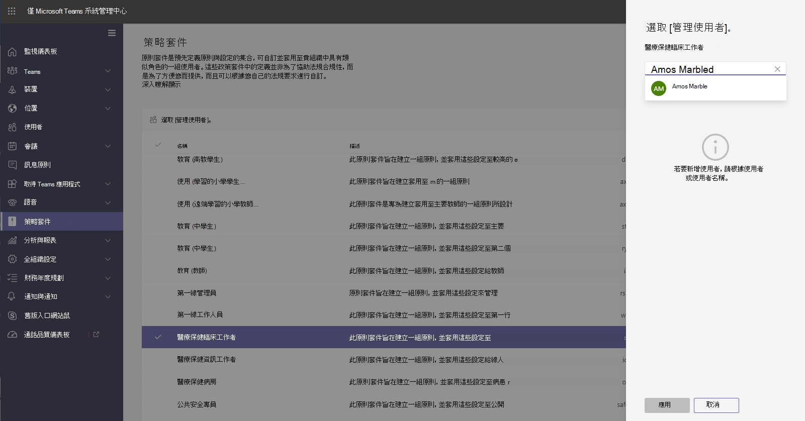

# 適用於醫療保健的 Teams 原則套件

## 概觀

Microsoft Teams 中的 [原則套件](manage-policy-packages.md) 是預先定義的原則和原則設定的集合，您可以將之指派給組織中具有類似角色的使用者。 原則套件可簡化原則管理，並有助於達到一致性。 您可以自訂套件中的原則之設定，以符合使用者的需求。 當您變更原則套件中的原則設定時，指派給該套件的所有使用者會取得更新的設定。 您可以使用 Microsoft Teams 系統管理中心或 PowerShell 來管理原則套件。

> [!VIDEO https://www.microsoft.com/videoplayer/embed/RE4Ht2o]

以下項目的預先定義原則之原則套件，依套件而訂：

- 訊息傳送
- 會議
- 通話
- 應用程式設定
- 即時活動

Teams 目前包含下列醫療保健原則套件。

|Microsoft Teams 系統管理中心所列的套件名稱|最適合用於|描述 |
|---------|---------|---------|
|醫療保健臨床工作者  |貴醫療保健組織的臨床工作者  |建立一組原則與原則設定，讓臨床工作者 (例如註冊的護士、護士長、醫生和社會工作者) 能完整存取聊天、通話、班次管理和會議。 |
|醫療保健資訊工作者  |貴醫療保健組織的資訊工作者 |建立一組原則與原則設定，讓資訊工作者 (例如 IT 人員、資訊人員、財務人員及法規人員) 能夠完整存取聊天、通話和會議。|
|醫療保健病房  |病房裝置|建立一組原則與原則設定，適用於貴醫療保健組織的病房。|

每個個別原則都會被賦予原則套件的名稱，以便輕鬆識別連結至原則套件的原則。 例如，當您將醫療保健臨床工作者原則套件指派給貴組織的臨床醫生時，便會為套件中的每個原則建立名為 Healthcare_ClinicalWorker 的原則。

## 開始使用原則套件

若要開始使用醫療保健原則套件，請在 Microsoft Admin Center 上線中心選取 **醫療保健**，然後選取 **根據角色指派原則設定**。 當您準備好開始後，請決定要指派給組織中的個人哪些原則套件。

選取 **檢視原則詳細資料** 以深入瞭解套件中的特定原則及其相應的設定。 指派後，您可以在 Teams 系統管理中心 [自訂](manage-policy-packages.md#customize-policies-in-a-policy-package) 這些設定。

選擇要指派的一或多個套件，然後按一下 **[下一步]**。 您可以搜尋人員，並新增人員至最適合其角色的套件。 無法一次將一個人員指派給多個原則套件。

一旦將人員新增到正確的原則套件，請點選 **完成** 以完成您的選取項目。 您可以繼續在 Microsoft Teams 系統管理中心自訂和管理原則套件。

## 管理原則套件

### 檢視

在指派套件之前，請查看原則套件中每個原則的設定。 在 Microsoft Teams 系統管理中心的左側瀏覽中，請移至 **[原則套件]**，選取套件名稱，然後選取原則名稱。

决定預先定義的值是否適合貴組織，或者您是否需要根據組織的需求將它們自訂為更嚴格或更寬鬆的值。

### 自訂

視需要自訂原則套件中的原則設定，以符合貴組織的需求。 您對原則設定所做的任何變更都會自動套用到已指派套件的使用者。 要編輯原則套件中原則的設定，請在 Microsoft Teams 系統管理中心的左側瀏覽中，移至 **原則套件**，選取原則套件，選取要編輯的原則名稱，然後選取 **[編輯]**。

請記住，您可以在指派原則套件之後變更套件中的原則設定。 若要深入了解，請參閱 [自訂原則套件中的原則](manage-policy-packages.md#customize-policies-in-a-policy-package)。

### 指派

Assign the policy package to users. If a user has a policy assigned, and then later you assign a different policy, the most recent assignment will take priority.

> [!NOTE]
> 每位使用者都需要 [進階通訊] 附加元件，才能接收自訂原則套件指派。 如需詳細資訊，請參閱 [Microsoft Teams 的進階通訊附加元件](/microsoftteams/teams-add-on-licensing/advanced-communications) (部分機器翻譯)。

#### 將原則套件指派給一或多個使用者

若要將原則套件指派給一或多個使用者，請在 Microsoft Teams 系統管理中心的左側流覽窗格中，移至 **原則套件**，然後選取 **管理使用者**。  

若要深入了解，請參閱 [指派原則套件](assign-policy-packages.md)。

如果使用者已獲指派原則，後來您指派不同的原則，則會優先處理最新的指派。

#### 將原則套件指派給群組

透過向群組指派原則套件，可讓您將多個原則指派給一組使用者，例如安全性群組或通訊群組清單。 原則指派將根據優先順序規則傳播到群組成員。 在群組中新增或移除成員時，系統會相應地更新其繼承的原則指派。 此方法推薦用於最多 50000 個使用者的群組，但也適用於較大的群組。

若要深入了解，請參閱 [將原則套件指派到群組](assign-policy-packages.md#assign-a-policy-package-to-a-group)。

#### 為一大組 (批) 使用者指派原則套件

使用批次原則套件指派，將原則套件一次性指派給大組使用者組。 您可以使用 [CsBatchPolicyPackageAssignmentOperation](/powershell/module/teams/new-csbatchpolicypackageassignmentoperation) Cmdlet 來提交一批使用者和您要指派的原則套件。 系統會將工作處理為背景作業，並為每個批次產生作業識別碼。

批次最多可包含 5000 個使用者。 您可以依使用者的物件識別碼、UPN、SIP 位址或電子郵件地址來指定使用者。 若要深入了解，請參閱 [將原則套件指派到一批使用者](assign-policy-packages.md#assign-a-policy-package-to-a-batch-of-users)。

## 相關主題

[在 Teams 中管理原則套件](manage-policy-packages.md)

[將原則套件指派給使用者和群組](assign-policy-packages.md)
