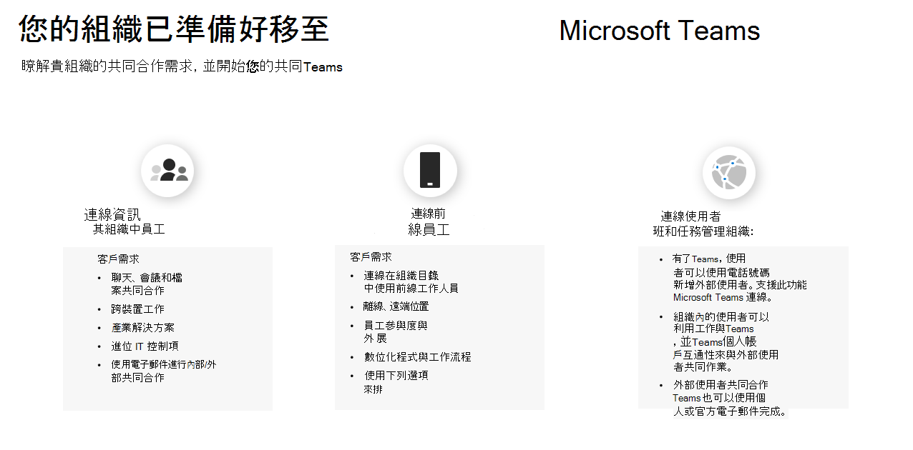

# 準備將 Kaizala 移至 Teams

> [!Important]
> Microsoft Kaizala 將于 2023 年 8 月 31 日淘汰。 我們建議移至 Microsoft Teams 以持續連線、共用和共同作業。 在淘汰日期之後，將會中止對 Kaizala 的存取及支援。

您決定從 Kaizala 移至 Microsoft Teams。

在開始之前，請務必回答下列兩個問題：

- 哪些使用者群組將移至 Teams？  

- 您前往 Teams 的路徑為何？

## 識別使用者群組

*貴組織中有哪些群組？誰將使用 Teams 以及如何使用？這些群組需要哪些需求才能有效進行團隊合作？* 若要開始您的 Teams 之旅，請先 **識別轉換的使用者群組。**  使用者群組是您員工中的一組員工，可在公司中的類似領域進行工作。 

我們已找出三個常見的使用者群組，以協助您識別共同作業需求。 就通訊而言，每個使用者群組都有其獨特的需求。 

 1. **資訊工作者** 是在其工作過程中建立、使用、轉換、取用或管理資訊的員工。

 2. **第一線工作人員** 多半是無桌上的工作者，其主要功能是直接與客戶合作，或直接與一般公用人員一起提供服務、支援及銷售產品，或直接參與產品/服務的製造。

 3. **外部使用者** 是組織外部的人員，例如供應商、廠商、商務合作夥伴、客戶或客戶。

與員工中的其他資訊工作者聯繫的使用者需要：

- 聊天、會議、檔案共同作業

- 跨裝置工作

- 產業解決方案

- 進階 IT 控制項
  
- 使用電子郵件進行內部和外部共同作業

與前線員工聯繫的使用者需要：

- 與其組織目錄內的前線工作者聯繫

- 離線、遠端位置

- 員工參與度與參與度

- 數位化程式和工作流程

- 班次排程與工作管理

與外部使用者 (供應商/供應商) 連線的使用者可以使用：

- [Microsoft Teams 使用者可以與組織外部的任何 Teams 使用者聊天](https://techcommunity.microsoft.com/t5/microsoft-teams-blog/microsoft-teams-users-can-now-chat-with-any-teams-user-outside/ba-p/3070832)

- [新增或邀請 Teams 組織外部的人員加入聊天](https://support.microsoft.com/en-us/office/add-or-invite-people-outside-your-teams-org-to-a-chat-6897ab47-9f60-4db6-8b95-18599714fe57)

## 判斷路徑

確認使用者群組的共同作業需求之後，您將能夠判斷從 Kaizala 到 Teams 的路徑的外觀。 每個組織都是獨一無二的，而且員工的旅程不會完全相同。 目前未使用 Teams 的組織必須做出額外的策略性決策，以確保順利移轉。 決定路徑將協助您找出應該完成的任何重要動作，以便順利轉換。

我們已根據您組織的目前使用方式，概述路徑可能包含哪些專案：  

對於 **未使用 Teams 的** 組織：

 1. 為您的組織構想團隊合作

 2. 試驗 Teams
  
 3. 部署 Teams
  
 4. 使用 Kaizala 和 Teams
  
 5. 管理變更

 6. 規劃採用 Teams

 7. 將貴組織移至 Teams

對於 **已使用 Teams** 的組織：

 1. 規劃您的轉場

 2. 管理變更

## 後續步驟

[規劃成功轉換到 Microsoft Teams](/MicrosoftTeams/plan-your-move-kaizala)
