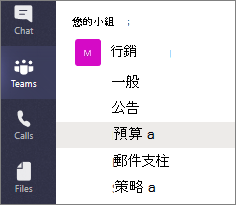
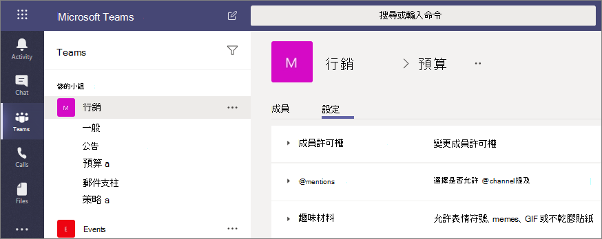

# Microsoft Teams 中的私人頻道

Microsoft Teams 中的私人頻道為小組內的共同作業建立了焦點空間。 只有小組中身為私人頻道的擁有者或成員的使用者，才可以存取頻道。 任何人 (包括來賓) 都可以新增為私人頻道的成員，只要他們已經是小組的成員即可。

如果要將共同作業限制為需要知道的人員，或是在不另外建立小組來管理已指派特定專案小組的情況下，促進小組人員之間的溝通，您可能會想要使用私人頻道。

例如，在下列情況中，私人頻道相當實用：

- 小組中的一群人希望能有個專屬空間能共同作業，而不需建立個別小組。
- 小組中的一小群人希望使用私人頻道來討論機密資訊，例如預算、資源、戰略定位等。

鎖定圖示表示私人頻道。 只有私人頻道的成員才能查看以及參與他們所加入的私人頻道。

私人頻道建立之後，會連結到父系小組，且不能移至其他小組。 此外，私人頻道不能轉換成標準頻道，反之亦然。

## 建立專用通道

依預設，任何小組擁有者或小組成員都可以建立私人頻道。 來賓則無法建立。 您可以在小組階層和組織層級管理建立私人頻道的功能。 使用 [原則](teams-policies.md) 來控制您組織中的哪些使用者可以建立私人頻道。 一旦您設定好原則，小組擁有者就可以在小組的 [ **設定** ] 索引標籤中關閉或開啟成員建立私人頻道的功能。

建立私人頻道的人即為私人頻道擁有者，只有私人頻道擁有者可以直接新增或移除頻道中的人員。 私人頻道擁有者可以將任何小組成員新增至他們建立的私人頻道，包括來賓。 私人頻道的成員有安全的交談空間，而且新成員加入之後，他們可以在該私人頻道中查看所有交談 (甚至是舊的交談)。

小組擁有者可以查看其小組中所有私人頻道的名稱，也可以刪除小組中的任何私人頻道。 (已刪除的私人頻道可以在刪除後的30 天內還原。) 小組擁有者無法查看私人頻道中的檔案或私人頻道的交談和成員清單，除非他們是該私人頻道的成員。

小組成員只能看到已新增的私人頻道。

## 新增及移除擁有者和成員

如果私人頻道擁有者是一或多個私人頻道的最後一位擁有者，則無法透過 Teams 用戶端將其移除。

如果私人頻道擁有者離開您的組織，或從與小組相關的 Microsoft 365 群組中移除，則私人通道的成員會自動升級為私人通道擁有者。

如果小組成員離開或從小組移除，該使用者也會從小組中的所有私人頻道離開或被移除。 如果將使用者新增回小組，則必須將該使用者新增回小組中的私人頻道。

## 頻道擁有者設定

每個私人通道都有自己的頻道擁有者可以管理的設定，包括新增和移除成員的功能、新增索引標籤，以及整個頻道的 @mentioning。 這些設定與父系小組設定彼此無關。 私人頻道建立時會繼承父系小組的設定，之後，就可以變更其設定，與父系小組設定互不相干。

私人頻道擁有者可以按一下 [管理頻道]，然後使用 [成員] 和 [設定] 索引標籤來新增或移除成員及編輯設定。

## 私人通道擁有者和成員動作

下表概述擁有者、成員、來賓可在私人頻道中執行哪些動作。

|動作  |小組擁有者|小組成員|小組來賓|私人頻道擁有者|私人頻道成員|私人頻道來賓|
|---------|---------|---------|---------|---------|---------|---------|
|建立私人頻道|系統管理控制|管理員和小組擁有者加以控制|否|不適用|不適用|N/A|
|刪除私人頻道|是|否|否|是|否|否|
|離開私人頻道|N/A|不適用|不適用|是，除非他們是最後一個擁有者|是|是|
|編輯私人頻道|否|不適用|不適用|是|否|否|
|還原已刪除的私人頻道|是|否|否|是|否|否|
|新增成員|否|不適用|不適用|是|否|否|
|編輯設定|否|不適用|不適用|是|否|否|
|管理索引標籤和應用程式|否|不適用|不適用|是，小組必須安裝應用程式|頻道擁有者控制|否|

## 管理私人頻道的生命週期

請參閱 [管理團隊私人頻道的生命週期](private-channels-life-cycle-management.md) ，以取得如何管理組織中的專用頻道生命週期的指導方針。 這包括如何控制貴組織的使用者是否能夠建立私人頻道、如何代表小組擁有者建立私人頻道、如何取得所有私人頻道訊息的清單以進行封存和稽核之用，以及其他管理工作。  

## 私人頻道 SharePoint 網站

每個私人通道都有自己的 SharePoint 網站。 單獨的網站是確保專用通道檔案的存取權僅限於專用通道的成員。 根據預設，這些網站是使用文件庫建立的，而且可透過 [網站管理介面](https://support.office.com/article/A2F2A5C2-093D-4897-8B7F-37F86D83DF04)輕鬆地增強至完整功能的網站。 每個網站都是在與父團隊的網站相同的地理區域中建立。 這些輕量型網站擁有自訂範本識別碼 TEAMCHANNEL#0，可讓您透過 PowerShell 和圖形 API 更輕鬆地進行管理。

私人通道網站會同步處理資料分類，並繼承父小組網站的來賓存取權。 網站擁有者和成員群組的成員資格會與團隊內的私人頻道成員資格保持同步。 在 SharePoint 中，對擁有者或成員群組的成員資格所做的任何變更，都會自動在四個小時內還原為私人通道成員資格。 在特定使用者需要存取文件而不需要存取私人頻道訊息的情況下，請將他們新增至網站上的 [訪客] 群組，或新增至與擁有者和成員不同的新群組。

團隊會管理私人頻道網站的生命週期。 如果網站是在小組外刪除，只要私人通道仍在使用中，背景作業就會在四個小時內復原網站。 如果網站遭到永久刪除，就會為專用通道提供新的網站。

如果已還原私人頻道或包含私人頻道的小組，就會將這些網站還原。 如果私人通道網站已還原，且超過專用通道的30天虛刪除視窗，該網站就會以獨立的網站的方式運作。

## 私人頻道訊息合規性記錄

在私人頻道中傳送的訊息記錄會傳送到所有私人頻道成員的信箱，而不是傳送到群組信箱。 記錄的標題會有格式設定，指出寄自哪一個私人頻道。

如需有關以「電子文件探索」搜索私人頻道訊息的詳細資訊，請參閱[私人頻道的電子文件探索](ediscovery-investigation.md#ediscovery-of-private-channels)。

## 私人通道中的檔案存取權注意事項

當您在私人頻道中建立新的 OneNote 筆記本時，其他使用者仍然可以存取該筆記本，因為「存取」行為與「和使用者共用私人頻道 SharePoint 網站中任何其他項目」的存取權相同。

如果透過 SharePoint 將私人頻道中筆記本的存取權授予使用者，則從小組或私人頻道中移除該使用者並不會移除該使用者對筆記本的存取權。

如果將現有的筆記本新增為專用頻道的索引標籤，則不會變更對專用通道的存取，且筆記本會保留其現有的許可權。

## 私人頻道限制

目前，私人頻道支援連接器和索引標籤 (Stream、Planner、Forms 除外)。 我們正致力讓私人頻道支援所有的應用程式，包括傳訊擴充功能和 Bot。

每個小組最多可以有 30 個私人頻道，每個私人頻道最多可以有 250 個成員。 30 個私人頻道限制不計入每個小組 200 個標準頻道的限制。 

當您從現有團隊建立團隊時，不會複製現有團隊中的任何私人頻道。

## 相關主題

[Teams 的小組和頻道概觀](teams-channels-overview.md)

[Teams PowerShell 概觀](teams-powershell-overview.md)

[使用 Microsoft 圖形 API 搭配 Teams](https://docs.microsoft.com/graph/api/resources/teams-api-overview)
