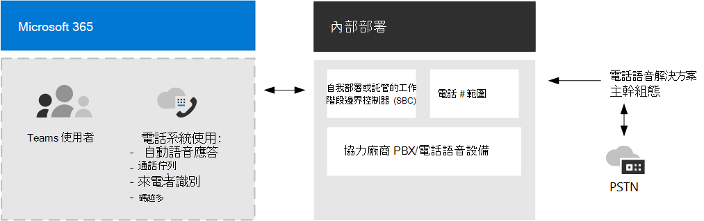

# PSTN 連接選項PSTN connectivity options

Microsoft 透過Exchange (提供) PBX 的完整私人分支電話系統。Microsoft provides complete Private Branch Exchange (PBX) capabilities for your organization through Phone System. 不過，若要讓使用者在組織外撥打電話，您必須將電話電話系統到公用交換電話網絡 (PSTN) 。However, to enable users to make calls outside your organization, you need to connect Phone System to the Public Switched Telephone Network (PSTN).

本文著重于 PSTN 連接選項。This article focuses on PSTN connectivity options. 有關 Microsoft 語音解決方案的詳細資訊，請參閱規劃您的電話系統[Teams語音解決方案](cloud-voice-landing-page.md)。For more information about Microsoft voice solutions, incuding details about Phone System features, see [Plan your Teams voice solution](cloud-voice-landing-page.md).

若要將電話系統 PSTN，您可以選擇下列選項：To connect Phone System to the PSTN, you can choose from the following options:

- [**通話方案**](#phone-system-with-calling-plan)。[**Calling Plan**](#phone-system-with-calling-plan). 以 Microsoft 做為 PSTN 電信公司的全雲端解決方案。An all-in-the-cloud solution with Microsoft as your PSTN carrier.

- [**直接路由**](#phone-system-with-direct-routing)，可讓您將會話邊界控制器 (SBC)  (至) PSTN 電話系統。[**Direct Routing**](#phone-system-with-direct-routing), which enables you to use your own PSTN carrier by connecting your Session Border Controller(s) (SBC) to Phone System.

- [**運算子連線**](#phone-system-with-operator-connect)，目前僅適用于公用 **預覽。**[**Operator Connect**](#phone-system-with-operator-connect), which is currently available only in **public preview.**  使用 [連線，如果您現有的電信公司是 Microsoft Operator 連線 計畫的參與者，他們可以管理 PSTN 通話和會話邊界控制器 (SBC) 。With Operator Connect, if your existing carrier is a participant in the Microsoft Operator Connect program, they can manage PSTN calling and Session Border Controllers (SBCs). 

您也可以選擇選項群組合，以設計複雜環境的解決方案，或管理多步驟移移。You can also choose a combination of options, which enables you to design a solution for a complex environment, or manage a multi-step migration.

請注意，您選擇的選項會影響某些電話系統功能的配置方式。Be aware that the option or options you choose affect how some Phone System features are configured. 詳細資訊，請參閱本文 [稍後的](#configuration-considerations) 組組考慮。For more information, see [Configuration considerations](#configuration-considerations) later in this article.

## 電話系統通話方案Phone System with Calling Plan 

電話系統方案是 Microsoft 針對使用者所使用之全雲端語音Teams解決方案。Phone System with Calling Plan is Microsoft's all-in-the-cloud voice solution for Teams users. 這是連接 PSTN 電話系統最簡單的選項。This is the simplest option that connects Phone System to the PSTN. 使用這個選項，Microsoft 會做為您的 PSTN 電信公司，如下圖所示：With this option, Microsoft acts as your PSTN carrier, as shown in the following diagram:

如果您對下列專案回答是，電話系統通話方案是適合的解決方案：If you answer yes to the following, then Phone System with Calling Plan is the right solution for you:

- 地區提供通話方案。Calling Plan is available in your region.
- 您不需要保留目前的 PSTN 電信公司。You do not need to retain your current PSTN carrier.
- 您想要使用 Microsoft 管理的 PSTN 存取權。You want to use Microsoft-managed access to the PSTN.

使用此選項：With this option: 

- 您可以Microsoft 電話國內或國際通話方案來使用系統，這些方案 (視全球授權服務等級) 。You get Microsoft Phone System with added Domestic or International Calling Plans that enable calling to phones around the world (depending on the level of service being licensed).

- 您不需要部署或維護內部部署，因為通話方案無法 &mdash; Microsoft 365。You do not require deployment or maintenance of an on-premises deployment&mdash;because Calling Plan operates out of Microsoft 365.

- 注意：如有需要，您可以選擇透過直接路由連接支援的會話邊界控制器 (SBC) ，以與 SBC 支援的協力廠商 PBX、類比裝置和其他協力廠商電話設備進行互通性。Note: If necessary, you can choose to connect a supported Session Border Controller (SBC) through Direct Routing for interoperability with third-party PBXs, analog devices, and other third-party telephony equipment supported by the SBC.

此選項需要不間斷地連接到Microsoft 365。This option requires uninterrupted connection to Microsoft 365.

有關通話方案的資訊，請參閱下列文章：For more information about Calling Plan, see the following articles:

- [哪一個通話方案適合您？Which Calling Plan is right for you?](calling-plan-landing-page.md)
- [如何購買通話方案How to buy a Calling Plan](calling-plans-for-office-365.md)
- [通話方案的適用國家與地區Country and region availability for Calling Plan](./country-and-region-availability-for-audio-conferencing-and-calling-plans/country-and-region-availability-for-audio-conferencing-and-calling-plans.md)
- [設定通話方案Set up Calling Plan](set-up-calling-plans.md)

## 電話系統直接路由Phone System with Direct Routing

這個選項會電話系統直接路由，將電話網絡連結至您的電話網絡，如下圖所示：This option connects Phone System to your telephony network by using Direct Routing, as shown in the following diagram: 

如果您對下列問題回答是，電話系統直接路由是適合的解決方案：If you answer yes to the following questions, then Phone System with Direct Routing is the right solution for you:

- 您想要在 Teams 中電話系統。You want to use Teams with Phone System.
- 您需要保留目前的 PSTN 電信公司。You need to retain your current PSTN carrier.
- 您想要混合路由，有些通話會透過通話方案進行，有些則透過您的電信公司進行。You want to mix routing, with some calls going through Calling Plan, some through your carrier.
- 您需要與協力廠商 PBX 和/或設備進行交互操作，例如架空傳呼機、類比裝置等。You need to interoperate with third-party PBXs and/or equipment such us overhead pagers, analog devices, and so on.

使用此選項：With this option:

- 您可以在 SBC 中 (會話邊界控制器) 電話系統，而不需要其他內部部署軟體。You connect your own supported Session Border Controller (SBC) to Phone System without the need for additional on-premises software.

- 您幾乎可以在任何電話電信業者電話系統。You can use virtually any telephony carrier with Phone System.

- 您可以選擇設定及管理這個選項，也可以由您的電信公司或合作夥伴設定及管理 (詢問您的電信公司或合作夥伴是否提供此選項) 。You can choose to configure and manage this option, or it can be configured and managed by your carrier or partner (ask if your carrier or partner provides this option).

- 您可以設定電話設備之間的互通性，例如協力廠商 PBX 和類比裝置 &mdash; &mdash; 電話系統。You can configure interoperability between your telephony equipment&mdash;such as a third-party PBX and analog devices&mdash;and Phone System.

此選項需要下列專案：This option requires the following:

- 不間斷地Microsoft 365。Uninterrupted connection to Microsoft 365.

- 部署及維護支援的 SBC。Deploying and maintaining a supported SBC.

- 與協力廠商電信公司簽訂合約。A contract with a third-party carrier.
   (除非已部署為選項，為使用通話方案的使用者提供協力廠商 PBX、類比裝置或其他電話電話系統裝置) (Unless deployed as an option to provide connection to third-party PBX, analog devices, or other telephony equipment for users who are on Phone System with Calling Plan.)

有關直接路由的資訊，請參閱下列文章：For more information about Direct Routing, see the following articles:

- [規劃直接路由Plan Direct Routing](direct-routing-plan.md)
- [設定直接路由Configure Direct Routing](direct-routing-configure.md)
- [管理語音路由策略，以用於直接路由Manage voice routing policies for use with Direct Routing](manage-voice-routing-policies.md)
- [規劃直接路由的依位置路由Plan Location-Based Routing for Direct Routing](location-based-routing-plan.md)
- [通過直接路由認證的工作階段邊界控制器清單List of Session Border Controllers certified for Direct Routing](direct-routing-border-controllers.md)

## 電話系統運算子連線Phone System with Operator Connect

如果您的現有電信連線是 Microsoft Operator 連線 計畫的參與者，則他們可以使用目前公開預覽版中的 [運算子Teams。With Operator Connect, currently in public preview, if your existing carrier is a participant in the Microsoft Operator Connect program, they can manage the service for bringing PSTN calling to Teams. 您的電信業者會管理 PSTN 通話服務和會話邊界控制 (SBC) ，讓您節省購買和管理硬體。Your carrier manages the PSTN calling services and Session Border Controllers (SBCs), allowing you to save on hardware purchase and management.

如果連線運算子或運算子，可能是適用于貴組織的解決方案：Operator Connect might be the right solution for your organization if:

- 您的地理位置無法提供 Microsoft 通話方案。Microsoft Calling Plan isn't available in your geographic location.
- 您偏好的電信公司是 Microsoft Operator 連線參與者。Your preferred carrier is a participant in the Microsoft Operator Connect program.
- 您想要尋找新的電信公司，以在 Teams。You want to find a new carrier to enable calling in Teams.

有關運算子和電信連線權益和需求的資訊，以及參與此計畫的電信公司清單，請參閱規劃運算子[連線。](operator-connect-plan.md)For information on the benefits and requirements of Operator Connect, and for a list of carriers participating in this program, see [Plan Operator Connect](operator-connect-plan.md). 若要瞭解如何設定運算子連線，請參閱[設定運算子連線。](operator-connect-configure.md)For information on how to configure Operator Connect, see [Configure Operator Connect](operator-connect-configure.md).

## 組組考慮Configuration considerations

無論您選擇電話系統 PSTN 連接選項，大多數的功能都是相同的。Most Phone System features are the same regardless of the PSTN connectivity option you choose. 例如，通話未回音和轉接設定、來電轉接、保留自訂音樂、通話保留、共用線路和語音應用程式都可用。For example, call unanswered and forwarding settings, call transfer, custom music on hold, call park, shared line, and voice apps are all available. 有關功能的完整電話系統清單，請參閱以下列出您取得[的功能](here-s-what-you-get-with-phone-system.md)電話系統。For a complete list of Phone System features, see [Here's what you get with Phone System](here-s-what-you-get-with-phone-system.md).

不過，功能有一些差異會影響您設定特定功能電話系統方式。There are some differences in functionality, however, that affect how you configure certain Phone System features. 例如，直接路由需要額外的步驟來設定通話路由。For example, Direct Routing requires additional steps to configure call routing. 另一個範例是，直接路由提供位置式路由 (LBR) ，這樣您才能限制特定地理位置不允許的付費旁路。As another example, Direct Routing provides Location-Based-Routing (LBR)--so that you can restrict toll bypass in certain geographic locations where it is not allowed. 

### 電話號碼管理Phone number management

Microsoft 有兩種可用的電話號碼：訂閱者 (使用者) 號碼，可指派給貴組織的使用者，以及服務號碼，以付費和免付費服務號碼提供。Microsoft has two types of telephone numbers available: subscriber (user) numbers, which can be assigned to users in your organization, and service numbers, available as toll and toll-free service numbers. 服務號碼的並行通話容量高於訂閱者號碼，並可以指派給音訊會議、自動語音服務或通話佇列等服務。Service numbers have higher concurrent call capacity than subscriber numbers and can be assigned to services such as Audio Conferencing, Auto Attendants, or Call Queues.

您必須決定：You will need to decide:

- 哪些使用者位置需要 Microsoft 的新電話號碼？Which user locations need new phone numbers from Microsoft?
- 我需要哪一 (或服務) 電話號碼？Which type of telephone number (subscriber or service) do I need?
- 如何將現有的電話號碼Teams？How do I port existing phone numbers to Teams?

您取得和管理電話號碼方式會根據您的 PSTN 連接選項而不同。How you acquire and manage phone numbers differs depending on your PSTN connectivity option.

- 有關管理通話方案電話號碼的資訊，請參閱 [管理貴組織的電話號碼](manage-phone-numbers-for-your-organization/manage-phone-numbers-for-your-organization.md)。For information about managing phone numbers for Calling Plan, see [Manage phone numbers for your organization](manage-phone-numbers-for-your-organization/manage-phone-numbers-for-your-organization.md).

- 有關管理直接路由電話號碼的資訊，請參閱設定電話號碼並 [啟用企業語音和語音信箱](direct-routing-enable-users.md#configure-the-phone-number-and-enable-enterprise-voice-and-voicemail-online)。For information about managing phone numbers for Direct Routing, see [Configure the phone number and enable enterprise voice and voicemail](direct-routing-enable-users.md#configure-the-phone-number-and-enable-enterprise-voice-and-voicemail-online).

- 有關使用運算子管理電話號碼連線，請參閱使用運算子設定電話號碼[連線。](operator-connect-configure.md#set-up-phone-numbers)For information about managing phone numbers with Operator Connect, see [Set up phone numbers with Operator Connect](operator-connect-configure.md#set-up-phone-numbers).

### 通話路由和撥號方案Call routing and dial plans

您設定通話路由方式會根據您的 PSTN 連接選項而不同。How you configure call routing differs depending on your PSTN connectivity option.  

- 針對通話方案，大部分的通話路由是由 Microsoft 通話方案基礎結構處理。For Calling Plans, most of call routing is handled by the Microsoft Calling Plan infrastructure. 您可以設定使用者撥號方案，以用於電話授權和通話路由的號碼翻譯。You configure user dial plans for purposes of number translation for call authorization and call routing. 詳細資訊，請參閱 [什麼是撥號方案？](what-are-dial-plans.md)。For more information, see [What are dial plans?](what-are-dial-plans.md).

- 針對直接路由，您必須指定語音路由並指派語音路由策略給使用者，來設定通話路由。For Direct Routing, you must configure call routing by specifying the voice routes and assigning voice routing policies to users. 您可以在主幹層級設定號碼翻譯的撥號方案，以確保與會話邊界控制器和 SBC (互通性) 。You can configure dial plans for number translation at the trunk level to ensure interoperability with Session Border Controllers (SBCs). 詳細資訊請參閱設定直接 [路由](direct-routing-voice-routing.md)的語音路由、 [管理語音路由策略](manage-voice-routing-policies.md) 和 [翻譯電話號碼](direct-routing-translate-numbers.md)。For more information, see [Configure voice routing for Direct Routing](direct-routing-voice-routing.md), [Manage voice routing policies](manage-voice-routing-policies.md) and [Translate phone numbers](direct-routing-translate-numbers.md). 

- 針對電信連線，大部分的通話路由是由電信公司管理。For Operator Connect, most of call routing is managed by the carrier.  您可以設定使用者撥號方案，以用於電話授權和通話路由的號碼翻譯。You configure user dial plans for purposes of number translation for call authorization and call routing. 詳細資訊，請參閱 [什麼是撥號方案？](what-are-dial-plans.md)。For more information, see [What are dial plans?](what-are-dial-plans.md).

### Location-Based直接路由的路由Location-Based Routing for Direct Routing

在某些國家和地區，忽略 PSTN 電信公司以降低長途通話費用是違法的行為。In some countries and regions, it's illegal to bypass the PSTN carrier to decrease long-distance calling costs. Location-Based直接路由 (LBR) 路由選項可讓您根據使用者的地理位置Teams付費旁路。Location-Based Routing (LBR) for Direct Routing enables you to restrict toll bypass for Teams users based on their geographic location. 若要進一步瞭解如何規劃及設定 LBR，請參閱下列文章：For more information about how to plan and configure LBR, see the following articles:

- [規劃直接路由的依位置路由Plan Location-Based Routing for Direct Routing](location-based-routing-plan.md)
- [設定依位置路由的網路設定Configure network settings for Location-Based Routing](location-based-routing-configure-network-settings.md)
- [啟用直接路由的依位置路由Enable Location-Based Routing for Direct Routing](location-based-routing-enable.md)
- [Contoso 案例研究：Location-Based路由Contoso case study: Location-Based Routing](voice-case-study-location-based-routing.md) 
  說明一家虛構的多國公司 Contoso 如何為Location-Based路由實作。Describes how a fictional multi-national corporation, Contoso, implemented Location-Based Routing for their organization.

### 緊急電話Emergency calling

您設定緊急電話方式會根據您的 PSTN 連接選項而不同。How you configure emergency calling differs depending on your PSTN connectivity option.

- 針對通話方案，每個使用者會自動啟用緊急電話，而且必須擁有與其指定電話號碼相關聯的已註冊緊急位址。For Calling Plan, each user is automatically enabled for emergency calling and is required to have a registered emergency address associated with their assigned telephone number. 支援 (用戶端Teams位置) 緊急電話。Dynamic emergency calling (based on the location of the Teams client) is supported.  

- 針對直接路由，您必須使用 Teams 緊急呼叫路由策略 (TeamsEmergencyCallRoutingPolicy) 來定義緊急號碼及其相關聯的路由目的地，以定義使用者的緊急通話政策。For Direct Routing, you must define emergency calling policies for users by using a Teams emergency call routing policy (TeamsEmergencyCallRoutingPolicy) to define emergency numbers and their associated routing destination. 直接路由使用者不支援已註冊的緊急位置。Registered emergency locations are not supported for Direct Routing users. 針對動態緊急電話，路由緊急電話時，可能需要進行其他組組，並可能還需要合作夥伴連接。For dynamic emergency calling, additional configuration is required for routing emergency calls and possibly for partner connectivity.

- 針對接線連線，每個使用者會自動啟用緊急電話，而且必須擁有與其指派的電話號碼相關聯的已註冊緊急位址，但只能由電信合作夥伴設定。For Operator Connect, each user is automatically enabled for emergency calling and is required to have a registered emergency address associated with their assigned telephone number but can only be set by the carrier partner. 支援 (用戶端Teams位置) 緊急電話。Dynamic emergency calling (based on the location of the Teams client) is supported.

若要進一步瞭解緊急通話概念和術語，以及如何設定緊急電話和動態緊急電話，請參閱下列文章：For more information about emergency calling concepts and terminology, and how to configure emergency calling and dynamic emergency calling, see the following articles:

- [管理緊急電話Manage emergency calling](what-are-emergency-locations-addresses-and-call-routing.md)
- [規劃和設定動態緊急電話Plan and configure dynamic emergency calling](configure-dynamic-emergency-calling.md)
- [管理緊急電話原則Manage emergency calling policies](manage-emergency-calling-policies.md)
- [管理直接路由的緊急通話路由策略Manage emergency call routing policies for Direct Routing](manage-emergency-call-routing-policies.md)
- [Contoso 案例研究：緊急電話Contoso case study: Emergency calling](voice-case-study-emergency-calling.md) 
  說明一家虛構的多國公司 Contoso 如何為組織實作緊急電話。Describes how a fictional multi-national corporation, Contoso, implemented emergency calling for their organization.

### 語音功能的網路拓撲Network topology for voice features

如果您要部署動態緊急電話或直接路由Location-Based路由，您必須設定網路設定，以在 Microsoft Teams。If you are deploying dynamic emergency calling or Location-Based Routing for Direct Routing, you must configure network settings for use with these features in Microsoft Teams. 若要瞭解如何設定網路區域、網路網站、網路子網和受信任的 IP 位址的網路設定，請參閱下列文章：To learn how to configure network settings for network regions, network sites, network subnets, and trusted IP addresses, see the following articles:

- [雲端語音功能的網路設定Microsoft Teams概念和術語Network settings for cloud voice features in Microsoft Teams - Concepts and terminology](cloud-voice-network-settings.md)
- [管理雲端語音功能的網路拓撲Microsoft TeamsManage your network topology for cloud voice features in Microsoft Teams](manage-your-network-topology.md)

