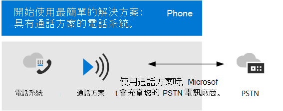

# PSTN 連線能力選項

Microsoft 透過電話系統為您的組織提供完整的私人分支 Exchange (PBX) 功能。 不過，若要讓使用者在組織外撥打通話，您必須將電話系統連線到公用交換電話網路 (PSTN) 。

本文著重于 PSTN 連線選項。 如需 Microsoft 語音解決方案的詳細資訊，請 incuding 電話系統功能的詳細資訊，請參閱[規劃 Teams 語音方案](cloud-voice-landing-page.md)。

若要將電話系統連接至 PSTN，您可以選擇下列選項：

- [**通話方案**](#phone-system-with-calling-plan)。 以 Microsoft 為 PSTN 載體的完整雲端解決方案。

- [**Operator 連線**](#phone-system-with-operator-connect)，目前僅適用于 **公開預覽。**  使用操作員連線，如果您現有的電信公司是 Microsoft 操作員連線計畫中的參與者，他們就可以管理 PSTN 通話和會話邊界控制器 (SBCs) 。 

- [**直接路由**](#phone-system-with-direct-routing)，可讓您將會話邊界控制器 (s)  (SBC) 至電話系統，以使用您自己的 PSTN 電信公司。

您也可以選擇選項的組合，這可讓您設計複雜環境的解決方案，或管理多步驟遷移。

請注意，您選擇的選項或選項會影響設定某些電話系統功能的方式。 如需詳細資訊，請參閱本文稍後的設定 [考慮](#configuration-considerations) 。

## 電話系統搭配通話方案 

電話系統搭配通話方案，是適用于 Teams 使用者的 Microsoft 所有雲端語音解決方案。 這是最簡單的選項，可將電話系統連接至 PSTN。 使用此選項時，Microsoft 會擔當您的 PSTN 電信公司，如下圖所示：

如果您對下列專案回答 [是]，則與通話方案電話系統是正確的解決方案：

- 您的地區提供通話方案。
- 您不需要保留目前的 PSTN 載體。
- 您想要使用 Microsoft 受管理的 PSTN 存取。

若選擇此選項︰ 

- 您獲得 Microsoft 電話系統及額外的國內或國際通話方案，可以撥打電話到世界各地 (視授權的服務等級而定)。

- 您不需要部署或維護內部部署， &mdash; 因為通話計畫的運作 Microsoft 365。

- 附注：如有必要，您可以選擇透過 Direct 路由 (SBC) 連接支援的會話邊界控制器，以與 SBC 所支援的協力廠商 PBXs、類比裝置及其他協力廠商電話語音裝置進行交互操作。

此選項需要與 Microsoft 365 無間斷的連線。

如需通話方案的詳細資訊，請參閱下列文章：

- [哪一個通話方案適合您？](calling-plan-landing-page.md)
- [如何購買通話方案](calling-plans-for-office-365.md)
- [通話方案的國家和地區可用性](./country-and-region-availability-for-audio-conferencing-and-calling-plans/country-and-region-availability-for-audio-conferencing-and-calling-plans.md)
- [設定通話方案](set-up-calling-plans.md)

## 電話系統，運算子連線

使用 Operator 連線，目前在公開預覽中，如果您現有的電信公司是 Microsoft 操作員連線計畫中的參與者，他們就可以管理服務，讓 PSTN 通話 Teams。 您的電信公司會管理 PSTN 通話服務和會話邊界控制器 (SBCs) ，可讓您儲存在硬體購買和管理上。

操作員連線可能是貴組織的正確解決方案：

- 您的地理位置無法使用 Microsoft 通話方案。
- 您的首選電信公司是 Microsoft 操作員連線方案中的參與者。
- 您要尋找新的電信公司，以在 Teams 中通話。

如需操作員連線的優點與需求的詳細資訊，以及參與此程式的電信公司清單，請參閱[Plan Operator 連線](operator-connect-plan.md)。 如需如何設定運算子連線的詳細資訊，請參閱[Configure Operator 連線](operator-connect-configure.md)。

## 使用直接路由的電話系統

此選項使用直接路由將電話系統連接至電話語音網路，如下圖所示： 

如果您對於以下問題的答案是肯定，則電話系統搭配直接路由就是適合您的解決方案：

- 您想要使用 Teams 搭配電話系統。
- 您必須保留您目前的 PSTN 電信業者。
- 您想要混用路由，有些通話透過通話方案，有些則透過您的電信業者。
- 您必須與協力廠商 PBXs 和/或設備進行交互操作，例如，我們的 us 高架呼叫器、類比裝置等等。

若選擇此選項︰

- 您可以將自己支援的會話邊界控制器 (SBC) 連接至電話系統，而不需要額外的內部部署軟體。

- 實際上，您可以使用電話系統的任何電話語音載波。

- 您可以選擇設定和管理這個選項，或是由您的電信業者或合作夥伴設定和管理 (請詢問您的電信業者或合作夥伴是否提供此選項)。

- 您可以設定電話語音裝置（例如 &mdash; 協力廠商 PBX 和類比裝置）和電話系統之間的互通性 &mdash; 。

此選項需要下列條件：

- 與 Microsoft 365 無間斷的連線。

- 部署和維護支援的 SBC。

- 與第三方電信業者的合約 (除非為電話系統搭配通話方案的使用者提供第三方 PBX、類比裝置或其他電話設備的連線，並將其部署為一個選項)。

如需直接路由的詳細資訊，請參閱下列文章：

- [規劃直接路由](direct-routing-plan.md)
- [設定直接路由](direct-routing-configure.md)
- [管理與直接路由搭配使用的語音路由原則](manage-voice-routing-policies.md)
- [規劃直接路由的依位置路由](location-based-routing-plan.md)
- [通過直接路由認證的工作階段邊界控制器清單](direct-routing-border-controllers.md)

## 設定考慮

不論您選擇的 PSTN 連線選項為何，大部分電話系統的功能都是相同的。 例如，通話無應答和轉寄設定、來電轉接、自訂的等候音樂、通話駐留、共用線及語音應用程式皆可供使用。 如需電話系統功能的完整清單，請參閱[以下是您使用電話系統所取得](here-s-what-you-get-with-phone-system.md)的功能。

有些功能有些差異，但會影響您設定特定電話系統功能的方式。 例如，直接路由需要額外的步驟來設定呼叫路由。 另一個範例是，Direct 路由提供以位置為基礎的路由 (LBR) --因此您可以在某些地理位置限制免付費旁路旁路，但不允許使用此功能。 

下表著重于主要設定差異。 表格後面的各節提供詳細資訊與詳細資料的連結。

| 選項 | 描述 | 電話號碼管理 | 通話路由 | 緊急通話的可用性 |
| :------------| :-------| :-------| :-------| :-------| 
| 通話方案 | -Microsoft 充當 PSTN 載體。 -您不需要購買或管理 SBCs。| 透過 Microsoft 取得。| -由 Microsoft 進行管理。   -系統管理員設定使用者的號碼轉譯撥號對應表。 | -由 Microsoft 啟用。   -管理登入位址。   -支援動態呼叫。 |
| 電信業者連線 | -電信管理 PSTN 連線能力和 SBCs。   -您不需要購買或管理 SBCs。 | -透超載波取得。   -與電信公司所管理之緊急位址相關聯的號碼。  | -由電信公司管理。  -系統管理員設定使用者的號碼轉譯撥號對應表。 | -由電信公司啟用。   -管理登入位址。   -支援動態呼叫。 |
| 直接路由 | -需要購自協力廠商廠商的認可 SBC。 -連線 SBC 進行電話系統。  -使用您現有的 PSTN 電信公司。 | 透超載波取得。 | -系統管理員需要額外設定。 -系統管理員設定中繼撥號對應表的數位轉譯。  -可用於限制免付費電話略用的 LBR。 | -系統管理員需要額外設定。  -不支援已註冊的位址。  -支援動態呼叫，但需要其他設定。 |
|||||

### 電話號碼管理

Microsoft 有兩種可用的電話號碼類型：訂戶 (使用者) 號碼，可以指派給您組織中的使用者，也可以指派給您組織中的使用者，並以收費和免付費服務號碼形式提供。 服務號碼的並行通話容量比訂閱者號碼還高，可指派給諸如音訊會議、自動語音應答或通話佇列等服務。

您將需要決定：

- 哪些使用者位置需要來自 Microsoft 的新電話號碼？
-  (訂閱者或服務) 需要哪種類型的電話號碼？
- 如何將現有的電話號碼埠設為 Teams？

您取得及管理電話號碼的方式會因您的 PSTN 連線選項而異。

- 如需管理通話方案電話號碼的詳細資訊，請參閱 [管理組織的電話號碼](manage-phone-numbers-for-your-organization/manage-phone-numbers-for-your-organization.md)。

- 如需使用操作員連線管理電話號碼的詳細資訊，請參閱[使用接線員連線設定電話號碼](operator-connect-configure.md#set-up-phone-numbers)」。

- 如需管理直接路由電話號碼的詳細資訊，請參閱 [設定電話號碼及啟用企業語音和語音信箱](direct-routing-enable-users.md#configure-the-phone-number-and-enable-enterprise-voice-and-voicemail-online)。

### 通話路由和撥號對應表

設定通話路由的方式視您的 PSTN 連線選項而有所不同。  

- 對於通話方案，大部分的呼叫路由是由 Microsoft 通話計畫基礎結構所處理。 您可以設定使用者撥號對應表，以供通話授權和通話路由的數位轉譯之用。 如需詳細資訊，請參閱[什麼是撥號對應表？](what-are-dial-plans.md)

- 針對操作員連線，大部分的呼叫路由是由電信公司所管理。  您可以設定使用者撥號對應表，以供通話授權和通話路由的數位轉譯之用。 如需詳細資訊，請參閱[什麼是撥號對應表？](what-are-dial-plans.md)

- 針對直接路由，您必須指定語音路由並指派語音路由原則給使用者，以設定通話路由。 您可以在主幹層級設定號碼轉譯的撥號對應表，以確保與會話邊界控制器的互通性 (SBCs) 。 如需詳細資訊，請參閱 [設定語音路由以進行直接路由](direct-routing-voice-routing.md)、 [管理語音路由原則](manage-voice-routing-policies.md) 和 [轉譯電話號碼](direct-routing-translate-numbers.md)。 

### 直接路由的位置型路由

在某些國家和地區，略過 PSTN 載波以減少長途通話成本是非法的。 Location-Based 路由 (LBR) 進行直接路由，可讓您根據地理位置來限制 Teams 使用者的免付費旁路。 如需如何規劃及設定 LBR 的詳細資訊，請參閱下列文章：

- [規劃直接路由的依位置路由](location-based-routing-plan.md)
- [設定依位置路由的網路設定](location-based-routing-configure-network-settings.md)
- [啟用直接路由的依位置路由](location-based-routing-enable.md)
- [Contoso 案例研究： Location-Based 路由](voice-case-study-location-based-routing.md) 
  說明虛構的多國公司（Contoso）如何針對其組織實施 Location-Based 路由。

### 緊急電話

設定緊急通話的方式，視您的 PSTN 連線選項而有所不同。

- 針對通話方案，會自動啟用每一位使用者進行緊急通話，而且必須有註冊的緊急位址與所指派的電話號碼相關聯。 支援以 Teams 用戶端) 的位置為基礎的動態緊急通話 (。  

- 針對操作員連線，會自動為每個使用者啟用緊急通話，而且必須有一個已註冊的緊急位址與其指定的電話號碼相關聯，但只能由電信公司夥伴設定。 支援以 Teams 用戶端) 的位置為基礎的動態緊急通話 (。

- 針對直接路由，您必須使用 Teams 緊急呼叫路由原則 (TeamsEmergencyCallRoutingPolicy) 定義使用者的緊急通話原則，以定義緊急號碼及其相關聯的路由目的地。 直接路由使用者不支援註冊的緊急位置。 若要進行動態緊急通話，必須進行其他設定，才能路由緊急通話，並可能用於夥伴連接。

如需有關緊急呼叫概念及術語的詳細資訊，以及如何設定緊急通話和動態緊急通話的詳細資訊，請參閱下列文章：

- [管理緊急電話](what-are-emergency-locations-addresses-and-call-routing.md)
- [規劃和設定動態緊急電話](configure-dynamic-emergency-calling.md)
- [管理緊急電話原則](manage-emergency-calling-policies.md)
- [管理直接路由的緊急電話路由原則](manage-emergency-call-routing-policies.md)
- [Contoso 案例研究：緊急通話](voice-case-study-emergency-calling.md) 
  說明虛構的多國公司 Contoso 如何對其組織執行緊急通話。

### 語音功能的網路拓撲

若要部署動態緊急通話或 Location-Based 路由進行直接路由，則必須設定 Microsoft Teams 中的這些功能使用的網路設定。 若要瞭解如何為網路地區、網路網站、網路子網和信任的 IP 位址設定網路設定，請參閱下列文章：

- [Microsoft Teams 中的雲端語音功能的網路設定-概念與術語](cloud-voice-network-settings.md)
- [在 Microsoft Teams 中管理雲端語音功能的網路拓撲](manage-your-network-topology.md)

