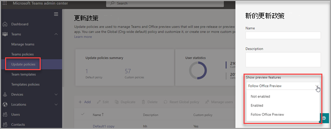

# Microsoft Teams 公開預覽

> [!NOTE] 
> 預覽中包含的功能可能不完整，且在公開發行之前可以會變更。提供預覽版僅針對評估和探索目的。Office 365 政府社群雲端 (GCC) 中不支援預覽版功能。

Microsoft Teams 的公開預覽可提供 Teams 中尚未發行功能的早期存取。預覽版可讓您探索並測試即將推出的功能。我們也歡迎您提供對於公開預覽中任何功能的意見反應。公開預覽將針對每個 Teams 使用者啟用，因此您不需要擔心會影響整個組織。

有關 Microsoft Teams 公開預覽中提供的功能清單，請瀏覽 [Microsoft Teams 公開預覽技術資訊附註](https://techcommunity.microsoft.com/t5/microsoft-teams-public-preview/bd-p/MicrosoftTeamsPublicPreview)、[Teams 系統管理功能的版本資訊](/OfficeUpdates/teams-admin)，以及 [Teams 中的新功能](https://support.microsoft.com/office/what-s-new-in-microsoft-teams-d7092a6d-c896-424c-b362-a472d5f105de)。

## 設定更新原則

公開預覽將針對每位使用者啟用，而開啟公開預覽的選項會在系統管理原則中控制。更新原則可用來管理會在 Teams 應用程式中看到搶鮮版或預覽版功能的 Teams 和 Office Preview 使用者。您可以使用全域 (全組織預設) 原則並進行自訂，或為您的使用者建立一個或多個自訂原則。

1. 登入系統管理中心。

2. 選取 **Teams** > **更新原則**，然後選取 **更新原則** 選項。

1. 選取 **新增** 以建立新原則，或選取現有原則以開啟 **更新原則**。

2. 為更新原則命名，新增描述，然後選取 **[顯示預覽功能]** 的設定。

   -   **追蹤 Office Preview** (預設值)：這個新的預設選項會自動為註冊 Office 目前通道 (預覽) 的任何使用者啟用 Microsoft Teams 公開預覽功能。 使用者不需要執行其他動作。
   -   **啟用**：無論使用者是否已註冊 Office 目前通道 (預覽)，此選項都會啟用 Microsoft Teams 公開預覽。 使用者也必須在 Teams 應用程式中選擇加入 Microsoft Teams 公開預覽。

   > [!NOTE]  
   > 對於不在 **目前通道 (預覽)** 中的 Microsoft Teams 公開預覽的現有使用者，IT 系統管理員需要從預設的 **追蹤 Office Preview** 切換到 **啟用**。
 
   - **未啟用**：使用者可能無法使用 Microsoft Teams 公開預覽功能。

      

您也可以使用 PowerShell `Set-CsTeamsUpdateManagementPolicy` cmdlet 和 `-AllowPublicPreview` 參數設定原則。

> [!NOTE]   
> AllowPreview 參數即將遭到取代。

## 啟用公開預覽

若要在桌面或 Web 用戶端上啟用公開預覽，您必須完成下列工作：

1. 選取設定檔左側的三個點以顯示 Teams 功能表。
2. 選取 **[關於]** > **[公開預覽]**。
3. 選取 [切換至公開預覽]。

> [!NOTE]  
> 此選項僅在 **顯示預覽功能** 設定為 **已啟用** 時可供使用。

## Teams 現在會追蹤 Office Preview 使用者

如果使用者位於 Windows 上 Office 365 用戶端的目前通道 (預覽)，**追蹤 Office Preview** 的新全域原則預設值就會自動讓使用者位於 Teams 的公開預覽通道中。

Microsoft Office 將繼續從目前通道 (預覽) 接收更新，而 Teams 用戶端將會透過公開預覽通道接收更新。 此原則不會根據 Teams 通道去切換 Office 通道。 

**如何保留您目前未使用 Office 目前通道 (預覽) 的現有 Teams 預覽使用者？**

對於您已允許加入或退出 Microsoft Teams 公開預覽的現有使用者，以及想要維持其目前形式設定的現有使用者，您必須從新的預設值 **追蹤 Office Preview** 切換到 **已啟用** (請參閱 [更新原則](#set-the-update-policy))

**如何退出此設定？**

您可以停用 Teams 系統管理中心的設定，從 **追蹤 Office Preview** 到 **未啟用** (請參閱 [設定更新原則](#set-the-update-policy))

## 已知問題

Office 目前通道 (預覽) 使用者可以透過 Teams 用戶端的關於功能表結束 Microsoft Teams 公開預覽，同時將其更新原則設為 **追蹤 Office Preview**。 此功能並非預期用途，未來將會移除。 如果使用者在 Office 的目前通道 (預覽)，當裝置下次閒置時，Teams 用戶端可能會自動將功能自行設回公開預覽。

## 相關主題

[公開開發人員預覽](/microsoftteams/platform/resources/dev-preview/developer-preview-intro)
