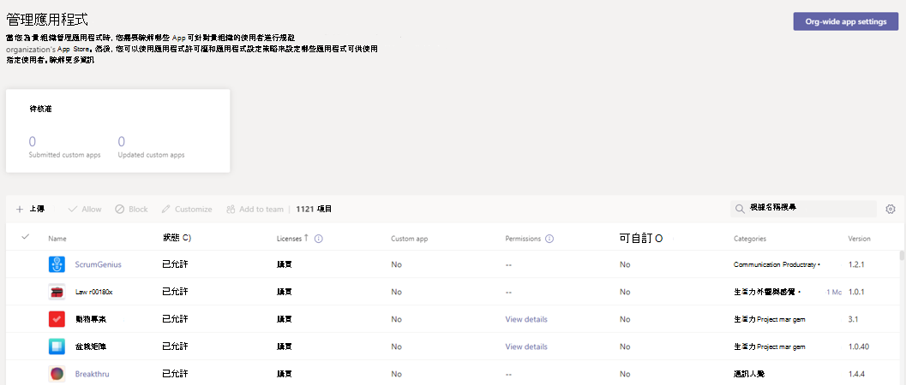

# 購買協力廠商應用程式Teams

Teams應用程式可免費安裝，有些應用程式可能需要購買服務訂閱，以體驗 App 的完整功能和範圍。 這些服務訂閱稱為軟體即服務 (SaaS) 方案，可透過[AppSource](https://appsource.microsoft.com/)購買，現在Microsoft Teams系統管理中心。

系統[管理中心](manage-apps.md)中的Microsoft Teams頁面，就是您查看及管理組織Teams應用程式的地方。 例如，您可以看見應用程式的組織層級狀態和屬性、將新的自訂應用程式上傳到組織的 App Store、封鎖或允許組織層級的應用程式，以及管理整個組織的應用程式設定。

您也可以在這裡為貴組織使用者購買協力廠商應用程式所提供的服務授權。 表格中 **的** 授權欄會指出應用程式是否提供要購買的 SaaS 訂閱。

## 在系統管理中心Teams應用程式

> [!IMPORTANT]
> 如果您想要封鎖使用者透過應用程式商店購買Teams，您必須封鎖應用程式。 如需如何封鎖應用程式之詳細資訊，請參閱管理 [應用程式](app-policies.md) 政策，或瞭解如何在組織層級封鎖 [應用程式](manage-apps.md#allow-and-block-apps)。

1. 在 Microsoft Teams 系統管理中心的左側瀏覽窗格中，移至 **Teams 應用程式** > **管理應用程式**。 您必須是全域系統管理員Teams服務系統管理員才能存取頁面。
2. 搜尋您想要的應用程式。 若要識別擁有付費 SaaS 訂閱的應用程式，請查看授權 **欄** 。 每個應用程式都會有下列其中一個值：
    - **購買**：應用程式提供 SaaS 訂閱，可供購買。  
    - **已** 購買：應用程式提供 SaaS 訂閱，而且您已購買其授權。
    - **- -**：應用程式不會提供 SaaS 訂閱。
3. 當您找到應用程式時，按一下 [ **購買** 並前往應用程式詳細資料 **頁面的** [方案與價格> 查看應用程式 SaaS 優惠的計畫和價格資訊。 如果您需要詳細資訊，請選取 **深入瞭解** 以前往 [AppSource 上的應用程式頁面](https://appsource.microsoft.com/)。

> [!NOTE]
> 私人方案也可能列出供購買，包括貴組織先前與 ISV 進行過商量的特殊價格。 這些方案在方案名稱下會 **標示為私人** 方案。

4. 若要訂閱應用程式，請選擇您想要的計畫， **然後選取購買**。 結帳流程會直接在系統管理中心Teams開啟。
5. 選取您想要購買的使用者授權數量。
6. 檢查帳單帳戶和銷售位址是否正確。 如果您還沒有，請選取 新增 來 **新增**。 有關帳單帳戶詳細資訊，請參閱 [瞭解帳單帳戶](/microsoft-365/commerce/manage-billing-accounts)。

> [!NOTE]
> 您必須是全域系統管理員才能新增帳單帳戶。

7. 檢查已選取正確的帳單設定檔。 如果您還沒有，請選取 新增 來 **新增**。 您可以選擇使用信用卡、轉帳卡或發票 [帳單付款](#invoice-billing)。 帳單設定檔也可讓您新增訂購單編號，以便日後識別您的訂單。 有關帳單設定檔詳細資訊，請參閱 [瞭解帳單設定檔](/microsoft-365/commerce/billing-and-payments/manage-billing-profiles)。
8. 選取 **下單**。
9. 選取 **設定以** 在發行者網站上啟用您的訂閱。 如果您在購買之後沒有設定您的訂閱，您可以稍後選取管理 **授權來設定訂閱**。

購買與應用程式關聯的 SaaS 優惠Teams，您可以在應用程式詳細資料頁面的 "方案與價格" 標籤上查看下列購買詳細資料。

- **授權啟用日期**：您授權啟用的日期。 如果您的帳戶尚未設定，這會顯示為訂閱 **擱置啟用。**
- **授權**：您購買授權的數量。

:::image type="content" source="media/purchase-third-party-apps-details-page.png" alt-text="應用程式詳細資料頁面的規劃與定價標籤的螢幕擷取畫面。":::

選取 **管理授權** 以前往Microsoft 365 系統管理中心以查看和管理您購買授權。

全域系統管理員可以新增更多授權、移除授權，以及取消組織中任何人購買的訂閱。 Teams系統管理員可以針對自己購買專案執行相同的動作。 不過，如果Teams系統管理員也有帳單系統管理員角色，他們可以管理組織中任何人的購買。

> [!NOTE]
> 如果全域系統管理員想要管理另一個全域系統管理員購買的訂閱，他們必須在同一個帳單帳戶中。 您可以選取訂閱中的應用程式，為另一個全域系統管理員提供您購買的訂閱Microsoft 365 系統管理中心。 從該頁面，前往查看 **帳單設定檔**  >  **選取帳單帳戶**  >  **指派角色**  >  **新增其他全域系統管理員**。

### 發票帳單

- 某些交易可以使用發票帳單作為付款選項。
- 第一次使用發票帳單時，需要信用審查，最多可能需要 24 到 48 小時才能核准。 在信用查帳完成之前，無法使用發票帳單。 您可以使用信用卡下單，或稍後在信用審查核准後再試一次。
- 發票帳單僅適用于全域系統管理員或同時擁有服務系統管理員Teams帳單系統管理員許可權的系統管理員。
- 購買 30 天免費試用方案時，無法支付帳單。

## 您想要在系統管理中心Teams AppSource 中列出並銷售的 App Microsoft Teams SaaS 優惠嗎？

開發人員可以建立與其應用程式相關聯的 SaaS Teams方案。 這些優惠會透過合作夥伴中心[發佈](https://partner.microsoft.com)，可供組織透過[AppSource](https://appsource.microsoft.com/)和系統管理中心Microsoft Teams購買。

協力廠商應用程式開發人員可以前往 [建立 SaaS 優惠](/azure/marketplace/partner-center-portal/create-new-saas-offer) 以瞭解更多資訊。

## 相關主題

- [在系統管理中心Microsoft Teams您的應用程式](manage-apps.md)
- [建立 SaaS 優惠](/azure/marketplace/partner-center-portal/create-new-saas-offer)
- [Azure AD內建角色](/azure/active-directory/roles/permissions-reference)
- [Microsoft 365系統管理員角色](/microsoft-365/admin/add-users/about-admin-roles)