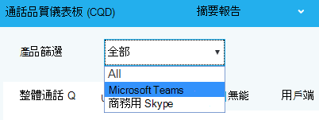
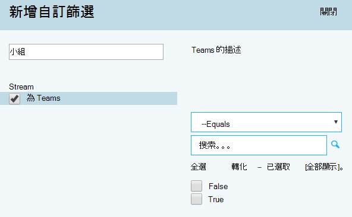

#  <a name="use-cqd-to-manage-call-and-meeting-quality-in-microsoft-teams"></a>使用 CQD 管理通話和會議品質Microsoft Teams 

本文將協助您 -Teams 系統管理員或支援及支援服務工程師 -使用 Microsoft Teams 通話品質儀表板 (CQD) 來開發監控和維護您組織的通話和會議品質的流程。 我們的指引強調音訊品質案例，因為您改善音訊體驗的任何網路改良都會轉換成改善視音訊和共用。

此指南的關鍵在於兩個已策展 [的 CQD](https://aka.ms/QERtemplates) 範本 -我們建議您先下載，然後再流覽本文中的指南。

本文假設您已經設定[CQD。](turning-on-and-using-call-quality-dashboard.md)


## <a name="categories-to-monitor-and-maintain"></a>要監控及維護的類別

一旦在會議中推出會議和語音Teams，您需要持續監控和維護的計畫。 這麼做可確保Teams一直以最佳方式執行。 此計畫應包含下列主要區域。 您也應該建立品質度量的目標，並規劃問題發生時進行疑難排解和隔離。

<table>
<thead>
<tr class="header">
<th>類別</th>
<th>描述</th>
</tr>
</thead>
<tbody>
<tr class="odd">
<td><strong>通話品質</strong></td>
<td>
<p>以組織內部電話 (，例如 VPN、WiFi、有線電話) 或外部通話來分解度量</p>
<p>建立或網路來分解度量單位</p>
<p>VPN 通話</p>
<p>使用 TCP、UDP 或 Proxy 的通話</p>
</td>
</tr>
<tr class="even">
<td><strong>通話可靠性</strong></td>
<td><p>找出並補救任何網路或防火牆問題</p>
<p>深入瞭解通話設定和下拉失敗百分比</p>
<p>瞭解大部分的通話設定和下拉失敗發生位置</p>
</td>
</tr>
<tr class="odd">
<td><strong>使用者問卷</strong></td>
<td>
<p>使用評分我的通話資料來瞭解使用者的實際體驗</p>
<p>不良體驗在哪裡發生？</p>
<p>將不良體驗與通話品質、可靠性及裝置關聯</p>
</td>
</tr>
<tr class="even">
<td><strong>裝置</strong></td>
<td><p>瞭解最常用的麥克風和喇叭，以及這些麥克風和喇叭對通話品質的影響</p>
<p>是否定期修補支援的音訊、視視、USB 和 WiFi 驅動程式？</p>
</td>
</tr>
<tr class="odd">
<td><strong>用戶端</strong></td>
<td>
<p>瞭解使用哪些用戶端類型和版本，以及這些類型與版本對通話品質和可靠性的影響  </p>
</ol></td>
</tr>
</tbody>
</table>

您可以持續評估及補救本文所述領域，以降低其潛在性，對使用者造成負面影響。 大部分的使用者問題都可以分成下列類別：

-   不完整的防火牆或 Proxy 組
-   低Wi-Fi覆蓋
-   頻寬不足
-   VPN
-   不一致的或過時的用戶端版本和驅動程式
-   優化或內建的音訊裝置
-   有問題的子網或網路裝置

透過適當的規劃與設計，Teams或 商務用 Skype Online 部署之前，您可以減少維護高品質體驗所需的工作量。

本文著重于使用通話品質儀表板 (CQD) Online 做為報告及調查每個區域的主要工具，並特別強調音訊，以最大化採用和影響。 對網路進行的任何改良，以改善音訊體驗，也會直接轉換成改善視像和桌面共用。

為了加快評估速度，我們提供了兩種經過策展的 [CQD](https://aka.ms/qertemplates) 範本：一種是管理所有網路，另一個則只針對受管理的內部網路 (篩選) 範本。 雖然所有網路範本報表已配置為顯示建築物和網路資訊，但仍可在您收集和上傳建築物資訊時使用。 將建築物資訊上傳到 CQD 可讓服務新增自訂建築物、網路和位置資訊，同時區分內部與外部子網，以增強報告功能。 詳細資訊，請參閱建立 [地圖](CQD-building-mapping.md)。

### <a name="intended-audience"></a>預定物件

本文供合作夥伴和客戶關係人使用，角色包括共同合作主管/架構、顧問、變更管理/採用專家、支援/技術支援中心潛在客戶、網路潛在客戶、桌面潛在客戶和 IT 系統管理員。

本文也供指定的品質優等者使用 () 。 詳細資訊，請參閱品質 [促進者角色](4-envision-plan-my-service-management.md#the-quality-champion-role)。


## <a name="what-is-quality"></a>什麼是品質？

在這種情況下，品質是服務度量與使用者體驗的組合。


### <a name="service-metrics"></a>服務度量

服務度量包含特定的用戶端型度量。 每次通話期間，用戶端會收集通話的遙測資料，並在每一個通話結束時提交報告，之後可在 CQD 或每個使用者通話分析中 [存取](set-up-call-analytics.md)。 這些度量 (，但不限於下列) ：

-   內 (和外) 
-   設定失敗率
-   下拉失敗率


#### <a name="poor-stream-rate"></a>低串流速率

PSR (流速率不佳) 代表組織品質不佳之串流的整體百分比。 此量值旨在強調貴組織可以集中努力以對降低此值及改善使用者體驗產生最大影響的區域，這就是為什麼在查看 PSR 時，受[](#managed-versus-unmanaged-networks)管理網路成為主要焦點的原因。 外部使用者也非常重要，但調查會依據組織而不同。 請考慮為外部使用者提供最佳做法，並獨立調查整個組織的外部通話。

CQD 中的實際度量單位會因工作量而不同，但為了本文的目的，我們主要著重于音訊不佳 _百分比_ 度量。 PSR 是由下表所述的五個網路公制平均值所決定。 若要將資料流程分類為不佳，只有一個度量必須超過定義的臨界值。 CQD 提供「因...而不佳」。以進一瞭解哪些條件導致資料流程被歸類為差。 若要深入瞭解，請參閱 [CQD 中的 Stream 分類](stream-classification-in-call-quality-dashboard.md)。

> [!Note]
> CQD 提供「因...而不佳」。以進一瞭解哪些條件導致資料流程被歸類為差。


##### <a name="audio-poor-quality-metrics"></a>音訊品質不佳的度量

| 公制平均值     | 描述     | 使用者體驗 |
|-------------|-----------------|-----------------|
| 抖動 \> 30 ms        | 這是連續封包之間延遲的平均變化。 Teams商務用 Skype緩衝來適應某些層級的抖動。 只有當抖動超過緩衝時，參與者才注意到抖動的影響。      | 以不同速度抵達的封包會讓喇叭的聲音成為聲音機器人。   |
| 封包遺失率 \> 10% 或 0.1        | 這通常定義為遺失的封包百分比。 封包遺失會直接影響音訊品質，包括小型、個別遺失的封包，這些封包幾乎不會影響到背對背的突發遺失，導致音訊完全中斷。     | 丟下且未到達預定目的地的封包會造成媒體中的空白，導致錯過音節和文字，以及斷斷續續的視像和共用。 |
| 往返時間 \> 500 ms        | 這是從點 A 取得 IP 封包到點 B 及返回點 A 所花的時間。此網路傳播延遲與兩點之間的實際距離和光速有關，並且包含網路路徑中各種裝置所額外增加的負荷。      | 封包送達目的地所需要時間過長，會造成對講臺效果。   |
| 1.0 的NMOS 降級 \> 平均值         | 平均 [網路平均意見分數 (為) ](/previous-versions/office/communications-server/bb894481(v=office.12)#network-mos) 降低。 代表網路遺失和抖動對接收音訊品質的影響，導致NMOS 降低一點以上。 | 這是一種抖動、封包遺失，以及增加往返時間的組合，程度較小。 使用者可能遇到這些症狀的組合。   |
| 隱藏樣本的平均比率 \> 7% 或 0.07 | 封包遺失修複產生的隱藏樣本的音訊框架數量與音訊框架總數之間的平均比率。 隱藏式音訊樣本是一種用來平滑通常由網路封包中斷所造成的突然轉場的技術。      | 高值表示已採用重大遺失隱藏，導致音訊扭曲或遺失。     |

##### <a name="why-do-we-prefer-to-use-streams-instead-of-calls"></a>我們為什麼偏好使用資料流程而非通話？

資料流程會讓我們知道通話的特定支線不佳 - 外接或傳入。 當您查看不良通話的通話分析時，請判斷通話品質不佳是因為該來電者的串流 (外) 或受呼叫者的串流 () 。 判斷哪一個串流會影響通話品質，對於會議來說甚至更加重要。 如果您只查看通話資料，會看到人員參與的會議數，但您不會看到哪些人員是使用中的演講者，因此螢幕分享最多。

通話資料會提供您的使用狀況度量，但未必會導致通話品質不佳的根本原因。 您可以查看串流方向，找出非受管理網路的通話、非員工 (例如廠商或其他網路使用者) 的通話等因素。 在這些情況下，如果另一個人的網路連接不佳，整個通話都會標為不佳。 您無法對外部因素執行任何操作，因此此資料沒有説明。

串流方向也可以協助找出有問題的裝置或用戶端。

 - 例如，如果您的裝置預算有限，而且只想提供大量音訊使用者的裝置，請使用音訊使用量報告 (VoIP) 並篩選輸出資料流程和會議。 尋找使用內建麥克風說話的高音量音訊使用者 -這可能與通話品質不佳 (而您可能想要為這些人提供音訊裝置) 。 為了進一步明確起見，您可以篩選封包使用方式，這將會讓您特別鎖定大量音訊使用者。 

  - 另一個範例涉及螢幕共用。 如果客戶使用舊的用戶端Teams，螢幕共用效果可能會受到影響。 您可以優先為進行大量螢幕共用的人設定用戶端升級優先順序，以解決這個問題。

 - 您可以找出串流哪個方向導致通話品質不佳，以判斷您是否有 QoS 或頻寬相關問題。 如果您尚未完全實現 QoS，或只在用戶端標記封包，而不是在傳入串流中標記封包，您可能會看到較差的通話品質。 查看串流方向，您可以更精細地查看特定方向的封包遺失、延遲或抖動。 

   - 例如，假設使用者在有線連接時抱怨使用機器人式音訊， () 。 只要查看資料流程和方向，就可以判斷問題會發生在傳入的資料流程上，僅適用于特定的一組子網。 將此資訊提供給您的網路小組之後，他們可以追蹤到未忽略媒體流量的未正確配置的 WAN 快速鍵。 網路小組重新配置 WAN 快速鍵後，抖動就會消失，通話品質也會改善。 


#### <a name="setup-failure-rate"></a>設定失敗率

設定失敗率 ，又稱為 CQD 中的總通話設定失敗百分比度量，是通話開始時端點之間無法建立媒體路徑的資料流程數目。 

這代表無法建立的任何媒體流。 由於此問題對使用者體驗影響的嚴重性，我們的目標是盡可能將此值縮小為接近零。 此公制的高值在防火牆規則不完整的新部署中比成熟部署更為常見，但定期觀看仍然很重要。

此量值的計算方式為：以未設定之資料流程總數除以在 CDR 中成功提交通話詳細記錄 (資料流程) ：

-   **設定失敗率** = 總通話設定失敗串流計數 / CDR 可用資料流程總數

#### <a name="drop-failure-rate"></a>下拉失敗率

下拉失敗率 ，又稱為CQD 中的總通話中斷百分比度量，是成功建立的媒體路徑未正常終止的資料流程百分比。

這代表意外終止的任何媒體流。 雖然此影響沒有未設定之資料流程那麼嚴重，但仍會對使用者體驗造成負面影響。 突然而經常的媒體中斷不僅會對使用者體驗造成嚴重影響，還會導致使用者需要重新連接，造成生產力 (更不用提挫折感) 。

此度量的計算方式為：以已丟棄的資料流程總數除以成功設定之資料流程的總數：

-   **下拉失敗率** = 通話中斷串流總數 / 通話設定總數成功串流計數

### <a name="define-your-target-metrics"></a>定義目標度量

本節討論我們用於評估服務健康情況的部分核心服務度量。 您可以持續評估及推動努力，讓這些量值低於其定義的目標，協助確保您的使用者獲得一致且可靠的通話品質。 首先，請使用下表中的建議目標。 根據需要調整目標，以符合您的商業目標。

<table>
<tr>
<th rowspan="2" colspan="2" valign="center">網路類型</th><th rowspan="1">品質目標</th><th colspan="2">可靠性目標</th></tr>
<tr><th>音訊品質不佳的資料流程速率</th><th>設定失敗率</th><th>下拉失敗率</th></tr>
<tr><td rowspan="2"><strong>* All</strong></td><td>內部</td><td>2.0%</td><td>0.5%</td><td>2.0%</td></tr>
<tr><td>整體</td><td>3.0%</td><td>1.0%</td><td>3.0%</td></tr>
<tr><td rowspan="5"><strong>會議</strong></td><td>內部</td><td>2.0%</td><td>0.5%</td><td>2.0%</td></tr>
<tr><td>有線內部</td><td>1.0%</td><td>0.5%</td><td>1.0%</td></tr>
<tr><td>Wi-Fi 5 GHz 內部</td><td>1.0%</td><td>0.5%</td><td>1.0%</td></tr>
<tr><td>Wi-Fi 2.4 GHz 內部</td><td>2.0%</td><td>0.5%</td><td>2.0%</td></tr>
<tr><td>整體</td><td>2.0%</td><td>0.5%</td><td>3.0%</td></tr>
<tr><td rowspan="4"><strong>P2P</strong></td><td>內部</td><td>2.0%</td><td>0.5%</td><td>2.0%</td></tr>
<tr><td>有線/Wi-Fi 5 GHz 內部</td><td>1.0%</td><td>0.5%</td><td>1.0%</td></tr>
<tr><td>有線/Wi-Fi 整體 5 GHz</td><td>2.0%</td><td>1.0%</td><td>1.0%</td></tr>
<tr><td>整體</td><td>2.0%</td><td>1.0%</td><td>3.0%</td></tr>
</table>

### <a name="user-experience"></a>使用者體驗

分析使用者體驗比科學更具藝術性，因為收集在這裡的度量不一定代表網路或服務有問題，只是只是表示使用者察覺到問題。 CQD 包含內建的問卷機制 ，即將我的通話 (RMC) ，協助評估整體使用者體驗。 RMC 會從使用者的角度，提供您下列問題的深入見解：

-   我是否知道如何使用解決方案？
-   解決方案是否容易使用且直覺，且是否支援我的日常通訊需求？
-   解決方案是否可協助我完成工作？
-   我對於解決方案的整體觀念是什麼？
-   不論我在哪裡，我隨時都可以使用解決方案嗎？
-   我可以設定和維護通話嗎？

#### <a name="rate-my-call"></a>為我的通話評分 

將我的通話 (RMC) 內建于 Teams 商務用 Skype。 每 10 個通話中就會自動出現一個，或 10%。 這份簡短的問卷會要求使用者為通話評分，並提供一些說明通話品質可能不佳的原因。 一或兩個評等會視為不佳、三到四為良好，而五為優等。 雖然這是一個有點落後的標記，但這是一個有用的度量，可找出服務度量可能會錯過的問題。

> [!Note]
> 人力因素：當通話品質良好時，使用者通常會忽略問卷，而當通話品質不佳時，使用者會填入問卷。 因此，即使服務度量良好，您的 RMC 報表可能偏態至不佳的一面。

您可以使用 CQD 來報告 RMC 使用者回應，而範例報表會包含在 CQD 範本中。 不過，本文未詳細探討這些內容。 

#### <a name="client-and-device-readiness"></a>用戶端與裝置就緒

您需要可靠的用戶端和裝置策略，協助確保您的使用者擁有一致且正面的使用者體驗。 幾個關鍵原則會推動每個準備策略。

##### <a name="client-readiness"></a>用戶端就緒

讓Teams用戶端保持最新狀態，確保您的使用者永遠獲得最佳體驗。 Microsoft 會發佈[](teams-client-update.md)經常更新至 Teams 用戶端 (除非您關閉這項功能 ，否則更新會安裝在背景中 ，我們不建議) 。 另外，請記得修補網路、視視、USB 和音訊驅動程式，因為它們經常被忽略，而且可能會影響通話和會議品質。 請考慮新增網路、Wi-Fi、視像、USB 和音訊驅動程式至您目前的修補程式管理程式。


##### <a name="device-readiness"></a>裝置就緒

只有單一策略能比您的裝置準備策略更影響使用者體驗。 例如，仰賴膝上型電腦喇叭和麥克風的使用者，在通話和會議中會聽到許多背景雜訊。 Teams設計用來處理幾乎任何裝置，但如果您遇到裝置相關問題，請查看 電話[Teams。](./devices/phones-for-teams.md)


### <a name="categories-of-quality"></a>品質類別

將一組品質管制作法營運-這為您提供最佳通話和會議品質的機會。 良好的品質管理計畫會針對這些類別：

-   **網路：** 音訊品質著重于 PSR (的低) 、TCP 使用量、有線和無線子網，以及識別 HTTP 代理和 VPN 的使用

-   **端點：** 音訊裝置和最新用戶端

-   **服務管理：** 此類別包含兩個區段：

    -   首先，Microsoft 負責管理及維護線上服務Teams商務用 Skype責任。

    -   第二項是貴組織為確保服務的可靠存取權所管理的工作，例如更新建築物資訊，以及維護新 Office 365 IP 位址的防火牆，將基礎結構新增到服務中。


檢閱下列建議維護品質的工作清單。 您應該定期執行這些工作，例如每週。

#### <a name="service-management-tasks"></a>服務管理工作

這些工作的範圍包括：確保有足夠的頻寬可連到服務而不使網際網路連結飽和、確認所有受管理網路區域都有服務品質 (QoS) ，以及保持防火牆上[Office 365 IP](/microsoft-365/enterprise/urls-and-ip-address-ranges)範圍的頂端。

#### <a name="network-tasks"></a>網路工作

網路工作有兩種類別：可靠性和品質。 可靠性著重于測量使用者成功撥打電話和保持聯繫的能力。 品質會著重于使用者的用戶端在通話期間Teams結束之後，將匯總遙測Teams並商務用 Skype至線上。 

由於可靠性對使用者體驗有重大的影響，建議您先評估並調查可靠性度量，然後再深入瞭解品質。 

#### <a name="endpoints-tasks"></a>端點工作

此類別中的主要工作移除一般用戶端更新[Teams障礙](teams-client-update.md)。 根據預設，Teams自動更新 (，除非您關閉該設定，我們不建議) 。 

您也應該監控裝置，並隨時提供更新，以找出與裝置相關的問題。

## <a name="use-cqd-to-manage-call-quality"></a>使用 CQD 管理通話品質

設定 CQD 之後，就可以開始使用 [CQD](turning-on-and-using-call-quality-dashboard.md)來管理貴組織的通話和會議品質。

大部分關於Teams的問題屬於下列類別：

-   不完整的防火牆或 Proxy 組
-   低Wi-Fi覆蓋
-   頻寬不足
-   VPN
-   不一致的或過時的用戶端版本和驅動程式
-   優化或內建的音訊裝置
-   有問題的子網或網路裝置

如果您花一些時間才推出Teams評估這些領域並補救任何不足，您就會減少維護所有使用者Teams體驗所需的工作量。 如要協助評估您的網路，以準備您的Teams推出，請參閱 Teams[](use-advisor-teams-roll-out.md)建議程式及準備您的網路[Teams。](prepare-network.md)

### <a name="expectations-using-cqd"></a>使用 CQD 的預期

使用 CQD (儀表板) ，使用電話和電話語音來深入瞭解Teams商務用 Skype品質。 CQD 是專為協助Teams系統管理員商務用 Skype網路工程師優化網路，並密切注意品質、可靠性及使用者體驗。 CQD 會查看整個組織的匯總遙測，其中整體模式可能會變得明顯;這可讓您進行明智的評定和規劃補救。 CQD 提供度量報表，可提供整體品質、可靠性及使用者體驗的深入見解。

CQD 雖然很適合用於分析趨勢和子網，但並不總是提供特定案例的特定原因。 瞭解這一點，並設定使用 CQD 時的正確預期非常重要：

-   CQD 不會提供每個案例的根本原因
-   CQD 不會包含電話系統音訊會議資料流程
-   CQD 會根據趨勢，找出進一步調查的區域

### <a name="cqd-reports-overview"></a>CQD 報表概觀

使用畫面頂端的下拉式功能表來開啟報表。 針對每個報告中提供的資料清單，請閱讀 [CQD 報告中提供的資料](CQD-data-and-reports.md#data-available-in-cqd-reports)。

2020 年 1[月新增：下載 Power BI CQD 的查詢範本](https://github.com/MicrosoftDocs/OfficeDocs-SkypeForBusiness/blob/live/Teams/downloads/CQD-Power-BI-query-templates.zip?raw=true)。 您可以Power BI自訂範本，以分析及報告您的 CQD 資料。


### <a name="teams-vs-skype-for-business"></a>Teams與商務用 Skype

CQD 可以同時報告Teams商務用 Skype。 不過，有時候您可能會想要開發報表來查看遙測Teams與商務用 Skype。

#### <a name="summary-reports"></a>摘要報表

若要修改摘要報表頁面，只查看 Teams 或 商務用 Skype，請從畫面頂端選取產品篩選下拉式功能表，然後選取您想要的產品。



#### <a name="detailed-reports"></a>詳細報告

若要篩選所有詳細報告，在瀏覽器欄中，將下列專案附加到 URL 的結尾：

```PowerShell
/filter/[AllStreams].[Is Teams]|[FALSE]
```

**例子：**

```https://cqd.teams.microsoft.com/cqd/#/1234567/2018-5/filter/[AllStreams].[Is Teams]|[FALSE]```

有關 URL 篩選的資訊，請參閱 [本節](CQD-data-and-reports.md#report-filters) 稍後的篩選報告。

若要篩選個別的詳細報表，請新增篩選 ``Is Teams`` 至報表，並設定為 True 或 False。



### <a name="managed-versus-unmanaged-networks"></a>受管理與未管理網路

根據預設，CQD 中所有的端點會分類為外部。 一旦推出建房檔案，我們可以開始查看受管理的端點資料。 如先前討論，CQD 中的網路定義為：

-   受 _管理的_ 網路 ，通常稱為內部或內部，會受到組織的影響與控制。 這包括內部 LAN、遠端 WAN 和 VPN。
-   非 _管理網路_，通常稱為外部或外部，不受組織影響或控制。 未管理網路的範例是旅館或機場網路。

### <a name="dimensions-measures-and-filters"></a>維度、度量和篩選

格式良好的 CQD 查詢包含下列三個參數：

-   **維度：** 我要如何樞紐分析資料。

-   **量值：** 我想要報告哪些內容。

-   **篩選：** 我要如何減少查詢所返回的資料集。

另一種查看方法為維度是群組函數、量值就是我感興趣的資料，而篩選是我想要將結果縮小到與查詢相關的結果的方式。 

建立 6 的子網 [維度] 顯示不良資料流程 [量值] 就是一個格式良好的查詢 **範例 。[ 篩選]**。 詳細資訊，請參閱[CQD 中可用的維度和度量。](./dimensions-and-measures-available-in-call-quality-dashboard.md)

### <a name="first-vs-second"></a>第一個與第二個 

CQD 中的許多維度和度量被歸類為第一或第二個。 CQD 不會使用來電/通話者欄位，這些欄位已重新命名第一個和第二個，因為來電者與被通話者之間有中間步驟。 下列邏輯會決定哪個端點會標示為第一個：

-   **第** 一個端點一 (會議服務器、中繼伺服器等伺服器端點) 當伺服器參與串流或通話時。

-   **第** 二個一直是用戶端端點，除非資料流程位於兩個伺服器端點之間。

-   如果兩個端點都是同一種類型，則第一個端點的選擇是根據使用者代理程式類別的內部順序。 這可確保順序一致。

有關判斷第一或第二個端點是否相同之詳細資訊，請參閱 [CQD 中可用的維度和度量](./dimensions-and-measures-available-in-call-quality-dashboard.md)。

### <a name="stream-vs-call"></a>串流與通話

您必須瞭解通話與串流的差異，以正確選擇您將在 CQD 中查看的維度或度量。 雖然 CQD 的主要焦點是資料流程，但也可以使用以通話為基礎的度量。

-   **串流：** 只有 _兩_ 個端點之間存在串流。 每個方向只有一個資料流程，而通訊需要兩個數據流。 資料流程很適合用於調查建築物、網路或子網。 在某些情況下，通話和串流會同時用於度量 (例如通話設定串流或呼叫中斷) 。 這些仍然歸類為數據流。

-   **通話：** 通話 _是_ 來自所有參與者的所有資料流程群組。 通話至少包含兩個數據流。 單一通話將至少有兩個端點，每個端點至少一個串流。

有關維度或量值是否參照通話或串流的其他指南，請參閱 [CQD 中可用的維度和量值](./dimensions-and-measures-available-in-call-quality-dashboard.md)

### <a name="good-poor-and-unclassified-calls"></a>良好、不佳和未分類的通話

通話會分類為良好、不佳或未分類。 讓我們花一點時間更詳細地討論每一個。

-   **良好或不佳：** 良好或不佳的通話包含包含一組完整服務度量的通話，服務會針對該通話產生並接收完整的 QoE 報告。 本文稍早說明判斷資料流程是否良好 [或不佳](#poor-stream-rate)。

-   **未分類：** 未分類的資料流程不包含一組完整的服務度量。 這些通話時間可能很短，通常少於 60 秒，無法計算平均值，且未產生 QoE 報表。 通話未分類最常見的原因是，很少或沒有封包使用量。 例如，參與者在靜音時加入會議，而且永不說話。 參與者正在接收媒體，但無法傳送媒體。 若未傳送媒體，CQD 就沒有任何可用於分類端點外送媒體流的度量。

若要深入瞭解，請參閱 [CQD 中的 Stream 分類](stream-classification-in-call-quality-dashboard.md)。

### <a name="common-subnets"></a>常見的子網

常見的子網是旅館、家用網路、熱點及類似區域使用的特定私人子網。 這些子網由於廣泛使用而難以分類。 如果貴組織使用其中一個常見的子網，建議您將該網路移至另一個子網。 這會在 CQD 中更輕鬆地報告。 當注意到時，所有網路範本中的報表已配置為排除這些子網，以將它們排除為品質不佳的來源。 一般子網定義如下;其影響會因組織而異。

-   10.0.0.0/24
-   192.168.0.0/24
-   192.168.1.0/24
-   192.168.2.0/24
-   172.20.10.0/24
-   192.168.43.0/24

調查使用公用子網的受管理網路時，您必須使用第二反射式本地 IP 維度來分組子網。 此維度包含端點的公用 IP 位址。


## <a name="reliability-investigations"></a>可靠性調查

改善品質的第一個步驟是評估整個組織的可靠性狀態。 由於可靠性對於良好的使用者體驗至關重要，因此我們首先從測量可靠性的兩個元件開始：

1.  **設定失敗：** 無法建立通話。

2.  **刪除失敗：** 通話已建立且意外終止。

本節將涵蓋調查這兩個區域的方法。

> [!NOTE]
> 本文並未涵蓋範本中包含的所有報告。 不過，下列說明的調查方法仍然適用。 如需詳細資訊，請參閱個別的報告描述。


### <a name="setup-failures"></a>設定失敗

優先修復此區域中的設定失敗，因為這些失敗會嚴重影響使用者體驗。

首先評估組織整體設定失敗百分比，然後根據建築物或網路的最高百分比來排列調查區域優先順序。 

#### <a name="setup-failure-trend-analysis"></a>設定失敗趨勢分析

此報表會顯示串流總數、串流設定失敗，以及串流設定失敗率。 指向任一欄以顯示其個別值。 

##### <a name="analysis"></a>分析

您可以使用此報表回答下列問題，並判斷下一個動作路線：

-   目前月份的總通話設定失敗百分比是什麼？

-   總通話設定失敗百分比是否低於或高於已定義的目標度量？

-   失敗趨勢是否比前一個月更差或更好？

-   失敗趨勢是增加、穩定還是減少？

無論您對這些問題的回答為何，請花一些時間進一步調查，使用配套子報表尋找任何可能需要修復的個別建築物或子網。 雖然整體失敗率可能低於目標度量，但一或多個建築物或網路的失敗率可能高於目標度量，需要調查。

#### <a name="setup-failure-investigations"></a>設定失敗調查 

此摘要報告可用來探索及隔離任何可能需要修復的建築物或網路。

> [!NOTE]
> 請務必將月份年報表篩選調整為目前月份。 選取 **編輯**，然後調整月份 **年** 報表篩選以儲存新的預設月份。

##### <a name="remediation"></a>修復 

將第一次修復工作集中在失敗量最大的建築物或子網上。 這會最大化使用者體驗的影響，並有助於快速降低組織通話設定失敗率。 下表列出 CQD 報告設定失敗的原因。

| 通話設定失敗原因       | 一般原因                    |
|----------------------------------|----------------------------------|
| 遺失 FW 深度封包檢查免稅規則 | 表示路徑的網路設備因為深度封包檢查規則而無法建立媒體路徑。 這是因為防火牆規則未正確配置。 在此情境中，TCP 握手成功，但 SSL 握手沒有成功。      |
| 遺失 FW IP 封鎖例外規則      | 表示路徑的網路設備無法建立媒體路徑至Microsoft 365或Office 365路徑。 這可能是因為 Proxy 或防火牆規則未正確配置以允許存取 IP 位址和埠，Teams商務用 Skype流量。 |

當您開始修復時，您可以將精力集中在特定的建築物或子網上。 如上表所示，這些問題是防火牆或 Proxy 配置所導致。 請查看下表中的選項，以採取補救動作。

|      修復      |指導方針  |
|-----------------------|----------|
| 設定防火牆 | 與您的網路小組合作，並針對您的 IP 位址Office 365[驗證防火牆組。](/microsoft-365/enterprise/urls-and-ip-address-ranges)<br><br>確認媒體 [子網](https://support.office.com/article/Office-365-URLs-and-IP-address-ranges-8548a211-3fe7-47cb-abb1-355ea5aa88a2#bkmk_teams) 和埠包含在防火牆規則中。 <br><br>確認已 [開啟防火牆](prepare-network.md) 中的必要端口。 UDP 應優先處理，因為 TCP 被視為音訊、視像和視像螢幕共用的容錯回復通訊協定，而其使用會影響通話品質。 舊版 RDP 應用程式共用只會使用 TCP。|

### <a name="drop-failures"></a>下拉失敗

與設定失敗代碼不同，CQD 沒有拖放失敗代碼，無法指出拖放失敗的原因，因此難以找出特定的根本原因。 若要更利於分類下拉式失敗，請使用推斷方法。 針對媒體的任何感興趣領域進行補救、修補用戶端和驅動程式，以及駕駛 Teams 和 商務用 Skype 認證的裝置使用量，您可以預期拖放失敗會減少。

#### <a name="drop-failure-trend-analysis"></a>下拉失敗趨勢分析

此報表會顯示音訊流的總數、總下拉失敗數，以及下拉失敗率。 指向任一欄以顯示其值。 


##### <a name="analysis"></a>分析

您可以使用此類型的報表，回答下列問題：

-   目前的下拉失敗率是什麼？
-   下拉失敗率是否低於已定義的目標度量？
-   失敗趨勢是否比前一個月更差或更好？
-   失敗趨勢是增加、穩定還是減少？

無論上述問題的答案為何，請花一些時間使用子報表調查，尋找任何可能需要修復的建築物或網路。 雖然整體下拉失敗率可能低於目標度量，但一或多個建築物或網路的拖放失敗率可能高於目標度量，需要調查。

#### <a name="drop-failure-investigations"></a>放棄失敗調查

此處報告的失敗表示未預期地中斷通話，並造成負面使用者體驗。 與熱門報告不同，這些報告可提供需要進一步調查的特定子網的其他深入資訊。


##### <a name="remediation"></a>修復

使用包含的表格報表，您可以隔離網路中拖放率高於您定義之目標度量的問題區域。 將第一次修復工作集中在總流量計數最高的建築物或子網上，以產生最大的影響。

通話丟包的常見原因：

-   資源不足的網路或網際網路出口
-   在受限制的網路上未配置 QoS
-   舊版用戶端
-   使用者行為

探索問題區域之後，您可以使用每個使用者的通話分析[](use-call-analytics-to-troubleshoot-poor-call-quality.md)來進一步審查該大樓中的使用者，瞭解特定問題。 通話分析包含其他 EUII 資料，有助於進一步隔離下拉失敗的潛在原因。

無論您的下一個步驟如何，通知您的技術支援中心已發現特定建築物或子網的問題，是一個好的做法。 這可讓技術支援人員更有效率地回應來電和分流使用者。 然後，已標上標出的使用者可以報告給工程小組，以便進一步調查。

下表列出一些常見方法來管理和補救拖放失敗。

| 修復                              | 指導方針                      |
|------------------------------------------|-------------------------------|
| **網路/網際網路**                         | **塞** 塞：請與您的網路小組合作，監控特定建築物/子網的頻寬，以確認過度使用的問題。 如果您確認有網路擠塞，請考慮增加該建築物的頻寬，或採用 QoS。 使用包含 [的品質不佳串流摘要](#quality-investigations) 報告，檢閱問題子網的抖動、延遲和封包遺失問題，因為這些問題通常會在中斷的資料流程之前發生。<br><br>**QoS：** 如果增加頻寬是不切實際或成本高的問題，請考慮實實 QoS。 此工具在管理塞塞流量方面非常有效，而且可以保證受管理網路上媒體封包的優先順序高於非媒體流量。 或者，如果沒有明確證明頻寬是主因，請考慮以下解決方案：<ul><li>[Microsoft TeamsQoS 指引](qos-in-teams.md)</li></ul><br>**執行網路就緒性評定**：網路評定會提供有關預期的頻寬使用量、如何處理頻寬和網路變更，以及適用于網路與網路Teams建議商務用 Skype。 使用上一個資料表做為來源，您擁有一份建築物或子網清單，這些建築物或子網是適合進行評估的候選項目。<ul><li>[針對 Teams 準備組織的網路](prepare-network.md)</li></ul> |
| **用戶端 (商務用 Skype Online)** | 某些較商務用 Skype用戶端有已知、有檔記載的媒體可靠性問題。 查看來自多個受影響使用者的通話分析報告，或在 CQD 中建立自訂的用戶端版本資料表報表，以總通話中斷百分比量值篩選至特定建築物或子網。 這項資訊可協助您瞭解該特定建築物中的通話丟包與用戶端的特定版本之間是否存在關係。     |
| **裝置**                                  |如果裝置是通話品質問題的原因，請考慮更新有問題的裝置。 請閱讀[手機Teams](./devices/phones-for-teams.md)以深入瞭解。 |
| **使用者行為**                            | 如果您判斷網路、裝置或用戶端都不是問題，請考慮開發使用者採用策略，教育使用者如何以最佳方式加入和離開會議。 更聰明的Teams商務用 Skype使用者將會為會議的所有參與者提供更好的使用者體驗。 例如，將膝上型電腦置於睡眠狀態 (關閉關閉) 而不結束會議的使用者，會歸類為非預期的通話下拉。   |

## <a name="quality-investigations"></a>品質調查

評估整個組織音訊品質狀態的下一個步驟是調查 PSR (、TCP 和 proxy) 品質不佳的資料流程速率。 請記得，CQD 資料不會提供您特定的根本原因，而是提供您可能的問題區域，以開始與適當的小組進行共同合作交談，以便進行補救活動。 

> [!NOTE]
> 本文並未涵蓋範本中包含的所有報告;不過，下列說明的調查方法仍然適用于這些報告。 請參閱個別報表描述以瞭解更多資訊。 

### <a name="quality"></a>品質

PSR 百分比是用來指出組織是否達到指定焦點區域已定義的度量目標。 請注意，即使高層級百分比在已定義目標之內，個別子網或建築物可能不符合已定義的目標，因此需要進一步調查。 例如，如果整體音訊 PSR 百分比在 4 月是 2%，符合樣本目標，則個別建築物和子網可能仍然體驗不佳，視該 2% 的整體分配情況。 

若要評估不良資料流程的百分比，請使用品質報告。 提供各種品質報告，以檢閱整體、會議、雙方、PSTN 通話、VPN 和會議室的度量。 提供每月、每週和每日報告以協助此程式。 每週和每日報告僅限於受管理網路範本，以提高其效能並減少雜訊。 

#### <a name="quality-trend-analysis"></a>品質趨勢分析

趨勢報告會顯示一段時間的品質資訊，並用來協助識別並瞭解每個感興趣的領域的品質趨勢。 如上所述，範本中包含報表樹狀結構，以調查品質;會議、雙方、PSTN 通話、VPN 和會議室。 為了分析品質，調查程式是相同的。 不過，建議您先從會議開始，因為會議品質的任何改善也會對所有其他區域產生正面影響。 

> [!Note]
> 調查雙方、PSTN 通話和會議室與調查會議類似。 重點是隔離品質最差的建築物或子網，並找出品質不佳的原因。

> [!Important]
> VPN 型報表會使用第二個 VPN 維度進行篩選。 此維度要求 VPN 網路介面卡正確註冊為遠端存取介面卡。 VPN 廠商無法可靠地使用此標號，您的里程會視部署在貴組織的 VPN 廠商而異。 如果需要， [請](CQD-upload-tenant-building-data.md#vpn) 使用建築物或網路名稱來修改 VPN 報表。

##### <a name="investigation"></a>調查

您可以使用這些報告來回答下列問題：

-   目前月份的總 PSR 是什麼？
-   PSR 是否低於定義的目標度量？
-   PSR 是否比上個月更差或更好？
-   PSR 趨勢是增加、穩定還是減少？

無論上述問題的答案為何，請利用子報表來尋找任何可能需要調查的建築物或子網，以花時間進行調查。 雖然整體 PSR 可能低於目標度量，但一或多個建築物或網路的 PSR 通常高於該度量，需要補救。

#### <a name="quality-investigations"></a>品質調查

品質摘要報告可深入瞭解哪些因素導致資料流程被歸類為不良，並有助於隔離受管理網路中的問題區域。

雖然每個報表所使用的維度可能稍有不同，但每個報表都會包含總計資料流程、總品質不佳、PSR 和品質不佳的量值。 已針對每個感興趣的區域建立報表：會議、雙方、PSTN 通話、VPN 和會議室。 受管理網路範本包含其他報表，以利用透過建築物檔案上傳的位置資訊。


> [!Note]
> 由於一般子網的使用廣泛，因此難以分類。 已新增另一份報表，顯示用戶端的公用 IP (第二反射式本地 IP) ，以協助修復使用共同網路的辦公室。


##### <a name="remediation"></a>修復

將修復工作焦點放在資料流量最大的建築物或子網上，因為這會最大化影響，並有助於快速改善使用者體驗。 使用抖動、封包遺失和往返時間 (RTT) 測量來瞭解品質不佳的原因 (有可能發生多個問題) ：

-   **抖動**：媒體封包會以不同的速度抵達，這會使喇叭產生聲音機器人。
-   **封包** 遺失：媒體封包遭到丟棄，這造成遺失文字或音節的影響。
-   **RTT：** 媒體封包需要很長的時間才能到達目的地，這產生了對講臺效果。

若要協助您調查品質問題，請使用每個使用者的 [通話分析](use-call-analytics-to-troubleshoot-poor-call-quality.md)。 使用通話分析，您可以查看特定會議或使用者的通話報告。 此報告會包含 EUII/PII 資料，當您尋找失敗的原因時，這項報告非常實用。 知道哪個建築物受影響之後，應該可以直接追蹤該大樓中的使用者。 

別忘了讓技術支援人員知道這些網路發生品質問題，以便快速分類及回應來電。

| 修復                              | 指導方針                         |
|------------------------------------------|----------------------------------|
| **網路**                                 | **擠** 塞：過度使用或資源不足的網路可能會導致媒體質量問題。 與網路小組合作，判斷使用者與網際網路出口點之間的網路連接是否有足夠的頻寬支援媒體。 <br><br>**執行網路就緒性評定**：網路評定會提供有關預期的頻寬使用量、如何處理頻寬和網路變更，以及適用于網路Teams建議商務用 Skype。 使用上一個資料表做為來源，您擁有一份適合評估的建築物或子網清單。<ul><li>[針對 Teams 準備組織的網路](prepare-network.md)</li></ul>|
| **服務品質 (QoS)**  | QoS 是一項久經驗證的工具，可協助在塞塞網路上排列封包的優先順序，以確保封包完整且準時送達目的地。 請考慮在貴組織中執行 QoS，以最大化頻寬受限之使用者體驗的品質。 QoS 可協助解決通常與封包遺失程度較高，以及較不嚴重地抖動和往返時間相關的問題。<ul><li>[TeamsQoS 指引](qos-in-teams.md)</li></ul> |
| **Wi-Fi**               | Wi-Fi對通話品質有重大的影響。 Wi-Fi部署通常不會考慮 VoIP 服務的網路需求，而且通常是品質不佳的來源。 有關優化您的基礎結構Wi-Fi，請參閱有關規劃Wi-Fi [文章](/skypeforbusiness/certification/plan-wifi)。<br><br>**無線驅動程式**：確保無線驅動程式是最新的。 這可協助減輕與過期驅動程式相關的任何不良使用者體驗。 許多組織在修補週期中不包含無線驅動程式，因此這些驅動程式可能會經過數年未修補。 許多無線問題都是為了確保無線驅動程式是最新的，因此可以解決。<br><br>**WMM：** 無線多媒體擴充功能 (WMM) ，也稱為 Wi-Fi 多媒體，提供無線網路的基本 QoS 功能。 新式無線網路必須支援許多裝置。 這些裝置會競相佔用頻寬，並可能導致 VoIP 服務的品質問題，因為速度與延遲至關重要。 請查閱您的無線廠商以查看特定資料，並考慮在無線網路上執行 WMM，商務用 Skype Teams優先順序。<br><br>**訪問點密度**：訪問點可能太遠，或不是在理想的位置。 若要將潛在干擾降到最低，在會議室和未受到牆面或其他物件干擾的位置放置額外的Wi-Fi訊號。<br><br>**2.4 GHz 與 5 GHz**：5 GHz 提供較少的背景干擾和較高的速度，在部署 VoIP 時，應優先處理 Wi-Fi。 不過，5 GHz 沒有 2.4 GHz 那麼強，而且無法輕易穿透牆面。 請閱閱您的建築物版面配置，決定您可以仰賴哪一個頻率來獲得最佳連接。 |
|**網路裝置** | 較大的組織可能有數百個裝置散佈于整個網路。 與您的網路小組合作，確保使用者與網際網路之間的網路裝置維持最新狀態。 |
| **VPN**  | VPN 裝置在傳統設計上無法處理即時媒體工作負載。 某些 VPN 組組禁止使用 UDP (這是媒體使用者偏好的通訊協定) 僅仰賴 TCP。 請考慮執行 VPN 分割管道解決方案，協助降低 VPN 品質不佳的來源。 |
| **用戶端** <br> (商務用 Skype線上)  | 確保所有用戶端都定期更新。 |
| **裝置** | 如果裝置是通話品質問題的原因，請考慮更新有問題的裝置。 請閱讀[手機Teams](./devices/phones-for-teams.md)以深入瞭解。 |
| **司機** | 將乙太網 (和 Wi-Fi) 、音訊、視像和 USB 驅動程式修補網路應該成為您整體修補程式管理原則的一部分。 更新驅動程式可以解決許多品質問題。 |
| **Wi-Fi 上的會議室** | 我們強烈建議使用至少 1-Gbps 乙太網路連接，將會議室裝置連接到網路。 會議室裝置通常包含多個音訊和視音訊流，以及會議內容 ，例如螢幕分享，而且與其他 Teams 或商務用 Skype網路需求較高。 根據定義，會議室是固定式裝置，Wi-Fi安裝期間才能享有權益。<br><br>必須格外小心處理會議室，以確保使用這些裝置的體驗符合或超出預期。 會議室的品質問題通常會快速升級，因為資深員工通常會使用這些問題。<br><br>除了便利性 (之外，) ，Wi-Fi通常不如有線連接。 隨著「攜帶您自己的裝置」政策以及膝上型電腦Wi-Fi，這些訪問點通常會過度使用。 即時媒體可能不會在網路上Wi-Fi優先順序，這可能會導致使用高峰期間的品質問題。 這種大量使用方式可能會與會議同時發生，會議可能有十多人出席，每個人員都有自己的膝上型電腦和智慧型手機，都連接到與會議室Wi-Fi相同的存取點。<br><br>Wi-Fi行動裝置安裝或已正確配置 Wi-Fi支援商務級即時媒體時，系統才應將 Wi-Fi 視為暫時解決方案。 |


### <a name="tcp"></a>TCP 

TCP (傳輸) 通訊協定被視為容錯移轉傳輸，而非即時媒體的主要傳輸。 這是容錯回復傳輸的原因，是因為 TCP 的狀態性質。 例如，如果在潛在網路上進行通話，而媒體封包延遲，則幾秒鐘前不再有用的封包會為了取得收件者而競相取得頻寬，這會使情況更壞。 這會使音訊修復器進行拼接和伸展音訊，導致聲音失真，通常以抖動的形式出現。

本節中的報告不會區分良好和不佳的資料流程。 如果採用 UDP，報告會尋找 TCP 在 VBSS 中用於音訊、視像和視 (螢幕) 。 不良的資料流程速率可協助比較 UDP 品質與 TCP 品質，這樣您才能專注于影響最大的地方。 TCP 使用量主要由不完整的防火牆規則所導致。 有關適用于線上和線上Teams防火牆規則商務用 Skype，請參閱MICROSOFT 365及Office 365 URL 和[IP 位址範圍](/microsoft-365/enterprise/urls-and-ip-address-ranges)。

> [!Note]
> 音訊、視視和 VBSS 都偏好 UDP 做為主要傳輸。 舊版 RDP 應用程式共用工作負載只使用 TCP。

#### <a name="tcp-usage"></a>TCP 使用量

TCP 報告會指出過去七個月的整體 TCP 使用量。 本節中所有進一步的報告將著重于縮小最常使用 TCP 的特定建築物和子網。 會議與雙方資料流程都有個別的報告。


##### <a name="investigation"></a>調查

您可以使用此報表回答下列問題：

-   當月 TCP 資料流程的總流量是什麼？
-   情況是否比前一個月更差或更好？
-   TCP 使用量趨勢是增加、穩定還是減少？
-   TCP PSR 是否與整體 PSR 相同？

如果您發現 TCP 使用量趨勢增加或高於一般每月使用量，請花一些時間調查，使用子報表尋找任何可能需要補救的建築物或網路。 在理想情況下，您希望在受管理的網路上盡可能少使用 TCP 型音訊會話。

#### <a name="tcp-vs-udp"></a>TCP 與 UDP

此報告會針對 VBSS 中的音訊、視像和視音訊螢幕共用，識別最新月份 TCP 與 UDP 使用方式報告 (量) 。 


##### <a name="analysis"></a>分析

雖然您想要盡可能減少 TCP 使用量，但您可能會在健康部署中看到一些 TCP 使用量。 TCP 本身不會造成通話品質不佳，因此會提供串流費率，協助識別 TCP 使用量是否導致品質不佳。 

#### <a name="tcp-investigations"></a>TCP 調查

在提供的 CQD 範本中，使用受管理網路或所有網路範本，以建立和子網報表流覽至 TCP 資料流程。 為了調查 TCP 使用方式，程式相同，因此我們將討論焦點放在會議上。


##### <a name="remediation"></a>修復

此報表會識別導致 TCP 使用量的特定建築物和子網。 此外，也會包含其他報告，以識別通話中使用的 Microsoft Relay IP，協助隔離遺漏的防火牆規則。 將修復工作焦點放在 TCP 資料流程數量最高的建築物上，以最大化影響。

TCP 使用最常見的原因是防火牆或代理中缺少例外規則。 我們將在下一節中討論代理，因此您目前的工作焦點會放在防火牆上。 您可以使用提供的建築物或子網，判斷需要更新哪些防火牆。

| 修復        | 指導方針     |
|--------------------|--------------------------------------|
| 設定防火牆 | 確認您的[Microsoft 365或Office 365](/microsoft-365/enterprise/urls-and-ip-address-ranges) IP 埠和位址已排除在防火牆之外。 針對與媒體相關的 TCP 問題，請專注于下列專案：<ul><li>確認用戶端媒體子網 13.107.64.0/18 和 52.112.0.0/14 在防火牆規則中。</li><li>UDP 埠 3478-3481 是所需的媒體埠，必須開啟，否則用戶端會容錯移轉回 TCP 埠 443。</li></ul> |
| 驗證             | 使用[Microsoft 網路評定工具](https://www.microsoft.com/download/details.aspx?id=53885)，檢查與受影響建築物或子網Microsoft 365或Office 365 IP 位址和埠的連接問題。    |

### <a name="http-proxy"></a>HTTP Proxy

HTTP 代理並非建立媒體會話的首選路徑，原因有很多。 許多包含深度封包檢查功能，可防止服務連接完成並造成中斷。 此外，幾乎所有代理都強制 TCP，而不是允許 UDP，這是最佳音訊品質的建議。

我們一直建議您將用戶端設定為直接連接到Teams商務用 Skype服務。 這對媒體型流量特別重要。


> [!IMPORTANT]
> 我們建議您上傳有效的 [建築物檔案，](CQD-upload-tenant-building-data.md) 以便分析 Proxy 使用方式時，區別內部與外部音訊流。 


#### <a name="http-proxy-usage"></a>HTTP Proxy 使用量

範本此區段的 HTTP Proxy 串流報表與 TCP 報表非常類似。 它不會查看通話是否不佳或良好，而是查看通話是否通過 HTTP 連接。


##### <a name="analysis"></a>分析

您想要查看盡可能少的 HTTP 媒體流。 如果您有資料流程在 Proxy 中移動，請查閱網路小組，以確保有適當的排除專案，讓用戶端直接路由至 Teams 或 商務用 Skype 媒體子網。

如果貴組織中只有一個網際網路 Proxy，請確認正確的 URL Microsoft 365或Office 365 URL 和[IP 位址範圍排除。](/microsoft-365/enterprise/urls-and-ip-address-ranges) 如果貴組織中已配置多個網際網路 Proxy，請使用 HTTP 子報表來隔離受影響的建築物或子網。

對於無法跳過 Proxy 的組織，請確保 商務用 Skype 用戶端在位於 Proxy 後面時已正確登錄，如 商務用 Skype 一文所述，應該使用 Proxy 伺服器來登錄[，](https://support.microsoft.com/help/3207112/skype-for-business-should-use-proxy-server-to-sign-in-instead-of-tryin)而不是嘗試直接連接。 


#### <a name="http-proxy-investigations"></a>HTTP Proxy 調查

此報表會識別導致 HTTP 使用量的特定建築物和子網。


##### <a name="remediation"></a>修復

我們建議您[一](proxy-servers-for-skype-for-business-online.md)直忽略商務用 Skype的Teams，尤其是媒體流量。 代理不會讓商務用 Skype更安全，因為它的流量已經加密。 與績效相關的問題可能會透過延遲和封包遺失而引入環境。 這類問題會導致音訊、視像和螢幕分享的負面體驗，即時資料流不可或缺。

HTTP 使用最常見的原因是在代理中缺少例外規則。 您可以使用提供的建築物或子網，快速判斷哪些 Proxy 需要針對媒體旁路進行配置。

確認所需的[FQDns Microsoft 365或Office 365新](/microsoft-365/enterprise/urls-and-ip-address-ranges)加入 Proxy 中的允許清單。

## <a name="endpoint-investigations"></a>端點調查

本節著重于報告用戶端版本的工作，以及認證裝置的使用。 報告可概述用戶端版本、用戶端類型、捕獲裝置和驅動程式的使用方式 (麥克風) 、視Wi-Fi廠商和驅動程式版本。

> [!NOTE]
> 本文並未涵蓋範本中包含的所有報告;不過，下列說明的調查方法仍然適用。 請參閱個別報表描述以瞭解更多資訊。

### <a name="client-versions"></a>用戶端版本

這些報告著重于識別商務用 Skype用戶端版本及其環境中的相對數量。

> [!IMPORTANT]
> 目前，Teams用戶端會透過 Azure 帳戶內容傳遞網路並自動更新，服務會保持在最新狀態。 因此，您不需要監控用戶端Teams版本 (，除非您關閉自動更新，我們不建議) 。

除非您排除聯合參與者資料，否則這些報告會包含來自聯盟端點的用戶端遙測。 若要排除聯盟端點，您必須新增第二個租使用者識別碼的查詢篩選設定為貴組織的租 [使用者識別碼](CQD-data-and-reports.md#how-to-find-your-tenant-id)。 或者，您可以使用 [URL](CQD-data-and-reports.md#url-filters) 篩選來排除聯合參與者遙測。


#### <a name="remediation"></a>修復

推動高品質使用者體驗的一個關鍵區段，是確保受管理的用戶端執行最新版的 商務用 Skype，以及確保支援的音訊、視音訊、網路和 USB 驅動程式是最新版本。 這有幾個優點，包括： 

-   與許多版本相比，管理幾個版本更容易。
-   它可提供一致的體驗。
-   它可更輕鬆地針對通話品質和可用性問題進行疑難排解。
-   Microsoft 會持續在產品上進行一般改良和優化。 確保使用者收到這些更新，可以減少他們發生已經解決之問題的風險。

將部署限制在 6 個月以下的用戶端版本，將會減少需要支援的版本數量，以改善整體使用者體驗並改善可管理性。

如果您只使用 [按一下Office，您會自動在 6 個月的視窗中。 不需要執行其他動作。

如果您混合使用 [從按一下到執行 (MSI) 安裝程式套件，您可以使用報表來驗證 MSI 用戶端是否定期更新。 如果您發現用戶端落後，請與負責管理更新Office小組合作，並確保他們定期核准及部署用戶端修補程式。

此外，還必須考慮並確保網路、視像、USB 和音訊驅動程式也受到修補。 您可以輕鬆忽略這些驅動程式，而不要將它們納入您的修補程式管理原則中。

您可以透過下列商務用 Skype找到該版本的版本號碼：

-   [更新至更新的發行Microsoft 365 Apps](/officeupdates/release-notes-office365-proplus)
-   [更新 Microsoft 365 Apps 企業版](/officeupdates/update-history-office365-proplus-by-date)
-   [商務用 Skype 的下載及更新](/SkypeForBusiness/software-updates)

### <a name="devices"></a>裝置

若要使用麥克風裝置報告，我們需要瞭解 MOS (平均) 。 MOS 是金本位測量，可測量感知的音訊品質。 它以 0 到 5 的整數分級表示。

所有語音品質測量的基礎，就是一個人對語音品質的感知。 由於它受到人的感知影響，因此其本質上是一種具有主體性。 有好幾種不同的方法可以進行實驗性測試。 大部分的語音品質量值是根據 ACR 和 (絕對) 分級。

在 ACR 的不檢點測試中，具有統計意義的人會以 1 (到 5 () 品質) 。 分數的平均值是 MOS。 產生的 MOS 取決於向群組公開的體驗範圍，以及被評分的體驗類型。

由於對即時通訊系統進行語音品質的不實際性測試，Microsoft Teams 和 商務用 Skype 會使用進一步演算法，以目標預測實驗結果來產生 MOS 值。

可用的 MOS 和相關度量提供音訊裝置提供給使用者的體驗品質的視圖。 

為使用者提供經 Teams 和 商務用 Skype 認證的裝置，可以減少因裝置本身而遭遇負面體驗的可能性 (例如內建的膝上型電腦喇叭和麥克風) 。 如要詳細資訊，請參閱認證計畫與合作夥伴解決方案[](/SkypeForBusiness/certification/overview)[目錄的這些文章](https://partnersolutions.skypeforbusiness.com/solutionscatalog/personal-peripherals-pcs)。

裝置報告可用來根據音量和 MOS 分數來評估裝置使用方式 (音訊) ，並可在用戶端與裝置下的隨附範本&找到。 

> [!IMPORTANT]
> 除非您排除聯合參與者資料，否則這些報告會包含來自聯盟端點的用戶端遙測。 若要排除聯盟端點，您必須新增第二個租使用者 **識別碼** 的查詢篩選，以設定為貴組織的租 [使用者識別碼](CQD-data-and-reports.md#how-to-find-your-tenant-id)。 首先，您可以使用 [URL](CQD-data-and-reports.md#url-filters) 篩選來排除聯合參與者遙測。


> [!Note]
> 當您檢視此報表時，您可能會發現同一個裝置已報告多次。 這是因為向 CQD 報告裝置的方式。 硬體和操作系統地區設定的差異會造成裝置資料的報告方法不同。

##### <a name="remediation"></a>修復

一般來說，您需要探索並淘汰未通過認證的裝置，並取代為認證裝置。 在審查裝置報告時，有些考慮包括：

-   使用中的裝置是否經過Teams商務用 Skype？ 
-   您可以使用每個使用者的通話分析來識別特定裝置 [的使用者](use-call-analytics-to-troubleshoot-poor-call-quality.md)。 檢查以確保他們擁有最新的裝置驅動程式，而且他們的裝置未透過 USB 集線器或固定站連接。 
-   使用的不同驅動程式版本有多少種？ 它們是否定期修補？ 確保定期修補音訊、視Wi-Fi驅動程式，有助於消除品質問題的來源，讓使用者體驗更可預測且更一致。

##### <a name="audio"></a>音訊

下一個工作就是決定認證音訊裝置 [的整體使用狀況](https://partnersolutions.skypeforbusiness.com/solutionscatalog/personal-peripherals-pcs)。 我們建議您至少 80% 的音訊流使用經過認證的音訊裝置。 最好的方式就是將麥克風裝置報表匯出Excel，以計算通過認證的或核准的裝置使用量。 組織通常會保留所有核准的裝置清單，因此篩選和排序資料應該非常簡單。

##### <a name="video"></a>影片

視音訊驅動程式也非常重要，可以持續更新。 確保視像卡定期修補，有助於排除視音訊磁碟機是視音訊流品質不佳的來源。 使用 [認證視像裝置](https://partnersolutions.skypeforbusiness.com/solutionscatalog/personal-peripherals-pcs) 有助於確保流暢且高品質的使用者體驗。 支援 H.264 原生編碼的視像裝置是首選，以減少視訊會議期間 CPU 使用量。

##### <a name="wi-fi"></a>Wi-Fi

Wi-Fi驅動程式也需要以一般步頻進行修補，並且應該包含在您的修補程式管理原則中。 許多品質問題都可以維持最新的驅動程式Wi-Fi修正。 有關優化您的基礎結構Wi-Fi，請參閱有關規劃Wi-Fi [文章](/skypeforbusiness/certification/networking-wifi)。


## <a name="related-topics"></a>相關主題

[使用顧問Teams](use-advisor-teams-roll-out.md)

[準備用於 Teams 的網路](prepare-network.md)

[Office 365網路連接原則](/microsoft-365/enterprise/microsoft-365-network-connectivity-principles)

[Teams 分析與報告](teams-analytics-and-reports/teams-reporting-reference.md)

[在 Teams 中管理裝置](./devices/device-management.md)

[改善及監控通話品質Teams](monitor-call-quality-qos.md)

[什麼是 CQD？](CQD-what-is-call-quality-dashboard.md)

[設定通話品質儀表板 (CQD) ](turning-on-and-using-call-quality-dashboard.md)

[Upload租使用者和建築物資料](CQD-upload-tenant-building-data.md)

[CQD 資料和報表](CQD-data-and-reports.md)

[CQD 中可用的維度和度量](dimensions-and-measures-available-in-call-quality-dashboard.md)

[CQD 中的資料流程分類](stream-classification-in-call-quality-dashboard.md)

[使用 Power BI分析 CQD 資料](CQD-Power-BI-query-templates.md)